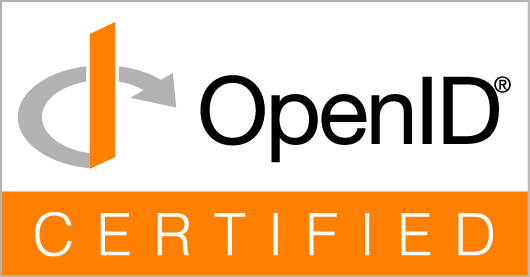

# Authrim

> **Open Source Identity & Access Platform for the modern web**

An open-source, serverless **Identity Hub** that combines authentication, authorization, and identity federation on **Cloudflare's global edge network**.

[](LICENSE)
[](https://www.typescriptlang.org/)
[](https://workers.cloudflare.com/)
[](https://app.fossa.com/projects/git%2Bgithub.com%2Fsgrastar%2Fauthrim?ref=badge_shield)

<table>
<tr>
<td>
<a href="https://openid.net/certification/">
  
</a>
</td>
<td>
✓ <a href="https://openid.net/certification/certified-openid-providers-profiles/">OpenID Provider</a> (7 profiles)<br>
✓ <a href="https://openid.net/certification/certified-openid-providers-for-logout-profiles/">Logout Profiles</a> (4 profiles)
</td>
</tr>
</table>

## ⚠️ Pre-1.0 Software

Authrim is functional but pre-1.0. APIs may change, and no formal security audit has been completed yet.
Evaluate thoroughly before production use.
Production hardening is tracked against documented deployment, operations, recovery, auditability, and protocol/security validation criteria in the roadmap.

## Vision

**Authrim** is a unified Identity & Access Platform combining:

- **Authentication** — OIDC Provider, Social Login, Passkey, SAML
- **Authorization** — RBAC, ABAC, ReBAC policy engine built-in
- **Identity Federation** — Multiple identity sources into one unified identity

Designed for low-latency edge deployment on Cloudflare Workers.

```bash
npx @authrim/setup
```

[Read the full vision](./docs/VISION.md)

## Quick Start

### Option 1: Using the published setup package (Recommended)

```bash
# Interactive setup from npm
npx @authrim/setup

# Or CLI mode for terminal-based setup
npx @authrim/setup --cli
```

The setup package can download the Authrim source into a local project directory before provisioning and deployment.

The setup wizard will guide you through:
- Cloudflare authentication
- Resource provisioning (D1, KV, Queues)
- Key generation
- Worker deployment
- Initial admin creation

### Option 2: Clone the source and run the setup tool

Use this path when you want to inspect or modify the source code while still using the setup workflow.

```bash
# 1. Clone and install
git clone https://github.com/sgrastar/authrim.git
cd authrim
pnpm install

# 2. Launch the local setup tool
pnpm run setup
```

The local setup command runs the same setup package from the workspace source.

### Option 3: Manual Setup (Development)

```bash
# 1. Clone and install
git clone https://github.com/sgrastar/authrim.git
cd authrim
pnpm install

# 2. Setup (generates keys, configures local environment)
./scripts/setup-keys.sh
./scripts/setup-local-wrangler.sh
./scripts/setup-kv.sh --env=dev
./scripts/setup-d1.sh

# 3. Run locally
pnpm run dev
# → http://localhost:8787/.well-known/openid-configuration
```

📚 **Full guides:** [Development](./docs/getting-started/development.md) | [Deployment](./docs/getting-started/deployment.md) | [Testing](./docs/getting-started/testing.md) | [Setup CLI](./packages/setup/README.md)

## Performance

K6 Cloud distributed load testing in December 2025 validated Authrim's current sharded Workers architecture under representative OIDC workloads.

Observed benchmark results include:

- Token-oriented endpoints: **2,500-3,500 RPS** within tested capacity limits
- Full 5-step OAuth login flow: **150 logins/sec** with P95 around 756ms
- CPU time: typically **1-4ms** in the tested scenarios

Capacity depends on workload shape, Cloudflare plan limits, storage usage, and sharding configuration.

[View detailed reports](./load-testing/reports/Dec2025/)

## Approximate Cloudflare Cost (Reference Only)

⚠️ The following table is a **rough reference only**.  
Actual costs depend on request volume, CPU time, and usage of KV / D1 / R2.

| Product Scale                   | Users (Total) | Est. CF Cost | Notes                                |
| ------------------------------- | ------------: | -----------: | ------------------------------------ |
| Side project / Portfolio        |           ~1K |         Free | Workers Free tier (limited requests) |
| Internal tool / Small community |          ~10K |       ~$5/mo | Paid plan base                       |
| Startup SaaS / Small e-commerce |          ~50K |    ~$5–15/mo | Light API usage                      |
| Growing B2B SaaS                |         ~100K |   ~$15–30/mo | Moderate auth traffic                |
| Mid-size consumer app           |         ~500K |   ~$30–60/mo | KV/DO costs accumulate               |
| Enterprise SaaS                 |           ~1M |  ~$60–120/mo | Cached / sharded                     |
| High-traffic consumer service   |           ~5M | ~$150–300/mo | Heavy auth traffic                   |
| Large-scale platform            |          ~10M | ~$300–600/mo | 150 login/sec tested                 |

### Assumptions

- Workers Paid plan ($5/month)
- Optimized request patterns (caching, batching)
- Typical authentication flows (OIDC, token refresh)
- Excludes large R2 storage and excessive KV/D1 writes
- Assumes ~20% DAU with weekly logins
- Authrim scales primarily with **requests and CPU time**, not with user count

### Verified by Load Testing (Dec 2025)

| Metric                 | Value                 | Cost         |
| ---------------------- | --------------------- | ------------ |
| Workers Requests       | 18M/month             | $5.70 (7%)   |
| KV Reads               | 78M/month             | $39.00 (44%) |
| DO Requests + Duration | 64M/month             | $22.10 (25%) |
| D1 Writes              | 6.8M rows             | $7.00 (8%)   |
| Base fee               | —                     | $5.00 (6%)   |
| **Total (excl. tax)**  | **≈ 5M users equiv.** | **$79.78**   |

**Request-to-User conversion:**

- 1 OIDC login ≈ 4 requests (authorize → token → userinfo → discovery)
- 18M requests ≈ 4.5M logins/month
- With 20% DAU and weekly login assumption → **~5M total users equivalent**

> Infrastructure cost only (self-hosted). No vendor fees. See [Cloudflare pricing](https://developers.cloudflare.com/workers/platform/pricing/) for details.

---

## Current Status

Authrim is currently pre-1.0. Core protocol and platform capabilities are implemented, but production hardening is still in progress.

**Target release window:** Summer/Fall 2026

| Area | Status |
| ----- | ------ |
| Core OIDC/OAuth implementation | Implemented |
| FAPI profiles | Implemented; certification target |
| CIBA | Implemented; certification target |
| SAML 2.0 IdP/SP | Active; implementation substantially complete |
| SCIM 2.0 | Implemented |
| RBAC / ABAC / ReBAC policy engine | Implemented |
| Identity Hub and external IdP integration | Implemented |
| Passkey / email auth / local auth | Implemented; production flow hardening in progress |
| JavaScript SDKs | Implemented |
| Setup tooling | Implemented; production deployment docs in progress |
| UI consolidation | Active |
| Security, QA, and validation | Active |
| Storage portability | Implementation baseline complete; validation active |
| Multi-tenant isolation | Implementation baseline complete; validation active |

[View detailed roadmap](./docs/ROADMAP.md)

---

## Technical Stack

### Backend (API)

| Layer         | Technology                | Version  | Purpose                            |
| ------------- | ------------------------- | -------- | ---------------------------------- |
| **Runtime**   | Cloudflare Workers        | -        | Global edge deployment             |
| **Framework** | Hono                      | 4.12.x   | Fast, lightweight web framework    |
| **Language**  | TypeScript                | 5.9.x    | Type-safe development              |
| **Build**     | Turbo + pnpm              | 2.6.x / 9.x | Monorepo, parallel builds, caching |
| **Deployment** | Wrangler                 | 4.59.x   | Workers deployment and local runtime |
| **Storage**   | KV / D1 / Durable Objects / Hyperdrive | - | Cloudflare-native persistence with external database paths where supported |
| **Crypto**    | JOSE                      | 6.1.x    | JWT/JWS/JWE/JWK (RS256, ES256)     |
| **WebAuthn**  | SimpleWebAuthn            | 13.2.x   | Passkey authentication             |
| **SAML**      | xmldom + xml-crypto + pako | -       | SAML 2.0 XML processing, signatures, and bindings |
| **Email**     | Resend                    | 6.5.x    | Magic Link, OTP delivery           |
| **Testing**   | Vitest + Playwright       | 4.0.x / 1.56.x | Unit, integration, and E2E tests |

### Frontend (UI)

| Layer          | Technology               | Version   | Purpose                        |
| -------------- | ------------------------ | --------- | ------------------------------ |
| **Framework**  | SvelteKit + Svelte       | 2.53.x / 5.53.x | Modern reactive framework |
| **Deployment** | Cloudflare Workers static assets | - | UI Workers and global edge delivery |
| **Build**      | Vite                     | 7.2.x     | UI build and dev server        |
| **CSS**        | UnoCSS                   | 66.5.x    | Utility-first CSS              |
| **Components** | Melt UI                  | 0.86.x    | Headless, accessible components |
| **i18n**       | typesafe-i18n            | 5.26.x    | Type-safe internationalization |
| **WebAuthn**   | SimpleWebAuthn Browser   | 13.2.x    | Client-side passkey support    |
| **Testing**    | Vitest + Testing Library | 4.0.x     | Component tests                |

## Features

| Area | Implementation | Operational maturity | Notes |
| --- | --- | --- | --- |
| OpenID Provider | Complete | Ready | Certified OpenID Provider and Logout profiles |
| OAuth/OIDC advanced profiles | Complete | In progress | PAR, DPoP, JAR, JARM, JWE, claims policy, token exchange |
| FAPI profiles | Complete | In progress | FAPI 2.0 policy controls and certification profiles; formal certification is planned |
| SAML 2.0 IdP/SP | Hardening active | In progress | Tenant-scoped IdP/SP endpoints, metadata import/export, signing rollover, encryption options, SSO/SLO correlation, and DR planning |
| SCIM 2.0 | Complete | In progress | User provisioning |
| Authentication | Complete | In progress | Passkey, email code, social login, Direct Auth, device flow, CIBA |
| CIBA | Complete | In progress | Backchannel authentication, approval, polling, and request storage paths |
| Native SSO | Complete | In progress | `device_secret`, `ds_hash`, and DPoP-bound token exchange support |
| Authorization | Complete | In progress | RBAC, ABAC, ReBAC, token embedding, real-time check API |
| Identity Hub | Complete | In progress | External IdP integration, account linking, identity stitching |
| VC/DID | Complete | Experimental | OpenID4VP, OpenID4VCI, did:web, did:key |
| SDKs | Complete | In progress | Core, web, server, and SvelteKit packages |
| Admin/Login UI | Basic complete | In progress | Consolidation and production flow hardening remain active |
| Runtime storage profiles | Basic complete | In progress | Runtime profiles and Hyperdrive-backed user core, PII, custom/extension, and audit paths exist; control-plane storage remains D1/KV-biased |
| Multi-tenancy isolation | Baseline complete | In progress | Tenant-scoped issuer routing, storage access, admin boundaries, job artifacts, and regression coverage are in place |

See [Feature Matrix](./docs/FEATURES.md) for a more detailed capability and SDK overview.

---

## Contributing

Authrim is open source under Apache 2.0, currently maintained by a single author.

- 🐛 **Bug reports** — Welcome via [GitHub Issues](https://github.com/sgrastar/authrim/issues)
- 💡 **Feature requests** — Welcome via [GitHub Discussions](https://github.com/sgrastar/authrim/discussions)
- 🔧 **Pull requests** — Not accepted at this time (see [CONTRIBUTING.md](./CONTRIBUTING.md) for details)

---

## License

Apache License 2.0 © 2025 [Yuta Hoshina](https://github.com/sgrastar)

See [LICENSE](./LICENSE) for details.

---


[](https://app.fossa.com/projects/git%2Bgithub.com%2Fsgrastar%2Fauthrim?ref=badge_large)

## Community

- **GitHub**: [sgrastar/authrim](https://github.com/sgrastar/authrim)
- **Issues**: [Report bugs](https://github.com/sgrastar/authrim/issues)
- **Discussions**: [Feature requests](https://github.com/sgrastar/authrim/discussions)
- **Email**: yuta@sgrastar.org

---

> **Authrim** — _Identity & Access at the edge of everywhere_
>
> **Status:** Pre-1.0 | Target release window: Summer/Fall 2026 | Production hardening in progress
>
> _A self-hosted Identity & Access Platform for modern applications._
>
> ```bash
> npx @authrim/setup
> ```
