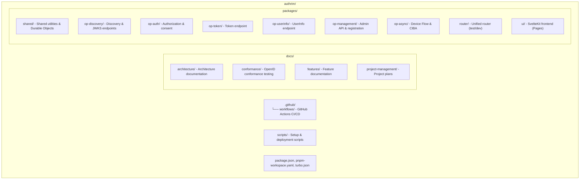
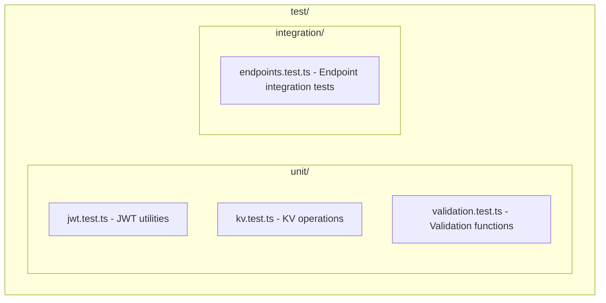

# Development Guide

This guide will help you set up your development environment for Authrim.

## Table of Contents

- [Prerequisites](#prerequisites)
- [Initial Setup](#initial-setup)
- [Configuration](#configuration)
- [Development Workflow](#development-workflow)
- [Testing](#testing)
- [Deployment](#deployment)
- [Troubleshooting](#troubleshooting)

## Prerequisites

Before you begin, ensure you have the following installed:

- **Node.js** ≥18.0.0 ([Download](https://nodejs.org/))
- **npm** (comes with Node.js)
- **Git** ([Download](https://git-scm.com/))
- **Cloudflare account** (for deployment)

## Initial Setup

### Method 1: Configuration-Based Setup (Recommended)

The new unified setup process supports all deployment patterns (A-D) and is the recommended approach for both development and production.

```bash
# 1. Clone the repository
git clone https://github.com/YOUR-USERNAME/authrim.git
cd authrim

# 2. Install dependencies
pnpm install

# 3. Install Wrangler CLI (if not already installed globally)
pnpm install -g wrangler

# 4. Login to Cloudflare
wrangler login

# 5. Create configuration file (interactive)
./scripts/setup-config.sh

# 6. Build and deploy based on configuration
./scripts/build.sh --config authrim-config-1.0.0.json
```

**Features:**
- ✅ **Interactive Setup** - Guided configuration for all deployment patterns
- ✅ **Pattern Support** - Pattern A (Unified), B (Separate Admin), C (Multi-Domain), D (Headless)
- ✅ **Conflict Detection** - Checks for existing resources before deployment
- ✅ **Version Management** - Configuration files are versioned for easy rollback

See [Architecture Patterns](./docs/ARCHITECTURE_PATTERNS.md) for details on deployment patterns.

### Method 2: Manual Setup (Legacy)

For advanced users who prefer manual control:

```bash
# 1. Clone the repository
git clone https://github.com/YOUR-USERNAME/authrim.git
cd authrim

# 2. Install dependencies
pnpm install

# 3. Install Wrangler CLI (if not already installed globally)
pnpm install -g wrangler
```

This will install:
- **Hono** - Web framework
- **jose** - JWT/JWK library
- **Wrangler** - Cloudflare Workers CLI
- **TypeScript** - Type-safe JavaScript
- **Vitest** - Testing framework
- **ESLint** & **Prettier** - Code quality tools

## Configuration (Manual Setup)

### 1. Cloudflare KV Namespaces

Create the required KV namespaces:

```bash
# Create KV namespaces for development
wrangler kv namespace create "AUTH_CODES"
wrangler kv namespace create "STATE_STORE"
wrangler kv namespace create "NONCE_STORE"
wrangler kv namespace create "CLIENTS"

# Create preview namespaces
wrangler kv namespace create "AUTH_CODES" --preview
wrangler kv namespace create "STATE_STORE" --preview
wrangler kv namespace create "NONCE_STORE" --preview
wrangler kv namespace create "CLIENTS" --preview
```

Update `wrangler.toml` with the generated namespace IDs.

### 2. Generate RSA Key Pair

Generate RSA keys for JWT signing (development):

```bash
pnpm run generate-keys
```

This will:
- Generate a 2048-bit RSA key pair
- Display the private key (store in Wrangler secrets)
- Display the public key JWK (for verification)

### 3. Store Secrets

Store the private key as a secret:

```bash
# For development environment
wrangler secret put PRIVATE_KEY --env development

# Paste the private key when prompted
```

### 4. Environment Variables

The `wrangler.toml` file contains the following environment variables:

```toml
[vars]
ISSUER_URL = "http://localhost:8787"
TOKEN_EXPIRY = "3600"        # 1 hour
CODE_EXPIRY = "120"          # 2 minutes
STATE_EXPIRY = "300"         # 5 minutes
NONCE_EXPIRY = "300"         # 5 minutes
KEY_ID = "dev-key-XXXXXXXXXX"
```

Update these as needed for your environment.

## Development Workflow

### Start Development Server

```bash
pnpm run dev
```

This starts Wrangler in development mode on `http://localhost:8787`.

### Available Scripts

```bash
# Development
pnpm run dev              # Start dev server with hot reload

# Building
pnpm run build            # Compile TypeScript to JavaScript

# Testing
pnpm run test             # Run tests once
pnpm run test:watch       # Run tests in watch mode
pnpm run test:coverage    # Run tests with coverage report

# Code Quality
pnpm run lint             # Run ESLint
pnpm run lint:fix         # Fix ESLint errors automatically
pnpm run format           # Format code with Prettier
pnpm run format:check     # Check code formatting
pnpm run typecheck        # Run TypeScript type checking

# Deployment
pnpm run deploy           # Deploy to Cloudflare Workers

# Utilities
pnpm run generate-keys    # Generate RSA key pair
```

### Project Structure



### Making Changes

1. **Create a branch** (see [CONTRIBUTING.md](./CONTRIBUTING.md))
2. **Make your changes** in the appropriate files
3. **Write tests** for new functionality
4. **Run tests** to ensure everything works
5. **Format and lint** your code
6. **Commit and push** your changes

## Testing

### Run All Tests

```bash
pnpm run test
```

### Run Tests in Watch Mode

```bash
pnpm run test:watch
```

### Run Tests with Coverage

```bash
pnpm run test:coverage
```

Coverage reports are generated in `coverage/` directory.

### Test Structure



### Writing Tests

```typescript
import { describe, it, expect } from 'vitest';
import { validateClientId } from '../src/utils/validation';

describe('validateClientId', () => {
  it('should accept valid client IDs', () => {
    expect(validateClientId('client-123')).toBe(true);
  });

  it('should reject empty client IDs', () => {
    expect(validateClientId('')).toBe(false);
  });
});
```

## Deployment

### Deploy to Development

```bash
# Deploy to development environment
wrangler deploy --env development
```

### Deploy to Production

```bash
# Deploy to production environment
wrangler deploy --env production
```

### Continuous Deployment

Pushes to the `main` branch automatically trigger deployment via GitHub Actions (see `.github/workflows/deploy.yml`).

## Troubleshooting

### Issue: KV namespace not found

**Solution:** Ensure KV namespaces are created and IDs are correctly set in `wrangler.toml`:

```bash
wrangler kv namespace list
```

### Issue: Private key not found

**Solution:** Set the private key secret:

```bash
wrangler secret put PRIVATE_KEY --env development
```

### Issue: TypeScript errors

**Solution:** Run type checking and fix errors:

```bash
pnpm run typecheck
```

### Issue: Tests failing

**Solution:** Check test output for details:

```bash
pnpm run test
```

### Issue: Port 8787 already in use

**Solution:** Kill the process using the port:

```bash
# On Linux/Mac
lsof -ti:8787 | xargs kill -9

# Or use a different port
wrangler dev --port 8788
```

### Issue: Import errors in tests

**Solution:** Ensure TypeScript paths are correctly configured in `vitest.config.ts` and `tsconfig.json`.

### Issue: esbuild platform mismatch in WSL

**Error:**
```
Error [TransformError]: You installed esbuild for another platform than the one you're currently using.
Specifically the "@esbuild/win32-x64" package is present but this platform needs the "@esbuild/linux-x64" package instead.
```

**Cause:** This happens when `node_modules` is installed on Windows but then accessed from WSL (Windows Subsystem for Linux), or vice versa. WSL is a Linux environment and requires Linux binaries, not Windows binaries.

**Solution:** Reinstall dependencies in the WSL environment:

```bash
# Remove node_modules and lock file
rm -rf node_modules pnpm-lock.yaml

# Reinstall dependencies in WSL
pnpm install
```

**Prevention:** Always install dependencies in the environment where you will run the code. Don't share `node_modules` between Windows and WSL.

## Debugging

### Enable Verbose Logging

```bash
wrangler dev --log-level debug
```

### View Logs in Production

```bash
wrangler tail --env production
```

### Inspect KV Data

```bash
# List keys
wrangler kv:key list --binding=AUTH_CODES

# Get a specific key
wrangler kv:key get "key-name" --binding=AUTH_CODES
```

## OpenID Connect Flow (Development)

### Test Discovery Endpoint

```bash
curl http://localhost:8787/.well-known/openid-configuration | jq
```

### Test JWKS Endpoint

```bash
curl http://localhost:8787/.well-known/jwks.json | jq
```

### Test Authorization Flow

1. Navigate to:
   ```
   http://localhost:8787/authorize?response_type=code&client_id=test-client&redirect_uri=http://localhost:3000/callback&scope=openid&state=random-state
   ```

2. After redirect, exchange code for token:
   ```bash
   curl -X POST http://localhost:8787/token \
     -H "Content-Type: application/x-www-form-urlencoded" \
     -d "grant_type=authorization_code" \
     -d "code=AUTH-CODE" \
     -d "client_id=test-client" \
     -d "redirect_uri=http://localhost:3000/callback"
   ```

3. Use access token to get user info:
   ```bash
   curl http://localhost:8787/userinfo \
     -H "Authorization: Bearer ACCESS-TOKEN"
   ```

## Resources

- [Cloudflare Workers Docs](https://developers.cloudflare.com/workers/)
- [Hono Documentation](https://hono.dev/)
- [OpenID Connect Specification](https://openid.net/specs/openid-connect-core-1_0.html)
- [OAuth 2.0 RFC 6749](https://tools.ietf.org/html/rfc6749)

## Questions?

See [CONTRIBUTING.md](./CONTRIBUTING.md) for information on how to get help.

---

Happy coding! 🔥
