# op-token Worker Performance Optimization Guide

## Objective

Reduce CPU time for the op-token Worker to enable stable operation within the Cloudflare Workers free plan (10ms limit).

**Current Status**: P90 = 14.95ms (exceeds free plan limit)
**Target**: P90 ≤ 10ms (free plan compatible)
**Stretch Goal**: P90 ≤ 8ms

---

## Performance Analysis Results

### Identified Bottlenecks

| Bottleneck | Estimated CPU Time | Priority | Countermeasure |
|------------|------------|--------|--------|
| RSA private key import (every time) | 5-7ms | Highest | Caching |
| Multiple Durable Object calls | 3-5ms | Medium | Consolidation/optimization |
| JWT creation (signature ×3) | 4-8ms | Medium | Leverage caching |
| ID Token JWE encryption (optional) | 2-3ms | Low | Only when needed |
| Rate Limiting Middleware | 2-3ms | Medium | Required (maintain) |
| Multiple middleware | 1-2ms | Medium | Disable logger |

**Total Estimated CPU Time**: 17-28ms

### Processing Flow (Authorization Code Grant)

```mermaid
flowchart TD
    A[1. Request reception & parsing<br/>1ms] --> B[2. Rate Limiting check<br/>2-3ms - DO call]
    B --> C[3. Client authentication<br/>1ms]
    C --> D[4. Signing key fetch<br/>5-7ms<br/>🔥 Biggest bottleneck]
    D --> E[5. Authorization Code consumption<br/>2ms - DO call]
    E --> F[6. JWT creation<br/>4-8ms]
    F --> G[7. Refresh Token registration<br/>2ms - DO call]
    G --> H[8. Return response<br/>0.5ms]

    D --> D1[KeyManager DO fetch]
    D1 --> D2[JSON.parse]
    D2 --> D3[importPKCS8<br/>RSA private key import]

    F --> F1[Access Token signature<br/>2ms]
    F1 --> F2[at_hash calculation<br/>1ms]
    F2 --> F3[ID Token signature<br/>2ms]
    F3 --> F4[Refresh Token signature<br/>2ms]
```



---

## Optimization Strategy

### Priority: Highest (Required Implementation)

#### 1. Signing Key Caching

**Problem**:
- `getSigningKeyFromKeyManager` is called every time
- RSA private key import (`importPKCS8`) is very heavy (5-7ms)
- Executed in all grant type handlers

**Solution**:
Cache with global variables and update based on TTL

**Implementation**:

```typescript
// packages/op-token/src/token.ts

// Global cache variables
let cachedSigningKey: { privateKey: CryptoKey; kid: string } | null = null;
let cachedKeyTimestamp = 0;
const KEY_CACHE_TTL = 60000; // 60 seconds (1 minute)

async function getSigningKeyFromKeyManager(
  env: Env
): Promise<{ privateKey: CryptoKey; kid: string }> {
  const now = Date.now();

  // Cache validity check
  if (cachedSigningKey && (now - cachedKeyTimestamp) < KEY_CACHE_TTL) {
    console.log('[KeyCache] Cache hit, using cached signing key');
    return cachedSigningKey;
  }

  console.log('[KeyCache] Cache miss or expired, fetching from KeyManager');

  // Existing implementation (fetch from KeyManager DO)
  if (!env.KEY_MANAGER) {
    throw new Error('KEY_MANAGER binding not available');
  }

  if (!env.KEY_MANAGER_SECRET) {
    throw new Error('KEY_MANAGER_SECRET not configured');
  }

  const keyManagerId = env.KEY_MANAGER.idFromName('default-v3');
  const keyManager = env.KEY_MANAGER.get(keyManagerId);

  const authHeaders = {
    Authorization: `Bearer ${env.KEY_MANAGER_SECRET}`,
  };

  const activeResponse = await keyManager.fetch('http://dummy/internal/active-with-private', {
    method: 'GET',
    headers: authHeaders,
  });

  let keyData: { kid: string; privatePEM: string; status?: string };

  if (activeResponse.ok) {
    keyData = await activeResponse.json() as { kid: string; privatePEM: string; status?: string };

    // Emergency rotation support: don't cache revoked keys
    if (keyData.status === 'revoked') {
      throw new Error('Active key is revoked - emergency rotation in progress');
    }
  } else {
    // Generate key if it doesn't exist
    const rotateResponse = await keyManager.fetch('http://dummy/internal/rotate', {
      method: 'POST',
      headers: authHeaders,
    });

    if (!rotateResponse.ok) {
      throw new Error('Failed to generate signing key');
    }

    const rotateData = JSON.parse(await rotateResponse.text()) as {
      success: boolean;
      key: { kid: string; privatePEM: string };
    };
    keyData = rotateData.key;
  }

  // Import private key
  const privateKey = await importPKCS8(keyData.privatePEM, 'RS256');

  // Update cache
  cachedSigningKey = { privateKey, kid: keyData.kid };
  cachedKeyTimestamp = now;

  console.log('[KeyCache] Cached new signing key', { kid: keyData.kid });

  return cachedSigningKey;
}
```

**Expected Improvement**: 4-5ms reduction (slow on first call, fast from second call onwards)

**Security Considerations**:

1. **Cloudflare Workers Isolate Characteristics**:
   - Multiple isolates run in parallel
   - Each isolate has independent global variables
   - Temporary possibility of signing with old key during key rotation

2. **Countermeasure 1: Leverage Overlap Period**:
   - KeyManager DO side includes old key in JWKS for 24 hours during key rotation
   - This allows verification of tokens signed with old key
   - Standard approach adopted by major OPs like Google, Auth0, Okta

3. **Countermeasure 2: Shorten TTL**:
   - Set TTL to 60 seconds (1 minute)
   - Switches to new key with maximum 1-minute delay
   - Balance between CPU reduction effect and sync speed

4. **Emergency Rotation Response**:
   - During emergencies like key leaks, old key must be invalidated immediately
   - Set key status to `revoked` in KeyManager DO
   - Worker side checks status and immediately re-fetches without using cache if `revoked`

#### 2. Key Rotation Operations Policy

**Normal Rotation (Periodic)**:
- Frequency: Every 90 days (recommended)
- Procedure:
  1. Generate new key and activate
  2. Change old key to `overlap` status
  3. Include old key in JWKS for 24 hours
  4. Delete old key after 24 hours
- Worker behavior:
  - May use old key within cache TTL (60 seconds)
  - Overlap allows verification of tokens signed with old key

**Emergency Rotation (Key Leak)**:
- Procedure:
  1. Immediately change leaked key to `revoked` status
  2. Immediately remove from JWKS
  3. Generate and activate new key
- Worker behavior:
  - Ignore cache for `revoked` status keys
  - Immediately fetch new key
  - Maximum 60 seconds may sign with old key (due to TTL)

**KeyManager DO Schema Extension Proposal**:

```typescript
interface KeyMetadata {
  kid: string;
  privatePEM: string;
  publicJWK: JWK;
  status: 'active' | 'overlap' | 'revoked';
  rotation_type: 'normal' | 'emergency';
  created_at: number;
  activated_at?: number;
  revoked_at?: number;
  expires_at?: number; // Overlap period end time
}
```

---

### Priority: High

#### 3. Disable Logger Middleware in Production

**Problem**:
- `logger()` middleware outputs console logs for all requests (1-2ms)
- Debug information unnecessary in production environment

**Solution**:
Control with environment variables and disable in production

**Implementation**:

```typescript
// packages/op-token/src/index.ts

// Enable logger only in development environment
if (c.env.ENVIRONMENT === 'development') {
  app.use('*', logger());
}
```

**Expected Improvement**: 0.5-1ms reduction

#### 4. Audit Log Implementation (Logger Alternative)

**Important**: Security audit logs are required even if `logger()` middleware is disabled

**Implementation**:

```typescript
// packages/op-token/src/token.ts

/**
 * Record token issuance event in audit log
 * Execute asynchronously without affecting response time
 */
async function logTokenIssuance(
  c: Context<{ Bindings: Env }>,
  data: {
    success: boolean;
    clientId: string;
    userId?: string;
    grantType: string;
    error?: string;
    errorDescription?: string;
  }
) {
  // Execute asynchronously using executionCtx.waitUntil
  c.executionCtx.waitUntil(
    (async () => {
      try {
        await c.env.DB.prepare(
          `INSERT INTO token_events
           (timestamp, success, client_id, user_id, grant_type, error, error_description, ip_address)
           VALUES (?, ?, ?, ?, ?, ?, ?, ?)`
        ).bind(
          Date.now(),
          data.success ? 1 : 0,
          data.clientId,
          data.userId || null,
          data.grantType,
          data.error || null,
          data.errorDescription || null,
          c.req.header('CF-Connecting-IP') || 'unknown'
        ).run();
      } catch (error) {
        console.error('Failed to write audit log:', error);
      }
    })()
  );
}
```

**Usage Example**:

```typescript
// On success
await logTokenIssuance(c, {
  success: true,
  clientId: client_id,
  userId: authCodeData.sub,
  grantType: 'authorization_code',
});

// On failure
await logTokenIssuance(c, {
  success: false,
  clientId: client_id,
  grantType: 'authorization_code',
  error: 'invalid_grant',
  errorDescription: 'Authorization code is invalid or expired',
});
```

**D1 Schema**:

```sql
CREATE TABLE token_events (
  id INTEGER PRIMARY KEY AUTOINCREMENT,
  timestamp INTEGER NOT NULL,
  success INTEGER NOT NULL, -- 0 or 1
  client_id TEXT NOT NULL,
  user_id TEXT,
  grant_type TEXT NOT NULL,
  error TEXT,
  error_description TEXT,
  ip_address TEXT,
  INDEX idx_timestamp (timestamp),
  INDEX idx_client_id (client_id),
  INDEX idx_success (success)
);
```

---

### Priority: Medium

#### 5. Durable Object Call Optimization

**Current Status**:
- Multiple DO calls in Authorization Code Grant:
  - AUTH_CODE_STORE: `/code/consume`
  - REFRESH_TOKEN_ROTATOR: `/family`
  - AUTH_CODE_STORE: `/code/{code}/tokens`

**Optimization Plan**:
- Consolidate DO calls as needed
- However, current implementation has high safety, so maintain if CPU reduction effect is limited

**Expected Improvement**: 1-2ms reduction (depending on implementation)

---

### Priority: Low (Phase 2)

#### 6. Gradual Migration to ES256

**Background**:
- RSA-256: Slow signature/verification (CPU intensive)
- ES256 (ECDSA): Signature/verification 60-80% faster

**Migration Strategy**:

1. **Phase 1**: Implement cache optimization with RS256
2. **Phase 2**: Add ES256 if performance is insufficient
3. **Phase 3**: Support both algorithms (overlap period)
4. **Phase 4**: Enable per-client alg selection
5. **Phase 5**: Gradually reduce RS256 after existing RS256 tokens expire

**KeyManager DO Extension**:
- Manage both RS256 and ES256 keys
- Client metadata can specify `preferred_signing_alg`

**Expected Improvement**: 3-5ms reduction (when using ES256)

---

## Implementation Plan

### Step 1: Signing Key Caching (Top Priority)

- [ ] Add cache logic to `getSigningKeyFromKeyManager`
- [ ] Set TTL to 60 seconds
- [ ] Add revoked status check
- [ ] Test implementation:
  - [ ] Verify cache hit behavior
  - [ ] Verify re-fetch on TTL expiration
  - [ ] Verify emergency rotation behavior

### Step 2: Disable Logger + Implement Audit Log

- [ ] Disable logger middleware in production
- [ ] Implement `logTokenIssuance` function
- [ ] Create D1 table (`token_events`)
- [ ] Add audit log to all grant type handlers
- [ ] Test implementation:
  - [ ] Verify log recording on success
  - [ ] Verify log recording on failure

### Step 3: KeyManager DO Extension (Key Rotation Support)

- [ ] Extend KeyMetadata schema (add status, rotation_type)
- [ ] Implement normal rotation API
- [ ] Implement emergency rotation API
- [ ] Overlap period management functionality
- [ ] Test implementation:
  - [ ] Verify normal rotation behavior
  - [ ] Verify emergency rotation behavior
  - [ ] Verify overlap period behavior

### Step 4: Testing & Deployment

- [ ] Performance testing in local environment
- [ ] Deploy & verify in staging environment
- [ ] Deploy to production environment
- [ ] Monitor metrics in Cloudflare Workers dashboard
- [ ] Check P90/P99 after 24 hours

---

## Expected Outcomes

| Item | Current | After Optimization | Improvement |
|------|------|----------|--------|
| P90 CPU time | 14.95ms | 8-10ms | Approx. 35-45% |
| P99 CPU time | Est. 18-20ms | 10-12ms | Approx. 40-50% |
| Free plan compatibility | ❌ | ⚠️ Barely | - |

**Note**:
- Due to complex processing, op-token may barely fit free plan
- Consider long-term migration to ES256
- Or migrate to paid plan (Bundled: 50ms limit, from $5/month)

---

## Security Considerations Summary

### ✅ Safe Implementation

1. **Signing Key Cache**:
   - Overlap period allows verification of tokens signed with old key
   - TTL shortening minimizes sync delay
   - Immediate invalidation support during emergency rotation

2. **Authorization Code Consumption**:
   - Atomic processing via Durable Object
   - Replay attack detection implemented
   - No race condition risk

3. **Audit Log**:
   - Record all token issuance events
   - Compliance support
   - Leverage for security incident investigation

### ⚠️ Points Requiring Attention

1. **Key Rotation**:
   - Distinguish between normal rotation and emergency rotation
   - Document emergency response procedures
   - Conduct regular training/testing

2. **Rate Limiting**:
   - Token endpoint rate limiting must be maintained
   - Brute force attack countermeasure
   - DDoS countermeasure

---

## Monitoring & Alerts

### Metrics Monitoring

- **CPU Time**: P50, P90, P99, P999
- **Error Rate**: 4xx, 5xx error rates
- **Latency**: Wall Time (including network)
- **Key Cache Hit Rate**: Cache hit rate

### Alert Settings

- P90 > 10ms for 30+ minutes
- Error Rate > 5% for 10+ minutes
- Key Cache Hit Rate < 80%

---

## References

- [OpenID Connect Core 1.0](https://openid.net/specs/openid-connect-core-1_0.html)
- [FAPI 2.0 Security Profile](https://openid.net/specs/fapi-2_0-security-profile.html)
- [Cloudflare Workers Performance Best Practices](https://developers.cloudflare.com/workers/platform/limits/)
- [RFC 7517: JSON Web Key (JWK)](https://datatracker.ietf.org/doc/html/rfc7517)
- [RFC 7518: JSON Web Algorithms (JWA)](https://datatracker.ietf.org/doc/html/rfc7518)
