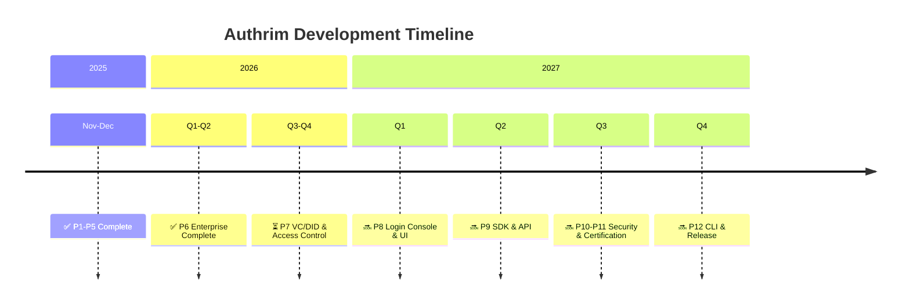

# Authrim Product Roadmap

**Vision:** One-command identity infrastructure for the modern web

**Timeline:** November 2025 - 2027+

---

## Timeline Overview

**Legend:**
- ✅ Complete (Phases 1-6)
- ⏳ In Progress (Phase 7: Policy Service done)
- 🔜 Planned (Phases 8-12)

---

## Milestones

| Milestone | Date | Status | Description |
|-----------|------|--------|-------------|
| **M1: Foundation** | 2025-12-15 | ✅ Complete | Project setup, tooling, basic structure |
| **M2: Core API** | 2026-01-31 | ✅ Complete | All OIDC endpoints functional |
| **M3: Conformance** | 2025-11-12 | ✅ Complete | Basic OP 78.95%, Config OP 100%, Form Post 84.21% |
| **M4: Extensions** | 2025-11-12 | ✅ Complete | PAR, DPoP, Pairwise, Token Management |
| **M5: UI/UX** | 2025-11-18 | ✅ Complete | SvelteKit Frontend, Admin Dashboard, 15+ pages |
| **M6: Enterprise** | 2025-12-02 | ✅ Complete | Device Flow, CIBA, SCIM, JWE, Hybrid, JAR, JARM, JWT Bearer, SAML 2.0 |
| **M7: VC/DID** | 2026-Q4 | ⏳ In Progress | RBAC/ABAC/ReBAC (Policy Service done), JWT-SD, OpenID4VP/CI |
| **M8: Console** | 2027-Q1 | 🔜 Planned | Social Login, Admin Console, UI Customization |
| **M9: SDK** | 2027-Q2 | 🔜 Planned | WebSDK, API Documentation |
| **M10: QA** | 2027-Q3 | 🔜 Planned | Security Audit, Load Testing |
| **M11: Certification** | 2027-Q3 | 🔜 Planned | OpenID Certification |
| **M12: Release** | 2027-Q4 | 🔜 Final | CLI, Public Release |

---

## Phase 1: Foundation ✅ COMPLETE

**Timeline:** Nov 10 - Dec 15, 2025

**Achievements:**
- ✅ Git repository, TypeScript configuration
- ✅ Cloudflare Workers setup, Hono framework
- ✅ KV Storage, JOSE library
- ✅ Vitest testing framework
- ✅ CI/CD with GitHub Actions

---

## Phase 2: Core API Implementation ✅ COMPLETE

**Timeline:** Dec 16, 2025 - Jan 31, 2026

**Achievements:**
- ✅ Discovery & JWKS endpoints
- ✅ Authorization endpoint with PKCE
- ✅ Token endpoint (ID Token + Access Token)
- ✅ UserInfo endpoint
- ✅ All standard scopes (openid, profile, email, address, phone)

---

## Phase 3: Testing & Validation ✅ COMPLETE

**Timeline:** Feb 1 - Mar 15, 2026 | **Actual:** Nov 12, 2025

**Achievements:**
- ✅ OpenID Conformance Suite testing
- ✅ Basic OP: 78.95% (30/38 tests, 4 intentional skips)
- ✅ Config OP: 100%
- ✅ Form Post Basic: 84.21%

---

## Phase 4: Extended Features ✅ COMPLETE

**Timeline:** Mar 16 - Apr 30, 2026 | **Actual:** Nov 12, 2025

**Achievements:**
- ✅ Dynamic Client Registration (RFC 7591)
- ✅ PAR - Pushed Authorization Requests (RFC 9126)
- ✅ DPoP - Demonstrating Proof of Possession (RFC 9449)
- ✅ Pairwise Subject Identifiers
- ✅ Refresh Token with rotation
- ✅ Token Introspection (RFC 7662) & Revocation (RFC 7009)
- ✅ Form Post Response Mode
- ✅ Rate Limiting, Security Headers

---

## Phase 5: UI/UX Implementation ✅ COMPLETE

**Timeline:** May 1-31, 2026 | **Actual:** Nov 18, 2025

**Achievements:**
- ✅ D1 Database (12 tables)
- ✅ 14 Durable Objects
- ✅ SvelteKit + UnoCSS + Melt UI frontend
- ✅ Authentication UI (login, signup, consent, device, ciba)
- ✅ Admin Dashboard (7 pages)
- ✅ WebAuthn/Passkey API
- ✅ Magic Link authentication
- ✅ Multi-language support (EN/JA with Paraglide)
- ✅ E2E Testing (Playwright), Accessibility (axe-core)

---

## Phase 6: Enterprise Features ✅ COMPLETE

**Timeline:** Jun 1 - Oct 31, 2026 | **Actual:** Dec 02, 2025

**Goal:** Enterprise-grade authentication flows and integrations

### All Features Complete

| Feature | RFC/Spec | Status | Date |
|---------|----------|--------|------|
| Device Flow | RFC 8628 | ✅ Complete | Nov 21, 2025 |
| JWT Bearer Flow | RFC 7523 | ✅ Complete | Nov 21, 2025 |
| JWE | RFC 7516 | ✅ Complete | Nov 21, 2025 |
| Hybrid Flow | OIDC Core 3.3 | ✅ Complete | Nov 25, 2025 |
| CIBA | OpenID Connect | ✅ Complete | Nov 25, 2025 |
| SCIM 2.0 | RFC 7643/7644 | ✅ Complete | Nov 25, 2025 |
| JAR | RFC 9101 | ✅ Complete | Nov 25, 2025 |
| JARM | OIDC JARM | ✅ Complete | Nov 25, 2025 |
| SAML 2.0 | SAML 2.0 IdP/SP | ✅ Complete | Dec 02, 2025 |
| Policy Service | RBAC/ABAC | ✅ Complete | Dec 02, 2025 |

> **Note:** Social Login has been moved to Phase 8 (Login Console & UI)
> **Note:** LDAP/AD Integration removed - incompatible with Workers architecture (no TCP sockets)

---

## Phase 7: VC/DID & Access Control ⏳ IN PROGRESS

**Timeline:** 2026-Q3 to Q4

**Goal:** Complete access control system and Verifiable Credentials support

### Completed (Dec 2025)

| Feature | Status | Description |
|---------|--------|-------------|
| Policy Core | ✅ Complete | RBAC/ABAC engine (`@authrim/policy-core`) |
| Policy Service | ✅ Complete | REST API (`@authrim/policy-service`) |
| Policy Tests | ✅ Complete | 84 tests (53 core + 31 service) |
| API Documentation | ✅ Complete | `/docs/api/policy/README.md` |

### Planned Features

| Feature | Description | Status |
|---------|-------------|--------|
| Feature Flags | ENABLE_REBAC_CHECK, ENABLE_ABAC_ATTRIBUTES | 🔜 Planned |
| ReBAC Check API | Zanzibar-style relationship checks | 🔜 Planned |
| DB Migrations | closure, relation_definitions, verified_attributes | 🔜 Planned |
| JWT-SD | Selective Disclosure for JWTs | 🔜 Planned |
| OpenID4VP | Verifiable Presentations | 🔜 Planned |
| OpenID4CI | Credential Issuance | 🔜 Planned |
| DID Resolver | did:web, did:key support | 🔜 Planned |

---

## Phase 8: Login Console & UI 🔜 PLANNED

**Timeline:** 2027-Q1

**Goal:** Complete admin console and login customization

### Key Features

| Feature | Description | Status |
|---------|-------------|--------|
| Social Login | Google, GitHub, Microsoft, Apple, Facebook, Twitter, LinkedIn | 🔜 Planned |
| Admin Console | Complete settings management in KV/D1 | 🔜 Planned |
| Browser Login | Full browser-based authentication | 🔜 Planned |
| Theme Customization | Branding, logos, colors | 🔜 Planned |
| Email Templates | Customizable email templates | 🔜 Planned |

---

## Phase 9: SDK & API 🔜 PLANNED

**Timeline:** 2027-Q2

**Goal:** Developer SDKs and API documentation

### Key Features

| Feature | Description | Status |
|---------|-------------|--------|
| @authrim/sdk-core | Headless OIDC/PKCE client | 🔜 Planned |
| @authrim/sdk-web | Web Components (Lit/Stencil) | 🔜 Planned |
| CDN Bundle | `authrim-sdk.min.js` for `<script>` usage | 🔜 Planned |
| OpenAPI Spec | Complete API specification | 🔜 Planned |
| API Portal | Interactive documentation | 🔜 Planned |

---

## Phase 10: Security & QA 🔜 PLANNED

**Timeline:** 2027-Q3

**Goal:** Security hardening and quality assurance

### Key Features

| Feature | Description | Status |
|---------|-------------|--------|
| MTLS | Mutual TLS (RFC 8705) | 🔜 Planned |
| Client Credentials | RFC 6749 Section 4.4 | 🔜 Planned |
| Security Audit | External security review | 🔜 Planned |
| Load Testing | Performance benchmarks | 🔜 Planned |
| Bug Fixes | Issue resolution | 🔜 Planned |
| Conformance Tests | Hybrid OP, Dynamic OP profiles | 🔜 Planned |

---

## Phase 11: Certification 🔜 PLANNED

**Timeline:** 2027-Q3

**Goal:** OpenID Certification

### Key Stages

1. GitHub private → public
2. License and documentation review
3. OpenID Foundation submission
4. Test environment provision
5. Certification obtained

---

## Phase 12: CLI & Release 🔜 FINAL

**Timeline:** 2027-Q4

**Goal:** Official public release

### Key Features

| Feature | Description | Status |
|---------|-------------|--------|
| create-authrim | NPM package for project scaffolding | 🔜 Planned |
| Setup Wizard | Interactive configuration | 🔜 Planned |
| Cloudflare Integration | Worker, KV, D1, DO deployment | 🔜 Planned |
| Migration Guides | From Auth0, Keycloak | 🔜 Planned |
| Public Launch | Official announcement | 🔜 Final |

---

## Success Metrics

### Phase 1-5 (Complete)

| Metric | Target | Actual |
|--------|--------|--------|
| Unit tests | 200+ | 60 files, ~25,270 lines |
| Conformance (Basic OP) | 85% | 78.95% ✅ |
| Conformance (Config OP) | 85% | 100% ✅ |
| UI pages | 10+ | 15+ ✅ |
| Durable Objects | 10+ | 14 ✅ |

### Phase 6 (Complete)

| Metric | Target | Actual |
|--------|--------|--------|
| Enterprise features | 9 | 9/9 (100%) ✅ |
| Device Flow tests | 50+ | 70+ ✅ |
| CIBA modes | 3 | 3 (poll, ping, push) ✅ |
| SCIM endpoints | 4 | 4 (Users + Groups CRUD) ✅ |
| SAML tests | 20+ | 22 ✅ |

### Phase 7-12 (Planned)

| Metric | Target |
|--------|--------|
| Policy tests | 100+ |
| Social login providers | 7+ |
| WebSDK components | 5+ |
| CLI commands | 20+ |
| OpenID Certification | ✅ Obtained |

---

## Key Results (Overall)

By 2027, Authrim will be:

1. **OpenID Certified** - Official certification obtained
2. **Passwordless-first** - WebAuthn + Magic Link
3. **Complete Access Control** - RBAC, ABAC, ReBAC
4. **Verifiable Credentials** - OpenID4VP/CI support
5. **Globally distributed** - <50ms latency worldwide
6. **Enterprise-ready** - SAML, SCIM, Social Login
7. **Advanced Flows** - Hybrid, Device, CIBA, JWT Bearer
8. **Maximum Security** - DPoP, PAR, JAR, JARM, JWE, MTLS
9. **Developer-friendly** - WebSDK, CLI, comprehensive docs
10. **Open Source** - Apache 2.0, self-hosted

---

## Change Log

| Date | Change |
|------|--------|
| 2025-11-11 | Initial roadmap |
| 2025-11-12 | Phase 3 & 4 completed early |
| 2025-11-18 | Phase 5 completed |
| 2025-11-25 | Phase 6: 8/11 features complete |
| 2025-11-29 | Documentation restructure |
| 2025-12-02 | Major roadmap restructure: Phase 7-12 redefined, SaaS removed, Policy Service added |
| 2025-12-02 | SAML 2.0 complete (IdP/SP with SSO/SLO, HTTP-POST/Redirect bindings) |
| 2025-12-02 | Phase 6 complete, LDAP/AD removed (Workers architecture limitation) |

---

> **Last Update:** 2025-12-02
>
> **Current Status:** Phase 6 Complete ✅ | Phase 7 In Progress (Policy Service done)
>
> **Authrim** - Building the future of identity infrastructure, one phase at a time.
