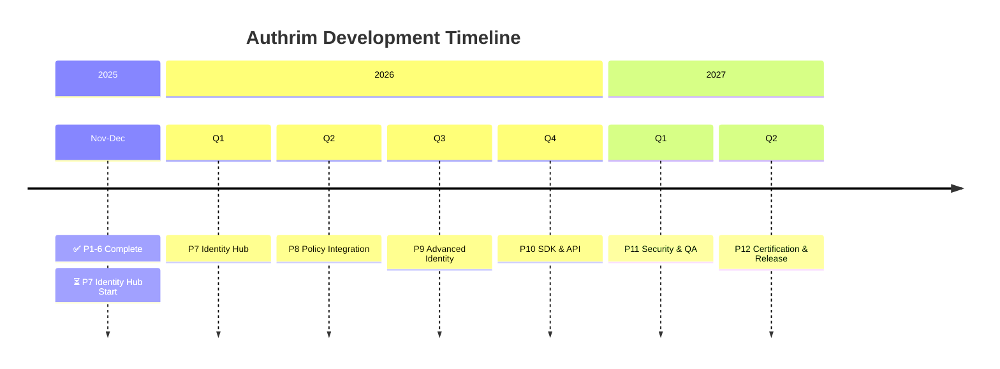

# Authrim Product Roadmap

**Vision:** Identity & Access Platform for the modern web — Authentication, Authorization, and Identity Hub in one.

**Timeline:** November 2025 - 2027

---

## Timeline Overview



**Legend:**

- ✅ Complete (Phases 1-6)
- ⏳ In Progress (Phase 7)
- 🔜 Planned (Phases 8-12)

---

## Architecture Vision

```
═══════════════════════════════════════════════════════════════════════════
                 Authrim: Unified Identity & Access Platform
═══════════════════════════════════════════════════════════════════════════

┌─────────────────────────────────────────────────────────────────────────┐
│              Identity Sources (Federation & Native Auth)                │
│                                                                         │
│   Google    GitHub    Microsoft    SAML IdP    Wallet    Passkey/Local  │
│     │         │          │           │        (VC/VP)         │         │
│     └─────────┴──────────┴───────────┴───────────┴───────────┘         │
└─────────────────────────────────┬───────────────────────────────────────┘
                                  │
                                  ▼
┌─────────────────────────────────────────────────────────────────────────┐
│                   Federation & Native Auth Layer                        │
│                                                                         │
│   • External IdP (OAuth 2.0 / OIDC / SAML)                             │
│   • Wallet VP/VC Verification (OpenID4VP)                              │
│   • Local Auth (Password / Magic Link / Passkey)                       │
└─────────────────────────────────┬───────────────────────────────────────┘
                                  │
                                  ▼
┌─────────────────────────────────────────────────────────────────────────┐
│                      Unified Identity Layer                             │
│                                                                         │
│   • Identity Linking (link multiple accounts to one user)              │
│   • Identity Stitching (determine identity across Federated/Local/Wallet)│
│   • Attribute Aggregation (aggregate attributes from multiple sources) │
│   • Claims Transformation (transform and normalize claims)             │
└─────────────────────────────────┬───────────────────────────────────────┘
                                  │
                                  ▼
┌─────────────────────────────────────────────────────────────────────────┐
│                 Policy Engine (RBAC + ABAC + ReBAC)                     │
│                                                                         │
│   ┌───────────┐  ┌───────────┐  ┌───────────┐  ┌───────────────────┐   │
│   │   Roles   │  │ Attributes│  │ Relations │  │   Feature Flags   │   │
│   │  (RBAC)   │  │  (ABAC)   │  │  (ReBAC)  │  │   (Dynamic Cfg)   │   │
│   └───────────┘  └───────────┘  └───────────┘  └───────────────────┘   │
└─────────────────────────────────┬───────────────────────────────────────┘
                                  │
                                  ▼
┌─────────────────────────────────────────────────────────────────────────┐
│                      IdP Module (OIDC Provider)                         │
│                                                                         │
│   • Token Issuance (ID Token / Access Token / Refresh Token)           │
│   • Claims Embedding (roles, permissions, flags, relationships)        │
│   • Inline Policy Evaluation (sync evaluation at token issuance)       │
│   • Real-time Policy Check API (/policy/check - for downstream services)│
└─────────────────────────────────┬───────────────────────────────────────┘
                                  │
                                  ▼
┌─────────────────────────────────────────────────────────────────────────┐
│                        Customer Applications                            │
│                                                                         │
│   • Tokens: ID Token + Access Token (authentication & authorization)   │
│   • Embedded: Permissions / Roles / Feature Flags                      │
│   • Real-time: /policy/check API for dynamic decisions                 │
└─────────────────────────────────────────────────────────────────────────┘

═══════════════════════════════════════════════════════════════════════════
```

### Key Differentiators

| Feature                      | Description                                                          |
| ---------------------------- | -------------------------------------------------------------------- |
| **OP-embedded Policy Engine**| Sync evaluation of RBAC/ABAC/ReBAC at token issuance. No extra API calls needed |
| **Dual Authorization Model** | Token embedding (fast) + Real-time API (dynamic) combined            |
| **Identity Stitching**       | Auto-link same email, conditional VC subject linking, re-auth on change |
| **Edge-native**              | All layers run at edge on Cloudflare Workers. Global low latency     |

---

## Milestones

| Milestone                  | Date       | Status         | Description                                                           |
| -------------------------- | ---------- | -------------- | --------------------------------------------------------------------- |
| **M1: Foundation**         | 2025-12-15 | ✅ Complete    | Project setup, tooling, basic structure                               |
| **M2: Core API**           | 2026-01-31 | ✅ Complete    | All OIDC endpoints functional                                         |
| **M3: Conformance**        | 2025-11-12 | ✅ Complete    | Basic OP 78.95%, Config OP 100%, Form Post 84.21%                     |
| **M4: Extensions**         | 2025-11-12 | ✅ Complete    | PAR, DPoP, Pairwise, Token Management                                 |
| **M5: UI/UX**              | 2025-11-18 | ✅ Complete    | SvelteKit Frontend, Admin Dashboard, 15+ pages                        |
| **M6: Enterprise**         | 2025-12-02 | ✅ Complete    | Device Flow, CIBA, SCIM, JWE, Hybrid, JAR, JARM, JWT Bearer, SAML 2.0 |
| **M7: Identity Hub**       | 2026-Q1    | ⏳ In Progress | RP Module, Social Login, Identity Linking                             |
| **M8: Policy Integration** | 2026-Q2    | 🔜 Planned     | Unified AuthN + AuthZ, Token embedding, Check API                     |
| **M9: Advanced Identity**  | 2026-Q3    | 🔜 Planned     | OpenID4VP/CI, DID Resolver, VC Issuance                               |
| **M10: SDK & API**         | 2026-Q4    | 🔜 Planned     | WebSDK, CLI, API Documentation                                        |
| **M11: Security & QA**     | 2027-Q1    | 🔜 Planned     | Security Audit, Load Testing, MTLS                                    |
| **M12: Release**           | 2027-Q2    | 🔜 Final       | OpenID Certification, Public Release                                  |

---

## Phase 1: Foundation ✅ COMPLETE

**Timeline:** Nov 10 - Dec 15, 2025

**Achievements:**

- ✅ Git repository, TypeScript configuration
- ✅ Cloudflare Workers setup, Hono framework
- ✅ KV Storage, JOSE library
- ✅ Vitest testing framework
- ✅ CI/CD with GitHub Actions

---

## Phase 2: Core API Implementation ✅ COMPLETE

**Timeline:** Dec 16, 2025 - Jan 31, 2026

**Achievements:**

- ✅ Discovery & JWKS endpoints
- ✅ Authorization endpoint with PKCE
- ✅ Token endpoint (ID Token + Access Token)
- ✅ UserInfo endpoint
- ✅ All standard scopes (openid, profile, email, address, phone)

---

## Phase 3: Testing & Validation ✅ COMPLETE

**Timeline:** Feb 1 - Mar 15, 2026 | **Actual:** Nov 12, 2025

**Achievements:**

- ✅ OpenID Conformance Suite testing
- ✅ Basic OP: 78.95% (30/38 tests, 4 intentional skips)
- ✅ Config OP: 100%
- ✅ Form Post Basic: 84.21%

---

## Phase 4: Extended Features ✅ COMPLETE

**Timeline:** Mar 16 - Apr 30, 2026 | **Actual:** Nov 12, 2025

**Achievements:**

- ✅ Dynamic Client Registration (RFC 7591)
- ✅ PAR - Pushed Authorization Requests (RFC 9126)
- ✅ DPoP - Demonstrating Proof of Possession (RFC 9449)
- ✅ Pairwise Subject Identifiers
- ✅ Refresh Token with rotation
- ✅ Token Introspection (RFC 7662) & Revocation (RFC 7009)
- ✅ Form Post Response Mode
- ✅ Rate Limiting, Security Headers

---

## Phase 5: UI/UX Implementation ✅ COMPLETE

**Timeline:** May 1-31, 2026 | **Actual:** Nov 18, 2025

**Achievements:**

- ✅ D1 Database (12 tables)
- ✅ 14 Durable Objects
- ✅ SvelteKit + UnoCSS + Melt UI frontend
- ✅ Authentication UI (login, signup, consent, device, ciba)
- ✅ Admin Dashboard (7 pages)
- ✅ WebAuthn/Passkey API
- ✅ Magic Link authentication
- ✅ Multi-language support (EN/JA with Paraglide)
- ✅ E2E Testing (Playwright), Accessibility (axe-core)

---

## Phase 6: Enterprise Features ✅ COMPLETE

**Timeline:** Jun 1 - Oct 31, 2026 | **Actual:** Dec 02, 2025

**Goal:** Enterprise-grade authentication flows and integrations

### All Features Complete

| Feature         | RFC/Spec        | Status      | Date         |
| --------------- | --------------- | ----------- | ------------ |
| Device Flow     | RFC 8628        | ✅ Complete | Nov 21, 2025 |
| JWT Bearer Flow | RFC 7523        | ✅ Complete | Nov 21, 2025 |
| JWE             | RFC 7516        | ✅ Complete | Nov 21, 2025 |
| Hybrid Flow     | OIDC Core 3.3   | ✅ Complete | Nov 25, 2025 |
| CIBA            | OpenID Connect  | ✅ Complete | Nov 25, 2025 |
| SCIM 2.0        | RFC 7643/7644   | ✅ Complete | Nov 25, 2025 |
| JAR             | RFC 9101        | ✅ Complete | Nov 25, 2025 |
| JARM            | OIDC JARM       | ✅ Complete | Nov 25, 2025 |
| SAML 2.0        | SAML 2.0 IdP/SP | ✅ Complete | Dec 02, 2025 |
| Policy Service  | RBAC/ABAC       | ✅ Complete | Dec 02, 2025 |
| SD-JWT          | RFC 9901        | ✅ Complete | Dec 03, 2025 |
| Feature Flags   | Hybrid config   | ✅ Complete | Dec 03, 2025 |
| ReBAC Check API | Zanzibar-style  | ✅ Complete | Dec 03, 2025 |

> **Note:** LDAP/AD Integration removed - incompatible with Workers architecture (no TCP sockets)

---

## Phase 7: Identity Hub Foundation ⏳ IN PROGRESS

**Timeline:** 2025-12 to 2026-Q1

**Goal:** Transform Authrim from IdP-only to Identity Hub with RP capabilities

### 7.1 RP Module Foundation

| Feature               | Description                                | Status     |
| --------------------- | ------------------------------------------ | ---------- |
| Upstream IdP Registry | Store external IdP configurations (D1)     | 🔜 Planned |
| OIDC RP Client        | Connect to external OIDC providers         | 🔜 Planned |
| OAuth 2.0 RP Client   | Generic OAuth 2.0 support                  | 🔜 Planned |
| Session Linking       | Link upstream sessions to Authrim sessions | 🔜 Planned |

### 7.2 Social Login Providers

| Provider             | Protocol  | Priority | Status     |
| -------------------- | --------- | -------- | ---------- |
| Google               | OIDC      | High     | 🔜 Planned |
| GitHub               | OAuth 2.0 | High     | 🔜 Planned |
| Microsoft (Entra ID) | OIDC      | High     | 🔜 Planned |
| Apple                | OIDC      | Medium   | 🔜 Planned |
| Facebook             | OAuth 2.0 | Medium   | 🔜 Planned |
| Twitter/X            | OAuth 2.0 | Low      | 🔜 Planned |
| LinkedIn             | OAuth 2.0 | Low      | 🔜 Planned |

### 7.3 Identity Linking

| Feature             | Description                                   | Status     |
| ------------------- | --------------------------------------------- | ---------- |
| Account Linking     | Link multiple external identities to one user | 🔜 Planned |
| Attribute Mapping   | Map upstream claims to Authrim schema         | 🔜 Planned |
| Conflict Resolution | Handle email conflicts across providers       | 🔜 Planned |
| Linking UI          | User interface for managing linked accounts   | 🔜 Planned |

### 7.4 Admin Console Enhancement

| Feature              | Description                         | Status     |
| -------------------- | ----------------------------------- | ---------- |
| Provider Management  | Add/edit/delete upstream IdPs       | 🔜 Planned |
| Attribute Mapping UI | Visual claim mapping editor         | 🔜 Planned |
| Login Flow Designer  | Configure authentication flow order | 🔜 Planned |

---

## Phase 8: Unified Policy Integration 🔜 PLANNED

**Timeline:** 2026-Q1 to Q2

**Goal:** Integrate authentication and authorization into unified flow

### 8.1 Policy ↔ Identity Integration

| Feature                   | Description                                    | Status     |
| ------------------------- | ---------------------------------------------- | ---------- |
| Attribute Injection       | Inject upstream attributes into policy context | 🔜 Planned |
| Dynamic Role Assignment   | Assign roles based on upstream attributes      | 🔜 Planned |
| Just-in-Time Provisioning | Create users/roles on first login              | 🔜 Planned |

### 8.2 Token Embedding Model

| Feature               | Description                                 | Status     |
| --------------------- | ------------------------------------------- | ---------- |
| Permissions in Token  | Embed evaluated permissions in access token | 🔜 Planned |
| Roles in Token        | Embed assigned roles in ID token            | 🔜 Planned |
| Resource Permissions  | Per-resource permission embedding           | 🔜 Planned |
| Custom Claims Builder | UI for custom token claims                  | 🔜 Planned |

### 8.3 Real-time Check API Model

| Feature               | Description                               | Status     |
| --------------------- | ----------------------------------------- | ---------- |
| `/api/check` Endpoint | Real-time authorization check             | 🔜 Planned |
| Batch Check API       | Check multiple permissions at once        | 🔜 Planned |
| WebSocket Push        | Real-time permission change notifications | 🔜 Planned |
| SDK Integration       | Client SDK for check API                  | 🔜 Planned |

### 8.4 Policy Admin Console

| Feature             | Description                 | Status     |
| ------------------- | --------------------------- | ---------- |
| Role Editor         | Visual RBAC role management | 🔜 Planned |
| Policy Editor       | ABAC policy builder         | 🔜 Planned |
| Relationship Viewer | ReBAC graph visualization   | 🔜 Planned |
| Audit Log Viewer    | Permission check history    | 🔜 Planned |

---

## Phase 9: Advanced Identity Sources 🔜 PLANNED

**Timeline:** 2026-Q2 to Q3

**Goal:** Support next-generation identity protocols (Verifiable Credentials)

### 9.1 OpenID4VP (Verifiable Presentations)

| Feature                  | Description                       | Status     |
| ------------------------ | --------------------------------- | ---------- |
| VP Request Generation    | Create presentation requests      | 🔜 Planned |
| VP Verification          | Verify presentations from wallets | 🔜 Planned |
| Credential Type Registry | Define accepted credential types  | 🔜 Planned |
| Selective Disclosure     | Request specific claims only      | 🔜 Planned |

### 9.2 OpenID4CI (Credential Issuance)

| Feature             | Description                   | Status     |
| ------------------- | ----------------------------- | ---------- |
| Credential Endpoint | Issue VCs to users            | 🔜 Planned |
| Credential Offer    | Generate issuance offers      | 🔜 Planned |
| SD-JWT VC Format    | Issue SD-JWT credentials      | 🔜 Planned |
| Credential Status   | Revocation/suspension support | 🔜 Planned |

### 9.3 DID Support

| Feature              | Description                     | Status     |
| -------------------- | ------------------------------- | ---------- |
| did:web Resolver     | Resolve did:web identifiers     | 🔜 Planned |
| did:key Resolver     | Resolve did:key identifiers     | 🔜 Planned |
| DID Document Hosting | Host Authrim's own DID document | 🔜 Planned |

### 9.4 Use Cases Enabled

```
┌─────────────────────────────────────────────────────────────┐
│  Example: Enterprise Application with VC                    │
├─────────────────────────────────────────────────────────────┤
│                                                             │
│  1. User logs in via Microsoft Entra (Social Login/RP)      │
│     → Basic identity: email, name                           │
│                                                             │
│  2. App requests age verification                           │
│     → Authrim sends OpenID4VP request                       │
│     → User presents VC from digital wallet                  │
│     → Authrim verifies and extracts: age_over_20: true      │
│                                                             │
│  3. Policy Engine evaluates                                 │
│     RBAC: department=Engineering → role: developer          │
│     ABAC: age_over_20=true → access: restricted_content     │
│                                                             │
│  4. Token issued with permissions                           │
│     → App receives unified token with all permissions       │
│                                                             │
└─────────────────────────────────────────────────────────────┘
```

---

## Phase 10: SDK & API 🔜 PLANNED

**Timeline:** 2026-Q3 to Q4

**Goal:** Developer SDKs and comprehensive API documentation

### Key Features

| Feature            | Description                               | Status     |
| ------------------ | ----------------------------------------- | ---------- |
| @authrim/sdk-core  | Headless OIDC/PKCE client                 | 🔜 Planned |
| @authrim/sdk-web   | Web Components (Lit/Stencil)              | 🔜 Planned |
| @authrim/sdk-react | React hooks and components                | 🔜 Planned |
| CDN Bundle         | `authrim-sdk.min.js` for `<script>` usage | 🔜 Planned |
| OpenAPI Spec       | Complete API specification                | 🔜 Planned |
| API Portal         | Interactive documentation                 | 🔜 Planned |

---

## Phase 11: Security & QA 🔜 PLANNED

**Timeline:** 2027-Q1

**Goal:** Security hardening and quality assurance

### Key Features

| Feature             | Description                        | Status     |
| ------------------- | ---------------------------------- | ---------- |
| MTLS                | Mutual TLS (RFC 8705)              | 🔜 Planned |
| Client Credentials  | RFC 6749 Section 4.4               | 🔜 Planned |
| Security Audit      | External security review           | 🔜 Planned |
| Load Testing        | Performance benchmarks (10k+ RPS)  | 🔜 Planned |
| Penetration Testing | Third-party security assessment    | 🔜 Planned |
| Conformance Tests   | Hybrid OP, Dynamic OP, RP profiles | 🔜 Planned |

---

## Phase 12: Certification & Release 🔜 FINAL

**Timeline:** 2027-Q2

**Goal:** OpenID Certification and official public release

### Certification

| Stage                        | Description                      | Status     |
| ---------------------------- | -------------------------------- | ---------- |
| GitHub Public                | Open source repository           | 🔜 Planned |
| Documentation Review         | Complete docs and guides         | 🔜 Planned |
| OpenID Foundation Submission | Apply for certification          | 🔜 Planned |
| Test Environment             | Provision certification test env | 🔜 Planned |
| Certification Obtained       | Official OpenID Certified mark   | 🔜 Planned |

### Release

| Feature          | Description                         | Status     |
| ---------------- | ----------------------------------- | ---------- |
| create-authrim   | NPM package for project scaffolding | 🔜 Planned |
| Setup Wizard     | Interactive configuration           | 🔜 Planned |
| Migration Guides | From Auth0, Keycloak, Okta          | 🔜 Planned |
| Public Launch    | Official announcement               | 🔜 Final   |

---

## Success Metrics

### Phase 1-6 (Complete)

| Metric                  | Target | Actual                  |
| ----------------------- | ------ | ----------------------- |
| Unit tests              | 200+   | 60 files, ~25,270 lines |
| Conformance (Basic OP)  | 85%    | 78.95% ✅               |
| Conformance (Config OP) | 85%    | 100% ✅                 |
| UI pages                | 10+    | 15+ ✅                  |
| Durable Objects         | 10+    | 14 ✅                   |
| Enterprise features     | 9      | 13/13 (100%) ✅         |

### Phase 7-12 (Planned)

| Metric                   | Target      | Phase |
| ------------------------ | ----------- | ----- |
| Social login providers   | 7+          | P7    |
| Identity linking tests   | 50+         | P7    |
| Policy integration tests | 100+        | P8    |
| VC credential types      | 5+          | P9    |
| SDK downloads            | 1000+       | P10   |
| Load test RPS            | 10,000+     | P11   |
| OpenID Certification     | ✅ Obtained | P12   |

---

## Competitive Positioning

| Capability                | Auth0 | Okta | Keycloak | Ory | **Authrim** |
| ------------------------- | ----- | ---- | -------- | --- | ----------- |
| **Authentication**        | ✅    | ✅   | ✅       | ✅  | ✅          |
| **Social Login**          | ✅    | ✅   | ✅       | ✅  | 🔜 P7       |
| **RBAC**                  | ✅    | ✅   | ✅       | ✅  | ✅          |
| **ABAC**                  | ⚠️    | ⚠️   | ✅       | ✅  | ✅          |
| **ReBAC**                 | ❌    | ❌   | ❌       | ✅  | ✅          |
| **AuthN + AuthZ Unified** | ⚠️    | ⚠️   | ⚠️       | ❌  | 🔜 P8       |
| **OpenID4VP**             | ❌    | ❌   | ❌       | ❌  | 🔜 P9       |
| **OpenID4CI**             | ❌    | ❌   | ❌       | ❌  | 🔜 P9       |
| **Edge Deployment**       | ❌    | ❌   | ❌       | ❌  | ✅          |
| **Self-hosted**           | ❌    | ❌   | ✅       | ✅  | ✅          |

---

## Key Results (Overall)

By 2027, Authrim will be:

1. **Identity Hub** - Unified authentication from multiple sources (Social, SAML, OIDC, Wallets)
2. **Policy-Integrated** - AuthN + AuthZ in single platform (RBAC, ABAC, ReBAC)
3. **VC-Ready** - OpenID4VP/CI for next-generation identity
4. **OpenID Certified** - Official certification obtained
5. **Passwordless-first** - WebAuthn + Magic Link + Social Login
6. **Globally distributed** - <50ms latency worldwide (Cloudflare Edge)
7. **Enterprise-ready** - SAML, SCIM, Device Flow, CIBA
8. **Maximum Security** - DPoP, PAR, JAR, JARM, JWE, MTLS
9. **Developer-friendly** - WebSDK, CLI, comprehensive docs
10. **Open Source** - Apache 2.0, self-hosted

---

## Change Log

| Date       | Change                                                                              |
| ---------- | ----------------------------------------------------------------------------------- |
| 2025-11-11 | Initial roadmap                                                                     |
| 2025-11-12 | Phase 3 & 4 completed early                                                         |
| 2025-11-18 | Phase 5 completed                                                                   |
| 2025-11-25 | Phase 6: 8/11 features complete                                                     |
| 2025-11-29 | Documentation restructure                                                           |
| 2025-12-02 | Major roadmap restructure: Phase 7-12 redefined, SaaS removed, Policy Service added |
| 2025-12-02 | SAML 2.0 complete, Phase 6 complete                                                 |
| 2025-12-03 | **Major pivot: Identity Hub + Policy Integration strategy**                         |
| 2025-12-03 | Phase 7 redefined: Identity Hub Foundation (RP, Social Login)                       |
| 2025-12-03 | Phase 8 redefined: Unified Policy Integration                                       |
| 2025-12-03 | Phase 9 redefined: Advanced Identity (OpenID4VP/CI, DID)                            |
| 2025-12-03 | Timeline compressed: Target completion 2027-Q2                                      |

---

> **Last Update:** 2025-12-03
>
> **Current Status:** Phase 6 Complete ✅ | Phase 7 Starting (Identity Hub)
>
> **Authrim** - The Identity & Access Platform for the modern web.
