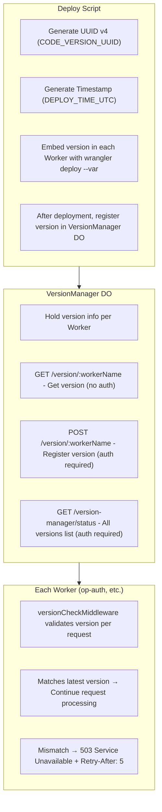

# Worker Version Management System

An internal version management system to solve the Stale Bundle problem in Cloudflare Workers' globally distributed environment.

## Background

Because Cloudflare Workers operate on globally distributed PoPs (Points of Presence), the following issues occur immediately after deployment:

- Some PoPs continue to run old bundles
- Old and new bundles coexist, causing inconsistent behavior
- Issues become particularly apparent in authentication flows (authorize → token)

## Solution

### Architecture



### Version Identifiers

| Variable | Format | Example |
|----------|--------|---------|
| `CODE_VERSION_UUID` | UUID v4 | `a1b2c3d4-e5f6-7890-abcd-ef0123456789` |
| `DEPLOY_TIME_UTC` | ISO 8601 | `2025-11-28T10:30:00Z` |

### Middleware Behavior

```typescript
// Each Worker's index.ts
import { versionCheckMiddleware } from '@authrim/shared';

app.use('*', logger());
app.use('*', versionCheckMiddleware('op-auth')); // Specify Worker name
```

**Cache**: Cached in Worker memory for 5 seconds (reduces DO access)

**Fail-Open**: Requests pass through on DO errors (prioritizes availability)

## Security

- Version UUID is not exposed externally
- 503 responses only contain `{ "error": "service_unavailable" }`
- Logs only output first 8 characters of UUID

## Deploy Flow

```bash
./scripts/deploy-with-retry.sh --env=dev
```

1. Generate UUID v4 and timestamp
2. Deploy each Worker with `--var` options
3. After deployment, register version via `POST /api/internal/version/:workerName`
4. Old bundles return 503, clients retry

## Related Files

| File | Description |
|------|-------------|
| `packages/shared/src/durable-objects/VersionManager.ts` | Version management DO |
| `packages/shared/src/middleware/version-check.ts` | Version check middleware |
| `scripts/deploy-with-retry.sh` | Deploy script |

## Testing

```bash
# VersionManager DO tests
npx vitest run packages/shared/src/durable-objects/__tests__/VersionManager.test.ts

# Middleware tests
npx vitest run packages/shared/src/middleware/__tests__/version-check.test.ts
```
