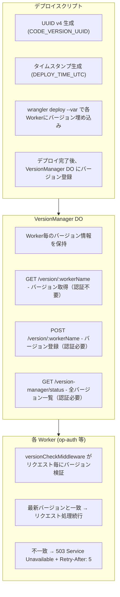

# Worker バージョン管理システム

Cloudflare Workers のグローバル分散環境における Stale Bundle 問題を解決するための内部バージョン管理システム。

## 背景

Cloudflare Workers はグローバルに分散した PoP (Point of Presence) で動作するため、デプロイ直後に以下の問題が発生する：

- 一部の PoP が古いバンドルを実行し続ける
- 新旧バンドルが混在し、一貫性のない動作が発生
- 特に認証フロー（authorize → token）で問題が顕在化

## 解決策

### アーキテクチャ



### バージョン識別子

| 変数名 | 形式 | 例 |
|--------|------|-----|
| `CODE_VERSION_UUID` | UUID v4 | `a1b2c3d4-e5f6-7890-abcd-ef0123456789` |
| `DEPLOY_TIME_UTC` | ISO 8601 | `2025-11-28T10:30:00Z` |

### ミドルウェア動作

```typescript
// 各Workerの index.ts
import { versionCheckMiddleware } from '@authrim/shared';

app.use('*', logger());
app.use('*', versionCheckMiddleware('op-auth')); // Worker名を指定
```

**キャッシュ**: Worker内メモリに5秒間キャッシュ（DO アクセス削減）

**Fail-Open**: DO エラー時はリクエストを通過（可用性優先）

## セキュリティ

- バージョン UUID は外部に公開されない
- 503 レスポンスには `{ "error": "service_unavailable" }` のみ
- ログにも UUID は先頭8文字のみ出力

## デプロイフロー

```bash
./scripts/deploy-with-retry.sh --env=dev
```

1. UUID v4 とタイムスタンプを生成
2. 各 Worker を `--var` オプション付きでデプロイ
3. デプロイ完了後、`POST /api/internal/version/:workerName` でバージョン登録
4. 古いバンドルは 503 を返し、クライアントはリトライ

## 関連ファイル

| ファイル | 説明 |
|----------|------|
| `packages/shared/src/durable-objects/VersionManager.ts` | バージョン管理 DO |
| `packages/shared/src/middleware/version-check.ts` | バージョン検証ミドルウェア |
| `scripts/deploy-with-retry.sh` | デプロイスクリプト |

## テスト

```bash
# VersionManager DO テスト
npx vitest run packages/shared/src/durable-objects/__tests__/VersionManager.test.ts

# ミドルウェアテスト
npx vitest run packages/shared/src/middleware/__tests__/version-check.test.ts
```
