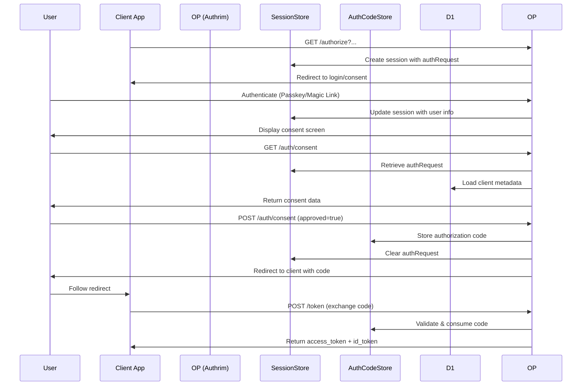

# OAuth Consent Screen API

## Overview

The OAuth Consent Screen API handles user authorization consent for OAuth 2.0 and OpenID Connect flows. It provides endpoints to retrieve consent screen data and process user consent decisions (approve/deny).

**Key Features:**
- Retrieves pending authorization requests from session
- Displays client metadata (name, logo, policy URL, etc.)
- Converts OAuth scopes to human-readable descriptions
- Generates authorization codes on approval
- Handles consent denial with proper error responses
- Integrates with SessionStore and AuthorizationCodeStore Durable Objects

**Standards Compliance:**
- OAuth 2.0 (RFC 6749)
- OpenID Connect Core 1.0
- OAuth 2.0 Security Best Current Practice

## Base URL

```
https://your-domain.com/auth/consent
```

## Endpoints

### 1. Get Consent Screen Data

Retrieve consent screen data for a pending authorization request.

**Endpoint:** `GET /auth/consent`

**Query Parameters:**
| Parameter | Type | Required | Description |
|-----------|------|----------|-------------|
| `session_id` | string | Yes | Session ID containing the authorization request |

**Alternative Authentication:**
Can also read session ID from cookie:
```http
Cookie: session_id={session_id}
```

**Response (200 OK):**
```json
{
  "client": {
    "client_id": "client_abc123",
    "client_name": "My Application",
    "logo_uri": "https://example.com/logo.png",
    "client_uri": "https://example.com",
    "policy_uri": "https://example.com/privacy",
    "tos_uri": "https://example.com/terms"
  },
  "scopes": [
    {
      "name": "openid",
      "title": "Identity",
      "description": "Access your basic profile information",
      "required": true
    },
    {
      "name": "profile",
      "title": "Profile",
      "description": "Access your full profile (name, picture, etc.)",
      "required": false
    },
    {
      "name": "email",
      "title": "Email",
      "description": "Access your email address",
      "required": false
    }
  ],
  "user": {
    "id": "user_123",
    "email": "user@example.com",
    "name": "John Doe"
  },
  "redirect_uri": "https://yourapp.com/callback"
}
```

**Error Responses:**

| Status Code | Error | Description |
|-------------|-------|-------------|
| 400 | `invalid_request` | Session ID is missing |
| 400 | `invalid_session` | Session not found or expired |
| 400 | `invalid_request` | No pending authorization request |
| 400 | `invalid_client` | Client not found |
| 500 | `server_error` | Failed to retrieve consent data |

**Example:**
```bash
curl "https://your-domain.com/auth/consent?session_id=session_550e8400-e29b-41d4-a716-446655440000"
```

**JavaScript Usage:**
```typescript
// Get consent screen data
const sessionId = getSessionIdFromCookie(); // or from query param
const response = await fetch(`/auth/consent?session_id=${sessionId}`);
const data = await response.json();

// Display consent screen
console.log('Client:', data.client.client_name);
console.log('Scopes:', data.scopes);
```

---

### 2. Submit Consent Decision

Process user's consent decision (approve or deny).

**Endpoint:** `POST /auth/consent`

**Request Body:**
```json
{
  "session_id": "session_550e8400-e29b-41d4-a716-446655440000",
  "approved": true,
  "scopes": ["openid", "profile", "email"]
}
```

**Request Parameters:**
| Parameter | Type | Required | Description |
|-----------|------|----------|-------------|
| `session_id` | string | Yes | Session ID containing the authorization request |
| `approved` | boolean | Yes | User's consent decision (true = approve, false = deny) |
| `scopes` | string[] | No | Approved scopes (defaults to all requested scopes) |

**Response (200 OK - Approved):**
```json
{
  "approved": true,
  "redirect_uri": "https://yourapp.com/callback?code=auth_code_123&state=xyz",
  "code": "auth_code_123"
}
```

**Response (200 OK - Denied):**
```json
{
  "approved": false,
  "redirect_uri": "https://yourapp.com/callback?error=access_denied&error_description=User+denied+the+consent+request&state=xyz"
}
```

**Error Responses:**

| Status Code | Error | Description |
|-------------|-------|-------------|
| 400 | `invalid_request` | Session ID is missing |
| 400 | `invalid_session` | Session not found or expired |
| 400 | `invalid_request` | No pending authorization request |
| 500 | `server_error` | Failed to process consent |

**Example:**
```bash
# Approve consent
curl -X POST https://your-domain.com/auth/consent \
  -H "Content-Type: application/json" \
  -d '{
    "session_id": "session_550e8400-e29b-41d4-a716-446655440000",
    "approved": true,
    "scopes": ["openid", "profile", "email"]
  }'

# Deny consent
curl -X POST https://your-domain.com/auth/consent \
  -H "Content-Type: application/json" \
  -d '{
    "session_id": "session_550e8400-e29b-41d4-a716-446655440000",
    "approved": false
  }'
```

**JavaScript Usage:**
```typescript
// User clicks "Allow" button
async function approveConsent(sessionId: string, scopes: string[]) {
  const response = await fetch('/auth/consent', {
    method: 'POST',
    headers: { 'Content-Type': 'application/json' },
    body: JSON.stringify({
      session_id: sessionId,
      approved: true,
      scopes: scopes
    })
  });

  const data = await response.json();
  if (data.approved) {
    // Redirect to client application with authorization code
    window.location.href = data.redirect_uri;
  }
}

// User clicks "Deny" button
async function denyConsent(sessionId: string) {
  const response = await fetch('/auth/consent', {
    method: 'POST',
    headers: { 'Content-Type': 'application/json' },
    body: JSON.stringify({
      session_id: sessionId,
      approved: false
    })
  });

  const data = await response.json();
  // Redirect to client application with error
  window.location.href = data.redirect_uri;
}
```

---

## Scope Descriptions

The API converts OAuth/OIDC scopes to human-readable descriptions:

| Scope | Title | Description |
|-------|-------|-------------|
| `openid` | Identity | Access your basic profile information |
| `profile` | Profile | Access your full profile (name, picture, etc.) |
| `email` | Email | Access your email address |
| `phone` | Phone | Access your phone number |
| `address` | Address | Access your physical address |
| `offline_access` | Offline Access | Maintain access when you are offline |

**Custom Scopes:**
If a scope is not recognized, the API generates a generic description:
- `custom_scope` → Title: "custom_scope", Description: "Access custom_scope data"

---

## Authorization Code Generation

Upon consent approval, the API:

1. **Generates authorization code:**
   - Format: UUID v4 (e.g., `550e8400-e29b-41d4-a716-446655440000`)
   - Validity: 10 minutes
   - Single-use token

2. **Stores code in AuthorizationCodeStore Durable Object:**
   ```json
   {
     "code": "auth_code_123",
     "client_id": "client_abc123",
     "redirect_uri": "https://yourapp.com/callback",
     "scope": "openid profile email",
     "nonce": "abc123",
     "userId": "user_123",
     "expiresAt": 1699564800000
   }
   ```

3. **Clears auth request from session:**
   - Removes `authRequest` from SessionStore
   - Session remains valid for user

4. **Builds redirect URL:**
   - Includes `code` parameter
   - Includes `state` parameter (if provided in original request)
   - Format: `https://yourapp.com/callback?code={code}&state={state}`

---

## Complete Consent Flow



---

## Session Data Structure

The session must contain an `authRequest` object with the following structure:

```typescript
interface AuthRequest {
  client_id: string;          // OAuth client ID
  redirect_uri: string;       // Callback URL
  scope: string;              // Space-separated scopes
  state?: string;             // CSRF token
  nonce?: string;             // OIDC nonce
  response_type: string;      // "code" or "id_token token"
  code_challenge?: string;    // PKCE challenge
  code_challenge_method?: string; // "S256" or "plain"
}
```

**Example Session Data:**
```json
{
  "sessionId": "session_123",
  "userId": "user_123",
  "email": "user@example.com",
  "name": "John Doe",
  "expiresAt": 1699564800000,
  "authRequest": {
    "client_id": "client_abc123",
    "redirect_uri": "https://yourapp.com/callback",
    "scope": "openid profile email",
    "state": "xyz123",
    "nonce": "abc789",
    "response_type": "code"
  }
}
```

---

## Security Considerations

### Session Validation
- Session must exist and not be expired
- Session must contain valid `authRequest`
- User must be authenticated before accessing consent screen

### Client Validation
- Client must exist in database
- Redirect URI is retrieved from auth request (validated earlier in `/authorize`)
- Client metadata (name, logo) displayed to user for trust

### Authorization Code Security
- 10-minute expiration
- Single-use token (consumed during token exchange)
- Stored in AuthorizationCodeStore Durable Object (isolated storage)
- Bound to specific client_id and redirect_uri

### Scope Validation
- `openid` scope is always required (marked as required)
- User can approve subset of requested scopes
- Approved scopes stored with authorization code
- Client receives only approved scopes in tokens

### State Parameter
- CSRF protection mechanism
- Echoed back to client in redirect
- Required for security (enforced by `/authorize`)

---

## Error Handling

### Consent Denial Flow

When user denies consent:

1. **Build error redirect URL:**
   ```
   https://yourapp.com/callback?error=access_denied&error_description=User+denied+the+consent+request&state=xyz
   ```

2. **Error parameters (OAuth 2.0):**
   - `error`: `access_denied`
   - `error_description`: "User denied the consent request"
   - `state`: Original state parameter

3. **Client handling:**
   ```typescript
   // Client app receives error in callback
   const params = new URLSearchParams(window.location.search);
   if (params.get('error') === 'access_denied') {
     console.log('User denied consent');
     // Show appropriate message to user
   }
   ```

---

## Consent UI Guidelines

### Display Requirements

1. **Client Information:**
   - Show client name prominently
   - Display client logo (if available)
   - Link to client URI, privacy policy, terms of service

2. **User Information:**
   - Show which account is being authorized
   - Display user's email and name

3. **Scope Information:**
   - List all requested permissions
   - Use human-readable titles and descriptions
   - Highlight required scopes (e.g., `openid`)

4. **Action Buttons:**
   - "Allow" / "Approve" button (primary action)
   - "Deny" / "Cancel" button (secondary action)

### Example Consent Screen

```html
<div class="consent-screen">
  <div class="client-info">
    
    <h2>${client.client_name} wants to access your account</h2>
    <p>Using account: ${user.email}</p>
  </div>

  <div class="scopes">
    <h3>This will allow ${client.client_name} to:</h3>
    <ul>
      ${scopes.map(scope => `
        <li>
          <strong>${scope.title}</strong>
          <p>${scope.description}</p>
          ${scope.required ? '<span class="badge">Required</span>' : ''}
        </li>
      `).join('')}
    </ul>
  </div>

  <div class="actions">
    <button onclick="denyConsent()">Cancel</button>
    <button onclick="approveConsent()" class="primary">Allow</button>
  </div>

  <div class="links">
    <a href="${client.policy_uri}">Privacy Policy</a>
    <a href="${client.tos_uri}">Terms of Service</a>
  </div>
</div>
```

---

## Testing

**Unit Tests:** `/packages/op-auth/src/__tests__/consent.test.ts`

**Manual Testing:**
```bash
# 1. Start authorization flow (requires authenticated session)
curl "http://localhost:8787/authorize?client_id=test_client&redirect_uri=http://localhost:3000/callback&scope=openid+profile+email&response_type=code&state=xyz"

# 2. Get consent screen data
curl "http://localhost:8787/auth/consent?session_id=YOUR_SESSION_ID"

# 3. Approve consent
curl -X POST http://localhost:8787/auth/consent \
  -H "Content-Type: application/json" \
  -d '{
    "session_id": "YOUR_SESSION_ID",
    "approved": true,
    "scopes": ["openid", "profile", "email"]
  }'

# 4. Deny consent
curl -X POST http://localhost:8787/auth/consent \
  -H "Content-Type: application/json" \
  -d '{
    "session_id": "YOUR_SESSION_ID",
    "approved": false
  }'
```

---

## Future Enhancements (Phase 6)

### Consent Persistence
- Store consent decisions in D1 `user_consents` table
- Skip consent screen if previously granted
- Allow users to revoke consent

### Audit Logging
- Log all consent decisions
- Include timestamp, user ID, client ID, scopes
- Support compliance and security investigations

### Granular Scope Selection
- Allow users to approve/deny individual scopes
- Update UI to show checkboxes for each scope
- Validate that required scopes are approved

### Consent Expiration
- Set expiration time for stored consents
- Re-prompt after X days (e.g., 90 days)
- Configurable per client

---

## Related Documentation

- [SessionStore Durable Object](../durable-objects/SessionStore.md)
- [AuthorizationCodeStore Durable Object](../durable-objects/AuthorizationCodeStore.md)
- [Authorization Endpoint](../../features/authorization-endpoint.md)
- [Token Endpoint](../../features/token-endpoint.md)
- [Database Schema](../../architecture/database-schema.md)

---

## Standards References

- [OAuth 2.0 - RFC 6749](https://datatracker.ietf.org/doc/html/rfc6749)
- [OpenID Connect Core 1.0](https://openid.net/specs/openid-connect-core-1_0.html)
- [OAuth 2.0 Security Best Current Practice](https://datatracker.ietf.org/doc/html/draft-ietf-oauth-security-topics)

---

## Change History

- **2025-11-13**: Initial implementation (Phase 5, Stage 2)
  - Get consent screen data endpoint
  - Submit consent decision endpoint
  - Human-readable scope descriptions
  - Authorization code generation
  - Integration with SessionStore and AuthorizationCodeStore
