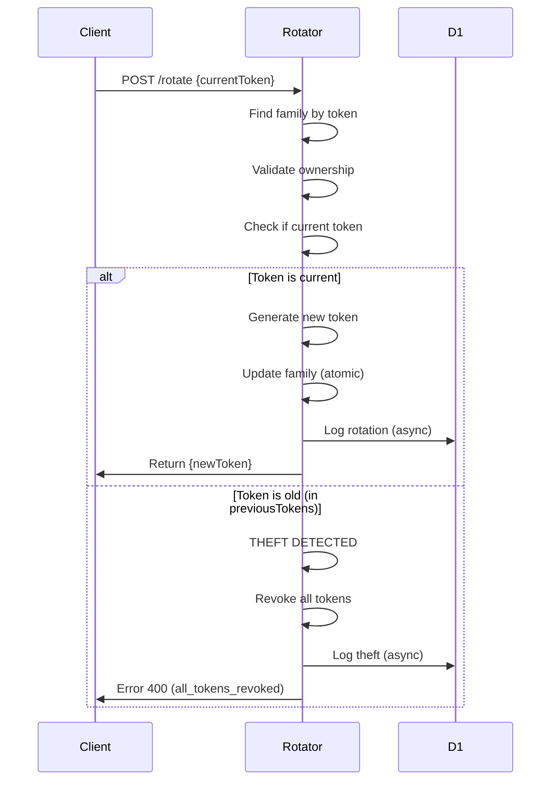

# RefreshTokenRotator Durable Object API

## Overview

The RefreshTokenRotator Durable Object manages atomic refresh token rotation with token family tracking and theft detection. It provides strong security guarantees for long-lived OAuth 2.0 refresh tokens.

**Security Features:**
- Atomic rotation (prevents race conditions)
- Token family tracking (detect token theft via rotation chain)
- Theft detection (revoke all tokens if replay detected)
- Audit logging (all rotations logged to D1)

**OAuth 2.0 Security Best Current Practice (BCP) Compliance:**
- Token Rotation: Refresh tokens rotated on every use
- Theft Detection: Old token reuse triggers family revocation
- Audit Trail: All token operations logged for security analysis

**References:**
- OAuth 2.0 Security BCP: Draft 16, Section 4.13.2
- RFC 6749: Section 10.4 (Refresh Token Protection)

## Base URL

```
https://token-rotator.{namespace}.workers.dev
```

## Endpoints

### 1. Create Token Family

Create a new token family for a user's refresh token.

**Endpoint:** `POST /family`

**Request Body:**
```json
{
  "token": "rt_initial_abc123xyz",
  "userId": "user_123",
  "clientId": "client_1",
  "scope": "openid profile email offline_access",
  "ttl": 2592000
}
```

**Request Parameters:**
| Parameter | Type | Required | Description |
|-----------|------|----------|-------------|
| `token` | string | Yes | Initial refresh token value |
| `userId` | string | Yes | User ID |
| `clientId` | string | Yes | OAuth client ID |
| `scope` | string | Yes | Token scopes |
| `ttl` | number | No | Time to live in seconds (default: 30 days) |

**Response (201 Created):**
```json
{
  "familyId": "family_550e8400-e29b-41d4-a716-446655440000",
  "expiresAt": 1702153200000
}
```

**Response (400 Bad Request):**
```json
{
  "error": "invalid_request",
  "error_description": "Missing required fields"
}
```

**Example:**
```bash
curl -X POST https://token-rotator.example.workers.dev/family \
  -H "Content-Type: application/json" \
  -d '{
    "token": "rt_abc123xyz",
    "userId": "user_123",
    "clientId": "client_1",
    "scope": "openid profile offline_access",
    "ttl": 2592000
  }'
```

---

### 2. Rotate Refresh Token

Rotate a refresh token (atomic operation with theft detection).

**CRITICAL:** This operation is atomic and single-use. Attempting to rotate an old token will trigger theft detection and revoke the entire token family.

**Endpoint:** `POST /rotate`

**Request Body:**
```json
{
  "currentToken": "rt_current_token",
  "userId": "user_123",
  "clientId": "client_1"
}
```

**Request Parameters:**
| Parameter | Type | Required | Description |
|-----------|------|----------|-------------|
| `currentToken` | string | Yes | Current refresh token to rotate |
| `userId` | string | Yes | User ID (must match family) |
| `clientId` | string | Yes | Client ID (must match family) |

**Response (200 OK - Success):**
```json
{
  "newToken": "rt_new_token_xyz789",
  "familyId": "family_550e8400-e29b-41d4-a716-446655440000",
  "expiresIn": 2591940,
  "rotationCount": 1
}
```

**Response (400 Bad Request - Token Not Found):**
```json
{
  "error": "invalid_grant",
  "error_description": "Refresh token not found or expired"
}
```

**Response (400 Bad Request - Ownership Mismatch):**
```json
{
  "error": "invalid_grant",
  "error_description": "Token ownership mismatch"
}
```

**Response (400 Bad Request - Theft Detected):**
```json
{
  "error": "invalid_grant",
  "error_description": "Token theft detected. All tokens in family revoked.",
  "action": "all_tokens_revoked"
}
```

**Example:**
```bash
curl -X POST https://token-rotator.example.workers.dev/rotate \
  -H "Content-Type: application/json" \
  -d '{
    "currentToken": "rt_current",
    "userId": "user_123",
    "clientId": "client_1"
  }'
```

---

### 3. Revoke Token Family

Revoke all tokens in a token family (logout, security incident).

**Endpoint:** `POST /revoke-family`

**Request Body:**
```json
{
  "familyId": "family_550e8400-e29b-41d4-a716-446655440000",
  "reason": "user_logout"
}
```

**Request Parameters:**
| Parameter | Type | Required | Description |
|-----------|------|----------|-------------|
| `familyId` | string | Yes | Token family ID to revoke |
| `reason` | string | No | Revocation reason (for audit log) |

**Response (200 OK):**
```json
{
  "success": true,
  "familyId": "family_550e8400-e29b-41d4-a716-446655440000"
}
```

**Example:**
```bash
curl -X POST https://token-rotator.example.workers.dev/revoke-family \
  -H "Content-Type: application/json" \
  -d '{
    "familyId": "family_550e8400-e29b-41d4-a716-446655440000",
    "reason": "user_logout"
  }'
```

---

### 4. Get Family Information

Get information about a token family (debugging/admin).

**NOTE:** Actual token values are NOT exposed for security.

**Endpoint:** `GET /family/:familyId`

**Path Parameters:**
| Parameter | Type | Required | Description |
|-----------|------|----------|-------------|
| `familyId` | string | Yes | Token family ID |

**Response (200 OK):**
```json
{
  "id": "family_550e8400-e29b-41d4-a716-446655440000",
  "userId": "user_123",
  "clientId": "client_1",
  "scope": "openid profile email offline_access",
  "rotationCount": 5,
  "createdAt": 1699561200000,
  "lastRotation": 1699564800000,
  "expiresAt": 1702153200000,
  "tokenCount": {
    "current": 1,
    "previous": 5
  }
}
```

**Response (404 Not Found):**
```json
{
  "error": "Family not found"
}
```

**Example:**
```bash
curl https://token-rotator.example.workers.dev/family/family_550e8400-e29b-41d4-a716-446655440000
```

---

### 5. Health Check / Status

Get health status, statistics, and configuration.

**Endpoint:** `GET /status`

**Response (200 OK):**
```json
{
  "status": "ok",
  "families": {
    "total": 1250,
    "active": 1100,
    "expired": 150
  },
  "tokens": 6500,
  "config": {
    "defaultTtl": 2592000,
    "maxPreviousTokens": 5
  },
  "timestamp": 1699561200000
}
```

**Example:**
```bash
curl https://token-rotator.example.workers.dev/status
```

---

## Error Responses

All endpoints return standard OAuth 2.0 error responses where applicable:

### 400 Bad Request
```json
{
  "error": "invalid_request",
  "error_description": "Missing required fields"
}
```

```json
{
  "error": "invalid_grant",
  "error_description": "Refresh token expired"
}
```

### 404 Not Found
```json
{
  "error": "Family not found"
}
```

### 500 Internal Server Error
```json
{
  "error": "server_error",
  "error_description": "Internal Server Error"
}
```

---

## Data Types

### TokenFamily Object
```typescript
interface TokenFamily {
  id: string;
  currentToken: string;
  previousTokens: string[];
  userId: string;
  clientId: string;
  scope: string;
  rotationCount: number;
  createdAt: number;
  lastRotation: number;
  expiresAt: number;
}
```

### AuditLogEntry Object
```typescript
interface AuditLogEntry {
  action: 'created' | 'rotated' | 'theft_detected' | 'family_revoked' | 'expired';
  familyId: string;
  userId?: string;
  clientId?: string;
  metadata?: Record<string, unknown>;
  timestamp: number;
}
```

---

## Security Features

### 1. Atomic Rotation

**Token rotation is ATOMIC and prevents race conditions:**

```
Time    Thread A              Thread B
---     --------              --------
T1      rotate(token_v1)
T2        → check current=v1 ✓
T3        → generate v2
T4        → update current=v2
T5        → push v1 to previous[]
T6        → return v2
T7                             rotate(token_v1)
T8                               → check current=v2 ✗
T9                               → THEFT DETECTED!
T10                              → REVOKE ALL TOKENS
```

### 2. Token Family Tracking

Each refresh token belongs to a "family" that tracks its rotation history:

```
Family: family_abc123
├── Current:  rt_token_v5
├── Previous: [rt_token_v4, rt_token_v3, rt_token_v2, rt_token_v1]
└── Original: rt_token_v0 (removed after 5 rotations)
```

**Benefits:**
- Detect if an old token is reused (theft indicator)
- Track rotation chain for audit purposes
- Limit previous token history (memory efficiency)

### 3. Theft Detection

**Theft Detection Mechanism:**

1. User rotates token: `v1 → v2`
2. Attacker steals `v1` from network/storage
3. User continues: `v2 → v3`
4. Attacker tries to use `v1` (now in previousTokens[])
5. System detects: `v1 ≠ currentToken (v3)`
6. **SECURITY ACTION:** Revoke ALL tokens in family
7. Audit log records theft attempt
8. Return error with `action: "all_tokens_revoked"`

**This protects against:**
- Token replay attacks
- Token theft from compromised devices
- Man-in-the-middle attacks

### 4. Audit Logging

All token operations are logged to D1 for security analysis:

```sql
INSERT INTO audit_log (
  action,           -- 'refresh_token.rotated'
  resource_type,    -- 'refresh_token_family'
  resource_id,      -- 'family_abc123'
  user_id,          -- 'user_123'
  metadata_json,    -- '{"rotationCount": 5}'
  created_at
)
```

**Audit actions:**
- `refresh_token.created` - New family created
- `refresh_token.rotated` - Token rotated successfully
- `refresh_token.theft_detected` - Old token reused
- `refresh_token.family_revoked` - Family revoked
- `refresh_token.expired` - Family expired

---

## Implementation Notes

### Token Rotation Flow



### Cleanup Process

- Automatic cleanup runs every 1 hour
- Expired families removed from memory
- Previous tokens limited to last 5 (configurable)
- Audit logs persist in D1 for compliance

### Concurrency

- Durable Objects guarantee atomic operations
- Strong consistency for token rotation
- No race conditions possible

---

## Usage Examples

### Complete Token Lifecycle

```bash
# 1. Create token family (during initial login)
RESPONSE=$(curl -X POST https://token-rotator.example.workers.dev/family \
  -H "Content-Type: application/json" \
  -d '{
    "token": "rt_initial_token",
    "userId": "user_123",
    "clientId": "web_app",
    "scope": "openid profile offline_access",
    "ttl": 2592000
  }')
FAMILY_ID=$(echo $RESPONSE | jq -r '.familyId')

# 2. First rotation (user refreshes access token)
RT1=$(curl -X POST https://token-rotator.example.workers.dev/rotate \
  -H "Content-Type: application/json" \
  -d '{
    "currentToken": "rt_initial_token",
    "userId": "user_123",
    "clientId": "web_app"
  }' | jq -r '.newToken')

# 3. Second rotation
RT2=$(curl -X POST https://token-rotator.example.workers.dev/rotate \
  -H "Content-Type: application/json" \
  -d '{
    "currentToken": "'"$RT1"'",
    "userId": "user_123",
    "clientId": "web_app"
  }' | jq -r '.newToken')

# 4. Check family info
curl https://token-rotator.example.workers.dev/family/$FAMILY_ID

# 5. Revoke on logout
curl -X POST https://token-rotator.example.workers.dev/revoke-family \
  -H "Content-Type: application/json" \
  -d '{
    "familyId": "'"$FAMILY_ID"'",
    "reason": "user_logout"
  }'
```

### Theft Detection Simulation

```bash
# 1. Create family and get token
curl -X POST https://token-rotator.example.workers.dev/family \
  -H "Content-Type: application/json" \
  -d '{
    "token": "rt_theft_test",
    "userId": "user_123",
    "clientId": "client_1",
    "scope": "openid",
    "ttl": 2592000
  }'

# 2. Legitimate rotation (user)
RT1=$(curl -X POST https://token-rotator.example.workers.dev/rotate \
  -H "Content-Type: application/json" \
  -d '{
    "currentToken": "rt_theft_test",
    "userId": "user_123",
    "clientId": "client_1"
  }' | jq -r '.newToken')

# 3. Another legitimate rotation (user)
RT2=$(curl -X POST https://token-rotator.example.workers.dev/rotate \
  -H "Content-Type: application/json" \
  -d '{
    "currentToken": "'"$RT1"'",
    "userId": "user_123",
    "clientId": "client_1"
  }' | jq -r '.newToken')

# 4. Attacker tries to use old token (THEFT!)
curl -X POST https://token-rotator.example.workers.dev/rotate \
  -H "Content-Type: application/json" \
  -d '{
    "currentToken": "rt_theft_test",
    "userId": "user_123",
    "clientId": "client_1"
  }'
# Response:
# {
#   "error": "invalid_grant",
#   "error_description": "Token theft detected. All tokens in family revoked.",
#   "action": "all_tokens_revoked"
# }

# 5. Even legitimate token is now revoked
curl -X POST https://token-rotator.example.workers.dev/rotate \
  -H "Content-Type: application/json" \
  -d '{
    "currentToken": "'"$RT2"'",
    "userId": "user_123",
    "clientId": "client_1"
  }'
# Response:
# {
#   "error": "invalid_grant",
#   "error_description": "Refresh token not found or expired"
# }
```

### Monitoring Token Usage

```bash
# Get overall system status
curl https://token-rotator.example.workers.dev/status

# Query D1 audit logs for security analysis
wrangler d1 execute enrai-dev --command \
  "SELECT action, user_id, created_at, metadata_json
   FROM audit_log
   WHERE action LIKE 'refresh_token.%'
   ORDER BY created_at DESC
   LIMIT 100"
```

---

## Best Practices

1. **Always rotate on use** - Never reuse the same refresh token
2. **Monitor theft detection** - Alert on `theft_detected` audit logs
3. **Revoke on logout** - Always revoke family when user logs out
4. **Track rotation count** - High counts may indicate suspicious activity
5. **Use audit logs** - Analyze patterns for security incidents
6. **Set appropriate TTL** - Balance security (shorter) vs UX (longer)
7. **Handle revocation** - Gracefully handle `all_tokens_revoked` errors

---

## Security Considerations

1. **Theft Detection is Aggressive:** ANY reuse of an old token revokes the entire family. This is intentional and follows OAuth 2.0 Security BCP.

2. **Token Storage:** Never store refresh tokens in localStorage or sessionStorage. Use secure httpOnly cookies or secure device storage.

3. **Token Transmission:** Always use HTTPS. Never log or expose refresh tokens.

4. **Audit Monitoring:** Regularly review audit logs for `theft_detected` events.

5. **User Communication:** When tokens are revoked due to theft, notify the user and suggest password change.

6. **Rotation Limit:** Consider implementing a maximum rotation count per family to detect automated attacks.
