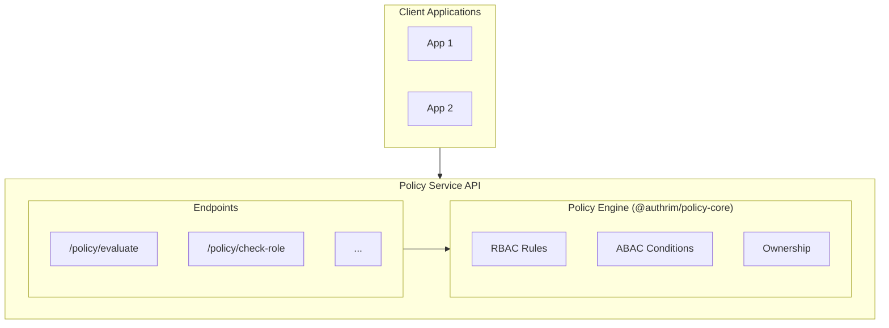

# Policy Service API Guide

**Version**: 0.1.0
**Last Updated**: 2025-12-01

---

## Overview

Policy Service is an independent microservice responsible for access control in Authrim.
It provides flexible policy evaluation that integrates RBAC (Role-Based Access Control) and ABAC (Attribute-Based Access Control).

### Current Features

| Feature | Status | Description |
|---------|--------|-------------|
| **RBAC (Role-Based)** | Implemented | Role-based access control |
| **ABAC (Attribute-Based)** | Implemented | Attribute-based access control |
| **ReBAC (Relationship-Based)** | Placeholder | Zanzibar-style relationship-based control (future implementation) |

---

## Architecture



---

## Authentication

All Policy Service endpoints (except `/policy/health` and `/api/rebac/health`) require Bearer token authentication.

```http
Authorization: Bearer <POLICY_API_SECRET>
```

`POLICY_API_SECRET` is configured as a Cloudflare Workers environment variable.

---

## Endpoints

### Health Check

#### `GET /policy/health`

No authentication required. Checks the operational status of the service.

**Response:**
```json
{
  "status": "ok",
  "service": "policy-service",
  "version": "0.1.0",
  "timestamp": "2025-12-01T10:00:00.000Z"
}
```

---

### Policy Evaluation

#### `POST /policy/evaluate`

Performs full policy evaluation. The most flexible endpoint that allows specifying complete information about subject, resource, and action.

**Request:**
```json
{
  "subject": {
    "id": "user_123",
    "roles": [
      { "name": "org_admin", "scope": "organization", "scopeTarget": "org_456" }
    ],
    "orgId": "org_456"
  },
  "resource": {
    "type": "document",
    "id": "doc_789",
    "orgId": "org_456"
  },
  "action": {
    "name": "read"
  }
}
```

**Response:**
```json
{
  "allowed": true,
  "reason": "Organization administrators can manage resources in their organization",
  "decidedBy": "org_admin_same_org"
}
```

**Subject Fields:**

| Field | Type | Required | Description |
|-------|------|----------|-------------|
| `id` | string | Yes | User ID |
| `roles` | SubjectRole[] | Yes | Assigned roles |
| `orgId` | string | - | Organization ID |
| `userType` | string | - | User type |
| `plan` | string | - | Subscription plan |
| `relationships` | SubjectRelationship[] | - | Relationships with other users |
| `verifiedAttributes` | VerifiedAttribute[] | - | Verified attributes (ABAC) |

**Role Fields:**

| Field | Type | Required | Description |
|-------|------|----------|-------------|
| `name` | string | Yes | Role name (`system_admin`, `org_admin`, `end_user`, etc.) |
| `scope` | string | Yes | Scope (`global`, `organization`, `resource`) |
| `scopeTarget` | string | - | Scope target (e.g., `org:org_123`) |
| `expiresAt` | number | - | Expiration time (UNIX ms) |

---

#### `POST /policy/check-role`

Simple check whether a user has a specific role.

**Single Role Check:**
```json
{
  "subject": {
    "id": "user_123",
    "roles": [{ "name": "admin", "scope": "global" }]
  },
  "role": "admin"
}
```

**Multiple Roles Check (any mode):**
```json
{
  "subject": {
    "id": "user_123",
    "roles": [{ "name": "editor", "scope": "global" }]
  },
  "roles": ["admin", "editor"],
  "mode": "any"
}
```

**Multiple Roles Check (all mode):**
```json
{
  "subject": {
    "id": "user_123",
    "roles": [
      { "name": "admin", "scope": "global" },
      { "name": "editor", "scope": "global" }
    ]
  },
  "roles": ["admin", "editor"],
  "mode": "all"
}
```

**Response:**
```json
{
  "hasRole": true,
  "activeRoles": ["admin", "editor"]
}
```

---

#### `POST /policy/check-access`

Simple access check. Simplified version of `/policy/evaluate`.

**Using Claims (conversion from JWT):**
```json
{
  "claims": {
    "sub": "user_123",
    "authrim_roles": ["system_admin"]
  },
  "resourceType": "document",
  "resourceId": "doc_456",
  "action": "read"
}
```

**Using Direct Roles:**
```json
{
  "subjectId": "user_123",
  "roles": [{ "name": "end_user", "scope": "global" }],
  "resourceType": "document",
  "resourceId": "doc_456",
  "resourceOwnerId": "user_123",
  "action": "read"
}
```

**Response:**
```json
{
  "allowed": true,
  "reason": "Resource owners have full access to their own resources",
  "decidedBy": "owner_full_access"
}
```

---

#### `POST /policy/is-admin`

Determines whether a user has administrator privileges.

**Request:**
```json
{
  "roles": ["admin"]
}
```

Or from claims:
```json
{
  "claims": {
    "sub": "user_123",
    "authrim_roles": ["org_admin"]
  }
}
```

**Response:**
```json
{
  "isAdmin": true,
  "adminRoles": ["org_admin"]
}
```

**Admin Roles:**
- `system_admin`
- `distributor_admin`
- `org_admin`
- `admin`

---

### ReBAC Endpoints (Placeholder)

#### `GET /api/rebac/health`

Checks the operational status of the ReBAC service.

#### `POST /api/rebac/check`

Zanzibar-style relationship check (currently a placeholder).

**Request:**
```json
{
  "subject": "user:user_123",
  "relation": "viewer",
  "object": "document:doc_456"
}
```

**Response:**
```json
{
  "allowed": false,
  "reason": "ReBAC check is not yet implemented"
}
```

---

## Policy Rules

### Default Rules (Built-in)

The Policy Engine has the following default rules built-in:

| Priority | Rule ID | Description |
|----------|---------|-------------|
| 1000 | `system_admin_full_access` | System administrators can access all resources |
| 900 | `distributor_admin_access` | Distributor administrators have broad access |
| 800 | `org_admin_same_org` | Organization administrators can manage resources within their organization |
| 700 | `owner_full_access` | Resource owners have full access to their own resources |
| 600 | `guardian_access` | Guardians can access their ward's resources |

### Condition Types

Condition types available for policy rules:

#### RBAC Conditions

| Type | Description | Params |
|------|-------------|--------|
| `has_role` | Has specific role | `role`, `scope?`, `scopeTarget?` |
| `has_any_role` | Has any of the roles | `roles[]`, `scope?`, `scopeTarget?` |
| `has_all_roles` | Has all roles | `roles[]`, `scope?`, `scopeTarget?` |

#### Ownership Conditions

| Type | Description | Params |
|------|-------------|--------|
| `is_resource_owner` | Is resource owner | None |
| `same_organization` | Same organization | None |

#### Relationship Conditions

| Type | Description | Params |
|------|-------------|--------|
| `has_relationship` | Has relationship | `types[]` |
| `user_type_is` | User type matches | `types[]` |
| `plan_allows` | Plan allows | `plans[]` |

#### ABAC Conditions

| Type | Description | Params |
|------|-------------|--------|
| `attribute_equals` | Attribute value matches | `name`, `value`, `checkExpiry?` |
| `attribute_exists` | Attribute exists | `name`, `checkExpiry?` |
| `attribute_in` | Attribute value in list | `name`, `values[]`, `checkExpiry?` |

---

## Custom Rules

Use `PolicyEngine.addRule()` to add custom rules:

```typescript
import { PolicyEngine } from '@authrim/policy-core';

const engine = new PolicyEngine({ defaultDecision: 'deny' });

// Only premium users can use advanced features
engine.addRule({
  id: 'premium_features',
  name: 'Premium Feature Access',
  description: 'Only premium subscribers can access advanced features',
  priority: 500,
  effect: 'allow',
  conditions: [
    { type: 'attribute_equals', params: { name: 'subscription_tier', value: 'premium' } }
  ],
});

// Only editors within the same organization can edit documents
engine.addRule({
  id: 'org_editor_write',
  name: 'Organization Editor Write Access',
  description: 'Editors can write documents in their organization',
  priority: 550,
  effect: 'allow',
  conditions: [
    { type: 'has_role', params: { role: 'editor' } },
    { type: 'same_organization', params: {} },
  ],
});
```

---

## Integration Examples

### cURL Examples

**Health Check:**
```bash
curl https://policy.authrim.com/policy/health
```

**Policy Evaluation:**
```bash
curl -X POST https://policy.authrim.com/policy/evaluate \
  -H "Authorization: Bearer $POLICY_API_SECRET" \
  -H "Content-Type: application/json" \
  -d '{
    "subject": {
      "id": "user_123",
      "roles": [{ "name": "system_admin", "scope": "global" }]
    },
    "resource": { "type": "document", "id": "doc_456" },
    "action": { "name": "delete" }
  }'
```

**Check Role:**
```bash
curl -X POST https://policy.authrim.com/policy/check-role \
  -H "Authorization: Bearer $POLICY_API_SECRET" \
  -H "Content-Type: application/json" \
  -d '{
    "subject": {
      "id": "user_123",
      "roles": [{ "name": "org_admin", "scope": "organization", "scopeTarget": "org_456" }]
    },
    "role": "org_admin"
  }'
```

**Is Admin Check:**
```bash
curl -X POST https://policy.authrim.com/policy/is-admin \
  -H "Authorization: Bearer $POLICY_API_SECRET" \
  -H "Content-Type: application/json" \
  -d '{"roles": ["system_admin"]}'
```

### TypeScript Integration

```typescript
import type { PolicyContext, PolicyDecision } from '@authrim/policy-core';

async function checkAccess(
  userId: string,
  roles: string[],
  resourceType: string,
  resourceId: string,
  action: string
): Promise<boolean> {
  const response = await fetch('https://policy.authrim.com/policy/check-access', {
    method: 'POST',
    headers: {
      'Authorization': `Bearer ${POLICY_API_SECRET}`,
      'Content-Type': 'application/json',
    },
    body: JSON.stringify({
      subjectId: userId,
      roles: roles.map(name => ({ name, scope: 'global' })),
      resourceType,
      resourceId,
      action,
    }),
  });

  const result = await response.json() as PolicyDecision;
  return result.allowed;
}

// Usage
const canDelete = await checkAccess('user_123', ['org_admin'], 'document', 'doc_456', 'delete');
```

---

## Error Responses

### 401 Unauthorized
```json
{
  "error": "unauthorized",
  "message": "Missing or invalid authorization header"
}
```

### 400 Bad Request
```json
{
  "error": "invalid_request",
  "message": "Missing required field: subject"
}
```

### 404 Not Found
```json
{
  "error": "not_found",
  "path": "/unknown/endpoint"
}
```

---

## Routing Notes

Policy Service supports the following two access patterns:

### Custom Domain (Production)
- URL: `https://policy.authrim.com/policy/*`
- Path is forwarded directly to the Worker

### workers.dev (Development/Router)
- URL: `https://router.authrim.workers.dev/policy/*`
- Routed via Service Binding
- Path prefix is handled by the Router

---

## Related Documents

- [API Inventory](../../project-management/API_INVENTORY.md)
- [RBAC Implementation Plan](../../project-management/RBAC_IMPLEMENTATION_PLAN.md)
- [Database Schema](../../architecture/database-schema.md)

---

> **Last Updated**: 2025-12-01
