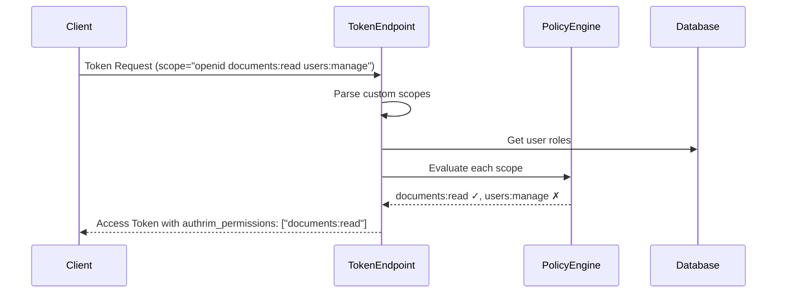

# Token Embedding Specification

**Version**: 0.1.0
**Last Updated**: 2025-12-03

---

## Overview

Authrim supports embedding RBAC/ABAC information directly into ID Tokens and Access Tokens.
This allows client applications to make authorization decisions without additional API calls.

### Embedding Models

| Model | Description | Use Case |
|-------|-------------|----------|
| **Role Embedding** | Include user's roles in token | Simple role-based checks |
| **Permission Embedding** | Include evaluated permissions | Fine-grained access control |

---

## Token Claims

All custom claims use the `authrim_` prefix to avoid conflicts with standard OIDC claims.

### ID Token Claims

| Claim | Type | Default | Description |
|-------|------|---------|-------------|
| `authrim_roles` | `string[]` | Yes | User's effective role names |
| `authrim_user_type` | `string` | Yes | User type (e.g., "individual", "business") |
| `authrim_org_id` | `string` | Yes | Primary organization ID |
| `authrim_org_type` | `string` | Yes | Organization type |
| `authrim_plan` | `string` | Yes | Subscription plan |
| `authrim_scoped_roles` | `object[]` | No | Roles with scope information |
| `authrim_org_name` | `string` | No | Organization name |
| `authrim_orgs` | `object[]` | No | All user's organizations |
| `authrim_relationships_summary` | `object` | No | Relationship summary |

### Access Token Claims

| Claim | Type | Default | Description |
|-------|------|---------|-------------|
| `authrim_roles` | `string[]` | Yes | User's effective role names |
| `authrim_org_id` | `string` | Yes | Primary organization ID |
| `authrim_org_type` | `string` | Yes | Organization type |
| `authrim_scoped_roles` | `object[]` | No | Roles with scope information |
| `authrim_permissions` | `string[]` | No | **Evaluated permissions** |
| `authrim_org_context` | `object` | No | Acting organization context |

---

## Permission Embedding

When `ENABLE_POLICY_EMBEDDING` is enabled, the token endpoint evaluates requested scopes
against the Policy Engine and includes only permitted actions.

### Flow



### Scope Format

Custom scopes follow the pattern: `{resource}:{action}`

```
documents:read    → { resource: "documents", action: "read" }
users:manage      → { resource: "users", action: "manage" }
settings:write    → { resource: "settings", action: "write" }
```

**Standard OIDC scopes are skipped**: `openid`, `profile`, `email`, `address`, `phone`, `offline_access`

### Example

**Request:**
```http
POST /oauth/token
Content-Type: application/x-www-form-urlencoded

grant_type=authorization_code
&code=...
&scope=openid profile documents:read documents:write users:manage
```

**Access Token Payload (decoded):**
```json
{
  "iss": "https://auth.example.com",
  "sub": "user_123",
  "aud": "https://auth.example.com",
  "scope": "openid profile documents:read documents:write users:manage",
  "authrim_roles": ["editor"],
  "authrim_org_id": "org_456",
  "authrim_permissions": ["documents:read", "documents:write"]
}
```

Note: `users:manage` was not included because the user's `editor` role doesn't have that permission.

---

## Configuration

### Environment Variables

| Variable | Default | Description |
|----------|---------|-------------|
| `ENABLE_POLICY_EMBEDDING` | `false` | Enable permission embedding in Access Token |
| `RBAC_ID_TOKEN_CLAIMS` | `roles,user_type,org_id,plan,org_type` | Claims to include in ID Token |
| `RBAC_ACCESS_TOKEN_CLAIMS` | `roles,org_id,org_type` | Claims to include in Access Token |

### Available Claim Keys

**ID Token:**
- `roles`, `scoped_roles`, `user_type`, `org_id`, `org_name`, `plan`, `org_type`, `orgs`, `relationships_summary`

**Access Token:**
- `roles`, `scoped_roles`, `org_id`, `org_type`, `permissions`, `org_context`

### Example Configuration

```toml
# wrangler.toml
[vars]
ENABLE_POLICY_EMBEDDING = "true"
RBAC_ACCESS_TOKEN_CLAIMS = "roles,org_id,org_type,permissions"
RBAC_ID_TOKEN_CLAIMS = "roles,user_type,org_id,plan,org_type,scoped_roles"
```

---

## Admin UI Configuration

Permission embedding can be configured via the Admin UI at `/admin/policy`.

See [CONFIGURATION.md](./CONFIGURATION.md) for detailed instructions.

---

## Security Considerations

### Token Size

- Each additional claim increases token size
- `authrim_permissions` can grow large if many scopes are granted
- Consider limiting exposed scopes in client configuration

### OIDC Conformance

- `ENABLE_POLICY_EMBEDDING` is `false` by default
- Custom claims use `authrim_` prefix to avoid conflicts
- Standard OIDC claims are not affected

### Caching

- RBAC claims are cached for 5 minutes (aligned with token refresh)
- Cache key includes claims configuration hash
- KV namespace: `REBAC_CACHE`

---

## Client Integration

### JavaScript/TypeScript

```typescript
import { jwtDecode } from 'jwt-decode';

interface AuthrimAccessToken {
  iss: string;
  sub: string;
  authrim_roles?: string[];
  authrim_permissions?: string[];
  authrim_org_id?: string;
}

function hasPermission(token: string, permission: string): boolean {
  const decoded = jwtDecode<AuthrimAccessToken>(token);
  return decoded.authrim_permissions?.includes(permission) ?? false;
}

// Usage
const accessToken = '...';
if (hasPermission(accessToken, 'documents:write')) {
  // Allow document editing
}
```

### Middleware Example

```typescript
function requirePermission(permission: string) {
  return (req: Request, res: Response, next: NextFunction) => {
    const token = req.headers.authorization?.replace('Bearer ', '');
    if (!token) return res.status(401).json({ error: 'Unauthorized' });

    try {
      const decoded = jwtDecode<AuthrimAccessToken>(token);
      if (!decoded.authrim_permissions?.includes(permission)) {
        return res.status(403).json({ error: 'Forbidden' });
      }
      next();
    } catch {
      return res.status(401).json({ error: 'Invalid token' });
    }
  };
}

// Usage
app.delete('/documents/:id', requirePermission('documents:delete'), handler);
```

---

## Related Documents

- [Policy Service API](./README.md)
- [Configuration Guide](./CONFIGURATION.md)
- [RBAC Implementation Plan](../../project-management/RBAC_IMPLEMENTATION_PLAN.md)

---

> **Last Updated**: 2025-12-03
