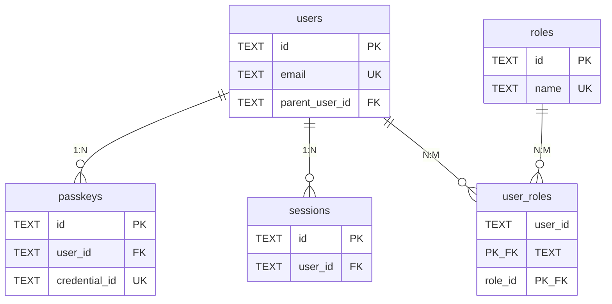

# Enrai Database Schema - ER Diagram 🗄️

**Last Updated**: 2025-11-13
**Status**: Phase 5 Design
**Database**: Cloudflare D1 (SQLite)

---

## 📋 Table of Contents

1. [Overview](#overview)
2. [ER Diagram](#er-diagram)
3. [Table Definitions](#table-definitions)
4. [Relationships](#relationships)
5. [Index Strategy](#index-strategy)
6. [Migration Strategy](#migration-strategy)

---

## Overview

This document defines the database schema for Enrai OIDC OP.

### Statistics Summary

| Category | Number of Tables | Main Relations |
|---------|-----------|-----------------|
| **User Management** | 3 | users → user_custom_fields, users → passkeys |
| **Authentication & Sessions** | 2 | users → sessions, users → passkeys |
| **OAuth Management** | 1 | oauth_clients (standalone) |
| **Permission Management** | 2 | users ← user_roles → roles |
| **Settings & Metadata** | 3 | scope_mappings, branding_settings, identity_providers |
| **Audit** | 1 | audit_log (standalone) |
| **Total** | **11** | **8 Main Relations** |

### Design Principles

1. **Extensibility**: Support for custom fields and external authentication providers
2. **Multi-cloud Support**: Implemented through storage abstraction layer
3. **Security**: Audit Log, RBAC, parent-child accounts
4. **Performance**: Proper index placement
5. **GDPR Compliance**: Cascade deletion, export functionality

---

## ER Diagram

### Overall Diagram

```mermaid
erDiagram
    users ||--o{ user_custom_fields : "has custom fields"
    users ||--o{ passkeys : "owns"
    users ||--o{ sessions : "has"
    users ||--o{ user_roles : "assigned to"
    users ||--o{ users : "parent-child"
    users ||--o| identity_providers : "authenticated by"
    roles ||--o{ user_roles : "assigned to users"
    users ||--o{ audit_log : "performed actions"

    users {
        TEXT id PK "UUID"
        TEXT email UK "Unique, indexed"
        INTEGER email_verified "0 or 1"
        TEXT name
        TEXT given_name
        TEXT family_name
        TEXT middle_name
        TEXT nickname
        TEXT preferred_username
        TEXT profile
        TEXT picture
        TEXT website
        TEXT gender
        TEXT birthdate
        TEXT zoneinfo
        TEXT locale
        TEXT phone_number
        INTEGER phone_number_verified "0 or 1"
        TEXT address_json "JSON format"
        TEXT custom_attributes_json "JSON for non-searchable fields"
        TEXT parent_user_id FK "Self-referencing"
        TEXT identity_provider_id FK "External auth provider"
        INTEGER created_at "Unix timestamp"
        INTEGER updated_at "Unix timestamp"
        INTEGER last_login_at "Unix timestamp"
    }

    user_custom_fields {
        TEXT user_id PK_FK "Composite PK"
        TEXT field_name PK "Composite PK"
        TEXT field_value "Searchable value"
        TEXT field_type "string, number, date, boolean"
        INTEGER searchable "0 or 1"
    }

    passkeys {
        TEXT id PK "UUID"
        TEXT user_id FK "References users"
        TEXT credential_id UK "WebAuthn credential ID"
        TEXT public_key "Public key for verification"
        INTEGER counter "Replay attack prevention"
        TEXT transports "JSON array: usb, nfc, ble, internal"
        TEXT device_name "User-friendly name"
        INTEGER created_at "Unix timestamp"
        INTEGER last_used_at "Unix timestamp"
    }

    oauth_clients {
        TEXT client_id PK "UUID or custom"
        TEXT client_secret "Hashed"
        TEXT client_name
        TEXT redirect_uris "JSON array"
        TEXT grant_types "JSON array"
        TEXT response_types "JSON array"
        TEXT scope "Space-separated"
        TEXT logo_uri
        TEXT client_uri
        TEXT policy_uri
        TEXT tos_uri
        TEXT contacts "JSON array"
        TEXT subject_type "public or pairwise"
        TEXT sector_identifier_uri
        TEXT token_endpoint_auth_method "client_secret_basic, etc"
        INTEGER created_at "Unix timestamp"
        INTEGER updated_at "Unix timestamp"
    }

    sessions {
        TEXT id PK "UUID"
        TEXT user_id FK "References users"
        INTEGER expires_at "Unix timestamp"
        INTEGER created_at "Unix timestamp"
    }

    roles {
        TEXT id PK "UUID"
        TEXT name UK "admin, viewer, support, etc"
        TEXT description
        TEXT permissions_json "JSON array: users:read, users:write, etc"
        INTEGER created_at "Unix timestamp"
    }

    user_roles {
        TEXT user_id PK_FK "Composite PK"
        TEXT role_id PK_FK "Composite PK"
        INTEGER created_at "Unix timestamp"
    }

    scope_mappings {
        TEXT scope PK "Custom scope name"
        TEXT claim_name "Claim name in token"
        TEXT source_table "users, user_custom_fields"
        TEXT source_column "Column or JSON path"
        TEXT transformation "uppercase, lowercase, hash, mask"
        TEXT condition "SQL WHERE clause (optional)"
        INTEGER created_at "Unix timestamp"
    }

    branding_settings {
        TEXT id PK "default"
        TEXT custom_css
        TEXT custom_html_header
        TEXT custom_html_footer
        TEXT logo_url
        TEXT background_image_url
        TEXT primary_color "#3B82F6"
        TEXT secondary_color "#10B981"
        TEXT font_family "Inter"
        INTEGER updated_at "Unix timestamp"
    }

    identity_providers {
        TEXT id PK "UUID"
        TEXT name "SAML Provider, LDAP, etc"
        TEXT provider_type "saml, ldap, oauth"
        TEXT config_json "Provider-specific config"
        INTEGER enabled "0 or 1"
        INTEGER created_at "Unix timestamp"
        INTEGER updated_at "Unix timestamp"
    }

    audit_log {
        TEXT id PK "UUID"
        TEXT user_id FK "References users (nullable)"
        TEXT action "login, logout, create_user, etc"
        TEXT resource_type "user, client, session, etc"
        TEXT resource_id "ID of affected resource"
        TEXT ip_address "IPv4 or IPv6"
        TEXT user_agent
        TEXT metadata_json "Additional context"
        INTEGER created_at "Unix timestamp"
    }
```

### Core Entity Relationships



---

## Table Definitions

### 1. users - User Information

**Purpose**: Store OIDC standard claims and custom attributes

**Key Columns**:
- `id`: UUID, primary key
- `email`: Email address, unique constraint, indexed
- `parent_user_id`: Parent-child accounts (self-referencing foreign key)
- `custom_attributes_json`: Non-searchable metadata (JSON)
- `identity_provider_id`: External authentication provider ID (used in Phase 7)

**Relations**:
- 1:N → `user_custom_fields` (cascade delete)
- 1:N → `passkeys` (cascade delete)
- 1:N → `sessions` (cascade delete)
- N:M → `roles` (via `user_roles`)
- 1:N → `users` (self-referencing, parent-child relationship)
- N:1 → `identity_providers` (external authentication)

**SQL Definition**:
```sql
CREATE TABLE users (
  id TEXT PRIMARY KEY,
  email TEXT UNIQUE NOT NULL,
  email_verified INTEGER DEFAULT 0,
  name TEXT,
  given_name TEXT,
  family_name TEXT,
  middle_name TEXT,
  nickname TEXT,
  preferred_username TEXT,
  profile TEXT,
  picture TEXT,
  website TEXT,
  gender TEXT,
  birthdate TEXT,
  zoneinfo TEXT,
  locale TEXT,
  phone_number TEXT,
  phone_number_verified INTEGER DEFAULT 0,
  address_json TEXT,
  custom_attributes_json TEXT,
  parent_user_id TEXT REFERENCES users(id),
  identity_provider_id TEXT REFERENCES identity_providers(id),
  created_at INTEGER NOT NULL,
  updated_at INTEGER NOT NULL,
  last_login_at INTEGER
);

CREATE INDEX idx_users_email ON users(email);
CREATE INDEX idx_users_created_at ON users(created_at);
CREATE INDEX idx_users_parent_user_id ON users(parent_user_id);
```

---

### 2. user_custom_fields - Custom Fields (Searchable)

**Purpose**: Administrator-defined searchable custom fields (e.g., barcode, employee number)

**Key Columns**:
- `user_id` + `field_name`: Composite primary key
- `field_value`: Searchable value
- `field_type`: Data type (string, number, date, boolean)
- `searchable`: Flag for inclusion in search index

**Relations**:
- N:1 → `users` (cascade delete)

**SQL Definition**:
```sql
CREATE TABLE user_custom_fields (
  user_id TEXT NOT NULL,
  field_name TEXT NOT NULL,
  field_value TEXT,
  field_type TEXT,
  searchable INTEGER DEFAULT 1,
  PRIMARY KEY (user_id, field_name),
  FOREIGN KEY (user_id) REFERENCES users(id) ON DELETE CASCADE
);

CREATE INDEX idx_user_custom_fields_search ON user_custom_fields(field_name, field_value);
```

---

### 3. passkeys - WebAuthn/Passkey Authentication Credentials

**Purpose**: Store user Passkey (WebAuthn) authentication credentials

**Key Columns**:
- `id`: UUID, primary key
- `credential_id`: WebAuthn credential ID, unique constraint
- `public_key`: Public key (for verification)
- `counter`: Counter for replay attack prevention
- `transports`: Authenticator transport methods (JSON array)

**Relations**:
- N:1 → `users` (cascade delete)

**SQL Definition**:
```sql
CREATE TABLE passkeys (
  id TEXT PRIMARY KEY,
  user_id TEXT NOT NULL,
  credential_id TEXT UNIQUE NOT NULL,
  public_key TEXT NOT NULL,
  counter INTEGER DEFAULT 0,
  transports TEXT,
  device_name TEXT,
  created_at INTEGER NOT NULL,
  last_used_at INTEGER,
  FOREIGN KEY (user_id) REFERENCES users(id) ON DELETE CASCADE
);

CREATE INDEX idx_passkeys_user_id ON passkeys(user_id);
CREATE INDEX idx_passkeys_credential_id ON passkeys(credential_id);
```

---

### 4. oauth_clients - OAuth Clients

**Purpose**: RFC 7591 (DCR) compliant OAuth client information

**Key Columns**:
- `client_id`: Client ID (UUID recommended)
- `client_secret`: Client secret (hashed)
- `redirect_uris`: Redirect URIs (JSON array)
- `grant_types`: Allowed grant types (JSON array)
- `subject_type`: public or pairwise (privacy protection)

**Relations**:
- None (standalone)

**SQL Definition**:
```sql
CREATE TABLE oauth_clients (
  client_id TEXT PRIMARY KEY,
  client_secret TEXT,
  client_name TEXT NOT NULL,
  redirect_uris TEXT NOT NULL,
  grant_types TEXT NOT NULL,
  response_types TEXT NOT NULL,
  scope TEXT,
  logo_uri TEXT,
  client_uri TEXT,
  policy_uri TEXT,
  tos_uri TEXT,
  contacts TEXT,
  subject_type TEXT DEFAULT 'public',
  sector_identifier_uri TEXT,
  token_endpoint_auth_method TEXT DEFAULT 'client_secret_basic',
  created_at INTEGER NOT NULL,
  updated_at INTEGER NOT NULL
);

CREATE INDEX idx_clients_created_at ON oauth_clients(created_at);
```

---

### 5. sessions - User Sessions

**Purpose**: ITP-compliant session management (used with KV)

**Key Columns**:
- `id`: Session ID (UUID)
- `user_id`: User ID
- `expires_at`: Expiration time (Unix timestamp)

**Relations**:
- N:1 → `users` (cascade delete)

**Note**: Detailed session data is stored in Cloudflare KV; this table is for indexing and management

**SQL Definition**:
```sql
CREATE TABLE sessions (
  id TEXT PRIMARY KEY,
  user_id TEXT NOT NULL,
  expires_at INTEGER NOT NULL,
  created_at INTEGER NOT NULL,
  FOREIGN KEY (user_id) REFERENCES users(id) ON DELETE CASCADE
);

CREATE INDEX idx_sessions_user_id ON sessions(user_id);
CREATE INDEX idx_sessions_expires_at ON sessions(expires_at);
```

---

### 6. roles - Role Definitions

**Purpose**: RBAC (Role-Based Access Control) role definitions

**Key Columns**:
- `id`: Role ID (UUID)
- `name`: Role name (admin, viewer, support, etc.), unique
- `permissions_json`: Permission list (JSON array)

**Default Roles**:
- `super_admin`: All permissions
- `admin`: User and client management
- `viewer`: Read-only access
- `support`: User support

**Relations**:
- N:M → `users` (via `user_roles`)

**SQL Definition**:
```sql
CREATE TABLE roles (
  id TEXT PRIMARY KEY,
  name TEXT UNIQUE NOT NULL,
  description TEXT,
  permissions_json TEXT NOT NULL,
  created_at INTEGER NOT NULL
);

CREATE INDEX idx_roles_name ON roles(name);
```

---

### 7. user_roles - User-Role Associations

**Purpose**: Establish N:M relationship between users and roles

**Key Columns**:
- `user_id` + `role_id`: Composite primary key

**Relations**:
- N:1 → `users` (cascade delete)
- N:1 → `roles` (cascade delete)

**SQL Definition**:
```sql
CREATE TABLE user_roles (
  user_id TEXT NOT NULL,
  role_id TEXT NOT NULL,
  created_at INTEGER NOT NULL,
  PRIMARY KEY (user_id, role_id),
  FOREIGN KEY (user_id) REFERENCES users(id) ON DELETE CASCADE,
  FOREIGN KEY (role_id) REFERENCES roles(id) ON DELETE CASCADE
);

CREATE INDEX idx_user_roles_user_id ON user_roles(user_id);
CREATE INDEX idx_user_roles_role_id ON user_roles(role_id);
```

---

### 8. scope_mappings - Scope to Claim Mappings

**Purpose**: Dynamic mapping from custom scopes to claims

**Key Columns**:
- `scope`: Scope name (e.g., employee_id, department)
- `claim_name`: Claim name to include in token
- `source_table`: Data source table (users, user_custom_fields)
- `source_column`: Column name or JSON path
- `transformation`: Transformation function (uppercase, lowercase, hash, mask)

**Usage Example**:
```json
{
  "scope": "employee_id",
  "claim_name": "employee_id",
  "source_table": "user_custom_fields",
  "source_column": "field_value WHERE field_name='employee_id'",
  "transformation": null
}
```

**Relations**:
- None (standalone)

**SQL Definition**:
```sql
CREATE TABLE scope_mappings (
  scope TEXT PRIMARY KEY,
  claim_name TEXT NOT NULL,
  source_table TEXT NOT NULL,
  source_column TEXT NOT NULL,
  transformation TEXT,
  condition TEXT,
  created_at INTEGER NOT NULL
);

CREATE INDEX idx_scope_mappings_scope ON scope_mappings(scope);
```

---

### 9. branding_settings - Branding Settings

**Purpose**: Customization settings for login screens and other UI

**Key Columns**:
- `id`: Usually `default` (single record)
- `custom_css`: Custom CSS code
- `custom_html_header/footer`: Custom HTML
- `logo_url`: Logo image URL
- `primary_color/secondary_color`: Brand colors

**Relations**:
- None (singleton)

**SQL Definition**:
```sql
CREATE TABLE branding_settings (
  id TEXT PRIMARY KEY DEFAULT 'default',
  custom_css TEXT,
  custom_html_header TEXT,
  custom_html_footer TEXT,
  logo_url TEXT,
  background_image_url TEXT,
  primary_color TEXT DEFAULT '#3B82F6',
  secondary_color TEXT DEFAULT '#10B981',
  font_family TEXT DEFAULT 'Inter',
  updated_at INTEGER NOT NULL
);
```

---

### 10. identity_providers - External Authentication Providers

**Purpose**: Settings for SAML/LDAP/external OAuth, etc. (implemented in Phase 7)

**Key Columns**:
- `id`: Provider ID (UUID)
- `provider_type`: saml, ldap, oauth
- `config_json`: Provider-specific configuration (JSON)
- `enabled`: Enabled/disabled flag

**Relations**:
- 1:N → `users` (externally authenticated users)

**SQL Definition**:
```sql
CREATE TABLE identity_providers (
  id TEXT PRIMARY KEY,
  name TEXT NOT NULL,
  provider_type TEXT NOT NULL,
  config_json TEXT NOT NULL,
  enabled INTEGER DEFAULT 1,
  created_at INTEGER NOT NULL,
  updated_at INTEGER NOT NULL
);

CREATE INDEX idx_identity_providers_type ON identity_providers(provider_type);
```

---

### 11. audit_log - Audit Log

**Purpose**: Audit trail of all operations

**Key Columns**:
- `id`: Log ID (UUID)
- `user_id`: Operating user (nullable for system operations)
- `action`: Action name (login, logout, create_user, etc.)
- `resource_type`: Target resource type (user, client, session, etc.)
- `resource_id`: Target resource ID
- `metadata_json`: Additional context (JSON)

**Relations**:
- N:1 → `users` (nullable, no foreign key constraint)

**SQL Definition**:
```sql
CREATE TABLE audit_log (
  id TEXT PRIMARY KEY,
  user_id TEXT,
  action TEXT NOT NULL,
  resource_type TEXT,
  resource_id TEXT,
  ip_address TEXT,
  user_agent TEXT,
  metadata_json TEXT,
  created_at INTEGER NOT NULL
);

CREATE INDEX idx_audit_log_user_id ON audit_log(user_id);
CREATE INDEX idx_audit_log_created_at ON audit_log(created_at);
CREATE INDEX idx_audit_log_action ON audit_log(action);
CREATE INDEX idx_audit_log_resource ON audit_log(resource_type, resource_id);
```

---

## Relationships

### Primary Relations

| From | To | Type | Cardinality | Cascade |
|------|-----|------|-------------|---------|
| `users` | `user_custom_fields` | 1:N | One user has multiple custom fields | DELETE CASCADE |
| `users` | `passkeys` | 1:N | One user has multiple passkeys | DELETE CASCADE |
| `users` | `sessions` | 1:N | One user has multiple sessions | DELETE CASCADE |
| `users` | `user_roles` | 1:N | One user has multiple roles | DELETE CASCADE |
| `roles` | `user_roles` | 1:N | One role is assigned to multiple users | DELETE CASCADE |
| `users` | `users` | 1:N | Parent-child accounts (self-referencing) | NO ACTION |
| `identity_providers` | `users` | 1:N | One provider authenticates multiple users | NO ACTION |
| `users` | `audit_log` | 1:N | One user has multiple log entries | None (nullable) |

### Cardinality Explanation

- **1:N (One-to-Many)**: Parent entity has multiple child entities
- **N:M (Many-to-Many)**: Realized through `user_roles` table
- **Self-referencing**: `users.parent_user_id` → `users.id`

---

## Index Strategy

### Primary Indexes

| Table | Index | Purpose |
|---------|-------------|------|
| `users` | `idx_users_email` | Search by email address (login) |
| `users` | `idx_users_created_at` | Sort/filter by registration date |
| `users` | `idx_users_parent_user_id` | Search parent-child accounts |
| `user_custom_fields` | `idx_user_custom_fields_search` | Search by custom fields |
| `passkeys` | `idx_passkeys_user_id` | List user's passkeys |
| `passkeys` | `idx_passkeys_credential_id` | Search during passkey authentication |
| `sessions` | `idx_sessions_user_id` | List user's sessions |
| `sessions` | `idx_sessions_expires_at` | Clean up expired sessions |
| `user_roles` | `idx_user_roles_user_id` | Search user's roles |
| `audit_log` | `idx_audit_log_user_id` | User's operation history |
| `audit_log` | `idx_audit_log_created_at` | Time-series search |
| `audit_log` | `idx_audit_log_action` | Filter by action type |
| `audit_log` | `idx_audit_log_resource` | Filter by resource |

### Performance Considerations

1. **Composite Indexes**: `(field_name, field_value)` for improved search efficiency
2. **Covering Indexes**: Optimize based on commonly used query patterns
3. **Partitioning**: Not supported in D1/SQLite, but consider when migrating to PostgreSQL
4. **Regular VACUUM**: Prevent SQLite fragmentation

---

## Migration Strategy

### Version Control

```
migrations/
├── 001_initial_schema.sql
├── 002_add_parent_user_id.sql
├── 003_add_identity_providers.sql
└── ...
```

### Migration Execution Flow

1. **Development Environment**: Run on local D1
2. **Staging Environment**: Validate with test data
3. **Production Environment**: Blue-Green Deployment

### Rollback Strategy

Each migration includes a down migration:

```
migrations/
├── 001_initial_schema.up.sql
├── 001_initial_schema.down.sql
├── 002_add_parent_user_id.up.sql
├── 002_add_parent_user_id.down.sql
└── ...
```

### Schema Change Constraints (D1/SQLite)

| Operation | Possible | Method |
|------|------|------|
| Add Column | ✅ Yes | `ALTER TABLE ADD COLUMN` |
| Drop Column | ⚠️ Limited | SQLite 3.35.0+ (D1 support planned) |
| Change Column Type | ❌ No | Create new column → copy data → drop old column |
| Add/Drop Index | ✅ Yes | `CREATE INDEX` / `DROP INDEX` |
| Rename Table | ✅ Yes | `ALTER TABLE RENAME TO` |

---

## Storage Abstraction Layer

### Multi-Cloud Support

```typescript
interface IStorageAdapter {
  // KV-like operations
  get(key: string): Promise<any>
  set(key: string, value: any, ttl?: number): Promise<void>
  delete(key: string): Promise<void>

  // SQL-like operations
  query(sql: string, params: any[]): Promise<any[]>
  execute(sql: string, params: any[]): Promise<void>
}

// Implementation example
class CloudflareAdapter implements IStorageAdapter {
  constructor(
    private d1: D1Database,
    private kv: KVNamespace
  ) {}
  // ... implementation
}

class AzureCosmosAdapter implements IStorageAdapter { /* ... */ }
class AWSRDSAdapter implements IStorageAdapter { /* ... */ }
class PostgreSQLAdapter implements IStorageAdapter { /* ... */ }
```

### Adapter Selection

Switch via environment variable:
```
STORAGE_ADAPTER=cloudflare|azure|aws|postgres
```

---

## Data Retention Policy

### GDPR Compliance

| Data Type | Retention Period | Deletion Method |
|-------------|---------|---------|
| User Accounts | Until user deletes | Cascade delete |
| Sessions | 24 hours (default) | TTL auto-delete |
| Audit Log | 90 days (configurable) | Periodic batch delete |
| Passkeys | Until user deletes | Cascade delete |

### Right to Erasure

Data cascade-deleted when user is deleted:
- `user_custom_fields`
- `passkeys`
- `sessions`
- `user_roles`

Audit Log is anonymized (set `user_id` to NULL) and retained

---

## Next Steps

1. ✅ **Create ER Diagram** - Complete
2. ✅ **Create API Specification** - Complete → [OpenAPI 3.1 Specification](../api/openapi.yaml)
3. ✅ **Design System** - Complete → [design-system.md](../design/design-system.md)
4. ✅ **Create Wireframes** - Complete → [wireframes.md](../design/wireframes.md)
5. ✅ **Create Migration Scripts** - Complete → [migrations/](../../migrations/)
6. 📝 **Implement Storage Abstraction Layer** - IStorageAdapter (next task)
7. 📝 **Frontend Environment Setup** - SvelteKit + UnoCSS

---

## References

### Related Documents
- **API Specifications**
  - [openapi.yaml](../api/openapi.yaml) - OpenAPI 3.1 Specification
  - [API README](../api/README.md) - API Guide & Quick Start
  - [API_INVENTORY.md](../project-management/API_INVENTORY.md) - API Inventory
- **UI/UX Design**
  - [design-system.md](../design/design-system.md) - Design System
  - [wireframes.md](../design/wireframes.md) - UI Wireframes
- **Database**
  - [migrations/](../../migrations/) - Migration Scripts
  - [migrations/README.md](../../migrations/README.md) - Migration Guide
- **Project Planning**
  - [PHASE5_PLANNING.md](../project-management/PHASE5_PLANNING.md) - Phase 5 Detailed Plan
  - [ROADMAP.md](../ROADMAP.md) - Overall Roadmap

### Standards & Specifications
- [OIDC Standard Claims](https://openid.net/specs/openid-connect-core-1_0.html#StandardClaims)
- [RFC 7591 - Dynamic Client Registration](https://tools.ietf.org/html/rfc7591)
- [WebAuthn Spec](https://www.w3.org/TR/webauthn-2/)
- [GDPR Article 17 - Right to Erasure](https://gdpr-info.eu/art-17-gdpr/)

---

**Change History**:
- 2025-11-13: Initial version created (Phase 5 design)
