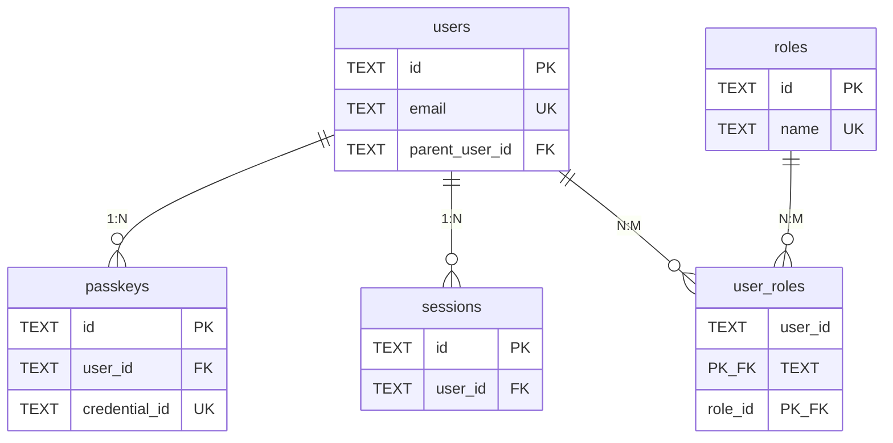

# Hibana Database Schema - ER Diagram 🗄️

**最終更新**: 2025-11-13
**ステータス**: Phase 5 設計
**データベース**: Cloudflare D1 (SQLite)

---

## 📋 目次

1. [概要](#概要)
2. [ER図](#er図)
3. [テーブル定義](#テーブル定義)
4. [リレーションシップ](#リレーションシップ)
5. [インデックス戦略](#インデックス戦略)
6. [マイグレーション戦略](#マイグレーション戦略)

---

## 概要

このドキュメントは、Hibana OIDC OPのデータベーススキーマを定義します。

### 統計サマリー

| カテゴリ | テーブル数 | 主要リレーション |
|---------|-----------|-----------------|
| **ユーザー管理** | 3 | users → user_custom_fields, users → passkeys |
| **認証・セッション** | 2 | users → sessions, users → passkeys |
| **OAuth管理** | 1 | oauth_clients (standalone) |
| **権限管理** | 2 | users ← user_roles → roles |
| **設定・メタデータ** | 3 | scope_mappings, branding_settings, identity_providers |
| **監査** | 1 | audit_log (standalone) |
| **合計** | **11** | **8個の主要リレーション** |

### 設計原則

1. **拡張性**: カスタムフィールド、外部認証プロバイダー対応
2. **マルチクラウド対応**: ストレージ抽象化層で実装
3. **セキュリティ**: Audit Log、RBAC、親子アカウント
4. **パフォーマンス**: 適切なインデックス配置
5. **GDPR対応**: カスケード削除、エクスポート機能

---

## ER図

### 全体図

```mermaid
erDiagram
    users ||--o{ user_custom_fields : "has custom fields"
    users ||--o{ passkeys : "owns"
    users ||--o{ sessions : "has"
    users ||--o{ user_roles : "assigned to"
    users ||--o{ users : "parent-child"
    users ||--o| identity_providers : "authenticated by"
    roles ||--o{ user_roles : "assigned to users"
    users ||--o{ audit_log : "performed actions"

    users {
        TEXT id PK "UUID"
        TEXT email UK "Unique, indexed"
        INTEGER email_verified "0 or 1"
        TEXT name
        TEXT given_name
        TEXT family_name
        TEXT middle_name
        TEXT nickname
        TEXT preferred_username
        TEXT profile
        TEXT picture
        TEXT website
        TEXT gender
        TEXT birthdate
        TEXT zoneinfo
        TEXT locale
        TEXT phone_number
        INTEGER phone_number_verified "0 or 1"
        TEXT address_json "JSON format"
        TEXT custom_attributes_json "JSON for non-searchable fields"
        TEXT parent_user_id FK "Self-referencing"
        TEXT identity_provider_id FK "External auth provider"
        INTEGER created_at "Unix timestamp"
        INTEGER updated_at "Unix timestamp"
        INTEGER last_login_at "Unix timestamp"
    }

    user_custom_fields {
        TEXT user_id PK_FK "Composite PK"
        TEXT field_name PK "Composite PK"
        TEXT field_value "Searchable value"
        TEXT field_type "string, number, date, boolean"
        INTEGER searchable "0 or 1"
    }

    passkeys {
        TEXT id PK "UUID"
        TEXT user_id FK "References users"
        TEXT credential_id UK "WebAuthn credential ID"
        TEXT public_key "Public key for verification"
        INTEGER counter "Replay attack prevention"
        TEXT transports "JSON array: usb, nfc, ble, internal"
        TEXT device_name "User-friendly name"
        INTEGER created_at "Unix timestamp"
        INTEGER last_used_at "Unix timestamp"
    }

    oauth_clients {
        TEXT client_id PK "UUID or custom"
        TEXT client_secret "Hashed"
        TEXT client_name
        TEXT redirect_uris "JSON array"
        TEXT grant_types "JSON array"
        TEXT response_types "JSON array"
        TEXT scope "Space-separated"
        TEXT logo_uri
        TEXT client_uri
        TEXT policy_uri
        TEXT tos_uri
        TEXT contacts "JSON array"
        TEXT subject_type "public or pairwise"
        TEXT sector_identifier_uri
        TEXT token_endpoint_auth_method "client_secret_basic, etc"
        INTEGER created_at "Unix timestamp"
        INTEGER updated_at "Unix timestamp"
    }

    sessions {
        TEXT id PK "UUID"
        TEXT user_id FK "References users"
        INTEGER expires_at "Unix timestamp"
        INTEGER created_at "Unix timestamp"
    }

    roles {
        TEXT id PK "UUID"
        TEXT name UK "admin, viewer, support, etc"
        TEXT description
        TEXT permissions_json "JSON array: users:read, users:write, etc"
        INTEGER created_at "Unix timestamp"
    }

    user_roles {
        TEXT user_id PK_FK "Composite PK"
        TEXT role_id PK_FK "Composite PK"
        INTEGER created_at "Unix timestamp"
    }

    scope_mappings {
        TEXT scope PK "Custom scope name"
        TEXT claim_name "Claim name in token"
        TEXT source_table "users, user_custom_fields"
        TEXT source_column "Column or JSON path"
        TEXT transformation "uppercase, lowercase, hash, mask"
        TEXT condition "SQL WHERE clause (optional)"
        INTEGER created_at "Unix timestamp"
    }

    branding_settings {
        TEXT id PK "default"
        TEXT custom_css
        TEXT custom_html_header
        TEXT custom_html_footer
        TEXT logo_url
        TEXT background_image_url
        TEXT primary_color "#3B82F6"
        TEXT secondary_color "#10B981"
        TEXT font_family "Inter"
        INTEGER updated_at "Unix timestamp"
    }

    identity_providers {
        TEXT id PK "UUID"
        TEXT name "SAML Provider, LDAP, etc"
        TEXT provider_type "saml, ldap, oauth"
        TEXT config_json "Provider-specific config"
        INTEGER enabled "0 or 1"
        INTEGER created_at "Unix timestamp"
        INTEGER updated_at "Unix timestamp"
    }

    audit_log {
        TEXT id PK "UUID"
        TEXT user_id FK "References users (nullable)"
        TEXT action "login, logout, create_user, etc"
        TEXT resource_type "user, client, session, etc"
        TEXT resource_id "ID of affected resource"
        TEXT ip_address "IPv4 or IPv6"
        TEXT user_agent
        TEXT metadata_json "Additional context"
        INTEGER created_at "Unix timestamp"
    }
```

### コアエンティティの関係図



---

## テーブル定義

### 1. users - ユーザー情報

**目的**: OIDC標準クレームおよびカスタム属性を保存

**主要カラム**:
- `id`: UUID、主キー
- `email`: メールアドレス、ユニーク制約、インデックス
- `parent_user_id`: 親子アカウント（自己参照外部キー）
- `custom_attributes_json`: 検索不要なメタデータ（JSON）
- `identity_provider_id`: 外部認証プロバイダーID（Phase 7で使用）

**リレーション**:
- 1:N → `user_custom_fields` (カスケード削除)
- 1:N → `passkeys` (カスケード削除)
- 1:N → `sessions` (カスケード削除)
- N:M → `roles` (via `user_roles`)
- 1:N → `users` (自己参照、親子関係)
- N:1 → `identity_providers` (外部認証)

**SQL定義**:
```sql
CREATE TABLE users (
  id TEXT PRIMARY KEY,
  email TEXT UNIQUE NOT NULL,
  email_verified INTEGER DEFAULT 0,
  name TEXT,
  given_name TEXT,
  family_name TEXT,
  middle_name TEXT,
  nickname TEXT,
  preferred_username TEXT,
  profile TEXT,
  picture TEXT,
  website TEXT,
  gender TEXT,
  birthdate TEXT,
  zoneinfo TEXT,
  locale TEXT,
  phone_number TEXT,
  phone_number_verified INTEGER DEFAULT 0,
  address_json TEXT,
  custom_attributes_json TEXT,
  parent_user_id TEXT REFERENCES users(id),
  identity_provider_id TEXT REFERENCES identity_providers(id),
  created_at INTEGER NOT NULL,
  updated_at INTEGER NOT NULL,
  last_login_at INTEGER
);

CREATE INDEX idx_users_email ON users(email);
CREATE INDEX idx_users_created_at ON users(created_at);
CREATE INDEX idx_users_parent_user_id ON users(parent_user_id);
```

---

### 2. user_custom_fields - カスタムフィールド（検索可能）

**目的**: 管理者が定義する検索可能なカスタムフィールド（例: バーコード、社員番号）

**主要カラム**:
- `user_id` + `field_name`: 複合主キー
- `field_value`: 検索対象の値
- `field_type`: データ型（string, number, date, boolean）
- `searchable`: 検索インデックスに含めるかのフラグ

**リレーション**:
- N:1 → `users` (カスケード削除)

**SQL定義**:
```sql
CREATE TABLE user_custom_fields (
  user_id TEXT NOT NULL,
  field_name TEXT NOT NULL,
  field_value TEXT,
  field_type TEXT,
  searchable INTEGER DEFAULT 1,
  PRIMARY KEY (user_id, field_name),
  FOREIGN KEY (user_id) REFERENCES users(id) ON DELETE CASCADE
);

CREATE INDEX idx_user_custom_fields_search ON user_custom_fields(field_name, field_value);
```

---

### 3. passkeys - WebAuthn/Passkey認証情報

**目的**: ユーザーのPasskey（WebAuthn）認証情報を保存

**主要カラム**:
- `id`: UUID、主キー
- `credential_id`: WebAuthn credential ID、ユニーク制約
- `public_key`: 公開鍵（検証用）
- `counter`: リプレイ攻撃防止用カウンター
- `transports`: 認証器のトランスポート方式（JSON配列）

**リレーション**:
- N:1 → `users` (カスケード削除)

**SQL定義**:
```sql
CREATE TABLE passkeys (
  id TEXT PRIMARY KEY,
  user_id TEXT NOT NULL,
  credential_id TEXT UNIQUE NOT NULL,
  public_key TEXT NOT NULL,
  counter INTEGER DEFAULT 0,
  transports TEXT,
  device_name TEXT,
  created_at INTEGER NOT NULL,
  last_used_at INTEGER,
  FOREIGN KEY (user_id) REFERENCES users(id) ON DELETE CASCADE
);

CREATE INDEX idx_passkeys_user_id ON passkeys(user_id);
CREATE INDEX idx_passkeys_credential_id ON passkeys(credential_id);
```

---

### 4. oauth_clients - OAuthクライアント

**目的**: RFC 7591 (DCR) 準拠のOAuthクライアント情報

**主要カラム**:
- `client_id`: クライアントID（UUID推奨）
- `client_secret`: クライアントシークレット（ハッシュ化）
- `redirect_uris`: リダイレクトURI（JSON配列）
- `grant_types`: 許可されたグラントタイプ（JSON配列）
- `subject_type`: public or pairwise（プライバシー保護）

**リレーション**:
- なし（スタンドアロン）

**SQL定義**:
```sql
CREATE TABLE oauth_clients (
  client_id TEXT PRIMARY KEY,
  client_secret TEXT,
  client_name TEXT NOT NULL,
  redirect_uris TEXT NOT NULL,
  grant_types TEXT NOT NULL,
  response_types TEXT NOT NULL,
  scope TEXT,
  logo_uri TEXT,
  client_uri TEXT,
  policy_uri TEXT,
  tos_uri TEXT,
  contacts TEXT,
  subject_type TEXT DEFAULT 'public',
  sector_identifier_uri TEXT,
  token_endpoint_auth_method TEXT DEFAULT 'client_secret_basic',
  created_at INTEGER NOT NULL,
  updated_at INTEGER NOT NULL
);

CREATE INDEX idx_clients_created_at ON oauth_clients(created_at);
```

---

### 5. sessions - ユーザーセッション

**目的**: ITP対応のセッション管理（KVと併用）

**主要カラム**:
- `id`: セッションID（UUID）
- `user_id`: ユーザーID
- `expires_at`: 有効期限（Unix timestamp）

**リレーション**:
- N:1 → `users` (カスケード削除)

**注意**: 詳細なセッションデータはCloudflare KVに保存し、このテーブルはインデックスと管理用

**SQL定義**:
```sql
CREATE TABLE sessions (
  id TEXT PRIMARY KEY,
  user_id TEXT NOT NULL,
  expires_at INTEGER NOT NULL,
  created_at INTEGER NOT NULL,
  FOREIGN KEY (user_id) REFERENCES users(id) ON DELETE CASCADE
);

CREATE INDEX idx_sessions_user_id ON sessions(user_id);
CREATE INDEX idx_sessions_expires_at ON sessions(expires_at);
```

---

### 6. roles - ロール定義

**目的**: RBAC（Role-Based Access Control）のロール定義

**主要カラム**:
- `id`: ロールID（UUID）
- `name`: ロール名（admin, viewer, support等）、ユニーク
- `permissions_json`: 権限リスト（JSON配列）

**デフォルトロール**:
- `super_admin`: 全権限
- `admin`: ユーザー・クライアント管理
- `viewer`: 読み取り専用
- `support`: ユーザーサポート

**リレーション**:
- N:M → `users` (via `user_roles`)

**SQL定義**:
```sql
CREATE TABLE roles (
  id TEXT PRIMARY KEY,
  name TEXT UNIQUE NOT NULL,
  description TEXT,
  permissions_json TEXT NOT NULL,
  created_at INTEGER NOT NULL
);

CREATE INDEX idx_roles_name ON roles(name);
```

---

### 7. user_roles - ユーザーとロールの紐付け

**目的**: ユーザーとロールのN:M関係を実現

**主要カラム**:
- `user_id` + `role_id`: 複合主キー

**リレーション**:
- N:1 → `users` (カスケード削除)
- N:1 → `roles` (カスケード削除)

**SQL定義**:
```sql
CREATE TABLE user_roles (
  user_id TEXT NOT NULL,
  role_id TEXT NOT NULL,
  created_at INTEGER NOT NULL,
  PRIMARY KEY (user_id, role_id),
  FOREIGN KEY (user_id) REFERENCES users(id) ON DELETE CASCADE,
  FOREIGN KEY (role_id) REFERENCES roles(id) ON DELETE CASCADE
);

CREATE INDEX idx_user_roles_user_id ON user_roles(user_id);
CREATE INDEX idx_user_roles_role_id ON user_roles(role_id);
```

---

### 8. scope_mappings - スコープとクレームのマッピング

**目的**: カスタムスコープからクレームへの動的マッピング

**主要カラム**:
- `scope`: スコープ名（例: employee_id, department）
- `claim_name`: トークンに含めるクレーム名
- `source_table`: データソーステーブル（users, user_custom_fields）
- `source_column`: カラム名またはJSONパス
- `transformation`: 変換関数（uppercase, lowercase, hash, mask）

**使用例**:
```json
{
  "scope": "employee_id",
  "claim_name": "employee_id",
  "source_table": "user_custom_fields",
  "source_column": "field_value WHERE field_name='employee_id'",
  "transformation": null
}
```

**リレーション**:
- なし（スタンドアロン）

**SQL定義**:
```sql
CREATE TABLE scope_mappings (
  scope TEXT PRIMARY KEY,
  claim_name TEXT NOT NULL,
  source_table TEXT NOT NULL,
  source_column TEXT NOT NULL,
  transformation TEXT,
  condition TEXT,
  created_at INTEGER NOT NULL
);

CREATE INDEX idx_scope_mappings_scope ON scope_mappings(scope);
```

---

### 9. branding_settings - ブランディング設定

**目的**: ログイン画面などのカスタマイズ設定

**主要カラム**:
- `id`: 通常は `default`（単一レコード）
- `custom_css`: カスタムCSSコード
- `custom_html_header/footer`: カスタムHTML
- `logo_url`: ロゴ画像URL
- `primary_color/secondary_color`: ブランドカラー

**リレーション**:
- なし（シングルトン）

**SQL定義**:
```sql
CREATE TABLE branding_settings (
  id TEXT PRIMARY KEY DEFAULT 'default',
  custom_css TEXT,
  custom_html_header TEXT,
  custom_html_footer TEXT,
  logo_url TEXT,
  background_image_url TEXT,
  primary_color TEXT DEFAULT '#3B82F6',
  secondary_color TEXT DEFAULT '#10B981',
  font_family TEXT DEFAULT 'Inter',
  updated_at INTEGER NOT NULL
);
```

---

### 10. identity_providers - 外部認証プロバイダー

**目的**: SAML/LDAP/外部OAuth等の設定（Phase 7で実装）

**主要カラム**:
- `id`: プロバイダーID（UUID）
- `provider_type`: saml, ldap, oauth
- `config_json`: プロバイダー固有の設定（JSON）
- `enabled`: 有効/無効フラグ

**リレーション**:
- 1:N → `users` (外部認証されたユーザー)

**SQL定義**:
```sql
CREATE TABLE identity_providers (
  id TEXT PRIMARY KEY,
  name TEXT NOT NULL,
  provider_type TEXT NOT NULL,
  config_json TEXT NOT NULL,
  enabled INTEGER DEFAULT 1,
  created_at INTEGER NOT NULL,
  updated_at INTEGER NOT NULL
);

CREATE INDEX idx_identity_providers_type ON identity_providers(provider_type);
```

---

### 11. audit_log - 監査ログ

**目的**: 全操作の監査証跡

**主要カラム**:
- `id`: ログID（UUID）
- `user_id`: 操作ユーザー（nullable、システム操作の場合）
- `action`: アクション名（login, logout, create_user等）
- `resource_type`: 対象リソースタイプ（user, client, session等）
- `resource_id`: 対象リソースID
- `metadata_json`: 追加コンテキスト（JSON）

**リレーション**:
- N:1 → `users` (nullableなので外部キー制約なし)

**SQL定義**:
```sql
CREATE TABLE audit_log (
  id TEXT PRIMARY KEY,
  user_id TEXT,
  action TEXT NOT NULL,
  resource_type TEXT,
  resource_id TEXT,
  ip_address TEXT,
  user_agent TEXT,
  metadata_json TEXT,
  created_at INTEGER NOT NULL
);

CREATE INDEX idx_audit_log_user_id ON audit_log(user_id);
CREATE INDEX idx_audit_log_created_at ON audit_log(created_at);
CREATE INDEX idx_audit_log_action ON audit_log(action);
CREATE INDEX idx_audit_log_resource ON audit_log(resource_type, resource_id);
```

---

## リレーションシップ

### 主要なリレーション

| From | To | Type | Cardinality | Cascade |
|------|-----|------|-------------|---------|
| `users` | `user_custom_fields` | 1:N | 1人のユーザーは複数のカスタムフィールドを持つ | DELETE CASCADE |
| `users` | `passkeys` | 1:N | 1人のユーザーは複数のPasskeyを持つ | DELETE CASCADE |
| `users` | `sessions` | 1:N | 1人のユーザーは複数のセッションを持つ | DELETE CASCADE |
| `users` | `user_roles` | 1:N | 1人のユーザーは複数のロールを持つ | DELETE CASCADE |
| `roles` | `user_roles` | 1:N | 1つのロールは複数のユーザーに割り当てられる | DELETE CASCADE |
| `users` | `users` | 1:N | 親子アカウント（自己参照） | NO ACTION |
| `identity_providers` | `users` | 1:N | 1つのプロバイダーは複数のユーザーを認証 | NO ACTION |
| `users` | `audit_log` | 1:N | 1人のユーザーは複数のログエントリを持つ | なし（nullable） |

### カーディナリティの説明

- **1:N (One-to-Many)**: 親エンティティは複数の子エンティティを持つ
- **N:M (Many-to-Many)**: `user_roles` テーブルで実現
- **自己参照**: `users.parent_user_id` → `users.id`

---

## インデックス戦略

### 主要インデックス

| テーブル | インデックス | 目的 |
|---------|-------------|------|
| `users` | `idx_users_email` | メールアドレスでの検索（ログイン） |
| `users` | `idx_users_created_at` | 登録日でのソート・フィルタリング |
| `users` | `idx_users_parent_user_id` | 親子アカウントの検索 |
| `user_custom_fields` | `idx_user_custom_fields_search` | カスタムフィールドでの検索 |
| `passkeys` | `idx_passkeys_user_id` | ユーザーのPasskey一覧 |
| `passkeys` | `idx_passkeys_credential_id` | Passkey認証時の検索 |
| `sessions` | `idx_sessions_user_id` | ユーザーのセッション一覧 |
| `sessions` | `idx_sessions_expires_at` | 期限切れセッションのクリーンアップ |
| `user_roles` | `idx_user_roles_user_id` | ユーザーのロール検索 |
| `audit_log` | `idx_audit_log_user_id` | ユーザーの操作履歴 |
| `audit_log` | `idx_audit_log_created_at` | 時系列での検索 |
| `audit_log` | `idx_audit_log_action` | アクションタイプでのフィルタリング |
| `audit_log` | `idx_audit_log_resource` | リソースでのフィルタリング |

### パフォーマンス考慮事項

1. **複合インデックス**: `(field_name, field_value)` で検索効率向上
2. **カバリングインデックス**: よく使われるクエリパターンを分析して最適化
3. **パーティショニング**: D1/SQLiteでは未サポートだが、将来PostgreSQL移行時に検討
4. **定期的なVACUUM**: SQLiteの断片化を防ぐ

---

## マイグレーション戦略

### バージョン管理

```
migrations/
├── 001_initial_schema.sql
├── 002_add_parent_user_id.sql
├── 003_add_identity_providers.sql
└── ...
```

### マイグレーション実行フロー

1. **開発環境**: ローカルD1で実行
2. **ステージング環境**: テストデータで検証
3. **本番環境**: Blue-Green Deployment

### Rollback戦略

各マイグレーションにはダウンマイグレーションを用意：

```
migrations/
├── 001_initial_schema.up.sql
├── 001_initial_schema.down.sql
├── 002_add_parent_user_id.up.sql
├── 002_add_parent_user_id.down.sql
└── ...
```

### スキーマ変更制約（D1/SQLite）

| 操作 | 可否 | 方法 |
|------|------|------|
| カラム追加 | ✅ 可能 | `ALTER TABLE ADD COLUMN` |
| カラム削除 | ⚠️ 制限あり | SQLite 3.35.0+ (D1対応予定) |
| カラム型変更 | ❌ 不可 | 新カラム作成 → データコピー → 旧カラム削除 |
| インデックス追加/削除 | ✅ 可能 | `CREATE INDEX` / `DROP INDEX` |
| テーブル名変更 | ✅ 可能 | `ALTER TABLE RENAME TO` |

---

## ストレージ抽象化層

### マルチクラウド対応

```typescript
interface IStorageAdapter {
  // KV-like operations
  get(key: string): Promise<any>
  set(key: string, value: any, ttl?: number): Promise<void>
  delete(key: string): Promise<void>

  // SQL-like operations
  query(sql: string, params: any[]): Promise<any[]>
  execute(sql: string, params: any[]): Promise<void>
}

// 実装例
class CloudflareAdapter implements IStorageAdapter {
  constructor(
    private d1: D1Database,
    private kv: KVNamespace
  ) {}
  // ... implementation
}

class AzureCosmosAdapter implements IStorageAdapter { /* ... */ }
class AWSRDSAdapter implements IStorageAdapter { /* ... */ }
class PostgreSQLAdapter implements IStorageAdapter { /* ... */ }
```

### アダプター選択

環境変数で切り替え：
```
STORAGE_ADAPTER=cloudflare|azure|aws|postgres
```

---

## データ保持ポリシー

### GDPR対応

| データタイプ | 保持期間 | 削除方法 |
|-------------|---------|---------|
| ユーザーアカウント | ユーザーが削除するまで | カスケード削除 |
| セッション | 24時間（デフォルト） | TTL自動削除 |
| Audit Log | 90日間（設定可能） | 定期バッチ削除 |
| Passkeys | ユーザーが削除するまで | カスケード削除 |

### 削除権（Right to Erasure）

ユーザー削除時にカスケード削除されるデータ：
- `user_custom_fields`
- `passkeys`
- `sessions`
- `user_roles`

Audit Logは匿名化（`user_id` を NULL に設定）して保持

---

## 次のステップ

1. ✅ **ER図作成** - 完了
2. 📝 **マイグレーションスクリプト作成** - 次のタスク
3. 📝 **シードデータ作成** - デフォルトロール、テストユーザー
4. 📝 **ストレージ抽象化層実装** - IStorageAdapter
5. 📝 **API仕様書作成** - OpenAPI 3.1

---

## 参考資料

### 関連ドキュメント
- [PHASE5_PLANNING.md](../project-management/PHASE5_PLANNING.md) - Phase 5詳細計画
- [API_INVENTORY.md](../project-management/API_INVENTORY.md) - APIインベントリ
- [ROADMAP.md](../ROADMAP.md) - 全体ロードマップ

### 標準仕様
- [OIDC Standard Claims](https://openid.net/specs/openid-connect-core-1_0.html#StandardClaims)
- [RFC 7591 - Dynamic Client Registration](https://tools.ietf.org/html/rfc7591)
- [WebAuthn Spec](https://www.w3.org/TR/webauthn-2/)
- [GDPR Article 17 - Right to Erasure](https://gdpr-info.eu/art-17-gdpr/)

---

**変更履歴**:
- 2025-11-13: 初版作成（Phase 5設計）
