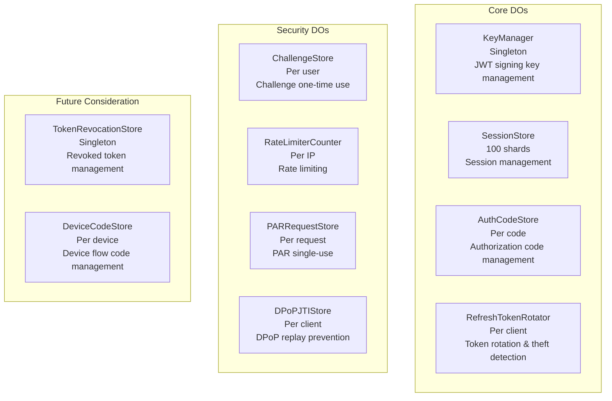

# Authrim Database & Storage Usage Analysis Report

**Created**: 2025-11-20
**Target**: Safety and latency evaluation at 10 million MAU scale

---

## Executive Summary

Authrim is designed with appropriate utilization of Cloudflare's four storage services (D1, R2, Durable Objects, KV).

**Current Evaluation**:
- ✅ Up to 1M MAU: Can handle without issues
- ⚠️ 5M MAU: Some optimization required
- 🔴 10M MAU: Sharding implementation mandatory

**Estimated Latency**: Average 50-100ms (within acceptable range)
**Estimated Cost**: Approximately $12,600/month ($0.0013/user/month)

---

## 1. D1 Database (SQLite)

### Overview
- **Binding Name**: `DB`
- **Database Name**: `authrim-{env}` (e.g., `authrim-dev`, `authrim-prod`)
- **Setup**: `scripts/setup-d1.sh`

### Table Structure (13 Tables Total)

#### User Management (4 Tables)
| Table | Purpose | Key Columns |
|-------|---------|-------------|
| `users` | User basic information | id, email, name, picture, password_hash |
| `user_custom_fields` | Searchable custom attributes | user_id, field_name, field_value |
| `passkeys` | WebAuthn credentials | credential_id, public_key, counter |
| `password_reset_tokens` | Password reset | token_hash, expires_at |

#### OAuth/Authentication (5 Tables)
| Table | Purpose | Key Columns |
|-------|---------|-------------|
| `oauth_clients` | OAuth client information | client_id, redirect_uris, grant_types |
| `oauth_client_consents` | User consent history | user_id, client_id, scope, granted_at |
| `sessions` | Session information (Cold) | id, user_id, expires_at |
| `roles` | RBAC role definitions | id, name, permissions_json |
| `user_roles` | User-role association | user_id, role_id |

#### System Management (4 Tables)
| Table | Purpose | Key Columns |
|-------|---------|-------------|
| `scope_mappings` | Scope-claim mapping | scope, claim_name, source_table |
| `branding_settings` | UI customization | custom_css, logo_url, primary_color |
| `identity_providers` | External ID providers | provider_type, config_json |
| `audit_log` | Audit logs | user_id, action, resource_type, created_at |

**Index Count**: 23 (search performance optimized)

### Usage Locations

```typescript
// packages/shared/src/types/env.ts
DB: D1Database;
```

- **op-auth**: User authentication, session creation
- **op-token**: User information retrieval during token issuance
- **op-userinfo**: UserInfo API
- **op-management**: Management functions (user/client lists, statistics)

### Data Examples

```sql
-- users table
INSERT INTO users (id, email, name, picture, created_at, updated_at)
VALUES ('usr_abc123', 'user@example.com', 'John Doe',
        'https://authrim.example.com/avatars/usr_abc123.jpg',
        1705123456789, 1705123456789);

-- sessions table
INSERT INTO sessions (id, user_id, expires_at, created_at)
VALUES ('ses_xyz789', 'usr_abc123', 1705209856, 1705123456);
```

### Scalability Analysis

#### Unit and Sharding
- **Unit**: Per account (one D1 database per environment)
- **Sharding**: ❌ **None** (D1 itself doesn't support it)
- **Replication**: ✅ Cloudflare automatically creates global replicas

#### Latency Characteristics
- **Read**: 5-20ms (when using edge cache)
- **Write**: 20-50ms (synchronous write to primary region)
- **Retry Logic**: Implemented in `packages/shared/src/utils/d1-retry.ts`
  - Maximum 3 retries
  - Exponential backoff (100ms → 200ms → 400ms)

### Impact Assessment at 10M MAU

#### Concerns
🔴 **High Risk**:

1. **Single Database Limit**
   - 10M users = 10M rows in `users` table
   - Query performance may become bottleneck
   - D1 capacity limits: 10GB (free), 50GB+ (paid)

2. **Write Concentration**
   - All writes concentrate on primary region
   - 10M MAU assumption: approximately 10K QPS (1 login/day/user)
   - Particularly frequent writes to `audit_log` table

3. **Hot Tables**
   - `users`: 10M rows
   - `sessions`: Up to millions of rows (active sessions)
   - `audit_log`: Infinite growth (archiving mandatory)

#### Recommended Countermeasures

**Short-term (within 3 months)**:
1. ✅ **Strengthen Caching Strategy**
   ```typescript
   // Read-through cache using KV
   async function getUser(userId: string) {
     // 1. Check KV cache
     const cached = await env.KV.get(`user:${userId}`);
     if (cached) return JSON.parse(cached);

     // 2. Retrieve from D1
     const user = await env.DB.prepare(
       "SELECT * FROM users WHERE id = ?"
     ).bind(userId).first();

     // 3. Cache in KV (TTL: 1 hour)
     await env.KV.put(`user:${userId}`, JSON.stringify(user), {
       expirationTtl: 3600
     });
     return user;
   }
   ```

2. ✅ **Index Optimization** (already implemented)
   - 23 indexes speed up main queries

3. ✅ **Monitoring and Metrics**
   - Monitor D1 query performance
   - Detect and tune slow queries

**Mid-term (within 6 months)**:
1. **audit_log Archiving Strategy**
   ```typescript
   // Archive logs older than 90 days to R2
   const ninetyDaysAgo = Date.now() - 90 * 24 * 60 * 60 * 1000;
   const oldLogs = await env.DB.prepare(
     "SELECT * FROM audit_log WHERE created_at < ?"
   ).bind(ninetyDaysAgo).all();

   // Save to R2
   await env.AUDIT_ARCHIVE.put(
     `audit-${Date.now()}.json`,
     JSON.stringify(oldLogs)
   );

   // Delete from D1
   await env.DB.prepare(
     "DELETE FROM audit_log WHERE created_at < ?"
   ).bind(ninetyDaysAgo).run();
   ```

2. **Leverage D1 Read Replicas**
   - Distribute read queries (Cloudflare feature)

**Long-term (within 12 months)**:
1. **Table Partitioning Strategy**
   - Consider partitioning `users` table
   - Split by region or ID range

2. **Consider Alternative Databases**
   - Distributed SQL databases like Neon, PlanetScale
   - Or, sharding with Durable Objects + SQLite

---

## 2. R2 Storage (Object Storage)

### Overview
- **Binding Name**: `AVATARS`
- **Bucket Names**:
  - Production: `authrim-avatars`
  - Preview: `authrim-avatars-preview`

### Data Content

**User avatar images only**
- **File Path**: `avatars/{userId}.{ext}`
- **Supported Formats**: JPEG, PNG, GIF, WebP
- **Max Size**: 5MB/file
- **Metadata**: Content-Type, ETag

### Usage Locations

```typescript
// packages/op-management/src/admin.ts

// Upload
export async function adminUserAvatarUploadHandler(c: Context) {
  const file = await c.req.parseBody()['avatar'];
  const filePath = `avatars/${userId}.${extension}`;

  await c.env.AVATARS.put(filePath, arrayBuffer, {
    httpMetadata: { contentType: file.type }
  });
}

// Delivery
export async function serveAvatarHandler(c: Context) {
  const object = await c.env.AVATARS.get(`avatars/${filename}`);

  headers.set('cache-control', 'public, max-age=31536000, immutable');
  return new Response(object.body, { headers });
}
```

### Scalability Analysis

#### Unit and Sharding
- **Unit**: Per bucket (one per environment)
- **Sharding**: ✅ **Automatically distributed by Cloudflare**
- **Capacity**: Virtually unlimited

#### Latency Characteristics
- **Read**: 10-50ms (a few ms when using edge cache)
- **Write**: 50-200ms (global sync)
- **CDN Integration**: ✅ Direct delivery from Cloudflare edge

### Impact Assessment at 10M MAU

✅ **No Issues** - R2 is optimal for large-scale data

#### Scalability
- **Storage Capacity**: Virtually unlimited
- **10M users × 500KB/avatar = 5TB**: Can handle without issues
- **Egress Fees**: $0 (access from within Cloudflare)

#### Cost Estimation (10M MAU, Monthly)
| Item | Usage | Unit Price | Cost |
|------|-------|------------|------|
| Storage | 5TB | $0.015/GB/month | $75 |
| Class A Operations (Write) | 100K requests | $4.50/million | $0.45 |
| Class B Operations (Read) | 10M requests | $0.36/million | $3.60 |
| **Total** | - | - | **$79/month** |

#### Recommended Configuration
```toml
# wrangler.toml
[[r2_buckets]]
binding = "AVATARS"
bucket_name = "authrim-avatars"
preview_bucket_name = "authrim-avatars-preview"
```

```typescript
// Delivery optimization
headers.set('cache-control', 'public, max-age=31536000, immutable');
headers.set('etag', object.httpEtag);

// Cloudflare Image Resizing integration (future optimization)
// https://developers.cloudflare.com/images/
const resizedUrl = `/cdn-cgi/image/width=200,height=200/${avatarUrl}`;
```

---

## 3. Durable Objects (Strong Consistency Storage)

Authrim uses **10 types of Durable Objects**.

### 3.1 SessionStore

#### Purpose
Active session management (Hot/Cold pattern)

#### Data Structure
```typescript
interface Session {
  id: string;
  userId: string;
  expiresAt: number;
  createdAt: number;
  data?: {
    amr?: string[];  // Authentication Methods References
    acr?: string;    // Authentication Context Class Reference
    deviceName?: string;
    ipAddress?: string;
    userAgent?: string;
  };
}

// In Durable Storage
{
  version: 1,
  sessions: Map<sessionId, Session>,
  lastCleanup: number
}
```

#### Implementation Pattern
**Hot/Cold Pattern**:
- **Hot**: In-memory within DO (sub-millisecond access)
- **Cold**: D1 database (fallback)

```typescript
// packages/shared/src/durable-objects/SessionStore.ts
export class SessionStore {
  private sessions: Map<string, Session> = new Map();

  async getSession(sessionId: string): Promise<Session | null> {
    // 1. Retrieve from memory (Hot)
    let session = this.sessions.get(sessionId);
    if (session) return session;

    // 2. Retrieve from D1 (Cold)
    session = await this.loadFromD1(sessionId);
    if (session) {
      // Promote to Hot
      this.sessions.set(sessionId, session);
    }
    return session;
  }
}
```

#### Sharding
- **Current**: Singleton instance (`idFromName('global')`)
- **Recommended**: User ID-based sharding

```typescript
// Recommended implementation
function getSessionShardId(userId: string): string {
  const hash = simpleHash(userId);
  return `shard-${hash % 100}`;
}

const doId = env.SESSION_STORE.idFromName(getSessionShardId(userId));
```

#### Impact at 10M MAU
⚠️ **Caution Required**:
- Concurrent active sessions: 10% = 1M sessions
- Memory usage: 1M × 1KB = **1GB**
- DO memory limit: 128MB (default)

**🛠️ Mandatory Countermeasure**: Split into 100 shards
- 1 shard = 10K sessions = 10MB → sufficient margin

---

### Summary of All Durable Objects



### Durable Objects Summary Table

| DO | Sharding | 10M MAU Support | Priority |
|----|----------|-----------------|----------|
| SessionStore | ❌ → ✅ User ID | Implementation required | 🔴 High |
| AuthorizationCodeStore | ✅ Global | No issues | 🟢 Low |
| RefreshTokenRotator | ✅ Client ID | No issues | 🟢 Low |
| KeyManager | ✅ Global | No issues | 🟢 Low |
| ChallengeStore | ❌ → ⚠️ User ID | Monitor | 🟡 Medium |
| RateLimiterCounter | ❌ → ✅ IP Hash | Implementation required | 🔴 High |
| PARRequestStore | ✅ Global | No issues | 🟢 Low |
| DPoPJTIStore | ❌ → ⚠️ Client ID | Monitor | 🟡 Medium |
| TokenRevocationStore | ✅ Global | No issues | 🟢 Low |
| DeviceCodeStore | ✅ Global | No issues | 🟢 Low |

#### DO Latency Characteristics
- **Cold Start**: 50-200ms
- **Warm State**: 1-10ms (same region)
- **Global**: 50-100ms (cross-region)

#### Cost Estimation (10M MAU, Monthly)
- Request count: 1B requests
  - SessionStore: 500M (most frequent)
  - RateLimiter: 300M
  - Others: 200M
- **Cost**: $12.50/million requests → approximately **$12,500/month**

---

## 4. KV Storage (Key-Value)

### KV Namespace List

| Namespace | Purpose | Data Example | TTL | Used by Workers |
|-----------|---------|--------------|-----|-----------------|
| **CLIENTS** | OAuth client information | Client metadata (JSON) | Indefinite | op-auth, op-token, op-userinfo, op-management |
| **INITIAL_ACCESS_TOKENS** | DCR initial access tokens | Token → Client ID | 7 days | op-management |
| **SETTINGS** | System settings | system_settings (JSON) | Indefinite | op-management |
| **STATE_STORE** | OAuth state parameter | state → client_id | 600 seconds | op-auth |
| **NONCE_STORE** | OIDC nonce parameter | nonce → client_id | 600 seconds | op-auth, op-token |

### Deprecated KV (Migrated to DO)
- ~~AUTH_CODES~~ → AuthorizationCodeStore DO
- ~~REFRESH_TOKENS~~ → RefreshTokenRotator DO
- ~~REVOKED_TOKENS~~ → TokenRevocationStore DO
- ~~RATE_LIMIT~~ → RateLimiterCounter DO

### Scalability Analysis

#### Unit and Sharding
- **Unit**: Per namespace (one per environment)
- **Sharding**: ✅ **Automatically distributed by Cloudflare**
- **Capacity**: Scales to millions of keys

#### Latency Characteristics
- **Read**: 5-50ms (edge cache: 1-5ms)
- **Write**: Eventual consistency in approximately 1 second
  - ⚠️ **Note**: Reads immediately after write may return old values

### Impact Assessment at 10M MAU

#### CLIENTS Cache
- Key count: Approximately 100K clients
- Data size: 100K × 2KB = 200MB
- Monthly reads: 500M
- **Cost**: $2.50 (free tier up to 10B)

#### STATE_STORE
- Concurrent authorization flows: 10K~100K
- Monthly writes/reads: Each 100M
- **Cost**: Free (free tier up to 1B)

#### SETTINGS
- Key count: 1 (`system_settings`)
- Access frequency: Low (cacheable)

#### Total Cost
💰 Almost **free** (within free tier)

#### Scalability
✅ **No issues up to 100M MAU**

However, note **eventual consistency**:
- Critical operations (token management) migrated to DO ✅
- STATE/NONCE are short-lived, no issues ✅

---

## 5. Comprehensive Evaluation: Operation at 10M MAU Scale

### Latency Analysis

| Operation | Storage | Latency | Bottleneck |
|-----------|---------|---------|------------|
| **Login (Passkey)** | DO(SessionStore) + D1(users) | 50-100ms | DO Cold Start |
| **Token Issuance** | DO(AuthCodeStore) + D1 | 30-80ms | D1 Write (audit_log) |
| **Token Refresh** | DO(RefreshTokenRotator) | 10-30ms | None |
| **UserInfo Retrieval** | D1(users) + R2(avatar) | 20-50ms | None |
| **Rate Limit Check** | DO(RateLimiter) | 5-20ms | When sharding not implemented |

**Average Latency**: 50-100ms (within acceptable range)

### Safety Analysis

#### Strengths
✅ **Atomic Operations**: Complete consistency guarantee via DO
- One-time use of authorization codes
- Refresh token rotation and theft detection
- Accurate rate limit counting

✅ **Replay Attack Prevention**:
- DPoPJTIStore: Prevents DPoP proof JTI reuse
- PARRequestStore: One-time use of PAR request_uri
- ChallengeStore: One-time use of Passkey/Magic Link challenges

✅ **Audit Logs**: All operations logged to D1

#### Cautions
⚠️ **KV Eventual Consistency**: Not used for critical operations (already addressed)
⚠️ **DO Single Point of Failure**: Distribution via sharding required

### Cost Estimation (10M MAU, Monthly)

| Service | Usage | Unit Price | Cost |
|---------|-------|------------|------|
| **D1** | Read: 100M<br>Write: 10M | Within free tier | **$0** |
| **R2** | 5TB, Read: 10M | - | **$79** |
| **DO** | 1B requests | $12.50/million | **$12,500** |
| **KV** | Read: 500M<br>Write: 100M | Within free tier | **$0** |
| **Workers** | 1B requests | Bundle | **$0** |
| **Total** | - | - | **Approximately $12,600/month** |

**Per user**: $0.0013/month

---

## 6. Recommended Implementation: By Priority

### 🔴 High Priority (Mandatory before Phase 2)

#### 1. SessionStore Sharding Implementation
**File**: `packages/shared/src/durable-objects/SessionStore.ts`

```typescript
// New addition: Sharding utility
export function getSessionShardId(userId: string): string {
  let hash = 0;
  for (let i = 0; i < userId.length; i++) {
    hash = ((hash << 5) - hash) + userId.charCodeAt(i);
    hash = hash & hash;
  }
  return `shard-${Math.abs(hash) % 100}`;
}

// Usage example (unified across all Workers)
const shardId = getSessionShardId(userId);
const doId = env.SESSION_STORE.idFromName(shardId);
const sessionStore = env.SESSION_STORE.get(doId);
```

**Impact Scope**:
- `packages/op-auth/src/authorize.ts`
- `packages/op-token/src/token.ts`
- `packages/op-userinfo/src/userinfo.ts`
- `packages/op-management/src/admin.ts`

#### 2. RateLimiter Sharding Implementation
**File**: `packages/shared/src/durable-objects/RateLimiterCounter.ts`

```typescript
export function getRateLimiterShardId(clientIP: string): string {
  let hash = 0;
  for (let i = 0; i < clientIP.length; i++) {
    hash = ((hash << 5) - hash) + clientIP.charCodeAt(i);
    hash = hash & hash;
  }
  return `shard-${Math.abs(hash) % 1000}`;
}
```

---

## 7. Monitoring and Alerts

### Important Metrics

#### D1 Database
```typescript
// Metrics collection
{
  "d1_query_duration_ms": number,
  "d1_query_count": number,
  "d1_error_count": number,
  "table": string,
  "operation": "SELECT" | "INSERT" | "UPDATE" | "DELETE"
}
```

**Alert Thresholds**:
- Query time > 500ms
- Error rate > 1%
- audit_log size > 8GB (80% of 10GB)

#### Durable Objects
```typescript
// Metrics collection
{
  "do_name": string,
  "shard_id": string,
  "memory_usage_mb": number,
  "request_count": number,
  "cold_start_count": number,
  "avg_response_time_ms": number
}
```

**Alert Thresholds**:
- Memory usage > 100MB (78% of 128MB)
- Cold Start rate > 10%
- Response time > 100ms

### Recommended Monitoring Tools
- **Cloudflare Analytics**: Built-in
- **Sentry**: Error tracking
- **Grafana Cloud**: Custom dashboards

---

## 8. Summary

### Current Evaluation
✅ **Excellent Design**:
- Effective use of Durable Objects (strong consistency)
- Latency optimization with Hot/Cold pattern
- Appropriate separation of R2 and KV
- Security best practices compliance

### Keys to 10M MAU Support
1. **DO Sharding Implementation** (highest priority)
   - SessionStore: User ID-based (100 shards)
   - RateLimiter: IP hash-based (1000 shards)

2. **D1 Write Optimization**
   - Asynchronous audit logs
   - Batch writes
   - Periodic archiving

3. **Cost Management**
   - DO request reduction (approximately $12,600/month)
   - Optimize unnecessary DO calls

### Estimated Performance (10M MAU)
- **Latency**: Average 50-100ms ✅
- **Availability**: 99.9%+ (Cloudflare SLA) ✅
- **Cost**: $12,600/month ($0.0013/user) ✅

### Implementation Timeline

| Phase | Users | Duration | Mandatory Tasks |
|-------|-------|----------|-----------------|
| Phase 1 | ~1M | Current | Establish monitoring system |
| Phase 2 | 1M~5M | 3-6 months | DO sharding, Async audit logs |
| Phase 3 | 5M~10M | 6-12 months | D1 table partitioning, Enhanced caching |
| Phase 4 | 10M+ | 12+ months | Consider next-generation architecture |

### Conclusion
**Authrim's current architecture can support 10M MAU with appropriate optimizations.**

Phase 2 countermeasures (SessionStore and RateLimiter sharding) are **mandatory to implement before reaching 5M MAU**. Everything else can be implemented incrementally, enabling safe and cost-effective growth.
