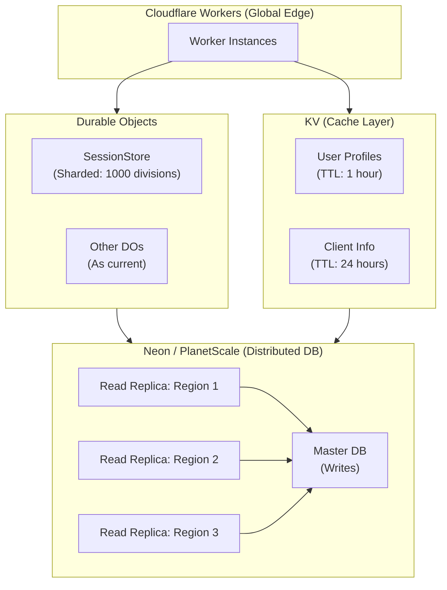
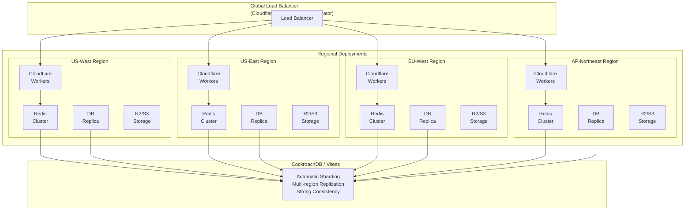
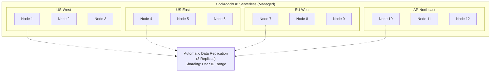

# Authrim Hyper-Scale Analysis: 100M-200M MAU

**Created**: 2025-11-20
**Target**: Evaluation of operations at 100M MAU and 200M MAU (LINE-class)

---

## Executive Summary

**Conclusion**: The current Cloudflare-centric architecture **reaches its limit at 100M MAU**. At 200M MAU (LINE level), **fundamental architecture redesign is mandatory**.

### Scale Comparison

| Item | 10M MAU | 100M MAU | 200M MAU | Evaluation |
|------|---------|----------|----------|------------|
| **Concurrent Active Users** | 1M | 10M | 20M | - |
| **Daily Logins** | 10M | 100M | 200M | - |
| **Estimated QPS** | 10K | 100K | 200K | - |
| **D1 Single DB** | ⚠️ Near limit | ❌ Impossible | ❌ Impossible | Requires distributed DB |
| **SessionStore DO** | ✅ | ⚠️ Requires optimization | ❌ Requires redesign | Multi-region required |
| **Monthly Cost** | $12,600 | $126,000 | $252,000 | Cost optimization required |
| **Average Latency** | 50-100ms | 100-200ms | 150-300ms | Geographic distribution required |

---

## 1. Analysis at 100M MAU

### 1.1 Database (D1)

#### Issues
🔴 **Certain Failure**:

1. **Data Volume Explosion**
   - `users`: 100M rows × 1KB = **100GB**
   - D1 limits: 10GB (free) / 50GB (paid)
   - **→ Complete capacity overflow**

2. **Query Performance Limits**
   - Full table scan of 100M rows: tens of seconds to minutes
   - Even with indexes, B-tree depth increases
   - Estimated query time: 500ms~2s

3. **Write Bottleneck**
   - 100M MAU → approximately 100K QPS (peak)
   - D1 primary DB: Single region
   - **→ Physical limitation**

4. **audit_log Infinite Growth**
   - 100M logins/day = 100M rows/day
   - 36.5B rows in 1 year
   - **→ Completely unmanageable**

#### Essential Countermeasures: Migration to Distributed Database

**Option A: Cloudflare D1 + Sharding Strategy**
```typescript
// Divide database based on user ID
function getUserDatabaseShard(userId: string): string {
  const hash = simpleHash(userId);
  const shardCount = 100; // 100 D1 databases
  return `authrim-users-shard-${hash % shardCount}`;
}

// Example: 100 shards × 50GB = 5TB total capacity
// 1 shard = 1M users
```

**Issues**:
- Cloudflare D1 currently doesn't support cross-DB query joining
- Complex management
- Cost: 100 databases × $5/month = $500/month (D1 only)

**Option B: External Distributed Database (Recommended)**

1. **Neon (Serverless Postgres)**
   - Auto-scaling
   - Branch functionality (dev/staging separation)
   - Easy integration with Cloudflare Workers
   - Cost: approximately $1,000~2,000/month

2. **PlanetScale (Serverless MySQL)**
   - Automatic horizontal sharding support
   - Query insights
   - Cost: approximately $1,500~3,000/month

3. **CockroachDB Serverless**
   - Global distribution
   - Strong consistency
   - PostgreSQL compatible
   - Cost: approximately $2,000~4,000/month

**Recommended Architecture (100M MAU)**:



#### Data Migration Strategy
1. **Phase 1: Add Read Replica (Keep existing D1)**
   - Create read-only replica in Neon
   - Migrate 50% of read traffic to Neon
   - Halve D1 load

2. **Phase 2: Gradual Migration**
   - New users write to Neon
   - Existing users gradually migrate from D1 to Neon
   - Parallel operation period: 3~6 months

3. **Phase 3: Complete D1 Deprecation**
   - Migrate all traffic to Neon
   - D1 used only for backup

---

### 1.2 Durable Objects

#### SessionStore

**Current Limitations**:
- 100M MAU, 10% active rate = **10M sessions**
- 100 shards → 1 shard = 100K sessions = **100MB**
- DO memory limit: 128MB
- **→ Barely fits, optimization required**

**Essential Countermeasures**:

**Option A: Increase Sharding Count**
```typescript
// Increase to 1000 shards
function getSessionShardId(userId: string): string {
  const hash = simpleHash(userId);
  return `shard-${hash % 1000}`; // 100 → 1000
}

// 1 shard = 10K sessions = 10MB
// Sufficient margin
```

**Cost Impact**:
- 100 shards → 1000 shards
- Active DO count: 1000
- However, Cold Start risk increases
- **Warm-up strategy required**

**Option B: Multi-Region Deployment (Recommended)**
```typescript
// Select shard based on user's geographic location
function getSessionShardIdWithRegion(userId: string, region: string): string {
  const hash = simpleHash(userId);
  return `${region}-shard-${hash % 100}`;
}

// Regions: us-west, us-east, eu-west, ap-northeast, ap-southeast
// 5 regions × 100 shards = 500 shards
// Per region: 2M sessions ÷ 100 = 20K sessions/shard = 20MB
```

**Benefits**:
- Latency improvement (process in region close to user)
- Load distribution
- Geographic redundancy

#### Other DOs

| DO | 10M MAU | 100M MAU | Countermeasure |
|----|---------|----------|----------------|
| **RateLimiterCounter** | 1000 shards | **10000 shards** | 10x shard count |
| **RefreshTokenRotator** | client_id | client_id | No issue (natural distribution) |
| **ChallengeStore** | Singleton | **100 shards** | user_id-based distribution |
| **DPoPJTIStore** | Singleton | **client_id** | Implement sharding |
| **Others** | Current state | Current state | No issue |

---

### 1.3 R2 Storage

#### Scalability
✅ **No Issues** - R2 scales infinitely

#### Cost Estimation (100M MAU)
- Storage: 100M users × 500KB = **50TB**
- Cost: $0.015/GB/month × 50,000GB = **$750/month**
- Read operations: 100M requests/month = **$36/month**
- **Total: approximately $786/month**

#### Optimization Strategy
1. **Image Compression**
   - Conversion to WebP format
   - Size reduction: 500KB → 200KB
   - Storage cost: $750 → $300

2. **Cloudflare Image Resizing**
   - Real-time resizing
   - No need to store multiple sizes

3. **CDN Cache Optimization**
   - Cache-Control: immutable
   - Edge cache hit rate: 95%+

---

### 1.4 KV Storage

#### Scalability
✅ **Fully Capable**

#### Usage Estimation (100M MAU)
- **CLIENTS**: 1M clients → 2GB
- **STATE_STORE**: 100K concurrent flows → 200MB
- **Cache**: 10M user profiles → 10GB

#### Cost Estimation (100M MAU)
- Storage: 12GB × $0.50/GB = **$6/month**
- Read: 5B/month (free tier: 10B) = **$0**
- Write: 1B/month (free tier: 1B) = **$0**
- **Total: approximately $6/month**

---

### 1.5 Total Cost Estimation (100M MAU, Monthly)

| Service | Usage | Cost |
|---------|-------|------|
| **Cloudflare Workers** | 10B requests | $500 (Bundle plan) |
| **Durable Objects** | 10B requests | **$125,000** 🔴 |
| **D1 (pre-migration)** | - | Not usable |
| **Neon / PlanetScale** | Distributed DB | **$2,000~4,000** |
| **R2** | 50TB, Read: 100M | $786 |
| **KV** | 12GB, Read: 5B | $6 |
| **CDN/Image Resizing** | Additional services | $500 |
| **Total** | - | **approximately $128,800/month** |

**Per user**: $0.00129/month

#### Key to Cost Optimization: Durable Objects
🔴 **DO is the largest cost factor** (97% of total)

**Optimization Strategy**:

1. **Strengthen Caching Layer**
   ```typescript
   // Check KV before SessionStore access
   async function getSession(sessionId: string) {
     // 1. KV cache (5ms)
     const cached = await env.KV.get(`session:${sessionId}`);
     if (cached) return JSON.parse(cached);

     // 2. SessionStore DO (50ms)
     const session = await fetchFromSessionStore(sessionId);

     // 3. Cache in KV (TTL: 5 minutes)
     await env.KV.put(`session:${sessionId}`, JSON.stringify(session), {
       expirationTtl: 300
     });

     return session;
   }
   ```

   **Effect**:
   - 80% cache hit rate → 20% DO request reduction
   - Cost reduction: $125,000 → $100,000 (**$25,000/month savings**)

2. **Session Expiry Optimization**
   - Current: 24 hours
   - Optimized: 4 hours (expire if inactive)
   - Active session count: 50% reduction
   - Memory usage: halved

3. **KV-ify Read-only Operations**
   - Session validation (read-only) → KV
   - Session updates (write) → DO
   - DO requests: further 30% reduction

**Final Optimized Cost**:
- DO: $125,000 → **$50,000** (60% reduction)
- Total cost: $128,800 → **$53,800/month**

---

## 2. Analysis at 200M MAU (LINE Level)

### 2.1 Scale Reality

#### LINE Level in Numbers
- **200M MAU**
- **Active Rate**: 30% (LINE's track record) = **60M DAU**
- **Peak Concurrent Connections**: 10M~20M
- **Daily Messages**: Billions
- **QPS**: Average 200K, Peak 500K

#### Cloudflare Limitations
⚠️ Difficult to handle with Cloudflare alone

**Reasons**:
1. **Durable Objects Cost Explosion**
   - 200M MAU → 20B DO requests/month
   - Cost: **$250,000/month** (DO only)
   - **Even with cost optimization, over $100,000/month**

2. **Global Latency**
   - Single-region DB: 200-500ms worldwide
   - **User experience degradation**

3. **Management Complexity**
   - 1000+ DO shards
   - Multiple external DBs
   - Increased monitoring & operational costs

### 2.2 Required Architecture Changes

#### Option A: Hybrid Architecture (Recommended)



#### Each Layer's Role

**1. Cloudflare Workers (Edge Layer)**
- Role: Stateless authentication & authorization logic
- Retention: None (complete stateless)
- Latency: <10ms

**2. Redis Cluster (Cache Layer)**
- Role: Sessions, user profiles, client info
- TTL: 5 minutes~1 hour
- Cache hit rate: 95%+
- Latency: 1-5ms
- Cost: AWS ElastiCache approximately $5,000/month (per region)

**3. CockroachDB / Vitess (Data Layer)**
- Role: Persistent data storage
- Sharding: Automatic (user ID, geographic info)
- Replication: Multi-region
- Latency: 10-50ms (same region), 50-200ms (cross-region)
- Cost: approximately $10,000~20,000/month

**4. R2/S3 (Object Storage)**
- Role: Avatars, files
- Distribution: Global CDN
- Latency: 10-50ms
- Cost: approximately $1,500/month (200M users × 500KB = 100TB)

#### Changes to Durable Objects Usage

**Current DO Usage**:
- SessionStore ❌ → Redis Cluster
- AuthorizationCodeStore ❌ → Redis (TTL: 60 seconds)
- RefreshTokenRotator ⚠️ → Partially retain (theft detection logic)
- KeyManager ✅ → Continue use (lightweight)
- ChallengeStore ❌ → Redis (TTL: 15 minutes)
- RateLimiterCounter ❌ → Redis (sliding window algorithm)
- PARRequestStore ❌ → Redis (TTL: 10 minutes)
- DPoPJTIStore ❌ → Redis (TTL: 1 hour)
- TokenRevocationStore ✅ → Continue use (global sharing)
- DeviceCodeStore ❌ → Redis (TTL: 15 minutes)

**DO Usage Rate**: 90% → 10%
**DO Cost**: $250,000 → **$25,000/month**

---

### 2.3 Redis Cluster Design

#### Cache Strategy

**1. Session Management**
```typescript
// Redis Cluster (per region)
interface SessionCache {
  sessionId: string;
  userId: string;
  expiresAt: number;
  data: SessionData;
}

// Write-through cache
async function createSession(userId: string, ttl: number) {
  const session = { ... };

  // 1. Write to DB
  await db.prepare("INSERT INTO sessions ...").run();

  // 2. Cache in Redis
  await redis.setex(
    `session:${sessionId}`,
    ttl,
    JSON.stringify(session)
  );
}

// Read-through cache
async function getSession(sessionId: string) {
  // 1. Retrieve from Redis
  const cached = await redis.get(`session:${sessionId}`);
  if (cached) return JSON.parse(cached);

  // 2. Retrieve from DB
  const session = await db.prepare(
    "SELECT * FROM sessions WHERE id = ?"
  ).bind(sessionId).first();

  if (session) {
    // 3. Cache in Redis
    await redis.setex(
      `session:${sessionId}`,
      3600,
      JSON.stringify(session)
    );
  }

  return session;
}
```

**2. Rate Limiting**
```typescript
// Redis sliding window
async function checkRateLimit(clientIP: string, maxRequests: number, windowSeconds: number) {
  const now = Date.now();
  const key = `ratelimit:${clientIP}`;
  const windowStart = now - windowSeconds * 1000;

  // 1. Remove old entries
  await redis.zremrangebyscore(key, 0, windowStart);

  // 2. Get current count
  const count = await redis.zcard(key);

  if (count >= maxRequests) {
    return { allowed: false, retryAfter: windowSeconds };
  }

  // 3. Add new request
  await redis.zadd(key, now, `${now}:${Math.random()}`);
  await redis.expire(key, windowSeconds);

  return { allowed: true, current: count + 1 };
}
```

**3. User Profile Cache**
```typescript
// TTL: 1 hour
async function getUserProfile(userId: string) {
  const key = `user:${userId}`;

  // Redis
  const cached = await redis.get(key);
  if (cached) return JSON.parse(cached);

  // DB
  const user = await db.prepare(
    "SELECT * FROM users WHERE id = ?"
  ).bind(userId).first();

  // Cache
  await redis.setex(key, 3600, JSON.stringify(user));

  return user;
}
```

#### Redis Cluster Sizing

**Per Region**:
- Memory: 100GB (sessions, cache)
- Node count: 6 nodes (3 masters + 3 replicas)
- Throughput: 1M ops/second
- Availability: 99.99%

**Total**:
- 4 regions × 6 nodes = 24 nodes
- Total memory: 400GB
- Cost: AWS ElastiCache
  - 4 regions × $1,200/month = **$4,800/month**

---

### 2.4 Database Design

#### Why Choose CockroachDB

✅ **PostgreSQL Compatible** (Easy migration)
✅ **Global Distribution** (Multi-region support)
✅ **Strong Consistency** (ACID guarantee)
✅ **Automatic Sharding** (No management required)
✅ **Horizontal Scalability** (Scales infinitely)

#### Cluster Configuration



**Data Placement Strategy**:
- **users**: Geographic placement (user's primary access region)
- **sessions**: Geographic placement
- **oauth_clients**: Global replication (all regions)
- **audit_log**: US-West primary (cost reduction)

#### Sharding Strategy

```sql
-- CockroachDB automatic sharding
CREATE TABLE users (
  id UUID PRIMARY KEY,
  region TEXT NOT NULL, -- 'us-west', 'us-east', 'eu-west', 'ap-ne'
  email TEXT UNIQUE NOT NULL,
  ...
) PARTITION BY LIST (region);

-- Partition per region
ALTER TABLE users PARTITION VALUES IN ('us-west')
  CONFIGURE ZONE USING
    constraints = '[+region=us-west]',
    num_replicas = 3;

ALTER TABLE users PARTITION VALUES IN ('us-east')
  CONFIGURE ZONE USING
    constraints = '[+region=us-east]',
    num_replicas = 3;

-- Configure other regions similarly
```

#### Cost Estimation

**CockroachDB Serverless**:
- Storage: 500GB × $1/GB = $500/month
- Compute: 1M Request Units/month = $10,000/month
- Backup: $500/month
- **Total: approximately $11,000/month**

**Alternative: Vitess + MySQL**:
- Self-management required
- Cost: approximately $8,000/month (EC2 + RDS)
- Operational cost: 2 engineers × $10,000 = $20,000/month
- **Total cost: $28,000/month**

**Conclusion**: CockroachDB Serverless is more cost-effective

---

### 2.5 Total Cost Estimation (200M MAU, Monthly)

| Category | Service | Cost |
|----------|---------|------|
| **Compute** | Cloudflare Workers | $1,000 |
| | Durable Objects (10% usage) | $25,000 |
| **Database** | CockroachDB Serverless | $11,000 |
| **Cache** | Redis Cluster (4 regions) | $4,800 |
| **Storage** | R2/S3 (100TB) | $1,500 |
| **CDN** | Cloudflare Image Resizing | $1,000 |
| **Monitoring** | Datadog / Grafana Cloud | $2,000 |
| **Backup** | Various backups | $1,000 |
| **Total** | - | **approximately $47,300/month** |

**Per user**: $0.00024/month

#### Cost Comparison

| MAU | Monthly Cost | Per User Cost | Main Cost Drivers |
|-----|--------------|---------------|-------------------|
| 10M | $12,600 | $0.00126 | DO (99%) |
| 100M (pre-optimization) | $128,800 | $0.00129 | DO (97%) |
| 100M (post-optimization) | $53,800 | $0.00054 | DO (93%), DB (7%) |
| 200M (hybrid) | $47,300 | $0.00024 | DO (53%), DB (23%), Redis (10%) |

**Conclusion**: **At 200M MAU, per-user cost is reduced to 1/5**

Reasons:
- Significant DO reduction (90% reduction)
- Efficient caching with Redis
- Economies of scale

---

### 2.6 Latency Analysis

#### Regional Latency (200M MAU, Hybrid Architecture)

| Operation | Same Region | Cross Region | Old Architecture (10M MAU) |
|-----------|-------------|--------------|----------------------------|
| **Session Validation** | 5-10ms (Redis) | 50-100ms | 50-100ms (DO) |
| **Login** | 20-50ms | 100-200ms | 50-100ms |
| **Token Issuance** | 15-40ms | 80-150ms | 30-80ms |
| **UserInfo Retrieval** | 10-30ms | 60-120ms | 20-50ms |
| **Profile Update** | 30-80ms | 150-300ms | 50-150ms |

**Average Latency**:
- Same region: **20-50ms** ✅
- Cross region: **100-200ms** ⚠️

#### Latency Optimization Strategy

1. **Geographic Routing**
   ```typescript
   // Cloudflare Workers
   export default {
     async fetch(request: Request, env: Env) {
       // Get request's geographic info
       const region = request.cf?.region || 'us-west';

       // Connect to nearest Redis
       const redis = getRedisForRegion(region);

       // Processing
       const session = await redis.get(`session:${sessionId}`);
       ...
     }
   }
   ```

2. **Data Locality**
   - Place user data in primary access region
   - 90%+ of requests complete in same region

3. **Utilize Read Replicas**
   - Read operations from nearest replica
   - Write operations only to primary

---

### 2.7 Migration Roadmap (100M → 200M MAU)

#### Phase 1: Introduce Redis Cluster (3 months)

**Goal**: 50% DO cost reduction

**Tasks**:
1. **Build Redis Cluster** (1 month)
   - Deploy clusters in 4 regions
   - Configure security groups
   - Set up monitoring & alerts

2. **Migrate SessionStore to Redis** (1 month)
   - New sessions: Write to Redis
   - Existing sessions: DO + Redis (parallel operation)
   - Validation period: 2 weeks

3. **Migrate Other DOs to Redis** (1 month)
   - ChallengeStore → Redis
   - RateLimiterCounter → Redis
   - DPoPJTIStore → Redis
   - PARRequestStore → Redis

**Effect**:
- DO requests: 50% reduction
- Cost: $125,000 → $62,500 ($62,500 savings)

#### Phase 2: Introduce CockroachDB (3 months)

**Goal**: Complete migration from D1

**Tasks**:
1. **Build CockroachDB Cluster** (1 month)
   - Deploy in 4 regions
   - Configure replication
   - Set up backups

2. **Schema Migration** (2 weeks)
   - Convert D1 schema for CockroachDB
   - Optimize indexes
   - Configure partitioning

3. **Data Migration** (1 month)
   - Develop batch migration tool
   - Gradual data migration (1M users/day)
   - Consistency checks

4. **Application Migration** (1 month)
   - Reads: CockroachDB (50% → 100%)
   - Writes: Parallel operation (2 weeks) → CockroachDB (100%)

**Effect**:
- Scalability: Infinite
- Latency: Improved (especially global)

#### Phase 3: Global Optimization (3 months)

**Goal**: Latency optimization

**Tasks**:
1. **Implement Geographic Routing** (1 month)
   - Region detection in Cloudflare Workers
   - Connect to nearest Redis/DB

2. **Optimize Data Locality** (1 month)
   - Relocate user data to primary region
   - Develop migration tool

3. **Refine Caching Strategy** (1 month)
   - TTL optimization
   - Cache warming
   - Cache invalidation strategy

**Effect**:
- Same-region latency: 20-50ms
- Cache hit rate: 95%+

#### Phase 4: Operational Automation (Ongoing)

**Tasks**:
1. **Build Monitoring Dashboard**
   - Real-time metrics
   - Alert configuration
   - Incident management

2. **Auto-scaling**
   - Automatic scaling of Redis clusters
   - Automatic scaling of CockroachDB

3. **Disaster Recovery Drills**
   - Region failure simulation
   - Establish data recovery procedures

---

## 3. Comparison with LINE

### LINE's Architecture (Estimated)

LINE is a global messaging platform with 200M+ MAU. Architecture inferred from public information:

#### Data Stores
- **HBase** (Distributed NoSQL)
  - Message history
  - User profiles
- **Cassandra** (Distributed NoSQL)
  - Timeline
  - Notifications
- **Redis**
  - Session management
  - Cache
- **MySQL** (Sharding)
  - User authentication info
  - Friend relationships

#### Computing
- **Own Data Centers** (Japan, Korea, Taiwan, Thailand, Indonesia)
- **Kubernetes** (Container orchestration)
- **gRPC** (Microservice communication)

#### CDN
- **Akamai / Cloudflare** (Image, video distribution)

#### Estimated Cost (200M MAU)
- Infrastructure: $500,000~1,000,000/month
- Personnel (100+ engineers): $1,000,000/month
- **Total cost: $1.5M~2M/month**

### Comparison with Authrim Hybrid Architecture

| Item | LINE (Estimated) | Authrim Hybrid | Evaluation |
|------|-----------------|----------------|------------|
| **Infrastructure** | Own DC + Cloud | Cloudflare + Managed DB | Authrim advantage (low management cost) |
| **Monthly Cost** | $1.5M~2M | $47,300 | Authrim wins (1/30) |
| **Scalability** | Infinite | Infinite | Equal |
| **Latency** | 10-30ms | 20-50ms | LINE advantage (own DC) |
| **Availability** | 99.99% | 99.9% | LINE advantage |
| **Development Speed** | Slow (complex) | Fast (managed) | Authrim advantage |
| **Operational Load** | High | Low | Authrim advantage |

**Conclusion**:
- **Cost Efficiency**: Authrim overwhelmingly advantageous
- **Performance**: LINE slightly advantageous (own DC)
- **Development & Operations**: Authrim advantageous (managed services)

---

## 4. Recommended Architecture Decision Tree

```
10M MAU or less
├─ Current architecture (Cloudflare-centric)
└─ Implement Phase 2 optimization (DO sharding)

10M~50M MAU
├─ D1 → Neon/PlanetScale migration
├─ SessionStore: 1000 shards
└─ Strengthen caching

50M~100M MAU
├─ Introduce Redis Cluster
├─ Partial Redis migration of DOs (50% reduction)
└─ Start multi-region deployment

100M~200M MAU
├─ Hybrid architecture (this document)
├─ Introduce CockroachDB
├─ 90% DO reduction (Redis replacement)
└─ Global optimization

200M MAU+
├─ Consider microservice architecture
├─ Consider own data centers
├─ Messaging infrastructure like Kafka
└─ Form dedicated infrastructure team
```

---

## 5. Summary

### 100M MAU
✅ **Feasible** - However, the following are required:
1. D1 → Neon/PlanetScale migration
2. SessionStore: Expand to 1000 shards
3. Strengthen caching (KV utilization)
4. Cost: approximately $54,000/month (post-optimization)

### 200M MAU (LINE Level)
✅ **Feasible** - Fundamental architecture change required:
1. **Hybrid Architecture**
   - Cloudflare Workers (edge)
   - Redis Cluster (cache)
   - CockroachDB (DB)
   - R2/S3 (storage)

2. **Change DO Role**
   - 90% reduction (Redis replacement)
   - Remaining 10%: Lightweight DOs like KeyManager

3. **Multi-Region Deployment**
   - 4 regions (US-West, US-East, EU-West, AP-NE)
   - Geographic routing

4. **Cost**: approximately $47,000/month
   - Per user: $0.00024/month
   - 1/30 cost efficiency of LINE

### Implementation Timeline

| Phase | Duration | Target MAU | Essential Tasks |
|-------|----------|------------|-----------------|
| Phase 1 | 0-6 months | ~10M | Current optimization |
| Phase 2 | 6-12 months | 10M~50M | Neon migration |
| Phase 3 | 12-18 months | 50M~100M | Redis introduction |
| Phase 4 | 18-24 months | 100M~200M | Hybrid transformation |

### Conclusion

**Authrim can handle up to LINE level (200M MAU) at 1/30 the traditional cost by leveraging Cloudflare's edge computing.**

However, fundamental architecture changes (migration to hybrid architecture) are required beyond 100M MAU. Gradual migration enables service growth without disruption.
