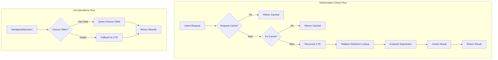

# Phase 3: ReBAC + RBAC + ABAC Implementation Documentation

## Overview

In Phase 3, we implemented Zanzibar-lite style Relationship-Based Access Control (ReBAC).
This enables more flexible relationship-based permission management in addition to existing RBAC (Role-Based Access Control).

## Architecture



## Implementation Components

### 1. Database Migrations

#### Migration 017: relationship_closure Table
- **Purpose**: Speed up `listObjects` / `listUsers` queries
- **Table**: `relationship_closure`
- **Features**: Stores pre-computed transitive relationships

```sql
CREATE TABLE relationship_closure (
  id TEXT PRIMARY KEY,
  tenant_id TEXT NOT NULL,
  ancestor_type TEXT NOT NULL,
  ancestor_id TEXT NOT NULL,
  descendant_type TEXT NOT NULL,
  descendant_id TEXT NOT NULL,
  relation TEXT NOT NULL,
  depth INTEGER NOT NULL DEFAULT 0,
  path_json TEXT,
  effective_permission TEXT,
  created_at INTEGER NOT NULL,
  updated_at INTEGER NOT NULL
);
```

#### Migration 018: relation_definitions Table
- **Purpose**: Store Relation DSL definitions (union, tuple-to-userset)
- **Table**: `relation_definitions`

```sql
CREATE TABLE relation_definitions (
  id TEXT PRIMARY KEY,
  tenant_id TEXT NOT NULL,
  object_type TEXT NOT NULL,
  relation_name TEXT NOT NULL,
  definition_json TEXT NOT NULL,
  description TEXT,
  priority INTEGER NOT NULL DEFAULT 0,
  is_active INTEGER NOT NULL DEFAULT 1
);
```

#### Migration 019: VC/DID Abstraction Layer
- **Purpose**: Foundation for future VC/DID support
- **Tables**:
  - `subject_identifiers`: User identifier abstraction
  - `verified_attributes`: Verified attributes (empty, for future VC claims)
- **Changes**: Added `evidence_type`, `evidence_ref` columns to `relationships` table

### 2. ReBAC Service

#### Main Interfaces

```typescript
interface IReBACService {
  // Authorization check
  check(request: CheckRequest): Promise<CheckResponse>;
  batchCheck(request: BatchCheckRequest): Promise<BatchCheckResponse>;

  // List operations
  listObjects(request: ListObjectsRequest): Promise<ListObjectsResponse>;
  listUsers(request: ListUsersRequest): Promise<ListUsersResponse>;

  // Cache management
  invalidateCache(tenantId, objectType, objectId, relation?): Promise<void>;
  invalidateUserCache(tenantId, userId): Promise<void>;
}
```

#### check() Resolution Order

1. **Request-scoped Cache**: Prevent duplicate queries within the same request
2. **KV Cache**: Cache with 60-second TTL
3. **Recursive CTE**: Recursive query in D1 database

```typescript
// Usage example
const result = await rebacService.check({
  tenant_id: 'tenant_123',
  user_id: 'user_456',
  relation: 'viewer',
  object: 'document:doc_789',
});
// { allowed: true, resolved_via: 'computed' }
```

### 3. Relation DSL

Phase 3 supports the following expression types:

#### Direct Relation
Matches direct relationship tuples

```json
{
  "type": "direct",
  "relation": "viewer"
}
```

#### Union Relation
OR of multiple expressions

```json
{
  "type": "union",
  "children": [
    { "type": "direct", "relation": "owner" },
    { "type": "direct", "relation": "editor" },
    { "type": "direct", "relation": "viewer" }
  ]
}
```

#### Tuple-to-Userset
Inheritance from related objects

```json
{
  "type": "tuple_to_userset",
  "tupleset": { "relation": "parent" },
  "computed_userset": { "relation": "viewer" }
}
```

### 4. Closure Manager

Manages pre-computed tables for `listObjects` / `listUsers` queries

```typescript
// List of objects accessible to a user
const { objectIds } = await closureManager.getObjectsForUser(
  'tenant_123',
  'user_456',
  'viewer',
  'document'
);

// List of users who can access an object
const { userIds } = await closureManager.getUsersForObject(
  'tenant_123',
  'document',
  'doc_789',
  'viewer'
);
```

### 5. KV Cache Manager

KV-based cache management (TTL: 60 seconds)

```typescript
// Cache key format
// rebac:check:{tenant_id}:{user_id}:{relation}:{object_type}:{object_id}

// Cache invalidation
await cacheManager.invalidateObject('tenant_123', 'document', 'doc_789');
await cacheManager.invalidateUser('tenant_123', 'user_456');
```

### 6. ABAC Extension (Policy Engine)

Added attribute-based conditions to the Policy Engine:

```typescript
// New condition types
type ConditionType =
  | 'attribute_equals'   // Attribute value match
  | 'attribute_exists'   // Attribute existence
  | 'attribute_in';      // Attribute value in list

// Verified attributes
interface VerifiedAttribute {
  name: string;
  value: string | null;
  source: string;       // 'manual' | 'vc' | 'external'
  issuer?: string;      // VC issuer (for future use)
  expiresAt?: number;   // Expiration time
}
```

## File Structure

```
packages/shared/src/rebac/
├── types.ts           # Type definitions
├── interfaces.ts      # Interface definitions
├── cache-manager.ts   # KV cache management
├── relation-parser.ts # Relation DSL parser
├── rebac-service.ts   # Main service implementation
├── closure-manager.ts # Closure Table management
└── index.ts           # Exports

packages/policy-core/src/
├── types.ts           # ABAC type additions
├── engine.ts          # ABAC condition evaluation additions
└── index.ts           # New type exports added

migrations/
├── 017_rebac_closure_table.sql
├── 018_rebac_relation_definitions.sql
└── 019_vc_did_abstraction.sql
```

## Design Decisions

### Why check() Doesn't Use Closure Table

| Aspect | Recursive CTE | Closure Table |
|--------|--------------|---------------|
| Freshness | Always current | Has latency |
| Write Cost | None | Recompute on relationship changes |
| Read Cost | Moderate | Low |
| Flexibility | High | Moderate |

**Conclusion**: `check()` uses Recursive CTE + KV Cache because real-time accuracy is critical.
`listObjects/listUsers` uses Closure Table because pagination of large datasets is required.

### Why Allow Only (No Deny)

Phase 3 does not implement deny effects:
- Reduced complexity
- Performance optimization
- Sufficient functionality for MVP

Deny effects will be implemented as `exclusion` expressions in Phase 4+.

## Test Results

- **Total Tests**: 957
- **Success Rate**: 100%
- **Typecheck**: All 13 packages passed
- **Lint**: No warnings
- **Format**: Formatted

## Usage

### Initializing the ReBAC Service

```typescript
import {
  ReBACService,
  ClosureManager,
  ReBACCacheManager,
  RelationParser
} from '@authrim/shared';

const cacheManager = new ReBACCacheManager(env.REBAC_CACHE);
const closureManager = new ClosureManager(adapter);
const relationParser = new RelationParser();

const rebacService = new ReBACService(
  adapter,
  cacheManager,
  closureManager,
  relationParser,
  { cache_ttl: 60, max_depth: 5 }
);
```

### Authorization Check

```typescript
// Single check
const result = await rebacService.check({
  tenant_id: 'tenant_123',
  user_id: 'user_456',
  relation: 'viewer',
  object: 'document:doc_789',
});

if (result.allowed) {
  // Access permitted
}

// Batch check
const batchResult = await rebacService.batchCheck({
  checks: [
    { tenant_id: 't1', user_id: 'u1', relation: 'viewer', object: 'doc:d1' },
    { tenant_id: 't1', user_id: 'u1', relation: 'editor', object: 'doc:d2' },
  ]
});
```

### List Operations

```typescript
// List of documents accessible to user
const { object_ids, next_cursor } = await rebacService.listObjects({
  tenant_id: 'tenant_123',
  user_id: 'user_456',
  relation: 'viewer',
  object_type: 'document',
  limit: 100,
});

// List of users who can access a document
const { user_ids } = await rebacService.listUsers({
  tenant_id: 'tenant_123',
  object: 'document:doc_789',
  relation: 'viewer',
});
```

## Notes

1. **Apply Migrations**: Before deploying to production, apply migrations 017-019
2. **KV Namespace**: Create and bind a KV Namespace named `REBAC_CACHE`
3. **Closure Table Updates**: When relationships change, call `closureManager.recomputeForObject/User()`
