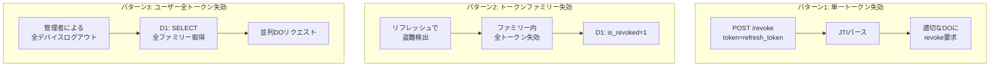
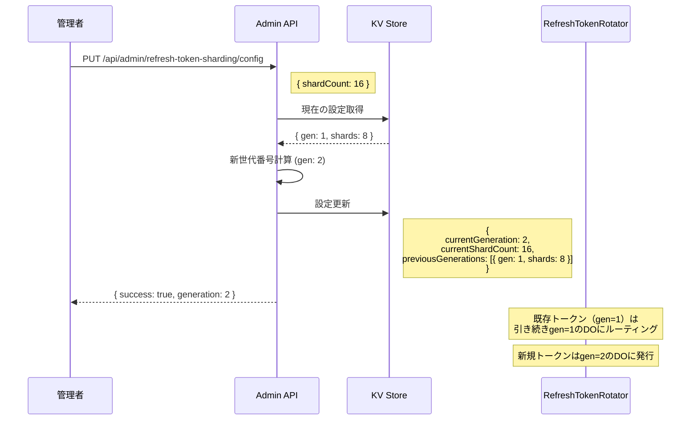

# RefreshTokenRotator シャーディング仕様 🔄

**Last Updated**: 2025-12-04
**Status**: Phase 6 Implementation
**Version**: 1.0.0

---

## Overview

RefreshTokenRotatorのシャーディング戦略を定義します。単一client_idでの高負荷問題（DO Wall Time p99: 2,349ms @ 500 RPS）を解決するため、**世代管理方式**によるシャーディングを導入します。

### 設計目標

| 目標 | 説明 |
|------|------|
| **動的シャード数変更** | デプロイ不要でシャード数を変更可能 |
| **既存トークン完全互換** | 数年有効なIoTトークンも継続動作 |
| **RFC 7009準拠** | Token Revocation仕様に完全準拠 |
| **ユーザー全失効の効率化** | 1ユーザーの全トークンを効率的に失効 |
| **高RPS対応** | 500+ RPSでもDO Wall Time < 500ms |

### アーキテクチャ図


---

## 1. JTIフォーマット仕様

### 新形式 JTI

```
v{generation}_{shardIndex}_{randomPart}
```

| フィールド | 説明 | 例 |
|-----------|------|-----|
| `v{generation}` | 世代番号（1から開始） | `v1`, `v2`, `v3` |
| `{shardIndex}` | シャードインデックス（0から開始） | `0`, `7`, `31` |
| `{randomPart}` | ランダム部分（既存形式） | `rt_uuid` |

**例**:
- `v1_7_rt_550e8400-e29b-41d4-a716-446655440000` （世代1、シャード7）
- `v2_15_rt_6ba7b810-9dad-11d1-80b4-00c04fd430c8` （世代2、シャード15）

### レガシー形式 JTI（generation=0）

```
rt_{uuid}
```

レガシートークンは`generation=0`として扱い、既存のDO（client_id直接）にルーティングします。

### パース関数

```typescript
interface ParsedJti {
  generation: number;      // 世代番号（レガシー=0）
  shardIndex: number | null; // シャードインデックス（レガシー=null）
  randomPart: string;      // ランダム部分
  isLegacy: boolean;       // レガシー形式かどうか
}

function parseRefreshTokenJti(jti: string): ParsedJti {
  // 新形式: v{gen}_{shard}_{random}
  const newFormatMatch = jti.match(/^v(\d+)_(\d+)_(.+)$/);
  if (newFormatMatch) {
    return {
      generation: parseInt(newFormatMatch[1], 10),
      shardIndex: parseInt(newFormatMatch[2], 10),
      randomPart: newFormatMatch[3],
      isLegacy: false,
    };
  }

  // レガシー形式: rt_{uuid}
  return {
    generation: 0,
    shardIndex: null,
    randomPart: jti,
    isLegacy: true,
  };
}
```

---

## 2. DO命名規則

### インスタンス名パターン

```
tenant:{tenantId}:refresh-rotator:{clientId}:v{generation}:shard-{index}
```

| パターン | 世代 | 例 |
|---------|------|-----|
| レガシー（互換） | 0 | `tenant:default:refresh-rotator:{clientId}` |
| 新形式 | 1+ | `tenant:default:refresh-rotator:{clientId}:v1:shard-7` |

### ビルド関数

```typescript
function buildRefreshTokenRotatorInstanceName(
  clientId: string,
  generation: number,
  shardIndex: number | null,
  tenantId: string = DEFAULT_TENANT_ID
): string {
  // レガシー（generation=0）
  if (generation === 0 || shardIndex === null) {
    return `tenant:${tenantId}:refresh-rotator:${clientId}`;
  }

  // 新形式
  return `tenant:${tenantId}:refresh-rotator:${clientId}:v${generation}:shard-${shardIndex}`;
}
```

---

## 3. シャード決定ロジック

### ハッシュベースシャーディング

```typescript
async function getRefreshTokenShardIndex(
  userId: string,
  clientId: string,
  shardCount: number
): Promise<number> {
  const key = `${userId}:${clientId}`;
  const encoder = new TextEncoder();
  const data = encoder.encode(key);

  // SHA-256ハッシュ
  const hashBuffer = await crypto.subtle.digest('SHA-256', data);
  const hashArray = new Uint8Array(hashBuffer);

  // 最初の4バイトを32ビット整数として使用
  const hashInt = (hashArray[0] << 24) | (hashArray[1] << 16) |
                  (hashArray[2] << 8) | hashArray[3];

  return Math.abs(hashInt) % shardCount;
}
```

### 世代管理方式のポイント

```
世代管理方式では remap は基本的に使わない：
├─ 各世代はシャード数を固定
├─ 新世代で新しいシャード数を使用
└─ 古いトークンは古い世代のDOにそのままルーティング

正常フロー:
1. トークン発行時: 現行世代のシャード数でハッシュ計算
2. トークン使用時: JTIから世代・シャード情報を抽出してそのままルーティング
3. 世代変更後: 古いトークンは古い世代のDOにルーティング（変換不要）

remapShardIndex() は以下のケースでのみ使用:
├─ 不正なシャードインデックス（shardIndex >= currentShardCount）
└─ フォールバック用（通常は発生しない）
```

---

## 4. KV設定管理

### 設定キー

```
refresh-token-shards:{clientId}
refresh-token-shards:__global__  // グローバルデフォルト
```

### 設定スキーマ

```typescript
interface RefreshTokenShardConfig {
  currentGeneration: number;          // 現行世代番号
  currentShardCount: number;          // 現行世代のシャード数
  previousGenerations: {              // 過去世代情報（最大5つ保持）
    generation: number;
    shardCount: number;
    deprecatedAt: number;             // 非推奨化タイムスタンプ
  }[];
  updatedAt: number;                  // 最終更新タイムスタンプ
  updatedBy?: string;                 // 更新者（監査用）
}
```

### KV設定例

```json
{
  "currentGeneration": 2,
  "currentShardCount": 16,
  "previousGenerations": [
    { "generation": 1, "shardCount": 8, "deprecatedAt": 1704067200000 }
  ],
  "updatedAt": 1704153600000,
  "updatedBy": "admin@example.com"
}
```

### 設定取得（キャッシュ付き）

```typescript
const CONFIG_CACHE = new Map<string, { config: RefreshTokenShardConfig; expiresAt: number }>();
const CACHE_TTL_MS = 10000; // 10秒

async function getRefreshTokenShardConfig(
  env: Env,
  clientId: string
): Promise<RefreshTokenShardConfig> {
  const cacheKey = `shard-config:${clientId}`;
  const now = Date.now();

  // キャッシュチェック
  const cached = CONFIG_CACHE.get(cacheKey);
  if (cached && cached.expiresAt > now) {
    return cached.config;
  }

  // KV取得（クライアント固有 → グローバル → デフォルト）
  let config = await env.KV.get(`refresh-token-shards:${clientId}`, 'json');
  if (!config) {
    config = await env.KV.get('refresh-token-shards:__global__', 'json');
  }
  if (!config) {
    config = {
      currentGeneration: 1,
      currentShardCount: 8,
      previousGenerations: [],
      updatedAt: now,
    };
  }

  // キャッシュ保存
  CONFIG_CACHE.set(cacheKey, { config, expiresAt: now + CACHE_TTL_MS });

  return config;
}
```

---

## 5. Token Revocationフロー

### RFC 7009準拠

Token Revocationは以下の3パターンに対応：



### パターン1: 単一トークン失効

```typescript
// POST /revoke (RFC 7009)
async function revokeRefreshToken(token: string, env: Env) {
  // 1. トークンをデコードしてJTI取得
  const payload = decodeToken(token);
  const jti = payload.jti;

  // 2. JTIをパース
  const parsed = parseRefreshTokenJti(jti);

  // 3. 適切なDOにルーティング
  const instanceName = buildRefreshTokenRotatorInstanceName(
    payload.client_id,
    parsed.generation,
    parsed.shardIndex
  );
  const rotatorId = env.REFRESH_TOKEN_ROTATOR.idFromName(instanceName);
  const rotator = env.REFRESH_TOKEN_ROTATOR.get(rotatorId);

  // 4. 失効リクエスト
  await rotator.fetch(new Request('http://internal/revoke', {
    method: 'POST',
    body: JSON.stringify({ jti }),
  }));

  // 5. D1インデックス更新
  await env.DB.prepare(
    'UPDATE user_token_families SET is_revoked = 1 WHERE jti = ?'
  ).bind(jti).run();
}
```

### パターン2: トークンファミリー失効（盗難検出時）

RefreshTokenRotator DO内で処理。詳細は`RefreshTokenRotator.ts`参照。

### パターン3: ユーザー全トークン失効

```typescript
// Admin API: DELETE /api/admin/users/:userId/refresh-tokens
async function revokeAllUserRefreshTokens(userId: string, clientId: string, env: Env) {
  // 1. D1から全ファミリー情報取得
  const families = await env.DB.prepare(`
    SELECT jti, generation
    FROM user_token_families
    WHERE user_id = ? AND client_id = ? AND is_revoked = 0
  `).bind(userId, clientId).all();

  // 2. 世代・シャードごとにグループ化
  const shardGroups = new Map<string, string[]>();
  for (const family of families.results) {
    const parsed = parseRefreshTokenJti(family.jti);
    const key = `${parsed.generation}:${parsed.shardIndex ?? 'legacy'}`;
    if (!shardGroups.has(key)) {
      shardGroups.set(key, []);
    }
    shardGroups.get(key)!.push(family.jti);
  }

  // 3. 各シャードに並列でbatch-revokeリクエスト
  const promises = Array.from(shardGroups.entries()).map(async ([key, jtis]) => {
    const [gen, shard] = key.split(':');
    const instanceName = buildRefreshTokenRotatorInstanceName(
      clientId,
      parseInt(gen),
      shard === 'legacy' ? null : parseInt(shard)
    );
    const rotatorId = env.REFRESH_TOKEN_ROTATOR.idFromName(instanceName);
    const rotator = env.REFRESH_TOKEN_ROTATOR.get(rotatorId);

    await rotator.fetch(new Request('http://internal/batch-revoke', {
      method: 'POST',
      body: JSON.stringify({ jtis }),
    }));
  });

  await Promise.all(promises);

  // 4. D1一括更新
  await env.DB.prepare(`
    UPDATE user_token_families
    SET is_revoked = 1
    WHERE user_id = ? AND client_id = ?
  `).bind(userId, clientId).run();
}
```

---

## 6. 世代変更時の動作

### 世代変更フロー



### 世代変更後のトークン動作

| トークンの世代 | 新規発行 | ローテーション | 失効 |
|--------------|---------|--------------|------|
| generation=1 | ❌ | ✅ gen=1 DOで処理 | ✅ gen=1 DOで処理 |
| generation=2 | ✅ | ✅ gen=2 DOで処理 | ✅ gen=2 DOで処理 |

### 重要な注意点

```
⚠️ 世代変更時の注意:
├─ 既存トークンは自動マイグレーションされない
├─ 各世代のDOは独立して動作を継続
├─ previousGenerationsは監査・ルーティング目的で保持
└─ 古い世代のDOストレージはCloudflareが自動GC

✅ 推奨される世代変更タイミング:
├─ 負荷増加に伴うシャード数増加
├─ トラフィックパターンの大幅な変更
└─ メンテナンスウィンドウでの計画的変更
```

---

## 7. Dead Shard Cleanup

### クリーンアップAPI

```typescript
// DELETE /api/admin/refresh-token-sharding/cleanup?generation=1&clientId=xxx

async function cleanupGeneration(generation: number, clientId: string, env: Env) {
  // 1. 安全チェック: 有効なトークンが残っていないか確認
  const result = await env.DB.prepare(`
    SELECT COUNT(*) as count FROM user_token_families
    WHERE generation = ? AND is_revoked = 0 AND expires_at > ?
  `).bind(generation, Date.now()).first();

  if (result.count > 0) {
    throw new Error(`Active tokens exist: ${result.count}`);
  }

  // 2. D1からレコード削除
  await env.DB.prepare(
    'DELETE FROM user_token_families WHERE generation = ?'
  ).bind(generation).run();

  // 3. シャード設定から過去世代を削除
  const config = await getRefreshTokenShardConfig(env, clientId);
  config.previousGenerations = config.previousGenerations
    .filter(g => g.generation !== generation);
  await env.KV.put(
    `refresh-token-shards:${clientId}`,
    JSON.stringify(config)
  );

  // ※DOストレージはCloudflareが自動GC（明示的クリーンアップ不要）
  return { success: true, deletedGeneration: generation };
}
```

---

## 8. D1スキーマ

### user_token_families テーブル

高RPS向けに最適化されたスリム版スキーマ:

```sql
-- ローテーション時のD1アクセスゼロを実現
CREATE TABLE user_token_families (
  jti TEXT PRIMARY KEY,               -- JTIそのものを主キーに
  user_id TEXT NOT NULL,
  client_id TEXT NOT NULL,
  generation INTEGER NOT NULL,
  expires_at INTEGER NOT NULL,
  is_revoked INTEGER DEFAULT 0,       -- 失効時のみUPDATE
  FOREIGN KEY (user_id) REFERENCES users(id) ON DELETE CASCADE
);

-- インデックス
CREATE INDEX idx_utf_user_id ON user_token_families(user_id);
CREATE INDEX idx_utf_client_id ON user_token_families(client_id);
CREATE INDEX idx_utf_expires ON user_token_families(expires_at);
```

### D1アクセスパターン

| 操作 | D1アクセス | 説明 |
|------|-----------|------|
| トークン発行 | INSERT | 新規ファミリー登録 |
| トークンローテーション | **なし** | DOストレージのみ使用 ✅ |
| トークン失効 | UPDATE | `is_revoked = 1` |
| ユーザー全失効 | SELECT + UPDATE | ファミリー一覧取得 + 一括失効 |

### refresh_token_shard_configs テーブル（監査用）

```sql
CREATE TABLE refresh_token_shard_configs (
  id TEXT PRIMARY KEY,
  client_id TEXT,
  generation INTEGER NOT NULL,
  shard_count INTEGER NOT NULL,
  activated_at INTEGER NOT NULL,
  deprecated_at INTEGER,
  created_by TEXT,
  notes TEXT
);
```

---

## 9. 設定値

| 設定 | デフォルト値 | 説明 |
|-----|------------|------|
| 初期世代番号 | 1 | generation=0はレガシー用 |
| **本番初期シャード数** | **8** | 一般的なユースケース向け |
| **テスト用シャード数** | **32** | 500 RPS負荷テスト用 |
| キャッシュTTL | 10秒 | シャード設定のキャッシュ期間 |
| 過去世代保持数 | 5 | previousGenerationsの最大数 |

### 環境変数

| 変数 | 説明 | デフォルト |
|-----|------|---------|
| `REFRESH_TOKEN_DEFAULT_SHARD_COUNT` | デフォルトシャード数 | 8 |
| `REFRESH_TOKEN_SHARD_CACHE_TTL` | キャッシュTTL (ms) | 10000 |

---

## 10. Admin API

### エンドポイント一覧

| メソッド | パス | 説明 |
|---------|-----|------|
| GET | `/api/admin/refresh-token-sharding/config` | 設定取得 |
| PUT | `/api/admin/refresh-token-sharding/config` | 設定変更 |
| GET | `/api/admin/refresh-token-sharding/stats` | シャード分布統計 |
| DELETE | `/api/admin/refresh-token-sharding/cleanup` | 世代クリーンアップ |

### 設定変更リクエスト例

```bash
curl -X PUT https://api.example.com/api/admin/refresh-token-sharding/config \
  -H "Authorization: Bearer $ADMIN_TOKEN" \
  -H "Content-Type: application/json" \
  -d '{
    "clientId": "b42bdc5e-7183-46ef-859c-fd21d4589cd6",
    "shardCount": 16,
    "notes": "Scaling up for 1000 RPS"
  }'
```

### レスポンス例

```json
{
  "success": true,
  "config": {
    "currentGeneration": 2,
    "currentShardCount": 16,
    "previousGenerations": [
      { "generation": 1, "shardCount": 8, "deprecatedAt": 1704153600000 }
    ],
    "updatedAt": 1704153600000
  }
}
```

---

## 11. 後方互換性

### レガシートークン対応

```typescript
// JTIがレガシー形式の場合のルーティング
function routeRefreshToken(jti: string, clientId: string, env: Env) {
  const parsed = parseRefreshTokenJti(jti);

  if (parsed.isLegacy) {
    // レガシー: 既存DO（client_id直接）にルーティング
    const instanceName = `tenant:${DEFAULT_TENANT_ID}:refresh-rotator:${clientId}`;
    return env.REFRESH_TOKEN_ROTATOR.idFromName(instanceName);
  }

  // 新形式: 世代・シャード指定でルーティング
  const instanceName = buildRefreshTokenRotatorInstanceName(
    clientId,
    parsed.generation,
    parsed.shardIndex
  );
  return env.REFRESH_TOKEN_ROTATOR.idFromName(instanceName);
}
```

### マイグレーション戦略

```
フェーズ1: 新形式導入
├─ 新規発行トークンは新形式（v1_X_rt_...）
├─ レガシートークンは引き続き動作
└─ 両形式が共存

フェーズ2: 移行期間
├─ レガシートークンの有効期限切れを待つ
├─ 最長で90日〜数年（IoT端末考慮）
└─ 監視: レガシーDOへのリクエスト数

フェーズ3: レガシー廃止（オプション）
├─ レガシーDOへのリクエストがゼロになった後
├─ レガシーコードパスの削除検討
└─ 必須ではない（互換性維持のため残しても可）
```

---

## 12. パフォーマンス期待値

### 500 RPS テスト（32シャード）

| メトリクス | 改善前 (1シャード) | 改善後 (32シャード) |
|-----------|-------------------|---------------------|
| DO Wall Time p99 | 2,349ms | < 500ms |
| リクエスト/シャード | 500 req/s | ~16 req/s |
| ロック競合 | 高 | 低 |

### 負荷分散計算

```
設定:
├─ 目標RPS: 500
├─ シャード数: 32
└─ ユーザー分布: 均等（SHA-256ハッシュ）

結果:
├─ 1シャードあたり: 500 / 32 ≈ 16 req/s
├─ DO処理時間: ~10ms/request
├─ 同時処理数: ~0.16 (ほぼ競合なし)
└─ 期待DO Wall Time p99: < 100ms
```

---

## References

### 関連ドキュメント
- [durable-objects.md](./durable-objects.md) - DOアーキテクチャ概要
- [storage-strategy.md](./storage-strategy.md) - ストレージ戦略
- [database-schema.md](./database-schema.md) - D1スキーマ

### 外部リソース
- [RFC 7009 - OAuth 2.0 Token Revocation](https://datatracker.ietf.org/doc/html/rfc7009)
- [Cloudflare Durable Objects Documentation](https://developers.cloudflare.com/durable-objects/)
- [OAuth 2.0 Security Best Current Practice](https://datatracker.ietf.org/doc/html/draft-ietf-oauth-security-topics)

---

**Change History**:
- 2025-12-04: 初版作成（世代管理方式シャーディング仕様）
