# RefreshTokenRotator Sharding Specification 🔄

**Last Updated**: 2025-12-04
**Status**: Phase 6 Implementation
**Version**: 1.0.0

---

## Overview

This document defines the sharding strategy for RefreshTokenRotator. To solve the high load problem with a single client_id (DO Wall Time p99: 2,349ms @ 500 RPS), we introduce sharding using a **generation management approach**.

### Design Goals

| Goal | Description |
|------|-------------|
| **Dynamic shard count changes** | Change shard count without deployment |
| **Full backward compatibility** | Continue operation for IoT tokens valid for years |
| **RFC 7009 compliance** | Full compliance with Token Revocation specification |
| **Efficient user-wide revocation** | Efficiently revoke all tokens for one user |
| **High RPS support** | DO Wall Time < 500ms even at 500+ RPS |

### Architecture Diagram

```mermaid
flowchart TB
    subgraph Client["Client Request"]
        REQ["POST /token<br/>grant_type=refresh_token"]
    end

    subgraph Router["op-token Worker"]
        Parse["JTI Parse<br/>v1_7_rt_xxx → gen=1, shard=7"]
        Route["DO Routing"]
    end

    subgraph Shards["RefreshTokenRotator DO Shards"]
        direction TB
        G1S0["v1:shard-0"]
        G1S1["v1:shard-1"]
        G1S7["v1:shard-7"]
        G1Sn["v1:shard-n"]
        G2S0["v2:shard-0"]
        G2Sm["v2:shard-m"]
    end

    subgraph Storage["Persistence"]
        KV["KV: Shard config<br/>refresh-token-shards:{clientId}"]
        D1["D1: user_token_families<br/>(Index for user-wide revocation)"]
    end

    REQ --> Parse
    Parse --> Route
    Route --> G1S7
    G1S7 --> D1
    Route -.->|Get config| KV
```



---

## 1. JTI Format Specification

### New Format JTI

```
v{generation}_{shardIndex}_{randomPart}
```

| Field | Description | Example |
|-------|-------------|---------|
| `v{generation}` | Generation number (starts from 1) | `v1`, `v2`, `v3` |
| `{shardIndex}` | Shard index (starts from 0) | `0`, `7`, `31` |
| `{randomPart}` | Random part (existing format) | `rt_uuid` |

**Examples**:
- `v1_7_rt_550e8400-e29b-41d4-a716-446655440000` (generation 1, shard 7)
- `v2_15_rt_6ba7b810-9dad-11d1-80b4-00c04fd430c8` (generation 2, shard 15)

### Legacy Format JTI (generation=0)

```
rt_{uuid}
```

Legacy tokens are treated as `generation=0` and routed to the existing DO (using client_id directly).

### Parse Function

```typescript
interface ParsedJti {
  generation: number;      // Generation number (legacy=0)
  shardIndex: number | null; // Shard index (legacy=null)
  randomPart: string;      // Random part
  isLegacy: boolean;       // Whether it's legacy format
}

function parseRefreshTokenJti(jti: string): ParsedJti {
  // New format: v{gen}_{shard}_{random}
  const newFormatMatch = jti.match(/^v(\d+)_(\d+)_(.+)$/);
  if (newFormatMatch) {
    return {
      generation: parseInt(newFormatMatch[1], 10),
      shardIndex: parseInt(newFormatMatch[2], 10),
      randomPart: newFormatMatch[3],
      isLegacy: false,
    };
  }

  // Legacy format: rt_{uuid}
  return {
    generation: 0,
    shardIndex: null,
    randomPart: jti,
    isLegacy: true,
  };
}
```

---

## 2. DO Naming Convention

### Instance Name Pattern

```
tenant:{tenantId}:refresh-rotator:{clientId}:v{generation}:shard-{index}
```

| Pattern | Generation | Example |
|---------|------|-----|
| Legacy (compatible) | 0 | `tenant:default:refresh-rotator:{clientId}` |
| New format | 1+ | `tenant:default:refresh-rotator:{clientId}:v1:shard-7` |

### Build Function

```typescript
function buildRefreshTokenRotatorInstanceName(
  clientId: string,
  generation: number,
  shardIndex: number | null,
  tenantId: string = DEFAULT_TENANT_ID
): string {
  // Legacy (generation=0)
  if (generation === 0 || shardIndex === null) {
    return `tenant:${tenantId}:refresh-rotator:${clientId}`;
  }

  // New format
  return `tenant:${tenantId}:refresh-rotator:${clientId}:v${generation}:shard-${shardIndex}`;
}
```

---

## 3. Shard Determination Logic

### Hash-Based Sharding

```typescript
async function getRefreshTokenShardIndex(
  userId: string,
  clientId: string,
  shardCount: number
): Promise<number> {
  const key = `${userId}:${clientId}`;
  const encoder = new TextEncoder();
  const data = encoder.encode(key);

  // SHA-256 hash
  const hashBuffer = await crypto.subtle.digest('SHA-256', data);
  const hashArray = new Uint8Array(hashBuffer);

  // Use first 4 bytes as 32-bit integer
  const hashInt = (hashArray[0] << 24) | (hashArray[1] << 16) |
                  (hashArray[2] << 8) | hashArray[3];

  return Math.abs(hashInt) % shardCount;
}
```

### Key Points of Generation Management Approach

```
Generation management approach does not use remap by default:
├─ Each generation has a fixed shard count
├─ New generation uses a new shard count
└─ Old tokens are routed directly to their generation's DO

Normal flow:
1. Token issuance: Calculate hash with current generation's shard count
2. Token usage: Extract generation and shard info from JTI and route directly
3. After generation change: Old tokens route to old generation's DO (no conversion needed)

remapShardIndex() is only used in these cases:
├─ Invalid shard index (shardIndex >= currentShardCount)
└─ Fallback (normally doesn't occur)
```

---

## 4. KV Configuration Management

### Configuration Keys

```
refresh-token-shards:{clientId}
refresh-token-shards:__global__  // Global default
```

### Configuration Schema

```typescript
interface RefreshTokenShardConfig {
  currentGeneration: number;          // Current generation number
  currentShardCount: number;          // Current generation's shard count
  previousGenerations: {              // Previous generation info (max 5 retained)
    generation: number;
    shardCount: number;
    deprecatedAt: number;             // Deprecation timestamp
  }[];
  updatedAt: number;                  // Last update timestamp
  updatedBy?: string;                 // Updater (for audit)
}
```

### KV Configuration Example

```json
{
  "currentGeneration": 2,
  "currentShardCount": 16,
  "previousGenerations": [
    { "generation": 1, "shardCount": 8, "deprecatedAt": 1704067200000 }
  ],
  "updatedAt": 1704153600000,
  "updatedBy": "admin@example.com"
}
```

### Configuration Retrieval (with Cache)

```typescript
const CONFIG_CACHE = new Map<string, { config: RefreshTokenShardConfig; expiresAt: number }>();
const CACHE_TTL_MS = 10000; // 10 seconds

async function getRefreshTokenShardConfig(
  env: Env,
  clientId: string
): Promise<RefreshTokenShardConfig> {
  const cacheKey = `shard-config:${clientId}`;
  const now = Date.now();

  // Check cache
  const cached = CONFIG_CACHE.get(cacheKey);
  if (cached && cached.expiresAt > now) {
    return cached.config;
  }

  // Get from KV (client-specific → global → default)
  let config = await env.KV.get(`refresh-token-shards:${clientId}`, 'json');
  if (!config) {
    config = await env.KV.get('refresh-token-shards:__global__', 'json');
  }
  if (!config) {
    config = {
      currentGeneration: 1,
      currentShardCount: 8,
      previousGenerations: [],
      updatedAt: now,
    };
  }

  // Save to cache
  CONFIG_CACHE.set(cacheKey, { config, expiresAt: now + CACHE_TTL_MS });

  return config;
}
```

---

## 5. Token Revocation Flow

### RFC 7009 Compliance

Token Revocation supports the following 3 patterns:


### Pattern 1: Single Token Revocation

```typescript
// POST /revoke (RFC 7009)
async function revokeRefreshToken(token: string, env: Env) {
  // 1. Decode token and get JTI
  const payload = decodeToken(token);
  const jti = payload.jti;

  // 2. Parse JTI
  const parsed = parseRefreshTokenJti(jti);

  // 3. Route to appropriate DO
  const instanceName = buildRefreshTokenRotatorInstanceName(
    payload.client_id,
    parsed.generation,
    parsed.shardIndex
  );
  const rotatorId = env.REFRESH_TOKEN_ROTATOR.idFromName(instanceName);
  const rotator = env.REFRESH_TOKEN_ROTATOR.get(rotatorId);

  // 4. Revocation request
  await rotator.fetch(new Request('http://internal/revoke', {
    method: 'POST',
    body: JSON.stringify({ jti }),
  }));

  // 5. Update D1 index
  await env.DB.prepare(
    'UPDATE user_token_families SET is_revoked = 1 WHERE jti = ?'
  ).bind(jti).run();
}
```

### Pattern 2: Token Family Revocation (Theft Detection)

Handled within RefreshTokenRotator DO. See `RefreshTokenRotator.ts` for details.

### Pattern 3: User-wide Token Revocation

```typescript
// Admin API: DELETE /api/admin/users/:userId/refresh-tokens
async function revokeAllUserRefreshTokens(userId: string, clientId: string, env: Env) {
  // 1. Get all family info from D1
  const families = await env.DB.prepare(`
    SELECT jti, generation
    FROM user_token_families
    WHERE user_id = ? AND client_id = ? AND is_revoked = 0
  `).bind(userId, clientId).all();

  // 2. Group by generation and shard
  const shardGroups = new Map<string, string[]>();
  for (const family of families.results) {
    const parsed = parseRefreshTokenJti(family.jti);
    const key = `${parsed.generation}:${parsed.shardIndex ?? 'legacy'}`;
    if (!shardGroups.has(key)) {
      shardGroups.set(key, []);
    }
    shardGroups.get(key)!.push(family.jti);
  }

  // 3. Send batch-revoke requests to each shard in parallel
  const promises = Array.from(shardGroups.entries()).map(async ([key, jtis]) => {
    const [gen, shard] = key.split(':');
    const instanceName = buildRefreshTokenRotatorInstanceName(
      clientId,
      parseInt(gen),
      shard === 'legacy' ? null : parseInt(shard)
    );
    const rotatorId = env.REFRESH_TOKEN_ROTATOR.idFromName(instanceName);
    const rotator = env.REFRESH_TOKEN_ROTATOR.get(rotatorId);

    await rotator.fetch(new Request('http://internal/batch-revoke', {
      method: 'POST',
      body: JSON.stringify({ jtis }),
    }));
  });

  await Promise.all(promises);

  // 4. Batch update D1
  await env.DB.prepare(`
    UPDATE user_token_families
    SET is_revoked = 1
    WHERE user_id = ? AND client_id = ?
  `).bind(userId, clientId).run();
}
```

---

## 6. Generation Change Behavior

### Generation Change Flow


### Token Behavior After Generation Change

| Token Generation | New Issuance | Rotation | Revocation |
|--------------|---------|--------------|------|
| generation=1 | ❌ | ✅ Processed by gen=1 DO | ✅ Processed by gen=1 DO |
| generation=2 | ✅ | ✅ Processed by gen=2 DO | ✅ Processed by gen=2 DO |

### Important Notes

```
⚠️ Generation change considerations:
├─ Existing tokens are not automatically migrated
├─ Each generation's DO continues to operate independently
├─ previousGenerations retained for audit and routing purposes
└─ Old generation DO storage is automatically GC'd by Cloudflare

✅ Recommended generation change timing:
├─ Increasing shard count due to load growth
├─ Significant changes in traffic patterns
└─ Planned changes during maintenance windows
```

---

## 7. Dead Shard Cleanup

### Cleanup API

```typescript
// DELETE /api/admin/refresh-token-sharding/cleanup?generation=1&clientId=xxx

async function cleanupGeneration(generation: number, clientId: string, env: Env) {
  // 1. Safety check: Verify no active tokens remain
  const result = await env.DB.prepare(`
    SELECT COUNT(*) as count FROM user_token_families
    WHERE generation = ? AND is_revoked = 0 AND expires_at > ?
  `).bind(generation, Date.now()).first();

  if (result.count > 0) {
    throw new Error(`Active tokens exist: ${result.count}`);
  }

  // 2. Delete records from D1
  await env.DB.prepare(
    'DELETE FROM user_token_families WHERE generation = ?'
  ).bind(generation).run();

  // 3. Remove previous generation from shard config
  const config = await getRefreshTokenShardConfig(env, clientId);
  config.previousGenerations = config.previousGenerations
    .filter(g => g.generation !== generation);
  await env.KV.put(
    `refresh-token-shards:${clientId}`,
    JSON.stringify(config)
  );

  // Note: DO storage is automatically GC'd by Cloudflare (no explicit cleanup needed)
  return { success: true, deletedGeneration: generation };
}
```

---

## 8. D1 Schema

### user_token_families Table

Optimized slim schema for high RPS:

```sql
-- Achieve zero D1 access during rotation
CREATE TABLE user_token_families (
  jti TEXT PRIMARY KEY,               -- JTI itself as primary key
  user_id TEXT NOT NULL,
  client_id TEXT NOT NULL,
  generation INTEGER NOT NULL,
  expires_at INTEGER NOT NULL,
  is_revoked INTEGER DEFAULT 0,       -- UPDATE only on revocation
  FOREIGN KEY (user_id) REFERENCES users(id) ON DELETE CASCADE
);

-- Indexes
CREATE INDEX idx_utf_user_id ON user_token_families(user_id);
CREATE INDEX idx_utf_client_id ON user_token_families(client_id);
CREATE INDEX idx_utf_expires ON user_token_families(expires_at);
```

### D1 Access Patterns

| Operation | D1 Access | Description |
|------|-----------|------|
| Token issuance | INSERT | Register new family |
| Token rotation | **None** | Use DO storage only ✅ |
| Token revocation | UPDATE | `is_revoked = 1` |
| User-wide revocation | SELECT + UPDATE | Get family list + batch revoke |

### refresh_token_shard_configs Table (for audit)

```sql
CREATE TABLE refresh_token_shard_configs (
  id TEXT PRIMARY KEY,
  client_id TEXT,
  generation INTEGER NOT NULL,
  shard_count INTEGER NOT NULL,
  activated_at INTEGER NOT NULL,
  deprecated_at INTEGER,
  created_by TEXT,
  notes TEXT
);
```

---

## 9. Configuration Values

| Configuration | Default Value | Description |
|-----|------------|------|
| Initial generation number | 1 | generation=0 is for legacy |
| **Production initial shard count** | **8** | For typical use cases |
| **Test shard count** | **32** | For 500 RPS load testing |
| Cache TTL | 10 seconds | Shard config cache duration |
| Previous generation retention | 5 | Max number of previousGenerations |

### Environment Variables

| Variable | Description | Default |
|-----|------|---------|
| `REFRESH_TOKEN_DEFAULT_SHARD_COUNT` | Default shard count | 8 |
| `REFRESH_TOKEN_SHARD_CACHE_TTL` | Cache TTL (ms) | 10000 |

---

## 10. Admin API

### Endpoint List

| Method | Path | Description |
|---------|-----|------|
| GET | `/api/admin/refresh-token-sharding/config` | Get configuration |
| PUT | `/api/admin/refresh-token-sharding/config` | Change configuration |
| GET | `/api/admin/refresh-token-sharding/stats` | Shard distribution statistics |
| DELETE | `/api/admin/refresh-token-sharding/cleanup` | Generation cleanup |

### Configuration Change Request Example

```bash
curl -X PUT https://api.example.com/api/admin/refresh-token-sharding/config \
  -H "Authorization: Bearer $ADMIN_TOKEN" \
  -H "Content-Type: application/json" \
  -d '{
    "clientId": "b42bdc5e-7183-46ef-859c-fd21d4589cd6",
    "shardCount": 16,
    "notes": "Scaling up for 1000 RPS"
  }'
```

### Response Example

```json
{
  "success": true,
  "config": {
    "currentGeneration": 2,
    "currentShardCount": 16,
    "previousGenerations": [
      { "generation": 1, "shardCount": 8, "deprecatedAt": 1704153600000 }
    ],
    "updatedAt": 1704153600000
  }
}
```

---

## 11. Backward Compatibility

### Legacy Token Support

```typescript
// Routing when JTI is in legacy format
function routeRefreshToken(jti: string, clientId: string, env: Env) {
  const parsed = parseRefreshTokenJti(jti);

  if (parsed.isLegacy) {
    // Legacy: Route to existing DO (using client_id directly)
    const instanceName = `tenant:${DEFAULT_TENANT_ID}:refresh-rotator:${clientId}`;
    return env.REFRESH_TOKEN_ROTATOR.idFromName(instanceName);
  }

  // New format: Route with generation and shard specification
  const instanceName = buildRefreshTokenRotatorInstanceName(
    clientId,
    parsed.generation,
    parsed.shardIndex
  );
  return env.REFRESH_TOKEN_ROTATOR.idFromName(instanceName);
}
```

### Migration Strategy

```
Phase 1: New format introduction
├─ Newly issued tokens use new format (v1_X_rt_...)
├─ Legacy tokens continue to work
└─ Both formats coexist

Phase 2: Migration period
├─ Wait for legacy tokens to expire
├─ Up to 90 days ~ several years (considering IoT devices)
└─ Monitor: Request count to legacy DO

Phase 3: Legacy deprecation (optional)
├─ After requests to legacy DO reach zero
├─ Consider removing legacy code paths
└─ Not mandatory (can keep for compatibility)
```

---

## 12. Performance Expectations

### 500 RPS Test (32 shards)

| Metric | Before (1 shard) | After (32 shards) |
|-----------|-------------------|---------------------|
| DO Wall Time p99 | 2,349ms | < 500ms |
| Requests/shard | 500 req/s | ~16 req/s |
| Lock contention | High | Low |

### Load Distribution Calculation

```
Configuration:
├─ Target RPS: 500
├─ Shard count: 32
└─ User distribution: Even (SHA-256 hash)

Result:
├─ Per shard: 500 / 32 ≈ 16 req/s
├─ DO processing time: ~10ms/request
├─ Concurrent processing: ~0.16 (almost no contention)
└─ Expected DO Wall Time p99: < 100ms
```

---

## References

### Related Documentation
- [durable-objects.md](./durable-objects.md) - DO Architecture Overview
- [storage-strategy.md](./storage-strategy.md) - Storage Strategy
- [database-schema.md](./database-schema.md) - D1 Schema

### External Resources
- [RFC 7009 - OAuth 2.0 Token Revocation](https://datatracker.ietf.org/doc/html/rfc7009)
- [Cloudflare Durable Objects Documentation](https://developers.cloudflare.com/durable-objects/)
- [OAuth 2.0 Security Best Current Practice](https://datatracker.ietf.org/doc/html/draft-ietf-oauth-security-topics)

---

**Change History**:
- 2025-12-04: Initial version created (generation management sharding specification)
