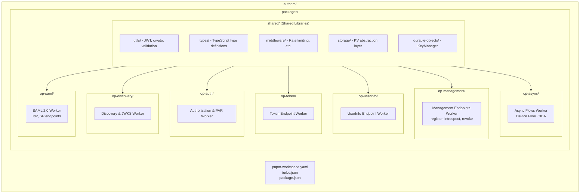
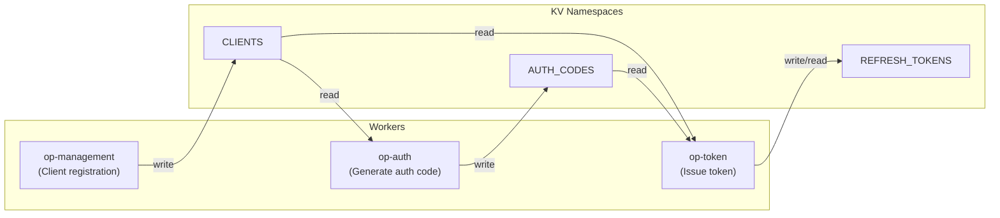

# Authrim Worker Partitioning Architecture

This document describes Authrim's new Worker partitioning architecture.

## 📦 Monorepo Structure



## 🎯 Purpose of Worker Partitioning

### File Size Optimization
Each Worker bundles independently → Eliminates unnecessary dependencies
- **Before**: Single Worker 229KB, 7,061 lines
- **After**: 5 independent Workers (each ~100-200KB)

### Memory Usage Reduction
- Only necessary code is loaded per request
- Reduces pressure on 128MB memory limit

### Deployment Flexibility
- Deploy and rollback per endpoint
- Localize impact scope

### Scalability
- Scale independently per endpoint
- Scale high-load endpoints (/token) independently

## 📊 Worker List

| Worker | Endpoints | Responsibilities | Estimated Size |
|--------|----------|------------------|----------------|
| **op-discovery** | `/.well-known/openid-configuration`<br>`/.well-known/jwks.json` | Publish configuration<br>Publish public keys<br>(CDN cache recommended) | ~50-70KB |
| **op-auth** | `GET/POST /authorize`<br>`POST /as/par` | Handle authorization requests<br>PKCE verification<br>Consent UI (Phase 5) | ~150-200KB |
| **op-token** | `POST /token` | Issue tokens<br>Code exchange<br>refresh_token<br>Client authentication | ~250-300KB |
| **op-userinfo** | `GET/POST /userinfo` | Return user claims<br>Access token verification | ~80-100KB |
| **op-management** | `POST /register`<br>`POST /introspect`<br>`POST /revoke` | Client management<br>Token verification<br>Token revocation | ~180-220KB |
| **op-async** | `POST /device_authorization`<br>`GET /device`<br>`POST /bc-authorize` | Device Flow (RFC 8628)<br>CIBA Flow | ~150-200KB |
| **op-saml** | `/saml/idp/*`<br>`/saml/sp/*` | SAML 2.0 IdP/SP<br>SSO, SLO, Metadata | ~200-250KB |

## 🔧 Build & Development

### Setup

```bash
# Install dependencies
pnpm install

# Build all Workers
pnpm run build

# Build specific Worker
cd packages/op-discovery
pnpm run build
```

### Development Server

```bash
# Start all Workers in parallel
pnpm run dev

# Start specific Worker
cd packages/op-auth
pnpm run dev
```

### Deployment

```bash
# Deploy all Workers
pnpm run deploy

# Deploy specific Worker
cd packages/op-token
pnpm run deploy
```

## 🔗 Worker Communication

### Current Implementation: Data Sharing via KV Namespace

Each Worker operates **independently** and shares data indirectly through KV Namespaces:



**Benefits of this approach:**
- ✅ Each Worker can be deployed and rolled back completely independently
- ✅ Few dependencies, simple architecture
- ✅ Sufficient performance and functionality at this time

### Reasons for Not Currently Using Service Bindings

**This is a design decision, not a technical constraint:**

1. **YAGNI Principle (You Aren't Gonna Need It)**
   KV Namespaces are sufficient for current requirements

2. **TypeScript Type Strictness**
   Unused features should not be included in type definitions (see `packages/shared/src/types/env.ts`)

3. **Incremental Implementation Approach**
   Add when needed

**Note: Service Bindings definitions already exist in `wrangler.toml` (prepared):**

```typescript
// Example from wrangler.toml (already defined)
[[services]]
binding = "OP_TOKEN"
service = "authrim-op-token"

// Usage in code (planned for future implementation)
const response = await env.OP_TOKEN.fetch(request);
```

### Future Use Cases

Scenarios where Service Bindings would be useful:

1. **Real-time Token Revocation**
   When op-management revokes a token, notify op-userinfo immediately

2. **Full Utilization of KeyManager (Durable Object)**
   Unified use of key rotation functionality across multiple Workers

3. **Client Information Caching**
   When updating clients in op-management, invalidate caches in other Workers

## 📝 Configuration

In each Worker's `wrangler.toml`, configure the following:

1. **Environment Variables** (`[vars]` section)
   - `ISSUER_URL`
   - `TOKEN_EXPIRY`, `CODE_EXPIRY`, etc.

2. **KV Namespaces** (`[[kv_namespaces]]`)
   - Each Worker binds only the KV it needs

3. **Durable Objects** (`[[durable_objects.bindings]]`)
   - Reference to KeyManager

4. **Routes** (production environment)
   - Routing configuration per domain

## 🚀 Deployment Strategy

### Gradual Deployment
1. **op-discovery** → Simplest, smallest impact scope
2. **op-userinfo** → Few dependencies
3. **op-auth, op-token** → Core functionality
4. **op-management** → Management functions

### Rollback
Independent rollback per Worker is possible.

### Monitoring
Monitor metrics for each Worker individually:
- Request count
- Error rate
- Response time
- Memory usage

## ⚠️ Notes

### Setting KV Namespace IDs
Update the `id` and `preview_id` in each `wrangler.toml` with actual values:

```toml
[[kv_namespaces]]
binding = "AUTH_CODES"
id = "your_actual_namespace_id"
preview_id = "your_preview_namespace_id"
```

### Sharing Durable Objects
KeyManager is placed in `op-discovery` and referenced by other Workers:

```toml
[[durable_objects.bindings]]
name = "KEY_MANAGER"
class_name = "KeyManager"
script_name = "authrim-op-discovery"
```

### Changes to Shared Packages
When `packages/shared` changes, all Workers need to be rebuilt:

```bash
pnpm run build
```

## 📚 References

- [Turborepo Documentation](https://turbo.build/repo/docs)
- [Cloudflare Workers Documentation](https://developers.cloudflare.com/workers/)
- [pnpm Workspaces](https://pnpm.io/workspaces)
