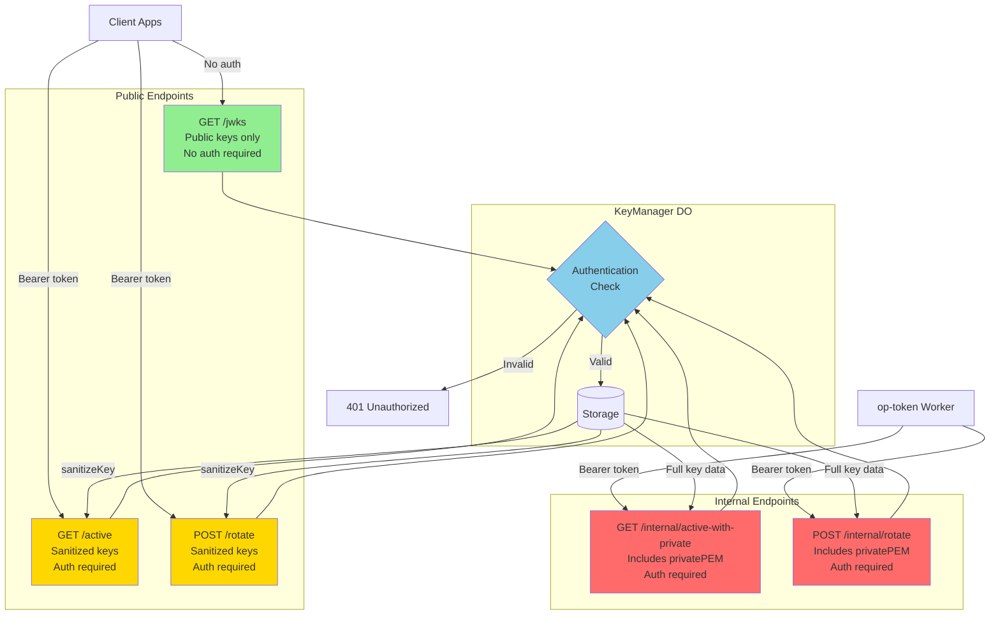

# Recent Fixes Summary (2025-11-20)

## 1. Added HTTPS request_uri Support

### Problem
- Test `oidcc-request-uri-unsigned-supported-correctly-or-rejected-as-unsupported` failed
- Error: `{"error":"invalid_request","error_description":"Invalid request_uri format"}`
- Cause: Only URN format (PAR) request_uri was supported, HTTPS URL JWT retrieval was not supported

### Fix Details
**File:** `packages/op-auth/src/authorize.ts` (Lines 111-267)

```typescript
// Check if this is a PAR request_uri (URN) or HTTPS request_uri
const isPAR = request_uri.startsWith('urn:ietf:params:oauth:request_uri:');
const isHTTPS = request_uri.startsWith('https://');

if (!isPAR && !isHTTPS) {
  return c.json({
    error: 'invalid_request',
    error_description: 'request_uri must be either urn:ietf:params:oauth:request_uri: or https://',
  }, 400);
}

// Handle HTTPS request_uri (Request Object by Reference)
if (isHTTPS) {
  const requestObjectResponse = await fetch(request_uri, {
    method: 'GET',
    headers: { 'Accept': 'application/oauth-authz-req+jwt, application/jwt' },
  });

  if (!requestObjectResponse.ok) {
    return c.json({
      error: 'invalid_request_uri',
      error_description: 'Failed to fetch request object from request_uri',
    }, 400);
  }

  const requestObject = await requestObjectResponse.text();
  request = requestObject;
  request_uri = undefined; // Clear to avoid PAR processing
}
```

### Result
- Supports HTTPS format request_uri (OIDC Core 6.2 Request Object by Reference)
- URN format request_uri (PAR - RFC 9126) continues to work
- Supports both formats

---

## 2. Added Authentication to KeyManager Internal Endpoints

### Problem
- Token endpoint returned 500 error: `"Failed to load signing key"`
- More detailed error: `TypeError: "pkcs8" must be PKCS#8 formatted string`
- Cause: Existing KeyManager endpoints (`/active`, `/rotate`) were removing `privatePEM` with `sanitizeKey()`

### Security Concerns
- User concern: "Wasn't there a reason it was being removed? Is this safe?"
- Endpoints containing private keys should not be exposed publicly

### Fix Details

#### 2.1 Added New Internal Endpoints
**File:** `packages/shared/src/durable-objects/KeyManager.ts`

**New Endpoints:**
- `GET /internal/active-with-private` - Get active key (includes privatePEM)
- `POST /internal/rotate` - Key rotation (includes privatePEM)

**Implementation (Lines 420-443):**
```typescript
// GET /internal/active-with-private - Get active signing key with private key (for internal use by op-token)
if (path === '/internal/active-with-private' && request.method === 'GET') {
  const activeKey = await this.getActiveKey();

  if (!activeKey) {
    return new Response(JSON.stringify({ error: 'No active key found' }), {
      status: 404,
      headers: { 'Content-Type': 'application/json' },
    });
  }

  // Explicitly reconstruct the object to ensure all properties are serializable
  const result: StoredKey = {
    kid: activeKey.kid,
    publicJWK: activeKey.publicJWK,
    privatePEM: activeKey.privatePEM,
    createdAt: activeKey.createdAt,
    isActive: activeKey.isActive,
  };

  // Return full key data including privatePEM for internal use
  return new Response(JSON.stringify(result), {
    headers: { 'Content-Type': 'application/json' },
  });
}
```

#### 2.2 Authentication Implementation
**Existing Authentication Method (Lines 336-354):**
```typescript
private authenticate(request: Request): boolean {
  const authHeader = request.headers.get('Authorization');

  if (!authHeader || !authHeader.startsWith('Bearer ')) {
    return false;
  }

  const token = authHeader.substring(7);
  const secret = this.env.KEY_MANAGER_SECRET;

  // If no secret is configured, deny all requests
  if (!secret) {
    console.error('KEY_MANAGER_SECRET is not configured');
    return false;
  }

  // Constant-time comparison to prevent timing attacks
  return token === secret;
}
```

**Authentication Check (Lines 391-398):**
```typescript
// Public endpoints (no authentication required)
// /jwks is public because it only returns public keys for JWT verification
const isPublicEndpoint = path === '/jwks' && request.method === 'GET';

// All other endpoints require authentication (including /internal/* for security)
if (!isPublicEndpoint && !this.authenticate(request)) {
  return this.unauthorizedResponse();
}
```

#### 2.3 op-token Modifications
**File:** `packages/op-token/src/token.ts` (Lines 57-120)

**Changes:**
1. Added authentication header
2. Using internal endpoints
3. Changed Durable Object instance name to `default-v3` (to reflect deployment)

```typescript
async function getSigningKeyFromKeyManager(
  env: Env
): Promise<{ privateKey: CryptoKey; kid: string }> {
  if (!env.KEY_MANAGER) {
    throw new Error('KEY_MANAGER binding not available');
  }

  if (!env.KEY_MANAGER_SECRET) {
    throw new Error('KEY_MANAGER_SECRET not configured');
  }

  const keyManagerId = env.KEY_MANAGER.idFromName('default-v3');
  const keyManager = env.KEY_MANAGER.get(keyManagerId);

  // Authentication header for KeyManager
  const authHeaders = {
    'Authorization': `Bearer ${env.KEY_MANAGER_SECRET}`,
  };

  // Try to get active key (using internal endpoint that returns privatePEM)
  const activeResponse = await keyManager.fetch('http://internal/active-with-private', {
    method: 'GET',
    headers: authHeaders,
  });

  let keyData: { kid: string; privatePEM: string };

  if (activeResponse.ok) {
    keyData = await activeResponse.json() as { kid: string; privatePEM: string };
  } else {
    // No active key, generate and activate one
    const rotateResponse = await keyManager.fetch('http://internal/rotate', {
      method: 'POST',
      headers: authHeaders,
    });

    if (!rotateResponse.ok) {
      const errorText = await rotateResponse.text();
      console.error('Failed to rotate key:', rotateResponse.status, errorText);
      throw new Error('Failed to generate signing key');
    }

    const rotateData = await rotateResponse.json() as { success: boolean; key: { kid: string; privatePEM: string } };
    keyData = rotateData.key;
  }

  // Import private key
  const privateKey = await importPKCS8(keyData.privatePEM, 'RS256');

  return { privateKey, kid: keyData.kid };
}
```

#### 2.4 Environment Variable Addition
**File:** `packages/op-token/wrangler.toml` (Line 66)

```toml
KEY_MANAGER_SECRET = "dev-secret-change-in-production"
```

---

## 3. Fixed JSON Serialization Issue

### Problem
- Objects retrieved from Durable Object storage were not serializing correctly with `JSON.stringify()`
- `privatePEM` property existed but was not included in JSON

### Fix Details
**File:** `packages/shared/src/durable-objects/KeyManager.ts`

**Explicit reconstruction in rotateKeys() method (Lines 241-248):**
```typescript
// Explicitly reconstruct the object to ensure all properties are enumerable and serializable
const result: StoredKey = {
  kid: rotatedKey.kid,
  publicJWK: rotatedKey.publicJWK,
  privatePEM: rotatedKey.privatePEM,
  createdAt: rotatedKey.createdAt,
  isActive: rotatedKey.isActive,
};
```

**Similar reconstruction in internal endpoints:**
- `/internal/active-with-private` (Lines 432-438)
- `/internal/rotate` (Lines 468-492)

---

## 4. Deployment

### Deployment Completed
**Latest Version (2025-11-20T04:10):**
- `authrim-shared`: `94e5306d-9db0-4b5c-a4cc-2176e0facb1c`
- `authrim-op-token`: `4f29c961-4d1a-406e-956a-116c9d02efb6`
- `authrim-op-auth`: `f36a992c-f7bf-439a-b1dc-ca8ba98af2e4`

### Deployment Issues and Solutions
- Cloudflare deployment is eventually consistent
- Durable Object instances continued running old code
- Solution: Changed instance name from `default` → `default-v2` → `default-v3` to force refresh

---

## 5. Security Improvements Summary

### Architecture Overview



### Before (Problem)
- `/active` and `/rotate` were public endpoints but required authentication
- These endpoints removed `privatePEM` with `sanitizeKey()`
- op-token requiring private key would error

### After (Improved)
1. **Public Endpoints** (authentication required, no private key):
   - `GET /active` - Removes privatePEM with `sanitizeKey()`
   - `POST /rotate` - Removes privatePEM with `sanitizeKey()`
   - `GET /jwks` - Public keys only (no authentication required)

2. **Internal Endpoints** (authentication required, includes private key):
   - `GET /internal/active-with-private` - Includes privatePEM (**New**)
   - `POST /internal/rotate` - Includes privatePEM (**New**)

3. **Authentication Method**:
   - Bearer token (`Authorization: Bearer ${KEY_MANAGER_SECRET}`)
   - Constant-time comparison to prevent timing attacks
   - Denies all requests if secret is not configured

---

## 6. Next Steps

### Test Items
1. **Token Endpoint Testing**
   - Run in OIDC conformance test suite
   - Expected result: 200 OK instead of 500 error
   - Log verification: `Received rotate response: { textLength: 2327, hasPrivatePEM: true }`

2. **request_uri Testing**
   - Test: `oidcc-request-uri-unsigned-supported-correctly-or-rejected-as-unsupported`
   - Verify HTTPS request_uri is processed correctly

3. **PAR Compatibility Verification**
   - Verify URN format request_uri continues to work

### Monitoring Points
```bash
# Monitor KeyManager logs
npx wrangler tail

# Expected logs:
# KeyManager /internal/rotate - response JSON: { jsonLength: 2327, hasPrivatePEM: true }
# Received rotate response: { textLength: 2327, hasPrivatePEM: true }
```

---

## 7. Changed Files List

1. `packages/op-auth/src/authorize.ts` - Added HTTPS request_uri support
2. `packages/shared/src/durable-objects/KeyManager.ts` - Added internal endpoints, enhanced authentication
3. `packages/op-token/src/token.ts` - Added authentication header, using internal endpoints
4. `packages/op-token/wrangler.toml` - Added KEY_MANAGER_SECRET

All changes have been built and deployed.
