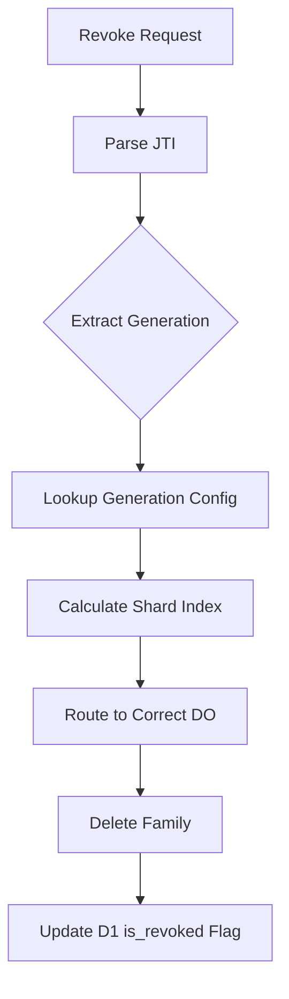
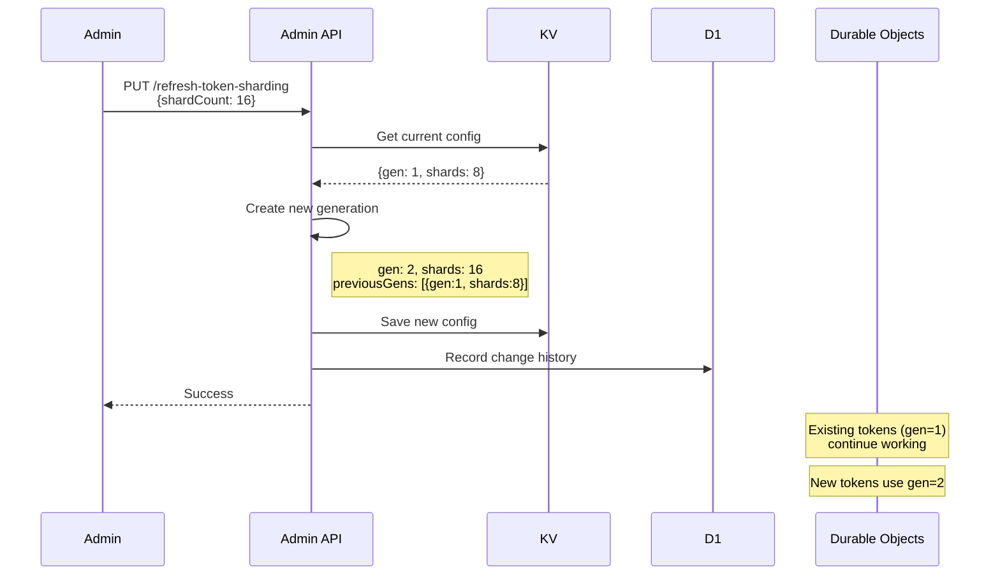
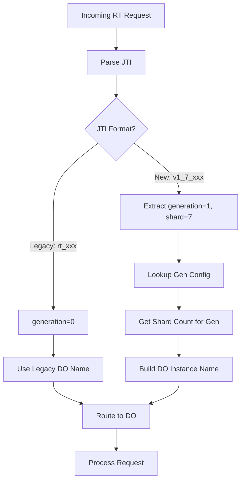
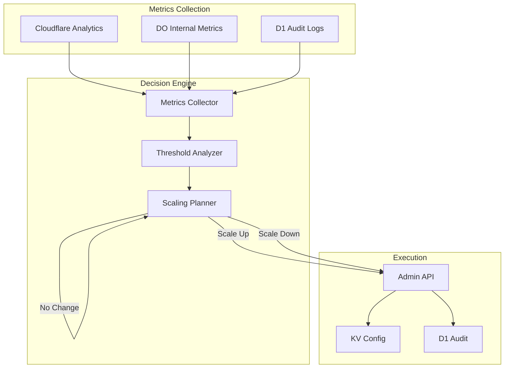

# Dynamic Sharding Analysis

This document analyzes Authrim's current implementation to evaluate the feasibility of dynamic shard adjustment using generation-based parameter tuning.

## Table of Contents

1. [Executive Summary](#executive-summary)
2. [Current Implementation Analysis](#current-implementation-analysis)
3. [Generation Management System](#generation-management-system)
4. [Dynamic Shard Adjustment Feasibility](#dynamic-shard-adjustment-feasibility)
5. [Auto-Scaling Extension (Future)](#auto-scaling-extension-future)
6. [Limitations and Considerations](#limitations-and-considerations)
7. [Appendix: Key Files Reference](#appendix-key-files-reference)

---

## Executive Summary

### Question
Can Authrim dynamically adjust shard counts without service disruption?

### Answer: ✅ **Yes, technically feasible**

Authrim's current implementation fully supports dynamic shard adjustment through:

| Feature | Status | Impact |
|---------|--------|--------|
| Generation Management | ✅ Implemented | Non-destructive shard changes |
| Short-lived Auth Codes | ✅ Implemented | Natural migration (60s TTL) |
| Family-level Revoke | ✅ Implemented | Cross-generation token management |
| JTI-embedded Generation | ✅ Implemented | Accurate routing to legacy shards |

**Current Capability:**
```bash
# Change shard count without deployment
PUT /api/admin/settings/refresh-token-sharding
{"shardCount": 16, "notes": "Scale up for peak load"}
```

---

## Current Implementation Analysis

### 1. Generation Management: ✅ Fully Implemented

The refresh token system uses a generation-based approach where each shard configuration change creates a new generation.

#### JTI Format

```
Legacy:  rt_{uuid}                           → generation=0
Current: v{generation}_{shardIndex}_{random} → generation=N
Example: v2_7_rt_abc123-def456
```

#### Generation Configuration (KV + D1)

```typescript
interface RefreshTokenShardConfig {
  currentGeneration: number;        // Current active generation
  currentShardCount: number;        // Shard count for new tokens
  previousGenerations: Array<{      // Historical configurations
    generation: number;
    shardCount: number;
    deprecatedAt: number;
  }>;
  updatedAt: number;
  updatedBy?: string;
}
```

**Storage:**
- **KV (Primary):** `refresh-token-shards:{clientId}` or `refresh-token-shards:__global__`
- **D1 (Audit):** `refresh_token_shard_configs` table for change history

#### Key Implementation Points

| Component | File | Line | Description |
|-----------|------|------|-------------|
| Generation field | RefreshTokenRotator.ts | L119-121 | Private generation/shardIndex properties |
| JTI parsing | refresh-token-sharding.ts | L105-144 | `parseRefreshTokenJti()` extracts gen/shard |
| JTI creation | refresh-token-sharding.ts | L145-160 | `createRefreshTokenJti()` embeds gen/shard |
| Gen bump | refresh-token-sharding.ts | L430-454 | `createNewGeneration()` for shard changes |
| Config cache | refresh-token-sharding.ts | L328-383 | 3-tier caching (Memory→KV→Default) |

### 2. Authorization Code: ✅ Fully Implemented

Auth Codes are designed with short TTL, enabling natural migration during shard changes.

#### TTL Configuration

| Setting | Default | Min | Max | Override Key |
|---------|---------|-----|-----|--------------|
| AUTH_CODE_TTL | 60s | 10s | 86400s | `oauth:config:AUTH_CODE_TTL` |
| CLEANUP_INTERVAL | 30s | - | - | `AUTH_CODE_CLEANUP_INTERVAL` |

#### Shard Remapping

When shard count changes, existing auth codes are automatically remapped:

```typescript
// tenant-context.ts L209-214
export function remapShardIndex(
  parsedShardIndex: number,
  currentShardCount: number
): number {
  return parsedShardIndex % currentShardCount;
}
```

**Example: 64→32 shard reduction**
```
Shard 0-31:  No change (0-31 % 32 = 0-31)
Shard 32-63: Remapped (32 % 32 = 0, 33 % 32 = 1, ..., 63 % 32 = 31)
```

#### Migration Timeline

```
T=0:    Shard count changed (64→32)
T=0-10: Cache refresh (10s TTL)
T=10:   New codes use 32 shards
T=60:   All old codes expired (60s TTL)
T=70:   Complete migration to new shard count
```

### 3. Family-level Revoke: ✅ Fully Implemented

Token families can be revoked across generations, ensuring security during shard transitions.

#### Revoke Capabilities

| Scope | Method | File |
|-------|--------|------|
| Single family | `revokeFamily(userId)` | RefreshTokenRotator.ts L455-476 |
| By JTI | `revokeByJti(jti)` | RefreshTokenRotator.ts L490-514 |
| Batch | `batchRevoke(jtis)` | RefreshTokenRotator.ts L524-567 |
| User-wide | `revokeAllUserRefreshTokens()` | refresh-token-sharding.ts L270-400 |

#### Cross-Generation Revoke Flow



#### Theft Detection Integration

```typescript
// RefreshTokenRotator.ts L343-372
if (request.incomingVersion < family.version) {
  // Token replay detected → Theft!
  this.families.delete(userId);
  await this.deleteFamily(userId);
  await this.logCritical({ action: 'theft_detected', ... });
  throw new Error('Token theft detected. Family revoked.');
}
```

---

## Generation Management System

### How Generation Bump Works



### DO Instance Naming

```
Legacy:     tenant:default:refresh-rotator:{clientId}
Generation: tenant:default:refresh-rotator:{clientId}:v{gen}:shard-{index}

Examples:
- tenant:default:refresh-rotator:my-client:v1:shard-0
- tenant:default:refresh-rotator:my-client:v1:shard-7
- tenant:default:refresh-rotator:my-client:v2:shard-0
```

### Token Routing Logic



---

## Dynamic Shard Adjustment Feasibility

### Current Manual Adjustment: ✅ Available

```bash
# Increase shards (scale up)
curl -X PUT https://api.authrim.com/api/admin/settings/refresh-token-sharding \
  -H "Authorization: Bearer $ADMIN_TOKEN" \
  -d '{"shardCount": 32, "notes": "Peak load scaling"}'

# Decrease shards (scale down)
curl -X PUT https://api.authrim.com/api/admin/settings/refresh-token-sharding \
  -H "Authorization: Bearer $ADMIN_TOKEN" \
  -d '{"shardCount": 8, "notes": "Off-peak optimization"}'
```

**What Happens:**
1. New generation created (gen N+1)
2. Current config moved to `previousGenerations`
3. KV updated immediately
4. Cache refreshes within 10 seconds
5. New tokens use new shard count
6. Existing tokens continue working (routed by embedded generation)

### Why It's Safe

| Risk | Mitigation |
|------|------------|
| Existing tokens break | JTI contains generation → routes to correct DO |
| Revoke fails | Family-level revoke works across generations |
| Auth codes fail | Short TTL (60s) + modulo remapping |
| Data loss | Previous generations preserved (up to 5) |
| Rollback needed | Can restore from `previousGenerations` |

### Shard Change Impact Matrix

| Component | Impact | Migration Time |
|-----------|--------|----------------|
| **Refresh Tokens** | None (generation routing) | Gradual (RT expiry: 30 days) |
| **Auth Codes** | Minimal (modulo remap) | Fast (TTL: 60 seconds) |
| **Sessions** | None (separate DO) | N/A |
| **Device Codes** | None (separate DO) | N/A |
| **CIBA Requests** | None (separate DO) | N/A |

---

## Auto-Scaling Extension (Future)

### Architecture Overview



### Metrics to Monitor

| Metric | Source | Threshold (Example) | Action |
|--------|--------|---------------------|--------|
| DO WallTime p99 | CF Analytics | > 300ms | Scale Up |
| Lock Timeout Rate | DO Logs | > 0.5% | Scale Up |
| KV Cache Hit Rate | KV Analytics | < 75% | Scale Down |
| RT Rotation Failures | Audit Logs | > 0.1% | Alert |

### Decision Algorithm (Pseudocode)

```python
def evaluate_scaling():
    metrics = collect_metrics(window=5_minutes)

    # Scale Up Conditions
    if metrics.do_walltime_p99 > 300ms and metrics.lock_timeout_rate > 0.5%:
        return ScaleAction.INCREASE

    # Scale Down Conditions
    if metrics.kv_cache_hit < 0.75 and metrics.do_walltime_p99 < 120ms:
        return ScaleAction.DECREASE

    # Maintain
    return ScaleAction.NONE

def apply_scaling(action):
    if action == ScaleAction.NONE:
        return

    # Hysteresis: Minimum 30 min between changes
    if time_since_last_change() < 30_minutes:
        return

    current = get_current_shard_count()

    if action == ScaleAction.INCREASE:
        new_count = min(current * 2, MAX_SHARDS)  # Double, up to max
    else:
        new_count = max(current // 2, MIN_SHARDS)  # Halve, down to min

    if new_count != current:
        update_shard_count(new_count, reason=f"auto_{action}")
```

### Safety Mechanisms

| Mechanism | Description |
|-----------|-------------|
| **Hysteresis** | Minimum 30-minute interval between changes |
| **Bounds** | MIN_SHARDS=4, MAX_SHARDS=128 |
| **Canary** | Apply to specific client first |
| **Rollback** | Auto-revert if error rate spikes |
| **Audit Trail** | All changes logged to D1 |
| **Manual Override** | Disable auto-scaling per client |

---

## Limitations and Considerations

### Current Limitations

| Limitation | Description | Workaround |
|------------|-------------|------------|
| **5 Generation Limit** | Only 5 previous generations kept | Cleanup old generations regularly |
| **No Auto-Scaling** | Manual trigger required | Future enhancement |
| **Cache Delay** | 10s before changes propagate | Acceptable for most use cases |
| **Client-Specific Only** | Per-client config, no global auto-tune | Use `__global__` key for default |

### When NOT to Change Shards

1. **During Active Incident** - Wait for stability
2. **Peak Traffic Hours** - Risk of cascading issues
3. **Without Monitoring** - Need visibility into impact
4. **Rapid Succession** - Respect hysteresis (30 min minimum)

### Optimal Shard Count Guidelines

```
Shard Count = Peak Concurrent Writes / Safe Writes per Shard

Where:
- Peak Concurrent Writes = Max simultaneous RT rotations + revokes
- Safe Writes per Shard ≈ 300-500 (based on load testing)

Example:
- Peak concurrent writes: 2000
- Safe per shard: 400
- Optimal shards: 2000 / 400 = 5 (round up to 8)
```

**Note:** Shard count is for **write contention**, not RPS scaling. RPS scales via DO replicas automatically.

---

## Appendix: Key Files Reference

### Core Implementation

| File | Purpose |
|------|---------|
| `packages/shared/src/utils/refresh-token-sharding.ts` | Sharding utilities, config management |
| `packages/shared/src/durable-objects/RefreshTokenRotator.ts` | Token family management, rotation |
| `packages/shared/src/utils/tenant-context.ts` | Shard calculation, instance naming |
| `packages/op-management/src/routes/settings/refresh-token-sharding.ts` | Admin API for shard management |

### Auth Code Related

| File | Purpose |
|------|---------|
| `packages/shared/src/durable-objects/AuthorizationCodeStore.ts` | Code storage, TTL, cleanup |
| `packages/op-auth/src/authorize.ts` | Code generation with sharding |
| `packages/op-token/src/token.ts` | Code validation with remap |

### Configuration

| File | Purpose |
|------|---------|
| `packages/shared/src/utils/oauth-config.ts` | TTL and config management |
| `packages/shared/src/types/env.ts` | Environment variable types |

### Database Schema

| Migration | Tables |
|-----------|--------|
| `021_refresh_token_sharding.sql` | `user_token_families`, `refresh_token_shard_configs` |

---

## Conclusion

Authrim's generation-based sharding architecture enables **safe, non-destructive dynamic shard adjustment**. The key design decisions that make this possible:

1. **JTI-embedded generation** - Tokens carry their routing information
2. **Short-lived auth codes** - Natural migration within 60 seconds
3. **Family-level revoke** - Cross-generation token management
4. **Previous generations preserved** - Rollback capability

This architecture provides a foundation for future auto-scaling implementation while maintaining security and reliability guarantees.
