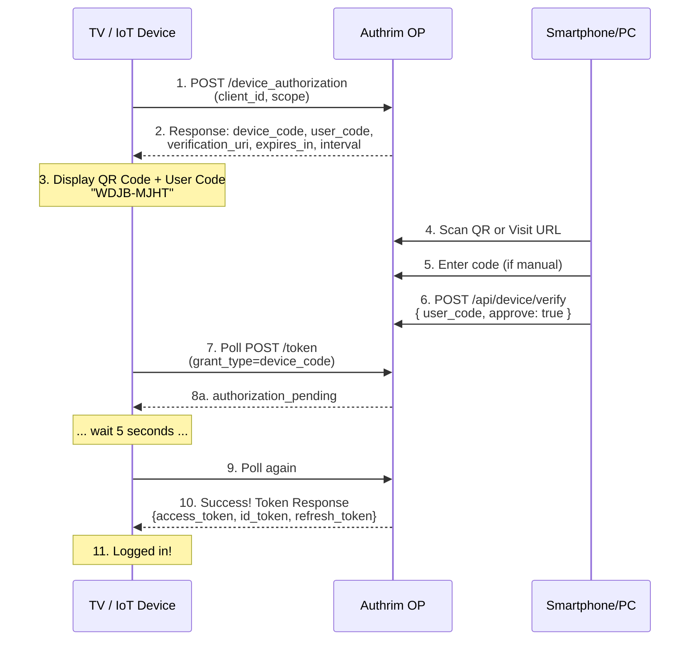

# Device Flow (RFC 8628)

## Overview

**RFC 8628** - OAuth 2.0 Device Authorization Grant

Authrim implements Device Flow, an OAuth 2.0 extension designed for input-constrained devices (smart TVs, IoT devices, CLI tools) that lack a web browser or have limited input capabilities. Users authenticate on a separate device (smartphone/PC) using a simple verification code or QR code.

## Specification

- **RFC**: [RFC 8628 - OAuth 2.0 Device Authorization Grant](https://datatracker.ietf.org/doc/html/rfc8628)
- **Status**: ✅ Fully Implemented with RFC Compliance Tests
- **Supported Endpoints**: `/device_authorization`, `/device`, `/api/device/verify`, `/token`
- **OIDC Extensions**: ✅ ID Token issuance (OpenID Connect)

---

## Why Use Device Flow?

### Key Benefits

1. **📺 Input-Constrained Devices**
   - Perfect for devices without keyboards (Smart TVs, streaming boxes)
   - No need for embedded web browser on the device
   - Simple 8-character verification code (e.g., `WDJB-MJHT`)
   - QR code support for instant scanning

2. **🔐 Secure Authentication**
   - User authenticates on their trusted device (smartphone/PC)
   - OAuth 2.0 security model with PKCE support
   - One-time use device codes (prevents replay attacks)
   - Automatic code expiration (10 minutes default)
   - Rate limiting with `slow_down` error handling

3. **👤 Excellent User Experience**
   - No complex URL typing on TV remotes
   - Scan QR code or enter short code (8 characters)
   - Authenticate using familiar device (phone/PC)
   - Multi-language UI support (English, Japanese)
   - Dark mode support

4. **🚀 Production Ready**
   - RFC 8628 compliance verified with 20 specification tests
   - 25 integration tests for end-to-end flow validation
   - DeviceCodeStore Durable Object for strong consistency
   - D1 Database persistence with automatic cleanup
   - Polling rate limiting (5-second default interval)

### Use Cases

- **Smart TV Apps**: Netflix/YouTube-style login experience
- **IoT Devices**: Smart home devices, security cameras
- **CLI Tools**: GitHub CLI, AWS CLI, developer tools
- **Gaming Consoles**: Xbox, PlayStation login flows
- **Kiosk Terminals**: Public terminals with limited input

---

## Flow Diagram



---

## API Endpoints

### 1. POST /device_authorization

**Device Authorization Endpoint** - Issues device code and user code

**Request**:
```http
POST /device_authorization HTTP/1.1
Content-Type: application/x-www-form-urlencoded

client_id=tv_app_123&scope=openid+profile+email
```

**Response**:
```json
{
  "device_code": "4c9a8e6f-b2d1-4a7c-9e3f-1d2b4a7c9e3f",
  "user_code": "WDJB-MJHT",
  "verification_uri": "https://ui.authrim.com/device",
  "verification_uri_complete": "https://ui.authrim.com/device?user_code=WDJB-MJHT",
  "expires_in": 600,
  "interval": 5
}
```

**Implementation**: `packages/op-async/src/device-authorization.ts`

---

### 2. GET /device

**User Verification Page** (Minimal HTML for OIDC Conformance)

**Purpose**: Minimal HTML form for OIDC conformance testing only. In production, users are redirected to the SvelteKit UI at `UI_BASE_URL/device`.

**Request**:
```http
GET /device?user_code=WDJB-MJHT HTTP/1.1
```

**Response**: Minimal HTML form (or redirect to SvelteKit UI)

**Implementation**: `packages/op-async/src/device-verify.ts`

---

### 3. POST /api/device/verify

**Headless JSON API for Device Verification** (Used by SvelteKit UI and WebSDK)

**Request**:
```http
POST /api/device/verify HTTP/1.1
Content-Type: application/json

{
  "user_code": "WDJB-MJHT",
  "approve": true
}
```

**Response (Success)**:
```json
{
  "success": true,
  "message": "Device authorized successfully"
}
```

**Response (Error)**:
```json
{
  "success": false,
  "error": "invalid_code",
  "error_description": "Invalid or expired user code"
}
```

**Error Codes**:
- `invalid_request` - Missing user_code
- `invalid_code` - Invalid format (not XXXX-XXXX)
- `invalid_code` - Code not found or expired
- `invalid_code` - Code already used/approved/denied

**Implementation**: `packages/op-async/src/device-verify-api.ts`

---

### 4. POST /token (grant_type=device_code)

**Token Endpoint** - Polls for authorization completion

**Request**:
```http
POST /token HTTP/1.1
Content-Type: application/x-www-form-urlencoded

grant_type=urn:ietf:params:oauth:grant-type:device_code
&device_code=4c9a8e6f-b2d1-4a7c-9e3f-1d2b4a7c9e3f
&client_id=tv_app_123
```

**Response (Pending)**:
```json
{
  "error": "authorization_pending",
  "error_description": "User has not yet authorized the device"
}
```

**Response (Too Fast)**:
```json
{
  "error": "slow_down",
  "error_description": "You are polling too frequently. Please slow down."
}
```

**Response (Success)**:
```json
{
  "access_token": "eyJhbGc...",
  "token_type": "Bearer",
  "expires_in": 3600,
  "refresh_token": "rt_...",
  "id_token": "eyJhbGc...",
  "scope": "openid profile email"
}
```

**Error Codes**:
- `authorization_pending` - User hasn't approved yet (keep polling)
- `slow_down` - Client polling too fast (increase interval by 5 seconds)
- `access_denied` - User denied the request
- `expired_token` - Device code expired (600 seconds default)

**Implementation**: `packages/op-token/src/token.ts` (handleDeviceCodeGrant function, lines 1281-1560)

---

## Implementation Details

### Backend Architecture

#### 1. DeviceCodeStore Durable Object

**Purpose**: Manages device code state with strong consistency

**File**: `packages/shared/src/durable-objects/DeviceCodeStore.ts`

**Features**:
- **In-memory hot cache**: Fast access to active device codes
- **D1 Database persistence**: Durability and recovery
- **User code → Device code mapping**: O(1) lookup by user code
- **State transitions**: `pending` → `approved`/`denied` → `consumed`
- **One-time use enforcement**: Codes deleted after token issuance
- **Alarm-based cleanup**: Automatic expiration (every 5 minutes)
- **Polling rate tracking**: `last_poll_at`, `poll_count` for rate limiting

**Internal API Methods**:
```typescript
POST /store              // Store new device code
POST /get-by-device-code // Lookup by device_code
POST /get-by-user-code   // Lookup by user_code (for verification)
POST /approve            // Transition to approved state
POST /deny               // Transition to denied state
POST /update-poll        // Track polling for rate limiting
POST /delete             // Delete code (one-time use)
```

#### 2. D1 Database Schema

**Table**: `device_codes`

```sql
CREATE TABLE device_codes (
  device_code TEXT PRIMARY KEY,
  user_code TEXT UNIQUE NOT NULL,
  client_id TEXT NOT NULL,
  scope TEXT NOT NULL,
  status TEXT NOT NULL CHECK (status IN ('pending', 'approved', 'denied', 'expired')),
  user_id TEXT,
  sub TEXT,
  created_at INTEGER NOT NULL,
  expires_at INTEGER NOT NULL,
  last_poll_at INTEGER,
  poll_count INTEGER DEFAULT 0,
  FOREIGN KEY (client_id) REFERENCES clients(id) ON DELETE CASCADE
);

CREATE INDEX idx_device_codes_user_code ON device_codes(user_code);
CREATE INDEX idx_device_codes_expires_at ON device_codes(expires_at);
```

**Migration**: `migrations/006_add_device_codes_table.sql`

#### 3. Code Generation

**Device Code**: UUID v4 (122 bits of entropy)
```typescript
import { randomUUID } from 'crypto';
const deviceCode = randomUUID(); // e.g., "4c9a8e6f-b2d1-4a7c-9e3f-1d2b4a7c9e3f"
```

**User Code**: 8 characters, ambiguous-free charset
```typescript
const charset = '23456789ABCDEFGHJKMNPQRSTUVWXYZ'; // Excludes 0, O, 1, I, L
const userCode = generateUserCode(); // e.g., "WDJB-MJHT"
```

**Format**: `XXXX-XXXX` (hyphen after 4th character for readability)

#### 4. Rate Limiting

**Default Interval**: 5 seconds

**Polling Detection**:
```typescript
function isPollingTooFast(metadata: DeviceCodeMetadata, interval: number): boolean {
  if (!metadata.last_poll_at) return false;
  const elapsed = (Date.now() - metadata.last_poll_at) / 1000;
  return elapsed < interval;
}
```

**Slow Down Increment**: +5 seconds (when `slow_down` error is returned)

**Max Poll Count**: 120 polls (automatic cleanup)

**Batched D1 Writes**: Updates every 5 polls to reduce database load

---

### Frontend Architecture (SvelteKit Pages)

#### 1. Device Verification Page

**File**: `packages/ui/src/routes/device/+page.svelte`

**Features**:
- **QR Code Generation**: Automatic QR code from `verification_uri_complete`
- **Melt UI Pin Input**: 8-cell input with auto-formatting (XXXX-XXXX)
- **Multi-language Support**: English, Japanese translations
- **Dark Mode**: Full dark mode support
- **Responsive Design**: Mobile-first, works on all screen sizes
- **Error Handling**: User-friendly error messages
- **URL Pre-fill**: Auto-fills code from `?user_code=` query parameter

**QR Code Library**: `qrcode` (v1.5.4)

**Example QR Code Generation**:
```typescript
import QRCode from 'qrcode';

const verificationUrl = `${window.location.origin}/device?user_code=${userCode}`;

const qrCodeDataUrl = await QRCode.toDataURL(verificationUrl, {
  width: 256,
  margin: 2,
  color: {
    dark: '#000000',
    light: '#FFFFFF'
  }
});
```

#### 2. API Client

**File**: `packages/ui/src/lib/api/client.ts`

**Device Flow API**:
```typescript
export const deviceFlowAPI = {
  async verifyDeviceCode(userCode: string, approve: boolean = true) {
    return apiFetch<{
      success: boolean;
      message?: string;
    }>('/api/device/verify', {
      method: 'POST',
      body: JSON.stringify({
        user_code: userCode,
        approve
      })
    });
  }
};
```

#### 3. i18n Translations

**English** (`packages/ui/src/i18n/en/index.ts`):
```typescript
device_title: 'Device Verification',
device_qrCodeLabel: 'Scan this QR code',
device_orManual: 'or enter code manually',
device_codeLabel: 'Verification Code',
device_approveButton: 'Approve',
device_denyButton: 'Deny',
device_success: 'Device authorized successfully!',
device_errorInvalidCode: 'Invalid or expired verification code',
```

**Japanese** (`packages/ui/src/i18n/ja/index.ts`):
```typescript
device_title: 'Device Authentication',
device_qrCodeLabel: 'Scan this QR code',
device_orManual: 'or enter manually',
device_codeLabel: 'Authentication Code',
device_approveButton: 'Approve',
device_denyButton: 'Deny',
device_success: 'Device authenticated successfully!',
device_errorInvalidCode: 'Invalid or expired authentication code',
```

---

## Configuration

### Environment Variables

#### Development (.dev.vars)

```bash
UI_BASE_URL="http://localhost:5173"  # SvelteKit dev server
```

**Setup Script**: `scripts/setup-dev.sh`

#### Production (wrangler.toml)

```toml
[vars]
UI_BASE_URL = "https://authrim-ui.pages.dev"  # Cloudflare Pages URL
```

**Setup Script**: `scripts/setup-production.sh`

**Prompt Example**:
```
Enter the base URL for your SvelteKit UI (Cloudflare Pages):
  Examples:
    • https://authrim-ui.pages.dev (Cloudflare Pages)
    • https://ui.yourdomain.com (custom domain)

UI_BASE_URL [https://authrim-ui.pages.dev]:
```

### Constants (Configurable)

**File**: `packages/shared/src/utils/device-flow.ts`

```typescript
export const DEVICE_FLOW_CONSTANTS = {
  DEFAULT_EXPIRES_IN: 600,      // 10 minutes (300-1800 seconds allowed)
  MIN_EXPIRES_IN: 300,          // 5 minutes
  MAX_EXPIRES_IN: 1800,         // 30 minutes
  DEFAULT_INTERVAL: 5,          // 5 seconds (3-30 seconds allowed)
  MIN_INTERVAL: 3,              // 3 seconds
  MAX_INTERVAL: 30,             // 30 seconds
  SLOW_DOWN_INCREMENT: 5,       // Add 5 seconds when slow_down error
  MAX_POLL_COUNT: 120,          // Maximum number of polls
};
```

---

## Testing

### RFC 8628 Compliance Tests

**File**: `packages/shared/src/utils/__tests__/device-flow-rfc-compliance.test.ts`

**20 Tests** covering all RFC 8628 sections:

- **§3.1 Device Authorization Request**
  - Device code uniqueness and unpredictability (UUID v4)
  - User code format (short, case-insensitive, no ambiguous chars)

- **§3.2 Device Authorization Response**
  - verification_uri format (valid URI)
  - expires_in presence and format (seconds)
  - interval presence and format (seconds)

- **§3.4 Device Access Token Request**
  - grant_type format (`urn:ietf:params:oauth:grant-type:device_code`)
  - device_code parameter presence

- **§3.5 Device Access Token Response**
  - Error codes: `authorization_pending`, `slow_down`, `access_denied`, `expired_token`
  - slow_down interval increment behavior

- **§5 Polling Rate Limiting**
  - Minimum interval enforcement
  - slow_down error detection

- **§6 User Code Recommendations**
  - Ambiguous character exclusion (0, O, 1, I, L)
  - Case-insensitive validation
  - Hyphen leniency

- **§8 Security Considerations**
  - Device code entropy (122 bits)
  - Code expiration enforcement
  - Rate limiting implementation

### Integration Tests

**File**: `packages/op-token/src/__tests__/device-flow-integration.test.ts`

**25 Tests** for end-to-end flow validation:

- Device authorization flow
- User code validation and normalization
- Token request flow (all error states)
- Device code lifecycle (pending → approved → consumed)
- Polling behavior and rate limiting
- Security validations (one-time use, client_id matching)
- OIDC extensions (ID token issuance)

### Test Results

```bash
✓ device-flow.test.ts (25 tests)
✓ device-flow-rfc-compliance.test.ts (20 tests)

Test Files  2 passed (2)
Tests      45 passed (45)
Duration   2.1s
```

**Total Device Flow Tests**: 70 tests (including utility tests)

---

## Example: Smart TV App Integration

### Step 1: Device Authorization Request

```typescript
// Smart TV app initiates device flow
const response = await fetch('https://id.yourdomain.com/device_authorization', {
  method: 'POST',
  headers: {
    'Content-Type': 'application/x-www-form-urlencoded'
  },
  body: new URLSearchParams({
    client_id: 'smart_tv_app_123',
    scope: 'openid profile email'
  })
});

const data = await response.json();
// {
//   device_code: "4c9a8e6f-b2d1-4a7c-9e3f-1d2b4a7c9e3f",
//   user_code: "WDJB-MJHT",
//   verification_uri: "https://ui.yourdomain.com/device",
//   verification_uri_complete: "https://ui.yourdomain.com/device?user_code=WDJB-MJHT",
//   expires_in: 600,
//   interval: 5
// }
```

### Step 2: Display QR Code and User Code

```typescript
// Generate QR code from verification_uri_complete
import QRCode from 'qrcode';

const qrCodeUrl = await QRCode.toDataURL(data.verification_uri_complete);

// Display on TV screen:
// - QR Code image
// - User code: "WDJB-MJHT"
// - Instructions: "Scan QR code or visit [verification_uri] and enter code"
```

### Step 3: Poll for Authorization

```typescript
const pollInterval = data.interval * 1000; // Convert to milliseconds
let currentInterval = pollInterval;

const pollForAuthorization = async () => {
  const tokenResponse = await fetch('https://id.yourdomain.com/token', {
    method: 'POST',
    headers: {
      'Content-Type': 'application/x-www-form-urlencoded'
    },
    body: new URLSearchParams({
      grant_type: 'urn:ietf:params:oauth:grant-type:device_code',
      device_code: data.device_code,
      client_id: 'smart_tv_app_123'
    })
  });

  if (tokenResponse.ok) {
    // Success! User authorized the device
    const tokens = await tokenResponse.json();
    console.log('Access Token:', tokens.access_token);
    console.log('ID Token:', tokens.id_token);
    return tokens;
  }

  const error = await tokenResponse.json();

  if (error.error === 'authorization_pending') {
    // User hasn't approved yet, keep polling
    setTimeout(pollForAuthorization, currentInterval);
  } else if (error.error === 'slow_down') {
    // Polling too fast, increase interval by 5 seconds
    currentInterval += 5000;
    setTimeout(pollForAuthorization, currentInterval);
  } else if (error.error === 'access_denied') {
    // User denied the request
    console.error('User denied authorization');
  } else if (error.error === 'expired_token') {
    // Device code expired
    console.error('Device code expired. Please restart the flow.');
  }
};

// Start polling after initial interval
setTimeout(pollForAuthorization, currentInterval);
```

---

## Example: CLI Tool Integration

### Installation

```bash
# Install your CLI tool
npm install -g awesome-cli
```

### Login Command

```bash
$ awesome-cli login

🔐 Device Login
━━━━━━━━━━━━━━━━━━━━━━━━━━━━━━━━━━━━━━━

Visit: https://ui.yourdomain.com/device

And enter code: WDJB-MJHT

Or scan this QR code:

  ┌─────────────────┐
  │ ████████████    │
  │ ██  ██  ██  ██  │
  │ ████████████    │
  │ ██████  ████    │
  │ ████████████    │
  └─────────────────┘

⏳ Waiting for authorization...
✅ Login successful! You're now authenticated.
```

### Implementation

```typescript
import QRCode from 'qrcode';

async function deviceLogin() {
  // Step 1: Request device code
  const authResponse = await fetch('https://id.yourdomain.com/device_authorization', {
    method: 'POST',
    headers: { 'Content-Type': 'application/x-www-form-urlencoded' },
    body: new URLSearchParams({
      client_id: 'awesome_cli',
      scope: 'openid profile'
    })
  });

  const { device_code, user_code, verification_uri_complete, interval } = await authResponse.json();

  // Step 2: Display QR code in terminal
  const qrCode = await QRCode.toString(verification_uri_complete, { type: 'terminal' });
  console.log(qrCode);
  console.log(`Code: ${user_code}`);

  // Step 3: Poll for tokens
  let currentInterval = interval * 1000;

  while (true) {
    await new Promise(resolve => setTimeout(resolve, currentInterval));

    const tokenResponse = await fetch('https://id.yourdomain.com/token', {
      method: 'POST',
      headers: { 'Content-Type': 'application/x-www-form-urlencoded' },
      body: new URLSearchParams({
        grant_type: 'urn:ietf:params:oauth:grant-type:device_code',
        device_code,
        client_id: 'awesome_cli'
      })
    });

    if (tokenResponse.ok) {
      const tokens = await tokenResponse.json();
      // Save tokens to ~/.awesome-cli/credentials.json
      saveTokens(tokens);
      console.log('✅ Login successful!');
      return;
    }

    const error = await tokenResponse.json();

    if (error.error === 'slow_down') {
      currentInterval += 5000;
    } else if (error.error !== 'authorization_pending') {
      throw new Error(`Login failed: ${error.error_description}`);
    }
  }
}
```

---

## Security Considerations

### 1. Device Code Entropy

**Requirement**: Device codes MUST have sufficient entropy to prevent guessing attacks.

**Implementation**: UUID v4 provides 122 bits of entropy
```typescript
const deviceCode = crypto.randomUUID(); // UUID v4 format
```

**Validation**: RFC 8628 §8.1 compliance test (lines 234-248 in device-flow-rfc-compliance.test.ts)

### 2. Code Expiration

**Requirement**: Device codes MUST expire to limit the window of vulnerability.

**Implementation**:
- Default: 600 seconds (10 minutes)
- Range: 300-1800 seconds (5-30 minutes)
- Automatic cleanup via Durable Object alarms

**Validation**:
```typescript
function isDeviceCodeExpired(metadata: DeviceCodeMetadata): boolean {
  return Date.now() > metadata.expires_at;
}
```

### 3. Rate Limiting

**Requirement**: Servers MUST implement rate limiting to prevent brute-force attacks.

**Implementation**:
- Minimum interval: 5 seconds (default)
- `slow_down` error if polling too fast
- Increment interval by 5 seconds on slow_down
- Max poll count: 120 polls

**Validation**: RFC 8628 §5 compliance test (lines 157-195 in device-flow-rfc-compliance.test.ts)

### 4. One-Time Use

**Requirement**: Device codes MUST be invalidated after first use.

**Implementation**:
- Codes deleted immediately after token issuance
- Status transition: `approved` → `consumed` → delete
- Replay attack detection

**Validation**: Security test (lines 235-244 in device-flow-integration.test.ts)

### 5. Client Validation

**Requirement**: Token endpoint MUST validate client_id matches the device_code.

**Implementation**:
```typescript
if (metadata.client_id !== client_id) {
  throw new Error('Client ID mismatch');
}
```

**Validation**: Security test (lines 220-233 in device-flow-integration.test.ts)

### 6. User Code Design

**Requirement**: User codes SHOULD exclude ambiguous characters.

**Implementation**:
- Charset: `23456789ABCDEFGHJKMNPQRSTUVWXYZ`
- Excludes: `0, O, 1, I, L` (confusing characters)
- Format: `XXXX-XXXX` (hyphen for readability)

**Validation**: RFC 8628 §6.1 compliance test (lines 197-230 in device-flow-rfc-compliance.test.ts)

---

## Troubleshooting

### Common Issues

#### 1. "Invalid or expired verification code"

**Cause**: Code expired (10 minutes default) or already used

**Solution**:
- Restart device flow to get a new code
- Check `expires_in` value and complete verification faster
- Verify code format is correct (`XXXX-XXXX`)

#### 2. "slow_down" error during polling

**Cause**: Client polling faster than allowed interval

**Solution**:
- Increase polling interval by 5 seconds
- Respect the `interval` value from device authorization response
- Implement exponential backoff

#### 3. QR code not displaying

**Cause**: QR code generation failed or browser issue

**Solution**:
- Check browser console for errors
- Verify `qrcode` library is installed
- Fall back to manual user code entry

#### 4. UI_BASE_URL not configured

**Cause**: Environment variable not set in worker

**Solution**:
- Run `./scripts/setup-dev.sh` for development
- Run `./scripts/setup-production.sh` for production
- Manually set `UI_BASE_URL` in wrangler.toml or .dev.vars

---

## References

- [RFC 8628 - OAuth 2.0 Device Authorization Grant](https://datatracker.ietf.org/doc/html/rfc8628)
- [OAuth 2.0 Specification](https://datatracker.ietf.org/doc/html/rfc6749)
- [OpenID Connect Core](https://openid.net/specs/openid-connect-core-1_0.html)
- [Best Current Practice for OAuth 2.0 for Native Apps](https://datatracker.ietf.org/doc/html/rfc8252)
