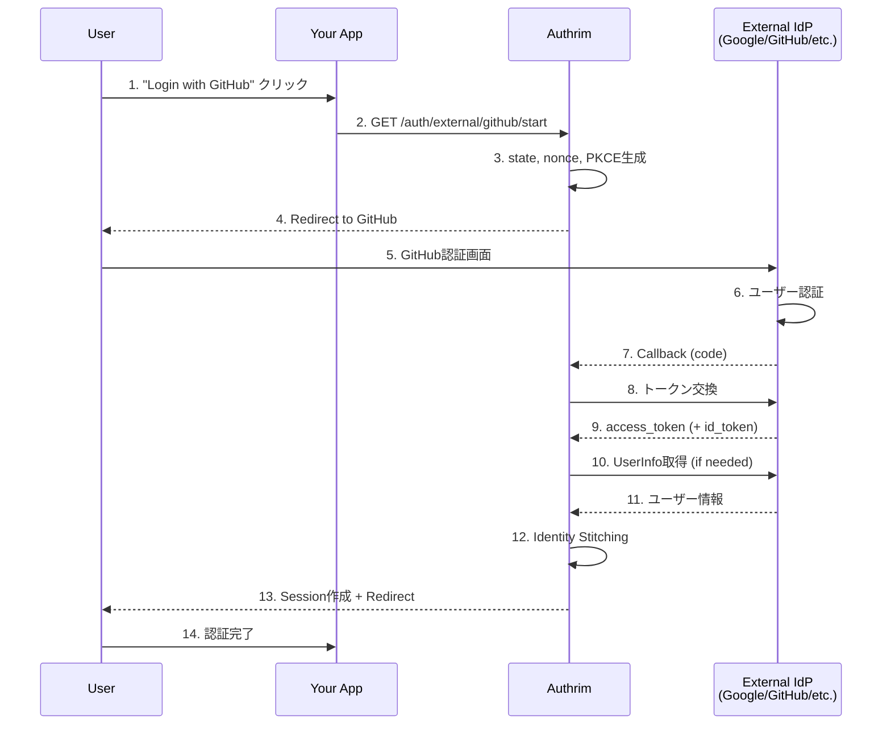

# External IdP (外部ID プロバイダー連携)

## Overview

**OAuth 2.0 / OpenID Connect Federation**

Authrim は外部ID プロバイダー（IdP）との連携をサポートしています。ユーザーは Google、Microsoft、GitHub などの既存のアカウントを使って認証できます。

## Specification

- **Protocols**: OAuth 2.0, OpenID Connect 1.0
- **Status**: ✅ Implemented
- **Supported Providers**: Google, Microsoft (Entra ID), GitHub, その他 OIDC/OAuth2 準拠プロバイダー

---

## Why Use External IdP?

### Benefits

1. **🔐 ユーザー体験の向上**
   - 既存アカウントでのワンクリックログイン
   - パスワード不要
   - ソーシャルログインによる登録障壁の低減

2. **🛡️ セキュリティの強化**
   - 大手プロバイダーの認証基盤を活用
   - MFA/2FA を外部IdPに委任可能
   - パスワード管理の負担軽減

3. **🚀 JITプロビジョニング**
   - 初回ログイン時に自動ユーザー作成
   - メールによる自動アカウントリンク
   - 属性マッピングによるプロファイル同期

4. **🌐 エンタープライズ対応**
   - Microsoft Entra ID (Azure AD) 連携
   - GitHub Enterprise Server 対応
   - カスタムOIDCプロバイダー

---

## Supported Providers

| Provider | Type | ID Token | UserInfo | Enterprise Support |
|----------|------|----------|----------|-------------------|
| Google | OIDC | ✅ | ✅ | ❌ |
| Microsoft (Entra ID) | OIDC | ✅ | ✅ | ✅ (Multi-tenant) |
| GitHub | OAuth 2.0 | ❌ | ✅ | ✅ (Enterprise Server) |
| Custom OIDC | OIDC | ✅ | ✅ | - |
| Custom OAuth 2.0 | OAuth 2.0 | ❌ | ✅ | - |

---

## Architecture

### Authentication Flow



### Identity Stitching

ユーザーIDの紐付け（アカウントリンク）は以下の優先順で行われます：

1. **明示的リンク**: `linkingUserId` が指定されている場合
2. **メールリンク**: `autoLinkEmail=true` かつメールが一致する既存ユーザー
3. **JITプロビジョニング**: `jitProvisioning=true` で新規ユーザー作成
4. **エラー**: いずれも該当しない場合

---

## Admin API

### Provider CRUD Operations

| Method | Endpoint | Description |
|--------|----------|-------------|
| GET | `/external-idp/admin/providers` | プロバイダー一覧 |
| POST | `/external-idp/admin/providers` | プロバイダー作成 |
| GET | `/external-idp/admin/providers/:id` | プロバイダー詳細 |
| PUT | `/external-idp/admin/providers/:id` | プロバイダー更新 |
| DELETE | `/external-idp/admin/providers/:id` | プロバイダー削除 |

### Authentication

```http
Authorization: Bearer <ADMIN_API_SECRET>
```

---

## Provider Setup

### Google

Google Cloud Console で OAuth 2.0 クライアントを作成し、以下の設定を行います。

#### 1. Google Cloud Console 設定

1. [Google Cloud Console](https://console.cloud.google.com/) にアクセス
2. **APIs & Services** > **Credentials** > **Create Credentials** > **OAuth client ID**
3. **Application type**: Web application
4. **Authorized redirect URIs**: `https://your-domain.com/auth/external/google/callback`
5. Client ID と Client Secret を取得

#### 2. Admin API でプロバイダー登録

```bash
curl -X POST "https://your-domain.com/external-idp/admin/providers" \
  -H "Authorization: Bearer ${ADMIN_API_SECRET}" \
  -H "Content-Type: application/json" \
  -d '{
    "template": "google",
    "name": "Google",
    "slug": "google",
    "client_id": "YOUR_GOOGLE_CLIENT_ID.apps.googleusercontent.com",
    "client_secret": "YOUR_GOOGLE_CLIENT_SECRET"
  }'
```

#### Google 固有オプション

| Field | Default | Description |
|-------|---------|-------------|
| scopes | `openid email profile` | OAuth スコープ |

---

### Microsoft (Entra ID)

Microsoft Entra ID（旧 Azure AD）との連携を設定します。

#### 1. Azure Portal 設定

1. [Azure Portal](https://portal.azure.com/) > **Microsoft Entra ID** > **App registrations**
2. **New registration**
3. **Redirect URI**: `https://your-domain.com/auth/external/microsoft/callback`
4. **Certificates & secrets** > **New client secret**
5. Application (client) ID と Client Secret を取得

#### 2. Admin API でプロバイダー登録

```bash
curl -X POST "https://your-domain.com/external-idp/admin/providers" \
  -H "Authorization: Bearer ${ADMIN_API_SECRET}" \
  -H "Content-Type: application/json" \
  -d '{
    "template": "microsoft",
    "name": "Microsoft",
    "slug": "microsoft",
    "client_id": "YOUR_MICROSOFT_CLIENT_ID",
    "client_secret": "YOUR_MICROSOFT_CLIENT_SECRET",
    "provider_quirks": {
      "tenantType": "common"
    }
  }'
```

#### Microsoft 固有オプション

| Field | Values | Description |
|-------|--------|-------------|
| `provider_quirks.tenantType` | `common`, `organizations`, `consumers`, `{tenant-id}`, `{domain}` | テナントタイプ |

**tenantType の選択:**
- `common`: 全Microsoft アカウント（個人 + 組織）
- `organizations`: 組織アカウントのみ（Azure AD）
- `consumers`: 個人アカウントのみ（Outlook.com等）
- `{tenant-id}`: 特定テナントのみ（GUID）
- `{domain}`: 特定ドメインのみ（例: `contoso.onmicrosoft.com`）

---

### GitHub

GitHub OAuth App または GitHub App を使用した認証を設定します。

#### 1. GitHub App 作成

1. [GitHub Developer Settings](https://github.com/settings/developers) にアクセス
2. **OAuth Apps** > **New OAuth App**
3. 以下の情報を入力:
   - **Application name**: Your App Name
   - **Homepage URL**: `https://your-domain.com`
   - **Authorization callback URL**: `https://your-domain.com/auth/external/github/callback`
4. **Register application**
5. Client ID と Client Secret を取得

#### 2. Admin API でプロバイダー登録

```bash
curl -X POST "https://your-domain.com/external-idp/admin/providers" \
  -H "Authorization: Bearer ${ADMIN_API_SECRET}" \
  -H "Content-Type: application/json" \
  -d '{
    "template": "github",
    "name": "GitHub",
    "slug": "github",
    "client_id": "YOUR_GITHUB_CLIENT_ID",
    "client_secret": "YOUR_GITHUB_CLIENT_SECRET"
  }'
```

#### GitHub 固有オプション

| Field | Default | Description |
|-------|---------|-------------|
| `scopes` | `read:user user:email` | OAuth スコープ |
| `provider_quirks.fetchPrimaryEmail` | `true` | `/user/emails` APIからメール取得 |
| `provider_quirks.allowUnverifiedEmail` | `false` | 未検証メールを許可 |
| `provider_quirks.allowEnterpriseServer` | `false` | GitHub Enterprise Server 有効化 |
| `provider_quirks.enterpriseServerUrl` | - | Enterprise Server URL |

#### GitHub Enterprise Server 対応

社内の GitHub Enterprise Server を使用する場合:

```bash
curl -X POST "https://your-domain.com/external-idp/admin/providers" \
  -H "Authorization: Bearer ${ADMIN_API_SECRET}" \
  -H "Content-Type: application/json" \
  -d '{
    "template": "github",
    "name": "GitHub Enterprise",
    "slug": "github-enterprise",
    "client_id": "YOUR_GHE_CLIENT_ID",
    "client_secret": "YOUR_GHE_CLIENT_SECRET",
    "provider_quirks": {
      "allowEnterpriseServer": true,
      "enterpriseServerUrl": "https://github.mycompany.com"
    }
  }'
```

#### GitHub の注意点

1. **メール取得について**
   - GitHub の `/user` エンドポイントは、ユーザーがメールを非公開設定にしている場合、メールを返しません
   - `fetchPrimaryEmail: true`（デフォルト）で `/user/emails` API から主メールを取得します
   - `user:email` スコープが必要です

2. **属性マッピング**
   - GitHub は OIDC ではなく OAuth 2.0 のため、クレーム名が異なります
   - `id` (数値) → `sub` (文字列)
   - `login` → `preferred_username`
   - `avatar_url` → `picture`
   - これらは自動的にマッピングされます

---

### Custom OIDC Provider

OpenID Connect 準拠のカスタムプロバイダーを設定できます。

```bash
curl -X POST "https://your-domain.com/external-idp/admin/providers" \
  -H "Authorization: Bearer ${ADMIN_API_SECRET}" \
  -H "Content-Type: application/json" \
  -d '{
    "name": "Custom IdP",
    "slug": "custom-idp",
    "provider_type": "oidc",
    "client_id": "YOUR_CLIENT_ID",
    "client_secret": "YOUR_CLIENT_SECRET",
    "issuer": "https://idp.example.com",
    "scopes": "openid email profile"
  }'
```

OIDC Discovery（`/.well-known/openid-configuration`）から自動的にエンドポイントが取得されます。

---

### Custom OAuth 2.0 Provider

OIDC非対応のOAuth 2.0プロバイダーを設定する場合は、エンドポイントを明示的に指定します。

```bash
curl -X POST "https://your-domain.com/external-idp/admin/providers" \
  -H "Authorization: Bearer ${ADMIN_API_SECRET}" \
  -H "Content-Type: application/json" \
  -d '{
    "name": "Custom OAuth2",
    "slug": "custom-oauth2",
    "provider_type": "oauth2",
    "client_id": "YOUR_CLIENT_ID",
    "client_secret": "YOUR_CLIENT_SECRET",
    "authorization_endpoint": "https://oauth.example.com/authorize",
    "token_endpoint": "https://oauth.example.com/token",
    "userinfo_endpoint": "https://oauth.example.com/userinfo",
    "scopes": "user email",
    "attribute_mapping": {
      "sub": "id",
      "email": "email",
      "name": "display_name",
      "picture": "avatar"
    }
  }'
```

---

## Provider Configuration Reference

### Common Fields

| Field | Type | Required | Default | Description |
|-------|------|----------|---------|-------------|
| `name` | string | ✅ | - | 表示名 |
| `slug` | string | - | `id` | URLフレンドリーな識別子 |
| `provider_type` | string | - | `oidc` | `oidc` または `oauth2` |
| `client_id` | string | ✅ | - | OAuth Client ID |
| `client_secret` | string | ✅ | - | OAuth Client Secret |
| `enabled` | boolean | - | `true` | 有効/無効 |
| `priority` | number | - | `0` | 表示順序 |

### OIDC Fields

| Field | Type | Required | Default | Description |
|-------|------|----------|---------|-------------|
| `issuer` | string | ✅ | - | OIDC Issuer URL |
| `scopes` | string | - | `openid email profile` | スコープ（スペース区切り） |

### OAuth 2.0 Fields

| Field | Type | Required | Default | Description |
|-------|------|----------|---------|-------------|
| `authorization_endpoint` | string | ✅ | - | 認可エンドポイント |
| `token_endpoint` | string | ✅ | - | トークンエンドポイント |
| `userinfo_endpoint` | string | ✅ | - | UserInfoエンドポイント |
| `jwks_uri` | string | - | - | JWKS URI（ID Token検証用） |

### Identity Linking Fields

| Field | Type | Default | Description |
|-------|------|---------|-------------|
| `auto_link_email` | boolean | `true` | メールでの自動リンク |
| `jit_provisioning` | boolean | `true` | JITプロビジョニング |
| `require_email_verified` | boolean | `true` | 検証済みメール必須 |

### UI Customization Fields

| Field | Type | Description |
|-------|------|-------------|
| `icon_url` | string | ボタンアイコンURL |
| `button_color` | string | ボタン背景色（HEX） |
| `button_text` | string | ボタンテキスト |

### Attribute Mapping

OAuth 2.0プロバイダーのクレーム名をOIDC標準クレームにマッピングします。

```json
{
  "attribute_mapping": {
    "sub": "id",
    "email": "email_address",
    "name": "full_name",
    "preferred_username": "username",
    "picture": "avatar_url"
  }
}
```

ネストした属性もサポート（ドット記法）:

```json
{
  "attribute_mapping": {
    "sub": "data.user.id",
    "email": "data.user.email"
  }
}
```

---

## User Flow Endpoints

### Start External Authentication

```
GET /auth/external/:provider/start
```

**Query Parameters:**

| Parameter | Required | Description |
|-----------|----------|-------------|
| `redirect_uri` | ✅ | 認証後リダイレクト先 |
| `tenant_id` | - | テナントID（マルチテナント時） |
| `user_id` | - | リンク先ユーザーID（アカウントリンク時） |

**Example:**

```
https://your-domain.com/auth/external/github/start?redirect_uri=https://app.example.com/callback
```

### Callback (Internal)

```
GET /auth/external/:provider/callback
```

このエンドポイントは外部IdPから呼び出されます。直接呼び出す必要はありません。

---

## Security Considerations

### 1. PKCE (Proof Key for Code Exchange)

すべての外部IdP認証フローでPKCEが使用されます。

- **Method**: S256 (SHA-256)
- **Storage**: KV (60秒TTL)

### 2. State Parameter

CSRF攻撃を防ぐため、cryptographically secure な state パラメータが生成されます。

### 3. Nonce (OIDC)

OIDCプロバイダーの場合、ID Tokenのreplay攻撃を防ぐためにnonceが使用されます。

### 4. Client Secret 暗号化

Client Secret は AES-256-GCM で暗号化されて保存されます。

```
RP_TOKEN_ENCRYPTION_KEY=<your-encryption-key>
```

### 5. Email Verification

デフォルトで `require_email_verified: true` が設定されています。
これにより、検証されていないメールアドレスでのアカウントリンクを防ぎます。

### 6. Backchannel Logout

外部IdPがBackchannel Logoutをサポートしている場合、セッションが同期されます。

```
POST /auth/external/:provider/backchannel-logout
```

---

## Multi-tenant Support

テナントごとに異なるプロバイダーを設定できます。

```bash
# テナントAのGitHub
curl -X POST "https://your-domain.com/external-idp/admin/providers" \
  -H "Authorization: Bearer ${ADMIN_API_SECRET}" \
  -H "Content-Type: application/json" \
  -d '{
    "template": "github",
    "name": "GitHub",
    "client_id": "TENANT_A_GITHUB_CLIENT_ID",
    "client_secret": "TENANT_A_GITHUB_CLIENT_SECRET",
    "tenant_id": "tenant-a"
  }'

# テナントBのGitHub（別のOAuth App）
curl -X POST "https://your-domain.com/external-idp/admin/providers" \
  -H "Authorization: Bearer ${ADMIN_API_SECRET}" \
  -H "Content-Type: application/json" \
  -d '{
    "template": "github",
    "name": "GitHub",
    "client_id": "TENANT_B_GITHUB_CLIENT_ID",
    "client_secret": "TENANT_B_GITHUB_CLIENT_SECRET",
    "tenant_id": "tenant-b"
  }'
```

---

## Error Handling

### Common Errors

| Error Code | Description | Solution |
|------------|-------------|----------|
| `unknown_provider` | プロバイダーが見つからない | slug/ID を確認 |
| `invalid_state` | state検証失敗 | セッションタイムアウトまたはCSRF |
| `callback_failed` | コールバック処理失敗 | ログを確認 |
| `invalid_request` | 不正なリクエスト | パラメータを確認 |
| `acr_values_not_satisfied` | ACRレベル不足 | より強い認証方法が必要 |

### Error Response Format

認証エラー時は、`redirect_uri` にエラーパラメータ付きでリダイレクトされます。

```
https://app.example.com/callback?error=callback_failed&error_description=Provider+did+not+return+a+user+identifier
```

---

## Testing

### Unit Tests

```bash
# external-idp パッケージのテスト
pnpm --filter @authrim/external-idp run test
```

### Test Files

- `packages/external-idp/src/__tests__/admin-providers.test.ts`
- `packages/external-idp/src/__tests__/oidc-client.test.ts`
- `packages/external-idp/src/__tests__/callback.test.ts`
- `packages/external-idp/src/__tests__/start.test.ts`
- `packages/external-idp/src/__tests__/state.test.ts`

---

## Troubleshooting

### "Provider not found"

1. プロバイダーが作成されているか確認:
   ```bash
   curl "https://your-domain.com/external-idp/admin/providers?tenant_id=default" \
     -H "Authorization: Bearer ${ADMIN_API_SECRET}"
   ```

2. `slug` または `id` が正しいか確認
3. `enabled: true` か確認

### "State validation failed"

1. ユーザーが60秒以上かかっていないか確認（stateのTTL）
2. 同じブラウザ/セッションでフローを完了しているか確認
3. Cookieがブロックされていないか確認

### "Provider did not return email"

**GitHub の場合:**
1. OAuth Appに `user:email` スコープがあるか確認
2. `provider_quirks.fetchPrimaryEmail: true` が設定されているか確認
3. ユーザーがGitHubで主メールを設定しているか確認

**一般:**
1. `scopes` に `email` が含まれているか確認
2. `attribute_mapping.email` が正しく設定されているか確認

### "Callback URL mismatch"

外部IdPに登録したCallback URLと、AuthrimからリクエストされるコールバックURLが一致することを確認:

```
https://your-domain.com/auth/external/{provider-slug}/callback
```

---

## Best Practices

### 1. Slug の使用

URLに使用される識別子として `slug` を設定することを推奨します:

```json
{
  "slug": "github",
  "name": "GitHub"
}
```

これにより、URL が読みやすくなります:
- ✅ `/auth/external/github/start`
- ❌ `/auth/external/550e8400-e29b-41d4-a716-446655440000/start`

### 2. Email Verification

本番環境では `require_email_verified: true` を維持してください。

### 3. スコープの最小化

必要最小限のスコープのみをリクエスト:

```json
{
  "scopes": "openid email"
}
```

### 4. 定期的なSecret ローテーション

OAuth Client Secret は定期的にローテーションすることを推奨します。

### 5. 監査ログの確認

外部IdP認証は監査ログに記録されます。定期的に確認してください。

---

## References

- [OpenID Connect Core 1.0](https://openid.net/specs/openid-connect-core-1_0.html)
- [OAuth 2.0 Authorization Framework (RFC 6749)](https://datatracker.ietf.org/doc/html/rfc6749)
- [PKCE (RFC 7636)](https://datatracker.ietf.org/doc/html/rfc7636)
- [Google OAuth 2.0 Documentation](https://developers.google.com/identity/protocols/oauth2)
- [Microsoft Identity Platform](https://learn.microsoft.com/en-us/entra/identity-platform/)
- [GitHub OAuth Apps Documentation](https://docs.github.com/en/apps/oauth-apps)

---

**Last Updated**: 2025-12
**Status**: ✅ Implemented
**Supported Providers**: Google, Microsoft, GitHub, Custom OIDC/OAuth2
