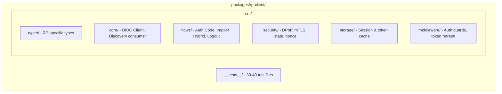

# Authrim RP (Relying Party) Support - Quick Reference

**Analysis Date:** November 18, 2025  
**Full Analysis:** `/docs/RP_SUPPORT_ANALYSIS.md` (938 lines)  
**Status:** Ready for Phase 6 Implementation

---

## Quick Facts

| Item | Details |
|------|---------|
| **Current Status** | 100% OP, 0% RP |
| **OP Implementation** | Phase 5 Complete (400+ tests passing) |
| **RP Effort** | 254 hours (6 weeks full-time) |
| **RP Profiles to Support** | 7 (Basic, Implicit, Hybrid, Form Post, Config, Logout, FAPI) |
| **Code Reuse** | 80% (JWT validation, DPoP, PAR, session management) |
| **New Package** | `@authrim/rp-client` |
| **Test Coverage** | 150-200 tests (currently 0) |
| **Recommended** | ✅ YES - Strong foundation + market gap |

---

## Current OP Implementation (What Exists)

### Core Features (Phases 1-5 Complete)
- ✅ Authorization Code Flow
- ✅ OpenID Connect Core 1.0 + Discovery 1.0
- ✅ PKCE (RFC 7636)
- ✅ Dynamic Client Registration (RFC 7591)
- ✅ Token Management (Refresh, Introspection, Revocation)
- ✅ PAR - Pushed Authorization Requests (RFC 9126)
- ✅ DPoP - Demonstrating Proof of Possession (RFC 9449)
- ✅ Pairwise Subject Identifiers (OIDC Core 8.1)
- ✅ Form Post Response Mode
- ✅ WebAuthn/Passkeys (FIDO2)
- ✅ Magic Link Authentication
- ✅ Session Management (ITP-compliant SSO)
- ✅ Front/Back-Channel Logout (RFC 8725)

### Tech Stack
- **Runtime:** Cloudflare Workers + Hono
- **Database:** D1 (SQLite) with 12 tables
- **State Management:** 9 Durable Objects
- **Crypto:** JOSE 6.1 (JWT/JWK/DPoP)
- **Frontend:** SvelteKit 5 + UnoCSS + Melt UI

### Architecture

| Metric | Value |
|--------|-------|
| **Packages** | 8 (op-discovery, op-auth, op-token, op-userinfo, op-management, router, shared, ui) |
| **TypeScript** | 9,000+ lines |
| **Tests** | 400+ (Vitest + Playwright) |
| **Conformance** | 95.8% OpenID score (Phase 3) |

---

## What's Missing (RP Implementation Needed)

### RP Profiles (All 7 Missing)
- ❌ RP Basic (Standard Authorization Code Flow as client)
- ❌ RP Implicit (Browser-based, deprecated)
- ❌ RP Hybrid (Mixed response types)
- ❌ RP Form Post (Form submission instead of redirect)
- ❌ RP Config/Discovery (Dynamic configuration discovery)
- ❌ RP Logout (RP-Initiated + Session management)
- ❌ RP FAPI (Financial-grade API security)

### Key Components Needed
- ❌ OAuth 2.0 client library
- ❌ OIDC Discovery consumer
- ❌ JWT token validation for RP
- ❌ Session management for RP
- ❌ HTTP request wrapper
- ❌ mTLS certificate handling
- ❌ Logout flow handlers

---

## Implementation Timeline

### Phase 6a: Foundation (Weeks 1-2)
- Create `@authrim/rp-client` package
- Implement Authorization Code Flow (client-side)
- Implement JWT validation
- Build RP Basic example app
- 30 unit tests

**Effort:** 40-60 hours

### Phase 6b: Advanced Features (Weeks 3-4)
- Add Implicit & Hybrid Flow support
- Add logout handlers
- Add FAPI security (partial)
- 50 integration tests

**Effort:** 40-60 hours

### Phase 6c: Polish & Launch (Weeks 5-6)
- Conformance test integration
- E2E tests (20 tests)
- Documentation
- npm package publication

**Effort:** 40-50 hours

**Total: 169 hours + 50% contingency = 254 hours (6 weeks)**

---

## Effort Estimation by RP Profile

| Profile | Complexity | Effort | Dependencies |
|---------|-----------|--------|--------------|
| RP Basic | 🟢 Low | 40-60h | Auth Code, JWT validation |
| RP Implicit | 🟡 Med | 30-50h | Discovery, JWT validation |
| RP Hybrid | 🟡 Med | 50-80h | Basic + Implicit |
| RP Form Post | 🟢 Low | 20-30h | Basic + form handling |
| RP Config | 🟢 Low | 15-25h | Discovery endpoint |
| RP Logout | 🟡 Med | 40-60h | Session + logout endpoints |
| RP FAPI | 🔴 High | 80-120h | All above + mTLS + PAR |

**Total: 275-425 hours**

---

## What Can Be Reused from OP

✅ 80% Code Reuse Potential

- JWT validation (`jose` library)
- Discovery endpoint structure
- DPoP implementation
- PAR support
- PKCE validation
- Token introspection/revocation
- Error handling patterns
- Testing infrastructure
- Secure random generation
- Session Store Durable Object

---

## New Package Structure



---

## Recommendation

### ✅ GO FOR RP SUPPORT

**Reasons:**
1. Excellent OP foundation (Phase 5 complete)
2. 80% code reuse from existing OP
3. Modular architecture supports new package
4. Strong testing culture (400+ tests)
5. Cloudflare advantages for edge execution
6. **Market gap:** No edge-native OIDC RP library exists
7. Consistent technology stack

**Success Metrics:**
- ✅ 150+ RP tests passing
- ✅ All 7 RP profiles supported
- ✅ OpenID Certified™ RP mark
- ✅ npm package (1,000+ monthly downloads goal)
- ✅ <100ms token validation latency

---

## Key Implementation Challenges

| Challenge | Severity | Solution |
|-----------|----------|----------|
| Token validation at edge | 🟡 Medium | JOSE library + KV caching |
| Session persistence | 🟡 Medium | Durable Objects + D1 (proven) |
| State validation | 🟢 Low | Reuse existing utilities |
| mTLS support | 🔴 High | Document best practices |
| Multi-provider support | 🟡 Medium | Allow multiple registrations |

---

## Integration Points

**Directly Reusable:**
```typescript
import { verifyJWT, parseToken } from '@authrim/shared';
import { validateState, validateNonce } from '@authrim/shared';
import { CloudflareAdapter } from '@authrim/shared/storage';
import { createErrorResponse } from '@authrim/shared';
```

**Existing Infrastructure:**
- Vitest configuration
- Mock Cloudflare environment
- Hono routing patterns
- GitHub Actions CI/CD
- Playwright E2E testing
- Rate limiting middleware

---

## Risk Assessment

| Risk | Probability | Impact | Mitigation |
|------|-------------|--------|-----------|
| Token validation complexity | Low | High | JOSE library handles |
| Session state inconsistency | Medium | Medium | Use Durable Objects |
| Conformance failures | Medium | Medium | Incremental testing |
| Cross-origin issues | Low | Medium | OP has solution |
| Performance at scale | Low | Low | Edge + caching |

---

## Success Criteria

- [ ] 150+ RP tests passing
- [ ] 7 RP profiles fully supported
- [ ] <100ms p50 token validation latency
- [ ] Zero security vulnerabilities
- [ ] OpenID Certified™ RP mark
- [ ] 1,000+ npm monthly downloads (12-month goal)
- [ ] Complete documentation + examples
- [ ] Playbook for mTLS setup

---

## Next Steps

1. **Read Full Analysis** → `/docs/RP_SUPPORT_ANALYSIS.md`
2. **Stakeholder Review** → Get approval to proceed
3. **Architecture Review** → Validate package design
4. **Resource Allocation** → Assign 1 senior engineer, 6 weeks
5. **Phase 6a Kickoff** → Create rp-client package

---

## Quick Links

- **Full Analysis:** `/docs/RP_SUPPORT_ANALYSIS.md` (938 lines)
- **Roadmap:** `/docs/ROADMAP.md` (Phase 6 planning)
- **Architecture:** `/docs/architecture/technical-specs.md`
- **OP Examples:** `/packages/op-auth/src/`, `/packages/op-token/src/`

---

**Status:** ✅ Ready for implementation  
**Confidence:** 95% (solid technical foundation)  
**Market Timing:** Excellent (no competitor edge-native RP exists)  

