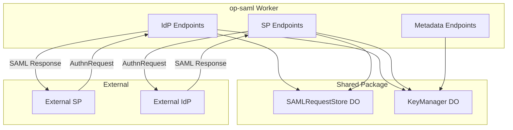
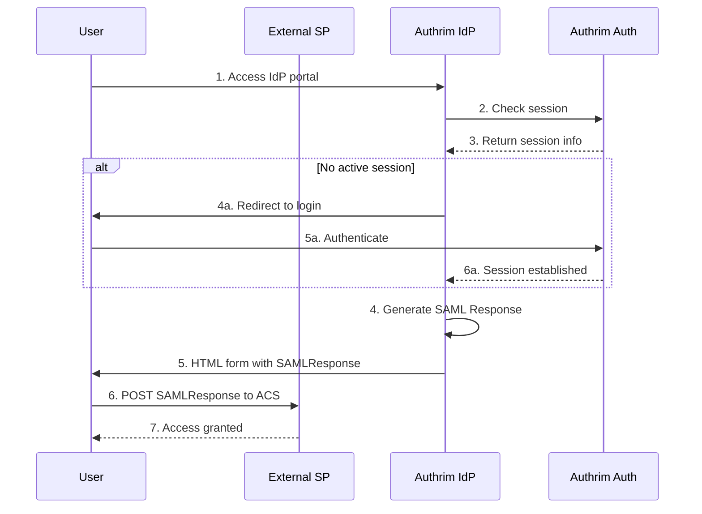
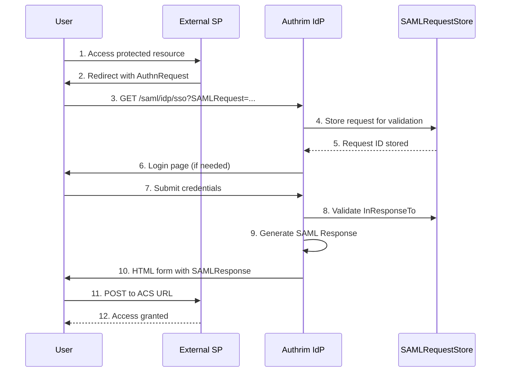
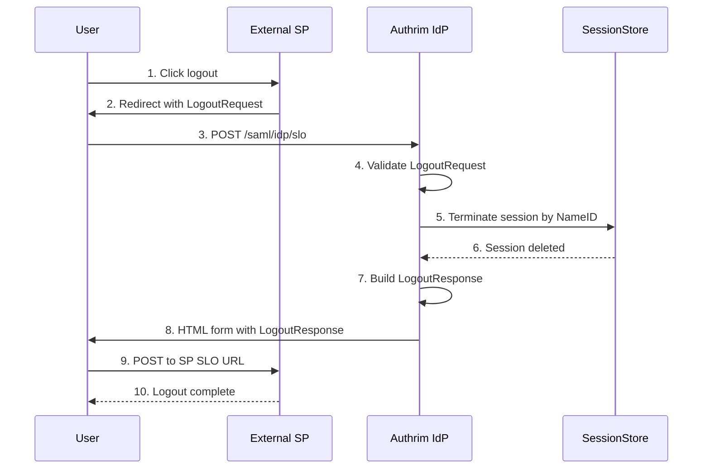
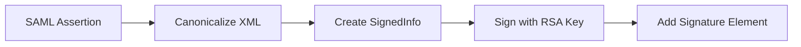

# SAML 2.0 Support

SAML 2.0 Identity Provider (IdP) and Service Provider (SP) implementation for Authrim.

## Overview

SAML (Security Assertion Markup Language) 2.0 is an XML-based framework for exchanging authentication and authorization data between parties. Authrim supports both IdP (Identity Provider) and SP (Service Provider) roles, enabling enterprise SSO integrations.

### Use Cases

- **Enterprise SSO**: Integrate with enterprise identity systems (AD FS, Okta, Azure AD)
- **Legacy Application Support**: Connect with applications that only support SAML
- **Federation**: Establish trust relationships between organizations
- **Regulatory Compliance**: Meet requirements for standards-based authentication

## Architecture

### Components



### Durable Objects

1. **SAMLRequestStore** - SAML request state management
   - AuthnRequest tracking for replay protection
   - Artifact binding storage
   - Assertion ID tracking to prevent replay attacks

2. **KeyManager** - Cryptographic key management
   - X.509 certificate generation
   - Private key storage
   - Key rotation support

## Implementation Status

### ✅ Fully Implemented

| Feature | IdP | SP | Notes |
|---------|-----|----|----|
| **SSO (Single Sign-On)** | ✅ | ✅ | SP-initiated and IdP-initiated |
| **SLO (Single Logout)** | ✅ | ✅ | LogoutRequest/LogoutResponse with signature |
| **HTTP-POST Binding** | ✅ | ✅ | Primary binding |
| **HTTP-Redirect Binding** | ✅ | ✅ | Deflate + Base64 encoding |
| **Metadata Generation** | ✅ | ✅ | XML metadata documents |
| **XML Signature (RSA-SHA256)** | ✅ | ✅ | Sign and verify |
| **Signature Verification** | ✅ | ✅ | SHA-1 rejected |
| **AuthnRequest Parsing** | ✅ | - | IssueInstant, Destination validation |
| **SAML Response Parsing** | - | ✅ | Status, Conditions, Assertion |
| **NameID Formats** | ✅ | ✅ | Email, Persistent, Transient |
| **Attribute Mapping** | ✅ | ✅ | Configurable per provider |
| **Session Integration** | ✅ | ✅ | SessionStore DO |
| **Replay Protection** | ✅ | ✅ | SAMLRequestStore DO |
| **JIT Provisioning** | - | ✅ | Auto user creation |
| **Admin API** | ✅ | ✅ | Provider CRUD |

### ❌ Not Implemented

| Feature | Reason |
|---------|--------|
| **Assertion Encryption** | Design decision: signing only |
| **Artifact Binding** | SOAP backchannel complexity; rarely needed with modern HTTP-POST |
| **ECP Profile** | Mobile-specific; out of scope |
| **Encrypted NameID** | Signing is sufficient for most use cases |
| **IdP Discovery** | Multi-IdP UI not implemented |
| **Logout Propagation** | Multi-SP logout chain not implemented |

### Binding Support

| Binding | IdP → SP | SP → IdP | Status |
|---------|----------|----------|--------|
| HTTP-POST | ✅ | ✅ | **Recommended** |
| HTTP-Redirect | ✅ | ✅ | Supported |
| Artifact | ❌ | ❌ | Not planned |
| SOAP | ❌ | ❌ | Not planned |

## Endpoints

### IdP Endpoints

| Endpoint | Method | Description |
|----------|--------|-------------|
| `/saml/idp/metadata` | GET | IdP metadata document |
| `/saml/idp/sso` | GET/POST | Single Sign-On service |
| `/saml/idp/slo` | GET/POST | Single Logout service |

### SP Endpoints

| Endpoint | Method | Description |
|----------|--------|-------------|
| `/saml/sp/metadata` | GET | SP metadata document |
| `/saml/sp/acs` | POST | Assertion Consumer Service |
| `/saml/sp/slo` | GET/POST | Single Logout service |
| `/saml/sp/init` | GET | SP-initiated SSO start |

### Admin Endpoints

| Endpoint | Method | Description |
|----------|--------|-------------|
| `/api/admin/saml/providers` | GET | List SAML providers |
| `/api/admin/saml/providers` | POST | Register new provider |
| `/api/admin/saml/providers/:id` | GET | Get provider details |
| `/api/admin/saml/providers/:id` | PUT | Update provider |
| `/api/admin/saml/providers/:id` | DELETE | Delete provider |

## Flow Diagrams

### IdP-Initiated SSO (HTTP-POST)



### SP-Initiated SSO (HTTP-Redirect + POST)



### Single Logout (SLO) Flow



## Implementation Guide

### 1. Register SAML Provider (Admin API)

Register an external SAML SP or IdP:

```bash
POST /api/admin/saml/providers
Authorization: Bearer <admin_token>
Content-Type: application/json

{
  "name": "Corporate SSO",
  "type": "sp",
  "entity_id": "https://sp.corp.example.com",
  "metadata_url": "https://sp.corp.example.com/saml/metadata",
  "acs_url": "https://sp.corp.example.com/saml/acs",
  "slo_url": "https://sp.corp.example.com/saml/slo",
  "name_id_format": "urn:oasis:names:tc:SAML:1.1:nameid-format:emailAddress",
  "sign_assertions": true,
  "sign_authn_requests": true,
  "attribute_mappings": [
    { "saml_attribute": "email", "user_claim": "email" },
    { "saml_attribute": "displayName", "user_claim": "name" },
    { "saml_attribute": "groups", "user_claim": "groups" }
  ]
}
```

#### Provider Configuration Options

| Field | Type | Description |
|-------|------|-------------|
| `name` | string | Display name |
| `type` | "sp" \| "idp" | Provider type |
| `entity_id` | string | SAML Entity ID |
| `metadata_url` | string | URL to fetch metadata (optional) |
| `acs_url` | string | Assertion Consumer Service URL |
| `slo_url` | string | Single Logout URL (optional) |
| `name_id_format` | string | NameID format |
| `sign_assertions` | boolean | Sign SAML assertions |
| `sign_authn_requests` | boolean | Require signed requests |
| `attribute_mappings` | array | Claim to attribute mappings |

### 2. IdP Metadata Retrieval

Retrieve IdP metadata for SP configuration:

```bash
GET /saml/idp/metadata

# Response: XML metadata document
<?xml version="1.0"?>
<EntityDescriptor xmlns="urn:oasis:names:tc:SAML:2.0:metadata"
                  entityID="https://auth.example.com">
  <IDPSSODescriptor protocolSupportEnumeration="urn:oasis:names:tc:SAML:2.0:protocol">
    <KeyDescriptor use="signing">
      <KeyInfo xmlns="http://www.w3.org/2000/09/xmldsig#">
        <X509Data>
          <X509Certificate>MII...</X509Certificate>
        </X509Data>
      </KeyInfo>
    </KeyDescriptor>
    <SingleSignOnService Binding="urn:oasis:names:tc:SAML:2.0:bindings:HTTP-POST"
                         Location="https://auth.example.com/saml/idp/sso"/>
    <SingleSignOnService Binding="urn:oasis:names:tc:SAML:2.0:bindings:HTTP-Redirect"
                         Location="https://auth.example.com/saml/idp/sso"/>
  </IDPSSODescriptor>
</EntityDescriptor>
```

### 3. SP-Initiated SSO Flow

For SP-initiated flows, redirect users to:

```
GET /saml/idp/sso?SAMLRequest=<base64_deflate_encoded_request>&RelayState=<optional_state>
```

Or POST to:

```bash
POST /saml/idp/sso
Content-Type: application/x-www-form-urlencoded

SAMLRequest=<base64_encoded_request>&RelayState=<optional_state>
```

### 4. Processing SAML Response (SP Role)

When acting as SP, Authrim receives SAML responses at:

```bash
POST /saml/sp/acs
Content-Type: application/x-www-form-urlencoded

SAMLResponse=<base64_encoded_response>&RelayState=<state>
```

## Security Features

### Signature Verification

All SAML assertions are cryptographically signed using RSA-SHA256:



### Replay Attack Prevention

1. **Request ID Tracking**: Each AuthnRequest ID is stored
2. **InResponseTo Validation**: Response must reference stored request
3. **Assertion ID Tracking**: Assertion IDs are stored to prevent replay
4. **Time Validation**: NotBefore/NotOnOrAfter conditions enforced
5. **Clock Skew Tolerance**: 60 seconds allowed for time drift

## Configuration

### Environment Variables

| Variable | Description | Default |
|----------|-------------|---------|
| `SAML_ENTITY_ID` | IdP Entity ID | `https://{domain}` |
| `SAML_CERT_VALIDITY_DAYS` | Certificate validity | `365` |
| `SAML_ARTIFACT_TTL` | Artifact lifetime (ms) | `60000` |
| `SAML_REQUEST_TTL` | Request validity (ms) | `300000` |

### Wrangler Configuration

```toml
# packages/op-saml/wrangler.toml

[[durable_objects.bindings]]
name = "SAML_REQUEST_STORE"
class_name = "SAMLRequestStore"
script_name = "authrim-shared"

[[durable_objects.bindings]]
name = "KEY_MANAGER"
class_name = "KeyManager"
script_name = "authrim-shared"
```

## Attribute Mapping

Authrim maps user claims to SAML attributes:

| SAML Attribute | User Claim | Example Value |
|----------------|------------|---------------|
| `email` | `email` | user@example.com |
| `displayName` | `name` | John Doe |
| `firstName` | `given_name` | John |
| `lastName` | `family_name` | Doe |
| `groups` | `groups` | ["admin", "users"] |

Custom attribute mappings can be configured per provider.

## NameID Formats

| Format | URI | Description |
|--------|-----|-------------|
| Email | `urn:oasis:names:tc:SAML:1.1:nameid-format:emailAddress` | Email address |
| Persistent | `urn:oasis:names:tc:SAML:2.0:nameid-format:persistent` | Opaque persistent ID |
| Transient | `urn:oasis:names:tc:SAML:2.0:nameid-format:transient` | One-time identifier |
| Unspecified | `urn:oasis:names:tc:SAML:1.1:nameid-format:unspecified` | Any format |

## Error Handling

### SAML Status Codes

| Status Code | Description |
|-------------|-------------|
| `Success` | Authentication successful |
| `Requester` | Request error (invalid format, etc.) |
| `Responder` | IdP error (internal error) |
| `VersionMismatch` | Unsupported SAML version |
| `AuthnFailed` | Authentication failed |
| `RequestDenied` | Request denied by policy |

### Error Response Example

```xml
<samlp:Response>
  <samlp:Status>
    <samlp:StatusCode Value="urn:oasis:names:tc:SAML:2.0:status:Responder">
      <samlp:StatusCode Value="urn:oasis:names:tc:SAML:2.0:status:AuthnFailed"/>
    </samlp:StatusCode>
    <samlp:StatusMessage>Authentication failed: invalid credentials</samlp:StatusMessage>
  </samlp:Status>
</samlp:Response>
```

## Testing

### Test with SAML Tracer

1. Install SAML Tracer browser extension
2. Initiate SSO flow
3. Inspect SAML Request/Response

### Test with SimpleSAMLphp

```bash
# Start test SP
docker run -p 8080:80 \
  -e SIMPLESAMLPHP_SP_ENTITY_ID=https://test-sp.example.com \
  -e SIMPLESAMLPHP_SP_ASSERTION_CONSUMER_SERVICE=http://localhost:8080/simplesaml/module.php/saml/sp/saml2-acs.php/test-sp \
  cirrusid/simplesamlphp
```

### Unit Tests

```bash
# Run SAML tests
cd packages/op-saml
pnpm test
```

## Limitations

- **Encryption**: Assertion encryption is not supported (signing only - by design)
- **Artifact Binding**: Not implemented; HTTP-POST covers 99% of use cases
- **SOAP Binding**: Not supported; would require significant complexity
- **ECP Profile**: Enhanced Client or Proxy profile is not supported
- **Logout Propagation**: Multi-SP logout chain not yet implemented
- **Signed AuthnRequest Verification**: SP-sent signed requests not fully verified

## References

- [SAML 2.0 Core Specification](https://docs.oasis-open.org/security/saml/v2.0/saml-core-2.0-os.pdf)
- [SAML 2.0 Bindings](https://docs.oasis-open.org/security/saml/v2.0/saml-bindings-2.0-os.pdf)
- [SAML 2.0 Profiles](https://docs.oasis-open.org/security/saml/v2.0/saml-profiles-2.0-os.pdf)
- [SAML 2.0 Metadata](https://docs.oasis-open.org/security/saml/v2.0/saml-metadata-2.0-os.pdf)
