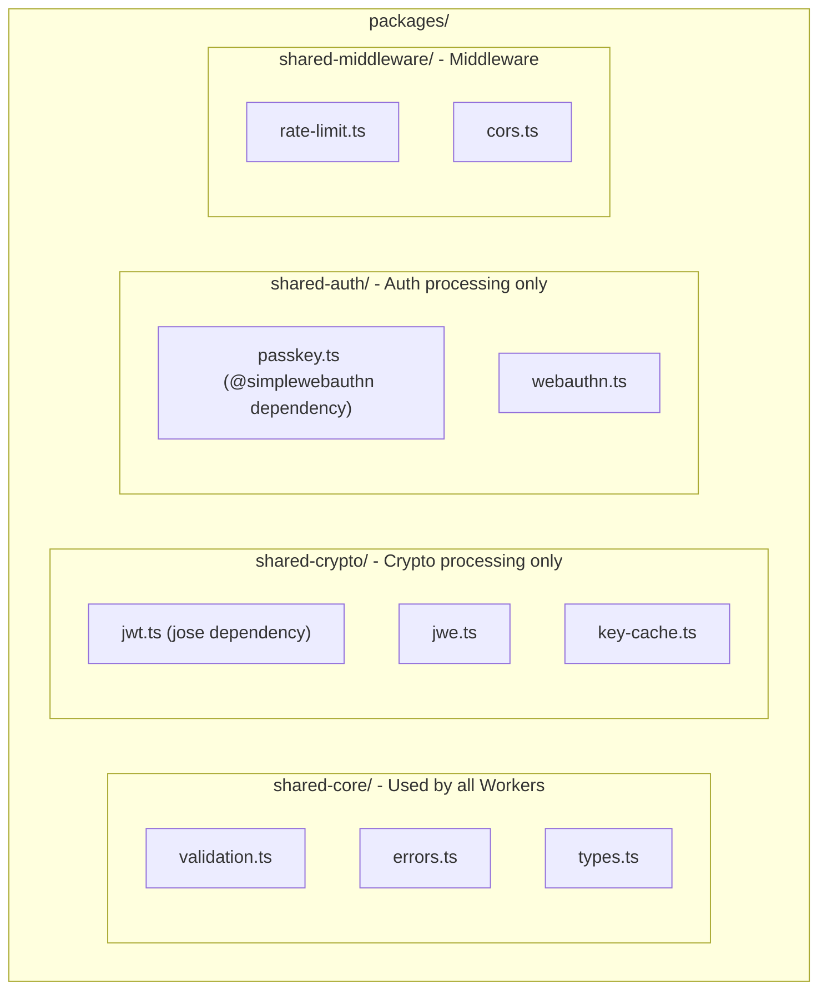
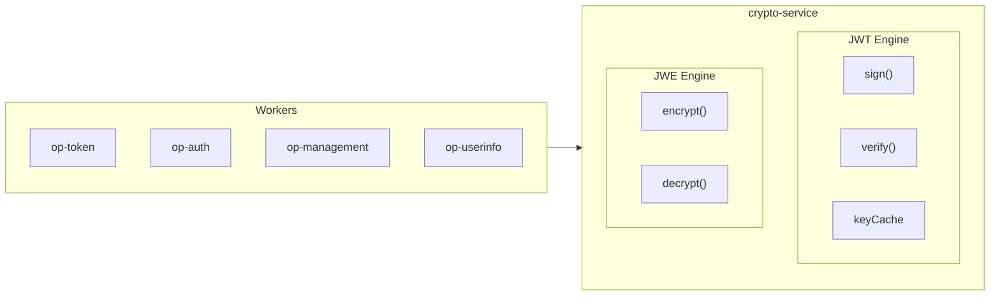
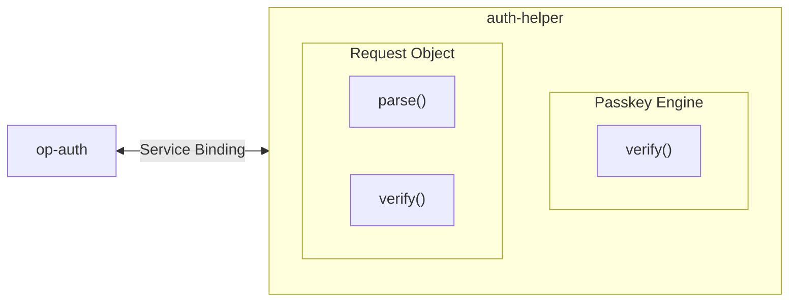

# Worker Splitting Strategy - Authrim

## Overview

This document examines the Worker splitting approach to address the issue of some Authrim Workers exceeding the free plan (10ms CPU limit).

---

## Current Challenges

### Workers Exceeding CPU Time

| Worker | Current CPU Time | Main Bottleneck |
|--------|-----------------|-----------------|
| op-token | 14.95ms | JWT signing ×3 (6-9ms) + JWE encryption (15-25ms) |
| op-auth | 20-250ms | Request Object verification (10-20ms) + Passkey verification (15-25ms) + HTTPS fetch (50-200ms) |
| op-management | 20-50ms | JWT verification (10-20ms) + D1 write (5-15ms) |
| op-userinfo | 20-100ms | JWT verification (10-20ms) + JWE encryption (15-25ms) |

### Issues with shared Library

**Current State**: All Workers include unnecessary dependencies

```typescript
// packages/shared/src/index.ts
export * from './utils/jwt';      // jose (~80KB)
export * from './utils/jwe';      // jose dependency
export * from './utils/passkey';  // @simplewebauthn (~120KB)
export * from './middleware/rate-limit';
// ... all Workers load everything
```

**Impact**:
- op-discovery: Includes jose (+80KB) but doesn't use signing
- router: Includes all dependencies (+200KB) but doesn't use crypto
- Increased cold start time

---

## Solution Comparison

### Approach 1: Split shared Library (Recommended)

**Difficulty**: Low
**Implementation Period**: 1-2 days
**Effect**: Medium (10-15% bundle size reduction)



**Usage in Each Worker**:

```typescript
// op-discovery: core only
import { validateClientId } from '@authrim/shared-core';
// jose, @simplewebauthn not included

// op-token: core + crypto
import { validateClientId } from '@authrim/shared-core';
import { signJWT, encryptJWE } from '@authrim/shared-crypto';
// @simplewebauthn not included

// op-auth: core + auth + crypto
import { validateClientId } from '@authrim/shared-core';
import { verifyPasskey } from '@authrim/shared-auth';
import { verifyJWT } from '@authrim/shared-crypto';
```

**Expected Benefits**:
- op-discovery: 200KB reduction → Improved cold start
- op-token: 120KB reduction
- All Workers: Average 15% bundle size reduction

---

### Approach 2: Create crypto-service Worker

**Difficulty**: Medium
**Implementation Period**: 1 week
**Effect**: High (30-50% CPU time reduction, but increased latency)

#### Architecture



#### Implementation Proposal

##### crypto-service Worker

```typescript
// packages/crypto-service/src/index.ts

import { Hono } from 'hono';
import type { Env } from '@authrim/shared-core';
import { JWTEngine } from './jwt-engine';
import { JWEEngine } from './jwe-engine';

const app = new Hono<{ Bindings: Env }>();

// JWT signing
app.post('/jwt/sign', async (c) => {
  const { payload, kid, expiresIn } = await c.req.json();

  const result = await JWTEngine.sign(c.env, {
    payload,
    kid,
    expiresIn,
  });

  return c.json(result);
});

// JWT verification
app.post('/jwt/verify', async (c) => {
  const { token, expectedIssuer, expectedAudience } = await c.req.json();

  const result = await JWTEngine.verify(c.env, {
    token,
    expectedIssuer,
    expectedAudience,
  });

  return c.json(result);
});

// JWE encryption
app.post('/jwe/encrypt', async (c) => {
  const { payload, clientId, alg, enc } = await c.req.json();

  const result = await JWEEngine.encrypt(c.env, {
    payload,
    clientId,
    alg,
    enc,
  });

  return c.json(result);
});

export default app;
```

##### JWTEngine (with Key Cache Integration)

```typescript
// packages/crypto-service/src/jwt-engine.ts

import { importPKCS8, SignJWT, jwtVerify, importJWK } from 'jose';

// Global cache (shared across all requests)
class KeyCache {
  private static signingKeys = new Map<string, { key: CryptoKey; timestamp: number }>();
  private static verifyingKeys = new Map<string, { key: CryptoKey; timestamp: number }>();
  private static readonly TTL = 60000; // 60 seconds

  static async getSigningKey(
    env: Env,
    kid: string
  ): Promise<CryptoKey> {
    const cached = this.signingKeys.get(kid);
    const now = Date.now();

    if (cached && (now - cached.timestamp) < this.TTL) {
      return cached.key;
    }

    // Retrieve from KeyManager DO
    const keyManagerId = env.KEY_MANAGER.idFromName('default-v3');
    const keyManager = env.KEY_MANAGER.get(keyManagerId);

    const response = await keyManager.fetch('http://dummy/internal/active-with-private', {
      headers: { Authorization: `Bearer ${env.KEY_MANAGER_SECRET}` },
    });

    const { privatePEM } = await response.json();
    const key = await importPKCS8(privatePEM, 'RS256');

    this.signingKeys.set(kid, { key, timestamp: now });
    return key;
  }

  static async getVerifyingKey(
    env: Env,
    kid: string
  ): Promise<CryptoKey> {
    const cached = this.verifyingKeys.get(kid);
    const now = Date.now();

    if (cached && (now - cached.timestamp) < this.TTL) {
      return cached.key;
    }

    // Retrieve public key from KeyManager DO
    const keyManagerId = env.KEY_MANAGER.idFromName('default-v3');
    const keyManager = env.KEY_MANAGER.get(keyManagerId);

    const response = await keyManager.fetch('http://internal/jwks');
    const { keys } = await response.json();

    const jwk = keys.find((k: any) => k.kid === kid);
    if (!jwk) throw new Error('Key not found');

    const key = await importJWK(jwk, 'RS256');

    this.verifyingKeys.set(kid, { key, timestamp: now });
    return key;
  }
}

export class JWTEngine {
  static async sign(
    env: Env,
    options: {
      payload: Record<string, any>;
      kid: string;
      expiresIn: number;
    }
  ): Promise<{ token: string; jti: string }> {
    const key = await KeyCache.getSigningKey(env, options.kid);
    const jti = crypto.randomUUID();

    const token = await new SignJWT(options.payload)
      .setProtectedHeader({ alg: 'RS256', kid: options.kid })
      .setJti(jti)
      .setIssuedAt()
      .setExpirationTime(Math.floor(Date.now() / 1000) + options.expiresIn)
      .sign(key);

    return { token, jti };
  }

  static async verify(
    env: Env,
    options: {
      token: string;
      expectedIssuer: string;
      expectedAudience: string;
    }
  ): Promise<{ payload: any; kid: string }> {
    // Get kid
    const header = JSON.parse(
      atob(options.token.split('.')[0].replace(/-/g, '+').replace(/_/g, '/'))
    );
    const kid = header.kid;

    const key = await KeyCache.getVerifyingKey(env, kid);

    const { payload } = await jwtVerify(options.token, key, {
      issuer: options.expectedIssuer,
      audience: options.expectedAudience,
    });

    return { payload, kid };
  }
}
```

##### Caller Side (op-token)

```typescript
// packages/op-token/src/token.ts

async function createAccessToken(
  c: Context<{ Bindings: Env }>,
  claims: any,
  expiresIn: number
): Promise<{ token: string; jti: string }> {
  // Call crypto-service Worker
  const response = await c.env.CRYPTO_SERVICE.fetch('http://crypto/jwt/sign', {
    method: 'POST',
    headers: { 'Content-Type': 'application/json' },
    body: JSON.stringify({
      payload: claims,
      kid: 'default-v3', // or dynamically retrieve
      expiresIn,
    }),
  });

  return await response.json();
}
```

#### Performance Analysis

**For op-token**:

| Processing | Current | After crypto-service split |
|-----------|---------|---------------------------|
| Access Token signing | 10ms (in op-token) | 2ms (call) + 8ms (crypto-service) |
| ID Token signing | 10ms (in op-token) | 2ms (call) + 8ms (crypto-service) |
| Refresh Token signing | 10ms (in op-token) | 2ms (call) + 8ms (crypto-service) |
| **Total** | **30ms** | **6ms (op-token)** + **24ms (crypto-service)** |

**Important Considerations**:
- op-token itself becomes under 10ms
- crypto-service is 24ms but can process multiple requests in parallel
- Service Binding call overhead: approximately 1-2ms per call

#### Benefits

1. **Distributed CPU Time**: Each Worker stays within 10ms limit
2. **Centralized Cache Management**: Signing keys managed in one place
3. **Bundle Size Reduction**: jose library included in only one Worker
4. **Scalability**: Crypto processing can be scaled independently

#### Drawbacks

1. **Increased Latency**: Service Binding calls (1-2ms × number of calls)
2. **Increased Complexity**:
   - Error handling becomes complex
   - Tracing/monitoring is difficult
   - Debugging is harder
3. **Operational Cost**: More Workers to manage
4. **Transaction Difficulty**: Transactions across Workers are difficult

---

### Approach 3: Create auth-helper Worker

**Difficulty**: Medium
**Implementation Period**: 1 week
**Effect**: Medium (30-40% CPU time reduction for op-auth)

#### Architecture



#### Implementation Proposal

```typescript
// packages/auth-helper/src/index.ts

import { Hono } from 'hono';
import { verifyAuthenticationResponse } from '@simplewebauthn/server';

const app = new Hono<{ Bindings: Env }>();

// Passkey verification
app.post('/passkey/verify', async (c) => {
  const { credential, expectedChallenge, origin, rpID, authenticator } = await c.req.json();

  const verification = await verifyAuthenticationResponse({
    response: credential,
    expectedChallenge,
    expectedOrigin: origin,
    expectedRPID: rpID,
    authenticator,
  });

  return c.json(verification);
});

// Request Object verification
app.post('/request-object/verify', async (c) => {
  const { requestObject, clientMetadata } = await c.req.json();

  // JWT verification logic
  const result = await verifyRequestObject(requestObject, clientMetadata);

  return c.json(result);
});

export default app;
```

---

## Recommended Implementation Roadmap

### Phase 1: Split shared Library (Implement Immediately)

**Period**: 1-2 days
**Priority**: Highest

**Tasks**:
1. Split into shared-core, shared-crypto, shared-auth
2. Import only required packages in each Worker
3. Measure bundle sizes

**Expected Benefits**:
- Bundle size: 10-15% reduction
- Cold start: 5-10% improvement
- CPU time: 1-2ms reduction (due to reduced bundle parsing time)

### Phase 2: Implement Key Cache (op-token, op-userinfo)

**Period**: 2-3 days
**Priority**: High

**Tasks**:
1. Implement signing key cache in op-token
2. Implement signing key cache in op-userinfo
3. Performance testing

**Expected Benefits**:
- op-token: 14.95ms → 9-10ms
- op-userinfo: 20-60ms → 12-35ms

### Phase 3: Performance Measurement & Decision

**Period**: 1 week
**Priority**: High

**Tasks**:
1. Measure Phase 1-2 effects in production environment
2. Verify if each Worker stays within 10ms limit
3. Decide on Worker splitting necessity

**Decision Criteria**:
- All Workers under 10ms → Worker splitting not needed
- Some Workers 10-15ms → Consider crypto-service
- Multiple Workers over 15ms → Implement crypto-service

### Phase 4: Implement crypto-service Worker (Conditional)

**Period**: 1-2 weeks
**Priority**: Medium (depending on Phase 3 results)

**Tasks**:
1. Implement crypto-service Worker
2. Configure Service Bindings
3. Modify op-token, op-auth, op-management, op-userinfo
4. Performance testing
5. Gradual rollout

**Expected Benefits**:
- All Workers stay within 10ms limit
- However, end-to-end latency increases by +2-5ms

---

## Performance Comparison (Summary)

### Scenario 1: op-token (Authorization Code Grant)

| Approach | op-token CPU | crypto-service CPU | Total Latency |
|----------|-------------|-------------------|---------------|
| Current | 14.95ms | - | 14.95ms |
| Phase 1-2 | 9-10ms | - | 9-10ms |
| crypto-service | 4-6ms | 20-24ms | 9-10ms (+1-2ms) |

### Scenario 2: op-auth (Passkey Authentication)

| Approach | op-auth CPU | auth-helper CPU | Total Latency |
|----------|------------|----------------|---------------|
| Current | 35-60ms | - | 35-60ms |
| Phase 1-2 | 25-45ms | - | 25-45ms |
| auth-helper | 10-20ms | 20-30ms | 25-45ms (+2-5ms) |

---

## Conclusions and Recommendations

### Recommended Approach

**1. Implement Immediately: Split shared Library**
- Risk: Low
- Effect: Medium
- Cost: Low

**2. Implement Next: Key Cache Implementation**
- Risk: Low
- Effect: High
- Cost: Low

**3. Conditional Implementation: crypto-service Worker**
- Condition: Only if Phase 1-2 is insufficient
- Risk: Medium
- Effect: High
- Cost: Medium

### Decision Criteria

**Cases Where crypto-service Worker Should Be Implemented**:
1. After Phase 1-2, op-token is still 12ms or more
2. Traffic is increasing and paid plan is being considered
3. Microservices architecture migration is planned
4. Want to scale crypto processing independently

**Cases Where crypto-service Worker Should NOT Be Implemented**:
1. All Workers are within 10ms after Phase 1-2
2. Want to minimize end-to-end latency
3. Want to maintain simple architecture
4. Want to minimize operational costs

### Next Steps

1. **Start Phase 1 Immediately**: Split shared library
2. **Implement Phase 2 in Parallel**: Key cache implementation
3. **Decide After 1 Week**: Evaluate crypto-service Worker necessity
4. **Implement Phase 4 If Needed**: crypto-service Worker implementation

---

## Appendix: Service Bindings vs Durable Objects

### Service Bindings (Recommended)

**Benefits**:
- Low latency (<1ms)
- Simple implementation
- Direct Worker-to-Worker communication

**Drawbacks**:
- Stateless (cannot hold state)

### Durable Objects

**Benefits**:
- Stateful (can hold cache)
- Transaction guarantees

**Drawbacks**:
- Slightly higher latency (1-3ms)
- Complex implementation

### Recommendation

Use **Service Bindings** for crypto-service:
- Manage cache in Worker memory
- Stateless design
- Prioritize low latency
