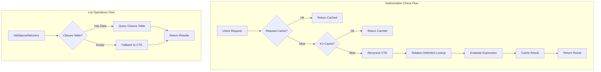

# Phase 3: ReBAC + RBAC + ABAC 実装ドキュメント

## 概要

Phase 3では、Zanzibar-liteスタイルのRelationship-Based Access Control (ReBAC)を実装しました。
これにより、既存のRBAC（Role-Based Access Control）に加えて、より柔軟なリレーションシップベースの権限管理が可能になります。

## アーキテクチャ



## 実装コンポーネント

### 1. データベースマイグレーション

#### Migration 017: relationship_closure テーブル
- **目的**: `listObjects` / `listUsers` クエリの高速化
- **テーブル**: `relationship_closure`
- **特徴**: 事前計算されたトランジティブリレーションシップを格納

```sql
CREATE TABLE relationship_closure (
  id TEXT PRIMARY KEY,
  tenant_id TEXT NOT NULL,
  ancestor_type TEXT NOT NULL,
  ancestor_id TEXT NOT NULL,
  descendant_type TEXT NOT NULL,
  descendant_id TEXT NOT NULL,
  relation TEXT NOT NULL,
  depth INTEGER NOT NULL DEFAULT 0,
  path_json TEXT,
  effective_permission TEXT,
  created_at INTEGER NOT NULL,
  updated_at INTEGER NOT NULL
);
```

#### Migration 018: relation_definitions テーブル
- **目的**: Relation DSL（union, tuple-to-userset）の定義を格納
- **テーブル**: `relation_definitions`

```sql
CREATE TABLE relation_definitions (
  id TEXT PRIMARY KEY,
  tenant_id TEXT NOT NULL,
  object_type TEXT NOT NULL,
  relation_name TEXT NOT NULL,
  definition_json TEXT NOT NULL,
  description TEXT,
  priority INTEGER NOT NULL DEFAULT 0,
  is_active INTEGER NOT NULL DEFAULT 1
);
```

#### Migration 019: VC/DID抽象化レイヤー
- **目的**: 将来のVC/DIDサポートのための基盤
- **テーブル**:
  - `subject_identifiers`: ユーザー識別子の抽象化
  - `verified_attributes`: 検証済み属性（空、将来のVC claims用）
- **変更**: `relationships`テーブルに`evidence_type`、`evidence_ref`カラム追加

### 2. ReBAC サービス

#### 主要インターフェース

```typescript
interface IReBACService {
  // 認可チェック
  check(request: CheckRequest): Promise<CheckResponse>;
  batchCheck(request: BatchCheckRequest): Promise<BatchCheckResponse>;

  // リスト操作
  listObjects(request: ListObjectsRequest): Promise<ListObjectsResponse>;
  listUsers(request: ListUsersRequest): Promise<ListUsersResponse>;

  // キャッシュ管理
  invalidateCache(tenantId, objectType, objectId, relation?): Promise<void>;
  invalidateUserCache(tenantId, userId): Promise<void>;
}
```

#### check() の解決順序

1. **Request-scoped Cache**: 同一リクエスト内の重複クエリ防止
2. **KV Cache**: TTL 60秒のキャッシュ
3. **Recursive CTE**: D1データベースでの再帰クエリ

```typescript
// 使用例
const result = await rebacService.check({
  tenant_id: 'tenant_123',
  user_id: 'user_456',
  relation: 'viewer',
  object: 'document:doc_789',
});
// { allowed: true, resolved_via: 'computed' }
```

### 3. Relation DSL

Phase 3では以下の式タイプをサポート:

#### Direct Relation
直接のリレーションシップタプルをマッチ

```json
{
  "type": "direct",
  "relation": "viewer"
}
```

#### Union Relation
複数の式のOR

```json
{
  "type": "union",
  "children": [
    { "type": "direct", "relation": "owner" },
    { "type": "direct", "relation": "editor" },
    { "type": "direct", "relation": "viewer" }
  ]
}
```

#### Tuple-to-Userset
関連オブジェクトからの継承

```json
{
  "type": "tuple_to_userset",
  "tupleset": { "relation": "parent" },
  "computed_userset": { "relation": "viewer" }
}
```

### 4. Closure Manager

`listObjects` / `listUsers` クエリ用の事前計算テーブルを管理

```typescript
// ユーザーがアクセスできるオブジェクト一覧
const { objectIds } = await closureManager.getObjectsForUser(
  'tenant_123',
  'user_456',
  'viewer',
  'document'
);

// オブジェクトにアクセスできるユーザー一覧
const { userIds } = await closureManager.getUsersForObject(
  'tenant_123',
  'document',
  'doc_789',
  'viewer'
);
```

### 5. KV Cache Manager

KVベースのキャッシュ管理（TTL: 60秒）

```typescript
// キャッシュキー形式
// rebac:check:{tenant_id}:{user_id}:{relation}:{object_type}:{object_id}

// キャッシュ無効化
await cacheManager.invalidateObject('tenant_123', 'document', 'doc_789');
await cacheManager.invalidateUser('tenant_123', 'user_456');
```

### 6. ABAC拡張（Policy Engine）

Policy Engineに属性ベースの条件を追加:

```typescript
// 新しい条件タイプ
type ConditionType =
  | 'attribute_equals'   // 属性値の一致
  | 'attribute_exists'   // 属性の存在
  | 'attribute_in';      // 属性値がリストに含まれる

// 検証済み属性
interface VerifiedAttribute {
  name: string;
  value: string | null;
  source: string;       // 'manual' | 'vc' | 'external'
  issuer?: string;      // VC発行者（将来用）
  expiresAt?: number;   // 有効期限
}
```

## ファイル構成

```
packages/shared/src/rebac/
├── types.ts           # 型定義
├── interfaces.ts      # インターフェース定義
├── cache-manager.ts   # KVキャッシュ管理
├── relation-parser.ts # Relation DSLパーサー
├── rebac-service.ts   # メインサービス実装
├── closure-manager.ts # Closure Table管理
└── index.ts           # エクスポート

packages/policy-core/src/
├── types.ts           # ABAC型追加
├── engine.ts          # ABAC条件評価追加
└── index.ts           # 新型エクスポート追加

migrations/
├── 017_rebac_closure_table.sql
├── 018_rebac_relation_definitions.sql
└── 019_vc_did_abstraction.sql
```

## 設計上の決定

### check() でClosure Tableを使わない理由

| 観点 | Recursive CTE | Closure Table |
|------|--------------|---------------|
| 鮮度 | 常に最新 | 遅延あり |
| 書き込みコスト | なし | 関係変更時に再計算 |
| 読み取りコスト | 中程度 | 低い |
| 柔軟性 | 高い | 中程度 |

**結論**: `check()` はリアルタイム性が重要なため、Recursive CTE + KV Cacheを採用。
`listObjects/listUsers` は大量データのページネーションが必要なため、Closure Tableを採用。

### Allow Only (No Deny) の理由

Phase 3ではDeny効果を実装しない:
- 複雑性の低減
- パフォーマンスの最適化
- MVPとして十分な機能

Deny効果はPhase 4+で`exclusion`式として実装予定。

## テスト結果

- **総テスト数**: 957件
- **成功率**: 100%
- **Typecheck**: 13パッケージすべて成功
- **Lint**: 警告なし
- **Format**: 整形済み

## 使用方法

### ReBACサービスの初期化

```typescript
import {
  ReBACService,
  ClosureManager,
  ReBACCacheManager,
  RelationParser
} from '@authrim/shared';

const cacheManager = new ReBACCacheManager(env.REBAC_CACHE);
const closureManager = new ClosureManager(adapter);
const relationParser = new RelationParser();

const rebacService = new ReBACService(
  adapter,
  cacheManager,
  closureManager,
  relationParser,
  { cache_ttl: 60, max_depth: 5 }
);
```

### 認可チェック

```typescript
// 単一チェック
const result = await rebacService.check({
  tenant_id: 'tenant_123',
  user_id: 'user_456',
  relation: 'viewer',
  object: 'document:doc_789',
});

if (result.allowed) {
  // アクセス許可
}

// バッチチェック
const batchResult = await rebacService.batchCheck({
  checks: [
    { tenant_id: 't1', user_id: 'u1', relation: 'viewer', object: 'doc:d1' },
    { tenant_id: 't1', user_id: 'u1', relation: 'editor', object: 'doc:d2' },
  ]
});
```

### リスト操作

```typescript
// ユーザーがアクセスできるドキュメント一覧
const { object_ids, next_cursor } = await rebacService.listObjects({
  tenant_id: 'tenant_123',
  user_id: 'user_456',
  relation: 'viewer',
  object_type: 'document',
  limit: 100,
});

// ドキュメントにアクセスできるユーザー一覧
const { user_ids } = await rebacService.listUsers({
  tenant_id: 'tenant_123',
  object: 'document:doc_789',
  relation: 'viewer',
});
```

## 注意事項

1. **マイグレーション適用**: 本番環境へのデプロイ前に、マイグレーション017〜019を適用してください
2. **KV Namespace**: `REBAC_CACHE` という名前のKV Namespaceを作成・バインドしてください
3. **Closure Table更新**: 関係が変更された際は、`closureManager.recomputeForObject/User()` を呼び出してください
