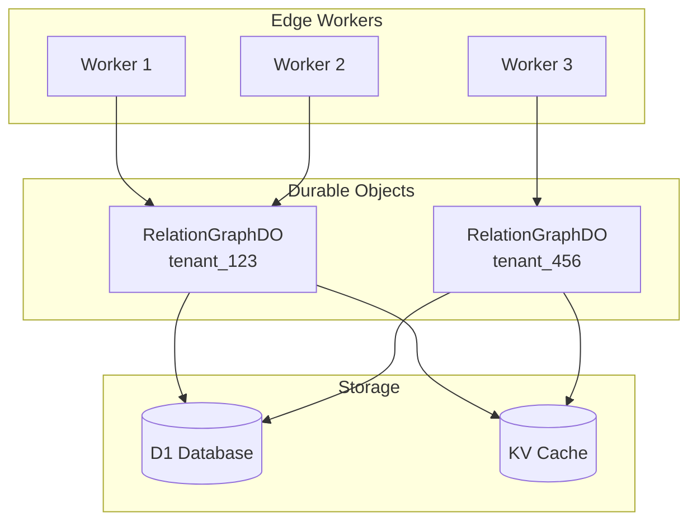
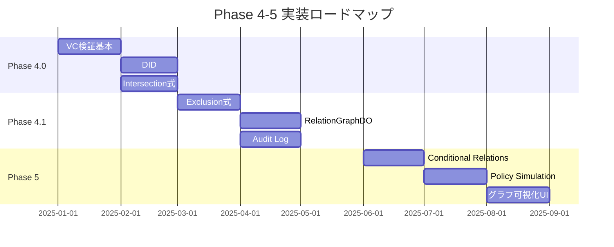

# Phase 4+ ロードマップ

## 概要

Phase 3でReBAC + RBAC + ABACの基盤が完成しました。このドキュメントでは、Phase 4以降で予定されている機能拡張について説明します。

## Phase 4: VC/DID統合 & 高度なReBAC

### 4.1 Verifiable Credentials (VC) サポート

#### 目標
- W3C Verifiable Credentials標準に準拠したクレーム検証
- VCから検証済み属性への自動マッピング
- 発行者（Issuer）の信頼チェーン管理

#### 実装予定

```typescript
// VCを検証して属性を抽出
interface VCVerificationResult {
  valid: boolean;
  claims: Record<string, unknown>;
  issuer: string;
  expiresAt?: number;
}

// verified_attributesテーブルにVC由来の属性を格納
interface VerifiedAttribute {
  name: string;
  value: string;
  source: 'vc';           // VC由来
  issuer: string;         // VC発行者DID
  credential_id: string;  // 元のVCへの参照
  expiresAt: number;
}
```

#### データベース拡張

```sql
-- VC検証結果を格納
CREATE TABLE verified_credentials (
  id TEXT PRIMARY KEY,
  tenant_id TEXT NOT NULL,
  subject_id TEXT NOT NULL,
  credential_type TEXT NOT NULL,
  issuer_did TEXT NOT NULL,
  credential_json TEXT NOT NULL,
  verified_at INTEGER NOT NULL,
  expires_at INTEGER,
  revocation_status TEXT DEFAULT 'valid'
);

-- 信頼できる発行者リスト
CREATE TABLE trusted_issuers (
  id TEXT PRIMARY KEY,
  tenant_id TEXT NOT NULL,
  issuer_did TEXT NOT NULL,
  issuer_name TEXT,
  public_key_jwk TEXT,
  trusted_credential_types TEXT, -- JSON array
  is_active INTEGER DEFAULT 1
);
```

### 4.2 Decentralized Identifier (DID) サポート

#### 目標
- DID:web, DID:key メソッドのサポート
- DID Document解決
- subject_identifiersテーブルへのDID統合

#### 実装予定

```typescript
// DID解決
interface DIDResolver {
  resolve(did: string): Promise<DIDDocument>;
  verify(did: string, signature: string, data: string): Promise<boolean>;
}

// サポートするDIDメソッド
type SupportedDIDMethod = 'did:web' | 'did:key';

// subject_identifiersの拡張
interface SubjectIdentifier {
  identifier: string;      // email, DID, etc.
  identifier_type: 'email' | 'did:web' | 'did:key' | 'external_id';
  did_document_json?: string;
  verification_method?: string;
}
```

### 4.3 Relation DSL拡張

#### Intersection（AND）

```json
{
  "type": "intersection",
  "children": [
    { "type": "direct", "relation": "member" },
    { "type": "attribute_equals", "name": "clearance", "value": "top_secret" }
  ]
}
```

#### Exclusion（NOT / Deny）

```json
{
  "type": "exclusion",
  "base": {
    "type": "union",
    "children": [
      { "type": "direct", "relation": "viewer" },
      { "type": "direct", "relation": "editor" }
    ]
  },
  "subtract": {
    "type": "direct",
    "relation": "blocked"
  }
}
```

### 4.4 RelationGraphDO（Durable Object）

#### 目標
- グローバル分散でのリレーションシップグラフ管理
- 強い整合性を必要とする操作の最適化
- リアルタイム権限変更通知

#### アーキテクチャ



#### 実装予定

```typescript
// RelationGraphDO
export class RelationGraphDO implements DurableObject {
  // グラフデータ（メモリ内）
  private graph: Map<string, Set<string>>;

  // リレーションシップ追加（強い整合性）
  async addRelationship(from: string, to: string, relation: string): Promise<void>;

  // リレーションシップ削除（強い整合性）
  async removeRelationship(from: string, to: string, relation: string): Promise<void>;

  // パス検索（メモリ内グラフで高速）
  async findPath(from: string, to: string): Promise<string[] | null>;

  // WebSocket通知
  async notify(event: RelationshipChangeEvent): Promise<void>;
}
```

## Phase 5: 高度な機能

### 5.1 Conditional Relations（条件付きリレーション）

```json
{
  "type": "conditional",
  "relation": "viewer",
  "conditions": {
    "time_range": {
      "start": "09:00",
      "end": "18:00",
      "timezone": "Asia/Tokyo"
    },
    "ip_range": ["10.0.0.0/8", "192.168.0.0/16"],
    "device_trust": "high"
  }
}
```

### 5.2 Audit Log & Compliance

```sql
-- 認可決定の監査ログ
CREATE TABLE authorization_audit_log (
  id TEXT PRIMARY KEY,
  tenant_id TEXT NOT NULL,
  timestamp INTEGER NOT NULL,
  user_id TEXT NOT NULL,
  action TEXT NOT NULL,
  resource TEXT NOT NULL,
  decision TEXT NOT NULL, -- 'allow' | 'deny'
  resolved_via TEXT,
  evaluation_time_ms INTEGER,
  context_json TEXT
);
```

### 5.3 Policy Simulation & Testing

```typescript
// ポリシーシミュレーター
interface PolicySimulator {
  // "もし〜だったら"のシミュレーション
  whatIf(scenario: SimulationScenario): Promise<SimulationResult>;

  // ポリシー変更の影響分析
  analyzeImpact(proposedChange: PolicyChange): Promise<ImpactAnalysis>;

  // ポリシーテスト実行
  runTests(testSuite: PolicyTestSuite): Promise<TestResults>;
}
```

### 5.4 グラフ可視化UI

- リレーションシップグラフのインタラクティブ表示
- 権限パスのハイライト
- ポリシーシミュレーション結果の可視化

## 実装優先順位

### 高優先度（Phase 4.0）
1. ✅ ReBAC基盤（完了）
2. VC検証の基本実装
3. DID:webサポート
4. Intersection式のサポート

### 中優先度（Phase 4.1）
1. Exclusion式（Deny効果）
2. RelationGraphDO
3. Audit Log基盤
4. DID:keyサポート

### 低優先度（Phase 5）
1. Conditional Relations
2. Policy Simulation
3. グラフ可視化UI
4. コンプライアンスレポート

## マイルストーン



## 技術的考慮事項

### パフォーマンス

| 機能 | 目標レイテンシ | 戦略 |
|------|--------------|------|
| check() | < 10ms (p99) | KV Cache + Recursive CTE |
| listObjects | < 50ms (p99) | Closure Table + Pagination |
| VC検証 | < 100ms | 事前検証 + キャッシュ |
| DID解決 | < 200ms | DNS/HTTP キャッシュ |

### セキュリティ

- VC署名検証の厳格化
- 発行者信頼チェーンの管理
- 失効（Revocation）チェック
- 監査ログの改ざん防止

### スケーラビリティ

- テナントごとのRelationGraphDO分離
- Closure Table更新の非同期化
- KV Cacheのリージョン分散

## 移行ガイド

### Phase 3 → Phase 4への移行

1. **データベースマイグレーション**
   - 新テーブル追加（verified_credentials, trusted_issuers）
   - 既存データは影響なし

2. **API互換性**
   - 既存APIは維持
   - 新機能は追加エンドポイントで提供

3. **設定変更**
   - VC検証を有効化する環境変数追加
   - 信頼できる発行者の登録

## 参考資料

- [Google Zanzibar Paper](https://research.google/pubs/pub48190/)
- [W3C Verifiable Credentials](https://www.w3.org/TR/vc-data-model/)
- [W3C Decentralized Identifiers](https://www.w3.org/TR/did-core/)
- [OpenFGA](https://openfga.dev/) - Zanzibar OSS実装
- [SpiceDB](https://authzed.com/spicedb) - Zanzibar OSS実装
