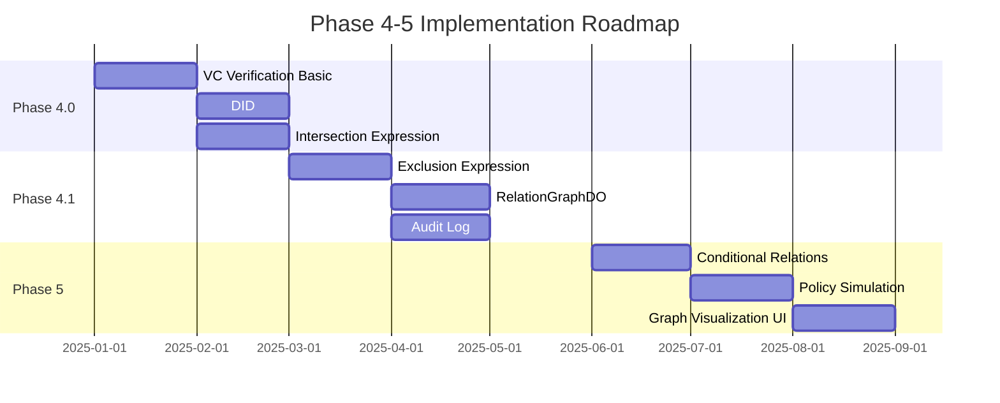

# Phase 4+ Roadmap

## Overview

With Phase 3, the foundation for ReBAC + RBAC + ABAC is complete. This document describes the feature extensions planned for Phase 4 and beyond.

## Phase 4: VC/DID Integration & Advanced ReBAC

### 4.1 Verifiable Credentials (VC) Support

#### Goals
- Claims verification compliant with W3C Verifiable Credentials standard
- Automatic mapping from VC to verified attributes
- Issuer trust chain management

#### Planned Implementation

```typescript
// Verify VC and extract attributes
interface VCVerificationResult {
  valid: boolean;
  claims: Record<string, unknown>;
  issuer: string;
  expiresAt?: number;
}

// Store VC-derived attributes in verified_attributes table
interface VerifiedAttribute {
  name: string;
  value: string;
  source: 'vc';           // VC-derived
  issuer: string;         // VC issuer DID
  credential_id: string;  // Reference to original VC
  expiresAt: number;
}
```

#### Database Extensions

```sql
-- Store VC verification results
CREATE TABLE verified_credentials (
  id TEXT PRIMARY KEY,
  tenant_id TEXT NOT NULL,
  subject_id TEXT NOT NULL,
  credential_type TEXT NOT NULL,
  issuer_did TEXT NOT NULL,
  credential_json TEXT NOT NULL,
  verified_at INTEGER NOT NULL,
  expires_at INTEGER,
  revocation_status TEXT DEFAULT 'valid'
);

-- Trusted issuer list
CREATE TABLE trusted_issuers (
  id TEXT PRIMARY KEY,
  tenant_id TEXT NOT NULL,
  issuer_did TEXT NOT NULL,
  issuer_name TEXT,
  public_key_jwk TEXT,
  trusted_credential_types TEXT, -- JSON array
  is_active INTEGER DEFAULT 1
);
```

### 4.2 Decentralized Identifier (DID) Support

#### Goals
- Support for DID:web, DID:key methods
- DID Document resolution
- DID integration with subject_identifiers table

#### Planned Implementation

```typescript
// DID resolution
interface DIDResolver {
  resolve(did: string): Promise<DIDDocument>;
  verify(did: string, signature: string, data: string): Promise<boolean>;
}

// Supported DID methods
type SupportedDIDMethod = 'did:web' | 'did:key';

// Extension of subject_identifiers
interface SubjectIdentifier {
  identifier: string;      // email, DID, etc.
  identifier_type: 'email' | 'did:web' | 'did:key' | 'external_id';
  did_document_json?: string;
  verification_method?: string;
}
```

### 4.3 Relation DSL Extensions

#### Intersection (AND)

```json
{
  "type": "intersection",
  "children": [
    { "type": "direct", "relation": "member" },
    { "type": "attribute_equals", "name": "clearance", "value": "top_secret" }
  ]
}
```

#### Exclusion (NOT / Deny)

```json
{
  "type": "exclusion",
  "base": {
    "type": "union",
    "children": [
      { "type": "direct", "relation": "viewer" },
      { "type": "direct", "relation": "editor" }
    ]
  },
  "subtract": {
    "type": "direct",
    "relation": "blocked"
  }
}
```

### 4.4 RelationGraphDO (Durable Object)

#### Goals
- Global distributed relationship graph management
- Optimization of operations requiring strong consistency
- Real-time permission change notifications

#### Architecture


#### Planned Implementation

```typescript
// RelationGraphDO
export class RelationGraphDO implements DurableObject {
  // Graph data (in-memory)
  private graph: Map<string, Set<string>>;

  // Add relationship (strong consistency)
  async addRelationship(from: string, to: string, relation: string): Promise<void>;

  // Remove relationship (strong consistency)
  async removeRelationship(from: string, to: string, relation: string): Promise<void>;

  // Path search (fast with in-memory graph)
  async findPath(from: string, to: string): Promise<string[] | null>;

  // WebSocket notifications
  async notify(event: RelationshipChangeEvent): Promise<void>;
}
```

## Phase 5: Advanced Features

### 5.1 Conditional Relations

```json
{
  "type": "conditional",
  "relation": "viewer",
  "conditions": {
    "time_range": {
      "start": "09:00",
      "end": "18:00",
      "timezone": "Asia/Tokyo"
    },
    "ip_range": ["10.0.0.0/8", "192.168.0.0/16"],
    "device_trust": "high"
  }
}
```

### 5.2 Audit Log & Compliance

```sql
-- Authorization decision audit log
CREATE TABLE authorization_audit_log (
  id TEXT PRIMARY KEY,
  tenant_id TEXT NOT NULL,
  timestamp INTEGER NOT NULL,
  user_id TEXT NOT NULL,
  action TEXT NOT NULL,
  resource TEXT NOT NULL,
  decision TEXT NOT NULL, -- 'allow' | 'deny'
  resolved_via TEXT,
  evaluation_time_ms INTEGER,
  context_json TEXT
);
```

### 5.3 Policy Simulation & Testing

```typescript
// Policy simulator
interface PolicySimulator {
  // "What if" simulation
  whatIf(scenario: SimulationScenario): Promise<SimulationResult>;

  // Impact analysis of policy changes
  analyzeImpact(proposedChange: PolicyChange): Promise<ImpactAnalysis>;

  // Run policy tests
  runTests(testSuite: PolicyTestSuite): Promise<TestResults>;
}
```

### 5.4 Graph Visualization UI

- Interactive display of relationship graphs
- Permission path highlighting
- Policy simulation result visualization

## Implementation Priority

### High Priority (Phase 4.0)
1. ReBAC foundation (completed)
2. Basic VC verification implementation
3. DID:web support
4. Intersection expression support

### Medium Priority (Phase 4.1)
1. Exclusion expression (Deny effect)
2. RelationGraphDO
3. Audit Log foundation
4. DID:key support

### Low Priority (Phase 5)
1. Conditional Relations
2. Policy Simulation
3. Graph visualization UI
4. Compliance reports

## Milestones



## Technical Considerations

### Performance

| Feature | Target Latency | Strategy |
|---------|---------------|----------|
| check() | < 10ms (p99) | KV Cache + Recursive CTE |
| listObjects | < 50ms (p99) | Closure Table + Pagination |
| VC Verification | < 100ms | Pre-verification + Cache |
| DID Resolution | < 200ms | DNS/HTTP Cache |

### Security

- Strict VC signature verification
- Issuer trust chain management
- Revocation checks
- Audit log tampering prevention

### Scalability

- Tenant-based RelationGraphDO isolation
- Asynchronous Closure Table updates
- Regional distribution of KV Cache

## Migration Guide

### Phase 3 → Phase 4 Migration

1. **Database Migration**
   - Add new tables (verified_credentials, trusted_issuers)
   - Existing data is not affected

2. **API Compatibility**
   - Existing APIs are maintained
   - New features provided via additional endpoints

3. **Configuration Changes**
   - Add environment variables to enable VC verification
   - Register trusted issuers

## References

- [Google Zanzibar Paper](https://research.google/pubs/pub48190/)
- [W3C Verifiable Credentials](https://www.w3.org/TR/vc-data-model/)
- [W3C Decentralized Identifiers](https://www.w3.org/TR/did-core/)
- [OpenFGA](https://openfga.dev/) - Zanzibar OSS Implementation
- [SpiceDB](https://authzed.com/spicedb) - Zanzibar OSS Implementation
