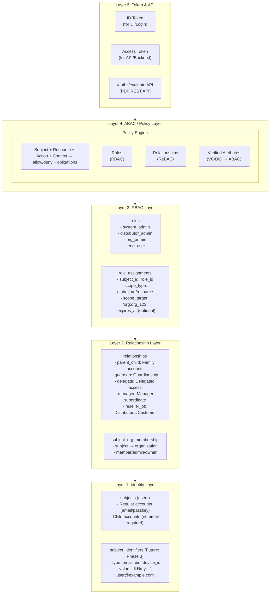
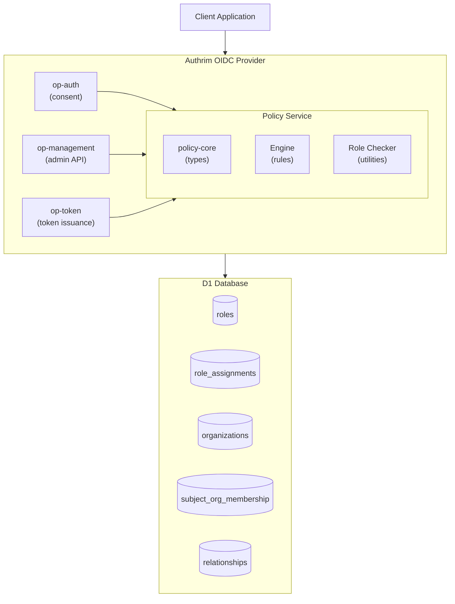
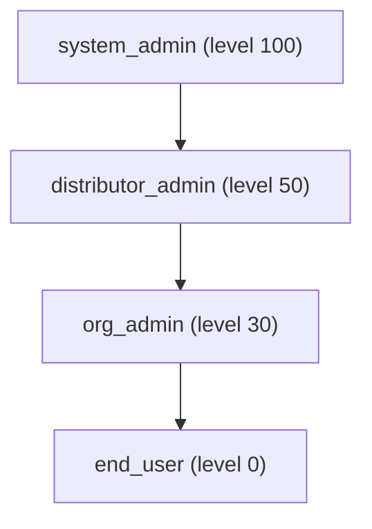

# RBAC/ABAC Implementation Plan

**Last Updated**: 2025-12-01
**Status**: Phase 1 Complete (incl. ReBAC endpoints), Phase 2 Planned
**Owner**: Authrim Team

---

## Overview

This document outlines the comprehensive implementation plan for Role-Based Access Control (RBAC) and Attribute-Based Access Control (ABAC) in Authrim OIDC Provider.

### Design Philosophy

Clearly separate Authrim's responsibilities:

1. **As OP**: What to include in tokens (Claims issuance)
2. **As EIAM/CIAM**: Who can do what to whom (Access control)

> **Foundation is modeled with RBAC (roles) + Relationship (relationships),**
> **ABAC is externalized as a policy engine fed with "roles + relationships + attributes"**
> **VC/DID is treated as a "high-trust attribute source" for that policy**

### Goals

1. **B2B/B2B2C Support**: Enable enterprise customers and distributors to manage their organizations
2. **Parent-Child Accounts**: Family accounts with parental controls
3. **Scoped Roles**: Support global, organization-level, and resource-level role assignments
4. **Relationship-Based Access**: Enable parent-child, guardian, and delegation relationships
5. **Policy Engine**: Centralized policy evaluation for consistent access control
6. **Future ABAC**: Foundation for attribute-based policies with DID/VC support

---

## Conceptual Architecture

### Layer Model



### System Architecture (Current Implementation)



---

## Use Cases

> **Detailed Documentation**: [RBAC_USE_CASES.md](./RBAC_USE_CASES.md)
>
> Detailed use cases (12 RBAC use cases + DID/VC integration use cases) have been moved to the above document.

### Summary

| Category | Use Cases | Status |
|----------|-----------|--------|
| Phase 1 Implemented | B2B2C (Distributor), Parent-Child (Family) | ✅ |
| General RBAC | Enterprise SSO, Multi-tenant SaaS, Healthcare, Education, E-commerce, IoT, Government, Fintech, Media, AI Agent/MCP | 📋 |
| Future Extensions (VC/DID) | Zero-Trust, Medical License VC, Age Verification, KYC VC, Membership VC | 🔮 |

---

## Token Design

### ID Token (for UI/Post-Login Screens)

```json
{
  "iss": "https://auth.example.com",
  "sub": "user_123",
  "aud": "client_abc",
  "exp": 1701388800,
  "iat": 1701385200,
  "name": "John Doe",
  "email": "john@example.com",
  "authrim_roles": [
    { "name": "org_admin", "scope": "org", "scopeTarget": "org:acme_corp" },
    { "name": "end_user", "scope": "global" }
  ],
  "authrim_org_id": "org_acme_corp",
  "authrim_org_name": "ACME Corporation",
  "authrim_orgs": [
    { "id": "org_acme_corp", "name": "ACME Corporation", "type": "enterprise", "is_primary": true }
  ],
  "authrim_relationships_summary": {
    "children_ids": ["user_c1", "user_c2"],
    "parent_ids": []
  }
}
```

### Access Token (for API/Backend)

```json
{
  "iss": "https://auth.example.com",
  "sub": "user_123",
  "aud": "https://api.example.com",
  "exp": 1701388800,
  "iat": 1701385200,
  "scope": "openid profile customer:read",
  "authrim_roles": ["reseller_staff"],
  "authrim_permissions": ["customer:read", "order:view"],
  "authrim_org_context": {
    "acting_as_org_id": "org_reseller1",
    "on_behalf_of_org_id": null
  }
}
```

### Delegation Token (Delegated Access)

```json
{
  "iss": "https://auth.example.com",
  "sub": "user_parent",
  "act": {
    "sub": "user_child"
  },
  "authrim_relationships": [
    { "type": "parent_child", "target": "user_child", "permission": "full" }
  ],
  "authrim_acting_for": {
    "subject_id": "user_child",
    "relationship": "parent_child"
  }
}
```

---

## Authorization API (PDP)

When RP needs fine-grained ABAC that cannot be determined from claims in the token alone:

### POST /authz/evaluate

**Request**:
```http
POST /authz/evaluate
Authorization: Bearer <access_token>
Content-Type: application/json

{
  "action": "user.profile.update",
  "resource": {
    "type": "user",
    "id": "user_xyz",
    "owner_id": "user_xyz"
  }
}
```

**Response**:
```json
{
  "decision": "allow",
  "policy_id": "parent-can-edit-child-profile",
  "reason": "Subject has parent_child relationship with resource owner",
  "obligations": {
    "mask_fields": ["ssn", "medical_info"],
    "audit_required": true
  }
}
```

---

## Phase 1: Foundation (Complete ✅)

### Phase 1-A: Organizations Schema ✅

**Migration**: `009_rbac_phase1_organizations.sql`

**Tables Created**:

| Table | Description |
|-------|-------------|
| `organizations` | Companies, departments, or organizational units |
| `subject_org_membership` | User-to-organization membership with type |

**Key Features**:
- Hierarchical organizations with `parent_org_id`
- Organization types: `distributor`, `enterprise`, `department`
- Plan-based feature gating: `free`, `starter`, `professional`, `enterprise`
- Primary organization tracking via `is_primary` flag

**Schema**:
```sql
CREATE TABLE organizations (
  id TEXT PRIMARY KEY,
  tenant_id TEXT NOT NULL DEFAULT 'default',
  name TEXT NOT NULL,
  display_name TEXT,
  description TEXT,
  org_type TEXT NOT NULL DEFAULT 'enterprise',  -- distributor, enterprise, department
  parent_org_id TEXT REFERENCES organizations(id),
  plan TEXT DEFAULT 'free',  -- free, starter, professional, enterprise
  is_active INTEGER DEFAULT 1,
  metadata_json TEXT,
  created_at INTEGER NOT NULL,
  updated_at INTEGER NOT NULL
);

CREATE TABLE subject_org_membership (
  id TEXT PRIMARY KEY,
  tenant_id TEXT NOT NULL DEFAULT 'default',
  subject_id TEXT NOT NULL REFERENCES users(id) ON DELETE CASCADE,
  org_id TEXT NOT NULL REFERENCES organizations(id) ON DELETE CASCADE,
  membership_type TEXT NOT NULL DEFAULT 'member',  -- member, admin, owner
  is_primary INTEGER DEFAULT 0,
  created_at INTEGER NOT NULL,
  updated_at INTEGER NOT NULL
);
```

---

### Phase 1-B: Role Enhancements ✅

**Migration**: `010_rbac_phase1_role_enhancements.sql`

**Schema Changes**:
```sql
ALTER TABLE roles ADD COLUMN role_type TEXT;       -- system, builtin, custom
ALTER TABLE roles ADD COLUMN hierarchy_level INTEGER; -- 0-100
ALTER TABLE roles ADD COLUMN is_assignable INTEGER;
ALTER TABLE roles ADD COLUMN parent_role_id TEXT;
```

**Default Roles Added**:

| Role | Level | Type | Description |
|------|-------|------|-------------|
| `system_admin` | 100 | system | Full system access |
| `distributor_admin` | 50 | builtin | Manages customer organizations |
| `org_admin` | 30 | builtin | Manages users within organization |
| `end_user` | 0 | builtin | Basic self-management |

---

### Phase 1-C: Scoped Role Assignments ✅

**Migration**: `011_rbac_phase1_role_assignments.sql`

**Table Created**: `role_assignments`

**Scope Types**:

| Scope | Target Format | Example |
|-------|---------------|---------|
| `global` | (empty string) | Tenant-wide admin |
| `org` | `org:org_123` | Organization admin |
| `resource` | `client:client_456` | Client-specific access |

**Schema**:
```sql
CREATE TABLE role_assignments (
  id TEXT PRIMARY KEY,
  tenant_id TEXT NOT NULL DEFAULT 'default',
  subject_id TEXT NOT NULL REFERENCES users(id) ON DELETE CASCADE,
  role_id TEXT NOT NULL REFERENCES roles(id) ON DELETE CASCADE,
  scope_type TEXT NOT NULL DEFAULT 'global',  -- global, org, resource
  scope_target TEXT NOT NULL DEFAULT '',  -- Empty for global, "type:id" format
  expires_at INTEGER,  -- Optional expiration (UNIX seconds)
  assigned_by TEXT,
  metadata_json TEXT,
  created_at INTEGER NOT NULL,
  updated_at INTEGER NOT NULL
);
```

---

### Phase 1-D: Relationships ✅

**Migration**: `012_rbac_phase1_relationships.sql`

**Table Created**: `relationships`

**Relationship Types**:

| Type | Description | Use Case |
|------|-------------|----------|
| `parent_child` | Parent managing child account | Family accounts |
| `guardian` | Legal guardian relationship | Minor protection |
| `delegate` | Delegated access | Assistant access |
| `manager` | Manager-subordinate | Enterprise hierarchy |
| `reseller_of` | Distributor relationship | B2B2C (org-org) |

**Schema**:
```sql
CREATE TABLE relationships (
  id TEXT PRIMARY KEY,
  tenant_id TEXT NOT NULL DEFAULT 'default',
  relationship_type TEXT NOT NULL,
  from_type TEXT NOT NULL DEFAULT 'subject',  -- subject, org
  from_id TEXT NOT NULL,
  to_type TEXT NOT NULL DEFAULT 'subject',
  to_id TEXT NOT NULL,
  permission_level TEXT NOT NULL DEFAULT 'full',  -- full, limited, read_only
  expires_at INTEGER,
  is_bidirectional INTEGER DEFAULT 0,
  metadata_json TEXT,  -- constraints: can_edit_profile, etc.
  created_at INTEGER NOT NULL,
  updated_at INTEGER NOT NULL
);
```

---

### Phase 1-E: Admin API ✅

**Package**: `@authrim/op-management`
**File**: `src/admin-rbac.ts`

#### Organization Management (8 endpoints)

| Method | Endpoint | Description |
|--------|----------|-------------|
| GET | `/api/admin/organizations` | List organizations |
| POST | `/api/admin/organizations` | Create organization |
| GET | `/api/admin/organizations/:id` | Get organization |
| PUT | `/api/admin/organizations/:id` | Update organization |
| DELETE | `/api/admin/organizations/:id` | Delete organization |
| GET | `/api/admin/organizations/:id/members` | List members |
| POST | `/api/admin/organizations/:id/members` | Add member |
| DELETE | `/api/admin/organizations/:id/members/:subjectId` | Remove member |

#### Role Management (5 endpoints)

| Method | Endpoint | Description |
|--------|----------|-------------|
| GET | `/api/admin/roles` | List roles |
| GET | `/api/admin/roles/:id` | Get role details |
| GET | `/api/admin/users/:id/roles` | List user's roles |
| POST | `/api/admin/users/:id/roles` | Assign role |
| DELETE | `/api/admin/users/:id/roles/:assignmentId` | Remove role |

#### Relationship Management (3 endpoints)

| Method | Endpoint | Description |
|--------|----------|-------------|
| GET | `/api/admin/users/:id/relationships` | List relationships |
| POST | `/api/admin/users/:id/relationships` | Create relationship |
| DELETE | `/api/admin/users/:id/relationships/:relationshipId` | Delete relationship |

---

### Phase 1-F: Policy Core & Service ✅

#### @authrim/policy-core

**Package**: `packages/policy-core`

**Components**:

| File | Description |
|------|-------------|
| `types.ts` | Type definitions for policy evaluation |
| `engine.ts` | PolicyEngine class with rule evaluation |
| `role-checker.ts` | Utility functions for role checking |
| `index.ts` | Public exports |

**Key Types**:
```typescript
interface PolicySubject {
  id: string;
  roles: SubjectRole[];
  orgId?: string;
  userType?: string;
  plan?: string;
  relationships?: SubjectRelationship[];
}

interface PolicyContext {
  subject: PolicySubject;
  resource: PolicyResource;
  action: PolicyAction;
  timestamp: number;
}

interface PolicyDecision {
  allowed: boolean;
  reason: string;
  decidedBy: string;
  obligations?: Record<string, unknown>;
}
```

**Condition Evaluators**:
- `has_role` - Check single role with scope
- `has_any_role` - Check any of multiple roles
- `has_all_roles` - Check all of multiple roles
- `is_resource_owner` - Check resource ownership
- `same_organization` - Check org membership
- `has_relationship` - Check subject relationships
- `user_type_is` - Check user type attribute
- `plan_allows` - Check organization plan

#### @authrim/policy-service

**Package**: `packages/policy-service`

**Routes** (Custom Domain):
- `conformance.authrim.com/policy/*`
- `conformance.authrim.com/api/rebac/*`

**Policy Endpoints** (`/policy/*`):

| Method | Endpoint | Description |
|--------|----------|-------------|
| GET | `/policy/health` | Health check |
| POST | `/policy/evaluate` | Full policy evaluation |
| POST | `/policy/check-role` | Quick role check |
| POST | `/policy/check-access` | Simplified access check |
| POST | `/policy/is-admin` | Admin status check |

**ReBAC Endpoints** (`/api/rebac/*`):

| Method | Endpoint | Description |
|--------|----------|-------------|
| GET | `/api/rebac/health` | ReBAC health check |
| POST | `/api/rebac/check` | Relationship check (Zanzibar-style) |

**Authentication**: Bearer token (`POLICY_API_SECRET`)

**Note**: For workers.dev access (via router), the same endpoints are available without the `/policy` prefix (e.g., `/health`, `/evaluate`).

---

## Phase 2: Token Integration (Planned)

### Phase 2-A: JWT Claims Enhancement

**Goal**: Include roles and relationships in ID tokens and access tokens.

**Tasks**:
- [ ] Modify `op-token` to fetch role_assignments for subject
- [ ] Add organization info from subject_org_membership
- [ ] Add relationship info for delegation scenarios
- [ ] Create `authrim_` namespaced claims (OIDC compliant)
- [ ] Add scope-based claim filtering

**Files to Modify**:
- `packages/op-token/src/token.ts`
- `packages/op-token/src/claims.ts` (new)

---

### Phase 2-B: Consent Screen Enhancement

**Goal**: Display organization and role context during authorization.

**Tasks**:
- [ ] Show user's current organization on consent screen
- [ ] Display role-based scope descriptions
- [ ] Add "acting on behalf of" indicator for delegated access
- [ ] Support organization switching during auth

**Files to Modify**:
- `packages/op-auth/src/consent.ts`
- `packages/ui/src/routes/consent/+page.svelte`

---

### Phase 2-C: Authorization Endpoint Enhancement

**Goal**: Support organization context in authorization requests.

**New Parameters**:
- `org_id` - Target organization for the request
- `acting_as` - Subject ID for delegation scenarios

**Tasks**:
- [ ] Parse and validate new authorize parameters
- [ ] Enforce organization-based access control
- [ ] Validate delegation relationships
- [ ] Pass context to consent flow

---

### Phase 2-D: Deprecate Legacy Tables

**Goal**: Complete migration from `user_roles` to `role_assignments`.

**Tasks**:
- [ ] Add sync trigger for backwards compatibility
- [ ] Update all code to use role_assignments
- [ ] Create migration to drop user_roles (optional)

---

## Phase 3: DID/VC Integration (Future)

### Phase 3-A: Subject Identifiers

**Goal**: Support multiple identity sources per subject.

**New Table**: `subject_identifiers`
```sql
CREATE TABLE subject_identifiers (
  id TEXT PRIMARY KEY,
  subject_id TEXT NOT NULL REFERENCES users(id),
  identifier_type TEXT NOT NULL,  -- email, did, device_id
  identifier_value TEXT NOT NULL, -- "did:key:...", "user@example.com"
  is_primary INTEGER DEFAULT 0,
  verified_at INTEGER,
  created_at INTEGER NOT NULL
);
```

**Supported Identifier Types**:
- `email` - Email address
- `did` - Decentralized Identifier (did:key, did:web, etc.)
- `device_id` - Device binding

---

### Phase 3-B: Verified Attributes

**Goal**: Store VC-verified attributes for ABAC policies.

**New Table**: `verified_attributes`
```sql
CREATE TABLE verified_attributes (
  id TEXT PRIMARY KEY,
  subject_id TEXT NOT NULL REFERENCES users(id),
  source TEXT NOT NULL,  -- 'vc', 'kyc_provider', 'manual'
  attribute_name TEXT NOT NULL,  -- 'age_over_18', 'medical_license'
  attribute_value TEXT,  -- JSON value
  issuer TEXT,  -- VC issuer DID
  verified_at INTEGER NOT NULL,
  expires_at INTEGER,
  credential_id TEXT,  -- Reference to original VC
  created_at INTEGER NOT NULL
);
```

**Policy Example with VC**:
```json
{
  "id": "medical-app-only-for-licensed-doctors",
  "effect": "allow",
  "conditions": [
    { "type": "action_is", "params": { "action": "medical.record.read" } },
    { "type": "has_verified_attribute", "params": {
        "name": "medical_license",
        "issuer": "did:web:xxx-med-association.example"
    }}
  ]
}
```

---

### Phase 3-C: OID4VP/SIOP2 Integration

**Goal**: Accept Verifiable Presentations for authentication and attribute verification.

**Features**:
- SIOP2 authentication flow
- OID4VP presentation verification
- Automatic VC → verified_attributes mapping
- Trust registry for accepted issuers

---

## Phase 4: Advanced RBAC Features (Future)

### Phase 4-A: Role Hierarchy & Inheritance

**Goal**: Implement role inheritance for simplified administration.

**Features**:
- Role inheritance via `parent_role_id`
- Automatic permission aggregation
- Hierarchy validation (no cycles)

**Example**:


---

### Phase 4-B: Organization-to-Organization Relationships

**Goal**: Enable B2B2C scenarios with distributor management.

**Features**:
- `reseller_of` relationship between organizations
- Cascading organization hierarchies
- Distributor dashboard and management

---

### Phase 4-C: Custom Role Creation

**Goal**: Allow organizations to define custom roles.

**Features**:
- Admin UI for role management
- Permission template system
- Role cloning and modification

---

## Phase 5: ABAC Policy Engine (Future)

### Phase 5-A: Policy Definition Language

**Goal**: Declarative policy definitions (JSON DSL → Cedar/Rego compatible).

**Example Policy**:
```json
{
  "policies": [
    {
      "id": "enterprise-feature-access",
      "description": "Only enterprise plan can access advanced features",
      "effect": "allow",
      "conditions": [
        { "type": "plan_allows", "params": { "plans": ["enterprise"] } },
        { "type": "has_role", "params": { "role": "feature_admin" } }
      ],
      "obligations": {
        "audit_log": true
      }
    }
  ]
}
```

---

### Phase 5-B: Attribute Provider Framework

**Goal**: Extensible attribute providers for policy evaluation.

**Built-in Providers**:
- `UserAttributeProvider` - Profile data
- `OrganizationAttributeProvider` - Org metadata
- `TimeAttributeProvider` - Time-based rules
- `VerifiedAttributeProvider` - VC/DID attributes

---

### Phase 5-C: Policy Administration UI

**Goal**: Web-based policy management interface.

**Features**:
- Visual policy builder
- Policy testing/simulation
- Audit trail for policy changes
- Policy versioning

---

## Phase 6: Enterprise Features (Future)

### Phase 6-A: Just-In-Time (JIT) Provisioning

**Goal**: Automatic user/role provisioning from external IdPs.

### Phase 6-B: Access Reviews

**Goal**: Periodic review of access rights with manager approval workflows.

### Phase 6-C: Segregation of Duties (SoD)

**Goal**: Prevent conflicting role combinations.

### Phase 6-D: Rich Authorization Request (RAR)

**Goal**: Support RFC 9396 authorization_details for fine-grained permissions.

---

## Implementation Timeline

| Phase | Status | Target | Description |
|-------|--------|--------|-------------|
| 1-A | ✅ Complete | 2025-11 | Organizations schema |
| 1-B | ✅ Complete | 2025-11 | Role enhancements |
| 1-C | ✅ Complete | 2025-11 | Scoped role assignments |
| 1-D | ✅ Complete | 2025-11 | Relationships |
| 1-E | ✅ Complete | 2025-11 | Admin API |
| 1-F | ✅ Complete | 2025-11 | Policy Core & Service |
| 2-A | 📋 Planned | 2025-12 | JWT claims |
| 2-B | 📋 Planned | 2025-12 | Consent enhancement |
| 2-C | 📋 Planned | 2025-12 | Authorization enhancement |
| 2-D | 📋 Planned | 2025-12 | Deprecate legacy |
| 3-* | 📋 Planned | 2026-Q1 | DID/VC integration |
| 4-* | 📋 Planned | 2026-Q1 | Advanced RBAC |
| 5-* | 📋 Planned | 2026-Q2 | ABAC policy engine |
| 6-* | 📋 Planned | 2026-Q3 | Enterprise features |

---

## Package Structure

```
packages/
├── policy-core/           # ✅ Core policy evaluation library
│   ├── src/
│   │   ├── types.ts       # Type definitions
│   │   ├── engine.ts      # Policy engine
│   │   ├── role-checker.ts # Role utilities
│   │   └── index.ts       # Exports
│   └── package.json
│
├── policy-service/        # ✅ Policy evaluation Worker
│   ├── src/
│   │   └── index.ts       # REST API endpoints
│   ├── wrangler.example.toml
│   └── package.json
│
├── op-management/         # ✅ Admin API (extended)
│   └── src/
│       ├── admin.ts       # Original admin endpoints
│       └── admin-rbac.ts  # RBAC admin endpoints
│
└── op-token/              # 📋 Phase 2: Token enhancement
    └── src/
        ├── token.ts       # Token issuance (to modify)
        └── claims.ts      # New claims builder (to create)
```

---

## Testing Strategy

### Unit Tests ✅

- Policy engine condition evaluators (24 tests)
- Role checker utilities (29 tests)
- Policy service API endpoints (31 tests)
- Token claim generation

**Test Coverage**:
- `@authrim/policy-core`: 53 tests passing
- `@authrim/policy-service`: 31 tests passing

### Integration Tests

- Admin API CRUD operations
- Policy service endpoints
- Token issuance with roles

### E2E Tests

- Complete authorization flow with roles
- Consent flow with organization context
- Delegation scenarios
- B2B2C distributor access patterns

---

## Security Considerations

1. **Principle of Least Privilege**: Default deny, explicit allow
2. **Role Hierarchy Validation**: Prevent privilege escalation
3. **Scope Validation**: Ensure scope targets are accessible
4. **Relationship Validation**: Verify relationship authenticity
5. **Audit Logging**: Track all access decisions
6. **Token Claim Minimization**: Only include necessary claims
7. **VC Issuer Trust**: Maintain registry of trusted VC issuers

---

## References

- [NIST RBAC Model](https://csrc.nist.gov/projects/role-based-access-control)
- [XACML 3.0 Specification](http://docs.oasis-open.org/xacml/3.0/xacml-3.0-core-spec-os-en.html)
- [OpenID Connect Core 1.0](https://openid.net/specs/openid-connect-core-1_0.html)
- [OAuth 2.0 Token Exchange (RFC 8693)](https://datatracker.ietf.org/doc/html/rfc8693)
- [Rich Authorization Requests (RFC 9396)](https://datatracker.ietf.org/doc/html/rfc9396)
- [OpenID4VP Specification](https://openid.net/specs/openid-4-verifiable-presentations-1_0.html)
- [AWS Cedar Policy Language](https://www.cedarpolicy.com/)

---

## Document History

| Date | Version | Author | Changes |
|------|---------|--------|---------|
| 2025-11-30 | 1.0 | Authrim Team | Initial version with Phase 1 complete |
| 2025-11-30 | 1.1 | Authrim Team | Added use cases, token design, DID/VC phases |
| 2025-11-30 | 1.2 | Authrim Team | Extracted Use Cases to separate document (USE_CASES.md) |
| 2025-12-01 | 1.3 | Authrim Team | Added ReBAC endpoints, updated routes for custom domain, added test coverage |
