# Authrim RBAC/ABAC Use Cases

**Last Updated**: 2025-11-30
**Version**: 1.0
**Related**: [RBAC Implementation Plan](./RBAC_IMPLEMENTATION_PLAN.md)

---

## Overview

This document organizes use cases that can be addressed with Authrim OIDC Provider's RBAC/ABAC features.

### Document Structure

| Part | Content | Status |
|------|---------|--------|
| Part 1 | Current use cases (Phase 1 implemented) | ✅ Implemented |
| Part 2 | General RBAC use cases | 📋 Supported |
| Part 3 | Future extensions (DID/VC integration) | 🔮 Concept |
| Appendix | Reference information for Japan market | 📚 Reference |

### Use Case Documentation Format

```
### Use Case N: Title

**Scenario Overview**: Bullet point summary
**Persona**: Specific user profile (if needed)
**Data Model**: ASCII diagram showing entity relationships
**Policy Example**: JSON format policy definition
**Implementation Status**: ✅ Implemented in Phase 1 / 📋 Planned for Phase N / 🔮 Future concept
```

---

## Part 1: Current Use Cases (Phase 1 Implemented)

### Use Case 1: B2B2C (Distributor/Reseller)

**Implementation Status**: ✅ Implemented in Phase 1

**Scenario Overview**:
- End users and distributors log in using the same identity platform (Authrim)
- General end-user screens and distributor management screens have completely separate UI/permissions
- Distributor users can only view customers they are assigned to

**Persona**:
- **Distributor Staff Yamada**: Manages multiple customer companies. Views user info and contract status for assigned customers
- **Customer Company Admin Suzuki**: Can only manage own company's employee accounts
- **End User Tanaka**: Can only view own profile and usage history

**Data Model**:
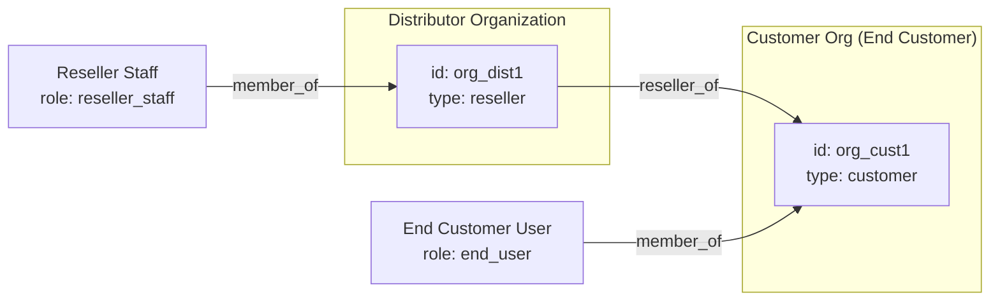

**Policy Example**:
```json
{
  "id": "reseller-can-view-assigned-customers",
  "description": "Distributor staff can only view users of assigned customer companies",
  "effect": "allow",
  "conditions": [
    { "type": "has_role", "params": { "role": "reseller_staff" } },
    { "type": "action_is", "params": { "action": "customer.read" } },
    { "type": "relationship_exists", "params": {
        "relation": "reseller_of",
        "from_org": "${subject.org_id}",
        "to_org": "${resource.org_id}"
    }}
  ]
}
```

**Use Cases**:
- SaaS providers selling through distributors
- Franchise headquarters and franchisee relationships
- Wholesale and retail relationships

---

### Use Case 2: Parent-Child Accounts (Family)

**Implementation Status**: ✅ Implemented in Phase 1

**Scenario Overview**:
- Parents create and manage children's accounts
- Parents can edit their children's info but not other people's children
- When children become adults, they gain their own management permissions (inherited from parents)

**Persona**:
- **Parent Sato**: Manages accounts for 2 children (ages 10 and 15)
- **Child Taro (age 15)**: Uses limited features under parental supervision
- **Adult Child Hanako (age 20)**: Manages own account after becoming adult

**Data Model**:
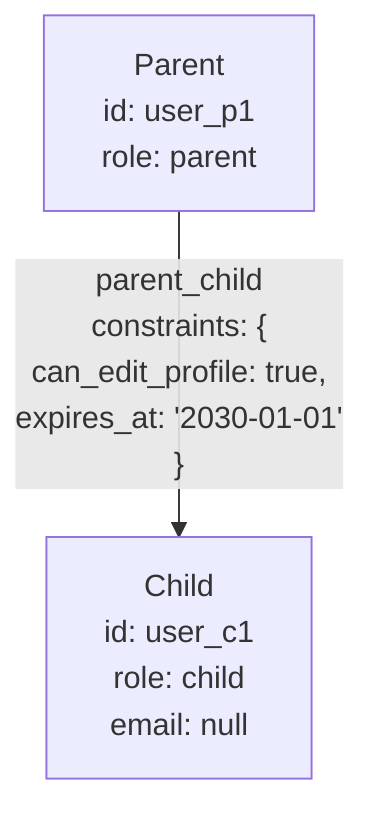

**Policy Example**:
```json
{
  "id": "parent-can-edit-child-profile",
  "description": "Parents can edit child's profile (within validity period only)",
  "effect": "allow",
  "conditions": [
    { "type": "has_relationship", "params": {
        "relation": "parent_child",
        "to_subject": "${resource.owner_id}",
        "constraint_check": {
          "can_edit_profile": true,
          "expires_at": { "after": "now" }
        }
    }},
    { "type": "action_is", "params": { "action": "user.profile.update" } }
  ]
}
```

**Handling Adult Children**:
1. Set `expires_at` of `parent_child` relationship to a past date
2. Or change `can_edit_profile` to `false`
3. Assign `role: self_admin` to the child

**Use Cases**:
- Video streaming service family plans
- Gaming platform minor protection
- Learning service parental management features

---

## Part 2: General RBAC Use Cases

### Use Case 3: Enterprise SSO

**Implementation Status**: 📋 Supported from Phase 2 onwards

**Scenario Overview**:
- Access multiple applications with a single ID
- Manage roles per organization
- Cross-departmental access control

**Persona**:
- **IT Admin Nakamura**: Company-wide user and app management
- **Department Admin Takahashi**: Manages app access rights for department members
- **Employee Kimura**: Single sign-on to permitted applications

**Data Model**:
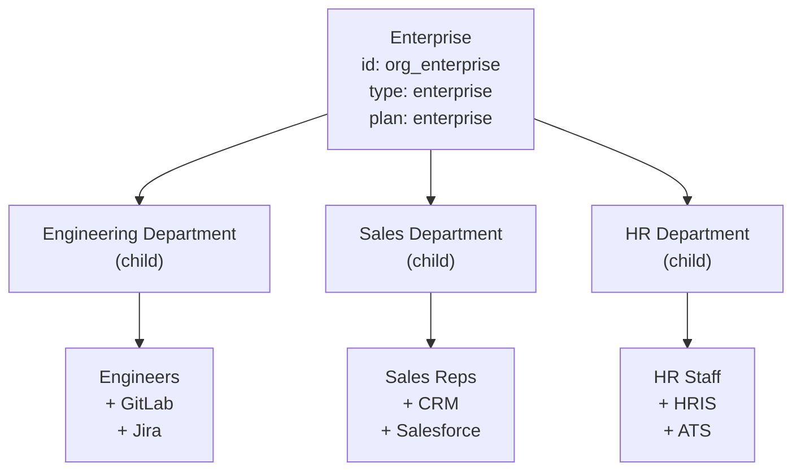

**Policy Example**:
```json
{
  "id": "department-app-access",
  "description": "Department members can access apps in their department",
  "effect": "allow",
  "conditions": [
    { "type": "same_organization", "params": {
        "org_type": "department",
        "resource_org_id": "${resource.department_id}"
    }},
    { "type": "has_any_role", "params": {
        "roles": ["employee", "dept_admin"]
    }}
  ]
}
```

**Implementation in Authrim**:
- Use `organizations` table to represent company/department hierarchy
- Manage multi-department membership with `subject_org_membership`
- Set department-specific permissions using `role_assignments` scopes

---

### Use Case 4: Multi-tenant SaaS

**Implementation Status**: 📋 Supported from Phase 2 onwards

**Scenario Overview**:
- Multiple companies (tenants) use the same platform
- Strict data isolation between tenants
- Separation of tenant admin vs general user permissions

**Persona**:
- **SaaS Provider (System Admin)**: Monitors and manages all tenants
- **Tenant Admin Company A**: Manages own users, changes settings
- **Tenant General User**: Access only to resources within own tenant

**Data Model**:
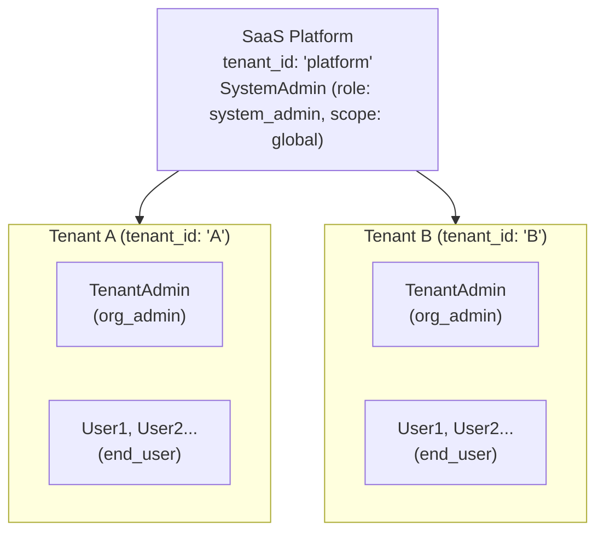

**Policy Example**:
```json
{
  "id": "tenant-isolation",
  "description": "Users can only access resources in their own tenant",
  "effect": "allow",
  "conditions": [
    { "type": "tenant_match", "params": {
        "subject_tenant": "${subject.tenant_id}",
        "resource_tenant": "${resource.tenant_id}"
    }}
  ]
}
```

---

### Use Case 5: Healthcare (Hospital)

**Implementation Status**: 🔮 Phase 3 onwards (full support after DID/VC integration)

**Scenario Overview**:
- Role-based access control for doctors, nurses, patients, administrative staff
- Strict access control for patient data
- Permission management at department (clinical department) scope

**Persona**:
- **Doctor Dr. Tanaka**: View/edit medical records for assigned patients, issue prescriptions
- **Nurse Nurse Sato**: Record vitals and medications for assigned patients
- **Patient Patient Yamamoto**: View own medical records, manage appointments
- **Admin Staff Suzuki**: View billing info only, cannot view clinical content

**Data Model**:
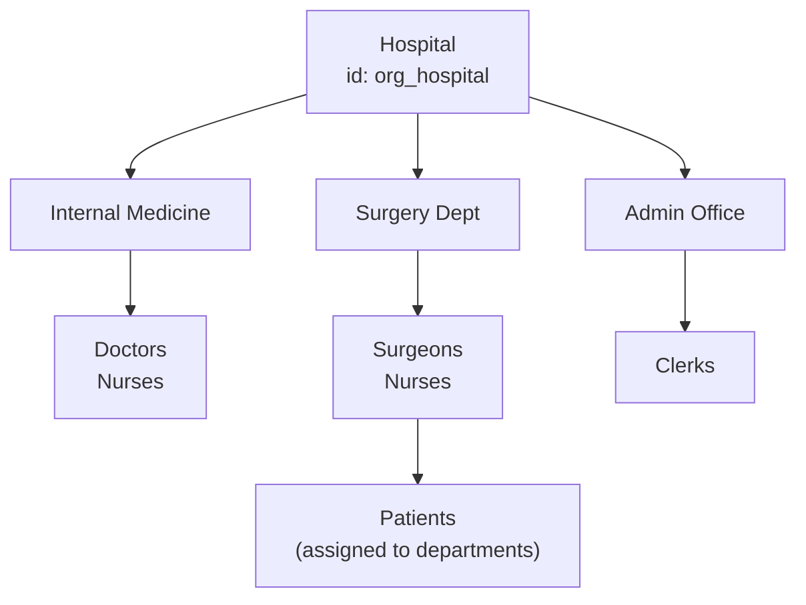

**Policy Example**:
```json
{
  "id": "doctor-patient-access",
  "description": "Doctors can access medical records of assigned patients",
  "effect": "allow",
  "conditions": [
    { "type": "has_role", "params": { "role": "doctor" } },
    { "type": "has_relationship", "params": {
        "relation": "attending_physician",
        "to_subject": "${resource.patient_id}"
    }},
    { "type": "action_is", "params": {
        "action": ["medical_record.read", "medical_record.write"]
    }}
  ]
}
```

**Notes**:
- Compliance with HIPAA/Japan's Personal Information Protection Act required
- Detailed audit logging is mandatory
- Medical license verification can be automated via VC integration (Phase 3)

---

### Use Case 6: Education (School)

**Implementation Status**: 📋 Supported from Phase 2 onwards

**Scenario Overview**:
- Role-based access control for teachers, students, parents
- Permission management at class/grade scope
- Access based on parent-student relationships

**Persona**:
- **Teacher Mr. Yamamoto**: Enter/view grades for assigned class, manage attendance
- **Student Taro Suzuki**: View own grades/assignments, submit assignments
- **Parent Hanako Suzuki**: View child's grades and attendance status

**Data Model**:
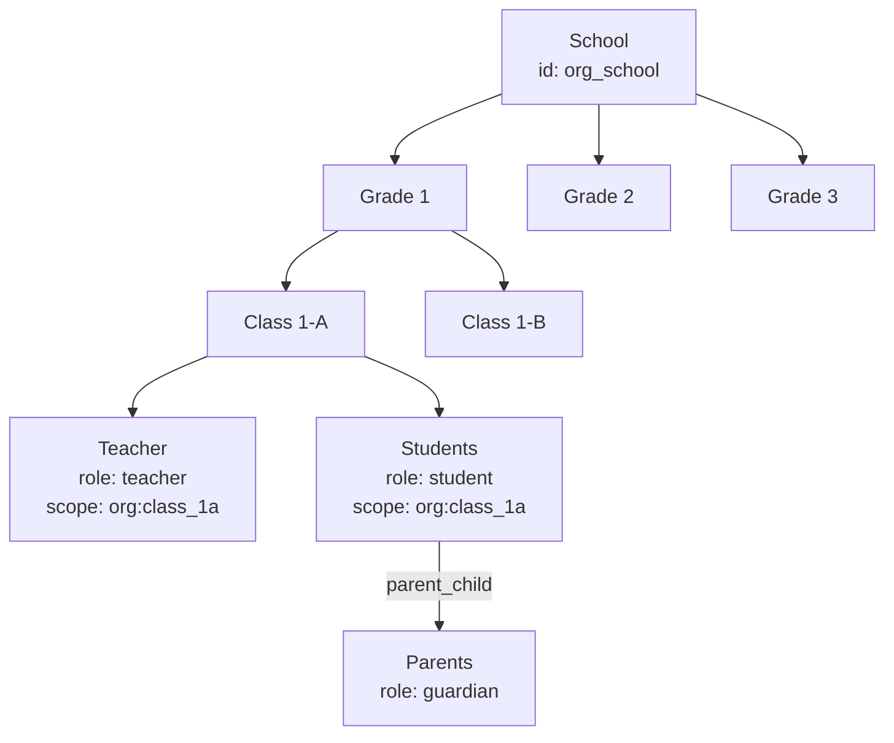

**Policy Example**:
```json
{
  "id": "teacher-grade-access",
  "description": "Teachers can manage grades for students in their assigned class",
  "effect": "allow",
  "conditions": [
    { "type": "has_role", "params": {
        "role": "teacher",
        "scope": "org",
        "scope_target": "${resource.class_id}"
    }},
    { "type": "action_is", "params": {
        "action": ["grade.read", "grade.write"]
    }}
  ]
}
```

```json
{
  "id": "parent-view-child-grades",
  "description": "Parents can view their child's grades",
  "effect": "allow",
  "conditions": [
    { "type": "has_relationship", "params": {
        "relation": "parent_child",
        "to_subject": "${resource.student_id}"
    }},
    { "type": "action_is", "params": { "action": "grade.read" } }
  ]
}
```

---

### Use Case 7: E-commerce Marketplace

**Implementation Status**: 📋 Supported from Phase 2 onwards

**Scenario Overview**:
- Roles for sellers, buyers, platform administrators
- Permission management at shop scope
- Access control for order data

**Persona**:
- **Platform Admin**: Monitor all shops, manage policies
- **Seller (Shop Owner) Tanaka**: Manage own shop's products and orders
- **Seller (Shop Staff) Sato**: Product registration only, cannot view sales data
- **Buyer Yamada**: View own order history, make purchases

**Data Model**:
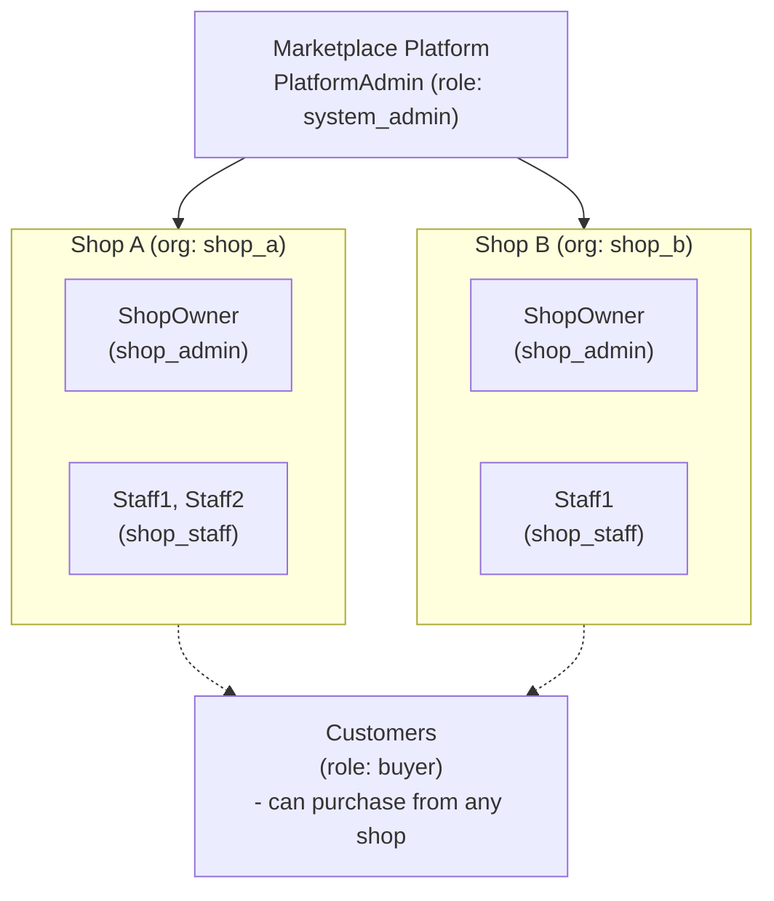

**Policy Example**:
```json
{
  "id": "shop-owner-full-access",
  "description": "Shop owners can manage everything in their own shop",
  "effect": "allow",
  "conditions": [
    { "type": "has_role", "params": {
        "role": "shop_admin",
        "scope": "org",
        "scope_target": "${resource.shop_id}"
    }}
  ]
}
```

```json
{
  "id": "shop-staff-limited-access",
  "description": "Shop staff can only manage products",
  "effect": "allow",
  "conditions": [
    { "type": "has_role", "params": {
        "role": "shop_staff",
        "scope": "org",
        "scope_target": "${resource.shop_id}"
    }},
    { "type": "action_is", "params": {
        "action": ["product.read", "product.write", "order.read"]
    }}
  ]
}
```

---

### Use Case 8: IoT Device Management

**Implementation Status**: 📋 Supported from Phase 2 onwards (M2M authentication)

**Scenario Overview**:
- Roles for devices, operators, administrators
- Permission management at device group scope
- M2M authentication and device identity

**Persona**:
- **System Admin**: Monitor all devices, firmware updates
- **Facility Manager Tanaka**: Manage devices in assigned facilities only
- **Operator Sato**: Monitor device status, respond to alerts
- **IoT Device**: Send sensor data, receive commands

**Data Model**:
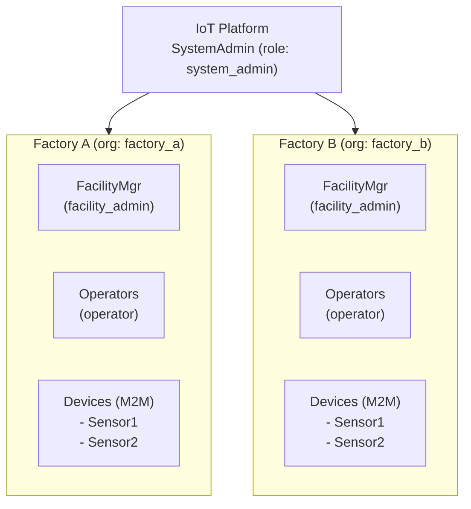

**Policy Example**:
```json
{
  "id": "device-data-upload",
  "description": "Devices can upload data to their assigned facility",
  "effect": "allow",
  "conditions": [
    { "type": "has_role", "params": { "role": "iot_device" } },
    { "type": "same_organization", "params": {
        "resource_org_id": "${resource.facility_id}"
    }},
    { "type": "action_is", "params": { "action": "telemetry.write" } }
  ]
}
```

```json
{
  "id": "operator-device-control",
  "description": "Operators can control devices in their assigned facility",
  "effect": "allow",
  "conditions": [
    { "type": "has_role", "params": {
        "role": "operator",
        "scope": "org",
        "scope_target": "${resource.facility_id}"
    }},
    { "type": "action_is", "params": {
        "action": ["device.read", "device.command"]
    }}
  ]
}
```

**Implementation in Authrim**:
- Device authentication using Client Credentials Flow
- Issue client_id per device
- Set device permission scope using `role_assignments`

---

### Use Case 9: Government / Public Sector

**Implementation Status**: 🔮 Phase 3 onwards (advanced security requirements)

**Scenario Overview**:
- Access control between citizens, staff, and departments
- Hierarchical permissions based on clearance levels
- Control of inter-departmental data sharing

**Persona**:
- **Citizen Taro Yamada**: Check own application status, file various applications
- **Counter Staff Sato**: Process applications for assigned duties
- **Manager Tanaka**: Check subordinate work status, approvals
- **Auditor Suzuki**: View audit logs for all departments (read-only)

**Data Model**:
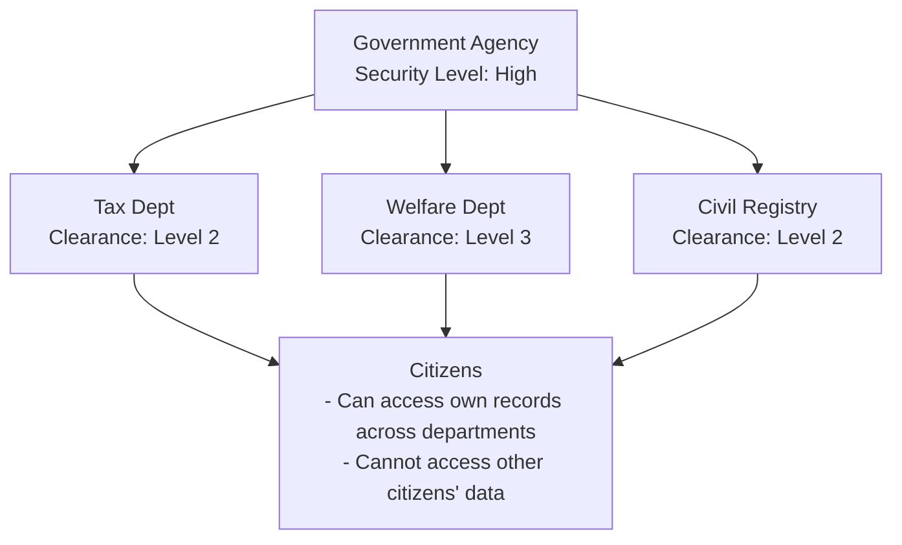

**Policy Example**:
```json
{
  "id": "clearance-level-access",
  "description": "Staff can access information at or below their clearance level",
  "effect": "allow",
  "conditions": [
    { "type": "has_role", "params": { "role": "government_staff" } },
    { "type": "attribute_compare", "params": {
        "subject_attr": "clearance_level",
        "operator": ">=",
        "resource_attr": "security_level"
    }}
  ]
}
```

**Notes**:
- Handling of specific personal information (My Number related)
- Long-term retention requirements for audit trails
- Mandatory two-factor authentication

---

### Use Case 10: Fintech / Payments

**Implementation Status**: 🔮 Phase 3 onwards (compliance requirements)

**Scenario Overview**:
- Permissions between merchants, payment processors, platform
- ABAC based on transaction amount
- Integration with compliance requirements (AML/KYC)

**Persona**:
- **Merchant Owner Tanaka**: Check own shop's sales, manage deposits
- **Merchant Staff Sato**: Process payments only, cannot view sales reports
- **Payment Processor Service**: Process merchant payment data
- **Compliance Officer Yamada**: Monitor high-value transactions, AML response

**Data Model**:
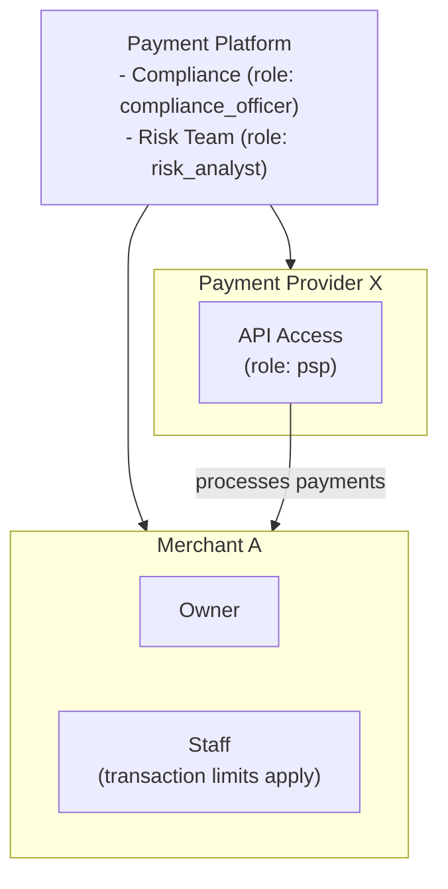

**Policy Example**:
```json
{
  "id": "transaction-amount-limit",
  "description": "Staff can only process payments of 100,000 yen or less",
  "effect": "allow",
  "conditions": [
    { "type": "has_role", "params": { "role": "merchant_staff" } },
    { "type": "action_is", "params": { "action": "payment.process" } },
    { "type": "attribute_compare", "params": {
        "resource_attr": "amount",
        "operator": "<=",
        "value": 100000
    }}
  ],
  "obligations": {
    "audit_log": true
  }
}
```

```json
{
  "id": "high-value-transaction-approval",
  "description": "Transactions of 1,000,000 yen or more require compliance approval",
  "effect": "allow",
  "conditions": [
    { "type": "action_is", "params": { "action": "payment.approve" } },
    { "type": "attribute_compare", "params": {
        "resource_attr": "amount",
        "operator": ">=",
        "value": 1000000
    }},
    { "type": "has_role", "params": { "role": "compliance_officer" } }
  ]
}
```

---

### Use Case 11: Media / Publishing

**Implementation Status**: 📋 Supported from Phase 2 onwards

**Scenario Overview**:
- Roles for authors, editors, subscribers
- Access control for content
- Distinction between paid/free content

**Persona**:
- **Author Yamada**: Create/edit own articles
- **Editor Sato**: Review and publish articles in assigned categories
- **Free Member Tanaka**: View free content only
- **Paid Member Suzuki**: View all content + download

**Data Model**:
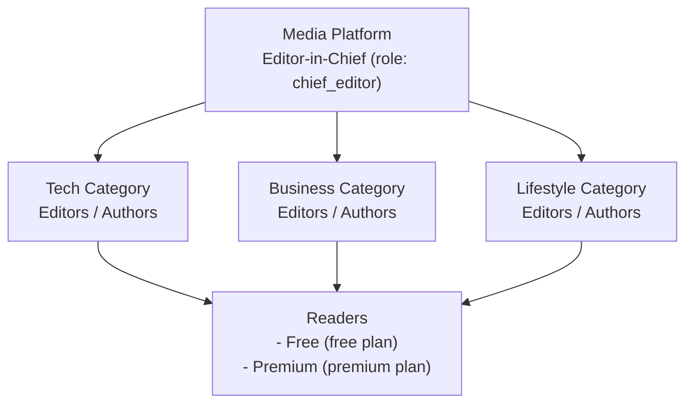

**Policy Example**:
```json
{
  "id": "premium-content-access",
  "description": "Premium members can access all content",
  "effect": "allow",
  "conditions": [
    { "type": "plan_allows", "params": {
        "plans": ["premium", "enterprise"]
    }},
    { "type": "action_is", "params": { "action": "content.read" } }
  ]
}
```

```json
{
  "id": "free-content-access",
  "description": "Free members can only access free content",
  "effect": "allow",
  "conditions": [
    { "type": "plan_allows", "params": { "plans": ["free"] } },
    { "type": "attribute_compare", "params": {
        "resource_attr": "access_level",
        "operator": "==",
        "value": "free"
    }},
    { "type": "action_is", "params": { "action": "content.read" } }
  ]
}
```

---

### Use Case 12: AI Agent / MCP (Model Context Protocol)

**Implementation Status**: 📋 Supported from Phase 2 onwards

**Scenario Overview**:
- Authentication and authorization when AI agents use APIs
- Three-party relationship: AI agents, tool providers, end users
- Delegation model where users delegate permissions to AI

**Persona**:
- **End User Tanaka**: Delegates tasks to AI assistant
- **AI Agent (Claude, etc.)**: Operates APIs on behalf of user
- **Tool Provider (MCP Server)**: Provides APIs for calendar, email, etc.
- **Platform Admin**: Manages permission policies for AI agents

**Data Model**:
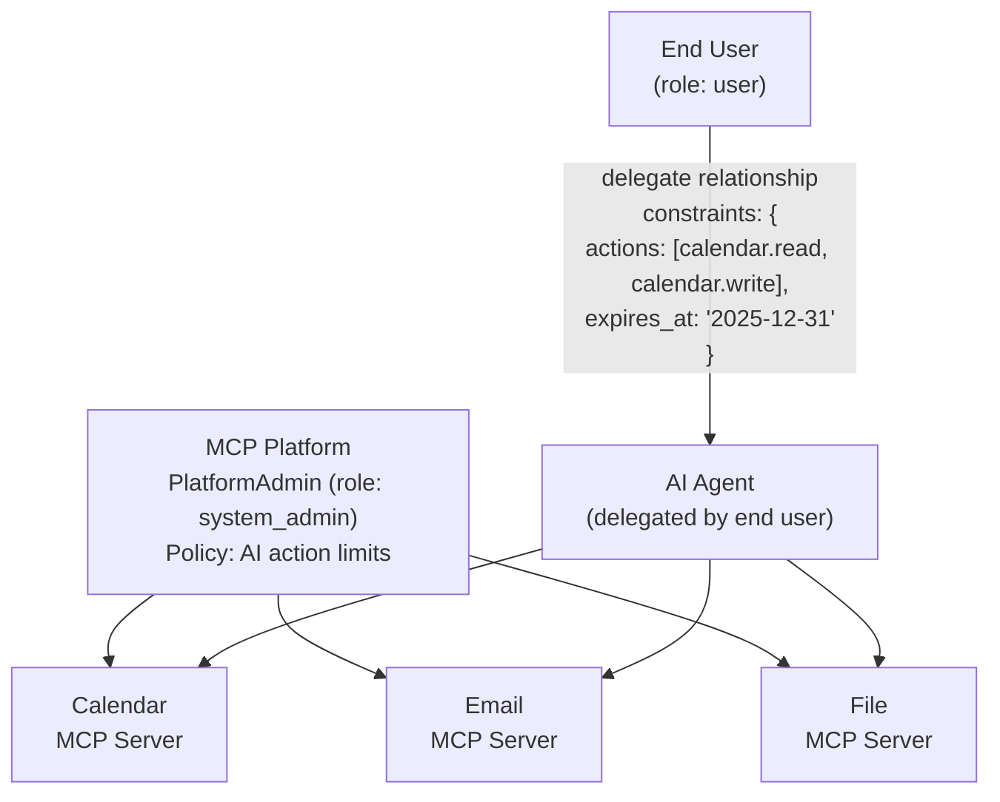

**Policy Example**:
```json
{
  "id": "ai-agent-delegated-access",
  "description": "AI agents can only operate within delegated scope",
  "effect": "allow",
  "conditions": [
    { "type": "has_role", "params": { "role": "ai_agent" } },
    { "type": "has_relationship", "params": {
        "relation": "delegate",
        "from_subject": "${context.delegator_id}",
        "constraint_check": {
          "actions": { "includes": "${action}" },
          "expires_at": { "after": "now" }
        }
    }}
  ],
  "obligations": {
    "audit_log": true,
    "rate_limit": "100/hour"
  }
}
```

```json
{
  "id": "ai-agent-action-restrictions",
  "description": "AI agents cannot execute destructive operations",
  "effect": "deny",
  "conditions": [
    { "type": "has_role", "params": { "role": "ai_agent" } },
    { "type": "action_is", "params": {
        "action": ["*.delete", "*.destroy", "payment.*", "user.delete"]
    }}
  ]
}
```

**Implementation in Authrim**:
- Use `relationships` table to represent user→AI delegation relationships
- Define delegation scope (allowed actions, expiration) in `constraints` JSON
- Track all AI operations in audit log
- Issue delegation tokens via Token Exchange (RFC 8693)

**Notes**:
- Use Client Credentials Flow + `act` claim to identify AI agents
- Delegation tokens include `act` (actor) claim to explicitly indicate who is being represented
- Prevent agent runaway with Rate Limiting

---

## Part 3: Future Extension Use Cases (DID/VC Integration)

> **Note**: These use cases are planned for implementation from Phase 3 onwards. Personas are globally applicable. See Appendix for Japan-specific examples.

### Pattern A: OIDC × VC Verifier × ABAC (Zero-Trust Integration)

**Flow**:
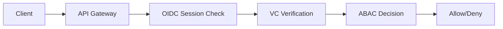

#### Persona A-1: Zero-Trust Banking API

**Persona**: Marcus Chen
- Age: 35
- Role: Corporate Banking Manager at Global Bank
- Situation: Accessing internal systems from client site via mobile

**Scenario**:
1. Marcus is at a client meeting and needs to check loan approval status
2. OIDC login via Passkey on smartphone
3. Bank-issued "Department VC" and "Position VC" are automatically presented
4. API Gateway:
   - Validates OIDC session
   - Verifies VC signatures
   - ABAC engine checks if "Corporate Banking Manager" can access "Loan Approval API"
5. Access granted → Loan status displayed

**Data Model**:
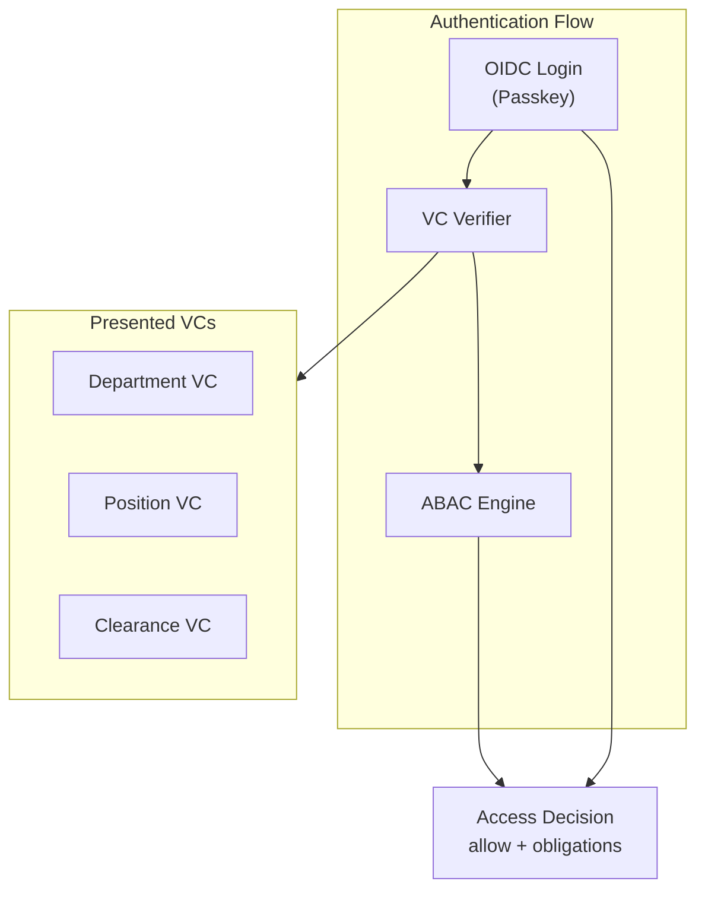

**Policy Example**:
```json
{
  "id": "zero-trust-api-access",
  "description": "API access control in zero-trust environment",
  "effect": "allow",
  "conditions": [
    { "type": "oidc_session_valid" },
    { "type": "has_verified_credential", "params": {
        "vc_type": "DepartmentCredential",
        "issuer": "did:web:bank.example.com",
        "claims": { "department": "corporate_banking" }
    }},
    { "type": "has_verified_credential", "params": {
        "vc_type": "PositionCredential",
        "claims": { "level": { ">=": "manager" } }
    }}
  ],
  "obligations": {
    "session_binding": true,
    "audit_level": "detailed"
  }
}
```

---

#### Persona A-2: Healthcare API Gateway (M2M)

**Persona**: Metro General Hospital Lab System
- Type: Hospital System (M2M)
- Situation: Receiving lab results from partner diagnostic center

**Scenario**:
1. Partner diagnostic center sends lab results
2. OIDC Client Credentials authentication
3. Diagnostic center presents "Healthcare Institution VC" and "Lab Certification VC"
4. API Gateway:
   - Validates client authentication
   - Verifies VC signatures (issued by national health authority)
   - ABAC checks "Can this lab send results for this patient?"
5. Permitted → Lab results stored in EHR

**Policy Example**:
```json
{
  "id": "healthcare-m2m-data-exchange",
  "description": "Data exchange between certified healthcare institutions",
  "effect": "allow",
  "conditions": [
    { "type": "client_authenticated" },
    { "type": "has_verified_credential", "params": {
        "vc_type": "HealthcareInstitutionCredential",
        "issuer_pattern": "did:web:*.health.gov",
        "claims": { "certification_active": true }
    }},
    { "type": "has_verified_credential", "params": {
        "vc_type": "LabCertificationCredential",
        "claims": { "lab_type": ["clinical", "diagnostic"] }
    }}
  ]
}
```

---

### Pattern B: OIDC AuthN + VC AuthZ

**Flow**:


#### Persona B-1: Medical License for EHR Access

**Persona**: Dr. Sarah Mitchell
- Age: 42
- Profession: Internal Medicine Physician (Private Practice)
- Situation: Accessing patient records via regional health network

**Scenario**:
1. Dr. Mitchell logs into regional health network via OIDC (Passkey)
2. System requests VC presentation
3. Selects "Medical License VC" from wallet
   - Issuer: National Medical Board (`did:web:medical-board.example`)
   - Claims: `license_number`, `specialty: "internal_medicine"`
4. Verifier:
   - Validates VC signature
   - Checks expiration
   - Checks revocation list
5. ABAC engine:
   - "Licensed Physician" + "Internal Medicine" → "Internal Medicine Records" access granted
6. Patient's internal medicine records accessible

**Policy Example**:
```json
{
  "id": "physician-ehr-access",
  "description": "EHR access with medical license VC",
  "effect": "allow",
  "conditions": [
    { "type": "oidc_authenticated" },
    { "type": "has_verified_credential", "params": {
        "vc_type": "MedicalLicenseCredential",
        "issuer": "did:web:medical-board.example",
        "not_revoked": true,
        "not_expired": true
    }},
    { "type": "attribute_match", "params": {
        "vc_claim": "specialty",
        "resource_attr": "department"
    }}
  ]
}
```

---

#### Persona B-2: Age-Restricted Content Access

**Persona**: Alex Thompson
- Age: 19
- Profession: University Student
- Situation: Wants to access age-restricted content on streaming service

**Scenario**:
1. Alex logs in via OIDC (Password + OTP)
2. Attempts to access adult category
3. System requests age verification VC
4. Presents "Age Verification VC" from wallet
   - Issuer: Government Identity Authority (`did:web:gov-id.example`)
   - Claims: `birthdate`, `age_over_18: true`
5. Verifier validates, ABAC confirms "18+"
6. Access to age-restricted content granted

**Policy Example**:
```json
{
  "id": "age-restricted-access",
  "description": "Access to adult content with age verification VC",
  "effect": "allow",
  "conditions": [
    { "type": "oidc_authenticated" },
    { "type": "has_verified_credential", "params": {
        "vc_type": "AgeVerificationCredential",
        "issuer_pattern": "did:web:*.gov",
        "claims": { "age_over_18": true }
    }},
    { "type": "action_is", "params": { "action": "content.read" } },
    { "type": "resource_has_attribute", "params": {
        "attr": "age_restriction",
        "value": "18+"
    }}
  ]
}
```

---

### Pattern C: OIDC OP as Issuer (OP as VC Issuer)

**Flow**:
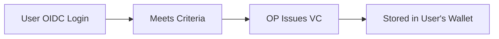

#### Persona C-1: KYC Completion VC Issuance

**Persona**: James Rodriguez
- Age: 28
- Profession: Freelance Developer
- Situation: Wants to register for a new fintech service

**Scenario**:
1. James creates account on Authrim-powered service
2. Completes eKYC (identity verification)
   - Passport scan
   - Facial recognition
3. Upon KYC completion, Authrim issues "KYC Completion VC"
   - Issuer: Authrim OP (`did:web:auth.example.com`)
   - Claims: `kyc_completed: true`, `kyc_level: "level2"`, `verified_at: 1701388800`
4. VC stored in James's wallet (or managed by Authrim)
5. When registering for another fintech service:
   - OIDC login
   - Present KYC Completion VC
   - No need to redo KYC → immediate access

**Issuance Policy Example**:
```json
{
  "id": "issue-kyc-vc",
  "description": "Issue KYC VC upon eKYC completion",
  "vc_type": "KYCCompletionCredential",
  "issue_conditions": [
    { "type": "user_attribute", "params": {
        "attr": "kyc_status",
        "value": "completed"
    }},
    { "type": "user_attribute", "params": {
        "attr": "kyc_level",
        "value": ["level2", "level3"]
    }}
  ],
  "claims_mapping": {
    "kyc_completed": true,
    "kyc_level": "${user.kyc_level}",
    "verified_at": "${user.kyc_completed_at}"
  },
  "validity_period": "1y"
}
```

---

#### Persona C-2: Premium Membership VC Issuance

**Persona**: Emily Watson
- Age: 34
- Profession: Marketing Manager
- Situation: Wants premium benefits across partner services

**Scenario**:
1. Emily subscribes to Premium on Service A (monthly billing)
2. Service A's Authrim issues "Premium Member VC"
   - Issuer: Service A OP (`did:web:service-a.example.com`)
   - Claims: `membership_level: "premium"`, `valid_until: 1704067200`
3. Emily visits partner Service B
4. OIDC login + presents Premium Member VC
5. Service B:
   - Validates VC
   - Recognizes as "Service A Premium Member"
   - Shows premium-only content

**Issuance Policy Example**:
```json
{
  "id": "issue-premium-vc",
  "description": "Issue membership VC to premium members",
  "vc_type": "PremiumMembershipCredential",
  "issue_conditions": [
    { "type": "plan_is", "params": { "plan": "premium" } },
    { "type": "subscription_active" }
  ],
  "claims_mapping": {
    "membership_level": "premium",
    "member_since": "${user.premium_started_at}",
    "valid_until": "${subscription.current_period_end}"
  },
  "auto_refresh": true
}
```

---

## Appendix: Reference Information for Japan Market

Specific examples when considering VC/DID integration in Japan.

### Japan-specific Persona Examples

#### Pattern A-1 Japan: Mega Bank Zero-Trust API

**Persona**: Ichiro Sasaki
- Position: Section Manager, Corporate Banking Division, Mega Bank

**Japan-specific Elements**:
- VC Issuer: Bank Holding Company (`did:web:bank-holdings.co.jp`)
- Authentication level compliant with Japan FSA guidelines

---

#### Pattern B-1 Japan: EHR Access with Medical License

**Persona**: Misaki Tanaka
- Profession: Internal Medicine Physician (Private Practice)

**Japan-specific Elements**:
- VC Issuer: Ministry of Health, Labour and Welfare (`did:web:mhlw.go.jp`)
- Claims: Medical registration number, specialty
- Use in regional healthcare networks (e.g., Chiba Medical Network)

---

#### Pattern B-2 Japan: Age Verification

**Persona**: Kenta Takahashi
- Profession: University Student

**Japan-specific Elements**:
- VC Issuer:
  - My Number Card Public Personal Authentication (`did:web:jpki.go.jp`)
  - Or private eKYC services
- Claims: Date of birth, age verification result

---

#### Pattern C-1 Japan: Identity Verification (eKYC) Completion Proof

**Japan-specific Elements**:
- eKYC based on Act on Prevention of Transfer of Criminal Proceeds
- Verification levels:
  - One photo ID document
  - Non-face-to-face + facial verification
- VC Claims: `kyc_level: "Act_C"` (Criminal Proceeds Act Category C)

---

### Expected VC Issuers in Japan

| Domain | Issuer Example | DID |
|--------|----------------|-----|
| Healthcare | MHLW (Medical License) | `did:web:mhlw.go.jp` |
| Identity | My Number Card (JPKI) | `did:web:jpki.go.jp` |
| Education | MEXT (Teacher License) | `did:web:mext.go.jp` |
| Finance | FSA Certified Providers | `did:web:fsa-certified.example` |
| Driving | Prefectural Public Safety Commissions | `did:web:police.metro.tokyo.jp` |

---

## Document History

| Date | Version | Author | Changes |
|------|---------|--------|---------|
| 2025-11-30 | 1.0 | Authrim Team | Initial version - Extracted from RBAC_IMPLEMENTATION_PLAN.md |

---

## References

- [RBAC Implementation Plan](./RBAC_IMPLEMENTATION_PLAN.md) - Implementation details
- [W3C Verifiable Credentials Data Model](https://www.w3.org/TR/vc-data-model/)
- [OpenID for Verifiable Presentations (OID4VP)](https://openid.net/specs/openid-4-verifiable-presentations-1_0.html)
- [Model Context Protocol (MCP)](https://modelcontextprotocol.io/)
