# Authrim RBAC/ABAC Use Cases

**Last Updated**: 2025-11-30
**Version**: 1.0
**Related**: [RBAC Implementation Plan](./RBAC_IMPLEMENTATION_PLAN.md)

---

## Overview

本ドキュメントでは、Authrim OIDC ProviderのRBAC/ABAC機能で対応可能なユースケースを整理します。

### ドキュメント構成

| Part | 内容 | ステータス |
|------|------|----------|
| Part 1 | 現行ユースケース（Phase 1実装済み） | ✅ 実装済み |
| Part 2 | 一般的なRBACユースケース | 📋 対応可能 |
| Part 3 | 将来拡張（DID/VC連携） | 🔮 構想 |
| Appendix | 日本市場向け参考情報 | 📚 参考 |

### 各ユースケースの記載フォーマット

```
### Use Case N: タイトル

**シナリオ概要**: 箇条書きで概要を説明
**ペルソナ**: 具体的な人物像（必要な場合）
**データモデル**: ASCII図でエンティティ関係を表現
**ポリシー例**: JSON形式のポリシー定義
**実装ステータス**: ✅ Phase 1で実装済み / 📋 Phase N で予定 / 🔮 将来構想
```

---

## Part 1: 現行ユースケース（Phase 1 実装済み）

### Use Case 1: B2B2C (Distributor/Reseller)

**実装ステータス**: ✅ Phase 1で実装済み

**シナリオ概要**:
- エンドユーザーと販社が同じID基盤（Authrim）でログイン
- 一般エンドユーザー画面と販社向け管理画面は完全に別UI/権限
- 販社ユーザーは「自分が担当している顧客」だけ閲覧可

**ペルソナ**:
- **販社スタッフ 山田**: 複数の顧客企業を担当。担当顧客のユーザー情報・契約状況を確認
- **顧客企業の管理者 鈴木**: 自社従業員のアカウント管理のみ可能
- **エンドユーザー 田中**: 自分のプロフィールと利用履歴のみ閲覧

**データモデル**:
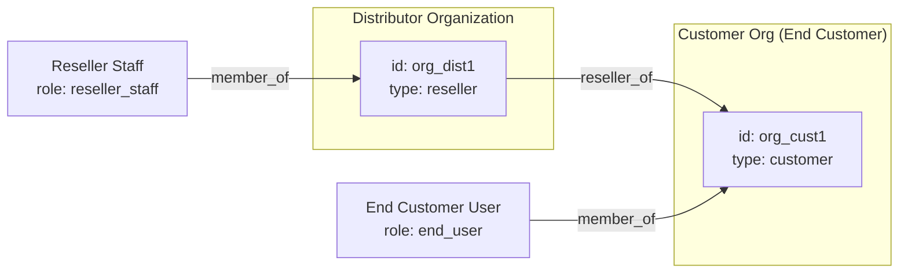

**ポリシー例**:
```json
{
  "id": "reseller-can-view-assigned-customers",
  "description": "販社スタッフは担当顧客企業のユーザーのみ閲覧可能",
  "effect": "allow",
  "conditions": [
    { "type": "has_role", "params": { "role": "reseller_staff" } },
    { "type": "action_is", "params": { "action": "customer.read" } },
    { "type": "relationship_exists", "params": {
        "relation": "reseller_of",
        "from_org": "${subject.org_id}",
        "to_org": "${resource.org_id}"
    }}
  ]
}
```

**利用例**:
- SaaSプロバイダーが代理店経由で販売するモデル
- フランチャイズ本部と加盟店の関係
- 卸売業者と小売店の関係

---

### Use Case 2: Parent-Child Accounts (Family)

**実装ステータス**: ✅ Phase 1で実装済み

**シナリオ概要**:
- 親が子どものアカウントを作成＆管理
- 親は子の情報を編集できるが、他人の子は無理
- 子が成人したら自分で管理権限を持つ（親から権限を引き継ぐ）

**ペルソナ**:
- **親 佐藤**: 2人の子供（10歳、15歳）のアカウントを管理
- **子 太郎（15歳）**: 親の監督下で限定的な機能を利用
- **成人した子 花子（20歳）**: 成人後、自分でアカウントを管理

**データモデル**:
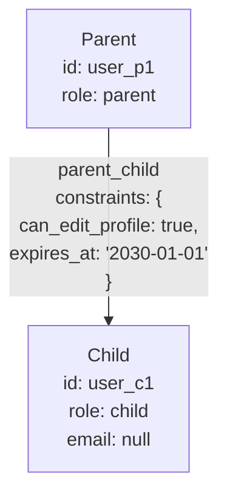

**ポリシー例**:
```json
{
  "id": "parent-can-edit-child-profile",
  "description": "親は子のプロフィールを編集可能（有効期限内のみ）",
  "effect": "allow",
  "conditions": [
    { "type": "has_relationship", "params": {
        "relation": "parent_child",
        "to_subject": "${resource.owner_id}",
        "constraint_check": {
          "can_edit_profile": true,
          "expires_at": { "after": "now" }
        }
    }},
    { "type": "action_is", "params": { "action": "user.profile.update" } }
  ]
}
```

**子が成人した場合の対応**:
1. `parent_child` 関係の `expires_at` を過去日に設定
2. または `can_edit_profile` を `false` に変更
3. 子本人に `role: self_admin` を付与

**利用例**:
- 動画配信サービスのファミリープラン
- ゲームプラットフォームの未成年保護
- 学習サービスの保護者管理機能

---

## Part 2: 一般的なRBACユースケース

### Use Case 3: Enterprise SSO

**実装ステータス**: 📋 Phase 2以降で対応可能

**シナリオ概要**:
- 1つのIDで複数のアプリケーションにアクセス
- 組織ごとにロールを管理
- 部門横断的なアクセス制御

**ペルソナ**:
- **IT管理者 中村**: 全社のユーザー・アプリ管理
- **部門管理者 高橋**: 自部門メンバーのアプリアクセス権管理
- **一般社員 木村**: 許可されたアプリにシングルサインオン

**データモデル**:
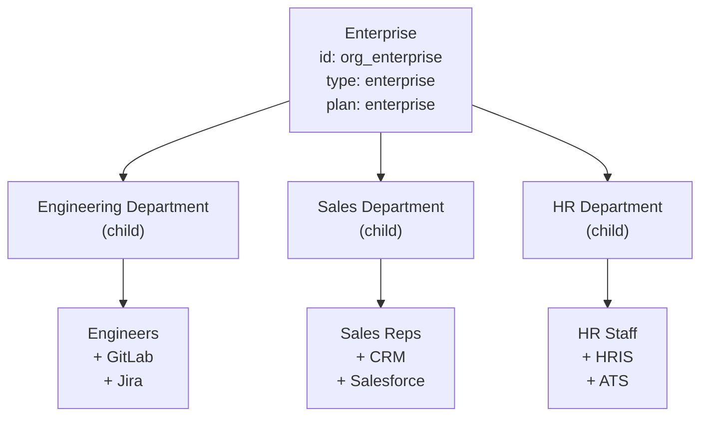

**ポリシー例**:
```json
{
  "id": "department-app-access",
  "description": "部門メンバーは所属部門のアプリにアクセス可能",
  "effect": "allow",
  "conditions": [
    { "type": "same_organization", "params": {
        "org_type": "department",
        "resource_org_id": "${resource.department_id}"
    }},
    { "type": "has_any_role", "params": {
        "roles": ["employee", "dept_admin"]
    }}
  ]
}
```

**Authrimでの実現方法**:
- `organizations` テーブルで企業・部門の階層構造を表現
- `subject_org_membership` で複数部門への所属を管理
- `role_assignments` のスコープで部門別権限を設定

---

### Use Case 4: Multi-tenant SaaS

**実装ステータス**: 📋 Phase 2以降で対応可能

**シナリオ概要**:
- 複数の企業（テナント）が同一基盤を利用
- テナント間の厳格なデータ分離
- テナント管理者 vs 一般ユーザーの権限分離

**ペルソナ**:
- **SaaSプロバイダー（システム管理者）**: 全テナントの監視・管理
- **テナント管理者 企業A**: 自社ユーザーの管理、設定変更
- **テナント一般ユーザー**: 自テナント内のリソースのみアクセス

**データモデル**:
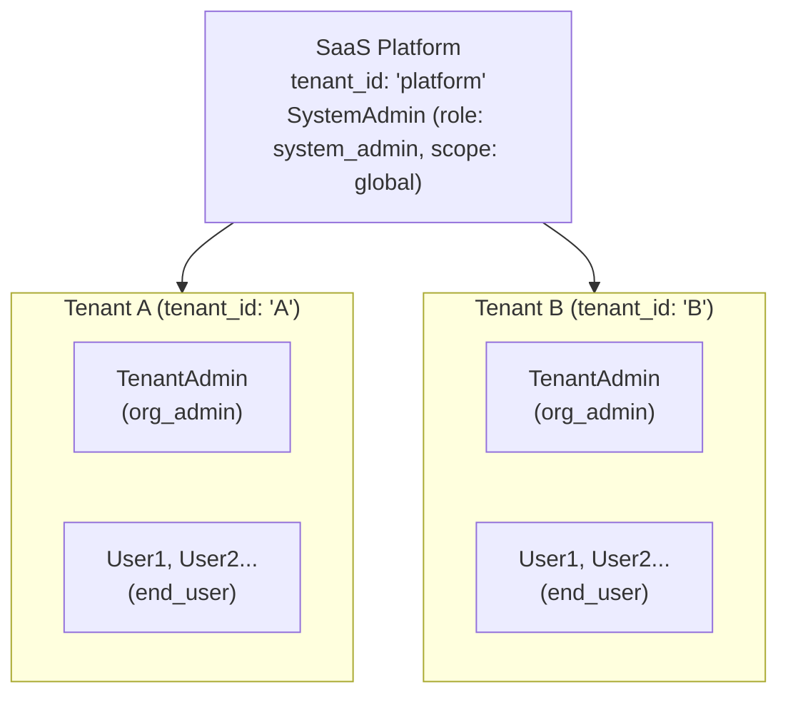

**ポリシー例**:
```json
{
  "id": "tenant-isolation",
  "description": "ユーザーは自テナントのリソースのみアクセス可能",
  "effect": "allow",
  "conditions": [
    { "type": "tenant_match", "params": {
        "subject_tenant": "${subject.tenant_id}",
        "resource_tenant": "${resource.tenant_id}"
    }}
  ]
}
```

---

### Use Case 5: Healthcare (Hospital)

**実装ステータス**: 🔮 Phase 3以降（DID/VC連携後に本格対応）

**シナリオ概要**:
- 医師、看護師、患者、事務員の役割別アクセス制御
- 患者データへの厳格なアクセス制御
- 部門（診療科）スコープでの権限管理

**ペルソナ**:
- **医師 Dr. Tanaka**: 担当患者のカルテ閲覧・編集、処方箋発行
- **看護師 Nurse Sato**: 担当患者のバイタル記録、投薬記録
- **患者 Patient Yamamoto**: 自分の診療記録閲覧、予約管理
- **医事課 Staff Suzuki**: 会計情報のみ閲覧、診療内容は閲覧不可

**データモデル**:
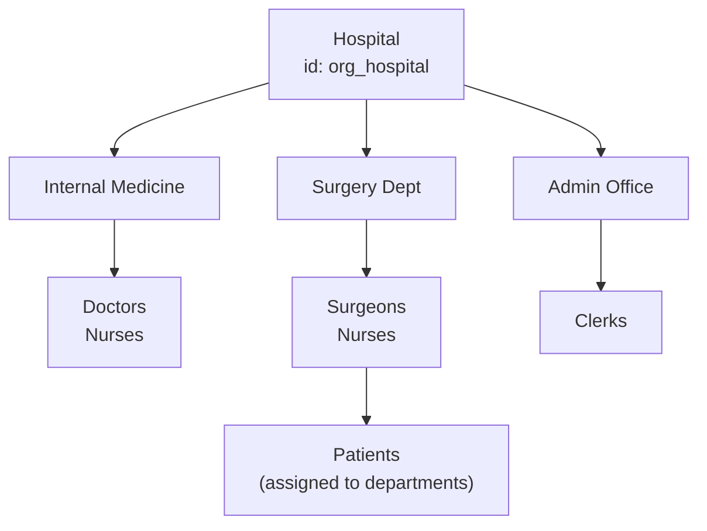

**ポリシー例**:
```json
{
  "id": "doctor-patient-access",
  "description": "医師は担当患者の診療記録にアクセス可能",
  "effect": "allow",
  "conditions": [
    { "type": "has_role", "params": { "role": "doctor" } },
    { "type": "has_relationship", "params": {
        "relation": "attending_physician",
        "to_subject": "${resource.patient_id}"
    }},
    { "type": "action_is", "params": {
        "action": ["medical_record.read", "medical_record.write"]
    }}
  ]
}
```

**特記事項**:
- HIPAA/日本の個人情報保護法への対応が必要
- 監査ログの詳細記録が必須
- VC連携で医師免許の検証を自動化可能（Phase 3）

---

### Use Case 6: Education (School)

**実装ステータス**: 📋 Phase 2以降で対応可能

**シナリオ概要**:
- 教師、生徒、保護者の役割別アクセス制御
- クラス/学年スコープでの権限管理
- 保護者-生徒の関係性に基づくアクセス

**ペルソナ**:
- **教師 山本先生**: 担当クラスの成績入力・閲覧、出席管理
- **生徒 鈴木太郎**: 自分の成績・課題閲覧、課題提出
- **保護者 鈴木花子**: 子供の成績・出席状況の閲覧

**データモデル**:
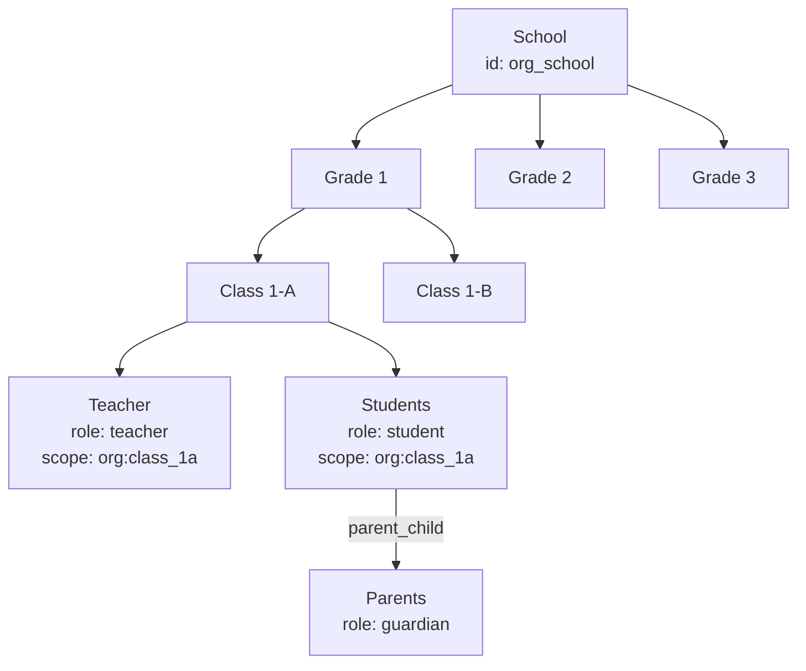

**ポリシー例**:
```json
{
  "id": "teacher-grade-access",
  "description": "教師は担当クラスの生徒の成績を管理可能",
  "effect": "allow",
  "conditions": [
    { "type": "has_role", "params": {
        "role": "teacher",
        "scope": "org",
        "scope_target": "${resource.class_id}"
    }},
    { "type": "action_is", "params": {
        "action": ["grade.read", "grade.write"]
    }}
  ]
}
```

```json
{
  "id": "parent-view-child-grades",
  "description": "保護者は子供の成績を閲覧可能",
  "effect": "allow",
  "conditions": [
    { "type": "has_relationship", "params": {
        "relation": "parent_child",
        "to_subject": "${resource.student_id}"
    }},
    { "type": "action_is", "params": { "action": "grade.read" } }
  ]
}
```

---

### Use Case 7: E-commerce Marketplace

**実装ステータス**: 📋 Phase 2以降で対応可能

**シナリオ概要**:
- 出品者、購入者、プラットフォーム管理者の役割
- 店舗スコープでの権限管理
- 注文データへのアクセス制御

**ペルソナ**:
- **プラットフォーム管理者**: 全店舗の監視、ポリシー管理
- **出品者（店舗オーナー）田中**: 自店舗の商品・注文管理
- **出品者（店舗スタッフ）佐藤**: 商品登録のみ、売上データは閲覧不可
- **購入者 山田**: 自分の注文履歴閲覧、購入

**データモデル**:
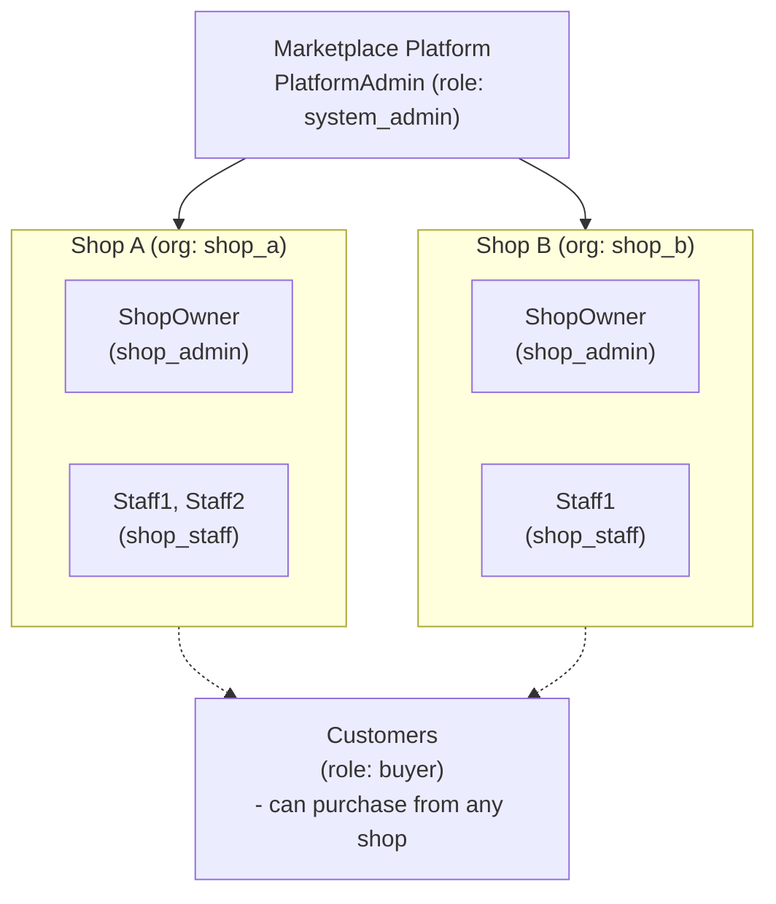

**ポリシー例**:
```json
{
  "id": "shop-owner-full-access",
  "description": "店舗オーナーは自店舗のすべてを管理可能",
  "effect": "allow",
  "conditions": [
    { "type": "has_role", "params": {
        "role": "shop_admin",
        "scope": "org",
        "scope_target": "${resource.shop_id}"
    }}
  ]
}
```

```json
{
  "id": "shop-staff-limited-access",
  "description": "店舗スタッフは商品管理のみ可能",
  "effect": "allow",
  "conditions": [
    { "type": "has_role", "params": {
        "role": "shop_staff",
        "scope": "org",
        "scope_target": "${resource.shop_id}"
    }},
    { "type": "action_is", "params": {
        "action": ["product.read", "product.write", "order.read"]
    }}
  ]
}
```

---

### Use Case 8: IoT Device Management

**実装ステータス**: 📋 Phase 2以降で対応可能（M2M認証）

**シナリオ概要**:
- デバイス、オペレーター、管理者のロール
- デバイスグループスコープでの権限管理
- M2M認証とデバイスアイデンティティ

**ペルソナ**:
- **システム管理者**: 全デバイスの監視、ファームウェア更新
- **施設管理者 田中**: 担当施設のデバイスのみ管理
- **オペレーター 佐藤**: デバイス状態の監視、アラート対応
- **IoTデバイス**: センサーデータの送信、コマンドの受信

**データモデル**:
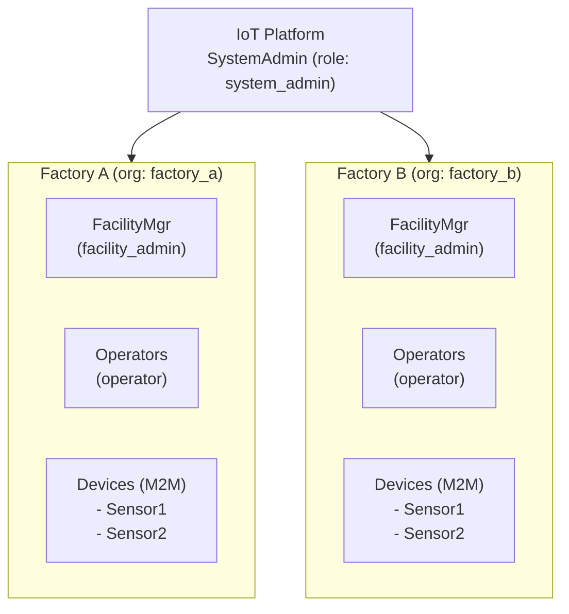

**ポリシー例**:
```json
{
  "id": "device-data-upload",
  "description": "デバイスは所属施設にデータをアップロード可能",
  "effect": "allow",
  "conditions": [
    { "type": "has_role", "params": { "role": "iot_device" } },
    { "type": "same_organization", "params": {
        "resource_org_id": "${resource.facility_id}"
    }},
    { "type": "action_is", "params": { "action": "telemetry.write" } }
  ]
}
```

```json
{
  "id": "operator-device-control",
  "description": "オペレーターは担当施設のデバイスを制御可能",
  "effect": "allow",
  "conditions": [
    { "type": "has_role", "params": {
        "role": "operator",
        "scope": "org",
        "scope_target": "${resource.facility_id}"
    }},
    { "type": "action_is", "params": {
        "action": ["device.read", "device.command"]
    }}
  ]
}
```

**Authrimでの実現方法**:
- Client Credentials Flowでデバイス認証
- デバイスごとにclient_idを発行
- `role_assignments` でデバイスの権限スコープを設定

---

### Use Case 9: Government / Public Sector

**実装ステータス**: 🔮 Phase 3以降（高度なセキュリティ要件）

**シナリオ概要**:
- 市民、職員、部署間のアクセス制御
- 機密レベルに基づく階層的権限
- 部署間データ共有の制御

**ペルソナ**:
- **市民 山田太郎**: 自分の申請状況確認、各種届出
- **窓口職員 佐藤**: 担当業務の申請処理
- **管理職 田中**: 部下の業務状況確認、承認
- **監査担当 鈴木**: 全部署の監査ログ閲覧（読み取り専用）

**データモデル**:
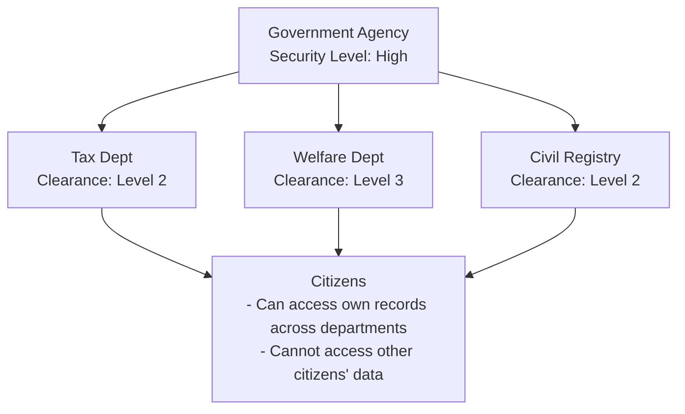

**ポリシー例**:
```json
{
  "id": "clearance-level-access",
  "description": "職員はクリアランスレベル以下の情報にアクセス可能",
  "effect": "allow",
  "conditions": [
    { "type": "has_role", "params": { "role": "government_staff" } },
    { "type": "attribute_compare", "params": {
        "subject_attr": "clearance_level",
        "operator": ">=",
        "resource_attr": "security_level"
    }}
  ]
}
```

**特記事項**:
- 特定個人情報（マイナンバー関連）の取り扱い
- 監査証跡の長期保存要件
- 二要素認証の必須化

---

### Use Case 10: Fintech / Payments

**実装ステータス**: 🔮 Phase 3以降（コンプライアンス要件）

**シナリオ概要**:
- 加盟店、決済代行、プラットフォーム間の権限
- トランザクション金額に基づくABAC
- コンプライアンス要件（AML/KYC）との連携

**ペルソナ**:
- **加盟店オーナー 田中**: 自店舗の売上確認、入金管理
- **加盟店スタッフ 佐藤**: 決済処理のみ、売上レポートは閲覧不可
- **決済代行サービス**: 加盟店の決済データ処理
- **コンプライアンスオフィサー 山田**: 高額取引の監視、AML対応

**データモデル**:
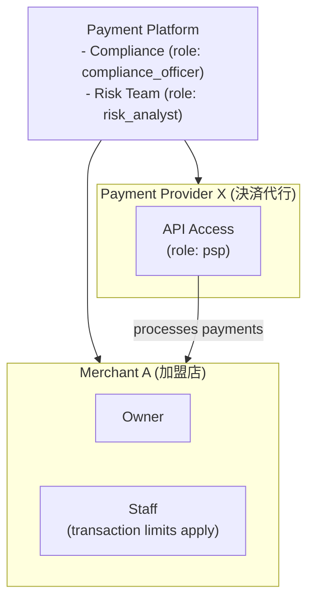

**ポリシー例**:
```json
{
  "id": "transaction-amount-limit",
  "description": "スタッフは10万円以下の決済のみ処理可能",
  "effect": "allow",
  "conditions": [
    { "type": "has_role", "params": { "role": "merchant_staff" } },
    { "type": "action_is", "params": { "action": "payment.process" } },
    { "type": "attribute_compare", "params": {
        "resource_attr": "amount",
        "operator": "<=",
        "value": 100000
    }}
  ],
  "obligations": {
    "audit_log": true
  }
}
```

```json
{
  "id": "high-value-transaction-approval",
  "description": "100万円以上の取引はコンプライアンス承認が必要",
  "effect": "allow",
  "conditions": [
    { "type": "action_is", "params": { "action": "payment.approve" } },
    { "type": "attribute_compare", "params": {
        "resource_attr": "amount",
        "operator": ">=",
        "value": 1000000
    }},
    { "type": "has_role", "params": { "role": "compliance_officer" } }
  ]
}
```

---

### Use Case 11: Media / Publishing

**実装ステータス**: 📋 Phase 2以降で対応可能

**シナリオ概要**:
- 著者、編集者、購読者のロール
- コンテンツへのアクセス制御
- 有料/無料コンテンツの区分

**ペルソナ**:
- **著者 山田**: 自分の記事の作成・編集
- **編集者 佐藤**: 担当カテゴリの記事レビュー・公開
- **無料会員 田中**: 無料コンテンツのみ閲覧
- **有料会員 鈴木**: 全コンテンツ閲覧＋ダウンロード

**データモデル**:
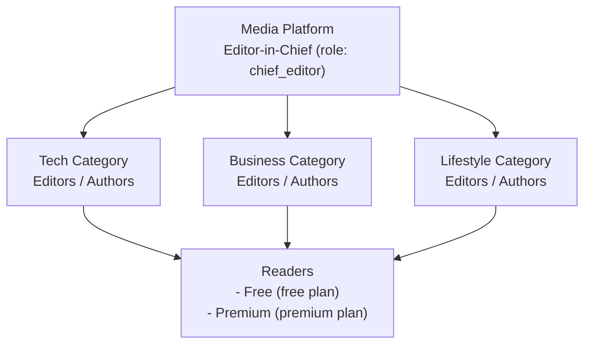

**ポリシー例**:
```json
{
  "id": "premium-content-access",
  "description": "プレミアム会員は全コンテンツにアクセス可能",
  "effect": "allow",
  "conditions": [
    { "type": "plan_allows", "params": {
        "plans": ["premium", "enterprise"]
    }},
    { "type": "action_is", "params": { "action": "content.read" } }
  ]
}
```

```json
{
  "id": "free-content-access",
  "description": "無料会員は無料コンテンツのみアクセス可能",
  "effect": "allow",
  "conditions": [
    { "type": "plan_allows", "params": { "plans": ["free"] } },
    { "type": "attribute_compare", "params": {
        "resource_attr": "access_level",
        "operator": "==",
        "value": "free"
    }},
    { "type": "action_is", "params": { "action": "content.read" } }
  ]
}
```

---

### Use Case 12: AI Agent / MCP (Model Context Protocol)

**実装ステータス**: 📋 Phase 2以降で対応可能

**シナリオ概要**:
- AIエージェントがAPIを利用する際の認証・認可
- AIエージェント、ツール提供者、エンドユーザーの三者関係
- ユーザーがAIに権限を委任するDelegationモデル

**ペルソナ**:
- **エンドユーザー 田中**: AIアシスタントに業務を委任
- **AIエージェント（Claude等）**: ユーザーの代理でAPI操作
- **ツール提供者（MCPサーバー）**: カレンダー、メール等のAPIを提供
- **プラットフォーム管理者**: AIエージェントの権限ポリシー管理

**データモデル**:
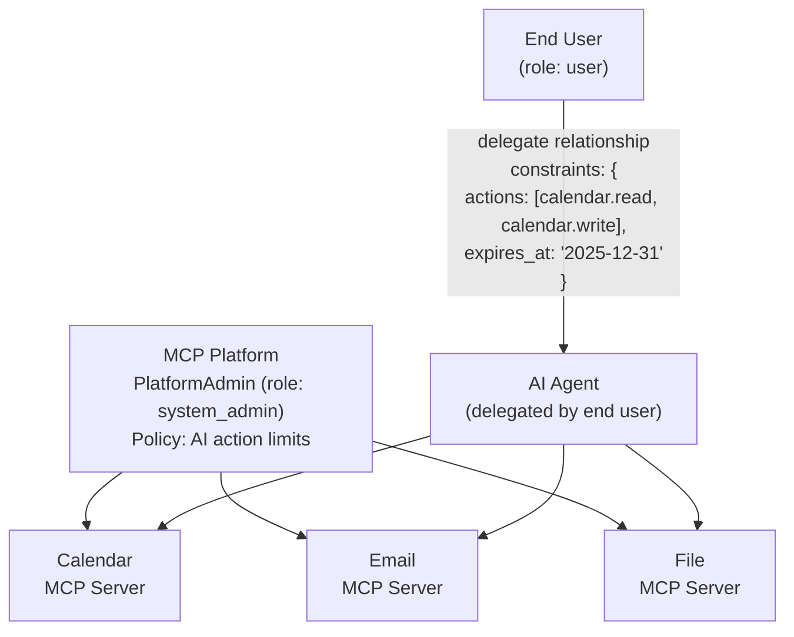

**ポリシー例**:
```json
{
  "id": "ai-agent-delegated-access",
  "description": "AIエージェントは委任された範囲内でのみ操作可能",
  "effect": "allow",
  "conditions": [
    { "type": "has_role", "params": { "role": "ai_agent" } },
    { "type": "has_relationship", "params": {
        "relation": "delegate",
        "from_subject": "${context.delegator_id}",
        "constraint_check": {
          "actions": { "includes": "${action}" },
          "expires_at": { "after": "now" }
        }
    }}
  ],
  "obligations": {
    "audit_log": true,
    "rate_limit": "100/hour"
  }
}
```

```json
{
  "id": "ai-agent-action-restrictions",
  "description": "AIエージェントは破壊的操作を実行不可",
  "effect": "deny",
  "conditions": [
    { "type": "has_role", "params": { "role": "ai_agent" } },
    { "type": "action_is", "params": {
        "action": ["*.delete", "*.destroy", "payment.*", "user.delete"]
    }}
  ]
}
```

**Authrimでの実現方法**:
- `relationships` テーブルでユーザー→AI間の委任関係を表現
- `constraints` JSONで委任範囲（許可アクション、有効期限）を定義
- 監査ログでAIの全操作を追跡
- Token Exchange (RFC 8693) で委任トークンを発行

**特記事項**:
- AIエージェントの識別にはClient Credentials Flow + `act` claimを使用
- 委任トークンには `act` (actor) claimを含め、誰の代理かを明示
- Rate Limitingでエージェントの暴走を防止

---

## Part 3: 将来拡張ユースケース（DID/VC連携）

> **注**: これらのユースケースは Phase 3 以降で実装予定。ペルソナはグローバル対応。日本固有の例は Appendix を参照。

### Pattern A: OIDC × VC Verifier × ABAC (Zero-Trust Integration)

**フロー**:
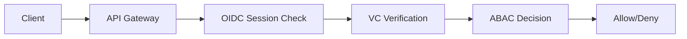

#### Persona A-1: Zero-Trust Banking API

**ペルソナ**: Marcus Chen
- Age: 35
- Role: Corporate Banking Manager at Global Bank
- Situation: Accessing internal systems from client site via mobile

**シナリオ**:
1. Marcus is at a client meeting and needs to check loan approval status
2. OIDC login via Passkey on smartphone
3. Bank-issued "Department VC" and "Position VC" are automatically presented
4. API Gateway:
   - Validates OIDC session
   - Verifies VC signatures
   - ABAC engine checks if "Corporate Banking Manager" can access "Loan Approval API"
5. Access granted → Loan status displayed

**データモデル**:
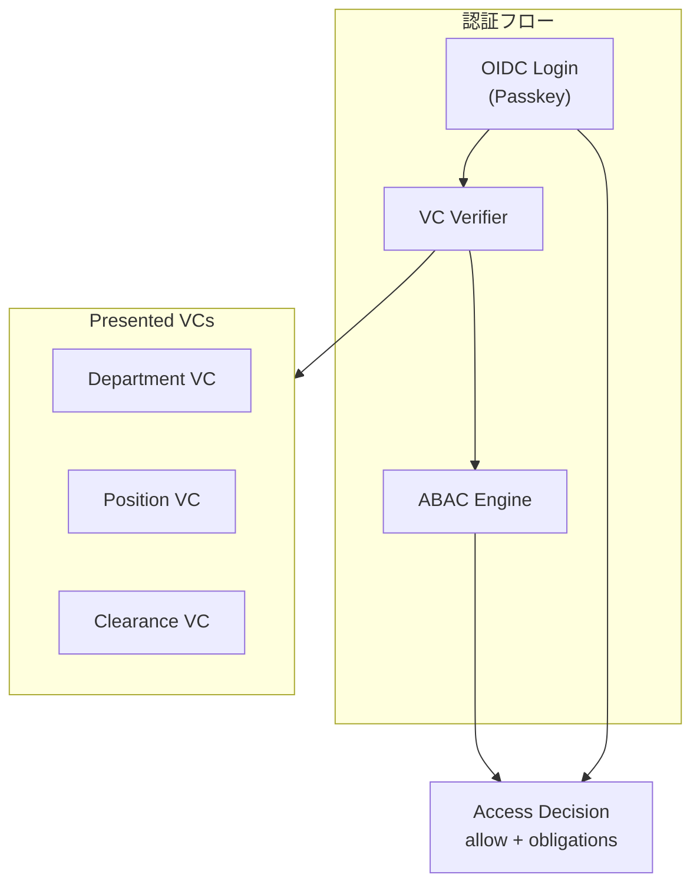

**ポリシー例**:
```json
{
  "id": "zero-trust-api-access",
  "description": "ゼロトラスト環境でのAPI アクセス制御",
  "effect": "allow",
  "conditions": [
    { "type": "oidc_session_valid" },
    { "type": "has_verified_credential", "params": {
        "vc_type": "DepartmentCredential",
        "issuer": "did:web:bank.example.com",
        "claims": { "department": "corporate_banking" }
    }},
    { "type": "has_verified_credential", "params": {
        "vc_type": "PositionCredential",
        "claims": { "level": { ">=": "manager" } }
    }}
  ],
  "obligations": {
    "session_binding": true,
    "audit_level": "detailed"
  }
}
```

---

#### Persona A-2: Healthcare API Gateway (M2M)

**ペルソナ**: Metro General Hospital Lab System
- Type: Hospital System (M2M)
- Situation: Receiving lab results from partner diagnostic center

**シナリオ**:
1. Partner diagnostic center sends lab results
2. OIDC Client Credentials authentication
3. Diagnostic center presents "Healthcare Institution VC" and "Lab Certification VC"
4. API Gateway:
   - Validates client authentication
   - Verifies VC signatures (issued by national health authority)
   - ABAC checks "Can this lab send results for this patient?"
5. Permitted → Lab results stored in EHR

**ポリシー例**:
```json
{
  "id": "healthcare-m2m-data-exchange",
  "description": "認定医療機関間のデータ交換",
  "effect": "allow",
  "conditions": [
    { "type": "client_authenticated" },
    { "type": "has_verified_credential", "params": {
        "vc_type": "HealthcareInstitutionCredential",
        "issuer_pattern": "did:web:*.health.gov",
        "claims": { "certification_active": true }
    }},
    { "type": "has_verified_credential", "params": {
        "vc_type": "LabCertificationCredential",
        "claims": { "lab_type": ["clinical", "diagnostic"] }
    }}
  ]
}
```

---

### Pattern B: OIDC AuthN + VC AuthZ

**フロー**:


#### Persona B-1: Medical License for EHR Access

**ペルソナ**: Dr. Sarah Mitchell
- Age: 42
- Profession: Internal Medicine Physician (Private Practice)
- Situation: Accessing patient records via regional health network

**シナリオ**:
1. Dr. Mitchell logs into regional health network via OIDC (Passkey)
2. System requests VC presentation
3. Selects "Medical License VC" from wallet
   - Issuer: National Medical Board (`did:web:medical-board.example`)
   - Claims: `license_number`, `specialty: "internal_medicine"`
4. Verifier:
   - Validates VC signature
   - Checks expiration
   - Checks revocation list
5. ABAC engine:
   - "Licensed Physician" + "Internal Medicine" → "Internal Medicine Records" access granted
6. Patient's internal medicine records accessible

**ポリシー例**:
```json
{
  "id": "physician-ehr-access",
  "description": "医師免許VCで電子カルテアクセス",
  "effect": "allow",
  "conditions": [
    { "type": "oidc_authenticated" },
    { "type": "has_verified_credential", "params": {
        "vc_type": "MedicalLicenseCredential",
        "issuer": "did:web:medical-board.example",
        "not_revoked": true,
        "not_expired": true
    }},
    { "type": "attribute_match", "params": {
        "vc_claim": "specialty",
        "resource_attr": "department"
    }}
  ]
}
```

---

#### Persona B-2: Age-Restricted Content Access

**ペルソナ**: Alex Thompson
- Age: 19
- Profession: University Student
- Situation: Wants to access age-restricted content on streaming service

**シナリオ**:
1. Alex logs in via OIDC (Password + OTP)
2. Attempts to access adult category
3. System requests age verification VC
4. Presents "Age Verification VC" from wallet
   - Issuer: Government Identity Authority (`did:web:gov-id.example`)
   - Claims: `birthdate`, `age_over_18: true`
5. Verifier validates, ABAC confirms "18+"
6. Access to age-restricted content granted

**ポリシー例**:
```json
{
  "id": "age-restricted-access",
  "description": "年齢確認VCで成人向けコンテンツへのアクセス",
  "effect": "allow",
  "conditions": [
    { "type": "oidc_authenticated" },
    { "type": "has_verified_credential", "params": {
        "vc_type": "AgeVerificationCredential",
        "issuer_pattern": "did:web:*.gov",
        "claims": { "age_over_18": true }
    }},
    { "type": "action_is", "params": { "action": "content.read" } },
    { "type": "resource_has_attribute", "params": {
        "attr": "age_restriction",
        "value": "18+"
    }}
  ]
}
```

---

### Pattern C: OIDC OP as Issuer (VCの発行者としてのOP)

**フロー**:
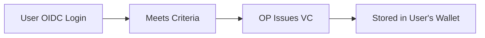

#### Persona C-1: KYC Completion VC Issuance

**ペルソナ**: James Rodriguez
- Age: 28
- Profession: Freelance Developer
- Situation: Wants to register for a new fintech service

**シナリオ**:
1. James creates account on Authrim-powered service
2. Completes eKYC (identity verification)
   - Passport scan
   - Facial recognition
3. Upon KYC completion, Authrim issues "KYC Completion VC"
   - Issuer: Authrim OP (`did:web:auth.example.com`)
   - Claims: `kyc_completed: true`, `kyc_level: "level2"`, `verified_at: 1701388800`
4. VC stored in James's wallet (or managed by Authrim)
5. When registering for another fintech service:
   - OIDC login
   - Present KYC Completion VC
   - No need to redo KYC → immediate access

**発行ポリシー例**:
```json
{
  "id": "issue-kyc-vc",
  "description": "eKYC完了時にKYC VCを発行",
  "vc_type": "KYCCompletionCredential",
  "issue_conditions": [
    { "type": "user_attribute", "params": {
        "attr": "kyc_status",
        "value": "completed"
    }},
    { "type": "user_attribute", "params": {
        "attr": "kyc_level",
        "value": ["level2", "level3"]
    }}
  ],
  "claims_mapping": {
    "kyc_completed": true,
    "kyc_level": "${user.kyc_level}",
    "verified_at": "${user.kyc_completed_at}"
  },
  "validity_period": "1y"
}
```

---

#### Persona C-2: Premium Membership VC Issuance

**ペルソナ**: Emily Watson
- Age: 34
- Profession: Marketing Manager
- Situation: Wants premium benefits across partner services

**シナリオ**:
1. Emily subscribes to Premium on Service A (monthly billing)
2. Service A's Authrim issues "Premium Member VC"
   - Issuer: Service A OP (`did:web:service-a.example.com`)
   - Claims: `membership_level: "premium"`, `valid_until: 1704067200`
3. Emily visits partner Service B
4. OIDC login + presents Premium Member VC
5. Service B:
   - Validates VC
   - Recognizes as "Service A Premium Member"
   - Shows premium-only content

**発行ポリシー例**:
```json
{
  "id": "issue-premium-vc",
  "description": "プレミアム会員にメンバーシップVCを発行",
  "vc_type": "PremiumMembershipCredential",
  "issue_conditions": [
    { "type": "plan_is", "params": { "plan": "premium" } },
    { "type": "subscription_active" }
  ],
  "claims_mapping": {
    "membership_level": "premium",
    "member_since": "${user.premium_started_at}",
    "valid_until": "${subscription.current_period_end}"
  },
  "auto_refresh": true
}
```

---

## Appendix: 日本市場向け参考情報

日本国内でのVC/DID連携を検討する際の具体例。

### 日本版ペルソナ例

#### パターンA-1 日本版: メガバンクのゼロトラストAPI

**ペルソナ**: 佐々木 一郎（ささき いちろう）
- 役職: メガバンク 法人営業部 課長

**日本固有の要素**:
- VCのIssuer: 銀行持株会社（`did:web:bank-holdings.co.jp`）
- 日本の金融庁ガイドラインに準拠した認証レベル

---

#### パターンB-1 日本版: 医師免許による電子カルテアクセス

**ペルソナ**: 田中 美咲（たなか みさき）
- 職業: 内科医（開業医）

**日本固有の要素**:
- VCのIssuer: 厚生労働省（`did:web:mhlw.go.jp`）
- Claims: 医籍登録番号、診療科目
- 地域医療連携ネットワーク（例: 千葉メディカルネットワーク）での利用

---

#### パターンB-2 日本版: 年齢確認

**ペルソナ**: 高橋 健太（たかはし けんた）
- 職業: 大学生

**日本固有の要素**:
- VCのIssuer:
  - マイナンバーカード公的個人認証（`did:web:jpki.go.jp`）
  - または民間eKYCサービス
- Claims: 生年月日、年齢確認結果

---

#### パターンC-1 日本版: 本人確認（eKYC）完了証明

**日本固有の要素**:
- 犯罪収益移転防止法に基づくeKYC
- 確認レベル:
  - 顔写真付き本人確認書類1点
  - 非対面 + 容貌確認
- VCのClaims: `kyc_level: "犯収法_ハ"`

---

### 日本で想定されるVC Issuer一覧

| 領域 | Issuer例 | DID |
|------|----------|-----|
| 医療 | 厚生労働省（医師免許） | `did:web:mhlw.go.jp` |
| 本人確認 | マイナンバーカード（JPKI） | `did:web:jpki.go.jp` |
| 教育 | 文部科学省（教員免許） | `did:web:mext.go.jp` |
| 金融 | 金融庁認定事業者 | `did:web:fsa-certified.example` |
| 運転 | 各都道府県公安委員会 | `did:web:police.metro.tokyo.jp` |

---

## Document History

| Date | Version | Author | Changes |
|------|---------|--------|---------|
| 2025-11-30 | 1.0 | Authrim Team | Initial version - Extracted from RBAC_IMPLEMENTATION_PLAN.md |

---

## References

- [RBAC Implementation Plan](./RBAC_IMPLEMENTATION_PLAN.md) - 実装詳細
- [W3C Verifiable Credentials Data Model](https://www.w3.org/TR/vc-data-model/)
- [OpenID for Verifiable Presentations (OID4VP)](https://openid.net/specs/openid-4-verifiable-presentations-1_0.html)
- [Model Context Protocol (MCP)](https://modelcontextprotocol.io/)
