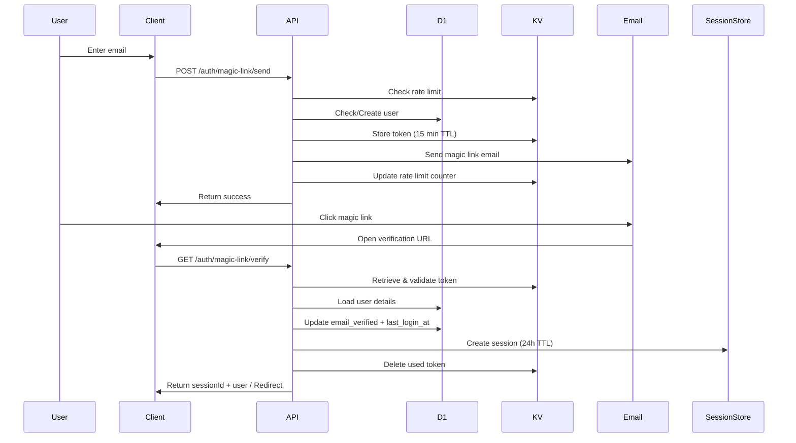

# Magic Link API

## Overview

The Magic Link API provides passwordless authentication via email. Users receive a secure, time-limited link that logs them in without requiring a password. This offers a better user experience while maintaining security through email ownership verification.

**Key Features:**
- Passwordless authentication
- Time-limited tokens (15 minutes)
- Single-use tokens
- Automatic user creation on first use
- Email verification upon successful login
- Rate limiting (3 requests per 15 minutes)
- Email templating (HTML + plain text)

**Email Provider:**
- Resend (primary)
- Cloudflare Email Workers (Phase 7)
- SMTP (Phase 7)

## Base URL

```
https://your-domain.com/auth/magic-link
```

## Endpoints

### 1. Send Magic Link

Send a magic link authentication email to the user.

**Endpoint:** `POST /auth/magic-link/send`

**Request Body:**
```json
{
  "email": "user@example.com",
  "name": "John Doe",
  "redirect_uri": "https://yourapp.com/callback"
}
```

**Request Parameters:**
| Parameter | Type | Required | Description |
|-----------|------|----------|-------------|
| `email` | string | Yes | User's email address |
| `name` | string | No | User's display name (defaults to email prefix) |
| `redirect_uri` | string | No | URL to redirect after verification |

**Response (200 OK):**
```json
{
  "success": true,
  "message": "Magic link sent to your email",
  "messageId": "msg_550e8400-e29b-41d4-a716-446655440000"
}
```

**Response (200 OK - Development Mode):**
When `RESEND_API_KEY` is not configured:
```json
{
  "success": true,
  "message": "Magic link generated (email not sent - RESEND_API_KEY not configured)",
  "magic_link_url": "https://your-domain.com/auth/magic-link/verify?token=..."
}
```

**Error Responses:**

| Status Code | Error | Description |
|-------------|-------|-------------|
| 400 | `invalid_request` | Email is missing or invalid format |
| 429 | `rate_limit_exceeded` | Too many requests (3 per 15 min) |
| 500 | `server_error` | Email sending failed |

**Rate Limit Headers:**
```http
X-RateLimit-Limit: 3
X-RateLimit-Remaining: 2
X-RateLimit-Reset: 1699564800
```

**Example:**
```bash
curl -X POST https://your-domain.com/auth/magic-link/send \
  -H "Content-Type: application/json" \
  -d '{
    "email": "user@example.com",
    "name": "John Doe",
    "redirect_uri": "https://yourapp.com/callback"
  }'
```

**JavaScript Usage:**
```typescript
const response = await fetch('/auth/magic-link/send', {
  method: 'POST',
  headers: { 'Content-Type': 'application/json' },
  body: JSON.stringify({
    email: 'user@example.com',
    name: 'John Doe',
    redirect_uri: 'https://yourapp.com/callback'
  })
});

const data = await response.json();
if (data.success) {
  console.log('Magic link sent!');
  // Show success message to user
  alert('Check your email for a magic link to sign in.');
}
```

---

### 2. Verify Magic Link

Verify the magic link token and create a session.

**Endpoint:** `GET /auth/magic-link/verify`

**Query Parameters:**
| Parameter | Type | Required | Description |
|-----------|------|----------|-------------|
| `token` | string | Yes | Magic link token from email |
| `redirect_uri` | string | No | URL to redirect after verification |

**Response (200 OK):**
```json
{
  "success": true,
  "sessionId": "session_550e8400-e29b-41d4-a716-446655440000",
  "userId": "user_123",
  "user": {
    "id": "user_123",
    "email": "user@example.com",
    "name": "John Doe",
    "email_verified": 1
  }
}
```

**Response (302 Found - with redirect_uri):**
```http
HTTP/1.1 302 Found
Location: https://yourapp.com/callback?session_id=session_550e8400-e29b-41d4-a716-446655440000
```

**Error Responses:**

| Status Code | Error | Description |
|-------------|-------|-------------|
| 400 | `invalid_request` | Token is missing |
| 400 | `invalid_token` | Token is invalid or expired (15 min TTL) |
| 400 | `invalid_request` | User not found |
| 500 | `server_error` | Failed to verify magic link |

**Example:**
```bash
# Direct browser navigation (from email link)
https://your-domain.com/auth/magic-link/verify?token=550e8400-e29b-41d4-a716-446655440000

# With redirect
https://your-domain.com/auth/magic-link/verify?token=550e8400-e29b-41d4-a716-446655440000&redirect_uri=https://yourapp.com/callback

# API request
curl https://your-domain.com/auth/magic-link/verify?token=550e8400-e29b-41d4-a716-446655440000
```

**Browser Usage:**
```typescript
// Parse token from URL (on callback page)
const params = new URLSearchParams(window.location.search);
const token = params.get('token');

if (token) {
  const response = await fetch(`/auth/magic-link/verify?token=${token}`);
  const data = await response.json();

  if (data.success) {
    // Store session ID
    document.cookie = `session_id=${data.sessionId}; path=/; secure; samesite=lax`;

    // Redirect to app
    window.location.href = '/dashboard';
  }
}
```

---

## Email Template

The magic link email includes both HTML and plain text versions.

**HTML Email:**
```html
<!DOCTYPE html>
<html>
<head>
  <meta charset="UTF-8">
  <title>Sign in to Authrim</title>
</head>
<body style="font-family: Arial, sans-serif; line-height: 1.6; color: #333;">
  <div style="max-width: 600px; margin: 0 auto; padding: 20px;">
    <h1 style="color: #4F46E5;">Sign in to Authrim</h1>
    <p>Hello John Doe,</p>
    <p>Click the button below to sign in to your account:</p>
    <div style="margin: 30px 0;">
      <a href="https://your-domain.com/auth/magic-link/verify?token=..."
         style="background-color: #4F46E5; color: white; padding: 12px 24px; text-decoration: none; border-radius: 6px; display: inline-block;">
        Sign in to Authrim
      </a>
    </div>
    <p style="color: #666; font-size: 14px;">
      This link will expire in 15 minutes.
    </p>
    <p style="color: #666; font-size: 14px;">
      If you didn't request this email, you can safely ignore it.
    </p>
  </div>
</body>
</html>
```

**Plain Text Email:**
```
Sign in to Authrim

Hello John Doe,

Click the link below to sign in to your account:

https://your-domain.com/auth/magic-link/verify?token=...

This link will expire in 15 minutes.

If you didn't request this email, you can safely ignore it.

---
Authrim
```

---

## Security Considerations

### Token Generation
- Tokens are UUID v4 (cryptographically random)
- 122 bits of entropy
- Single-use tokens (deleted after verification)

### Token TTL
- **15 minutes** expiration
- Stored in KV with automatic TTL deletion
- Cannot be reused after verification

### Rate Limiting
- **3 requests per 15 minutes** per email address
- Prevents email bombing attacks
- Returns `429 Too Many Requests` with `retry_after` seconds

### Email Validation
- RFC-compliant email format validation
- Pattern: `/^[^\s@]+@[^\s@]+\.[^\s@]+$/`
- Prevents invalid email submissions

### HTTPS Only
- Magic link URLs use HTTPS only
- Prevents token interception
- Secure cookie storage

---

## Data Storage

### D1 Tables

**users:**
- `id` - User UUID
- `email` - User email (unique)
- `name` - Display name
- `email_verified` - Set to 1 after successful magic link verification
- `created_at`, `updated_at`, `last_login_at`

### KV Namespaces

**MAGIC_LINKS:**
- `token:{uuid}` - Token data (15 min TTL)
  ```json
  {
    "userId": "user_123",
    "email": "user@example.com",
    "redirect_uri": "https://yourapp.com/callback",
    "createdAt": 1699561200000
  }
  ```

**RATE_LIMIT:**
- `magic_link_rate:{email}` - Rate limit counter (15 min TTL)
  ```json
  {
    "count": 2,
    "resetAt": 1699564800000
  }
  ```

---

## Complete Authentication Flow



---

## Configuration

### Environment Variables

| Variable | Required | Description | Default |
|----------|----------|-------------|---------|
| `RESEND_API_KEY` | No | Resend API key for email sending | - |
| `EMAIL_FROM` | No | Sender email address | `noreply@authrim.dev` |
| `ISSUER_URL` | Yes | Base URL for magic link generation | - |
| `MAGIC_LINKS` | Yes | KV namespace binding for tokens | - |
| `RATE_LIMIT` | No | KV namespace binding for rate limiting | - |

**Development Mode:**
If `RESEND_API_KEY` is not configured, the API returns the magic link URL in the response instead of sending an email.

---

## Rate Limiting

| Endpoint | Limit | Period | Unit | Error Code |
|----------|-------|--------|------|------------|
| `/send` | 3 | 15 min | email | `rate_limit_exceeded` |

**Rate Limit Response:**
```json
{
  "error": "rate_limit_exceeded",
  "error_description": "Too many magic link requests. Please try again later.",
  "retry_after": 600
}
```

---

## Email Provider Configuration

### Resend (Current)

```typescript
import { ResendEmailProvider } from './utils/email/resend-provider';

const emailProvider = new ResendEmailProvider(RESEND_API_KEY);
await emailProvider.send({
  to: 'user@example.com',
  from: 'noreply@authrim.dev',
  subject: 'Sign in to Authrim',
  html: '...',
  text: '...'
});
```

**Resend Features:**
- Transactional email API
- High deliverability
- Email analytics
- API rate limits: 2 req/sec (free tier)

### Future Providers (Phase 7)

- **Cloudflare Email Workers** - Native Cloudflare integration
- **SMTP** - Standard SMTP protocol support

---

## Testing

**Unit Tests:** `/packages/op-auth/src/__tests__/magic-link.test.ts`

**Manual Testing:**
```bash
# 1. Send magic link (development mode - no email sent)
curl -X POST http://localhost:8787/auth/magic-link/send \
  -H "Content-Type: application/json" \
  -d '{"email":"test@example.com","name":"Test User"}'

# Response includes magic_link_url in development
# {"success":true,"message":"...","magic_link_url":"http://localhost:8787/auth/magic-link/verify?token=..."}

# 2. Verify magic link
curl "http://localhost:8787/auth/magic-link/verify?token=YOUR_TOKEN"
```

**With Resend (Production):**
```bash
# Set RESEND_API_KEY in wrangler.toml or .dev.vars
echo "RESEND_API_KEY=re_..." > .dev.vars

# Send magic link (email will be sent)
curl -X POST http://localhost:8787/auth/magic-link/send \
  -H "Content-Type: application/json" \
  -d '{"email":"your-real-email@example.com","name":"Your Name"}'

# Check your email inbox and click the link
```

---

## Error Codes

| Error Code | HTTP Status | Description | Solution |
|------------|-------------|-------------|----------|
| `invalid_request` | 400 | Email missing or invalid | Provide valid email address |
| `rate_limit_exceeded` | 429 | Too many requests | Wait {retry_after} seconds |
| `invalid_token` | 400 | Token invalid or expired | Request new magic link |
| `server_error` | 500 | Email sending failed | Check RESEND_API_KEY, retry later |

---

## Best Practices

### Client Implementation

1. **Show clear success message:**
   ```typescript
   alert('Check your email for a magic link to sign in. The link expires in 15 minutes.');
   ```

2. **Handle rate limiting gracefully:**
   ```typescript
   if (response.status === 429) {
     const { retry_after } = await response.json();
     alert(`Too many requests. Please try again in ${Math.ceil(retry_after / 60)} minutes.`);
   }
   ```

3. **Implement token verification page:**
   ```typescript
   // On /auth/callback page
   const params = new URLSearchParams(window.location.search);
   const token = params.get('token');

   if (token) {
     // Show loading state
     const response = await fetch(`/auth/magic-link/verify?token=${token}`);
     // Handle success/error
   }
   ```

### Security

1. **Always use HTTPS** in production
2. **Set secure cookies** for session storage
3. **Implement CSRF protection** for authenticated requests
4. **Validate redirect_uri** against allowed domains (TODO: Phase 6)

### UX

1. **Explain the magic link flow** to users
2. **Show email preview** (e.g., "We sent an email to user@example.com")
3. **Provide resend option** after 60 seconds
4. **Handle expired links** gracefully with clear error messages

---

## Related Documentation

- [SessionStore Durable Object](../durable-objects/SessionStore.md)
- [Email Templates](../../packages/op-auth/src/utils/email/templates.ts)
- [Database Schema](../../architecture/database-schema.md)
- [Resend API Documentation](https://resend.com/docs)

---

## Change History

- **2025-11-13**: Initial implementation (Phase 5, Stage 2)
  - Send and verify magic link endpoints
  - Resend email provider integration
  - Rate limiting (3 req/15 min)
  - HTML + plain text email templates
