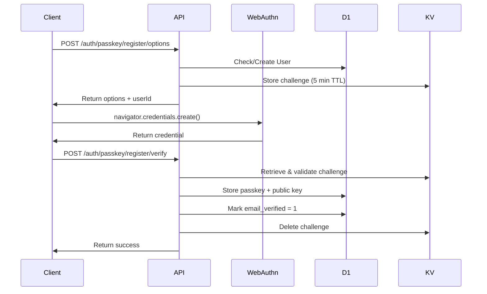
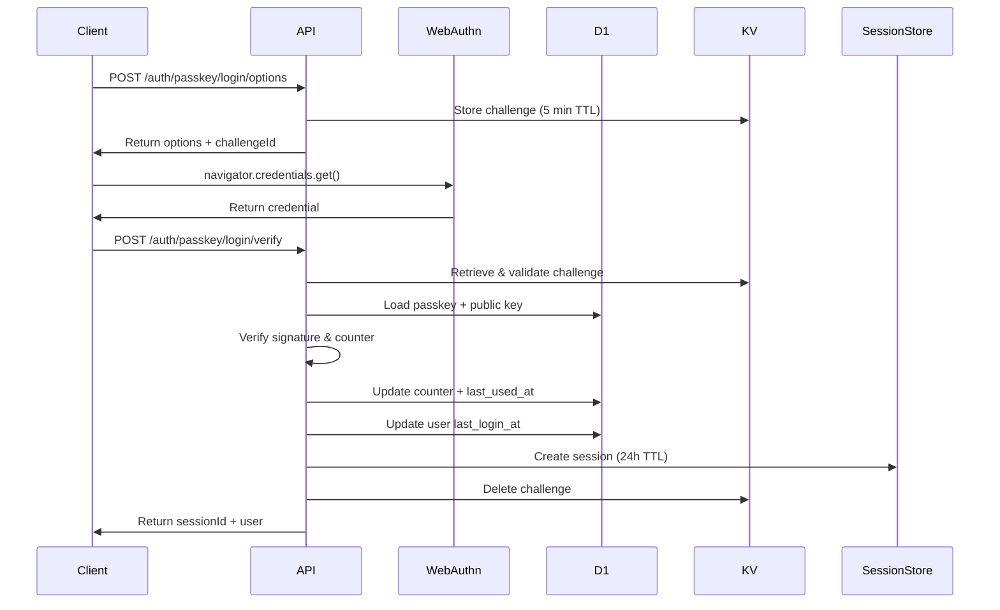

# Passkey (WebAuthn) API

## Overview

The Passkey API implements passwordless authentication using WebAuthn/FIDO2 standards. It provides secure, phishing-resistant authentication using biometric authenticators (Face ID, Touch ID, Windows Hello) or hardware security keys.

**Key Features:**
- Platform authenticator support (device-bound biometric)
- Resident key (discoverable credential) support
- Counter-based replay attack prevention
- Multi-device passkey management
- Automatic user creation on first registration

**Standards Compliance:**
- WebAuthn Level 2
- FIDO2 CTAP2
- Implements `@simplewebauthn/server`

## Base URL

```
https://your-domain.com/auth/passkey
```

## Endpoints

### 1. Generate Registration Options

Generate WebAuthn registration options for creating a new passkey.

**Endpoint:** `POST /auth/passkey/register/options`

**Request Body:**
```json
{
  "email": "user@example.com",
  "name": "John Doe",
  "userId": "optional-existing-user-id"
}
```

**Request Parameters:**
| Parameter | Type | Required | Description |
|-----------|------|----------|-------------|
| `email` | string | Yes | User's email address |
| `name` | string | No | User's display name (defaults to email prefix) |
| `userId` | string | No | Existing user ID (creates new user if not provided) |

**Response (200 OK):**
```json
{
  "options": {
    "challenge": "Gu0hYqrVjzsN3wz...",
    "rp": {
      "name": "Authrim",
      "id": "authrim.example.com"
    },
    "user": {
      "id": "dXNlcl8xMjM=",
      "name": "user@example.com",
      "displayName": "John Doe"
    },
    "pubKeyCredParams": [
      { "type": "public-key", "alg": -7 },
      { "type": "public-key", "alg": -257 }
    ],
    "timeout": 60000,
    "attestation": "none",
    "authenticatorSelection": {
      "residentKey": "required",
      "userVerification": "required"
    }
  },
  "userId": "user_123"
}
```

**Error Responses:**

| Status Code | Error | Description |
|-------------|-------|-------------|
| 400 | `invalid_request` | Email is missing or invalid |
| 500 | `server_error` | Failed to generate registration options |

**Example:**
```bash
curl -X POST https://your-domain.com/auth/passkey/register/options \
  -H "Content-Type: application/json" \
  -d '{
    "email": "user@example.com",
    "name": "John Doe"
  }'
```

**Browser Usage:**
```typescript
// 1. Get registration options from server
const { options, userId } = await fetch('/auth/passkey/register/options', {
  method: 'POST',
  headers: { 'Content-Type': 'application/json' },
  body: JSON.stringify({
    email: 'user@example.com',
    name: 'John Doe'
  })
}).then(r => r.json());

// 2. Create credential using WebAuthn API
const credential = await navigator.credentials.create({
  publicKey: options
});

// 3. Send credential to verification endpoint
// (see next section)
```

---

### 2. Verify Registration

Verify the WebAuthn registration response and store the passkey.

**Endpoint:** `POST /auth/passkey/register/verify`

**Request Body:**
```json
{
  "userId": "user_123",
  "credential": {
    "id": "Gu0hYqrVjzsN3wz...",
    "rawId": "Gu0hYqrVjzsN3wz...",
    "response": {
      "clientDataJSON": "eyJ0eXBlIjoid2ViYXV0aG4uY3JlYXRlIi...",
      "attestationObject": "o2NmbXRkbm9uZWdhdHRTdG10oGhhdXRoRGF0YVi..."
    },
    "type": "public-key",
    "transports": ["internal", "hybrid"]
  },
  "deviceName": "iPhone 15 Pro"
}
```

**Request Parameters:**
| Parameter | Type | Required | Description |
|-----------|------|----------|-------------|
| `userId` | string | Yes | User ID from registration options |
| `credential` | object | Yes | WebAuthn credential response |
| `deviceName` | string | No | Human-readable device name |

**Response (200 OK):**
```json
{
  "verified": true,
  "passkeyId": "pk_550e8400-e29b-41d4-a716-446655440000",
  "message": "Passkey registered successfully"
}
```

**Error Responses:**

| Status Code | Error | Description |
|-------------|-------|-------------|
| 400 | `invalid_request` | User ID or credential missing |
| 400 | `invalid_request` | Challenge not found or expired (5 min TTL) |
| 400 | `invalid_request` | Registration verification failed |
| 500 | `server_error` | Failed to verify registration |

**Example:**
```bash
curl -X POST https://your-domain.com/auth/passkey/register/verify \
  -H "Content-Type: application/json" \
  -d '{
    "userId": "user_123",
    "credential": {...},
    "deviceName": "iPhone 15 Pro"
  }'
```

**Browser Usage:**
```typescript
// After creating credential (see previous section)
const response = await fetch('/auth/passkey/register/verify', {
  method: 'POST',
  headers: { 'Content-Type': 'application/json' },
  body: JSON.stringify({
    userId: userId,
    credential: credential,
    deviceName: navigator.userAgent.match(/\(([^)]+)\)/)?.[1] || 'Unknown Device'
  })
});

const { verified, passkeyId } = await response.json();
if (verified) {
  console.log('Passkey registered:', passkeyId);
}
```

---

### 3. Generate Authentication Options

Generate WebAuthn authentication options for passkey login.

**Endpoint:** `POST /auth/passkey/login/options`

**Request Body:**
```json
{
  "email": "user@example.com"
}
```

**Request Parameters:**
| Parameter | Type | Required | Description |
|-----------|------|----------|-------------|
| `email` | string | No | User's email (if omitted, allows any passkey) |

**Response (200 OK):**
```json
{
  "options": {
    "challenge": "Gu0hYqrVjzsN3wz...",
    "timeout": 60000,
    "rpId": "authrim.example.com",
    "userVerification": "required",
    "allowCredentials": [
      {
        "type": "public-key",
        "id": "Gu0hYqrVjzsN3wz...",
        "transports": ["internal", "hybrid"]
      }
    ]
  },
  "challengeId": "challenge_550e8400-e29b-41d4-a716-446655440000"
}
```

**Error Responses:**

| Status Code | Error | Description |
|-------------|-------|-------------|
| 500 | `server_error` | Failed to generate authentication options |

**Example:**
```bash
curl -X POST https://your-domain.com/auth/passkey/login/options \
  -H "Content-Type: application/json" \
  -d '{
    "email": "user@example.com"
  }'
```

**Browser Usage:**
```typescript
// 1. Get authentication options
const { options, challengeId } = await fetch('/auth/passkey/login/options', {
  method: 'POST',
  headers: { 'Content-Type': 'application/json' },
  body: JSON.stringify({
    email: 'user@example.com' // Optional
  })
}).then(r => r.json());

// 2. Get credential using WebAuthn API
const credential = await navigator.credentials.get({
  publicKey: options
});

// 3. Send credential to verification endpoint
// (see next section)
```

---

### 4. Verify Authentication

Verify the WebAuthn authentication response and create a session.

**Endpoint:** `POST /auth/passkey/login/verify`

**Request Body:**
```json
{
  "challengeId": "challenge_550e8400-e29b-41d4-a716-446655440000",
  "credential": {
    "id": "Gu0hYqrVjzsN3wz...",
    "rawId": "Gu0hYqrVjzsN3wz...",
    "response": {
      "clientDataJSON": "eyJ0eXBlIjoid2ViYXV0aG4uZ2V0Ii...",
      "authenticatorData": "SZYN5YgOjGh0NBcPZHZgW4_krrmihjLHmV...",
      "signature": "MEUCIQDvZ...",
      "userHandle": "dXNlcl8xMjM="
    },
    "type": "public-key"
  }
}
```

**Request Parameters:**
| Parameter | Type | Required | Description |
|-----------|------|----------|-------------|
| `challengeId` | string | Yes | Challenge ID from authentication options |
| `credential` | object | Yes | WebAuthn credential response |

**Response (200 OK):**
```json
{
  "verified": true,
  "sessionId": "session_550e8400-e29b-41d4-a716-446655440000",
  "userId": "user_123",
  "user": {
    "id": "user_123",
    "email": "user@example.com",
    "name": "John Doe",
    "email_verified": true
  }
}
```

**Error Responses:**

| Status Code | Error | Description |
|-------------|-------|-------------|
| 400 | `invalid_request` | Challenge ID or credential missing |
| 400 | `invalid_request` | Challenge not found or expired (5 min TTL) |
| 400 | `invalid_request` | Passkey not found |
| 400 | `invalid_request` | Authentication verification failed |
| 500 | `server_error` | Failed to verify authentication |

**Example:**
```bash
curl -X POST https://your-domain.com/auth/passkey/login/verify \
  -H "Content-Type: application/json" \
  -d '{
    "challengeId": "challenge_550e8400-e29b-41d4-a716-446655440000",
    "credential": {...}
  }'
```

**Browser Usage:**
```typescript
// After getting credential (see previous section)
const response = await fetch('/auth/passkey/login/verify', {
  method: 'POST',
  headers: { 'Content-Type': 'application/json' },
  body: JSON.stringify({
    challengeId: challengeId,
    credential: credential
  })
});

const { verified, sessionId, user } = await response.json();
if (verified) {
  console.log('Logged in as:', user.email);
  // Store session ID in cookie or local storage
  document.cookie = `session_id=${sessionId}; path=/; secure; samesite=lax`;
}
```

---

## Security Considerations

### Challenge TTL
- Registration challenge: **5 minutes**
- Authentication challenge: **5 minutes**
- Challenges are single-use and deleted after verification

### Replay Attack Prevention
- Counter values are stored and validated for each passkey
- Counter must increment on each authentication
- Prevents replay attacks with captured authenticator responses

### Origin Validation
- Expected origin: `ISSUER_URL` environment variable
- Expected RP ID: hostname from `ISSUER_URL`
- Prevents phishing attacks

### Credential Storage
- Public keys stored as base64-encoded strings in D1
- Private keys never leave the user's device
- Credential IDs are globally unique (UUID v4)

---

## Data Storage

### D1 Tables

**users:**
- `id` - User UUID
- `email` - User email (unique)
- `name` - Display name
- `email_verified` - Set to 1 after successful passkey registration
- `created_at`, `updated_at`, `last_login_at`

**passkeys:**
- `id` - Passkey UUID
- `user_id` - Foreign key to users
- `credential_id` - WebAuthn credential ID (base64)
- `public_key` - Public key (base64)
- `counter` - Signature counter
- `transports` - JSON array of transports (internal, usb, nfc, ble, hybrid)
- `device_name` - Human-readable device name
- `created_at`, `last_used_at`

### KV Namespaces

**STATE_STORE:**
- `passkey_challenge:{userId}` - Registration challenge (5 min TTL)
- `passkey_auth_challenge:{challengeId}` - Authentication challenge (5 min TTL)

---

## Complete Authentication Flow

### Registration Flow



### Authentication Flow



---

## Rate Limiting

Currently no rate limiting is implemented for passkey endpoints. Recommended limits:

| Endpoint | Limit | Period | Unit |
|----------|-------|--------|------|
| `register/options` | 5 | 1 min | IP |
| `register/verify` | 5 | 1 min | IP |
| `login/options` | 10 | 1 min | IP |
| `login/verify` | 10 | 1 min | IP |

---

## Browser Compatibility

**Supported Browsers:**
- Chrome 67+ (desktop and mobile)
- Safari 14+ (iOS 14+, macOS 11+)
- Firefox 60+
- Edge 18+

**Platform Authenticators:**
- **iOS/macOS:** Face ID, Touch ID
- **Windows:** Windows Hello (fingerprint, face, PIN)
- **Android:** Fingerprint, face unlock

**Feature Detection:**
```typescript
if (window.PublicKeyCredential) {
  // WebAuthn supported
  const available = await PublicKeyCredential.isUserVerifyingPlatformAuthenticatorAvailable();
  if (available) {
    // Platform authenticator available
  }
}
```

---

## Testing

**Unit Tests:** `/packages/op-auth/src/__tests__/passkey.test.ts`

**Manual Testing:**
```bash
# 1. Register a passkey
curl -X POST http://localhost:8787/auth/passkey/register/options \
  -H "Content-Type: application/json" \
  -d '{"email":"test@example.com","name":"Test User"}'

# 2. Complete registration in browser
# 3. Test authentication
curl -X POST http://localhost:8787/auth/passkey/login/options \
  -H "Content-Type: application/json" \
  -d '{"email":"test@example.com"}'
```

**Integration Testing:**
- Requires browser automation (Playwright, Puppeteer)
- Virtual authenticators for testing without physical device

---

## Related Documentation

- [SessionStore Durable Object](../durable-objects/SessionStore.md)
- [Database Schema](../../architecture/database-schema.md)
- [WebAuthn Specification](https://www.w3.org/TR/webauthn-2/)
- [@simplewebauthn/server](https://simplewebauthn.dev/docs/packages/server)

---

## Change History

- **2025-11-13**: Initial implementation (Phase 5, Stage 2)
  - Registration and authentication endpoints
  - Platform authenticator support
  - Counter-based replay protection
