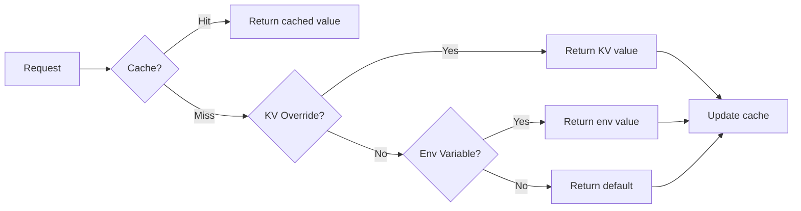

# Policy Configuration Guide

**Version**: 0.1.0
**Last Updated**: 2025-12-03

---

## Overview

Authrim's policy system uses a **hybrid configuration approach**:

1. **Environment Variables** - Deploy-time defaults
2. **KV Storage** - Dynamic overrides (no deploy required)

**Priority**: Cache > KV Override > Environment Variable > Default Value

---

## Feature Flags

### Available Flags

| Flag | Default | Description |
|------|---------|-------------|
| `ENABLE_ABAC` | `false` | Enable Attribute-Based Access Control |
| `ENABLE_REBAC` | `false` | Enable Relationship-Based Access Control |
| `ENABLE_POLICY_LOGGING` | `false` | Enable detailed policy evaluation logging |
| `ENABLE_VERIFIED_ATTRIBUTES` | `false` | Enable verified attributes checking |
| `ENABLE_CUSTOM_RULES` | `true` | Enable custom policy rules |
| `ENABLE_SD_JWT` | `false` | Enable Selective Disclosure JWT |
| `ENABLE_POLICY_EMBEDDING` | `false` | Enable permission embedding in Access Token |

### Flag Behavior



---

## Configuration Methods

### Method 1: Environment Variables (Deploy-time)

Set in `wrangler.toml`:

```toml
[vars]
# Feature Flags
ENABLE_ABAC = "false"
ENABLE_REBAC = "false"
ENABLE_POLICY_LOGGING = "false"
ENABLE_VERIFIED_ATTRIBUTES = "false"
ENABLE_CUSTOM_RULES = "true"
ENABLE_SD_JWT = "false"
ENABLE_POLICY_EMBEDDING = "false"

# Token Claims Configuration
RBAC_ID_TOKEN_CLAIMS = "roles,user_type,org_id,plan,org_type"
RBAC_ACCESS_TOKEN_CLAIMS = "roles,org_id,org_type"
```

**Pros**: Version controlled, consistent across deploys
**Cons**: Requires deploy to change

---

### Method 2: KV Storage (Runtime)

Override flags dynamically via KV:

```bash
# Using wrangler CLI
wrangler kv:key put --namespace-id=<SETTINGS_KV_ID> \
  "policy:flags:ENABLE_POLICY_EMBEDDING" "true"

# Clear override (revert to env/default)
wrangler kv:key delete --namespace-id=<SETTINGS_KV_ID> \
  "policy:flags:ENABLE_POLICY_EMBEDDING"
```

**Pros**: No deploy required, instant changes
**Cons**: Not version controlled

---

### Method 3: Admin UI (Recommended)

Navigate to `/admin/policy` in the Admin Dashboard.

#### Features:
- Toggle Feature Flags on/off
- Configure Token Claims
- View current settings with their sources (KV/Env/Default)
- Warning indicators for OIDC conformance impact

---

### Method 4: Admin API

#### Get Current Settings

```bash
curl -X GET https://your-domain.com/api/admin/settings \
  -H "Authorization: Bearer <ADMIN_TOKEN>"
```

**Response:**
```json
{
  "settings": {
    "policy": {
      "enableAbac": false,
      "enableRebac": false,
      "enablePolicyLogging": false,
      "enableVerifiedAttributes": false,
      "enableCustomRules": true,
      "enableSdJwt": false,
      "enablePolicyEmbedding": false,
      "accessTokenClaims": "roles,org_id,org_type",
      "idTokenClaims": "roles,user_type,org_id,plan,org_type"
    }
  }
}
```

#### Update Settings

```bash
curl -X PUT https://your-domain.com/api/admin/settings \
  -H "Authorization: Bearer <ADMIN_TOKEN>" \
  -H "Content-Type: application/json" \
  -d '{
    "settings": {
      "policy": {
        "enablePolicyEmbedding": true,
        "accessTokenClaims": "roles,org_id,org_type,permissions"
      }
    }
  }'
```

---

### Method 5: Policy Service API

Direct flag management via Policy Service:

#### Get Flag Sources (Debug)

```bash
curl -X GET https://your-domain.com/policy/flags \
  -H "Authorization: Bearer <POLICY_API_SECRET>"
```

**Response:**
```json
{
  "flags": {
    "ENABLE_ABAC": { "value": false, "source": "default" },
    "ENABLE_REBAC": { "value": false, "source": "default" },
    "ENABLE_POLICY_EMBEDDING": { "value": true, "source": "kv" }
  },
  "kvEnabled": true
}
```

#### Set Flag Override

```bash
curl -X PUT https://your-domain.com/policy/flags/ENABLE_POLICY_EMBEDDING \
  -H "Authorization: Bearer <POLICY_API_SECRET>" \
  -H "Content-Type: application/json" \
  -d '{ "value": true }'
```

#### Clear Flag Override

```bash
curl -X DELETE https://your-domain.com/policy/flags/ENABLE_POLICY_EMBEDDING \
  -H "Authorization: Bearer <POLICY_API_SECRET>"
```

---

## Token Claims Configuration

### ID Token Claims

| Key | Description |
|-----|-------------|
| `roles` | User's effective role names |
| `scoped_roles` | Roles with scope information |
| `user_type` | User type classification |
| `org_id` | Primary organization ID |
| `org_name` | Organization name |
| `plan` | Subscription plan |
| `org_type` | Organization type |
| `orgs` | All user's organizations |
| `relationships_summary` | Relationship summary |

### Access Token Claims

| Key | Description |
|-----|-------------|
| `roles` | User's effective role names |
| `scoped_roles` | Roles with scope information |
| `org_id` | Primary organization ID |
| `org_type` | Organization type |
| `permissions` | Evaluated permissions (requires `ENABLE_POLICY_EMBEDDING`) |
| `org_context` | Acting organization context |

### Configuration Examples

**Minimal (Default):**
```toml
RBAC_ID_TOKEN_CLAIMS = "roles,user_type,org_id,plan,org_type"
RBAC_ACCESS_TOKEN_CLAIMS = "roles,org_id,org_type"
```

**Full Claims:**
```toml
RBAC_ID_TOKEN_CLAIMS = "roles,scoped_roles,user_type,org_id,org_name,plan,org_type,orgs,relationships_summary"
RBAC_ACCESS_TOKEN_CLAIMS = "roles,scoped_roles,org_id,org_type,permissions,org_context"
```

**Permission-focused:**
```toml
RBAC_ID_TOKEN_CLAIMS = "roles,org_id"
RBAC_ACCESS_TOKEN_CLAIMS = "permissions"  # Requires ENABLE_POLICY_EMBEDDING=true
```

---

## KV Namespace Setup

### Required KV Namespaces

| Binding Name | Purpose |
|--------------|---------|
| `SETTINGS` | System settings storage |
| `POLICY_FLAGS_KV` | Policy feature flags (optional, can use SETTINGS) |
| `REBAC_CACHE` | RBAC claims cache |

### Wrangler Configuration

```toml
# wrangler.toml
[[kv_namespaces]]
binding = "SETTINGS"
id = "your-settings-kv-id"

[[kv_namespaces]]
binding = "REBAC_CACHE"
id = "your-rebac-cache-kv-id"
```

---

## OIDC Conformance Notes

### Safe to Enable

These flags don't affect OIDC conformance:
- `ENABLE_POLICY_LOGGING`
- `ENABLE_CUSTOM_RULES`

### Use with Caution

These flags add custom claims (use `authrim_` prefix, so technically safe):
- `ENABLE_POLICY_EMBEDDING` - Adds `authrim_permissions` to Access Token
- `ENABLE_SD_JWT` - Changes ID Token format

### Testing Recommendation

1. Run OIDC conformance tests with default settings first
2. Enable features incrementally
3. Re-run conformance tests after each change

---

## Troubleshooting

### Flag Not Taking Effect

1. Check priority: KV override may be blocking env variable
2. Clear cache: Flags are cached for 60 seconds
3. Verify KV binding: Check `kvEnabled` in `/policy/flags` response

### Permission Embedding Not Working

1. Verify `ENABLE_POLICY_EMBEDDING` is `true`
2. Check `RBAC_ACCESS_TOKEN_CLAIMS` includes `permissions`
3. Ensure custom scopes are in format `{resource}:{action}`
4. Standard OIDC scopes (openid, profile, etc.) are skipped

### Cache Issues

Clear cache by calling:
```bash
# Policy Service restart clears in-memory cache
# Or wait for 60-second TTL to expire
```

---

## Related Documents

- [Token Embedding Specification](./TOKEN_EMBEDDING.md)
- [Policy Service API](./README.md)
- [RBAC Implementation Plan](../../project-management/RBAC_IMPLEMENTATION_PLAN.md)

---

> **Last Updated**: 2025-12-03
