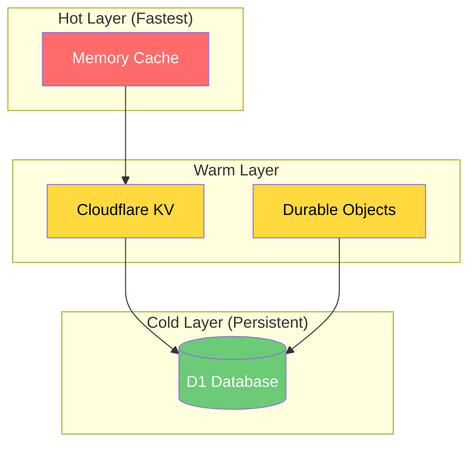
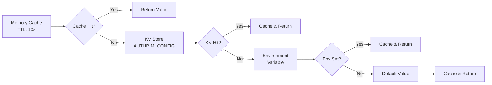
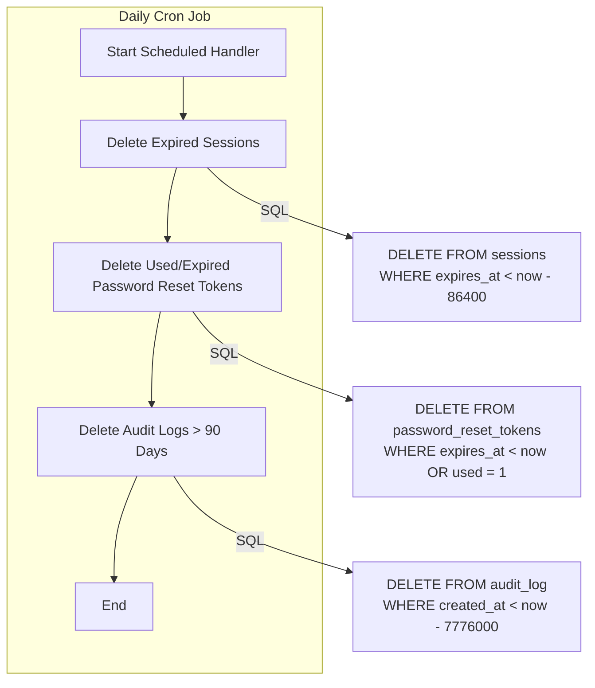

# Authrim Storage & Configuration Reference

This document provides a comprehensive reference for all storage systems, configuration values, and data lifecycle management in the Authrim project.

## Table of Contents

1. [Overview](#1-overview)
2. [D1 Database Tables](#2-d1-database-tables)
3. [D1 JSON Column Structures](#3-d1-json-column-structures)
4. [Durable Objects](#4-durable-objects)
5. [DO Data Structures](#5-do-data-structures)
6. [KV Namespaces](#6-kv-namespaces)
7. [KV JSON Cache Structures](#7-kv-json-cache-structures)
8. [Environment Variables](#8-environment-variables)
9. [Feature Flags](#9-feature-flags)
10. [Token Claims](#10-token-claims)
11. [Cache TTL Summary](#11-cache-ttl-summary)
12. [Auto-Cleanup Summary](#12-auto-cleanup-summary)

---

## 1. Overview

### Architecture

Authrim uses a multi-tier storage architecture optimized for performance and reliability:



### Configuration Priority

Configuration values follow this priority order (highest to lowest):



### Key Files

| Component | File Path |
|-----------|-----------|
| KV Utilities | `packages/shared/src/utils/kv.ts` |
| OAuth Config | `packages/shared/src/utils/oauth-config.ts` |
| Environment Types | `packages/shared/src/types/env.ts` |
| Feature Flags | `packages/policy-core/src/feature-flags.ts` |
| Scheduled Cleanup | `packages/op-management/src/index.ts` |
| Durable Objects | `packages/shared/src/durable-objects/*.ts` |

---

## 2. D1 Database Tables

All packages share the same D1 database (`conformance-authrim-users-db`).

### Core Tables

| Table | Purpose | Auto-Cleanup |
|-------|---------|--------------|
| `users` | User accounts and profile data | None |
| `user_custom_fields` | Custom user attributes | None |
| `passkeys` | WebAuthn/Passkey credentials | None |
| `password_reset_tokens` | Password reset requests | **Cron**: `expires_at < now OR used = 1` |
| `oauth_clients` | OAuth 2.0 client registrations | None |
| `sessions` | User sessions | **Cron**: `expires_at < now - 86400` (1-day grace) |
| `roles` | RBAC role definitions | None |
| `user_roles` | User-to-role assignments | None |
| `scope_mappings` | Scope-to-claim mappings | None |
| `branding_settings` | UI customization | None |
| `identity_providers` | External IdP configurations | None |
| `audit_log` | Security audit events | **Cron**: `created_at < 90 days ago` |

### OAuth Flow Tables

| Table | Purpose | Auto-Cleanup |
|-------|---------|--------------|
| `device_codes` | RFC 8628 Device Authorization | **DO Alarm** + D1 sync |
| `ciba_requests` | CIBA authentication requests | **DO Alarm** + D1 sync |
| `user_token_families` | Refresh token family tracking (V3) | None (logical revocation) |
| `refresh_token_shard_configs` | Sharding configuration history | None |

### RBAC Tables

| Table | Purpose | Auto-Cleanup |
|-------|---------|--------------|
| `organizations` | Organization hierarchy | None |
| `role_assignments` | Scoped role assignments | None |
| `relationships` | ReBAC relationships | None |

---

## 3. D1 JSON Column Structures

### users

| Column | Structure |
|--------|-----------|
| `address_json` | `{formatted?, street_address?, locality?, region?, postal_code?, country?}` |
| `custom_attributes_json` | `{[fieldName: string]: any}` |

### oauth_clients

| Column | Structure |
|--------|-----------|
| `redirect_uris` | `["https://example.com/callback", ...]` |
| `grant_types` | `["authorization_code", "refresh_token", "implicit", "client_credentials", "urn:ietf:params:oauth:grant-type:device_code", "urn:openid:params:grant-type:ciba"]` |
| `response_types` | `["code", "token", "id_token", "code token", "code id_token", "token id_token", "code token id_token"]` |
| `contacts` | `["admin@example.com", ...]` |
| `jwks` | `{keys: [{kty: "RSA", use: "sig", kid: "...", n: "...", e: "AQAB"}]}` |

### branding_settings

| Column | Structure |
|--------|-----------|
| `enabled_auth_methods` | `["passkey", "magic_link", "password", "email_code", "sms_code"]` |
| `password_policy_json` | `{minLength: 8, requireUppercase: true, requireLowercase: true, requireNumbers: true, requireSpecialChars: true, expiryDays?: 90, historyCount?: 5}` |

### identity_providers

| Column | Structure (SAML) |
|--------|-----------|
| `config_json` | `{metadata_url: "https://...", entity_id: "https://...", sso_url: "https://...", certificate: "-----BEGIN CERTIFICATE-----...", binding: "urn:oasis:names:tc:SAML:2.0:bindings:HTTP-POST"}` |

### roles

| Column | Structure |
|--------|-----------|
| `permissions_json` | `["users:read", "users:create", "users:update", "users:delete", "organizations:read", "clients:manage"]` |

### organizations

| Column | Structure |
|--------|-----------|
| `metadata_json` | `{industry?: string, size?: string, [key: string]: any}` |

### relationships

| Column | Structure |
|--------|-----------|
| `metadata_json` | `{constraints?: {ip_allowlist?: string[], time_window?: string}, notes?: string}` |

### audit_log

| Column | Structure |
|--------|-----------|
| `metadata_json` | `{action_details?: string, error_code?: string, status_code?: number, duration_ms?: number, [key: string]: any}` |

---

## 4. Durable Objects

### DO Class Overview

| DO Class | File | Cleanup Method | Interval | Default TTL |
|----------|------|----------------|----------|-------------|
| `SessionStore` | SessionStore.ts | `setInterval` | 5 min | 7200s (2h) |
| `AuthorizationCodeStore` | AuthorizationCodeStore.ts | `setInterval` | 30s | 60s |
| `RefreshTokenRotator` | RefreshTokenRotator.ts | None | - | 2592000s (30d) |
| `KeyManager` | KeyManager.ts | None | - | - |
| `ChallengeStore` | ChallengeStore.ts | `setInterval` | 5 min | Variable |
| `RateLimiterCounter` | RateLimiterCounter.ts | None | - | - |
| `PARRequestStore` | PARRequestStore.ts | `setInterval` | 5 min | 600s (10m) |
| `DPoPJTIStore` | DPoPJTIStore.ts | `setInterval` | 5 min | Token expiry |
| `TokenRevocationStore` | TokenRevocationStore.ts | `setInterval` | 5 min | Token expiry |
| `DeviceCodeStore` | DeviceCodeStore.ts | **`setAlarm`** | 5 min | 600s (10m) |
| `CIBARequestStore` | CIBARequestStore.ts | **`setAlarm`** | 5 min | 600s (10m) |
| `VersionManager` | VersionManager.ts | None | - | - |
| `SAMLRequestStore` | SAMLRequestStore.ts | None | - | - |

### DO Access Patterns

| Package | DOs Used |
|---------|----------|
| `op-auth` | SESSION_STORE, AUTH_CODE_STORE, CHALLENGE_STORE, PAR_REQUEST_STORE |
| `op-token` | AUTH_CODE_STORE, REFRESH_TOKEN_ROTATOR, DEVICE_CODE_STORE, CIBA_REQUEST_STORE, DPOP_JTI_STORE |
| `op-async` | DEVICE_CODE_STORE, CIBA_REQUEST_STORE, USER_CODE_RATE_LIMITER |
| `op-management` | SESSION_STORE, REFRESH_TOKEN_ROTATOR (revocation) |

---

## 5. DO Data Structures

### SessionStore

```typescript
interface Session {
  id: string;                    // UUID
  userId: string;                // User ID
  expiresAt: number;             // Expiry timestamp (ms)
  createdAt: number;             // Creation timestamp (ms)
  data?: {
    amr?: string[];              // Authentication Methods References
    acr?: string;                // Authentication Context Class Reference
    deviceName?: string;         // Device identifier
    ipAddress?: string;          // Client IP
    userAgent?: string;          // Browser user agent
  };
}
```

**Storage**: Hot (Memory) + Cold (Durable Storage + D1)

### AuthorizationCodeStore

```typescript
interface AuthorizationCode {
  code: string;                  // The authorization code
  clientId: string;              // Client ID
  redirectUri: string;           // Redirect URI
  userId: string;                // User ID
  scope: string;                 // Space-separated scopes
  codeChallenge?: string;        // PKCE challenge (S256)
  codeChallengeMethod?: 'S256' | 'plain';
  nonce?: string;                // OIDC nonce
  state?: string;                // OAuth state
  claims?: string;               // OIDC claims parameter (JSON string)
  authTime?: number;             // Authentication time
  acr?: string;                  // ACR value
  dpopJkt?: string;              // DPoP JWK Thumbprint
  used: boolean;                 // One-time use flag
  expiresAt: number;             // Expiry timestamp (ms)
  createdAt: number;             // Creation timestamp (ms)
  issuedAccessTokenJti?: string; // Replay attack detection
  issuedRefreshTokenJti?: string;
}
```

**Sharding**: `AUTHRIM_CODE_SHARDS` environment variable (default: 64)

### RefreshTokenRotator (V2/V3)

```typescript
interface TokenFamilyV2 {
  version: number;               // Rotation version (monotonic)
  last_jti: string;              // Last issued JTI
  last_used_at: number;          // Last usage timestamp (ms)
  expires_at: number;            // Absolute expiry (ms)
  user_id: string;               // User ID (tenant boundary)
  client_id: string;             // Client ID
  allowed_scope: string;         // Allowed scope (amplification prevention)
}
```

**V3 JTI Format**: `v{generation}_{shardIndex}_{randomPart}`

**Theft Detection**: If `incomingVersion < family.version` → revoke entire family

### DeviceCodeStore (V2)

```typescript
interface DeviceCodeV2 {
  device_code: string;           // Device verification code
  user_code: string;             // User-facing code (8 chars)
  client_id: string;             // Client ID
  scope: string;                 // Requested scopes
  status: 'pending' | 'approved' | 'denied' | 'expired';
  created_at: number;            // Creation timestamp (ms)
  expires_at: number;            // Expiry timestamp (ms)
  last_poll_at?: number;         // Last poll timestamp
  poll_count?: number;           // Poll attempts
  user_id?: string;              // User ID (set on approval)
  sub?: string;                  // Subject identifier
  token_issued?: boolean;        // One-time use flag
  token_issued_at?: number;      // Token issuance timestamp
}
```

**Storage Keys**:
- `d:{device_code}` → DeviceCodeV2
- `u:{user_code}` → device_code (mapping)

### CIBARequestStore (V2)

```typescript
interface CIBARequestV2 {
  auth_req_id: string;           // Authentication request ID
  client_id: string;             // Client ID
  scope: string;                 // Requested scopes
  login_hint?: string;           // Login hint (email/phone)
  login_hint_token?: string;     // Login hint JWT
  id_token_hint?: string;        // Previously issued ID token
  binding_message?: string;      // User-facing message
  user_code?: string;            // Optional confirmation code
  acr_values?: string;           // ACR values
  requested_expiry?: number;     // Client-requested expiry
  status: 'pending' | 'approved' | 'denied' | 'expired';
  delivery_mode: 'poll' | 'ping' | 'push';
  client_notification_token?: string;    // For ping/push
  client_notification_endpoint?: string; // Callback URL
  created_at: number;            // Creation timestamp (ms)
  expires_at: number;            // Expiry timestamp (ms)
  last_poll_at?: number;         // Last poll timestamp
  poll_count?: number;           // Poll attempts
  interval: number;              // Minimum poll interval (seconds)
  user_id?: string;              // User ID (set on approval)
  sub?: string;                  // Subject identifier
  nonce?: string;                // OIDC nonce
  token_issued?: boolean;        // One-time use flag
  token_issued_at?: number;      // Token issuance timestamp
}
```

---

## 6. KV Namespaces

| Namespace | Binding | Purpose | TTL |
|-----------|---------|---------|-----|
| `STATE_STORE` | STATE_STORE | OAuth 2.0 state parameter | 300s |
| `NONCE_STORE` | NONCE_STORE | OIDC nonce parameter | 300s |
| `CLIENTS_CACHE` | CLIENTS_CACHE | Client metadata read-through cache | 3600s |
| `USER_CACHE` | USER_CACHE | User metadata read-through cache | 3600s |
| `REBAC_CACHE` | REBAC_CACHE | ReBAC check results | 60s |
| `SETTINGS` | SETTINGS | System settings, policy flags | Permanent |
| `AUTHRIM_CONFIG` | AUTHRIM_CONFIG | OAuth config overrides | Permanent |

### Key Patterns

| Namespace | Key Pattern | Value |
|-----------|-------------|-------|
| STATE_STORE | `tenant:{tenantId}:state:{stateValue}` | client_id (string) |
| NONCE_STORE | `tenant:{tenantId}:nonce:{nonceValue}` | client_id (string) |
| CLIENTS_CACHE | `tenant:{tenantId}:client:{clientId}` | JSON (see below) |
| USER_CACHE | `tenant:{tenantId}:user:{userId}` | JSON (see below) |
| REBAC_CACHE | `rebac:check:{tenantId}:{userId}:{relation}:{objectType}:{objectId}` | JSON (see below) |
| SETTINGS | `system_settings` | JSON (OIDC settings) |
| SETTINGS | `policy:flags:{FLAG_NAME}` | "true" / "false" |
| SETTINGS | `policy:claims:access_token` | Comma-separated claims |
| SETTINGS | `policy:claims:id_token` | Comma-separated claims |
| AUTHRIM_CONFIG | `oauth:config:{CONFIG_NAME}` | Numeric/boolean string |
| AUTHRIM_CONFIG | `code_shards` | Shard count (string) |

---

## 7. KV JSON Cache Structures

### CLIENTS_CACHE

```typescript
interface CachedClient {
  client_id: string;
  client_name: string;
  client_secret?: string;        // Only for confidential clients
  redirect_uris: string[];
  grant_types: string[];
  response_types: string[];
  scope?: string;
  token_endpoint_auth_method: string;
  is_trusted: boolean;
  skip_consent: boolean;
  id_token_encrypted_response_alg?: string;
  id_token_encrypted_response_enc?: string;
  userinfo_signed_response_alg?: string;
  jwks?: { keys: JWK[] };
  jwks_uri?: string;
  backchannel_token_delivery_mode?: 'poll' | 'ping' | 'push';
  backchannel_client_notification_endpoint?: string;
  id_token_signed_response_type?: 'jwt' | 'sd-jwt';
  sd_jwt_selective_claims?: string[];
}
```

### USER_CACHE

```typescript
interface CachedUser {
  id: string;
  email: string;
  email_verified: boolean;
  name?: string;
  picture?: string;
  locale?: string;
  phone_number?: string;
  phone_number_verified?: boolean;
  address?: string;              // JSON string
  birthdate?: string;            // YYYY-MM-DD
  gender?: string;
  profile?: string;
  website?: string;
  zoneinfo?: string;
  updated_at: number;
}
```

### REBAC_CACHE

```typescript
interface CachedCheckResponse {
  result: {
    allowed: boolean;
    resolved_via?: 'direct' | 'computed' | 'cache' | 'closure';
    path?: string[];
  };
  cached_at: number;
}
```

### AUTHRIM_CONFIG (Refresh Token Sharding)

```typescript
interface ShardingConfig {
  currentGeneration: number;
  currentShardCount: number;
  previousGenerations: Array<{
    generation: number;
    shardCount: number;
    deprecatedAt: number;        // Timestamp (ms)
  }>;
  updatedAt: number;
}
```

---

## 8. Environment Variables

### OAuth/OIDC Settings

| Variable | Default | KV Override Key | Min | Max | Unit |
|----------|---------|-----------------|-----|-----|------|
| `TOKEN_EXPIRY` | 3600 | `oauth:config:TOKEN_EXPIRY` | 60 | 86400 | seconds |
| `AUTH_CODE_TTL` | 60 | `oauth:config:AUTH_CODE_TTL` | 10 | 86400 | seconds |
| `STATE_EXPIRY` | 300 | `oauth:config:STATE_EXPIRY` | 60 | 3600 | seconds |
| `NONCE_EXPIRY` | 300 | `oauth:config:NONCE_EXPIRY` | 60 | 3600 | seconds |
| `REFRESH_TOKEN_EXPIRY` | 2592000 | `oauth:config:REFRESH_TOKEN_EXPIRY` | 3600 | 31536000 | seconds |
| `REFRESH_TOKEN_ROTATION_ENABLED` | true | `oauth:config:REFRESH_TOKEN_ROTATION_ENABLED` | - | - | boolean |
| `MAX_CODES_PER_USER` | 100 | `oauth:config:MAX_CODES_PER_USER` | 10 | 1000000 | count |
| `AUTHRIM_CODE_SHARDS` | 64 | `code_shards` | 1 | 256 | count |

### Security Settings

| Variable | Default | Description |
|----------|---------|-------------|
| `ALLOW_HTTP_REDIRECT` | false | Allow non-HTTPS redirect URIs |
| `OPEN_REGISTRATION` | false | Allow public user registration |
| `TRUSTED_DOMAINS` | "" | Comma-separated trusted domains |
| `KEY_MANAGER_SECRET` | - | Secret for key management |

### URL Settings

| Variable | Description |
|----------|-------------|
| `ISSUER_URL` | OAuth/OIDC issuer URL |
| `UI_BASE_URL` | Login UI base URL |
| `KEY_ID` | Current signing key ID |

---

## 9. Feature Flags

All feature flags default to `false` for OIDC conformance test compatibility.

| Flag | KV Key | Description |
|------|--------|-------------|
| `ENABLE_ABAC` | `policy:flags:ENABLE_ABAC` | Attribute-Based Access Control |
| `ENABLE_REBAC` | `policy:flags:ENABLE_REBAC` | Relationship-Based Access Control |
| `ENABLE_POLICY_LOGGING` | `policy:flags:ENABLE_POLICY_LOGGING` | Detailed policy evaluation logs |
| `ENABLE_VERIFIED_ATTRIBUTES` | `policy:flags:ENABLE_VERIFIED_ATTRIBUTES` | Verified attribute checking |
| `ENABLE_CUSTOM_RULES` | `policy:flags:ENABLE_CUSTOM_RULES` | Custom policy rules (default: true) |
| `ENABLE_SD_JWT` | `policy:flags:ENABLE_SD_JWT` | Selective Disclosure JWT (RFC 9901) |
| `ENABLE_POLICY_EMBEDDING` | `policy:flags:ENABLE_POLICY_EMBEDDING` | Embed permissions in access token |
| `ENABLE_HTTPS_REQUEST_URI` | `oidc.httpsRequestUri.enabled` | Allow external HTTPS request_uri |

### RBAC Consent Settings

| Variable | Description |
|----------|-------------|
| `RBAC_CONSENT_ORG_SELECTOR` | Show organization selector on consent |
| `RBAC_CONSENT_ACTING_AS` | Enable acting-as (delegation) feature |
| `RBAC_CONSENT_SHOW_ROLES` | Display roles on consent screen |

---

## 10. Token Claims

### ID Token Claims

```typescript
interface IDTokenClaims {
  // Standard JWT Claims
  iss: string;                   // Issuer
  sub: string;                   // Subject (user ID)
  aud: string;                   // Audience (client ID)
  exp: number;                   // Expiration (seconds)
  iat: number;                   // Issued at (seconds)

  // OIDC Optional Claims
  auth_time?: number;            // Authentication time
  nonce?: string;                // Replay attack prevention
  at_hash?: string;              // Access token hash
  c_hash?: string;               // Code hash (hybrid flow)
  acr?: string;                  // Authentication Context Class Reference
  amr?: string[];                // Authentication Methods References
  azp?: string;                  // Authorized party

  // Profile Claims
  name?: string;
  given_name?: string;
  family_name?: string;
  middle_name?: string;
  nickname?: string;
  preferred_username?: string;
  profile?: string;
  picture?: string;
  website?: string;
  gender?: string;
  birthdate?: string;            // YYYY-MM-DD
  zoneinfo?: string;
  locale?: string;
  updated_at?: number;

  // Contact Claims
  email?: string;
  email_verified?: boolean;
  phone_number?: string;
  phone_number_verified?: boolean;
  address?: {
    formatted?: string;
    street_address?: string;
    locality?: string;
    region?: string;
    postal_code?: string;
    country?: string;
  };

  // Authrim RBAC Claims (authrim_ prefix)
  authrim_roles?: string[];
  authrim_scoped_roles?: Array<{
    name: string;
    scope: string;
    scopeTarget?: string;
  }>;
  authrim_user_type?: 'end_user' | 'distributor_admin' | 'enterprise_admin' | 'system_admin';
  authrim_org_id?: string;
  authrim_org_name?: string;
  authrim_plan?: 'free' | 'starter' | 'professional' | 'enterprise';
  authrim_org_type?: 'distributor' | 'enterprise' | 'department';
  authrim_orgs?: Array<{
    id: string;
    name: string;
    type: string;
    is_primary: boolean;
  }>;
  authrim_relationships_summary?: {
    children_ids: string[];
    parent_ids: string[];
  };
  authrim_permissions?: string[];
  authrim_org_context?: {
    acting_as_org_id?: string;
    on_behalf_of_org_id?: string;
  };
}
```

### Access Token Claims

```typescript
interface AccessTokenClaims {
  // Standard JWT Claims
  iss: string;                   // Issuer
  sub: string;                   // Subject (user ID)
  aud: string;                   // Audience (resource server)
  exp: number;                   // Expiration (seconds)
  iat: number;                   // Issued at (seconds)
  jti: string;                   // JWT ID (for revocation)

  // OAuth Claims
  scope: string;                 // Space-separated scopes
  client_id?: string;            // Client ID
  token_type?: 'Bearer' | 'DPoP';

  // Refresh Token Tracking
  rtv?: number;                  // Refresh token version (theft detection)

  // Authrim RBAC Claims
  authrim_roles?: string[];
  authrim_org_id?: string;
  authrim_org_type?: string;
  authrim_permissions?: string[];
  authrim_org_context?: {
    acting_as_org_id?: string;
    on_behalf_of_org_id?: string;
  };
}
```

---

## 11. Cache TTL Summary

### Memory Cache (In-Worker)

| Component | TTL | Invalidation |
|-----------|-----|--------------|
| OAuth Config | 10 seconds | On KV change |
| Signing Key | 10 minutes | On kid mismatch |
| JWKS (Verification Keys) | 5 minutes | On kid not found |
| Discovery Metadata | On config hash change | Immediate |
| Shard Count | 10 seconds | On KV change |

### KV Cache

| Namespace | TTL | Invalidation |
|-----------|-----|--------------|
| STATE_STORE | 300 seconds | Automatic expiry |
| NONCE_STORE | 300 seconds | Automatic expiry |
| CLIENTS_CACHE | 3600 seconds | Manual delete on update |
| USER_CACHE | 3600 seconds | `invalidateUserCache()` |
| REBAC_CACHE | 60 seconds | `invalidateObject()` / `invalidateUser()` |
| SETTINGS | Permanent | Manual update |
| AUTHRIM_CONFIG | Permanent | Manual update |

### Durable Object Cache

| DO | Memory TTL | Persistence |
|----|------------|-------------|
| SessionStore | Until eviction | Durable Storage + D1 |
| AuthorizationCodeStore | CODE_TTL (60s) | Durable Storage |
| RefreshTokenRotator | Until eviction | Durable Storage + D1 audit |
| DeviceCodeStore | Until expiry | Durable Storage + D1 |
| CIBARequestStore | Until expiry | Durable Storage + D1 |

---

## 12. Auto-Cleanup Summary

### Cron Scheduled Cleanup (op-management)



### Durable Object Cleanup

| DO | Method | Trigger | Action |
|----|--------|---------|--------|
| SessionStore | setInterval | Every 5 min | Delete expired from memory + D1 |
| AuthorizationCodeStore | setInterval | Every 30 sec | Delete expired codes |
| DeviceCodeStore | **setAlarm** | On expiry | Delete from Durable Storage + D1 |
| CIBARequestStore | **setAlarm** | On expiry | Delete from Durable Storage + D1 |
| DPoPJTIStore | setInterval | Every 5 min | Delete expired JTIs |
| TokenRevocationStore | setInterval | Every 5 min | Delete naturally expired tokens |
| ChallengeStore | setInterval | Every 5 min | Delete expired challenges |
| PARRequestStore | setInterval | Every 5 min | Delete expired request_uris |

### Data Lifecycle Timeline

```mermaid
gantt
    title Data Expiration Timeline
    dateFormat X
    axisFormat %s

    section Tokens
    Authorization Code (60s)     :0, 60
    State Parameter (300s)       :0, 300
    Nonce Parameter (300s)       :0, 300
    Device Code (600s)           :0, 600
    CIBA Request (600s)          :0, 600
    Access Token (3600s)         :0, 3600
    Session (7200s)              :0, 7200
    Refresh Token (2592000s)     :0, 86400

    section Cache
    Memory Cache (10s)           :0, 10
    ReBAC Cache (60s)            :0, 60
    Client Cache (3600s)         :0, 3600
    User Cache (3600s)           :0, 3600
```



---

## Appendix: Quick Reference

### Config Priority Chain

```
Memory Cache (10s) → KV (AUTHRIM_CONFIG) → Environment Variable → Default Value
```

### Key Environment Variable Defaults

| Setting | Production | Load Testing |
|---------|------------|--------------|
| AUTH_CODE_TTL | 60s | 28800s (8h) |
| AUTHRIM_CODE_SHARDS | 64 | 32 |
| MAX_CODES_PER_USER | 100 | 100000 |
| AUTH_CODE_CLEANUP_INTERVAL | 30s | 1800s (30m) |

### File Quick Reference

| Purpose | Path |
|---------|------|
| D1 Schema | `migrations/*.sql` |
| DO Implementations | `packages/shared/src/durable-objects/*.ts` |
| KV Utilities | `packages/shared/src/utils/kv.ts` |
| OAuth Config | `packages/shared/src/utils/oauth-config.ts` |
| Type Definitions | `packages/shared/src/types/env.ts` |
| Feature Flags | `packages/policy-core/src/feature-flags.ts` |
| Scheduled Cleanup | `packages/op-management/src/index.ts` |
| Worker Configs | `packages/*/wrangler.conformance.toml` |
