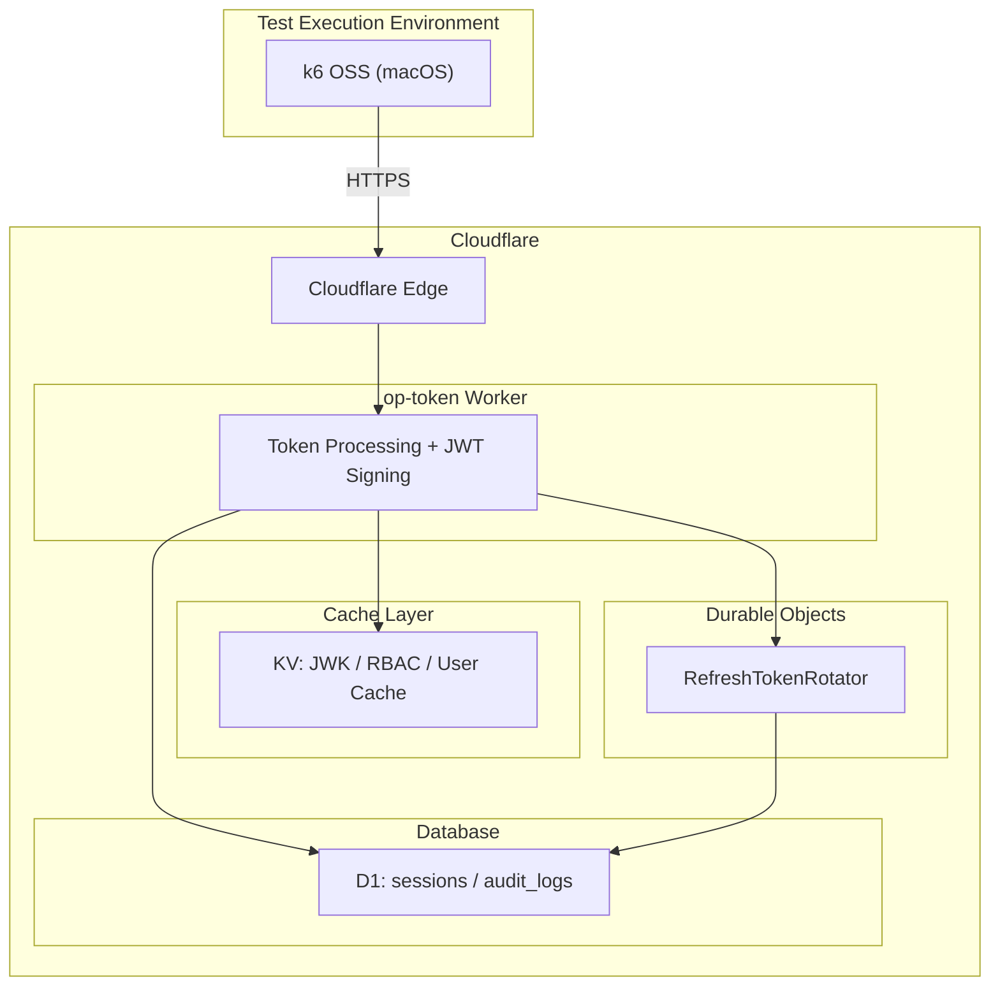

# Authrim Refresh Token Storm Load Test Results

## Overview

This is the results report for the load test (TEST2: Refresh Token Storm) on Authrim's OAuth2/OIDC server Refresh Token endpoint.

This test validated the performance of refresh token issuance and rotation processing under production-like conditions with **Token Rotation** enabled.

---

## Test Environment

### Infrastructure Configuration

| Component | Technology Stack | Description |
|---------------|-------------|------|
| **Worker** | Cloudflare Workers | OAuth2/OIDC endpoint processing |
| **Durable Objects** | Cloudflare DO | RefreshTokenRotator (token rotation management) |
| **Database** | Cloudflare D1 | User information, sessions, audit logs |
| **Cache** | Cloudflare KV | JWK cache, RBAC claim cache, user cache |



### Test Execution Environment

| Item | Value |
|------|-----|
| **Execution Machine** | MacBook Pro (Apple Silicon) |
| **Network** | Residential fiber optic connection |
| **Testing Tool** | [k6](https://k6.io/) OSS |
| **Metrics Collection** | Cloudflare GraphQL Analytics API |
| **Target URL** | `https://conformance.authrim.com` |

### Test Target Endpoint

| Endpoint | Processing |
|---------------|---------|
| `POST /token` | Refresh Token Grant (`grant_type=refresh_token`) |

---

## Test Conditions

### TEST2: Refresh Token Storm

Scenario to validate Refresh Token rotation processing expected in production operation.

| Item | Setting |
|------|--------|
| **Token Rotation** | Enabled (issue new refresh token each time) |
| **VU (Virtual User) Design** | Independent token family per VU |
| **Test Pattern** | Normal rotation path only (no error cases) |
| **Think Time** | 0ms (continuous requests) |

### Preset Configuration

| Preset | Target RPS | Duration | Max VU | Use Case |
|-----------|---------|---------|--------|-------------|
| **rps100** | 100 RPS | 2 min | 120 | Production baseline |
| **rps200** | 200 RPS | 2 min | 240 | High traffic scenario |
| **rps300** | 300 RPS | 2 min | 360 | Peak load validation |

### Detailed Test Settings

| Setting Item | Value | Production Recommended | Notes |
|---------|-----|-----------|------|
| `REFRESH_TOKEN_ROTATION_ENABLED` | `true` | `true` | Same rotation behavior as production |
| `REFRESH_TOKEN_EXPIRY` | 30 days | 30 days | Refresh token validity period |
| `ACCESS_TOKEN_EXPIRY` | 1 hour | 1 hour | Access token validity period |
| `RBAC_CACHE_TTL` | 5 min | 5 min | RBAC claim cache TTL |
| `USER_CACHE_TTL` | 1 hour | 1 hour | User data cache TTL |

---

## Test Results

### 200 RPS Test (2 minutes)

**Execution Date/Time:** 2025-12-03 09:33 JST

#### k6 Metrics

| Metric | Value |
|-----------|-----|
| **Total Requests** | 29,186 |
| **Success Rate** | **100%** |
| **Token Rotation Success Rate** | 100% |
| **Errors** | 0 |

#### Cloudflare Analytics

| Metric | Value | Notes |
|-----------|-----|------|
| **Worker Duration p50** | 9.35 ms | Median |
| **Worker Duration p75** | 10.44 ms | |
| **Worker Duration p90** | 39.30 ms | |
| **Worker Duration p99** | 816.24 ms | Tail latency |
| **CPU Time p50** | 4.80 ms | |
| **CPU Time p99** | 14.40 ms | |
| **DO Wall Time p50** | 9.16 ms | Durable Objects processing time |
| **DO Wall Time p99** | 18.43 ms | |
| **D1 Reads** | 10,510 | **0.36/request** |
| **D1 Writes** | 23,518 | 0.81/request |

#### DO and D1 Efficiency

| Metric | Calculated Value | Description |
|-----------|--------|------|
| **DO Requests/Worker Request** | 3.09 | Subrequest efficiency |
| **D1 Reads/Request** | **0.36** | RBAC cache hit rate > 95% |
| **D1 Writes/Request** | 0.81 | Audit log and session updates |

---

### Performance Timeline (Optimization History)

#### D1 Read Query Reduction

| Optimization Stage | D1 Reads/Request | Improvement |
|-----------|------------------|--------|
| V1 (no cache) | approx 14.6 | Baseline |
| V2 (before RBAC cache) | 9.7 | -34% |
| V2 (after RBAC cache) | **0.36** | **-96%** |

#### Optimizations Performed

| Date | Optimization | Effect |
|------|-----------|------|
| 2025-12-01 | TokenFamilyV2 introduction (version-based theft detection) | Reduced DO storage I/O |
| 2025-12-01 | UserCache introduction (KV Read-Through) | Reduced D1 user queries |
| 2025-12-03 | Async audit logging (Fire-and-Forget) | Reduced response latency |
| 2025-12-03 | RBAC claim cache introduction (5-min TTL) | 96% reduction in D1 RBAC queries |

---

## Architecture Features

### TokenFamilyV2 Design

Refresh Token rotation uses version-based theft detection.

```
JWT Payload:
{
  "sub": "user_id",
  "client_id": "client_id",
  "rtv": 5,              // Refresh Token Version
  "jti": "unique_id",
  "exp": 1735689600
}
```

- **rtv (Refresh Token Version)**: Version number within token family
- When an old version token is used → Invalidate all tokens as token theft
- State management in Durable Objects, audit log persistence in D1

### Cache Strategy

| Cache | TTL | Purpose |
|-----------|-----|------|
| **USER_CACHE** | 1 hour | User information (Read-Through) |
| **REBAC_CACHE** | 5 min | RBAC claims (roles, permissions, groups) |
| **CLIENTS_CACHE** | 1 hour | Client information |
| **KeyManager** | 5 min | JWK signing keys (Worker memory) |

---

## MAU Conversion

| RPS | Token Issuance/Hour | Token Issuance/Day | Estimated MAU |
|-----|----------------|----------------|----------|
| 100 | 360,000 | 8.6M | 200K-400K |
| **200** | **720,000** | **17.3M** | **500K-1M** |
| 300 | 1,080,000 | 25.9M | 1M-2M |

**Conversion Formula:**
```
RPS = (MAU × DAU rate × Requests/DAU) / (Operating hours × 3600) × Peak coefficient
    ≈ MAU / 5,000
```

---

## Conclusion

### Achieved Performance

| Metric | Target | Result | Status |
|------|------|------|------|
| **Success Rate** | > 99.9% | **100%** | ✅ |
| **Token Rotation** | > 99% | **100%** | ✅ |
| **Worker Duration p99** | < 1000ms | 816ms | ✅ |
| **DO Wall Time p99** | < 100ms | 18.43ms | ✅ |
| **D1 Reads/Request** | < 5 | **0.36** | ✅ |

### Recommended Scale

- **Conservative Estimate:** 200 RPS (maintaining p99 < 500ms)
- **Optimistic Estimate:** 300-400 RPS (current architecture limit)
- **Target MAU:** 500K-1M users

### Future Improvements

1. **DO Sharding Extension**: Shard RefreshTokenRotator by client_id + user_id
2. **D1 Read Replicas**: Read optimization for global deployment
3. **Cloudflare Queues**: Async batch processing for audit logs

---

## Related Files

| File | Description |
|---------|------|
| `scripts/test2-refresh-storm.js` | k6 test script |
| `scripts/generate-seeds.js` | Test seed generation |
| `scripts/fetch-cf-analytics.js` | CF metrics collection |
| `results/cf-analytics_*.json` | Collected Analytics data |

---

## Execution Method

```bash
# 1. Seed generation (refresh tokens)
CLIENT_ID=xxx CLIENT_SECRET=yyy ADMIN_API_SECRET=zzz \
  REFRESH_COUNT=240 node scripts/generate-seeds.js

# 2. Test execution
k6 run --env PRESET=rps200 scripts/test2-refresh-storm.js

# 3. Metrics collection
CF_API_TOKEN=xxx node scripts/fetch-cf-analytics.js --minutes 5
```
