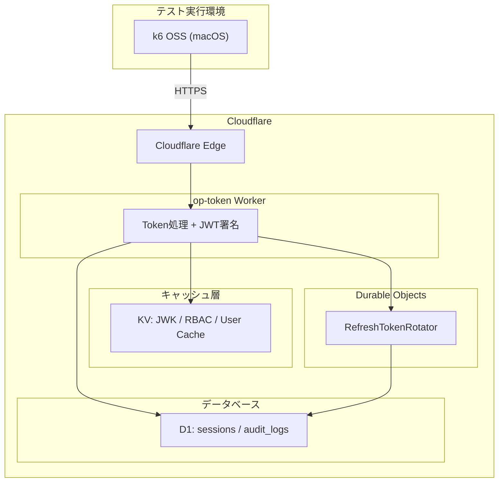

# Authrim Refresh Token Storm 負荷テスト結果

## 概要

Authrim OAuth2/OIDC サーバーの Refresh Token エンドポイントに対する負荷テスト（TEST2: Refresh Token Storm）の結果レポートです。

本テストでは、**Token Rotation** を有効化した本番運用に近い条件で、リフレッシュトークンの発行・ローテーション処理の性能を検証しました。

---

## テスト環境

### インフラ構成

| コンポーネント | 技術スタック | 説明 |
|---------------|-------------|------|
| **Worker** | Cloudflare Workers | OAuth2/OIDC エンドポイント処理 |
| **Durable Objects** | Cloudflare DO | RefreshTokenRotator（トークンローテーション管理） |
| **Database** | Cloudflare D1 | ユーザー情報、セッション、監査ログ |
| **Cache** | Cloudflare KV | JWK キャッシュ、RBAC クレームキャッシュ、ユーザーキャッシュ |



### テスト実行環境

| 項目 | 値 |
|------|-----|
| **実行マシン** | MacBook Pro (Apple Silicon) |
| **ネットワーク** | 一般家庭回線（光ファイバー） |
| **テストツール** | [k6](https://k6.io/) OSS |
| **メトリクス収集** | Cloudflare GraphQL Analytics API |
| **ターゲット URL** | `https://conformance.authrim.com` |

### テスト対象エンドポイント

| エンドポイント | 処理内容 |
|---------------|---------|
| `POST /token` | Refresh Token Grant（`grant_type=refresh_token`） |

---

## テスト条件

### TEST2: Refresh Token Storm

本番運用を想定した Refresh Token のローテーション処理を検証するシナリオです。

| 項目 | 設定値 |
|------|--------|
| **Token Rotation** | 有効（新しいリフレッシュトークンを毎回発行） |
| **VU（仮想ユーザー）設計** | VU ごとに独立した token family |
| **テストパターン** | 正常なローテーションパスのみ（エラーケースなし） |
| **Think Time** | 0ms（連続リクエスト） |

### プリセット設定

| プリセット | 目標 RPS | 継続時間 | 最大 VU | ユースケース |
|-----------|---------|---------|--------|-------------|
| **rps100** | 100 RPS | 2分 | 120 | 本番ベースライン |
| **rps200** | 200 RPS | 2分 | 240 | 高トラフィック想定 |
| **rps300** | 300 RPS | 2分 | 360 | ピーク負荷検証 |

### テスト設定の詳細

| 設定項目 | 値 | 本番推奨値 | 備考 |
|---------|-----|-----------|------|
| `REFRESH_TOKEN_ROTATION_ENABLED` | `true` | `true` | 本番同様のローテーション動作 |
| `REFRESH_TOKEN_EXPIRY` | 30日 | 30日 | リフレッシュトークン有効期限 |
| `ACCESS_TOKEN_EXPIRY` | 1時間 | 1時間 | アクセストークン有効期限 |
| `RBAC_CACHE_TTL` | 5分 | 5分 | RBACクレームキャッシュTTL |
| `USER_CACHE_TTL` | 1時間 | 1時間 | ユーザーデータキャッシュTTL |

---

## テスト結果

### 200 RPS テスト（2分間）

**実施日時:** 2025-12-03 09:33 JST

#### k6 メトリクス

| メトリクス | 値 |
|-----------|-----|
| **総リクエスト** | 29,186 |
| **成功率** | **100%** |
| **Token Rotation 成功率** | 100% |
| **エラー** | 0 |

#### Cloudflare Analytics

| メトリクス | 値 | 備考 |
|-----------|-----|------|
| **Worker Duration p50** | 9.35 ms | 中央値 |
| **Worker Duration p75** | 10.44 ms | |
| **Worker Duration p90** | 39.30 ms | |
| **Worker Duration p99** | 816.24 ms | テール遅延 |
| **CPU Time p50** | 4.80 ms | |
| **CPU Time p99** | 14.40 ms | |
| **DO Wall Time p50** | 9.16 ms | Durable Objects 処理時間 |
| **DO Wall Time p99** | 18.43 ms | |
| **D1 Reads** | 10,510 | **0.36/request** |
| **D1 Writes** | 23,518 | 0.81/request |

#### DO・D1 効率

| メトリクス | 計算値 | 説明 |
|-----------|--------|------|
| **DO Requests/Worker Request** | 3.09 | サブリクエスト効率 |
| **D1 Reads/Request** | **0.36** | RBACキャッシュヒット率 > 95% |
| **D1 Writes/Request** | 0.81 | 監査ログ・セッション更新 |

---

### パフォーマンス推移（最適化履歴）

#### D1 読み取りクエリの削減

| 最適化段階 | D1 Reads/Request | 改善率 |
|-----------|------------------|--------|
| V1（キャッシュなし） | 約14.6 | ベースライン |
| V2（RBACキャッシュ追加前） | 9.7 | -34% |
| V2（RBACキャッシュ追加後） | **0.36** | **-96%** |

#### 実施した最適化

| 日時 | 最適化内容 | 効果 |
|------|-----------|------|
| 2025-12-01 | TokenFamilyV2 導入（バージョンベース盗難検知） | DO ストレージI/O削減 |
| 2025-12-01 | UserCache 導入（KV Read-Through） | D1 ユーザークエリ削減 |
| 2025-12-03 | 監査ログ非同期化（Fire-and-Forget） | レスポンス遅延削減 |
| 2025-12-03 | RBAC クレームキャッシュ導入（5分 TTL） | D1 RBAC クエリ96%削減 |

---

## アーキテクチャの特徴

### TokenFamilyV2 設計

Refresh Token のローテーションにバージョンベースの盗難検知を採用しています。

```
JWT Payload:
{
  "sub": "user_id",
  "client_id": "client_id",
  "rtv": 5,              // Refresh Token Version
  "jti": "unique_id",
  "exp": 1735689600
}
```

- **rtv (Refresh Token Version)**: トークンファミリー内のバージョン番号
- 旧バージョンのトークンが使用された場合 → トークン盗難として全トークン無効化
- Durable Objects で状態管理、D1 で監査ログ永続化

### キャッシュ戦略

| キャッシュ | TTL | 用途 |
|-----------|-----|------|
| **USER_CACHE** | 1時間 | ユーザー情報（Read-Through） |
| **REBAC_CACHE** | 5分 | RBACクレーム（roles, permissions, groups） |
| **CLIENTS_CACHE** | 1時間 | クライアント情報 |
| **KeyManager** | 5分 | JWK署名キー（Worker メモリ内） |

---

## MAU 換算

| RPS | トークン発行/時 | トークン発行/日 | 想定 MAU |
|-----|----------------|----------------|----------|
| 100 | 360,000 | 8.6M | 20万〜40万 |
| **200** | **720,000** | **17.3M** | **50万〜100万** |
| 300 | 1,080,000 | 25.9M | 100万〜200万 |

**換算式:**
```
RPS = (MAU × DAU率 × リクエスト/DAU) / (稼働時間 × 3600) × ピーク係数
    ≈ MAU / 5,000
```

---

## 結論

### 達成した性能

| 指標 | 目標 | 結果 | 判定 |
|------|------|------|------|
| **成功率** | > 99.9% | **100%** | ✅ |
| **Token Rotation** | > 99% | **100%** | ✅ |
| **Worker Duration p99** | < 1000ms | 816ms | ✅ |
| **DO Wall Time p99** | < 100ms | 18.43ms | ✅ |
| **D1 Reads/Request** | < 5 | **0.36** | ✅ |

### 推奨スケール

- **保守的推定:** 200 RPS（p99 < 500ms 維持）
- **楽観的推定:** 300-400 RPS（現アーキテクチャ上限）
- **想定 MAU:** 50万〜100万ユーザー

### 今後の改善案

1. **DO シャーディング拡張**: RefreshTokenRotator を client_id + user_id でシャーディング
2. **D1 読み取りレプリカ**: グローバル展開時の読み取り最適化
3. **Cloudflare Queues**: 監査ログの非同期バッチ処理

---

## 関連ファイル

| ファイル | 説明 |
|---------|------|
| `scripts/test2-refresh-storm.js` | k6 テストスクリプト |
| `scripts/generate-seeds.js` | テスト用シード生成 |
| `scripts/fetch-cf-analytics.js` | CF メトリクス収集 |
| `results/cf-analytics_*.json` | 収集された Analytics データ |

---

## 実行方法

```bash
# 1. シード生成（リフレッシュトークン）
CLIENT_ID=xxx CLIENT_SECRET=yyy ADMIN_API_SECRET=zzz \
  REFRESH_COUNT=240 node scripts/generate-seeds.js

# 2. テスト実行
k6 run --env PRESET=rps200 scripts/test2-refresh-storm.js

# 3. メトリクス収集
CF_API_TOKEN=xxx node scripts/fetch-cf-analytics.js --minutes 5
```
