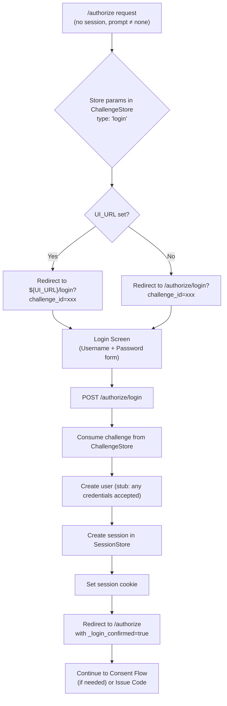
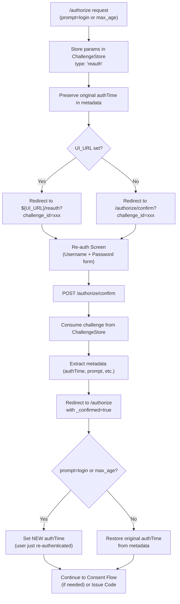
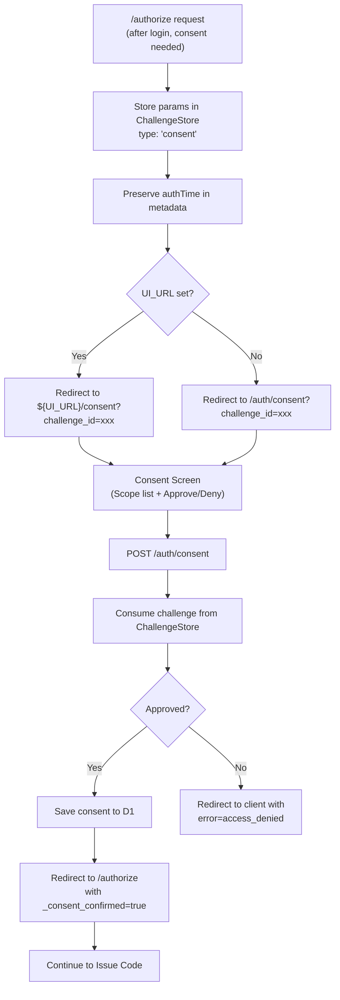

# Authentication Flow Documentation

This document describes the authentication and consent flows in the Authrim OpenID Provider.

## Table of Contents

1. [UI_URL Configuration](#ui_url-configuration)
2. [Login Flow](#login-flow)
3. [Re-authentication Flow](#re-authentication-flow)
4. [Consent Flow](#consent-flow)
5. [prompt Parameter Behavior](#prompt-parameter-behavior)
6. [ChallengeStore Usage](#challengestore-usage)
7. [Testing](#testing)

---

## UI_URL Configuration

The `UI_URL` environment variable controls where users are redirected for login, consent, and re-authentication screens.

### Setting UI_URL

**Method 1: wrangler.toml**
```toml
[vars]
UI_URL = "https://your-ui-deployment.pages.dev"
```

**Method 2: .dev.vars (for local development)**
```
UI_URL=http://localhost:5173
```

**Method 3: Cloudflare Dashboard**
1. Navigate to Workers & Pages → authrim-op-auth → Settings → Variables
2. Add environment variable: `UI_URL`
3. Value: Your UI deployment URL

### UI_URL Behavior

- **UI_URL set**: Redirects to UI screens (e.g., `${UI_URL}/login?challenge_id=xxx`)
- **UI_URL not set**: Falls back to API-rendered HTML forms

**Redirect URLs:**
- Login: `${UI_URL}/login?challenge_id=<id>`
- Consent: `${UI_URL}/consent?challenge_id=<id>`
- Re-auth: `${UI_URL}/reauth?challenge_id=<id>`

---

## Login Flow

### When Login is Required

Login screen is shown when:
1. **No session exists** (`sessionUserId === undefined`)
2. **prompt is NOT 'none'** (prompt=none returns `login_required` error instead)

### Flow Diagram



### API Endpoints

**GET /authorize/login?challenge_id=xxx**
- Displays simple HTML login form
- Form fields: `username`, `password`, `challenge_id` (hidden)

**POST /authorize/login**
- Body: `challenge_id`, `username`, `password`
- Stub implementation: Accepts any credentials
- Creates user and session
- Redirects to `/authorize` with original params

---

## Re-authentication Flow

### When Re-authentication is Required

Re-authentication confirmation is shown when:
1. **prompt=login** is specified
2. **max_age exceeded** and user has a session

### Flow Diagram



### API Endpoints

**GET /authorize/confirm?challenge_id=xxx**
- Displays re-auth confirmation form
- Form fields: `username`, `password`, `challenge_id` (hidden)

**POST /authorize/confirm**
- Body: `challenge_id`, `username`, `password`
- Stub implementation: Does not verify credentials
- Redirects to `/authorize` with `_confirmed=true`

---

## Consent Flow

### When Consent is Required

Consent screen is shown when:
1. **No existing consent** in D1 (`oauth_client_consents` table)
2. **Consent expired** (`expires_at < now`)
3. **Requested scopes exceed granted scopes**
4. **prompt=consent** (always requires consent)

### Consent Checking Logic

```typescript
// Query D1 for existing consent
const existingConsent = await DB.prepare(
  'SELECT scope, granted_at, expires_at FROM oauth_client_consents WHERE user_id = ? AND client_id = ?'
).bind(userId, clientId).first();

if (!existingConsent) {
  consentRequired = true;
} else {
  // Check expiration
  if (expiresAt && expiresAt < Date.now()) {
    consentRequired = true;
  }

  // Check scope coverage
  const grantedScopes = existingConsent.scope.split(' ');
  const requestedScopes = scope.split(' ');
  const hasAllScopes = requestedScopes.every(s => grantedScopes.includes(s));

  if (!hasAllScopes) {
    consentRequired = true;
  }
}

// Force consent if prompt=consent
if (prompt?.includes('consent')) {
  consentRequired = true;
}
```

### Flow Diagram



### API Endpoints

**GET /auth/consent?challenge_id=xxx**
- Displays consent screen with requested scopes
- Shows client information from D1
- Approve/Deny buttons

**POST /auth/consent**
- Body: `challenge_id`, `approved` (true/false)
- If approved: Saves consent to D1 `oauth_client_consents` table
- Redirects to `/authorize` with `_consent_confirmed=true`

### D1 Schema

```sql
CREATE TABLE oauth_client_consents (
  id TEXT PRIMARY KEY,
  user_id TEXT NOT NULL,
  client_id TEXT NOT NULL,
  scope TEXT NOT NULL,
  granted_at INTEGER NOT NULL,
  expires_at INTEGER,
  created_at TEXT NOT NULL DEFAULT (datetime('now')),
  updated_at TEXT NOT NULL DEFAULT (datetime('now')),
  FOREIGN KEY (user_id) REFERENCES users(id) ON DELETE CASCADE,
  FOREIGN KEY (client_id) REFERENCES oauth_clients(client_id) ON DELETE CASCADE,
  UNIQUE (user_id, client_id)
);
```

---

## prompt Parameter Behavior

| Situation         | prompt=null (or unspecified) | prompt=none             |
|-------------------|------------------------------|-------------------------|
| Session exists    | ✅ OK                        | ✅ OK                   |
| No session        | ➡️ Redirect to login        | ❌ `login_required`     |
| max_age exceeded  | ➡️ Re-auth screen           | ❌ `login_required`     |
| Consent needed    | ➡️ Consent screen           | ❌ `consent_required`   |
| UI allowed        | ✅ Can show UI              | ❌ Must NOT show UI     |

### Error Responses

**login_required** (prompt=none + no session)
```http
HTTP/1.1 302 Found
Location: https://client.example.com/callback?error=login_required&error_description=User+authentication+is+required&state=xyz
```

**consent_required** (prompt=none + consent needed)
```http
HTTP/1.1 302 Found
Location: https://client.example.com/callback?error=consent_required&error_description=User+consent+is+required&state=xyz
```

---

## ChallengeStore Usage

### Challenge Types

ChallengeStore supports the following challenge types (see `packages/shared/src/durable-objects/ChallengeStore.ts`):

- `passkey_registration` - WebAuthn registration
- `passkey_authentication` - WebAuthn authentication
- `magic_link` - Email-based magic link
- `session_token` - ITP-bypass session token
- `reauth` - Re-authentication confirmation
- **`login`** - Login flow (NEW)
- **`consent`** - Consent flow (NEW)

### Storing a Challenge

```typescript
const challengeId = crypto.randomUUID();
const challengeStoreId = env.CHALLENGE_STORE.idFromName('global');
const challengeStore = env.CHALLENGE_STORE.get(challengeStoreId);

await challengeStore.fetch(
  new Request('https://challenge-store/challenge', {
    method: 'POST',
    headers: { 'Content-Type': 'application/json' },
    body: JSON.stringify({
      id: challengeId,
      type: 'login', // or 'consent', 'reauth'
      userId: 'anonymous', // or actual userId for consent/reauth
      challenge: challengeId,
      ttl: 600, // 10 minutes
      metadata: {
        // Store original /authorize parameters
        response_type,
        client_id,
        redirect_uri,
        scope,
        state,
        nonce,
        // ... etc
      },
    }),
  })
);
```

### Consuming a Challenge

```typescript
const consumeResponse = await challengeStore.fetch(
  new Request('https://challenge-store/challenge/consume', {
    method: 'POST',
    headers: { 'Content-Type': 'application/json' },
    body: JSON.stringify({
      id: challengeId,
      type: 'login', // Must match stored type
      challenge: challengeId,
    }),
  })
);

if (!consumeResponse.ok) {
  // Challenge not found, expired, or already consumed
  return error('invalid_request', 'Invalid or expired challenge');
}

const challengeData = await consumeResponse.json();
const metadata = challengeData.metadata; // Original /authorize params
```

---

## Testing

### Running Tests

```bash
cd packages/op-auth
pnpm test
```

### Test Coverage

Tests are located in `src/__tests__/auth-params.test.ts`:

- ✅ prompt=none with no session → `login_required`
- ✅ prompt=none with consent needed → `consent_required`
- ✅ prompt=none with max_age exceeded → `login_required`
- ✅ Consent checking logic (scope coverage, expiration)
- ✅ Login flow (redirect, form fields)
- ✅ Re-authentication (prompt=login, max_age)

### Manual Testing with Conformance Suite

Run the OpenID Connect Conformance Suite to test:

- `oidcc-ensure-request-without-nonce-succeeds-for-code-flow`
- `oidcc-max-age-1` (Re-authentication with max_age)
- `oidcc-prompt-none-logged-in` (prompt=none with session)
- `oidcc-prompt-none-not-logged-in` (prompt=none without session → login_required)

### Stub Implementation Note

**⚠️ Current Implementation:**
- Login and re-auth forms are **stubs**
- **Any username/password is accepted**
- No actual credential verification

**For Production:**
- Integrate with Passkey or Magic Link authentication
- Verify credentials before creating session
- Add rate limiting to prevent brute force

---

## Flow Summary

```mermaid
flowchart TD
    A[/authorize] --> B{No session?}
    B -->|Yes| C[Login Flow]
    B -->|No| D{prompt=login?}
    D -->|Yes| E[Re-auth Flow]
    D -->|No| F{max_age exceeded?}
    F -->|Yes| E
    F -->|No| G{Consent needed?}
    G -->|Yes| H[Consent Flow]
    G -->|No| I[Issue Authorization Code]
    C --> D
    E --> G
    H --> I
```

---

## Migration

To enable consent functionality, run the migration:

```bash
wrangler d1 execute authrim-prod --file=migrations/003_add_consent_table.sql
```

This creates the `oauth_client_consents` table for storing user consent history.
