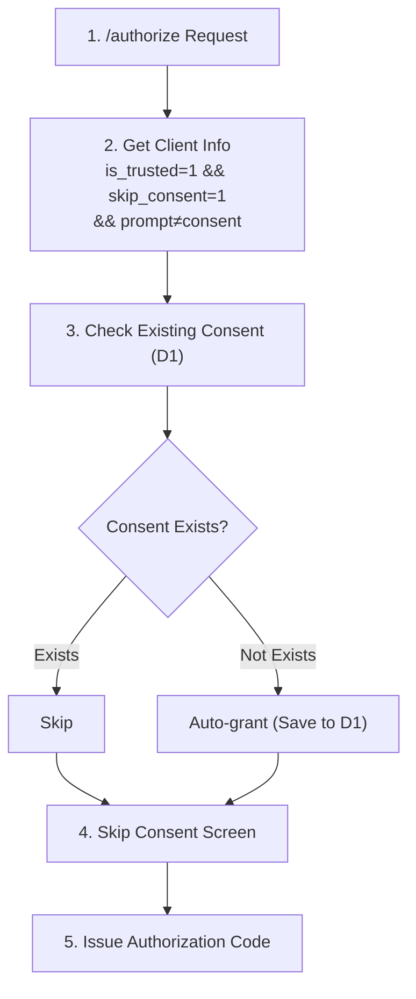
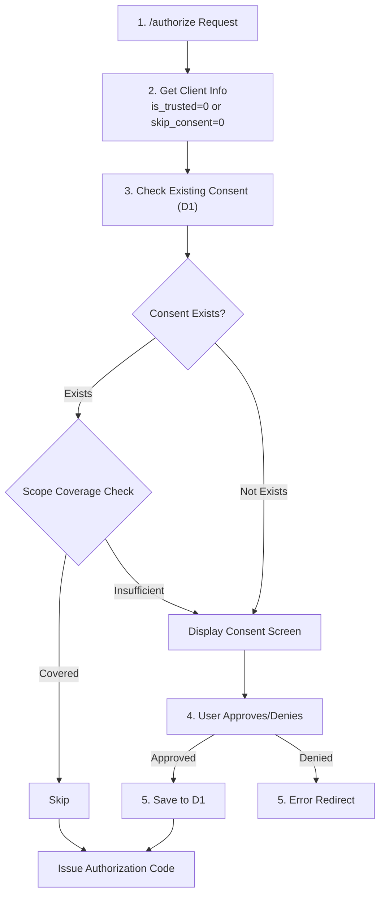
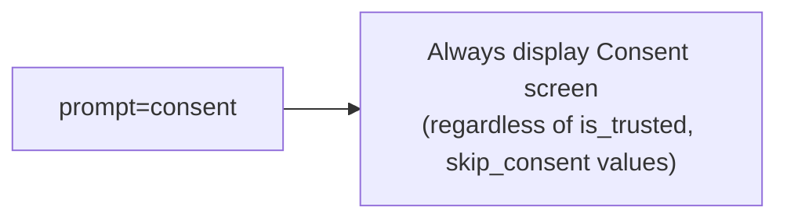

# Trusted Client Feature Specification

## Overview

The Trusted Client feature optimizes user experience for First-Party clients (clients owned and operated by the same organization). Clients registered as Trusted Clients can skip the Consent screen on first access.

## Purpose

1. **UX Optimization**: Reduce unnecessary Consent screens for First-Party clients
2. **Security Maintenance**: Third-Party clients still require Consent
3. **Flexibility**: Trusted/Untrusted can be configured per client
4. **OIDC Conformance Suite Support**: Treat test domains as Trusted

---

## Terminology

### First-Party Client (Trusted Client)
- Client applications owned and operated by the same organization
- Examples: Internal services, internal tools, development/test environments

### Third-Party Client (Untrusted Client)
- Client applications created by external developers/organizations
- Examples: Third-party apps, partner integrations

---

## Trusted Determination Logic

### 1. Automatic Determination by redirect_uri Domain

During Dynamic Client Registration, the domain is extracted from the first URL in `redirect_uris`, and Trusted determination is performed based on the following conditions:

```typescript
const redirectDomain = new URL(redirect_uris[0]).hostname;
const issuerDomain = new URL(env.ISSUER_URL).hostname;
const trustedDomains = env.TRUSTED_DOMAINS?.split(',') || [];

const isTrusted =
  redirectDomain === issuerDomain ||           // Same domain
  trustedDomains.includes(redirectDomain);     // Whitelist
```

#### Determination Conditions

| Condition | Determination | Example |
|-----------|---------------|---------|
| redirect_uri domain == ISSUER_URL domain | Trusted | `authrim.sgrastar.workers.dev` |
| redirect_uri domain ∈ TRUSTED_DOMAINS | Trusted | `www.certification.openid.net` |
| Otherwise | Untrusted | `example.com` |

### 2. Environment Variable Configuration

**TRUSTED_DOMAINS** (comma-separated)

```bash
# .dev.vars or wrangler.toml
TRUSTED_DOMAINS=www.certification.openid.net,localhost,127.0.0.1
```

**Default Value**: Empty (only ISSUER_URL domain is Trusted)

---

## Database Schema

### oauth_clients Table Extension

```sql
-- Migration: 004_add_client_trust_settings.sql
ALTER TABLE oauth_clients ADD COLUMN is_trusted INTEGER DEFAULT 0;
ALTER TABLE oauth_clients ADD COLUMN skip_consent INTEGER DEFAULT 0;
CREATE INDEX IF NOT EXISTS idx_clients_trusted ON oauth_clients(is_trusted);
```

#### Column Definitions

| Column | Type | Default | Description |
|--------|------|---------|-------------|
| `is_trusted` | INTEGER | 0 | 1=Trusted Client, 0=Third-Party Client |
| `skip_consent` | INTEGER | 0 | 1=Skip Consent screen, 0=Consent required |

#### Configuration Patterns

| is_trusted | skip_consent | Behavior |
|-----------|--------------|----------|
| 0 | 0 | Third-Party Client (initial Consent required) |
| 1 | 0 | Trusted Client but Consent displayed |
| 1 | 1 | **Trusted Client (Consent skipped)** ← Recommended |
| 0 | 1 | Invalid combination |

---

## Consent Processing Flow

### Trusted Client (skip_consent=1)



### Third-Party Client (skip_consent=0)



### When prompt=consent



---

## Implementation Details

### 1. Dynamic Client Registration

**File**: `packages/op-dcr/src/register.ts`

**Modification**: Trusted determination during client registration

```typescript
// Extract domain from redirect_uri
const redirectDomain = new URL(redirect_uris[0]).hostname;
const issuerDomain = new URL(c.env.ISSUER_URL).hostname;
const trustedDomains = c.env.TRUSTED_DOMAINS?.split(',').map(d => d.trim()) || [];

// Trusted determination
const isTrusted =
  redirectDomain === issuerDomain ||
  trustedDomains.includes(redirectDomain);

console.log(`[DCR] Client registration: domain=${redirectDomain}, trusted=${isTrusted}`);

// Set is_trusted, skip_consent during INSERT
await c.env.DB.prepare(`
  INSERT INTO oauth_clients (
    client_id, client_secret, client_name, redirect_uris,
    grant_types, response_types, token_endpoint_auth_method, jwks,
    is_trusted, skip_consent,
    created_at, updated_at
  ) VALUES (?, ?, ?, ?, ?, ?, ?, ?, ?, ?, datetime('now'), datetime('now'))
`).bind(
  clientId, hashedSecret, client_name, redirectUrisJson,
  grantTypesJson, responseTypesJson, token_endpoint_auth_method, jwksJson,
  isTrusted ? 1 : 0,  // is_trusted
  isTrusted ? 1 : 0,  // skip_consent
).run();
```

### 2. Authorization Endpoint

**File**: `packages/op-auth/src/authorize.ts`

**Modification**: Consent determination logic (around lines 1082-1187)

```typescript
// Check if consent is required (unless already confirmed)
const _consent_confirmed = c.req.query('_consent_confirmed') || ...;

if (_consent_confirmed !== 'true') {
  // Get client info
  const client = await getClient(c.env, validClientId);

  // If Trusted client with skip_consent enabled and prompt≠consent
  if (client.is_trusted && client.skip_consent && !prompt?.includes('consent')) {
    // Check existing Consent
    const existingConsent = await c.env.DB.prepare(
      'SELECT id FROM oauth_client_consents WHERE user_id = ? AND client_id = ?'
    ).bind(sub, validClientId).first();

    if (!existingConsent) {
      // Auto-grant Consent (save to D1)
      const consentId = crypto.randomUUID();
      const now = Date.now();

      await c.env.DB.prepare(`
        INSERT INTO oauth_client_consents
        (id, user_id, client_id, scope, granted_at, expires_at, created_at, updated_at)
        VALUES (?, ?, ?, ?, ?, ?, datetime('now'), datetime('now'))
      `).bind(consentId, sub, validClientId, scope, now, null).run();

      console.log(`[CONSENT] Auto-granted for trusted client: client_id=${validClientId}, user_id=${sub}`);
    }

    // Skip Consent screen
    consentRequired = false;
  } else {
    // Existing Consent determination logic (Third-Party Client)
    let consentRequired = false;
    try {
      const existingConsent = await c.env.DB.prepare(...).bind(...).first();

      if (!existingConsent) {
        consentRequired = true;
      } else {
        // Scope coverage check, expiration check
        ...
      }

      // prompt=consent always shows Consent
      if (prompt?.includes('consent')) {
        consentRequired = true;
      }
    } catch (error) {
      console.error('Failed to check consent:', error);
      consentRequired = true;
    }
  }

  if (consentRequired) {
    // Redirect to Consent screen
    ...
  }
}
```

### 3. Client Utility Extension

**File**: `packages/shared/src/utils/client.ts`

**Modification**: getClient function and ClientMetadata type

```typescript
export interface ClientMetadata {
  client_id: string;
  client_secret?: string;
  client_name?: string;
  redirect_uris: string[];
  grant_types?: string[];
  response_types?: string[];
  token_endpoint_auth_method?: string;
  jwks?: unknown;
  is_trusted?: boolean;     // Added
  skip_consent?: boolean;   // Added
  // ...
}

export async function getClient(env: Env, clientId: string): Promise<ClientMetadata | null> {
  const client = await env.DB.prepare(`
    SELECT
      client_id, client_secret, client_name, redirect_uris,
      grant_types, response_types, token_endpoint_auth_method, jwks,
      is_trusted, skip_consent
    FROM oauth_clients
    WHERE client_id = ?
  `).bind(clientId).first();

  if (!client) return null;

  return {
    client_id: client.client_id as string,
    client_secret: client.client_secret as string | undefined,
    client_name: client.client_name as string | undefined,
    redirect_uris: JSON.parse(client.redirect_uris as string),
    grant_types: client.grant_types ? JSON.parse(client.grant_types as string) : undefined,
    response_types: client.response_types ? JSON.parse(client.response_types as string) : undefined,
    token_endpoint_auth_method: client.token_endpoint_auth_method as string | undefined,
    jwks: client.jwks ? JSON.parse(client.jwks as string) : undefined,
    is_trusted: client.is_trusted === 1,       // Added
    skip_consent: client.skip_consent === 1,   // Added
  };
}
```

### 4. Environment Variable Type Definition

**File**: `packages/shared/src/types/env.ts`

```typescript
export interface Env {
  // ...existing fields...

  // Trusted Client domains (comma-separated)
  TRUSTED_DOMAINS?: string;
}
```

---

## Security Considerations

### 1. Domain Validation

- Properly handle URL parse errors when extracting domain from redirect_uri
- Wildcard domains are **not supported** (e.g., `*.example.com`)
- Subdomains must be specified individually

### 2. Changing Trusted Settings

- Trusted determination is performed **only during Dynamic Registration**
- Trusted settings for existing clients can **only be changed via Admin API** (future implementation)
- Changes to Trusted flag will be recorded in audit logs (future implementation)

### 3. Respecting prompt=consent

- **When prompt=consent is specified, always display Consent screen regardless of is_trusted**
- This is an OIDC specification requirement

### 4. Impact on Third-Party Clients

- Clients that don't match Trusted criteria still require Consent
- Does not affect existing Consent functionality

---

## Test Cases

### 1. Trusted Client (Conformance Suite)

**Prerequisites**:
- TRUSTED_DOMAINS=`www.certification.openid.net`
- Dynamic Registration: redirect_uri=`https://www.certification.openid.net/test/a/Authrim-basic-test/callback`

**Expected Behavior**:
```
1. DCR → is_trusted=1, skip_consent=1
2. /authorize (first time) → Consent auto-granted, screen skipped
3. /authorize (second time) → Consent screen skipped
4. /authorize + prompt=consent → Consent screen displayed
```

### 2. Trusted Client (Same Domain)

**Prerequisites**:
- ISSUER_URL=`https://authrim.sgrastar.workers.dev`
- redirect_uri=`https://authrim.sgrastar.workers.dev/callback`

**Expected Behavior**:
```
1. DCR → is_trusted=1, skip_consent=1
2. Thereafter, Consent screen skipped (except prompt=consent)
```

### 3. Third-Party Client

**Prerequisites**:
- redirect_uri=`https://example.com/callback`

**Expected Behavior**:
```
1. DCR → is_trusted=0, skip_consent=0
2. /authorize (first time) → Consent screen displayed
3. User approves → Saved to D1
4. /authorize (second time) → Consent screen skipped
5. Scope change → Consent screen displayed
```

### 4. prompt=consent (Trusted Client)

**Prerequisites**:
- is_trusted=1, skip_consent=1
- prompt=consent

**Expected Behavior**:
```
1. /authorize + prompt=consent → Always display Consent screen
2. Trusted flag is ignored
```

---

## Migration Procedure

```bash
# 1. Run migration
wrangler d1 execute authrim-prod --file=migrations/004_add_client_trust_settings.sql

# 2. Set environment variables
# Configure in wrangler.toml or Cloudflare Dashboard
TRUSTED_DOMAINS=www.certification.openid.net

# 3. Deploy
pnpm run build
pnpm run deploy
```

---

## Future Extensions

### 1. Admin API

```typescript
// PATCH /api/admin/clients/:client_id
// Body: { is_trusted: true, skip_consent: true }
```

### 2. Audit Logging

```typescript
// Audit log for Trusted setting changes
await logAudit({
  event: 'client.trust.updated',
  client_id: clientId,
  old_value: { is_trusted: false },
  new_value: { is_trusted: true },
  changed_by: adminUserId,
});
```

### 3. User Consent Management

```typescript
// GET /api/user/consents - List own consents
// DELETE /api/user/consents/:client_id - Revoke consent
```

### 4. Granular Consent

```typescript
// User approves/denies individual scopes
// Example: approve profile, deny email
```

---

## References

- [OAuth 2.0 RFC 6749](https://tools.ietf.org/html/rfc6749)
- [OpenID Connect Core 1.0](https://openid.net/specs/openid-connect-core-1_0.html)
- [OAuth 2.0 Security Best Current Practice](https://tools.ietf.org/html/draft-ietf-oauth-security-topics)
- [GDPR - Consent Requirements](https://gdpr.eu/consent/)
