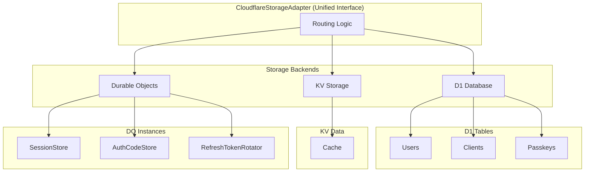
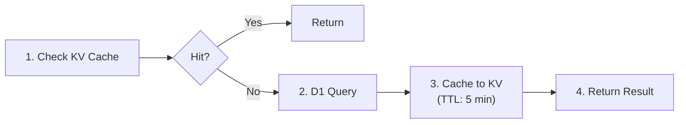
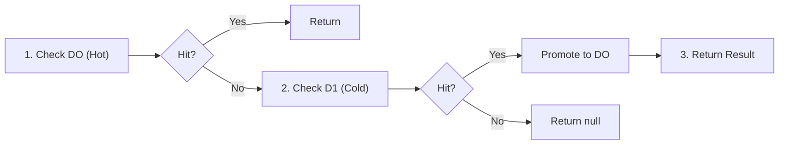

# Storage Abstraction Layer

This is the unified storage abstraction layer implemented in Phase 5. It provides a unified interface for Cloudflare Workers environment (D1, KV, Durable Objects).

## Overview

The storage abstraction layer integrates multiple storage backends and provides intelligent routing logic.

### Routing Strategy

| Prefix | Routing Target | Description |
|--------|---------------|-------------|
| `session:*` | SessionStore Durable Object + D1 fallback | Hot data in DO, cold data in D1 |
| `client:*` | D1 + KV Cache | Read-through cache pattern |
| `user:*` | D1 Database | User data |
| `authcode:*` | AuthorizationCodeStore Durable Object | One-time use guarantee |
| `refreshtoken:*` | RefreshTokenRotator Durable Object | Atomic rotation |
| Others | KV Storage | Fallback |

## Architecture



## Usage

### Basic Usage

```typescript
import { createStorageAdapter } from '@authrim/shared/storage/adapters/cloudflare-adapter';
import type { Env } from '@authrim/shared/types/env';

// Create storage adapter in handler
export default {
  async fetch(request: Request, env: Env) {
    const { adapter, userStore, clientStore, sessionStore, passkeyStore } = createStorageAdapter(env);

    // Get user
    const user = await userStore.get('user_123');

    // Get client (D1 + KV cache)
    const client = await clientStore.get('client_abc');

    // Create session (Durable Object + D1)
    const session = await sessionStore.create({
      user_id: 'user_123',
      data: { amr: ['pwd'] },
    });

    return new Response('OK');
  },
};
```

### IStorageAdapter Interface

For low-level API usage:

```typescript
// Key-based access (automatic routing)
const value = await adapter.get('client:test-client');
await adapter.set('custom:key', 'value', 3600); // TTL: 1 hour
await adapter.delete('session:abc123');

// D1 SQL queries
const users = await adapter.query<User>('SELECT * FROM users WHERE email = ?', ['user@example.com']);
await adapter.execute('DELETE FROM sessions WHERE expires_at < ?', [Date.now()]);
```

### Store-Specific APIs

#### UserStore

```typescript
// Get user
const user = await userStore.get('user_123');
const userByEmail = await userStore.getByEmail('user@example.com');

// Create user
const newUser = await userStore.create({
  email: 'newuser@example.com',
  name: 'New User',
});

// Update user
const updated = await userStore.update('user_123', {
  name: 'Updated Name',
});

// Delete user
await userStore.delete('user_123');
```

#### ClientStore

```typescript
// Get client (auto-cached)
const client = await clientStore.get('client_abc');

// Create client
const newClient = await clientStore.create({
  client_id: 'new-client',
  client_name: 'New Client App',
  redirect_uris: ['https://example.com/callback'],
  grant_types: ['authorization_code'],
  response_types: ['code'],
});

// Update client (cache invalidation)
const updated = await clientStore.update('client_abc', {
  client_name: 'Updated Client Name',
});

// List clients
const clients = await clientStore.list({ limit: 10, offset: 0 });
```

#### SessionStore

```typescript
// Get session (Durable Object → D1 fallback)
const session = await sessionStore.get('session_abc123');

// Create session (Durable Object + D1)
const newSession = await sessionStore.create({
  user_id: 'user_123',
  data: { amr: ['pwd', 'mfa'] },
});

// Invalidate session
await sessionStore.delete('session_abc123');

// Get all sessions for user
const sessions = await sessionStore.listByUser('user_123');

// Extend session expiration (Active TTL)
const extended = await sessionStore.extend('session_abc123', 3600); // +1 hour
```

#### PasskeyStore

```typescript
// Get passkey
const passkey = await passkeyStore.getByCredentialId('cred_abc123');

// Get all passkeys for user
const passkeys = await passkeyStore.listByUser('user_123');

// Create passkey
const newPasskey = await passkeyStore.create({
  user_id: 'user_123',
  credential_id: 'cred_xyz789',
  public_key: 'MFkwEwYHKo...',
  counter: 0,
  device_name: 'iPhone 15',
});

// Update passkey counter (replay attack prevention)
const updated = await passkeyStore.updateCounter('passkey_123', 5);
```

## Interfaces

### IStorageAdapter

Unified storage adapter interface. Supports key-based access and D1 SQL queries.

### IUserStore

Store interface for user management.

### IClientStore

Store interface for OAuth client management.

### ISessionStore

Store interface for session management.

### IPasskeyStore

Store interface for Passkey (WebAuthn) management.

## Performance Optimization

### Read-Through Cache (Client)



### Hot/Cold Pattern (Session)



### One-Time Use Guarantee (AuthCode)

Authorization Codes are guaranteed to be one-time use through Durable Objects' strong consistency guarantees. This prevents replay attacks.

## Tests

Unit tests cover 37 test cases including:

- Routing logic (6 tests)
- Set/Delete operations (6 tests)
- SQL operations (2 tests)
- UserStore (6 tests)
- ClientStore (5 tests)
- SessionStore (6 tests)
- PasskeyStore (5 tests)
- Factory function (1 test)

```bash
pnpm test src/storage/adapters/__tests__/cloudflare-adapter.test.ts
```

## References

- [Storage Strategy](../../../docs/architecture/storage-strategy.md)
- [Database Schema](../../../docs/architecture/database-schema.md)
- [Durable Objects](../../../docs/architecture/durable-objects.md)
- [Phase 5 Planning](../../../docs/project-management/PHASE5_PLANNING.md)
