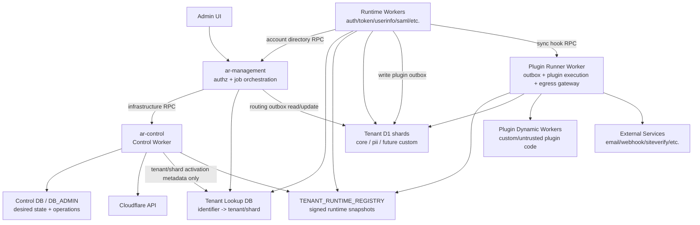

# Tenant D1 Control Plane 実装計画

## 目的

Tenant D1 構成を、初回 setup 時の事前 slot 作成モデルから、Admin UI / Management Worker 起点で
必要に応じて D1 shard を追加できる control-plane モデルへ移行する。

既存環境の migration、旧 preallocated pool からの互換移行、既存 tenant のオンライン移動はこの計画では扱わない。
新規環境では最初から次の構成にする。

- Automatic provisioning が ON の場合だけ Control Worker が用途分離した Cloudflare API token を持つ。OFF の場合は
  setup が Wrangler OAuth / operator credential で正規 operation を実行し、Control Worker に token を保存しない。
- Control DB 上の desired state を正とし、`.authrim/lock` と generated `wrangler.toml` は生成物にする。
- 小規模環境でも Tenant Lookup DB を用意し、大規模時と同じ routing architecture にする。
- D1 shard 追加は無停止で行い、active routing map の切り替えだけを runtime-visible な変更にする。

## 結論

実現可能と判断する。

Cloudflare 側には D1 database create/query/raw/import API、Worker settings API、Workers versions/deployments、
Service Binding RPC がある。D1 は多数 database による水平分割を想定した product で、Paid plan では 1 account
あたり 50,000 database、1 database 10 GB、1 Worker script あたり約 5,000 bindings が documented limit である。
一方、D1 1 databaseはqueryを順次処理し、実throughputはquery durationに依存する。したがって、account row数だけを
shardの安全上限とせず、storage size、query latency、overloaded error、write contentionをcapacity overrideに使う。

今回の主な難所は D1 作成そのものではなく、次の 4 点である。

1. Worker binding 追加を active routing より先に全対象 Worker へ反映すること。
2. 次回 deploy で Control Worker が作った dynamic binding を消さないこと。
3. setup の Wrangler-based migration engine を Control Worker で実行可能な API-based migration engine に置き換えること。
4. 1 tenant / multiple D1 の routing boundary と lookup index の責任範囲を固定すること。

## 採用する基本設計

### 決定事項

2026-07-27 の検討で次を採用する。

- Migration artifact は R2 に release bundle として保存する。setup/updateが期待するrelease manifest digestを
  Control DBへ事前登録し、Control WorkerはR2から読んだmanifestのdigestがactive release recordと一致する場合だけ
  migrationを開始する。
- Runtime registry snapshot signing は Control Worker に集約する。
- Tenant Lookup DB の初期 index 範囲は email exact HMAC、account ID exact HMAC、tenant code/slug、
  external subject HMAC とする。
  新 control-plane では `email_domain` discovery/index は廃止し、email address 全体の exact HMAC lookup に一本化する。
- Account-level Lookupは各`lookup_identifiers` rowへ同一accountのroute projectionを複製する。identifier単位の
  virtual bucketで同一accountの各identifierが別physical Lookup D1へ配置されても、1回のexact lookupでroutingを
  完結させる。v1ではactive accountのphysical routeをimmutableにし、既存accountの別D1へのroute変更は提供しない。
  accountを指さないtenant code/slugは`lookup_tenant_aliases`へ分離し、同じ4,096 virtual bucketへ決定的に配置する。
- Lookup hash spaceは4,096個のvirtual bucketに固定する。bucketはD1ではなくidentifierをphysical Lookup D1へ
  割り当てる論理区画であり、全environmentで同じhash contractを使う。
- HMAC key rotation は current / previous key の dual-key lookup window 方式にする。previous keyは固定日数で
  打ち切らず、全authoritative shardからのreindex完了、件数・参照整合性検証後に7日graceを置いて廃止する。
- Blind-index HMAC keyは専用A/B Worker secret slotに保存し、`lookup_blind_index` capabilityを持つWorkerだけへ
  current / previousを配布する。Control Worker / Control DB / generated artifactにはkey本体を保存しない。
- `account_route_generation`はaccount activation時に固定し、lifecycle / identifier status変更では増加させない。
  isolate cacheはrouting hintに限定し、Tenant D1のauthoritative lifecycle / identifier checkを毎回実行する。
- Route projection schemaはcurrent / previousの2 versionをRuntimeがdecodeする。background reprojectionと全shard検証、
  7日graceの完了後にprevious decoderを削除する。
- Self-service email変更は5分以内のrecent reauthと新email OTP検証を必須にし、authoritative PIIを先に切り替えてから
  Lookupを収束させる。新emailのprimary exact lookupとauthoritative再確認が成功するまで完了を返さない。
- login前の`email_exact` tenant discoveryはplatform-scoped discovery OTPでemail ownershipを確認してからtenant候補を
  返す。OTP検証前はcandidate count、tenant name、tenant id、single/multipleの区別を返さない。
- Email変更時はinitiating Account UI sessionだけを維持し、OAuth/OIDC refresh token familyはすべて失効させる。
  発行済みaccess tokenは期限切れまで有効とし、旧email claimを認可判断に使わない。旧emailへの通知は非同期
  plugin outboxで配送し、通知失敗は変更をrollbackしない。
- Active emailはtenant内で一意にし、同じemailの異なるtenant membershipは許可する。PIIが複数physical D1へ
  分かれるため、active virtual bucket側のLookup D1 reservationをtenant-wide uniqueness coordinatorにする。
- D1 jurisdiction / location policy は初期実装では environment 単位で固定する。ただし resource
  metadata には data role と residency policy を最初から持たせ、将来 role / user residency 単位 policy へ
  拡張できるようにする。
- Residency partition は初期実装で schema だけでなく lookup response / resolver contract まで通す。
  初期値は `default` としつつ、PII / auth identity data は residency partition 別の physical shard provisioning
  まで初期 scope に含める。初期実装ではpartitionごとに別D1へroutingできてもlocation policyはenvironmentから継承し、
  partitionごとの異なるjurisdiction/location指定は後続拡張とする。
- Control Worker 自体のdeploy / rollbackはsetup toolが担当する。bootstrap handoff accepted後のD1 / binding / migrationなど
  Cloudflare infrastructure resourceとtenant/shard routing desired stateのmutationはControl DBをsource of truthとする。
  Automatic provisioning ONではControl Worker、OFFまたはoperator repairではsetupが、同じoperation/lease/fencingを通して
  実行する。per-account allocation / identifier route publicationは`ar-management`が所有する。
- setup/updateのWorker deploy、Worker secret更新、R2 release artifact upload、release digest登録、全体migration、環境削除、
  operator provisioningを継続する。setup/updateはoperator端末の短命Cloudflare credentialを実行時だけ使い、credentialを
  generated artifactへ保存しない。Automatic provisioning ONの場合だけ用途別child tokenをControl Worker secretへ直接登録し、
  OFFの場合はControl WorkerへCloudflare API tokenを一切保存しない。
- Cloudflare API rate limit / transient failure は Control DB に operation state を保存し、Control Worker の
  scheduled reconciler が exponential backoff + jitter で再開する。
- Retry budget は標準 2 時間を上限に自動 retry し、budget 超過後は `blocked` として operator の
  inspect / resume / cancel に回す。
- Worker binding 更新は Workers `/settings` API で append-only に行う。読み戻せないsecretを含む既存bindingは、
  immutableなpatch元deploymentをlease/fencingで固定したうえで、`version_id = latest`の`type = inherit` bindingとして
  明示的に継承する。immutable version IDを直接指定するpayloadはtest環境でprovider code `10057`により拒否されたため、
  patch直前のsource再確認とpatch後のexactly-one deployment / reflected diff検証を必須にする。Phase 0 live API spike では、
  `/settings` PATCH は new Worker version と new deployment を即 100% active にしたため、Worker config 自体の
  staged promote は前提にしない。安全性は、既存 bindings を保持する preflight / reflected diff、post-patch smoke、
  tenant lifecycle / Runtime Registry / Tenant Lookup DB の `active` 化を最後まで遅らせる routing gate で担保する。
- Phase 0ではdisposable Cloudflare Worker / D1を使い、`plain_text`既存bindingへのD1追加とsettings / versions /
  deployments APIの挙動を実測済みである。secret / Service Binding等のdeployment-fenced `latest` inheritとnon-binding settings
  preservation matrixは追加spikeが必要であり、単純appendの成功だけでproduction-readyとは扱わない。
- 現時点では production 環境は存在しない前提とし、Phase 0 live API spike は `test` 環境で実行する。
  `conformance` 環境は OIDF/conformance 用に残し、Control Worker adapter 検証では触らない。
- Admin UI は tenant / shard provisioning job を同期完了まで待たせず、operation status panel で
  `queued | running | waiting_retry | blocked | succeeded | canceled` を追跡する。
- 公開順序はtenant lifecycle、Runtime Registry route、Lookup rowを`pending`として準備し、D1 create / migration /
  binding / smoke / stabilizationが揃った後に同じgenerationで`active`へ収束させる。Admin UI はoperationのstep / substepを
  表示する。
- ActivationはTenant Lookup DB、Runtime Registry、tenant lifecycleの3つがすべて`active`であることを最終gateにする。
  email/account discovery、host/issuer/custom-domain direct routeのどちらも同じgateを検証し、いずれかが`pending`なら
  routingしない。smokeとstabilization完了前に3つを`active`へ変更しない。
- D1 delete / binding cleanup は quarantine 後に手動承認で実行する。即時削除と grace period 後の自動削除は
  初期実装では禁止する。
- Automatic provisioning ONで発行する Control Worker の Cloudflare API token は D1、Workers settings / deployment、
  Workers KV、R2 の用途別に分離する。
  D1 token は `D1 Write`、Workers token は `/settings` PATCH、deployment観測、Worker Loader binding更新に必要な
  `Workers Scripts Write`、KV tokenは`Workers KV Storage Write`、R2 tokenは`Workers R2 Storage Write`を持つ。
  D1 / Workers tokenはAutomatic provisioning ONのbaselineで必須とし、KV / R2 tokenは承認済みplugin desired stateが
  そのresourceを要求するenvironmentでだけ発行する。OFFまたはoptional token欠落時は該当resource operationを
  `operator_action_required`または`capability_unavailable`で止め、他用途tokenへfallbackしない。
  Workers token の script allowlist は Control DB の desired worker inventory を source of truth にする。
  desired worker inventory は setup/update が capability manifest から自動登録する。v1 では review を
  approval gate にはしないが、後からレビュー可能な diff / provenance / review state を保存する。
  Cloudflare actual に存在するが inventory にない Worker は操作対象にせず、drift warning / review candidate として記録する。
- Runtime Registry snapshot は KV に保存する。Control Worker が署名し、Runtime Workers は署名と generation を
  検証して `tenant -> binding_ref` を解決する。
- Smoke RPC signing key は Runtime Registry signing key と分離する。Control Worker は専用 Ed25519 secret key で
  JWS envelope を署名し、Runtime Workers は専用 verification key だけを持つ。rotation は setup/update が明示実行し、
  Runtime Workers へ generated public JWKS として current / previous verification key を配布してから Control Worker の
  signing key を切り替える。private JWK は Control Worker secret のみに保存する。鍵は environment ごとに 1 keypair
  を active にし、Control Worker の A/B secret slot を交互に使って rollback 用の旧 private JWK を保持する。
- Runtime Registry KV の stale policy は、既存 route では前 generation を許容し、新規 route では最新
  generation を必須にする。前 generation の許容時間は 2 分とする。
- Binding smoke check は Control Worker から対象 Runtime Worker への Service Binding RPC で行い、
  shared contract を各 Runtime Worker が実装する。対象 Worker 自身で `binding exists` と migration table /
  expected migration state の確認まで行う。RPC request は Control Worker が署名し、Runtime Worker は公開鍵 /
  verification key で検証する。JWS payload は `iss` / `aud` / `iat` / `exp` / `jti` の標準 claim と、
  `operationId` / `attempt` / `targetWorker` / `bindingRef` /
  `expectedMigrationGeneration` / data role / residency partition / TTL を署名対象にし、短TTL内の replay は
  idempotent smoke として許容する。JWS は既存 `jose` package を使い、TTL は 30 秒、clock skew 許容は
  ±5 秒に固定する。retry 時は新しい `attempt` で再署名する。
  対象 Worker ごとに 3 回連続成功を要求し、成功後も最短 30 秒の stabilization wait を置いてから
  tenant lifecycle / Runtime Registry / Tenant Lookup DB を同じgenerationで`active`にする。
- `/settings` PATCH 後の reflected diff で既存 binding 喪失や scope mismatch を検出した場合は、
  settings-patched deploymentをleaseでfenceしたまま、保存済みprevious settingsを`/settings` PATCHで1回だけ復元する。
  Worker version rollbackは接続resourceを変更せず、その後のversion settings PATCHはprovider code `10214`で
  拒否され得るため、このbinding補償経路では使わない。復元のreflected diffが一致しなければoperationを`blocked`にする。
  この場合もtenant lifecycle / Runtime Registry / Lookupは`pending`のままにし、shardは`failed`、D1とobserved bindingは
  保持して手動復旧に回す。
  `blocked` operation では Admin UI / CLI から inspect、retry step、restore previous settings、cancel、
  quarantine を選べるようにする。
- Shard capacity 追加は `data_role` ごとに行う。ここでの role は RBAC ではなく、`tenant_core` /
  `tenant_pii` など D1 resource が担当するデータ種別を意味する。
- Shard capacity 判定は初期実装ではaccount countを主要な補充シグナルにする。ただし、過去の負荷試験はRPS / DO shard
  throughputを検証したもので、D1 1個あたり8万/10万accountを安全境界として実証していない。そのため固定のsoft/hard
  limitは仕様にせず、test環境のcapacity benchmarkで`target_account_count`を校正し、environment policyとして設定する。
  この値は補充・配置の運用目安であり、データ整合性の境界には使わない。
- 同一tenant内の新規accountは、必要なdata role / residency partitionごとに最も空いているeligible shardへ配置し、
  account routeを固定保存する。既存accountは自動rebalanceしない。
- `tenant_core/default`をtenant settings、OAuth client、policyなどtenant共通metadataのauthoritative shardとし、
  `tenant_core/users`をaccount-scoped core dataのshard groupとする。tenant共通metadataをusers shardへ複製しない。
- Admin UIのcross-shard account一覧は`ar-management`がbounded fan-outし、`created_at + account_id`等のstable sort keyで
  k-way mergeする。pagination stateはshard別cursorを含む署名済みopaque cursorとして返す。
- Admin account一覧cursorのshard-set generationが古い場合は`cursor_stale`とし、Admin UIが先頭から
  自動再取得する。これは厳密なsnapshot保証ではなく、shard追加・除外時の重複/欠落を避ける
  軽量な再開ルールとする。exact検索と最新一覧の初回取得には影響しない。
- account作成はTenant Core D1の`pending` account + routing outboxを起点にし、Lookup rowを`pending`でupsertしてから
  account本体を`active_pending_directory`へ進める。Lookup/reservationを`active`にしてprimary read-backした後だけ
  account publication stateを`active`にする。routing outboxはplugin outboxと分離する。
- account allocation / Lookup publicationのdirectory coordinatorは`ar-management`が担当する。accountを作成する
  Runtime Workerはnarrow Service Binding RPCで依頼し、Control Workerをaccount作成hot pathへ入れない。
- routing outboxはaccount作成request内で即時配送を1回試し、失敗時は`ar-management`のscheduled reconcilerが
  outboxから再開する。通常成功時にCron待ちを発生させない。
- account routeの即時publishまで成功した場合はaccount作成APIが`201 Created`を返す。transient failureでoutbox retryへ
  移した場合は`202 Accepted + operation_id`を返し、Login UI / Admin UIはpending statusをpollingできるようにする。
- account routing outboxの自動retry budgetは最大2時間とし、超過後はaccountを`pending`または
  `active_pending_directory`、Lookup routeを`pending`の非公開状態で`blocked`にする。同じidempotency keyによる
  inspect / resume / safe cancelを可能にし、自動削除しない。
- Shard capacity 補充は low-watermark 方式にする。残 capacity が閾値を下回った時点で Control Worker が
  background provisioning を開始する。
- Lookup D1の1→N拡張はidentifier HMACからvirtual bucketを決定し、bucket assignmentをphysical Lookup D1へmapする。
  bucket移動はdual-write / backfill / verify / generation cutoverで無停止実行し、通常lookupはactive generationの
  1 physical shardだけを読む。全Lookup shardへのfan-outは通常pathにしない。
- Lookup bucket migrationはControl Workerが自動実行するが、同一environmentで同時に1 bucketだけを進める。
  verify前のcutoverは禁止し、失敗時はold assignmentをactiveのままoperationを`blocked`にする。
- Lookup D1をaccount routeのsource of truthとし、v1のhot pathはrequest-local cache、10分のWorker isolate
  memory positive cache、miss時のLookup D1 Sessions APIで構成する。per-account routeをWorkers KVへ保存せず、
  cross-request negative cacheも作らない。通常lookupはactive virtual bucketの1 physical Lookup D1だけを読む。
- account route用Ed25519署名、signed KV projection、account route signing key rotationはv1に実装しない。
  Lookup D1のactive rowをauthoritativeとして、data role / residency partitionごとの`binding_ref`と
  `required_binding_route_generation`を解決する。isolate cacheは認可判断に使わず、到達先Tenant D1でactive
  identifier、credential、disable/revoke、account lifecycleを再確認する。
- Lookup generationは`lookup_assignment_generation`、per-account `account_route_generation`、
  `hmac_key_generation`に分離する。通常のaccount追加でdirectory全体のroute stateを無効化しない。
- D1 Read Replicationはv1から利用可能にするが、全data roleで既定OFFとし、Admin UIから明示的に
  有効化されたD1だけ`auto`へ変更する。Runtime codeはdisabled時もSessions APIを使い、Lookup / 低頻度変更
  metadataの通常readはreplica-eligible path、credential、disable/revoke、account lifecycle、write直後の確認は
  primary/bookmark pathに固定する。replica not-foundはprimaryで1回だけ再確認する。
- Read Replication desired policyは内部的に`data_role + residency_partition`単位で保持し、新規D1も継承する。
  初期Admin UIはenvironment全体の1 toggleだけを表示し、eligibleな全role/partition policyをまとめてON/OFFする。
  partial failureやdriftは単純化して隠さず、aggregate statusのwarningとして表示する。
- D1 disaster recoveryはv1ではCloudflare Time Travelを使うmanual runbookとし、Control Worker / Admin UIに
  Cloudflare restore RPCを追加しない。Admin UIは復旧operationの開始、手動restore完了のdigest-only確認、migration
  検証、Lookup/binding進捗、明示的な再activateだけを扱う。定期R2 database exportは初期scopeに含めない。
- external public release前のperformance checkは、test環境で固定した最小限のscenarioを手動実行し、
  事前に決めたabsolute thresholdとhard failureを確認する。広範なA/B matrixや自動workflowは初回公開の
  必須条件にせず、実装後の包括的なperformance tuningへ送る。
- cross-shard readはexact route解決またはAdmin用のbounded fan-outに限定する。複数D1にまたがるmutationは
  saga / outboxとidempotency keyを必須とし、分散transaction、auth hot pathのfan-out、同期bulk mutationを禁止する。
- D1 shard binding は全 runtime Worker へ一律配布しない。Worker / package ごとの required `data_role` から
  desired binding set を算出し、必要な Worker だけへ付与する。
- Secret / binding 配布は Worker capability allowlist 方式にする。Cloudflare API token は Control Worker のみ、
  Runtime Worker は必要な D1/KV/R2/secret/service binding だけを持つ。
- Worker capability 定義は package-local `authrim.worker-capabilities.json` に置き、setup / Control Worker が
  JSON Schema で検証して集約し、Control DB desired state へ取り込む。
- Capability 変更は setup と Control Worker の両方で検証する。setup は初回/通常 deploy の集約と反映を担当し、
  Control Worker は desired state と generated artifact / Cloudflare actual state の drift を検証する。
- 未宣言 binding / secret は Authrim core では strict fail にする。OSS 利用者のアプリ結合や拡張は
  user extension manifest で明示許可する。
- Authrim plugin が Dynamic Workers として動く場合は、plugin worker capability manifest を別に持つ。
  plugin Dynamic Worker へ raw tenant D1 / Control Worker API token を渡さず、loader / host Worker が
  tenant/plugin scope を検証する限定 custom binding / RPC を渡す。
- Plugin 専用 KV / R2 / D1 / Dynamic Worker binding の作成と更新も Control Worker の desired state /
  reconciliation 対象にする。
- Plugin 専用 resource scope は初期実装では tenant-scoped のみ許可する。ただし schema には将来の
  platform / plugin-install-instance scope へ拡張できる `resource_scope` を予約する。
- Plugin capability の承認単位は platform approval + tenant enablement にする。platform 側で plugin capability と
  resource request を承認し、各 tenant が enable/configure した場合だけ runtime-visible にする。
- Plugin execution は同じ plugin API を in-process backend / Dynamic Worker backend で切り替えられる形にする。
  既存 built-in plugin は in-process のまま開始できるが、custom / untrusted plugin は Dynamic Worker backend へ
  移せるようにする。
- Plugin へ渡す Authrim data API は capability ごとの typed API にする。汎用 `call()` proxy ではなく、
  plugin capability 単位で即時反応や細かい内部 extension point を提供する。
- Plugin hook の同期/非同期と失敗時挙動は capability ごとに固定する。security / policy / human verification 系は
  同期 fail-closed、notification / webhook / external side effect 系は非同期 retry を基本にする。
- 非同期 plugin hook の source of truth は D1 outbox にする。Queue は初期実装の正にはせず、将来の delivery
  accelerator として扱う。
- 同期 plugin hook の timeout は capability ごとの固定値にする。tenant 設定で timeout / failure policy を弱めない。
- Plugin による Authrim 本体 data mutation は capability ごとの typed API で限定許可する。raw SQL、汎用 write、
  tenant/data_role/residency をまたぐ write は禁止する。
- Plugin の外部通信は manifest に宣言された exact host または明示 suffix wildcard host だけを platform approval
  対象として許可する。Dynamic Worker は outbound gateway で制御し、in-process backend も同じ allowlist policy を通す。
- Plugin outbox はイベント発生元の tenant D1 に置く。Control DB や専用 plugin outbox DB へ集約しない。
- 非同期 plugin hook の dispatch / retry / egress は専用 Plugin Runner Worker が担当する。Control Worker は
  Cloudflare resource mutation に集中し、plugin side effect は実行しない。
- Plugin external credential は encrypted plugin config store に保存し、Plugin Runner / host gateway が復号・注入する。
  plugin code / Dynamic Worker へ secret value を直接渡さない。
- 新 control-plane 環境では `RESEND_API_KEY` のような provider-specific env secret bootstrap path は使わず、
  encrypted plugin config store に一本化する。
- Plugin Runner Worker は `packages/ar-plugin-runner` として新設する。既存 `ar-async` への同居や改名は採用しない。
- Plugin outbox shard discovery は Runner-owned shard cursor / next_due cache 方式にする。Control Worker は
  due-shard registry を管理しない。
- Plugin Runner の shard cursor / next_due cache は Plugin Runner 専用 D1 に保存する。
- 通常 outbox scan は Plugin Runner の Cron Trigger `* * * * *` で 1 分ごとに実行する。
- cursor/cache 漏れを補う full sweep はgeneration/cursor/start timeを保存するbounded resumable cycleとし、v1では
  5分以内のcycle完了をtargetにする。超過はalertし、1 invocationで無制限にscanしない。
- Plugin outbox の claim / lock は tenant D1 shard 上の row lease にする。`claim_token`、`lease_until`、
  `attempt_no` を条件付き update し、at-least-once delivery と idempotency key で重複実行を吸収する。
- 非同期 plugin hook retry policy は capability class ごとの固定 policy にする。attempt 数、retry budget、
  exponential backoff + jitter、dead-letter 条件を capability 側で定義し、tenant 設定で弱めない。
- Plugin Runner の dispatch concurrency / rate limit は capability default + platform cap にする。plugin manifest は
  必要量を request できるが、platform approval 済み cap を超えられない。
- 同期 plugin hook は Runtime Worker が直接実行せず、Service Binding RPC で Plugin Runner Worker に依頼する。
  Plugin Runner が credential injection、egress allowlist、timeout、circuit breaker、failure policy を集約する。
- 同期 plugin hook RPC は capability group ごとの typed method にする。単一の汎用 `runSyncHook()` にはしない。
- plugin outbox retention は `succeeded = 7 days`, `dead_letter = 90 days` を v1 既定値にする。
- Worker split は現時点では考慮しない。将来 1000 万 account 級で必要になった場合のみ、metrics-driven に
  再検討する。
- `tenant_database_slots` は廃止し、tenant shard / capacity table として作り直す。

Tenant Lookup DB へ external subject HMAC を初期から含めることで、外部 IdP 連携を後から別 architecture
として追加しない。通常 login path の負荷は HMAC 計算と indexed lookup が増える程度であり、D1 shard routing
全体から見ると許容できる。ただし operational cost は上がるため、HMAC key rotation、reindex、削除、IdP
subject unlink の扱いを初期実装の必須要件に含める。

tenant discovery は email address 全体の HMAC を主な identifier index にする。
email domain だけで tenant を決める設計にはしない。1 つの tenant には複数 domain の end user が存在し得るし、
1 つの email address が複数 tenant membership を持つこともある。
exact email HMAC が 1 tenant のみへ一致する場合は selection policy に従って自動解決できる。
複数 tenant に一致する場合は既存の Login UI tenant chooser を使い、暗黙には選ばない。

location policy は最初から role / residency-aware にしておく。初期値は environment policy を全 role へ継承する
だけにするが、`lookup`, `tenant_core`, `tenant_pii`, `control` の data role、residency partition、policy
generation を Control DB に保存する。これにより、将来 PII だけ jurisdiction を変える場合や、同一 tenant 内の
user/account を居住地別 PII shard へ分ける場合も、runtime resolver の契約を作り直さずに済む。

external public release / main PR の gate は、core / PII / identifier の全 data role で D-style multi-shard
routing が成立していることとする。実装順としては PII / auth residency shard を先に作り、同じ resolver contract
へ core / identifier shard を後続で載せる。

### Control DB desired state を正にする

Control Worker のメモリや Worker source code ではなく、Control Worker が所有する Control DB / DB_ADMIN tables を
source of truth にする。

```text
Control DB desired state
  -> Control Worker reconciliation
  -> Cloudflare actual state
  -> generated lock / wrangler artifacts
```

役割:

- Control DB: resource、binding、migration、deployment、tenant/shard routingのdesired / observed stateとoperation log。
- Control Worker: tenant/shard infrastructure desired stateをCloudflare actual stateへ収束させる唯一のruntime mutator。
- ar-management: account単位のallocation、identifier route、routing outbox stateのmutator。Cloudflare resourceは変更しない。
- setup tool: 初回bootstrap、Worker code deploy / rollback、Worker secret mutation、R2 release upload、release catalog登録、
  generated artifact export / validationを担当するdeployment plane。`setup init`に限りinitial Lookup / first shardを
  shared provisioning adapterで直接作成してControl DBへhandoffできる。handoff後のtenant/shard追加は行わない。
- `.authrim/lock`: generated cache。直接編集される source of truth ではない。
- generated `wrangler.toml`: deploy input artifact。Control DB から再生成できる必要がある。

この方針にしないと、Control Worker が Cloudflare API で追加した binding が、次回 `wrangler deploy` によって
古い generated config へ巻き戻される。

### Control Worker は narrow RPC のみを公開する

Control Worker は汎用 Cloudflare API proxy にしない。

公開する RPC は use case 固定にする。

```ts
createTenantShardCapacity(input)
ensureTenantShardCapacity(input)
applyTenantDatabaseMigrations(input)
configureTenantDatabaseReadReplication(input)
attachTenantDatabaseBindings(input)
verifyTenantShardRuntime(input)
publishTenantShardCapacity(input)
getProvisioningStatus(input)
```

禁止する shape:

```ts
callCloudflareApi(path, method, body)
```

Management Worker が侵害されても、Control Worker 経由で Cloudflare account 全体を自由操作できないようにする。
各provisioning RPCはControl DB policyから必要resource数とtargetをserver-sideで算出し、caller指定のdatabase数、script名、
API pathを受け取らない。environmentごとの同時provisioning数、ready spare上限、D1 resource上限、日次作成上限を適用し、
超過は監査付きでrejectする。Management Worker侵害時のresource-exhaustion / billing DoSもnarrow RPC境界で防ぐ。

### Cloudflare API token は用途別に分離する

永続的なCloudflare API tokenをWorker secretとして持つのはControl Workerだけとする。
ただし単一 token にはせず、D1、Workers settings / deployment、Workers KV、R2の用途別に分ける。

setup/updateはdeploy、secret mutation、R2 upload、release catalog登録のため、operatorが実行時に与える短命credentialを
使用できる。このcredentialはプロセス終了後に破棄し、`.authrim/lock`、generated config、Control DB、ログへ保存しない。
setup/updateとControl Workerが同じWorkerを同時変更しないよう、setup/updateもControl Workerのdeployment coordination
protocolを使う。CLIからControl Workerへpublic APIを開けず、短命credentialでControl DB D1 API上のtyped
deployment-lease repositoryを呼び、Worker単位leaseを取得する。expected deployment/versionとfencing tokenを更新前後に
照合し、Control DB/lease取得が利用不能ならdeployをfail closedする。任意SQLを受けるCLI surfaceは提供しない。

想定 secret:

- `CLOUDFLARE_D1_API_TOKEN`
- `CLOUDFLARE_WORKERS_API_TOKEN`
- `CLOUDFLARE_KV_API_TOKEN`
- `CLOUDFLARE_R2_API_TOKEN`

最小 permission:

- `CLOUDFLARE_D1_API_TOKEN`: `D1 Write`。D1 database 作成、read replication mode更新・確認、
  migration SQL 実行、D1 smoke query に使う。
- `CLOUDFLARE_WORKERS_API_TOKEN`: `Workers Scripts Write`。Worker `/settings` PATCH、settings 取得後の
  reflected verification、`deployments` API によるsource/result fencing、Dynamic Workers Worker Loader bindingの
  更新・確認に使う。Dispatch Namespaceの作成権限は要求しない。
- `CLOUDFLARE_KV_API_TOKEN`: `Workers KV Storage Write`。plugin専用KV namespaceの作成・確認・quarantine/cleanupに使う。
  旧`/workers/namespaces` APIは使わず、`/storage/kv/namespaces` APIだけを使う。
- `CLOUDFLARE_R2_API_TOKEN`: `Workers R2 Storage Write`。plugin専用R2 bucketの作成・確認・quarantine/cleanupに使う。

`CLOUDFLARE_D1_API_TOKEN`と`CLOUDFLARE_WORKERS_API_TOKEN`はbaseline secretとして必須にする。
KV / R2 tokenは、そのresource種別を要求する承認済みplugin desired stateが存在するenvironmentでだけrequired capabilityとする。
tokenがない状態で該当desired stateをactiveにしようとした場合、Control WorkerはCloudflare APIを呼ばず、operationを
`capability_unavailable`で`blocked`にする。別用途tokenやsetupの短命credentialへruntime fallbackしない。

Control Worker の Cloudflare API client は operation type から使用 token を選ぶ。
`createTenantDatabase`, `configureTenantDatabaseReadReplication`, `applyMigration`, `queryD1Smoke` は
D1 token のみを使う。
`attachTenantDatabaseBindings`, `restoreWorkerSettings`, `verifyWorkerBindings` は Workers token のみを使う。
`createPluginDispatchNamespace`もWorkers tokenのみを使う。
`createPluginKvNamespace`, `verifyPluginKvNamespace`, `cleanupPluginKvNamespace`はKV tokenのみを使う。
`createPluginR2Bucket`, `verifyPluginR2Bucket`, `cleanupPluginR2Bucket`はR2 tokenのみを使う。
plugin専用D1は他のD1 operationと同様にD1 tokenだけを使い、resource bindingはWorkers tokenだけを使う。
binding補償のprevious settings restoreはControl Workerの`CLOUDFLARE_WORKERS_API_TOKEN`だけで実行する。
D1 tokenでは実行せず、previous code versionのdeployment作成も行わない。

Phase 0 で実際に必要な最小 scope を検証し、token が対象 account / Worker script / D1 resource 以外を操作できない
構成に寄せる。audit log には token value を残さず、`token_kind = d1 | workers | kv | r2` だけを記録する。
Cloudflare の token permission が account-level になる場合に備え、Control Worker 側でも Control DB の
desired worker inventory に存在する script name だけを allowlist する。desired worker inventory は setup/update が
capability manifest と deployment target から自動登録し、Control Worker は Cloudflare API 呼び出し前に
`worker_binding_desired_state` / `deployment_target` と照合する。RPC input から任意の script name / path /
method を指定できないようにする。
review は v1 の blocking approval にはしない。setup/update は inventory 差分を自動的に `active` として取り込むが、
manifest path、manifest hash、generated artifact hash、登録 actor、登録時刻、review state を保存し、後から
Admin UI / CLI で差分レビューできるようにする。
Control Worker の drift check が Cloudflare actual にだけ存在する Worker script を見つけた場合は、
desired worker inventory へ自動登録せず、Workers token の allowlist にも含めない。`worker_inventory_drift_findings`
相当の review candidate として script name、observed bindings、observed deployment/version、checked_at を記録する。
この finding は Admin UI warning、audit event、既存 `internal_notification_events` の internal notification の 3 つに出す。
Authrim の notification severity enum には `warning` がないため、warning-level は `severity = medium` として扱い、
`scope_type = platform`, `scope_id = global`, `min_severity = medium` の platform delivery route に載せる。
ただし provisioning 自体は unknown Worker を操作対象にしない限り block しない。

### active routing は最後に切り替える

binding deploy 順だけで安全にするのではなく、Worker config activation と tenant routing activation を分離する。

1. D1 を作成する。
2. migration を適用する。
3. 対象 Runtime Worker 群に D1 binding を追加する。
4. `/settings` PATCH は Worker version/deployment を即 active にし得るため、この時点では tenant lifecycle、
   Runtime Registry route、Lookup row を `pending` のままにする。
5. Control Worker から各 Runtime Worker へ Service Binding RPC を呼び、
   `binding exists + migration state smoke` を確認する。
6. ここで初めてtenant lifecycle、runtime registry entry、lookup indexを同じactivation operationで順に`active`へ収束させる。
   direct host/issuer routeも3つのactive stateを確認するため、途中失敗は未準備tenantを公開しない。

三者は別store/ownerなのでatomic transactionとは扱わず、次のidempotent activation sagaに固定する。

1. `ar-management`はauthoritative tenant lifecycleを`pending`のまま保ち、target activation generationを固定する。
2. Control Workerがsmoke/stabilization evidenceを検証し、Runtime Registry routeとLookup tenant/shard metadataをtarget
   generationで`active`へpublishする。
3. Control Workerが両者の署名/generation/reflected stateを確認し、activation evidenceを`ar-management`へ返す。
4. `ar-management`がevidenceとprimary tenant stateを再検証し、authoritative tenant lifecycleを同generationで最後に`active`へ
   commitする。response loss時は同じoperation/idempotency keyでread-backする。
5. resolverは常に三者のactive/generation一致を確認する。step 4前に失敗した場合、Registry/Lookupがactiveでもtenant lifecycle
   pendingによりroutableにならない。step 4後のdriftはtenantを`quarantining`へ移してrepairする。

binding 追加は、まだ registry から参照されていない限り後方互換である。
逆に registry / lookup index を先に active にすると、旧 Worker version や未反映 Worker が `missing_binding` で
fail closed する。

## Architecture



### Component responsibilities

| Component | Responsibility |
| --- | --- |
| Admin UI | operator/user request、status 表示、manual retry、容量状態表示 |
| ar-management | admin authz、job作成、tenant lifecycle、account directory coordinator、Lookup account/identifier publication |
| ar-control | Cloudflare resource mutation、migration、binding reconciliation、deployment verification、Lookup tenant/shard activation metadata |
| Control DB / DB_ADMIN | infrastructure desired state、operation lock、idempotency key、migration state、observed state |
| Tenant Lookup DB | login 前 identifier lookup、tenant / shard routing index |
| TENANT_RUNTIME_REGISTRY | runtime Worker が tenant DB binding を解決する signed snapshot |
| Runtime Workers | hot path。Control Worker を呼ばず、lookup/snapshot/binding のみ参照 |
| Plugin Runner Worker | tenant D1 outbox claim、plugin execution、retry/dead-letter、egress gateway、credential injection |

## Runtime Registry KV

Runtime Registry snapshot は KV に保存する。
Control Worker が snapshot を生成、署名、publish し、Runtime Workers は hot path で Control Worker RPC を呼ばない。

snapshot に含める情報:

- `snapshot_generation`
- `issued_at`
- `expires_at`
- `signing_key_id`
- `tenant_id`
- `tenant_lifecycle_generation`
- `route_status = pending | active | quarantined`
- `data_role`
- `residency_partition`
- `shard_group`
- `shard_index`
- `shard_count`
- `binding_ref`
- `binding_route_generation`
- `deployment_target`

Runtime Workers は snapshot の署名、期限、generation、schema version を検証する。
検証できない snapshot や、lookup result が要求する `required_binding_route_generation` を満たさない
snapshot は fail closed にする。`binding_route_generation`はWorker binding / runtime routing公開の世代であり、
per-account `account_route_generation`やLookup bucketの`lookup_assignment_generation`とは分離する。
KV は eventual consistency を持つため、active routing publish は binding smoke と snapshot publish の順序を固定し、
古い snapshot を許容する範囲を generation で制御する。
host / issuer / custom domainでtenantが明示されるpathも`route_status = active`とauthoritative tenant lifecycleのactive
generationを必須にする。Lookupを経由しないことをactivation gateの迂回にしてはならない。

### Control-plane signing keys

Control Worker は署名用途ごとに key を分ける。

- `runtime_registry_signing_key`: Runtime Registry snapshot 用。
- `smoke_rpc_signing_key`: Control Worker から Runtime Worker への smoke RPC request 用。Ed25519 keypair を使い、
  JWS protected header の `alg` は `EdDSA`、`typ` は `authrim-smoke-rpc+jws` とする。

Runtime Registry snapshotもEd25519 compact JWSを使い、protected headerを`alg = EdDSA`,
`typ = authrim-runtime-registry+jws`, `kid = active registry key id`に固定する。snapshot default TTLは既存契約を引き継ぎ
30分とし、前generationをroute cacheとして利用できる上限は別途2分に制限する。新control-plane環境ではprivate keyを
`ar-management`へ配らず、Control Workerの`RUNTIME_REGISTRY_SIGNING_JWK_SLOT_A/B`だけに保存する。

Runtime Registry key rotation:

1. setup/updateがnew Ed25519 keypairを生成し、new private JWKをControl Workerのinactive slotへ設定する。
2. Runtime Workersへold/new両方のpublic JWKを含むregistry verification JWKSをdeployし、全対象Workerのtest-vector
   verificationとdeployment generationを確認する。この間、Control Workerはold keyで署名を続ける。
3. Control Workerのactive registry slot / key idをnew keyへ切り替え、canary snapshotをpublishして全対象Workerでverifyする。
4. canary成功後にnew keyで全active/pending snapshotを再publishする。partial failure時はold/new両public keyを維持し、
   publish operationを`blocked`にして再開する。
5. old keyで発行した全snapshotのexpiry、2分stale window、rollback windowが終了した後だけold public JWKを外す。
   old private slotはその後のrotationで上書きできる。

active switch前の失敗はold signerを維持する。active private keyが喪失した場合はnew keyをinactive slotへ設定し、先に
new public JWKを全Runtime Workerへdeployしてからactive slotを切り替える。間に合わず既存snapshotがexpireしたtenantは
new-key snapshotが検証されるまでfail closedする。署名不能時にunsigned snapshotへfallbackしない。

Runtime Workers には署名用 secret key を配らず、verification key だけを setup が生成する public JWKS として
generated config に配布する。JWKS は current / previous の最大 2 key を含み、各 JWK は `kid`、`kty = OKP`、
`crv = Ed25519`、`x` を持つ。private parameter `d` を generated config、generated lock、Control DB に含めてはならない。
Runtime Registry verification key と smoke RPC verification key も用途別に分離する。
これにより、smoke RPC 署名鍵の rotation / revoke が Runtime Registry snapshot の検証や stale policy に波及しない。

Smoke RPC signing key は environment ごとに 1 keypair を active にする。Runtime Worker / `data_role` ごとの鍵分割や、
複数 environment での鍵共有は行わない。JWS `aud` に対象 Worker script name を入れ、署名対象の
`targetWorker` と一致させることで、同一 environment 内の別 Worker への転用を拒否する。

Smoke RPC JWS は workspace 既存 dependency の `jose` を使う。独自 canonical JSON 署名や raw signature field は使わない。
Runtime Worker は protected header の `alg = EdDSA`、`kid`、`typ = authrim-smoke-rpc+jws` を検証し、`alg = none` や
unexpected algorithm / typ は拒否する。

Smoke RPC signing key rotation は setup/update の明示操作にする。Control Worker は自動 rotate しない。
Control Worker は private JWK 用に `SMOKE_RPC_SIGNING_JWK_SLOT_A` / `SMOKE_RPC_SIGNING_JWK_SLOT_B` の 2 secret slot
を持ち、generated non-secret config の active slot / active `kid` で署名に使う一方を選ぶ。これにより、Cloudflare
から既存 secret value を読み戻したり、setup 端末へ旧 private JWK を保存したりせずに rollback できる。

1. setup/update が新しい smoke RPC keypair と `signature_key_id` を生成する。
2. new private JWK を Control Worker の inactive A/B slot へ secret として設定する。この時点では署名には使わない。
3. Runtime Workers を deploy/update し、new verification key を current、old verification key を previous として配布する。
   この段階では Control Worker が old key で署名していても Runtime Workers は previous key として検証できる。
4. setup/update が Control Worker の active slot / active `kid` を inactive slot / new key id へ切り替える。
5. Control Worker が new key で smoke RPC を実行し、各 Runtime Worker が current key で検証できることを確認する。
6. propagation / rollback window 経過後、setup/update が old verification key を Runtime Workers から外す。
7. old private JWK slot は次の rotation で inactive slot として上書きできる。明示 cleanup する場合も、old public key を
   全 Runtime Worker から外して rollback window を閉じた後に限る。

Control DB にはRuntime Registry / smoke RPCそれぞれのkey id、purpose、slot metadata、status、created_at、activated_at、
retired_at、public verification key fingerprintなどmetadataだけを保存する。private JWKはControl Worker secretにのみ置き、Control DB、generated config、
generated lock、audit log へ出力しない。generated lock には current / previous の key id と public key fingerprint
だけを記録し、secret の実体は setup/update の secret mutation で更新する。

Smoke RPC JWS payload は標準 claim と Authrim 固有 field を併用する。

- `iss`: `urn:authrim:control:<environment-id>`。`environment-id` は初回 setup で生成する stable ID とし、Control DB を
  source of truth、generated lock / environment metadata を生成copyとする。environment名、Worker名、route URLの変更では変えない。
- `aud`: 呼び出し先 `targetWorker` と一致させる。
- `iat` / `exp`: NumericDate（秒）で発行・失効時刻を表す。別名の `signedAt` / `expiresAt` は持たせない。
- `jti`: `operationId:attempt:targetWorker:bindingRef` から一意に構成する。
- Authrim 固有 field: `operationId`、`attempt`、`targetWorker`、`bindingRef`、
  `expectedMigrationGeneration`、`dataRole`、`residencyPartition`。

Smoke RPC time validation:

- `exp - iat <= 30s` を必須にする。
- Runtime Worker は clock skew として ±5 秒だけ許容する。
- 許容 window は `iat - 5s <= now <= exp + 5s` とする。
- retry は同じ JWS を再利用せず、新しい `attempt` と timestamp で再署名する。

この認証は private Service Binding RPC の追加防御であり、公開API相当の認証基盤には広げない。初期実装では
per-Worker key、online JWKS endpoint、KV経由の鍵取得、replay記録専用DB、自動rotation、Secrets Store依存を追加しない。
Service Binding限定、narrowかつ副作用のないsmoke method、30秒TTL、environment単位の1鍵とA/B secret slotを実装上限とする。

stale policy は次に固定する。

- snapshotのabsolute TTLは30分とし、Control/KV一時障害中も署名・schema・期限が有効な既存active routeを利用できる。
- Runtime Workerがより新しいgenerationを観測した後は、通常の前generation snapshotを最大2分だけ許容する。
- 新規 route / 新規 shard activation: lookup result が要求する最新 `required_binding_route_generation` を
  満たすsnapshotだけを許可する。
- snapshot の署名、schema version、期限が不正な場合は既存 route でも fail closed にする。
- `quarantined` generationを観測したRuntime Workerはstale許容を即時無効化し、request/isolate cacheより先にdenyを
  適用する。観測後はquarantine対象bindingへprevious snapshotや10分route cacheから到達させない。
- KVはeventual consistencyであり、まだquarantine generationを観測していないedgeの即時停止は保証しない。quarantineを
  destructive repair / restore / cleanupのguardとして使う場合は、30分absolute TTL経過、全対象pathのlatest-generation
  smoke、active reference zeroを待つ。Admin UIはその間を`quarantining`として表示する。

これにより、KV反映遅延中でも既存tenantのruntimeを止めにくくしつつ、新規shardだけはbinding smoke済みの最新registryが
見えてからactiveにする。即時account disable/revokeなどのsecurity stateはregistry quarantineへ依存せず、destination
Tenant D1の`primary_required` checkでfail closedする。

## Tenant Lookup DB

小規模でも必ず用意する。理由は、大規模時だけ lookup DB を導入すると login/discovery architecture が別物になり、
後から移行難度が上がるため。

この DB は「検索用」ではなく、正確には routing index である。

### 保存する情報とtable shape

原則として生の email address や外部識別子を保存しない。

tenant-level aliasはaccount identifierから分離する。email、account ID、external subjectは同一accountでも異なる
virtual bucket、異なるphysical Lookup D1へ配置され得る。そのためLookup D1内でaccount routeを正規化してlocal JOIN
する122:Aの初期案は採用せず、130:Aとして各identifier rowへroute projectionを複製する。

`lookup_tenant_aliases`は`tenant_code` / `tenant_slug`を対象に、`alias_kind + normalized_alias`をprimary keyとして
`tenant_id + status`を返す。account IDを持たないtenant-level inputをaccount identifier rowへ混在させない。
`bucket_id`を持ち、`SHA-256(UTF8(alias_kind) || 0x00 || UTF8(normalized_alias))`の先頭12 bitで0..4095のbucketを
決める。aliasは公開識別子なのでblind-index HMACを使わない。identifierと同じsigned bucket assignmentから1 physical
Lookup D1を解決し、通常lookupでfan-outしない。bucket migrationではalias rowもcopy / checksum / cutover対象にするが、
129:Bのcapacity selection用`active_identifier_rows` counterには低cardinalityなaliasを含めない。

`lookup_identifiers`はemail exact、account ID exact、external/global subjectの1 identifier membershipにつき1 rowを持つ。

- `index_kind`
- `hmac_key_id`
- `blind_index`
- `tenant_id`
- `account_id`
- `bucket_id`
- `route_schema_version`
- `route_projection`
- `account_route_generation`
- `required_binding_route_generation`
- `status`
- `created_at` / `updated_at`

primary keyは`index_kind + hmac_key_id + blind_index + tenant_id + account_id`とし、
`index_kind + hmac_key_id + blind_index + status`のexact lookup indexを持つ。同じemailが複数tenantに所属する場合は
同じblind indexに複数rowが並び、JSON arrayや1 rowへのmembership集約は行わない。`route_projection`は
schema-versioned objectとして、各`data_role + residency_partition`の`shard_group`、`shard_index`、`binding_ref`、
`storage_profile_id`、`residency_policy_id`を持つ。runtimeはprojection内部を検索せず、exact identifier lookupの結果として
decode / validateする。v1ではLookup D1に正規化した`lookup_account_routes` tableを置かない。

同一accountのidentifier rowは同じroute projectionとgenerationを持つ。v1ではaccount activation後のphysical routeと
`account_route_generation`をimmutableにする。identifier追加とHMAC rotationはauthoritative accountの既存projectionを
複製し、identifier無効化やaccount削除はrow statusを変更するだけでrouteを書き換えない。active accountを別D1へ移す
operation、replacement D1への無停止切替、cross-D1 route generation switchは提供しない。必要になった場合はaccountまたは
affected shardを利用不可にしてmanual disaster-recovery手順へ移し、将来のdata movement protocolで対応する。

`lookup_identifier_reservations`はtenant内で一意でなければならないemail exactとexternal subjectについて、
`index_kind + hmac_key_id + blind_index + tenant_id`をunique keyとして1 rowを持つ。

- `bucket_id`
- `account_id`
- `state = reserved | active | releasing`
- `operation_id` / `idempotency_key`
- `lease_expires_at`
- `created_at` / `updated_at`

同じemailの異なるtenant membershipは`tenant_id`が異なるため許可する。同一tenantの別accountによる`reserved | active`
競合はprimary transactionでrejectする。reservationはactive bucket assignment側のphysical Lookup D1をauthorityとし、
Lookup bucket migration中はold/source authorityでcommitしてからnew/targetへmirrorする。cutover前にtargetだけで予約を
確定しない。

`ar-management`だけがreservation writerになる。account作成、email変更、external subject linkはauthoritative PII /
identity rowをactive化する前にreservationを取得する。operation進行中はleaseをrenewし、lease期限だけを理由に自動再利用
せず、authoritative sourceとpending operationをrepair checkしてからreleaseする。HMAC rotation中はcurrent / previous
reservationを両方確認し、current reservationの作成は同じaccountへのreindexか新規unique reservationの場合だけ許可する。
Tenant PII D1のlocal UNIQUEは同一physical shard内の追加防御として維持するが、tenant-wide uniquenessのauthorityにはしない。

email exact と account ID exact は HMAC blind index とする。HMAC された email も実質的には個人データとして扱い、
削除、監査、key rotation を設計対象にする。account ID / external subject HMAC も同じ rotation framework で扱う。

blind-index inputはversioned normalization contractを持つ。emailは既存Authrim canonical email normalizationを再利用し、
provider固有のdot除去やplus-address除去を追加しない。external subjectはlength-prefixした`issuer + subject` tuple、account IDは
canonical UUID/identifier bytesを入力にし、文字列連結による境界曖昧性を許さない。`normalization_version`をauthoritative rowと
Lookup rowに保存し、version変更はHMAC rotationと同じdual-read/reindex gateで扱う。

email domain は Tenant Lookup DB の routing index に入れない。
email address は domain 部分へ分解して検索せず、正規化した email address 全体を HMAC 化して検索する。
新 control-plane の `login-entry.discovery_methods` は `email_exact`, `tenant_code`, `tenant_slug` を
interactive method とし、`invitation`, `app_hint` は pass-through method として扱う。

tenant discovery の優先 source:

1. issuer / custom domain / tenant slug など、tenant が明示される入力。
2. `email_exact_hmac` / `external_subject_hmac` による既存 membership lookup。

tenant確定後にaccount IDだけが渡されるAPI / background job / Admin操作では、`account_id_exact_hmac`から
`tenant_id + account_id + data_role + residency_partition + binding_ref + account_route_generation +
required_binding_route_generation`を解決する。
raw account IDをLookup DBのidentifier index keyとして保存しない。email / external subject / account IDの各行は、
同じ`tenant_id + account_id`について同一generationのroute projectionを持ち、identifierごとに異なるtenant shardへ
解決されないようapplication constraintとrepair checkを持たせる。

`email_exact_hmac` が複数 tenant membership を返す場合は、暗黙に 1 tenant へ決めず、tenant selection か
tenant hint を要求する。

email exact discoveryでは、候補queryの前にplatform-scoped discovery challengeを作り、入力emailへOTPを送る。
OTP検証前のAPIは、membershipの有無にかかわらず同じstatus/body shapeを返し、candidate count、single/multiple、tenant id、
tenant name、brandingを返さない。OTPはtenant未確定でも送信できるplatform notification capabilityを使い、送信結果による
account enumerationを防ぐため外部応答は均一化する。IP / normalized-email digest / device signal単位のrate limit、attempt limit、
short expiry、one-time consumption、auditを必須にする。検証成功後だけexact lookupを行い、複数ならtenant chooserを表示する。
challenge stateにはraw emailを保存せず、normalization version、email blind digest、OTP verifier、expiry、attempt、consumed stateだけを
保存する。raw emailはrequest中のprovider送信にだけ使い、log/audit/outboxへ残さない。platform notification providerが利用不能な場合は、
membershipに依存しない同一の`503 discovery_unavailable`を返し、challengeを検証可能にせずcandidate queryへ進めない。

### 既存 multi-tenant discovery 仕様との整合

新規control-plane環境について、本計画は既存`tenant-database-isolation-spec-2026-05-15.md`の次の決定を上書きする。

- tenantごとに1 core / 1 PII D1ではなく、1 tenantを複数data-role/residency shardへ配置し、physical D1を複数tenantで共有できる。
- discovery/global account routing indexはControl DBではなく専用Tenant Lookup D1へ置く。
- HMAC rotation中のwriteはavailability deploy後の短い`activation_dual_write`だけcurrent/previousへdual-writeし、
  全Workerのactive generation確認後はcurrent-onlyにする。

既存environmentのstorage profileとmigrationは上書きせず、本計画の対象外とする。

既存の multi-tenant 仕様では `login-entry.discovery_methods` に `email_domain` があり、実装上も
`tenant_discovery_indexes.index_kind = 'email_domain'` が存在する。新規環境の control-plane ではこれを廃止し、
`email_exact` に置き換える。既存環境の互換 migration はこの計画の対象外である。

今回の設計では、tenant / D1 shard routing は次の入力で決める。

- tenant が明示される host / custom domain / issuer / tenant code / tenant slug / invitation / app hint。
- 既存 membership を示す `email_exact_hmac`。
- 既存 external identity binding を示す `external_subject_hmac`。

end user の email domain は、一般には tenant 所有 domain とは限らない。1 tenant に多様な email domain の
end user が所属し得るため、email domain fallback を routing key として使うと誤解決や tenant enumeration の
原因になる。

したがって、`email_domain` fallback は新 control-plane path に持ち込まない。
将来、企業所有 domain を使った auto-discovery が必要になった場合は、新しい `claimed_domain` feature として
再提案する。現時点では計画対象外とする。

### Lookup flow

```text
identifier input
  -> normalize
  -> HMAC/blind index
  -> request-local / isolate positive cache
  -> cache miss: virtual bucket -> Tenant Lookup D1 Sessions API
  -> validate active tenant/account/data-role route
  -> env[binding_ref]
  -> tenant D1 authoritative identifier/account check
```

Tenant Lookup DB は login 前の tenant 未確定状態で使う。
tenant 確定後でもaccount IDからshardを特定する必要がある場合はaccount ID exact HMAC lookupを使う。
解決後のcore/PII binding accessは既存のtenant database resolverに寄せる。Lookup rowは必要なdata role /
residency partitionの`binding_ref`と`required_binding_route_generation`を返し、Runtime Workerはroute shape、
active state、binding generation、`env[binding_ref]`の存在を検証する。Runtime Registry snapshotはvirtual bucket /
physical Lookup shard mapping、tenantがhost / issuerだけで確定するpath、diagnostics、binding inventory
reconciliationで継続利用する。

ユーザーの居住地によって PII / auth identity data の配置先を変える場合、Tenant Lookup DB は
`tenant_id` だけでなく `residency_policy_id` と PII/auth shard reference も返す必要がある。
初期実装ではすべて同じ environment policy と `default` partition に畳み込むが、lookup response と
resolver contract は `tenant + data role + residency partition` を必須フィールドとして扱う。

### Lookup route cache policy

Tenant Lookup DBをaccount / identifier routeのsource of truthとし、Control DBやRuntime Registry KVにaccount rowを
authoritative copyとして持たない。v1ではper-account routeをWorkers KVへ複製しない。

1. request-local cacheで同一request内の重複解決を除く。
2. Worker isolate memoryにactive routeだけを10分間positive cacheする。
3. memory miss時はactive virtual bucketの1 physical Lookup D1をSessions APIでexact indexed readする。

memory cache keyは`index_kind`、HMAC key id / generation、blind-index valueの二次digest、
`lookup_assignment_generation`を含む。valueは`tenant_id` / `account_id`、`account_route_generation`、
data role / residency partitionごとの`shard_group`、`shard_index`、`binding_ref`、
`required_binding_route_generation`を持つ。binding不在、不正generation、非active routeは他shardへfallbackせず
fail closedし、repair / diagnosticsを起動する。

generationは用途ごとに分離する。

- `lookup_assignment_generation`: virtual bucketからphysical Lookup D1へのassignment変更時だけ更新する。
- `account_route_generation`: account activation時に割り当てたphysical route generationとして固定する。account
  lifecycle / identifier status変更では増加させない。
- `hmac_key_generation`: blind-index key rotation / reindex windowを示す。

通常のaccount作成でenvironment全体やvirtual bucket全体のgenerationを上げない。isolate cacheにはglobalな
invalidationを要求せず、10分TTLを上限とする。初期はaccount本体の自動route移動を行わない。cache hitはrouting
hintとしてのみ使い、到達先Tenant D1でsubmitted identifierのactive binding、credential、disable / revoke、
account lifecycleを再確認してfail closedする。

cross-requestのnegative cacheは作らない。新規account / membershipのactivationがTTLで見えなくなるのを防ぐため、
not-foundはrequest-localでのみ保持する。memory cache key/value、log、metric labelにraw identifierを出さず、blind
indexも個人データ相当としてretention / deletion / key rotationの対象にする。

### Route projection schema lifecycle

`route_schema_version`更新時はRuntimeへcurrent / previous両方のdecoderを先にdeployする。`ar-management`のdirectory
Cronがauthoritative account routeから各identifier rowをresumableに再projectionし、physical route、
`account_route_generation`、identifier lifecycleは変更しない。未知のschema versionはfail closedにする。

全physical Lookup D1のcheckpoint、version別row count、sample decode、route equivalence検証が完了してから7日間のgraceへ
入る。grace中もprevious decoderを維持し、検証失敗時はoperationを`blocked`にして旧rowとdecoderを残す。grace完了後に
previous decoderをRuntimeから外し、previous-schema rowが0件であることを再確認する。一度にdecode可能なschemaは
current / previousの最大2 versionとし、未完了のschema migration中に次のmigrationを開始しない。

Decision 182 Bのmanual performance checkでidentifier discoveryがp95 400 ms / p99 750 msを満たさない場合だけ、計測結果とKVの
read/write見積りを添えてper-account KV cacheを再検討する。KV追加はv1の前提にせず、採用時に署名、TTL、
generation invalidation、key rotationを新しい設計判断として定義する。

### HMAC key rotation lifecycle

rotation stateは`planned | distributing | activation_dual_write | dual_read | reindexing | verifying | grace | complete |
blocked`とする。candidate keyのsecret配布とactive key切替を別phaseにし、部分deploy中にnew-key rowだけが作られない
ようにする。既存previous-key rowはbackground reindexでcurrent-key rowへupsertし、verification完了まで削除しない。

blind-index HMACにはOTP等の既存HMAC secretを流用せず、32 byte以上の専用random keyを使う。Worker capability
manifestへ`lookup_blind_index`を追加し、`ar-management`と実際にidentifier inputからblind indexを計算するRuntime
Workerだけへsecretを配布する。Control Worker、Plugin Runner、identifier lookupを行わないWorkerへは配布しない。

各対象Workerは`LOOKUP_HMAC_KEY_SLOT_A` / `LOOKUP_HMAC_KEY_SLOT_B`の2 secret slotを持つ。generated non-secret configは
available key idとslot mappingだけを持ち、active current / previous generationは署名済みlookup key-stateとして配布する。
generated lockはkey idとkey fingerprintだけを持つ。private key bodyは
Worker secret以外へ出力しない。Control DBはrotation state、key id、fingerprint、active/previous status、checkpointを持つが、
key bodyを保存しない。Control Workerはrotation operationを管理してもblind index自体を計算しない。

rotationはsetup/updateの明示操作で次の順序に固定する。

1. setup/updateが新keyを生成し、全`lookup_blind_index` capability Workerのinactive slotへsecretを設定する。
2. Runtime Workerと`ar-management`へold=currentのままnew=candidateとしてslot mappingをdeployする。この段階では
   new keyでidentifierを作成しない。
3. 全対象Workerで非PII test vectorのold/new HMAC計算、key id、slot fingerprintをsmokeし、stabilization waitを完了する。
4. 署名済みlookup key-stateをnew=current、old=previousへ進め、`activation_dual_write`中は`ar-management`が新規identifier /
   reservationをnew/old両方へidempotent dual-write sagaで作成する。旧Runtimeはold row、新Runtimeはdual-readで解決できる。
5. 全対象Workerがactive generationを観測し、追加stabilization後に新規writeをcurrent-onlyへ切り替えてreindexを開始する。
6. verificationと7日grace完了後にprevious mappingを外す。old slotは次のrotation時にのみ上書きする。

activation前に一部Workerへのsecret配布またはdeployが失敗した場合はold keyをcurrentのまま維持して`blocked`にする。
activation後の部分失敗ではdual-write / dual-readを維持して`blocked`にし、current-onlyへ進めない。
raw keyの読み戻し、setup端末への旧key backup、Control Worker経由のHMAC RPCは要求しない。

previous HMACからcurrent HMACを導出することはできないため、reindexはLookup D1 rowだけでは完結しない。
emailはTenant PII、account IDはTenant Core、external/global subjectはauthoritative identity dataの各D1をshard単位で
cursor scanし、normalized identifierを再取得してcurrent HMACを計算する。raw identifierはLookup D1、Control DB、
operation payload、logへ保存しない。scanは`ar-management`のscheduled handlerが所有し、Control Workerの限定RPCから
rotation lease、checkpoint、状態を取得・更新する。Control DBを`ar-management`へ直接bindしない。

1 invocationでは1 source shardのresumable cursor batchだけを処理し、最大行数とwall-clock budgetのいずれかへ達したら
checkpointを保存して終了する。batch上限はdeploy-time configurationとして保守的な既定値を持たせ、同一environmentで
activeなrotationは1件に制限する。通常HTTP request内では全件scanを行わず、D1 throttling / timeoutは次回scheduled
invocationへ持ち越す。実測でmanagement trafficまたはD1 latencyへ継続的な影響が出た場合にだけ専用maintenance Workerへ
同じbatch handlerを移せる境界にする。

全authoritative shardのcheckpoint完了後、identifier kind / shard / tenant別のsource count、current Lookup row count、
参照整合性、sample exact lookupを検証する。不一致なら`blocked`とし、previous key / rowを維持する。検証成功後は
7日間の`grace`へ入り、その間もcurrent / previous lookupを許可する。grace完了後にprevious keyをRuntime Workerから
外し、previous-key Lookup rowをquarantineしてから削除可能にする。operator判断だけで検証をskipしてprevious keyを
廃止する操作はv1で提供しない。

currentとpreviousのblind indexは異なるvirtual bucket、異なるphysical Lookup D1へ入る可能性がある。したがって
rotation中だけは通常の1-Lookup-D1 invariantの例外として最大2 physical Lookup D1を並列readし、結果を
`tenant_id + account_id`でmerge / deduplicateする。currentで結果があってもpreviousを省略しない。

### Sharding policy

小規模environmentではphysical Lookup D1を1個で開始してよい。ただし外部公開前に、同じlogical directoryを
複数physical Lookup D1へpartitionできるresolver / binding / generation contractを実装する。小規模時も
`lookup_partition` / `lookup_assignment_generation`を通り、partition count 1を特殊経路にしない。

virtual bucketはD1、table、tenantではなく、identifier hash空間に付ける0から4095までの論理番号である。
`SHA-256(UTF8(index_kind) || 0x00 || blind_index_bytes)`の先頭12 bitをunsigned整数として読み、`bucket_id`を決める。
tenant IDやaccount IDはhash入力に含めないため、同じemail blind indexに一致する複数tenant membershipは同じbucket、
同じphysical Lookup D1に入る。

```text
hash(identifier) -> bucket 0..4095 -> active assignment -> physical Lookup D1

initial:
  bucket 0..4095 -> lookup-d1-0

after scale-out example:
  bucket 0..2047    -> lookup-d1-0
  bucket 2048..4095 -> lookup-d1-1
```

4,096 bucketsは4,096個のD1を作る意味ではない。Control DB / signed Lookup shard registryに4,096件のassignmentを
持ち、physical D1追加時に一部bucketだけをdual-write / backfill / cutoverできるようにする。bucket数は全environmentで
固定し、operator設定にはしない。将来bucket数を変える操作は全identifierのrehashになるためv1では提供しない。

identifier routeは`index_kind + normalized blind-index value`からvirtual bucketを決定し、signed Lookup
shard registryのactive generationでvirtual bucketからphysical Lookup D1 / `binding_ref`を解決する。同じemail HMACに
一致する複数tenant membershipは必ず同じvirtual bucketへ入り、通常lookupは1 physical shardだけを読む。

Lookup capacity追加時は、Control Workerが新physical D1をprovision / migrate / bind / smokeした後、移動対象bucketを
`copying`にする。`ar-management` directory coordinatorは対象bucketをold/newへdual-writeし、既存rowをbackfill、件数・
checksum・lookup assignment generationをverifyしてからbucket assignmentをnew shardへcutoverする。cutover中はnew優先、
old fallbackのbounded dual-readを許可し、完了後にold rowをquarantineする。Lookup rowは再生成可能なrouting projectionで
あり、この移動はtenant/account本体のonline data movementとは区別する。

Control Workerは`lookup-bucket-migration:<environment_id>`のoperation lockを取り、terminal stateでないbucket migrationを
同一environmentに2件以上作らない。各bucketは`planned -> copying -> dual_write -> verifying -> cutover -> quarantine ->
complete`を進む。copy/backfill/checksumが失敗した場合はold assignmentをactiveのまま保持し、new側rowを公開せず
`blocked`にする。成功した1 bucketがcompleteしてから次のcandidateを選ぶ。candidateはactive identifier row countを
基準に、最もloadedなsource D1から、移動後のsource/target差を最小化するbucketをgreedyに選ぶ。query hotnessは
初期selection scoreに含めない。

各physical Lookup D1に`lookup_bucket_counters`を置き、`bucket_id`ごとの`active_identifier_rows`と`updated_at`を持つ。
`ar-management`をsingle writerとし、identifierのinsert、active/disabled transition、deleteと同じD1 transactionで
counterを増減する。Control Workerはraw Lookup rowやD1 REST queryを使わず、`ar-management`のtyped Service Binding RPC
からcounter summaryだけを取得する。counterはrouting correctnessや移行完了判定には使用しない。

directory Cronの残りbudgetで、永続cursorを使うbounded reconciliationを行い、`lookup_identifiers.bucket_id`の実数と
比較して補正する。Control Workerから任意SQLやcounter値を指定してrepairするRPCは作らない。bucket移行時のcopy件数、
checksum、cutover可否はcounterではなく実rowを使って別途検証する。

最初の implementation では既存 account を別 shard に移動しない。
scale は append-only にする。

```text
old shards: existing traffic remains
new shard: new tenant/account allocation only
```

## D1 shard model

### Small and large deployments use the same logical shape

小規模でも次の形にする。

```text
Tenant Lookup DB shard(s)
Tenant Core D1 shard(s)
Tenant PII D1 shard(s)
Control DB / DB_ADMIN
Runtime Registry KV
```

小規模environmentの初期shard countはtenant core / lookup / controlで1としてよいが、core / PII / identifierの
multi-shard contractは外部公開前に実装・検証する。
PII / auth identity data は `residency_partition = default` だけで始められるが、初期実装 scope として
residency partition別のphysical shardを作成、binding、routingできることを含める。この段階では各partitionのD1 locationは
同じenvironment policyを継承し、異なる居住地partitionが必ず異なるjurisdictionに置かれるとは限らない。

### Allocation unit

実装順の最初はtenant単位allocationを基本にし、PII / auth identity dataの
`tenant_id + residency_partition` allocationから着手する。

```text
tenant_id -> tenant_core shard 0
tenant_id + residency_partition -> tenant_pii shard n
```

core/user/accountとidentifier/Lookupのscale-outは後続phaseで実装するが、external public release / main PRまでには、
core / PII / identifierの全data roleでmulti-shard routingが成立していることをgateにする。
existing schema の `shard_group`, `shard_index`, `shard_count`, `shard_key_strategy` は初期から使い、
1 tenant / multiple D1 を runtime contract として表現する。

採用するshard group / key strategy:

- `shard_group = default`: tenant settings、OAuth client、policyなどtenant共通metadataのauthoritative shard
- `shard_group = users`: account-scoped core dataのscale-out shard。tenant共通metadataは複製しない
- `shard_group = identifiers`: lookup/index adjunct
- `shard_key_strategy = tenant_id | residency_partition | subject_hash | account_id_hash | email_hash`

### Location / jurisdiction policy

初期実装では D1 location / jurisdiction policy を environment 単位で固定する。
すべての D1 role は同じ environment policy を継承する。

Cloudflare D1の`jurisdiction`はdatabase作成時にだけ設定でき、後から追加・変更できない。`location_hint`は配置希望であり
hard guaranteeではない。hard residency constraintが必要な場合はsupported jurisdictionを使い、create response / observed stateを
activation前に検証する。将来、居住地別の新規partitionを追加する場合は目的jurisdictionで新しいD1を作成できるが、既存D1の
jurisdiction変更はreplacement D1 + data movementになる。既存authoritative data movementは本計画のdeferred scopeである。

ただし、Control DB の resource record には最初から次の metadata を保持する。

- `data_role`: `lookup | tenant_core | tenant_pii | control`
- `residency_policy_id`
- `jurisdiction`
- `location_hint`
- `policy_generation`

これにより、将来は role 単位 policy と user/account residency policy へ拡張できる。

```text
initial:
  environment policy -> lookup / tenant_core / tenant_pii / control

future:
  lookup policy              -> Tenant Lookup DB
  tenant_core policy         -> Tenant Core D1
  tenant_pii policy + eu     -> Tenant PII D1 logical EU partition
  tenant_pii policy + us     -> Tenant PII D1 logical US partition
  tenant_pii policy + jp     -> Tenant PII D1 logical JP partition
  control policy             -> Control DB
```

`eu/us/jp`はAuthrim側のlogical residency partition例であり、それ自体はCloudflareのhard jurisdiction guaranteeではない。
Control WorkerはCloudflareがその時点でsupportするjurisdictionだけをhard guaranteeとして表現し、それ以外はlocation hint /
placement preferenceとして別field・別UI文言で表示する。unsupported jurisdictionをcompliance保証済みとしてactivateしない。

初期実装で避けるべきこと:

- runtime resolver に environment 固定を hard-code すること
- `tenant_core` と `tenant_pii` が常に同一 location である前提を schema に埋め込むこと
- lookup DB と PII DB の residency を同一視すること
- tenant 内の全 user/account が同じ PII residency partition に属する前提を埋め込むこと

### D1 Read Replication and Sessions API

v1からD1 Workers Binding accessをSessions API対応にし、databaseのread replication settingと
queryごとのconsistency classを分ける。read replicationがdisabledのdatabaseでも同じrepository /
session adapterを使い、小規模・大規模でcode pathを分けない。

Initial database policy:

| Data role | Default | Admin opt-in | Reason |
| --- | --- | --- | --- |
| `lookup` | `disabled` | allowed | global identifier exact readとread throughput改善の対象 |
| `tenant_core/default` | `disabled` | allowed | tenant settings / client / policyなどread-heavy metadataをreplica-eligibleにできる |
| `tenant_core/users` | `disabled` | allowed | non-security account/profile readだけreplica対象にできる |
| `tenant_pii` | `disabled` | allowed | jurisdiction制約内でread policyに従って利用できる |
| `control` | `disabled` | not allowed | desired/observed operation stateの最新性を優先する |
| Plugin Runner state | `disabled` | not allowed | lease / cursor / retry stateの最新性を優先する |

Control DBのdesired policy keyは`environment_id + data_role + residency_partition`とする。eligibleなrole/partitionの
初期値は`disabled`で、新しく作成するphysical D1は対応するpolicyを継承する。個別D1 overrideはv1で提供しない。

初期Admin UIはenvironment単位の`Read Replication` toggleを1つだけ表示する。ONはすべてのeligible
`data_role + residency_partition` policyを`auto`へ、OFFはすべてを`disabled`へ変更する非同期operationを作る。
Control DB / internal APIはrole/partition単位を維持し、将来UIだけを詳細化できるようにする。全対象がdesired modeへ
到達した場合だけaggregate statusをON/OFFとし、途中状態は`Updating`、一部失敗・driftは`Attention required`として
表示する。Control DBとPlugin Runner stateはtoggle対象外で常にdisabledとする。

Query consistency classes:

| Class | Sessions API start | Examples |
| --- | --- | --- |
| `replica_eligible` | `first-unconstrained` | active Lookup route、tenant display settings、public client metadata、低頻度変更policy |
| `primary_required` | `first-primary` | credential/passkey/linked identity validation、disable/revoke、account lifecycle/status、authorization-critical policy |
| `read_after_write` | previous bookmark、bookmarkがなければ`first-primary` | account create/activate、credential change、outbox state transitionの反映確認 |
| `replica_not_found_recheck` | `first-unconstrained`後に`first-primary`を1回 | 新規account / membership / routeがreplica lagで未反映の場合 |

`replica_eligible`のnot-foundをそのまま最終not-foundにしない。cross-request negative cacheを使わず、
primaryで1回だけ再確認する。一方、credential / disable / revokeは最初からprimaryを読むため、
replica lagを認証状態のstale許容として使わない。bookmarkは同一logical flow内の即時後続readへ引き継ぎ、
不要にbrowser/public API contractへ露出しない。

jurisdiction付きD1ではread replicaもそのjurisdiction内に限定される前提とする。Control DB resourceに
`read_replication_mode`、`consistency_policy_version`、observed replication stateを保存し、Control Workerが
provision/reconcileする。query resultの`served_by_region` / `served_by_primary`をperformance計測に含める。

mode変更はControl WorkerがD1 REST APIへ`read_replication.mode = auto | disabled`を送るD1単位の操作であり、
Worker再deployやbinding変更は不要である。Runtimeは常にSessions APIを使うため、replicaが未作成またはdisabledでも
primaryへ安全にfallbackできる。API成功後にGETで`auto`を確認した時点をconfiguration上の`enabled`とするが、
各regionのreplica作成・traffic routing完了には公式の即時性SLAがないため、tenant activationを待たせない。
`served_by_primary = false`の観測はperformance上のinformational statusとして扱う。disableはreplicaがrequest処理を
停止するまで最大24時間かかり得る。

D1とRead ReplicationはWorkers Free / Paidの両方で利用でき、replica自体の追加料金はない。ただしFreeはD1 10個、
1 database 500 MB、account合計5 GB、D1 read 5M rows/day、write 100k rows/dayであるため、本計画の複数tenant・
複数shard運用は実質的にWorkers Paidを前提とする。Read Replicationの課金は通常のD1 rows read / writtenと同じである。

### Capacity model

既存の `tenant_database_slots` は preallocated pool の概念なので、新 architecture では使わない。
Control DB には shard capacity を表す新 table を用意する。

概念:

- `tenant_shard_resources`: D1 resource と binding desired state
- `tenant_shard_capacity`: capacity limit, allocated count, status
- `tenant_shard_allocations`: tenant/account と shard の対応
- `tenant_shard_policy`: allocation rule と location/residency policy

これにより、Admin UI から tenant を追加する時は slot reservation ではなく shard allocation を行う。
capacity が不足した場合だけ、Control Worker が new shard provisioning を開始する。

capacity 追加単位の `role` は user/admin 権限の role ではなく、D1 resource の `data_role` を指す。
初期実装で tenant 追加に関係する capacity は主に次である。

- `tenant_core`: users_core、passkeys、linked identities、tenant-scoped non-PII runtime data。
- `tenant_pii`: users_pii、PII custom claim、PII-linked identity details。

`lookup` と `control` も `data_role` だが、通常のtenant追加capacityでは毎回増やさない。
`lookup`はPhase 5のphysical Lookup shard追加時にcapacity対象とし、Phase 9でmulti-shard動作をrelease検証する。
`control`はcontrol-plane自体を分割する将来拡張時のcapacity対象にする。

初期の capacity provisioning は、tenant creation に必要な `tenant_core` と `tenant_pii` の capacity を
data_role ごとに確保する。PII / auth identity data に複数 residency partition が必要な場合は、
`tenant_pii + residency_partition` ごとに physical shard capacity を作る。

capacity判定v1はaccount countをprimary scheduling signalにするが、厳密な上限lockにはしない。

- `target_account_count`: capacity benchmarkとoperator policyから設定するshard当たりの目標件数。固定defaultは
  benchmark完了前に仕様化しない。
- `allocated_account_count`: idempotent allocation rowまたは実DB観測からreconcileした件数。
- `estimated_remaining_capacity`: `max(target_account_count - allocated_account_count, 0)`。運用上の推定値であり、
  correctness判定には使わない。
- `replenishment_needed`: targetに対する残capacityが20%未満、または該当`data_role + residency_partition`の
  ready/healthy shardが1未満。またはstorage/latency/overload/write-contention policyがwarning thresholdを超えた場合。
- `allocation_allowed`: shardが`ready | healthy`で、quarantine / failed / operator stopでないことを必須にする。
  account count target超過だけではin-flight accountを失敗させず、別のeligible shardを優先する。

account countは予測しやすいplanning signalとして使う。storage size、active user count、write volume、query latency、
overloaded error、write contentionもv1から収集し、明確なplatform warning / health failureはaccount countに関係なく
補充と新規allocation停止をtriggerできるoverride signalにする。複合scoreによる自動最適化は運用実績後に拡張する。

### Account placement policy

同一tenant内に複数shardがある場合、新規accountは必要な`data_role + residency_partition`ごとに、ready/healthyな
eligible shardのうち最も空いているshardへ配置する。比較は`allocated_account_count / target_account_count`をprimary、
同率時はstable shard identifierをtie-breakerとする。選択結果は`tenant_shard_allocations`とTenant Lookup DBの
account routeに固定保存し、後続requestのたびに再計算しない。

既存accountは新shard追加時にも移動しない。least-loadedは新規accountの初回配置だけに使い、account移動やrebalanceは
deferred itemのonline migrationとして別途扱う。targetの80%到達はbackground replenishmentを開始するが、readyな別shardが
あれば新規account作成を止めない。同時作成によるtargetの少数超過は許容し、厳密なglobal lock / Durable Object reservationは
導入しない。idempotent allocation rowで同一accountの二重配置だけを防ぐ。

### Cross-shard Admin account listing

exact email / account ID / external subject検索はTenant Lookup DBで単一account routeを解決する。一方、tenant全体のaccount一覧、
stable pagination、並べ替えは`ar-management`が対象`tenant_core/users` shardへbounded concurrencyでfan-outし、各shardの
sorted pageをk-way mergeする。tenant共通metadata shardやControl DBへaccount projectionを複製しない。
通常のAdmin一覧・検索は`directory_publication_state = active`だけを返す。`active_pending_directory`はoperation status /
repair viewにだけ表示し、通常account APIへ公開しない。

sort keyは少なくとも`created_at + account_id`のように全shardでstableかつ一意になる組を使う。response cursorは各shardの
continuation position、shard-set generation、sort/filter条件を含む署名済みopaque cursorとし、clientがbinding refやshard cursorを
改変できないようにする。fan-outはAdmin/cold pathに限定し、login/token hot pathでは行わない。shard数や検索要件が実測上の
bottleneckになった場合は専用Admin Search backendを別profileとして追加するが、v1の必須componentにはしない。

cursorにはaccount rowの更新ごとに変わらないshard-set generationを含める。shard追加・除外で
generation mismatchになった場合はAPIが`cursor_stale`を返し、Admin UIはエラー画面にせず先頭から
自動再取得する。厳密なsnapshot保証やmaterialized listは作らない。exact検索と初回page取得は
常に現在のroute / shard setを使う。

### Cross-shard operation boundary

cross-shard operationは次の境界に固定する。D1間の分散transactionは存在する前提にしない。

| Classification | Allowed behavior |
| --- | --- |
| synchronous single-route read | identifierをLookup D1で1 routeへ解決し、対象account / data role / residency partitionの1 shardを読む |
| synchronous tenant metadata read/write | `tenant_core/default`のauthoritative shardだけを読み書きする |
| bounded aggregate read | Admin / operator pathだけがusers shardへbounded fan-outし、stable mergeする |
| outbox-required mutation | core + PII、account + Lookup、または複数shardにまたがる変更をsaga / outbox、idempotency key、状態遷移で収束させる |
| asynchronous bulk operation | multi-account import / disable / repairはjob化し、shard別batchとcheckpointで再開できるようにする |
| forbidden | auth hot pathの全shard fan-out、複数D1への同期bulk mutation、users shardへのtenant metadata書き込み、rollback不能なbest-effort dual-write |

single-account operationでもcore / PII / Lookupの複数D1を変更する場合は「single-route」とは扱わず、
outbox-required mutationとする。同期responseは必要なactivation gateまで収束した場合だけ成功を返し、
未収束の場合は`operation_id`付きのasync statusに移す。

### Account routing publication

Tenant D1とTenant Lookup DBの間にdistributed transactionはないため、account作成は次のstate transitionにする。
directory coordinatorは`ar-management`に置き、`ar-auth` / `ar-bridge`などのaccount作成元はLookup DBを直接更新せず、
shared contractのnarrow Service Binding RPCを呼ぶ。Control Workerはshard provisioningとbinding reconciliationに限定し、
account単位のallocation / publicationを処理しない。将来directory処理を専用Workerへ分割する場合も、このRPC contractを維持する。

1. account作成requestのidempotency keyを確定する。
2. eligibleなcore/PII shardをleast-loaded policyで選び、`tenant_shard_allocations`を予約する。
3. email / external subjectのactive virtual bucket側Lookup D1でtenant-scoped identifier reservationを取得する。
4. event sourceとなるTenant Core D1に`identity_accounts.lifecycle_state = pending`のaccount本体と、
   account routing専用outbox rowを同一local transactionで作成する。
5. 必要なPII/auth identity側の初期recordも`pending`として作成し、route setが揃うまで公開しない。
6. routing outbox consumerがTenant Lookup DBへ`account_id_exact_hmac`、email exact HMAC、external subject HMACと、
   data role / residency partition別routeをidempotentにupsertする。Lookup rowはこの段階では`pending`とする。
7. Lookup DBのreflected row、account / required binding route generation、対象binding/migration stateを確認する。
8. Tenant D1側のaccountと必要なPII/auth identity recordを`active_pending_directory`へ遷移する。
9. reservationとTenant Lookup DB account routeを`active`へ遷移し、reflected primary readを確認する。
10. 最後にTenant D1の`directory_publication_state`を`active`へ遷移する。login/token/Admin通常APIはTenant D1とLookupの
    両方がactiveの場合だけaccountを公開する。

routing outboxはplugin hook outboxとは用途、schema、consumer、retry budgetを分離する。payloadはaccount ID、tenant ID、
identifier HMAC、route reference、generation、idempotency keyだけを持ち、raw emailや不要なPIIを含めない。
step 8より前の失敗ではaccountを`pending`のまま保持してretryする。step 8後にLookup activationが失敗した場合は
`active_pending_directory`のまま再試行し、Lookupが未完成のaccountをlogin / token / Admin通常account APIへ公開しない。

通常pathではaccount作成request内でoutbox deliveryを1回実行し、成功すればLookup activationまで完了して応答する。
timeout / transient failure時はrequest内で長時間retryせず、outboxをpendingに残して`ar-management` scheduled reconcilerへ
引き継ぐ。reconcilerはleaseとidempotency keyを使って再送し、同一account routeの重複active rowを作らない。

API responseは、Lookup routeのactive化まで完了した場合を`201 Created`、durable outbox retryへ移した場合を
`202 Accepted`とし、後者は`operation_id`、現在state、status endpointを返す。自動retryはstandard 2-hour budgetを使い、
budget超過後は`blocked`へ遷移する。account / allocation / pending Lookup rowは調査とresumeのため保持し、timeoutだけを
理由にrollbackや自動削除を行わない。

account publicationの`active` commitと同じTenant Core D1 batchで、reference-onlyの`account.created` lifecycle eventを
作成する。event payloadはtenant/account/user/operation referenceとversionだけを持ち、emailなどのraw identifierを含めない。
directory schedulerは次のpassでeventをleaseし、Plugin Runnerから`hook.account.lifecycle`の有効installationを最大32件で
snapshotしてから、installationごとのidempotent `plugin_hook_outbox`へ展開する。Plugin Runner unavailableやresponse lossは
source eventからretryし、account activation自体はplugin availabilityに依存させない。legacy `user.created` dispatcherは
互換通知に限定し、durable plugin deliveryやactivation gateの成功条件にはしない。

user deletionとexternal subject unlinkは、authoritative Core/PIIをfail closedにした後、同じroute projectionに対する
blind-index-only removal outboxからLookup rowをdisabled、reservationをreleasedへ収束させる。HMAC rotation中のcleanupは
新規書込み対象の`writeKeys`ではなく、検索対象であるcurrent/previous `readKeys`の全generationへ適用する。raw identifierを
消去する前に全removal publicationを永続化し、response loss後は永続payloadだけから再開する。

Admin UIのidentifier replacement表示は初期UIでは例外時だけとする。通常処理中は自動回復状態、
`blocked_forward_repair`だけは固定されたoperation referenceとforward resumeを表示する。Admin APIはtenant/account scope、
primary read、固定error codeを使い、raw email、HMAC digest、binding ref、内部例外を返さない。resumeはaudit成功後に同じoperationの
lease/retry budgetを再開し、別operationを作らない。

account routeをruntime requestへ適用する際、`tenant_core/default`のtenant metadata sourceと、Lookupで確定した
`tenant_core/users` / `tenant_pii`のaccount sourceを同じ単一adapterへ混在させてはならない。request/isolate cache keyは
`tenantId + path`だけでは不十分であり、active Lookup membership、account route generation、binding route generation、
residency partitionを含むaccount route identityで分離する。認証前のemail/external subject、認証後のaccount/session reference、
Admin exact searchのいずれから開始しても同じroute contractへ収束し、到達先でsubmitted identifierとactive account stateを
primaryまたはbookmark付きreadで再確認する。

Decision 166:A / 167:A / 168:Aとして、account本体、credential、cold session mirrorは固定account routeの
`tenant_core/users`に置き、認証前の一時状態は既存Durable Object / `transient_auth`に置く。Session Durable Objectは
`tenantId + accountId`を保持し、後続requestでaccount routeを再解決できるようにする。trusted account IDから開始する場合も
`account_id` HMACを使ってactive physical Lookup D1を1個だけ読み、request-local / 10分isolate positive cacheと到達先の
active account再確認を適用する。account routeをControl Workerのhot pathや別のper-account KVへ複製しない。

runtime request contextは`TenantMetadataContext`と`AccountDataContext`に明示分離する。前者は
`tenant_core/default`のtenant/client/policy metadataだけを持ち、後者はLookup membership、account route generation、
residency partition、`tenant_core/users` / `tenant_pii` source、destination verification stateを持つ。account-awareな処理が
`AccountDataContext`未解決のままmetadata sourceへfallbackすること、また両contextのadapterを暗黙に共有することを禁止する。

### Identifier replacement publication

Self-service email変更はaccount作成とは別のidentifier replacement operationとして扱う。現在のself-service
`email.change`はplanned機能なので、新control-planeでは次のcontractで実装する。Admin / SCIM / external IdP authority
によるemail変更は同じdirectory publication primitiveを使うが、self-serviceのreauth / OTP policyを流用せず、それぞれの
authority contractで認可する。

Decision 163:D / 164:A / 165:Aとして、replacement operation、step、retry、outboxのauthoritative stateは対象accountの
Tenant PII D1に置く。Lookup D1はtenant-scoped uniqueness reservationとroute reflectionのverification gateであり、sagaの
source of truthにはしない。`identity_sensitive_values`のemail rowは新旧2行を並存させず、authoritative switch時に同じrowを
in-place更新する。old/new value、blind index、key generation、actor、authority、verification evidenceはimmutable replacement
historyへ記録し、通常のaccount readからは分離する。raw emailをLookup、Control DB、routing outbox、audit logへ保存しない。
PII erasure時はreplacement historyも同じerasure対象とし、operation整合性に必要な非可逆digestと状態だけを残す。

Lookup HMAC rotationでcurrent/previousがactiveな間は、新email reservation、pending/active route、旧email disable/release checkを
両generationへ適用する。一方だけ成功した状態をcompletedにせず、同じreplacement operation/outboxからforward repairする。
grace完了後はprevious generationを通常cleanup対象にできる。

1. initiating account sessionを確認し、5分以内のrecent reauthを要求する。
2. 新emailへOTPを送り、所有確認と正規化を行う。active virtual bucket側Lookup D1でtenant-scoped reservationを取得し、
   同一tenant内に別accountの`reserved | active` emailがあればrejectする。同じemailが別tenantに存在することは許可する。
3. Tenant PII D1へimmutable replacement operation/historyを作成し、old/new blind index、HMAC key generation、認可・検証
   evidenceと、再開に必要なPII valueを保存する。同じlocal transactionでblind-index-only identifier replacement outboxを
   作成し、raw emailはoutboxへ保存しない。
4. 新emailのLookup rowを`pending`で作成し、reflected route / generationを検証する。
5. Tenant PII D1のlocal transactionで既存`identity_sensitive_values` email rowを新emailへin-place更新し、replacement
   operationをauthoritative switchedへ進める。旧emailはimmutable history上だけに残し、authoritative identifierとしては
   即時無効にする。
6. 新email Lookup rowを`active`、旧email Lookup rowを`disabled`へ収束させる。旧Lookup rowが一時的に残っても、
   Tenant D1 authoritative identifier checkで旧email loginをfail closedにする。
7. primary consistencyで新emailのexact LookupとTenant D1 authoritative checkを実行する。
8. initiating Account UI session以外のsessionを個別失効し、OAuth/OIDC refresh token familyは現在のsessionとの関連を
   推測せず全件失効する。発行済みaccess token JTIのuser-wide indexは追加せず、access tokenは既存期限まで有効とする。
9. 旧emailへのsecurity notificationをplugin outboxへenqueueする。delivery失敗はoperation成功をrollbackせず、
   plugin retry / dead letter / observabilityで扱う。
10. step 7と必須revocationが完了して初めて`200 OK`を返す。

旧email reservationはstep 6で`releasing`へ遷移し、旧authoritative identifierと旧Lookup rowがともにdisabled、必須revocationと
security notification enqueueが完了し、同じidentifierを参照するpending operationがないことをprimary repair checkで確認する。
その後、terminal `completed` commitの直前に`released`へ進める。retry/blocked中は保持し、lease expiryだけで別accountへ
再利用させない。新しいoperationは`released`、または前operationがauthoritative switch前に終了して期限切れとなった`reserved`
rowだけをatomic upsertで再取得できる。

step 5以降でLookup publicationまたはrevocationが未収束なら`202 Accepted + operation_id`を返し、Account UIは
`processing`としてpollingする。initiating sessionはoperationの成否確認に使えるよう維持する。新emailでの再loginを
primary exact lookupで確認できるまでは`completed`と表示しない。したがってcompleted後には新email loginを保証し、
処理中だけ短いlogin gapを許容する。

authoritative切替後にstandard retry budgetを超過した場合はoperationを`blocked`にするが、新emailをauthoritativeの
まま維持し、旧emailを自動rollback / reactivateしない。旧emailによる認証は引き続きfail closedにし、initiating
sessionが有効な間はAccount UIから状態を確認できる。operatorは失敗したLookup publication / revocation stepをinspectし、
同じidempotency keyでforward resumeする。session失効後に新email Lookupが未収束ならlogin gapはoperator repair完了まで
継続するが、旧email復活用の別sagaはv1に追加しない。

### Directory scheduled processing

`ar-management`にdirectory専用Cron Trigger `*/2 * * * *`を追加する。既存の毎分security recovery、6時間ごとの
maintenanceとは`event.cron`で分岐し、同じhandler invocationへ混在させない。directory invocation内の優先順位は次とする。

1. account routing outboxのdue retry
2. active HMAC rotationのresumable reindex batch
3. Lookup bucket counterのbounded reconciliation

Identifier replacementはTenant PII outboxをsource of truthとするため、上記Lookup DB cursor classには混在させない。同じ2分Cron内で
先にAdmin DBのfenced shard cursorを取得し、1回最大100 PII shardを走査、最大25 operationだけを共通outbox lease経由で再開する。
request-time status resumeも同じleaseとnext-attempt gateを使い、provider/binding一時障害は指数backoff、reservation/gate整合性違反は
authoritative switch前なら`canceled`、切替後なら`blocked_forward_repair`へfail closedする。

各classは独立したlease、cursor、最大行数、wall-clock budgetを持つ。上位classがbudgetを使い切った場合、下位classは
checkpointを変更せず次回へ送る。Cron invocationが重複しても同じoutbox、rotation shard、counter reconciliation cursorを
二重claimできないよう条件付きleaseを使う。HTTP request handlerはこれらのfull scanを実行しない。

HMAC reindex、route schema reprojection、Lookup bucket migrationは同じdirectory rowをrewriteし得るため、Control DBに
environment単位の`directory_rewrite` leaseを1つだけ持ち、3 operationを直列化する。operation kind、owner、checkpoint、
lease expiryを記録し、実行主体はControl Workerの限定RPCで取得・renew・releaseする。通常のaccount作成、identifier変更、
routing outbox処理はrewrite lockの対象外とし、active operationのcurrent/previousまたはsource/target write contractに従う。

preemptionを許すのは、secret配布やdecoder deployなどのpreparing段階で、directory row mutation、dual-write、reprojection、
backfillをまだ1件も開始していない場合だけとする。HMAC `activation_dual_write`、route schema reprojection、Lookup bucket
copy/dual-writeのいずれかを開始した後は、operationがcompleteするか、検証済みrollbackでtransition stateを完全に除去するまで
environment lockを保持する。`blocked`でもactive transitionが残る限りleaseを手放さない。capacity上緊急のbucket migrationを
優先する場合は、preparing operationだけをcheckpoint付きでpauseしてlockを渡す。これにより149:Aの直列化を維持しながら、
外部可視なrewrite開始前だけ151:Bのpreemptionを許可する。
directory rewrite leaseのexpiryは、同じoperationを別reconcilerがfencing token付きでtakeoverするためだけに使う。
`mutation_started = true`またはactive transitionが残る場合、expiryしても別kind/別operationへlockを渡さない。

## 無停止スケール

### 新規 shard 追加

新規 tenant / account を新 shard に割り当てるだけなら無停止で可能。

1. Control DB に operation を作成する。
2. Control Worker が new D1 を `provisioning` として作成する。
3. migration を適用する。
4. 対象 Worker の desired binding set に new binding を追加する。
5. Cloudflare Worker `/settings` PATCH で binding を反映する。Worker deployment は即 active になり得るが、
   tenant lifecycle、Runtime Registry route、Lookup row はまだ `pending` のままにする。
6. 各 Worker に対して 3 回連続 smoke check を行う。
7. 最短 30 秒の stabilization wait 後に再確認する。
8. Control DB observed state を `ready` にする。
9. Tenant Lookup DB / allocation policy に new shard を `available` として追加する。
10. 新規 tenant / account だけ new shard へ割り当てる。

既存 tenant/account の routing は変えないため、hot path に downtime は発生しない。

### Low-watermark replenishment

Control Worker は scheduled reconciler で shard capacity を確認し、low-watermark を下回った
`data_role + residency_partition` に対して background provisioning を開始する。

初期のlow-watermarkは、校正済み`target_account_count`に対する残capacity 20%未満、またはready/healthy shardが
1未満とする。20%はprovisioning開始を早める比率であり、account作成を拒否するhard limitではない。

この補充は tenant creation request の同期 path から切り離す。
補充が間に合わずeligibleなready/healthy shardがなくなった場合だけ、tenant/account creationは
`ensureTenantShardCapacity` operationを待つ非同期jobになる。

### Existing data movement

既存 tenant/account を別 D1 へ移動する場合は、この計画では扱わない。
将来対応する場合は以下が必要になる。

- shadow copy
- outbox / change capture
- dual-write or replay
- consistency verification
- route generation switch
- rollback window

D1 間に分散 transaction はないため、初期実装では「移動しなくてよい allocation policy」を優先する。

## Control Worker migration engine

現在の setup migration は Wrangler CLI と local filesystem に依存している。
Control Worker では `npx wrangler` を実行できないため、API-based migration engine が必要になる。

### Migration artifact

採用方針は R2 artifact + manifest checksum とする。

R2 は大きな SQL bundle を扱いやすく、release version ごとの artifact 管理にも向いている。
Control Worker は R2 から release manifest と SQL bundle を読み、manifest checksum と SQL checksum を検証してから
D1 REST API に適用する。

manifestとSQLを同じR2 trust domainから読む場合、bundle内checksumだけではR2 object一式の置換を検出できない。
このためsetup/updateはmanifestを一度だけdeterministic serializationし、R2へuploadするそのexact byte列のSHA-256 digestを、
`environment_id + migration_stream + release_id`でControl DBのimmutable release catalogへ登録する。
JSON再serializationや実装依存canonicalizationは行わない。Control Workerはmigration開始前にR2 manifest bytesをhashし、
active release recordの期待値と一致しない場合はSQLをD1 APIへ送らずfail closedにする。同じrelease idへの異なるdigestの
上書きは拒否し、新しいrecordとして明示登録・activateする。登録とactivateはsetup/updateの限定operationだけに許可し、
Admin UIや汎用Control RPCから変更できないようにしてaudit eventを残す。Control WorkerのR2 bindingはartifact readだけに
使うadapterへ閉じ込め、upload / overwrite / deleteはsetup/update側の責務とする。

provisioning operation作成時に`release_id + manifest_digest + object_key`をoperationへpinする。active releaseが後から
更新されてもin-flight retryはpinned bundleを使い続け、新しいreleaseへ暗黙upgradeしない。pinned releaseがR2にない場合は
別releaseへfallbackせず`blocked`にする。setup/updateによるcatalog登録は短命operator credentialでControl DB D1 APIを使う
deployment-plane例外とし、shared repository validation、deployment lease、actor、artifact digest、audit eventを必須にする。

将来、manifest lookup latency や運用頻度が問題になった場合のみ、KV に小さな manifest を置き、R2 に SQL
を置く hybrid に拡張する。

### Required behavior

Control Worker migration engine は setup の `runD1Migrations` と同じ安全性を持つ。

- release manifest stream を選択する。
- SQL checksum を検証する。
- `authrim_migrations` を作成/更新する。
- already applied を skip する。
- changed checksum は fail closed する。
- migration result を `tenant_database_migration_state` と operation log に記録する。
- transient error は bounded retry する。
- idempotency key で再実行可能にする。

### Open validation

Cloudflare D1 REST API の `query` / `raw` / `import` のうち、どれを primary path にするかは spike で検証する。
特に次を確認する。

- 複数 statement の transaction boundary。
- 1 statement 100 KB limit への分割方針。
- 長時間 migration の timeout / retry behavior。
- `authrim_migrations` への tracking insert を migration 本体と同じ failure boundary に入れられるか。

## Worker binding reconciliation

### Desired binding set

Control DB に Worker ごとの desired binding set を保存する。

例:

```text
worker_name = test-ar-auth
binding_ref = TDB_SHARD_0001_CORE
binding_type = d1
database_id = ...
database_name = ...
status = desired
```

setup generated config はこの state から出力する。

### Binding scope policy

初期実装では、D1 shard binding の配布範囲は Worker / package ごとの required `data_role` で絞る。
全 runtime Worker に全 `TDB_*` binding を付ける方式は採用しない。

Control DB には次の概念を持たせる。

- `worker_capabilities`: Worker / package が必要とする `data_role`。例: `tenant_core`, `tenant_pii`。
- `desired_worker_inventory`: Control Worker が Workers token で操作してよい Worker script の allowlist。
- `worker_binding_desired_state`: Worker と D1 resource binding の desired relation。
- `worker_binding_observed_state`: Cloudflare actual settings から観測した relation。
- `worker_inventory_drift_findings`: Cloudflare actual に存在するが desired inventory にない Worker の warning /
  review candidate。

`worker_capabilities` の primary source は package-local `authrim.worker-capabilities.json` とする。
manifest は JSON Schema で検証できる形にし、TypeScript 実行や generated `wrangler.toml` の注釈には依存しない。
setup/update は各 package の manifest を集約し、Control DB の desired state へ自動登録する。
Control Worker は登録済み desired state を読み、Cloudflare actual state との差分検出と mutation 前 allowlist 検証を行う。
Control DB を手動編集 source of truth にはしない。

`desired_worker_inventory` は v1 では review を gate にしない。
ただし後から review workflow を追加できるよう、各 row / change event に次の metadata を持たせる。

- `script_name`, `package_name`, `deployment_target`, `environment`
- `source_manifest_path`, `source_manifest_hash`, `generated_artifact_hash`
- `status = active | disabled`
- `registration_mode = auto`
- `review_state = auto_registered | reviewed | flagged | rejected`
- `registered_by`, `registered_at`, `reviewed_by`, `reviewed_at`, `review_note`

`review_state = rejected` の扱いは将来の review workflow で定義する。v1 では setup/update が rejected row を生成せず、
Control Worker は `status = active` の inventory row だけを Workers token allowlist として扱う。
Cloudflare actual にだけ存在する Worker は、`desired_worker_inventory` へ自動昇格しない。drift check は
`worker_inventory_drift_findings` に warning として記録し、Admin UI / CLI の review candidate に出すだけにする。
unknown Worker drift finding は audit event と既存 `internal_notification_events` への internal notification も発行する。
通知 payload には script name、environment、observed binding summary、observed deployment/version、checked_at、
finding_id を含め、secret value や raw settings body は含めない。通知は warning-level として
`severity = medium`、`scope_type = platform` の delivery route へ配送する。

desired binding set の算出:

```text
worker_capabilities.required_data_role
  + tenant_shard_resources.data_role
  + deployment_target / worker_shard policy
  -> worker_binding_desired_state
```

初期値は既存の `TENANT_RUNTIME_PACKAGE_ROLE_REQUIREMENTS` 相当を使う。
例えば `ar-policy` は `tenant_core` のみ、auth/token/userinfo/saml/bridge/vc/management は
`tenant_core + tenant_pii` を必要 role として扱う。実装時には各 Worker の実際の DB access を監査し、
不要な `tenant_pii` binding は外す。

setup generated `wrangler.toml` と `.authrim/lock` は、この desired state から再生成する。
generated config validator は、Worker capability にない `TDB_*` binding、KV/R2/service binding、secret が
出力されていないことを検証する。

Cloudflare API token や secret も同じ方針で、Control Worker だけが Cloudflare API token を持つ。
runtime Worker には shard access に必要な D1 binding と runtime verification key だけを付与する。

### Extension and plugin binding policy

Authrim core と OSS 利用者の拡張は capability source を分ける。

- `authrim.worker-capabilities.json`: Authrim package 本体の capability。未宣言 binding / secret は strict fail。
- `authrim.extension-capabilities.json`: OSS 利用者が自分のアプリケーション、BFF、custom Worker と結合するための
  project-local extension capability。明示宣言された binding / secret / service binding だけを許可する。
- `authrim.plugin-worker-capabilities.json`: Authrim plugin を Dynamic Worker / plugin Worker として動かす場合の
  plugin worker capability。plugin id、scope、requested bindings、custom binding interface、hook execution policy、
  failure policy、timeout policy、async outbox policy、mutation scope、egress policy、tenant/platform visibility を宣言する。

validation policy:

- Authrim core package の未宣言 binding / secret は hard fail。
- user extension manifest に宣言された binding / secret は許可するが、source、owner、scope、reason を必須にする。
- plugin worker manifest に宣言された capability は、platform approval と tenant enablement/configuration の両方が
  揃い、かつ tenant or platform scope と一致する場合だけ desired state に取り込む。
- plugin の hook execution policy、mutation scope、egress allowed hosts は platform approval 対象にする。
  tenant configuration で credential や tenant-local setting は指定できるが、approved scope を広げることはできない。
- plugin の timeout policy と failure policy は capability ごとに固定する。tenant configuration では短縮などの
  safe override だけを将来検討できるが、v1 では変更不可にする。
- Cloudflare account を操作できる API token は extension / plugin manifest では要求不可にする。

Plugin execution model:

- plugin API は backend 非依存にする。同じ capability interface を in-process plugin と Dynamic Worker plugin の
  両方で実装できるようにする。
- 既存 built-in plugin は初期実装では in-process backend として残せる。
- custom / community / untrusted plugin は Dynamic Worker backend を選べるようにする。
- backend がどちらでも、platform approval、tenant enablement/configuration、capability manifest、audit の
  判定は同じ Control DB desired state を通す。
- backend 差分は adapter に閉じ込め、Authrim runtime 側は `notifier.email` や `human_verification.turnstile` など
  capability interface を呼ぶ。

Plugin Authrim data API:

- plugin には汎用 `AUTHRIM_PLUGIN_API.call(action, payload)` を渡さない。
- capability ごとの typed API を渡す。例: `NotifierPluginAccess`, `HumanVerificationPluginAccess`,
  `IdentityProviderPluginAccess`, `FlowPluginAccess`。
- これらは外部公開 HTTP API ではなく、plugin 用の内部 extension point とする。
- 目的は、外側の API では得にくい即時反応、transaction-adjacent hook、細かい policy / flow / notification
  integration を実装できるようにすること。
- ただし method は capability allowlist、tenant/plugin scope、data role、residency partition、rate limit、audit を
  持つ narrow API に限定する。
- read / write は capability ごとの contract として分ける。write method は idempotency key、actor/request context、
  data role、residency partition、audit event を必須にする。
- plugin が自由な SQL や repository object を受け取る形にはしない。Authrim 本体 data への mutation は typed method の
  明示的な allowlist に載ったものだけ許可する。

Plugin hook failure policy:

- hook の同期/非同期と失敗時挙動は capability ごとに固定する。
- `human_verification.*`、policy / flow decision hook、auth-critical hook は同期 execution とし、失敗時は
  fail-closed または safe deny result にする。
- 同期 hook の timeout は capability ごとの固定値にする。platform approval や tenant configuration で timeout を
  長くして hot path を詰まらせることは許可しない。
- 同期 hook は Runtime Worker が plugin を直接実行せず、Service Binding RPC で Plugin Runner Worker へ依頼する。
  Runtime Worker は capability 固定 timeout を設定し、Plugin Runner timeout / unavailable / circuit-open 時も
  capability の failure policy に従って fail-closed または safe deny する。
- 同期 hook RPC は capability group ごとの typed method にする。例: `runHumanVerification`,
  `runPolicyDecision`, `runFlowHook`。汎用 `runSyncHook(capability, input)` は採用しない。
- `notifier.*`、webhook、外部 side effect は非同期 execution とし、D1 outbox / retry / dead-letter inspection を
  使う。本体 transaction は plugin delivery 完了を待たない。
- 非同期 hook の retry policy は capability class ごとの固定 policy にする。attempt 数、retry budget、
  exponential backoff + jitter、dead-letter 条件を capability ごとに定義し、tenant configuration で
  delivery semantics を弱めることはできない。
- dispatch concurrency / rate limit は capability default + platform cap で制御する。plugin manifest は必要な
  concurrency / rate を request できるが、platform approval 済み cap が上限になる。tenant configuration は
  tenant-local な lower cap を設定できる余地を残すが、v1 では platform cap 超過は常に reject する。
- D1 outbox は plugin side effect delivery の source of truth とする。Queue を使う場合も、Queue message は
  delivery accelerator であり、正は D1 outbox record に置く。
- outbox record は、可能な限りイベント発生元と同じ D1 / write boundary に作る。これにより、本体 state change と
  side effect request の記録を同じ failure boundary に寄せる。
- outbox は Control DB や専用 plugin outbox D1 へ集約しない。tenant D1 shard 上の event source と同じ
  `data_role + residency_partition` に置く。
- outbox state は `queued | locked | waiting_retry | dead_letter | succeeded | canceled` を持つ。attempt count、
  next_attempt_at、last_error、idempotency key、tenant id、plugin id、capability、request id を記録する。
- claim / lock は tenant D1 shard 上の row lease として実装する。Plugin Runner は due record を
  `claim_token`、`lease_until`、`attempt_no` 付きで条件付き update し、claim できた record だけを実行する。
  lease が切れた `locked` record は再 claim 可能にし、side effect は outbox id / idempotency key で重複を吸収する。
- retention は v1 では `succeeded` を 7 日、`dead_letter` を 90 日保持する。payload は最小化し、保持期限後は
  cleanup job が payload と実行詳細を削除または tombstone 化する。
- outbox payload は最小化し、PII は可能な限り payload に埋めず、tenant/data_role/residency scoped typed API で
  再取得する。payload に必要な場合も redaction/audit classification を必須にする。
- 非同期 plugin outbox payload は最小 reference と redacted summary に寄せる。Plugin Runner が実行時に必要な本体
  data は tenant/data_role/residency scoped typed API で再取得し、PII snapshot を outbox に保存しない。
- tenant / admin setting は、capability が許可する範囲で plugin を enable/configure できるが、sync required hook を
  async best-effort に弱めることはできない。
- 同期 hook には capability 固定 timeout と circuit breaker を設ける。timeout / breaker open 時も capability の
  failure policy に従う。

Plugin Runner Worker:

- 非同期 plugin hook の dispatch / retry / dead-letter inspection は専用 Plugin Runner Worker が担当する。
- Control Worker は Cloudflare resource mutation と desired state reconciliation に限定し、plugin side effect を
  実行しない。
- `ar-management` は Admin API と設定変更を担当するだけで、outbox worker にはしない。
- 既存 `ar-async` は Device Flow / CIBA の protocol endpoint なので、plugin side effect runner にはしない。
  package 数を増やしたくない場合の候補にはなるが、初期設計では責務を分ける。
- `ar-lib-logging` の messaging store / retry state machine は参考または共有 library として再利用できるが、
  plugin execution の owner Worker にはしない。
- 物理 package は `packages/ar-plugin-runner` として新設する。
- outbox shard discovery は Runner-owned shard cursor / next_due cache 方式にする。

Outbox shard discovery:

- outbox scan とは、Plugin Runner が対象 tenant D1 shard の `plugin_outbox` から `queued` または
  `waiting_retry` かつ `next_attempt_at <= now` の due record を探し、claim/lock して実行対象にする処理を指す。
  plugin 実行そのものではなく、実行対象を見つける dispatcher の前段である。
- claim は row lease 方式にする。複数 scheduled execution や複数 isolate が重なっても、条件付き update で
  `status = locked`、`claim_token`、`lease_until`、`attempt_no = attempt_no + 1` を取得できた runner だけが
  record を実行する。
- Plugin Runner が shard ごとの cursor、next_due、last_scan_at、last_generation、error state を自分で持つ。
- cursor / next_due cache は Plugin Runner 専用 D1 に保存する。Control DB、Tenant Lookup DB、tenant outbox D1 には
  Runner scheduler state を置かない。
- 対象shard一覧のruntime sourceは署名済みRuntime Registry shard inventoryとする。generated desired-state artifactは
  bootstrap/drift validationにだけ使い、Plugin RunnerへControl DBをbindせず、Control Worker RPCもscan hot pathにしない。
- 通常時は due shard だけを scan する。
- 通常 outbox scan は Plugin Runner の scheduled handler で 1 分ごとに実行する。Cron Trigger は `* * * * *` とする。
- registry generation が進んだ場合は shard list を refresh する。
- cursor/cache 漏れに備えて resumable full-sweep cycle を継続し、5分以内の完了をtargetにする。
- ここでいう5分full sweepは全shardを1 invocationで読む意味ではない。`sweep_generation + shard_cursor + started_at`を
  Runner D1へ保存し、1 invocationのsubrequest / wall-clock / connection budget内でbounded batchを進め、5分以内に全shardを
  1 cycle走査するresumable targetとする。cycleが5分を超えた場合はoverdue alertを出し、cursorを捨てて最初からやり直さない。
- Control Worker は due-shard registry を持たず、plugin delivery の進行状態も持たない。
- 欠点である Runner 側 scheduler state / cache invalidation は、generation check、full sweep、observability で補う。

Outbox retry and rate limit:

- 非同期 plugin hook の retry は capability class ごとの固定 policy にする。例として、notification / webhook /
  external side effect は長めの retry budget を持てるが、auth-critical な同期 hook を async best-effort へ落とすことは
  できない。
- retry 可能な失敗は transient network error、429、5xx、provider timeout、temporary gateway rejection とする。
  validation error、unapproved capability、egress policy violation、credential missing は原則 permanent failure とする。
- `next_attempt_at` は capability policy の exponential backoff + jitter で計算し、retry budget 超過後は
  `dead_letter` へ遷移する。
- Plugin Runner は capability default + platform cap に基づいて dispatch concurrency / rate limit を適用する。
  cap は plugin id、tenant id、capability、destination host の組み合わせで評価できるようにする。
- v1 は platform cap を上限とし、tenant が cap を広げることはできない。将来は tenant-local lower cap を許可できる。

Plugin credential policy:

- tenant / platform の plugin credential は encrypted plugin config store に保存する。
- 保存形式は現行の `_encrypted` metadata と `enc:v1:*` encrypted value を踏襲できる。
- 暗号化は既存AEAD contractを使い、tenant id、plugin id、config key、encryption versionをAADへbindする。nonce reuseを禁止し、
  current / previous encryption key id、resumable re-encryption、全record検証後のgraceを持つ。復号失敗をplaintext fallbackにしない。
- `PLUGIN_ENCRYPTION_KEY` / `PLUGIN_ENCRYPTION_SALT` は、plugin config を保存・復号する Worker だけに配る。
  少なくとも `ar-management` と Plugin Runner Worker が対象になる。同期 hook も Plugin Runner RPC へ寄せるため、
  Runtime Worker へ plugin credential 復号用 secret を配らない。
- `PLUGIN_MUTATION_HMAC_KEY` は Plugin Runner だけに配り、credential replacement と typed mutation の durable
  idempotency fingerprint に使用する。plugin config encryption key rotation とは独立した寿命とし、値を
  Dynamic Worker、Runtime Worker、Management Workerへ渡さない。
- Plugin Runner / host gateway は credential を復号し、outbound request に header/body として注入する。
  Dynamic Worker plugin code へ credential value を binding / env / props / config として渡さない。
- 現行実装では Resend は `apiKey` を `secretField` として宣言し、Admin API が secret field を暗号化して
  `plugins:config:{pluginId}` または `plugins:config:{pluginId}:tenant:{tenantId}` に保存する。
- 現行実装では reCAPTCHA / hCaptcha / Turnstile は `secretKey` を `secretField` として宣言し、runtime が
  `PLUGIN_ENCRYPTION_KEY` で復号して siteverify に使う。
- 現行 Resend には `RESEND_API_KEY` env secret による builtin bootstrap path も残っている。新 control-plane path では、
  `RESEND_API_KEY` env secret fallback を採用しない。setup が email provider secret を各 runtime Worker へ直接配る
  方式を増やさず、encrypted plugin config store と gateway injection に一本化する。
- 現行の generic Worker plugin loader には、KV plugin config の復号経路が Admin API / human verification runtime と
  完全には揃っていない箇所がある。新設計では credential resolution を Plugin Runner / host gateway 側へ集約する。

Plugin egress policy:

- external access が必要な plugin は manifest に `egress.allowed_hosts` を宣言する。
- allowed hosts は platform approval 対象にする。tenant configuration は credential や endpoint path などを持てるが、
  approved host set を広げることはできない。
- `egress.allowed_hosts` は exact host を基本とし、必要な場合だけ `*.example.com` 形式の明示 suffix wildcard を
  platform approval で許可する。
- `*`、public suffix だけの wildcard、複数箇所の wildcard、host 以外を含む曖昧な pattern は reject する。
- outbound gateway は URL の host を正規化してから exact / suffix wildcard と照合する。
- 許可schemeは`https`を既定とし、capabilityが明示承認した場合だけ別scheme/portを許可する。URL userinfo、ambiguous/invalid
  IDNA、trailing-dot bypass、encoded host、public suffix wildcardをrejectする。
- gatewayはredirectを自動追跡せず、各hopのnormalized destinationを同じpolicyで再評価する。originが変わるredirectへ
  Authorization、Cookie、API key、署名headerを転送せず、credentialは最終的に承認されたoriginへだけ注入する。
- literal IPがloopback、link-local、private、ULA、metadata/service network、その他platform-reserved addressならrejectする。
  tenant指定hostやwildcardでresolved IP policyをWorkers gateway内だけでは保証できない場合は、DNS/IP policyを強制できる
  controlled outbound proxyを通すか、そのhost種別をv1でrejectする。検証不能なままdirect `fetch`してDNS rebindingを許さない。
- response size、request body size、timeout、redirect hop、stream durationをcapability上限で制限し、gatewayをdata exfiltration /
  resource-exhaustion経路にしない。
- Dynamic Worker backend は原則 `globalOutbound: null` から始める。egress が必要な場合だけ、loader / host Worker の
  outbound gateway を `globalOutbound` に渡し、fetch/connect の destination を allowlist で検証する。
- in-process backend も同じ egress policy を通す。plugin code が raw `fetch` を自由に使う設計にはせず、
  injected HTTP client / gateway 経由にする。
- outbound gateway は destination、plugin id、tenant id、request id、credential injection の有無、result status を
  audit する。secret は plugin code へ渡さず、gateway 側で必要な header 等を注入する。

Dynamic Worker plugin binding policy:

- plugin Dynamic Worker には raw tenant D1 binding、Control Worker API token、global admin DB binding を直接渡さない。
- tenant data access が必要な plugin には、loader / host Worker が `WorkerEntrypoint` custom binding または
  Service Binding RPC を渡す。custom binding は tenant id、plugin id、operation、data role、residency partition、
  rate limit、audit を検証する。
- plugin 専用 KV / R2 / D1 は、plugin manifest、platform approval、tenant enablement/configuration に基づいて
  Control Worker が作成・binding できる。ただし tenant core / PII D1 とは別 resource として扱う。
- 初期実装で作成できる plugin 専用 resource は tenant-scoped のみとする。manifest / Control DB には
  `resource_scope = tenant | platform | plugin_install_instance` を表現できるようにするが、v1 の validator と
  Control Worker は `tenant` 以外を reject する。
- Dynamic Workers の Worker Loader bindingとhost側custom bindingもControl DB desired stateに記録し、
  setup/Controlの共通binding reconcilerが反映する。Dynamic Workerへraw Cloudflare resourceを直接渡さず、
  host Workerのloopback entrypointでtenant/plugin/capability scopeを固定する。
- plugin worker の actual bindings は observed state として取り込み、未承認 binding、missing binding、scope mismatch を
  drift として扱う。

この方針は、Dynamic Workers が「何を env に渡すか」で capability boundary を作る設計と合わせる。
通常の Cloudflare resource を plugin Dynamic Worker に直接渡す場合でも、原則は loader / host Worker が
scope された custom binding で包む。

既存の plugin 実装もこの考え方に近い。現在の Admin API には tenant scope と platform scope があり、
plugin enablement は tenant-specific 設定を先に見て、なければ global 設定へ fallback する。
新 control-plane では、この既存の「platform で承認し、tenant で有効化する」流れを Dynamic Worker の
capability / binding / resource provisioning まで拡張する。

Capability change の反映順:

1. package-local `authrim.worker-capabilities.json` を変更する。
2. 必要に応じて project-local `authrim.extension-capabilities.json` または plugin-local
   `authrim.plugin-worker-capabilities.json` を変更する。
3. setup が manifest を JSON Schema で検証し、Control DB desired state へ取り込む。
4. setup が Control DB desired state から generated config / lock を再生成する。
5. deploy 前 validator が generated config と capability allowlist の整合を確認する。
6. Control Worker が scheduled reconciliation / drift check で Control DB desired state、generated artifact、
   Cloudflare actual state の差分を検証する。

これにより、setup だけに依存せず、Control Worker 側でも capability drift を検出できる。

### Future Worker split

Worker split は現時点の実装対象ではない。昔の負荷試験結果から、当面は Worker split なしでも成立する前提で進める。
将来 1000 万 account 級で具体的な bottleneck が出た場合のみ、binding 数、deployment blast radius、
CPU/latency、D1 hot shard 分散の観点で再検討する。

将来再検討時の分割軸:

- `data_role` split: auth hot path、userinfo、management、PII-heavy operation を分ける。
- `shard_group` split: `users`, `identifiers`, `audit` などの shard group ごとに Worker を分ける。
- `deployment_target` / `worker_shard` split: shard 群ごとに deploy target を分け、各 Worker が持つ binding 数を抑える。

DB access 専用 Worker や shard group 専用 Worker を hot path に挟むと Service Binding RPC が増える。
そのため、次の metrics が bottleneck を示した場合だけ検討する。

- binding 数または deploy 更新時間が明確な bottleneck になった。
- p95 / p99 latency、subrequest 数、CPU time、cold start、D1 query latency を測った結果、split の利益が
  RPC hop の cost を上回る。
- rollback / routing / smoke / observability が `deployment_target` / `worker_shard` 単位で成立している。

Runtime Registry snapshot には既に `deployment_target`, `shard_group`, `shard_index`, `shard_count`,
`binding_ref` を含めるため、将来 split しても tenant resolver contract を作り直さない。

### Reconciliation sequence

1. setup/updateと共有するWorker単位deployment leaseを取得し、fencing tokenをoperationへ保存する。複数Workerを
   更新するoperationはscript nameの安定順でleaseを取得し、deadlockを防ぐ。
2. Cloudflare actual settings、active deployment、source versionを取得して`expected_source_version`として固定する。
3. 現在のbindingをparseし、desired binding setとdiffを取る。
4. 既存の変更しないbindingは、secretを含め原則`{ type: 'inherit', name, version_id: 'latest' }`で継承し、
   new D1 bindingだけを明示objectとして追加する。rename時だけ`old_name`を使う。Cloudflareがimmutable version IDを
   provider code `10057`で拒否することをlive検証したため、`latest`は手順2/6のimmutable expected source fencingと
   手順8のexactly-one deployment / reflected settings検証を伴う場合だけ許可する。
5. annotations、compatibility、placement、limits、observability、tail consumer等のnon-binding settingsについて、APIの
   field別inherit/replace semanticsに従うpreservation matrixを適用する。GET結果を盲目的に再送せず、未対応fieldはhard failする。
6. patch直前にactive deployment/versionとlease fencing tokenを再確認し、変化していれば再baseしてpreflightをやり直す。
7. `/settings` PATCH を`multipart/form-data`の`settings` fieldで送り、inherit bindings + new desired bindingsを反映する。
8. reflected settings と deployments を再取得して desired state と照合する。既存 binding 喪失や scope mismatch を
   検出した場合は、settings-patched deploymentがまだactiveであることとlease fencingを再確認し、保存済みprevious
   settingsを`/settings` PATCHで1回だけ復元する。Worker version rollbackは接続resourceを戻さず、旧versionへ
   戻した後のversion settings PATCHはprovider code `10214`で拒否されるため、このsettings-only補償では実行しない。
   復元もreflected diffで検証し、復旧できなければoperationを`blocked`にする。この時点でもtenant lifecycle、Runtime Registry route、Lookup row は
   `pending` のままにし、
   shard は `failed`、D1 resource と observed binding state は調査・手動復旧のため保持する。
   patch後に別deploymentがactiveになった場合は、それをprevious versionへ自動rollbackせずconcurrent driftとして`blocked`にする。
9. Worker config はこの時点で active になり得るため、new binding は runtime registry / lookup からまだ参照させない。
10. Control Worker から対象 Runtime Worker の Service Binding RPC smoke method を呼び、対象 Worker 自身から
   new binding へ到達できることを確認する。immediate propagation 差を考慮して retry し、対象 Worker ごとに
   3 回連続で expected migration state が読めるまで routing publish しない。
11. smoke 3 回連続成功後、最短 30 秒の stabilization wait を置き、再度 reflected settings / smoke を確認する。
12. stabilization 後も成功している場合だけtenant lifecycle、Runtime Registry、Tenant Lookup DBを`active`へ収束させる。
13. observed stateをcommitしてdeployment leaseを解放する。

smoke check は、binding の存在確認だけでは不十分とする。
shared smoke contract を `ar-lib-*` 側に置き、各 Runtime Worker が自分の env / resolver / binding access を使って
narrow な Service Binding RPC method を実装する。Control Worker 自身の D1 API query だけではなく、対象 Worker
から新 binding へ到達できることを確認する。例:

```ts
type SmokeRpcPayload = {
  iss: string;
  aud: string;
  iat: number;
  exp: number;
  jti: string;
  targetWorker: string;
  bindingRef: string;
  expectedMigrationGeneration: string;
  dataRole: string;
  residencyPartition: string;
  operationId: string;
  attempt: number;
};

smokeTenantDatabaseBinding(input: {
  proofJws: string; // compact JWS containing SmokeRpcPayload
})
```

この RPC method は public HTTP route ではなく、Control Worker からの Service Binding RPC 専用にする。
共通 contract には input / result / error code / redaction rule だけを定義し、実際の binding 解決と migration
state query は各 Runtime Worker の実装に委ねる。
Runtime Worker は JWS protected header の `alg = EdDSA`、`kid`、`typ = authrim-smoke-rpc+jws` を検証し、
`kid` に対応する generated public JWKS 内の current / previous smoke RPC verification key で JWS を検証する。
JWS payload には標準 claim の `iss`、`aud`、`iat`、`exp`、`jti` と、`operationId`、`attempt`、
`targetWorker`、`bindingRef`、`expectedMigrationGeneration`、`dataRole`、`residencyPartition` を必ず含める。
`aud` は `targetWorker` と一致し、`jti` は `operationId:attempt:targetWorker:bindingRef` と一致しなければならない。
署名検証には shared secret を使わず、Control Worker が smoke RPC 専用 Ed25519 秘密鍵で署名し、Runtime Worker は
setup/generated config の public JWKS で配布された smoke RPC 専用 verification key で検証する。private JWK は
Control Worker secret から読み、Control DB には metadata / fingerprint だけを保存する。
Smoke RPC TTL は 30 秒に固定し、Runtime Worker は `exp - iat > 30s` を拒否する。clock skew は ±5 秒だけ
許容し、`iat - 5s <= now <= exp + 5s` の window 外の request を拒否する。
短TTL内の同一 `operationId + attempt + targetWorker + bindingRef` replay は、副作用のない idempotent smoke として
許容する。期限切れ、target mismatch、unknown key、署名対象 field mismatch は smoke failure として扱い、
routing publish へ進めない。
戻り値は raw SQL result や PII を含めず、Admin UI / audit / retry 判断に必要な観測値だけにする。

```ts
type TenantDatabaseBindingSmokeResult = {
  ok: boolean;
  targetWorker: string;
  scriptName: string;
  deploymentId?: string;
  versionId?: string;
  bindingRef: string;
  resolvedDatabaseId?: string;
  expectedMigrationGeneration: string;
  observedMigrationGeneration?: string;
  checkedAt: string;
  errorCode?: string;
  redactedMessage?: string;
};
```

対象 Worker から新 binding へ到達できることに加え、`authrim_migrations` または
`tenant_database_migration_state` 相当の migration state を読み、expected manifest / schema generation が
適用済みであることを確認する。v1 では対象 Worker ごとに 3 回連続成功を要求し、成功後も 30 秒待ってから
tenant lifecycle / Runtime Registry / Lookup activation に進む。

Phase 0では、Cloudflare APIのsettings patchがnew versionを作るだけなのか、即active化するのか、別途deployment APIが
必要なのかを実測した。結果としてPATCHはnew deploymentを即active化したため、実装ではbinding追加とactive routing
publishを分離し、tenant / shard routingをLookup DB / Runtime Registryの`active` gateで止める。
実検証は disposable Worker / D1 / route-less script で行い、既存 Authrim production/staging resource は使わない。
Codex が検証を実行する場合も、Cloudflare account id、検証用 API token、対象 account/env、cleanup 承認を明示してから
実行する。
現在の検証 target は `test` 環境とする。`conformance` 環境は検証対象外にし、検証 resource 名には
`authrim-control-plane-spike-test-*` のような disposable であることが分かる prefix を付ける。

Phase 0 live API spike observation on 2026-07-27:

- `test` 環境で disposable Worker / D1 を作成し、検証後に削除した。
- Workers `/settings` PATCH は JSON body では失敗し、`multipart/form-data` の `settings` field が必要だった。
- 既存 `plain_text` binding を含む full binding set に D1 binding を append したところ、既存 binding は保持された。
- PATCH 後、Cloudflare は new Worker version と new deployment を作成し、その deployment を 100% active にした。
  explicit `versions deploy` は不要だった。
- PATCH 後、Worker は Runtime Registry / Lookup publish 前でも new D1 binding に到達できた。
- immediate post-patch smoke は edge propagation の差を受け得るため、Control Worker は settings / deployments /
  D1 smoke の retry と安定確認を行ってから tenant lifecycle、Runtime Registry route、Lookup row を同じ generation で
  active 化する。
- Successful spike log:
  `private/docs/implementation/tenant-d1-control-plane/spike/phase0-live-api-spike-20260727t194241.json`.
- spikeの成功/失敗区分と検証範囲:
  `private/docs/implementation/tenant-d1-control-plane/spike/README.md`.
- successful runが検証した既存bindingは`plain_text`だけであり、production adapterのinherit/preservation matrixは未検証である。

既存 binding 削除は通常 provisioning path では禁止する。
retired shard の binding cleanup は quarantine operation とし、active references が 0 であること、runtime
snapshot に参照が残っていないこと、operator が手動承認したことを検証してから行う。

### Quarantine / cleanup policy

D1 delete と binding cleanup は破壊的操作として扱う。
初期実装では即時削除や自動削除は行わない。

cleanup flow:

1. resource を `quarantined` に変更し、新規 allocation 対象から外す。
2. quarantine deny generationをpublishし、30分absolute snapshot TTLとlatest-generation smokeが完了するまで
   `quarantining`としてdrainする。
3. active routing / runtime snapshot / tenant allocation に参照がないことを検証する。
4. operator が Admin UI で削除対象と影響範囲を確認する。
5. manual approval 後に cleanup operation を作成する。
6. binding cleanup、optional D1 export、D1 delete を順番に実行する。
7. cleanup 後に Cloudflare actual state と Control DB observed state を照合する。

cleanup operation も通常 operation と同じ retry / blocked / audit policy に従う。

## Initial environment flow

新規環境は preallocated slot を作らない。

1. setup tool が短命 operator credential で Control DB / release R2 など最小 bootstrap resource を作る。
2. Control DB / DB_ADMIN に control-plane tables と `bootstrap_handoff` record を作る。
3. setup tool が migration release bundle を R2 へ配置し、exact manifest bytes digest を immutable release catalog へ
   登録・activateする。
4. setup tool が Control Worker を deploy し、必要な Worker secrets を設定する。
5. setup tool が Control Worker と共有する provisioning adapter で Tenant Lookup D1 と initial tenant shard D1 core/PII を
   deterministic name で作成し、migrationを適用する。
6. setup tool が同じ binding diff / deployment-fenced `latest` inherit / settings preservation contract で Runtime Worker 群へ initial
   shard binding を付ける。
7. setup tool が Runtime Worker 群を dependency-safe order で deploy する。
8. setup tool が作成した resource、binding、release、deployment の desired / observed state と ownership fingerprint を
   Control DBへ記録し、`bootstrap_handoff = pending_verification`とする。
9. Control Worker reconciler が Cloudflare actual と migration sentinel をread-only検証し、完全一致時だけ
   `bootstrap_handoff = accepted`にする。不一致時は自動adoptせず環境を`blocked`にする。
10. first tenant を作成し、Tenant Lookup DB / runtime registry / tenant lifecycleを`pending`で準備する。
11. 全対象Workerのsmokeとstabilization waitを完了する。
12. `ar-management`がControl Workerのnarrow signing RPCでruntime registryを署名・publishし、Management所有の
    Tenant Lookup DBを同じgenerationでactive・read-backする。Control route commitのreflection確認後、最後に
    `ar-management`がtenant lifecycleを同generationでactive化する。
13. direct host/issuer routeとemail discoveryの両方をsmokeしてから環境をreadyにする。

初回環境構築ではsetup toolがoperatorから渡された短命Cloudflare API credentialを使ってbootstrapしてよい。
`bootstrap_handoff = accepted`後も setup は release/deployment plane と operator executor として存続する。
禁止するのは Control DB operation、共通 planner、lease/fencing を経由しない legacy な直接 mutation であり、setup が
Wrangler OAuth または明示 operator credential を使って正規 operation を実行することは禁止しない。setup と Control Worker は
Cloudflare adapter、validation、deterministic naming、idempotency、audit schemaを共有し、bootstrap専用または
post-handoff専用の別挙動を作らない。

### Final setup and automatic-provisioning authority

この節を setup の使い捨て、post-handoff authority、Control Worker token bootstrap に関する以前の記述より優先する。

責務境界:

- setup は release/deployment plane を担当する。初期環境構築、version update、Worker deploy/rollback、全体 migration、
  Control Worker 自身の更新、環境全削除、operator による D1 create/scale-out/retry/repair を継続して提供する。
- Control Worker は provisioning plane を担当する。tenant/shard D1 create、migration、binding、smoke/stabilization、activation、
  capacity monitoring、自動 scale-out、operation status を実行する。
- Control Worker の自己更新・自己削除と Finalizer Worker は v1 に導入しない。
- setup と Control Worker の相違は credential provider と executor identity だけである。desired/operation state machine、naming、
  ownership fingerprint、placement/capacity/resource-cap validation、response-loss reconciliation、migration checksum、binding diff、
  settings preservation、smoke/activation gate、retry/idempotency、lease/fencing、audit/status は共通 Provisioning Engine を使う。

`Automatic provisioning` は setup CLI/Web で任意選択とする。新規tenant-D1環境の対話wizardでは管理者作業を減らすため
ONを推奨初期選択とする。一方、既存configのimport、noninteractive実行、またはfield欠落時はcredentialの存在を推測せず
fail-closedでOFFとする。operatorが`Skip`を選んだ場合も明示的にOFFを保存する。

既存のtenant-D1環境がOFFの場合も、setup Webのenvironment Overviewから同じone-time bootstrap flowを開始できる。
setupはControl DB authorityを`pending`へ遷移させてから共通deploy engineを実行し、全Workerの成功後にだけchild tokenを
登録してbootstrap tokenを失効する。CLIはtoken templateを開く処理とmasked inputを全Worker deploy成功後まで遅延する。
Webでtoken入力後にprepareまたはControl deployが失敗した場合は、setup sessionとexact loopback Originで保護したcleanup
routeへ同じtokenを一度だけ渡してbootstrapを失効する。失効を確認できない場合はONをreadyとして扱わず、Dashboardでの
manual cleanupを明示して同じsetup画面からretry/repairする。

- ON: operator は Cloudflare Dashboard の権限指定済み link から一時 bootstrap token を1個だけ作る。setup は対象 account 限定の
  D1 token と Workers Scripts token を別々に発行し、capability が要求する場合だけ KV/R2 等の token も発行する。child token は
  Control Worker secret へ直接登録・検証し、最後に bootstrap token を失効する。Dashboard session は Wrangler OAuth と独立して
  おり、Dashboard 側で再ログインが必要な場合がある。
- OFF/Skip: Control Worker に Cloudflare API token を保存しない。Control Worker は新規 provisioning operation を自動実行せず、
  `operator_action_required` として保持する。setup CLI/Web は Wrangler OAuth または明示 operator credential で同じ operation を
  claim し、共通 engine で実行できる。既存 routing は維持し、shared shard や別 credential へ fallback しない。
- token が失効、権限不足、account 不一致の場合は ON と扱わない。新規 operation を fail closed で `blocked` または
  `operator_action_required` にし、既存 route を変更しない。Control の D1 create / migration または Worker binding reconciliation が
  401/403 相当の capability rejection を観測した場合は、operation の block と environment の
  `provisioning_capability_state = blocked`、secret-free audit evidence を同じ Control DB batch で確定する。

token secret は bootstrap/child のいずれも lock、`.authrim`、`.authrim-key`、config、Control DB、generated artifact、log、audit、
Web response に保存しない。CLI は masked input、Web は `type=password` と `autocomplete=off`、loopback、CSRF/session token、
exact Origin を要求する。token は CLI argument に渡さず、response loss で値不明の token を adopt しない。部分失敗では作成済み
child token と bootstrap token を可能な限り失効する。child作成前のprepare/deploy failureでも、入力済みbootstrapを専用cleanup
routeで失効する。cleanup 未確認を成功扱いにしない。CI/上級者向け direct split-token input はfallback として残す。

custom Dynamic Worker backendはWorkers for PlatformsやDispatch Namespaceではなく、Workers Paid planの通常Dynamic Workers
Worker Loaderを使う。`features.pluginDynamicWorkers.enabled = true`のときだけ`PLUGIN_LOADER`とcontent-addressed bundle用
`PLUGIN_BUNDLES` R2 bindingを生成する。loader、R2 bundle、digest、active installation artifactのいずれかが欠ける場合は
provider unavailableとしてfail closedにし、custom pluginをin-processへ暗黙fallbackさせない。組み込みproviderと
Plugin Runnerのin-process backendはWorker Loaderなしで動作する。

manual scale-out の capacity input は raw D1 count ではなく次の profile とする。

1. `minimum`: 現在の不足を解消する最小 valid capacity unit。
2. `recommended`（default）: low-watermark、使用量、in-flight allocation、target capacity から planner が算出。
3. `extra_headroom`: recommended に spare capacity unit を1つ追加。

preview は unit ごとの D1 数、data role、residency、Worker binding を表示する。tenant-exclusive は tenant、shared pool は
environment/shared pool を scope とし、residency/data role は server-owned plan から導出する。database name、binding name、IDは
編集不可とし、tenant policy、resource cap、Cloudflare limit に反する profile は fail closed にする。Web/CLI/Admin/Control は
同じ planner を呼ぶ。

### Control Worker deploy / rollback ownership

Control Worker 自体は Control Worker では自己更新しない。
setup tool が Control Worker の deploy / rollback を担当する。

境界:

- setup tool: Control Worker / Runtime Worker package deploy・rollback、Worker secrets設定、Control DB bootstrap、R2 release
  upload、release catalog登録、generated artifact export、および`setup init`中のinitial Lookup / first shard bootstrap。
  短命operator credentialを実行時だけ使う。
- Control Worker: D1 create/delete guard、migration apply、Worker binding reconciliation、route reservation/commit、runtime
  snapshot signing。Lookup HMAC keyとLookup D1 mutation authorityは持たない。
- ar-management: Control署名を使ったruntime snapshot publish、Lookup account/alias directory mutation、tenant activation saga。
- generated lock / wrangler config: Control DB から再生成される deploy input。手編集される source of truth ではない。

rollback policy:

1. setup が rollback 対象の Control Worker version を deploy する。
2. rollback 前に Control DB schema compatibility を確認する。
3. Control Worker code が古い場合でも、Control DB の desired state を破壊的に巻き戻さない。
4. runtime Worker の binding / routing は Control DB desired state と照合してから変更する。
5. Control Worker rollback 後に reconciliation dry-run を実行し、差分が安全な append-only / no-op であることを確認する。

この分界により、Control Worker の更新失敗時も既存 tenant runtime は既存 binding と runtime snapshot で動き続ける。
ただし Control Worker 停止中は new tenant / new shard provisioning を停止する。

### Operation retry / backoff policy

Cloudflare API mutation は request-response 内で完結させない。
Control DB に operation state を保存し、Control Worker の scheduled reconciler が due operation を再開する。

operation state:

- `operation_id`
- `operation_type`
- `idempotency_key`
- `current_step`
- `status`: `queued | running | waiting_retry | blocked | succeeded | canceled`
- `attempt_count`
- `next_attempt_at`
- `last_error_code`
- `last_error_message`（redacted operator-safe summaryのみ）
- `created_by`
- `locked_by`
- `lock_expires_at`

retry policy:

- Cloudflare/provider response body、request header、token、secret、raw settings、SQL、email/PIIをoperation errorへそのまま
  保存しない。adapterごとのallowlisted error codeとredacted operator-safe summaryへ変換してからControl DB / audit / Admin UIへ渡す。
- retry する: 429, 5xx, network timeout, eventual consistency による observed state mismatch。
- retry しない: validation error, permission error, missing required config, checksum mismatch。
- retry は exponential backoff + jitter とし、`next_attempt_at` を Control DB に保存する。
- retry budget は standard class を default とし、最大 2 時間まで自動 retry する。
- default delay は initial 15 seconds、max delay 10 minutes、jitter 付きとする。
- 各 step は idempotent に再実行できることを必須にする。
- create系stepは`environment_id + resource_kind + logical_shard_id + operation_id`から決定的resource nameを作り、API call前に
  desired resource fingerprintと`create_started`をcommitする。timeout / response loss後は同名resourceをlist/getし、他の
  Control DB resourceに所有されず、jurisdiction/location/data roleとmigration sentinelが期待値に一致する場合だけadoptする。
  0件ならcreateをretryし、複数件または属性不一致なら自動採用・削除せず`blocked`にする。
- `environment_id + resource_kind + logical_shard_id`には一意制約を持たせ、別operationからの同一logical resource createを
  拒否する。operator retryは新しいdesired resourceを作らず、既存resource recordと元operationをresumeまたは明示adoptする。
- Cloudflare resource idを受信したら次stepの前にobserved stateへcommitする。D1、plugin KV/R2/D1、binding mutationの
  各adapterでresponse-loss testを持ち、単に同じPOSTを再送する実装を禁止する。
- lock は operation 単位で取り、期限切れ lock は reconciler が takeover できるようにする。
- max retry 到達後は `blocked` にし、Admin UI から operator が resume / cancel / inspect できるようにする。
- binding rollback / smoke / activation で `blocked` になった operation では、Admin UI / CLI の manual repair action を
  `inspect`, `retry_step`, `restore_previous_settings`, `cancel`, `quarantine` に限定する。すべての action は
  idempotency key、actor、reason、before/after observed state を audit に残す。
- `restore_previous_settings` は保存済み previous settings snapshot がある Worker binding rollback failure にだけ許可する。
- `cancel` はoperation-specific cancel guardを通す。通常provisioningではtenant lifecycle、Runtime Registry route、Lookup rowを
  active化せず、D1 / observed binding stateを保持してoperationを`canceled`にできる。directory rewriteは
  `mutation_started = false`の場合、または検証済みfull rollbackでactive transitionを除去した場合だけcancelできる。
- `quarantine` は shard を新規 allocation 対象から外すだけで、D1 delete / binding cleanup は別の cleanup operation と
  manual approval を必要とする。

この方式により、Admin UI の tenant create request は job 受付までを同期応答にし、D1 create / migration /
binding append / smoke / activation は非同期 operation として追跡する。

Admin UI は operation status panel を持つ。
tenant / shard 作成 request は `operation_id` を返し、UI は operation の現在 step、retry 状態、最後の error、
operator action を表示する。`blocked` operation では inspect / resume と、operation-specific guardを満たす場合だけcancelを表示し、cleanup operation では
quarantine 状態と削除承認の確認を必須にする。
status panel は少なくとも `request accepted`、`capacity check`、`D1 create`、`migration`、`binding update`、
`worker settings/deployment`、`smoke check`、`stabilization wait`、`registry publish`、`lookup activate`、
`tenant active` の step を表示する。
各 step は `pending | running | waiting_retry | blocked | succeeded | skipped` と last attempt / next retry / last error を
持つ。operator が今どの段階で止まっているかを UI から判断できることを必須にする。
保存形式は `operations` と `operation_steps` の 2 table に分ける。`operations` は operation 全体の actor、
idempotency key、status、current step、created/updated timestamp を持ち、`operation_steps` は step / substep、
status、attempt、next retry、last error、started/finished timestamp、observed resource id を持つ。
smoke step は `target_worker`, `script_name`, `deployment_id`, `version_id`, `binding_ref`,
`expected_migration_generation`, `observed_migration_generation`, `checked_at`, `error_code`,
`redacted_message` を保存し、Admin UI がどの Worker / deployment / binding で止まっているかを表示できるようにする。

## Tenant creation flow

tenant creation は shard capacity が既にある場合、Cloudflare API mutation なしで完結する。

1. Admin UI が tenant create request を送る。
2. ar-management が authz と input validation を行う。
3. ar-management が allocation policy を確認する。
4. capacity が足りなければ Control Worker に `ensureTenantShardCapacity` を依頼する。
5. ready shard があることを確認する。
6. tenant row / default settings / key manager / contract を作成する。
7. Tenant Lookup DB に `pending` identifier index を作成する。
8. tenant database registry / active pointer を `pending` として更新する。
9. `route_status = pending`のruntime registry snapshotをpublishする。Runtimeはpending routeを使用しない。
10. ready shardのbinding/migration smokeとtenant-specific resolver smokeを実行する。
11. `ar-management`がControl署名済みruntime registry entryとManagement所有Tenant Lookup DBをactive・read-backし、
    Control route commitのreflection確認後、最後にtenant rowを同generationでactive化して3 stateのreflected readを
    確認する。

Activationはtenant row、runtime registry、Tenant Lookup DBの3 stateがすべて`active`であることを要求する。
email discoveryだけでなくhost/issuer/custom-domain direct routeも同じgateを通るため、途中で失敗してもLogin UI / runtimeが
未準備shardを引かない。

capacity 追加が必要な場合、Admin UI は tenant creation を完了待ちにせず、`operation_id` を受け取って
status panel へ遷移する。

## Performance audit

### Existing evidence and limitations

2025-12の負荷試験では、32-shardのMail OTP full loginが150 LPSで100% success、full-flow p95 756 ms、
Worker p99 69.2 msだった一方、DO p99は955 msだった。silent auth / refresh / userinfoでもWorker CPUより
DO queue / wall timeが支配的だった。これは既存Worker / DO shardingのthroughputの根拠にはなるが、
新しいTenant Lookup D1、isolate route cache、core/PII multi-D1 routing、Plugin Runner RPCの追加costは測っていない。

2026-07のlogin cold-path計測では、`authentication-methods` cold 4.83 s、`interactions/start` 2.50 sで、
単一のqueryよりtenant/source解決、rate-limit設定、KV/D1 read、Worker/service callの直列awaitが累積していた。
したがって本計画のperformanceは「何account入るか」だけでなく、1 request内の同期storage / RPC hop数と
cache hit/miss別のe2e latencyで検証する。

### Runtime critical paths

| Path | Allowed synchronous shape | Main risk |
| --- | --- | --- |
| explicit tenant login/token | request/memory registry cache -> target D1/DO | existing middlewareのKV/D1/DO直列read |
| email/external subject discovery | HMAC -> request/isolate cache -> miss時の1 Lookup D1 -> direct binding | Lookup D1 latency、replica missのprimary recheck、isolate cache locality |
| account-scoped auth | resolved route -> core/PII D1、必要なDO | core/PIIの不要な全項目read、直列query、stale status |
| synchronous plugin hook | Runtime Worker -> Plugin Runner RPC -> optional external API | target Worker cold、external latency、timeoutの連鎖 |
| Admin account list | Management -> bounded users-shard fan-out -> k-way merge | fan-out concurrency、response size、slowest shard |
| provisioning | Management -> Control Worker -> Cloudflare API | runtime hot pathとは分離済み。operator completion timeだけに影響 |

### Performance invariants

- Control Worker / Cloudflare REST APIをlogin、token、userinfo、introspection、session statusのhot pathで呼ばない。
- identifier lookupは通常時に1 physical Lookup D1より多く読まない。HMAC rotationのcurrent/previous dual-read中だけ
  最大2 physical Lookup D1を許可し、Admin以外のunbounded cross-shard fan-outを禁止する。
- tenantがhost / issuer / hintで確定済みのnormal pathでidentifier Lookup D1を読まない。
- virtual bucket解決、Lookup exact read、`env[binding_ref]`取得は共通resolverで1回だけ行い、middlewareごとに
  重複させない。
- account routeのWorkers KV read/writeをhot pathに追加しない。binding不在や不正routeを別shardへfallbackさせず
  fail closedする。
- 同じD1への独立readは`batch()`または共通repositoryで1 round tripにまとめ、別D1 / KVの独立readは
  connection limitを考慮してbounded parallelにする。
- exact lookupはcovering/composite indexを使い、`SELECT *`、LIKE scan、cross-DB join、unbounded listをhot pathに入れない。
- isolate route cacheは認可判断に使わず、submitted identifier、disable / revoke / credential stateを到達先
  authoritative storeで再確認してfail closedする。
- plugin非同期side effectはoutboxに逃がし、同期hookはcapability別timeout / circuit breakerと個別の
  performance budgetを持つ。pluginなしのbaselineと分けて測る。
- binding数を増やすこと自体でruntime throughputが上がると仮定せず、binding count 1 / 200 / 1000で
  deploy time、cold start、memory、resolver lookup costを実測する。

### Deferred comprehensive measurements

次のmatrixは初回external public releaseの必須gateにはしない。実際の利用規模、Cloudflare analytics、
manual checkの結果から優先度を付け、後続の包括的なperformance tuningで段階的に測る。現在の
Phase 0-9 goalからは外し、`FOLLOW_UP_TASKS.md`で管理する。

- account cardinality: 10k / 100k / benchmarkが安全に進められるgeometric steps
- physical shards: Lookup 1 / N、users 1 / N、PII 1 / N
- binding count: 1 / 200 / 1000
- route state: request hit / isolate hit / Lookup D1 read / replica not-found primary recheck / invalid binding generation
- execution state: warm / cold or semi-cold
- region: 少なくともAPAC / Europe / North Americaから同じscenarioを測る
- flow: tenant discovery、interaction start、password/passkey/OTP login、token、refresh、userinfo、introspection、
  account create、Admin exact search/list
- plugin: disabled baseline / local synchronous hook / external synchronous hook / async outbox

各runでe2e p50/p95/p99、error/timeout/overloaded率、Worker CPU/wall time、Service Binding invocation数、KV read/write数、
D1 query数・rows read/written・query latency・response bytes・served region/primary、DO latency/error、cache hit rate、
Admin fan-out shard数を保存する。D1 account count targetとruntime performance gateは別の指標とする。

### External release manual performance check

external public release / main PR前に、test環境で最小限のmanual checkを1回実行する。初回実装では
自動performance workflowや全matrix A/B比較を要求しない。30秒warm-up後、identifier discovery / routingを
50 RPSで5分、production TOTP full loginを25 LPSで5分実行する。実Mail OTP deliveryは少量smokeとして別に確認する。

identifier discovery / routingはsuccess rate 99.9%以上、p95 400 ms以下、p99 750 ms以下を要求する。TOTP
full loginはsuccess rate 99.5%以上、full-flow p95 5秒以下、TOTP送信からToken完了までのp95 3秒以下とする。
各単独処理は原則p95 1秒以下、TOTP verifyとTokenはp95 1.5秒以下、すべての単独処理はp99 2秒以下とする。
run中のdropped iteration、新routing由来5xx、
timeout、D1 overloadedは0件を要求する。

結果はmanual release checklistへ記録する。次は数値thresholdとは別のhard failureとする。

- login/token hot pathでControl Worker / Cloudflare REST APIを呼ぶ。
- normal identifier lookupで複数physical Lookup shardへfan-outする。
- identifier pathでper-account route用Workers KVを読み書きする。
- invalid/stale routeが別tenant / shardへfail openする。
- 新routing由来のtimeout / D1 overloaded / 5xxが1件でも発生する。

manual checkが未実行または未達の場合、architecture選択は保持しつつもmain PR / external public releaseは
blockedにする。D1-only identifier pathがp95 400 msまたはp99 750 msを超え、traceでLookup D1 hopが主要因と確認できた場合だけ、
per-account KV cacheを新しい設計判断として再検討して同じcheckを再実行する。閾値の変更はmanual checklistに
理由を残し、後続の包括的なperformance tuningで再評価する。

## Decision audit (2026-07-28)

過去のtenant D1 / storage profile / scale band / load-test資料と本計画を再照合し、次を整理した。

- 過去のload testはRPSとDurable Object shard scalingを検証しているが、D1 1個当たり8万/10万accountという
  row-count上限は検証していない。固定soft/hard limitを撤回し、Phase 0b benchmarkでtargetを校正する。
- account countは補充のplanning signalであり、storage size、query latency、overloaded error、write contentionを
  capacity overrideとして扱う。targetの少数超過は許容し、厳密なglobal reservationを追加しない。
- 9:Cで決定済みの外部公開gateはcore / PII / identifierのmulti-shard対応である。したがってLookup D1 shardingは
  deferredにせずPhase 5で実装し、Phase 9でmulti-shard release gateを検証する。小規模のpartition count 1も同じ
  resolver contractを使う。
- account routeはrequest-local + 10分isolate memoryだけをpositive cacheし、miss時はLookup D1 Sessions APIで
  exact readする。v1ではper-account route用Workers KVとaccount route署名を実装しない。
- 166:A / 167:A / 168:Aとして、account/credential/cold session mirrorは`tenant_core/users`、pre-authは既存DO、
  Session DOは`tenantId + accountId`を保持する。trusted account IDもHMAC Lookup経由でrouteを再解決し、runtime contextは
  `TenantMetadataContext`と`AccountDataContext`へ分離する。
- generationはLookup bucket assignment、per-account route、HMAC keyに分離し、通常のaccount追加でdirectory全体の
  route stateを無効化しない。
- isolate cacheはrouting hintに限定し、到達先Tenant D1でidentifier / account stateを再確認する。binding不在や
  不正generationは別shardへfallbackさせない。KV追加は119:Bのmanual check未達時にだけ再検討する。
- D1 Read Replicationはv1から利用可能にするが全data roleで既定OFFとし、Admin UIから明示的に有効化する。
  Lookup / stable metadataはreplica-eligible、credential、disable/revoke、account lifecycleはprimary-required、
  write後はbookmark/primary、replica not-foundはprimaryで1回再確認とする。
- external releaseのperformance checkはtest環境の最小manual scenarioと固定absolute thresholdに限定する。
  広範なA/B matrixと自動workflowは初回公開の必須条件にせず、公開後のperformance tuningへ送る。
- Admin list cursorはshard-set generation mismatchで`cursor_stale`を返すが、UIが先頭から自動再取得する。
  厳密なsnapshot保証ではなく、exact検索や最新一覧の初回取得には影響しない。
- cross-shard operationは、single-route同期read、Admin限定bounded aggregate read、outbox-required mutation、
  asynchronous bulk operation、forbidden hot-path fan-outに分類した。分散transactionは前提にしない。
- Control Workerのsingle-writer境界はCloudflare infrastructure resourceとtenant/shard routing desired stateである。
  per-account allocation / identifier route / routing outboxは`ar-management`が所有する。
- 初期location policyはenvironment単位という既決事項を維持する。residency partition別に別D1を作れても、v1では
  partitionごとの異なるjurisdiction/locationを保証しない。
- 既存shared/preallocated environmentからのmigrationは対象外だが、新control-plane environment自身のappend-only
  shard追加と外部公開gateは対象内である。

## Decision audit (2026-07-29)

全sectionを再監査し、external public release前にユーザー判断が必要な事項を9件に限定した。
144〜152は2026-07-29に確定済みである。

- 144:A: active Lookup D1 bucketをtenant-scoped identifier uniqueness reservation ownerとする。
- 145:A: `tenant_code` / `tenant_slug` aliasも同じ4096 virtual bucket空間へhash routingする。
- 146:A: Lookup blind-index HMAC keyを専用A/B Worker secret slotへ保存し、`lookup_blind_index` capabilityを
  持つWorkerだけへ配布する。
- 147:A: setup/updateが期待するrelease manifest digestをControl DBへ登録し、R2 bundleを照合する。
- 148:A: authoritative email切替後は新emailを維持し、blocked時も旧emailへrollbackせずforward repairする。
- 149:A: HMAC reindex、route schema reprojection、Lookup bucket migrationをenvironment-wide lockで直列化する。
- 150:A: email exact discoveryはplatform-scoped OTPでownership確認後にtenant候補を返す。
- 151:B: directory rewriteのpreemptionはdirectory row mutation開始前だけ許可する。
- 152:A: setup/update deploy機能を維持し、operator端末の短命credentialを実行時だけ使用する。

D1 REST APIの`query | raw | import`選択、migration statement分割、capacity target、batch行数・wall-clock budget、
performance tuning値はspike / benchmark / implementationで決定し、architecture設問にはしない。全監査対象の決定が
完了しており、新しいcross-cutting conflictが実装中に発見されない限り、追加設問を予定しない。

### Decision follow-up (2026-07-30, resolved)

Phase 5のAuth runtime接続中に新しいcross-cutting conflictが判明した。Cloudflare Service Bindingは初回deploy時に
target Workerが既に存在する必要がある。AuthからManagementの専用account-provisioning entrypointを呼ぶ一方、
ManagementはAuth所有`DirectoryConnectorRelay` Durable Objectを参照するため、そのままでは初回deployが循環する。
Version uploadもbinding targetの存在要件を取り除かない。

| Decision | Options | Recommendation | State |
| --- | --- | --- | --- |
| 169: Auth account creation Worker boundary | A: Auth bootstrap deploy without provisioning binding, Management deploy, Auth full redeploy; B: narrow Control allocator and Auth direct writes; C: dedicated provisioning Worker; D: asynchronous Queue | A keeps the approved privilege and ownership boundary | **A approved** |
| 170: Native SSO device-secret routing | A: DO stores trusted tenant/account hint and users D1 remains authoritative; B: add device-secret HMAC Lookup kind; C: bounded users-shard fan-out; D: disable on tenant-D1 | A matches decisions 166/167 without expanding Lookup schema | **A approved** |
| 171: account directory publication returns 202 | A: generic retry response; B: Challenge DO operation plus Login UI polling/resume; C: bounded in-request retry then retry response; D: continue before activation | B preserves the activation gate and removes manual retry | **B approved** |

Decision 169:Aとして、Setupの初回deployに限定したbootstrap Auth config、Management deploy、full Auth redeploy、最終
binding/readiness smokeを一つのoperationとして実装する。通常updateはbootstrap configを使わない。Decision 170:Aとして、
Native SSO device-secretのDurable Object recordへtrusted `tenantId + accountId` hintを保存し、credential/account authorityは
`tenant_core/users`に維持する。Decision 171:Bとして、`202`のoperation referenceをChallenge DOへ保持し、Login UIは自動pollingと
resumeを行う。待機中はspinnerと簡潔なprocessing stateを表示し、activation前accountで認証処理を続行しない。

### Runtime routing follow-up (2026-07-30, resolved)

| Decision | Options | Recommendation | State |
| --- | --- | --- | --- |
| 172: discoverable passkey routing | A: tenant hint plus bounded fan-out; B: credential ID HMAC Lookup; C: dedicated routing Durable Object; D: disable username-less passkeys | B keeps exact single-shard routing and avoids user enumeration | **B approved** |
| 173: email-less anonymous account allocation | A: temporary account only; B: random allocation to the normal users shard pool; C: tenant default then move; D: dedicated anonymous shard | B keeps one account architecture without later data movement | **B approved** |
| 174: external IdP JIT continuation | A: Auth direct write; B: durable provisioning plus Challenge DO poll/resume; C: temporary continuation token; D: disable JIT | B reuses the activation gate and the approved pending-account UX | **B approved** |

Decision 172:Bでは、discoverable credentialのcredential IDをHMAC Lookupのexact keyとして
`tenantId + accountId + users/PII route`を解決する。WebAuthn `userHandle`はRP内のcanonical account IDに対応する
opaqueで安定した値だが、単独のrouting authorityにはしない。Lookup解決後、credential record、`userHandle`、destinationの
canonical accountが一致することをprimary readで再確認し、cross-tenant/cross-account credentialをfail closedにする。
Decision 173:Bではemailを持たないanonymous accountも通常の`tenant_core/users` poolへleast-loaded/random candidateで
固定割当し、専用architectureや後続moveを導入しない。Decision 174:Bではexternal IdP JITもAuthからManagementのdurable
provisioning operationを開始し、Challenge DOにoperation referenceを保持してLogin UIがspinner付きでpoll/resumeする。
activation完了前のaccountではsession/token発行へ進まない。

### External IdP token refresh follow-up (2026-07-30, resolved)

Decision 174のruntime/operations reviewで、既存のproactive external access-token refreshがtenant単位で
`tenant_pii`既定sourceだけを走査していたことが判明した。active PII shard inventoryをBridgeからControl tokenなしで
取得する限定Management RPC、bounded shard page単位のtenant cursor、active identity限定、同一PII source更新、query失敗時の
cursor非進行までは実装済みである。ただし、15分Cronで全tenant x 全PII shardを巡回して全linked identityを常時refresh
する方式はshard数に比例し、100〜1,000 D1規模で期限前更新のSLAと低コスト方針を両立しにくい。

| Decision | Options | Recommendation | State |
| --- | --- | --- | --- |
| 175: external provider access-token refresh | A: 利用時にexact account routeでon-demand refreshし、全identity proactive scanを既定無効化; B: shard cursor付きproactive scanを継続; C: on-demandを基本にbackground provider APIを使うaccountだけdurable refresh対象へ登録; D: 現行の全tenant x shard scanを拡張 | A is the lowest-cost scalable baseline; C can be added when a concrete background provider API requires warm tokens | **A approved** |

全identity proactive scanは既定無効とし、保存済みaccess tokenを将来provider APIで利用する処理はexact account routeで
必要時refreshする。現時点のprovider API利用はlogin callback直後の新しいtokenに限定されるため、未使用のglobal scanを
on-demand経路とは扱わない。明示的なtenant保守run向けにbounded shard inventory/cursorは保持する。既定の
`piiShardPageSize = 4`はFree Planの製品制限ではなく1 invocationの保守的なfan-out上限であり、Admin設定から
`1..32`へ変更できる。Paid Plan等で増やす場合もboundedのままとし、負荷・subrequest・D1 read量を観測して調整する。
Cloudflare API tokenは引き続きControl以外へ渡さず、BridgeはManagementの固定`tenant_pii` inventory RPCだけを利用する。

### Custom Dynamic Worker activation follow-up (2026-07-31, resolved)

| Decision | Question | Approved result |
| --- | --- | --- |
| 176 | Where is the platform-approved manifest read during tenant enable? | **B:** Control DB is authoritative; setup writes a digest-verified runtime projection to Plugin Runner D1 |
| 177 | Does publication update existing tenants automatically? | **A:** one platform active version; tenant enable pins it; only explicit rollout changes an existing pin |
| 178 | Who owns provider credential destination/injection metadata? | **A:** manifest declares bounded slots; Admin supplies values; Runner encrypts and host gateway injects |

Setupは承認済みmanifest digest、policy、credential slot、active version pointerのみをRunnerへ投影する。tenant enableは
Control RPCや生成fileを参照せず、Runner内の検証済みprojectionからserver-side installation IDとartifact pinを決定する。
Managementはversion digest、R2 key、script名、送信先host、header名を指定できない。custom credential valueはSettings KV、
Control DB、生成物、Admin response、audit payloadへ保存せず、Runner D1の暗号化configとhost gatewayだけが扱う。

runtime target解決はactive manifest、tenant-pinned artifact、published versionを同時に検証する。built-in ID衝突、missing/revoked
projection、required credential不足、cross-tenant identity、unknown slot、mapping mismatchはすべてfail closedとする。新versionの
publicationは既存tenantを暗黙更新せず、明示rolloutだけが旧artifactをretireして新artifactをactive化する。

## Consistency and security audit (2026-07-29)

全文、旧multi-tenant資料、Phase 0 evidence、当時のsetup deploy pathを再確認し、この監査時点の製品判断は確定した。
その後のPhase 5 runtime接続で発見したAuth/Management初回Service Binding循環とpending signup UXは、後述の
2026-07-30追補で判断を保留している。
次の不整合は本版で修正済みである。

- setupを初回専用に縮退させず、deploy / rollback / secret更新 / release登録を継続する一方、`setup init`のbootstrap例外と
  handoff accepted後のControl Worker single-writer境界を分離した。
- binding更新を単純なGET/append/PATCHから、deployment-fenced `latest` inherit、settings preservation matrix、Worker-scoped lease /
  fencing、newer deployment保護へ強化した。
- tenant公開gateをLookup / Registryの二者表現から、tenant lifecycle / Runtime Registry / Lookupのsame-generation三者へ
  統一し、direct host/issuer pathと観測済みquarantine denyにも適用した。
- account公開順序を`active_pending_directory`経由に統一し、Lookup未完了accountを通常Admin/login/token APIから隠した。
- email exact discoveryにcandidate query前のplatform OTPを追加し、membership enumerationを防いだ。
- HMAC rotationをsecret availability deployとactive-key switchに分離し、switch後partial failure時のdual-write/read維持を
  定義した。
- directory rewrite lockはmutation開始後にpause/blockedで解放しない方針へ統一した。
- migration trust rootをJSON canonicalizationではなくuploaded manifest exact bytes digestへ統一し、operationへrelease tupleを
  pinした。
- Plugin Runner shard sourceを署名済みRuntime Registryに一本化し、full sweepをbounded resumable cycleへ変更した。
- Dynamic Worker egress、encrypted plugin config、resource create response loss、resource/billing capのnegative controlsを追加した。
- plugin専用KV/R2作成とAPI token定義の不整合を解消し、D1 / Workers / KV / R2の用途別token、optional capabilityの
  fail-closed、現行KV namespace API pathへ統一した。
- operation terminal/error表現を`blocked | succeeded | canceled`へ統一し、mutation開始後のdirectory rewrite cancelと
  別operation takeoverを禁止した。
- deterministic resource createにlogical resource一意制約とresponse-loss adoptionを加え、retryで物理resourceを
  重複作成しない契約へ統一した。
- Runtime Registry KVのeventual consistencyを前提に、観測edgeの即時quarantineと未観測edgeの30分absolute TTL drainを
  区別した。破壊的cleanup/restoreはdrain完了前に実行しない。
- Runtime Registry signerとLookup HMAC keyのrotation/total-loss runbookを追加し、unsigned/plaintext fallbackを禁止した。
- D1 jurisdictionのcreate-time immutable性とlocation hintの非保証を反映し、residency partition名だけでcomplianceを
  表明しない契約へ統一した。

Security postureは、以下のvalidationをexternal public release / main PRのblocking gateにする限り妥当と評価する。
いずれも追加の製品判断ではなく、失敗時は実装修正またはrelease blockとする。

1. 全binding種別とnon-binding settingsのdeployment-fenced `latest` inherit/preservation live API matrix。
2. setup partial deployとControl Worker reconciliationのlease/fencing競合試験、およびbootstrap handoff改ざん/欠落試験。
3. discovery OTPのenumeration、replay、rate-limit、delivery side-channel試験。
4. HMAC active-key switch直前/直後のpartial rolloutとrewrite lock recovery試験。
5. plugin egressのredirect、host normalization、private destination、credential forwarding、size/time limit試験。
6. deterministic resource createのresponse-loss adoption、ownership/residency mismatch、resource cap試験。
7. exact migration artifact pin、R2 object replacement/missing、active release concurrent switch試験。
8. identifier pathとdirect host/issuer pathのthree-state activation / quarantine / stale-cache negative test。
9. D1 / Workers / KV / R2 tokenの最小permission、operation別選択、optional capability欠落時のfail-closed試験。
10. Runtime Registry signer total lossとLookup HMAC key total lossのpublic-key-first / fresh-generation復旧rehearsal。
11. directory rewriteのpost-mutation cancel拒否、same-operation fenced takeover、別operation競合試験。

## Implementation phases

phase labelは合計13個ある。整数のmajor phaseは0〜9の10段階で、`0b`、`0c`、`2b`の3 workstreamを加える。
番号は依存関係を示すが、完全な直列実行を意味しない。

| Phase | 主な成果 | 主要dependency / 実行位置 |
| --- | --- | --- |
| 0 | Cloudflare API / binding preservation spike | 最初に実行 |
| 0b | D1 shard capacity calibration | Phase 1前にtargetを校正可能 |
| 0c | manual performance harness / threshold固定 | 先に定義し、release判定実測はPhase 9 |
| 1 | Control / Lookup / operation schema | Phase 0のAPI contract確定後 |
| 2 | Control Worker package / narrow RPC | Phase 1 |
| 2b | Plugin Runner Worker | Phase 1とRuntime Registry contract後。Phase 3/4と並行可能 |
| 3 | API-based migration engine | Phase 1, 2 |
| 4 | binding / deployment reconciler | Phase 0, 1, 2 |
| 5 | Lookup / account directory / HMAC integration | Phase 1, 3, 4 |
| 6 | tenant creation orchestration / Admin status | Phase 2〜5 |
| 7 | setup / generated artifact / bootstrap handoff | Phase 1後に並行着手。Phase 2 deploy wiringを先行し、Phase 6後に完了 |
| 8 | operations / observability / runbook integration | Phase 2〜7 |
| 9 | multi-shard・security・performance external release gate | 全phase完了後 |

推奨critical pathは`0/0b/0c-definition -> 1 -> (2 + 7-start) -> 3+4 -> 5 -> 6 -> 7-complete -> 8 -> 9`とする。
`2b`はPhase 1とRuntime Registry contract確定後に並行し、Phase 9までに統合を完了する。
Phase 7は後段まで待たずPhase 1後に開始する。Phase 2をtest環境へdeployするための最小setup wiringはPhase 2と同時に
入れ、desired-state生成、partial deploy、rotation、bootstrap handoffをPhase 6とのcontract確定後に完成させる。

### Phase 0: API spike

目的: Cloudflare API で必要な最小操作ができることを検証する。

Tasks:

- `test` 環境に disposable Worker / D1 / route-less script を作り、既存環境へ影響しない検証 target を用意する。
  `conformance` 環境は触らない。
- D1 create / query / raw / import の request/response を実測する。
- Worker settings API で D1 binding append ができることを確認する。
- deployment-fenced `version_id = latest`の`type = inherit`でsecret / Service Binding / KV / R2 / DO / Worker Loader等を値の読み戻しなしに保持し、
  annotations / placement / observability / tail consumerを含むsettings preservation matrixを確認する。
- settings patch 後に version/deployment がどう扱われるかを確認する。
- settings update が即 active 化する場合の rollback / safety guard と routing gate を確認する。
- 検証後に disposable Worker / D1 / API token を cleanup し、cleanup 結果を記録する。
- Service Binding RPC で Management Worker から Control Worker を呼ぶ最小 proof を作る。
- D1、Workers settings / deployment、Workers KV、R2 tokenを分け、各tokenの最小scopeと、optional KV/R2 token欠落時の
  fail-closed behaviorを検証する。
- Workers KV namespace APIは`/storage/kv/namespaces`だけを使用し、deprecatedな`/workers/namespaces`を使用しない。

Exit criteria:

- D1 作成、migration 相当 SQL 適用、binding append、smoke query が一連で成功する。
- 全利用binding/settings種別について既存構成を落とさないinherit/preservation手順が確認できる。
- `/settings` PATCH は `multipart/form-data` の `settings` field を使うことを確認できる。
- `/settings` PATCH は new version / new deployment を即 active にする前提で Control Worker adapter を設計できる。
- `test` 環境の検証 resource が cleanup 済みで、手順と観測結果がこのドキュメントまたは別添 spike log に記録されている。
- Workers runtime 上で Ed25519 / JWS smoke RPC sign/verify が成功することを確認できる。
- D1 / Workers / KV / R2の最小permissionとoperation別token選択が確認でき、optional KV/R2 token欠落時に該当操作だけが
  Cloudflare API call前にfail closedする。

### Phase 0b: D1 shard capacity calibration

目的: `target_account_count`を推測や古いscale bandだけで固定せず、代表schemaと実queryで校正する。

Tasks:

- `test`環境のdisposable D1にcore / PII / Lookupの代表migrationを適用する。
- live harnessはsetupのoperator credential providerを再利用し、ローカルのWrangler OAuth sessionでD1を操作する。
  accountは`--account-id`、`CLOUDFLARE_ACCOUNT_ID`、Wrangler accountの順で確定して一致を検証し、
  benchmark専用API tokenをlock、config、証跡、コマンドラインへ保存または受け渡ししない。
- synthetic account / subject / identifier / credential / routing indexを段階的に投入し、少なくとも10k、100kと、
  そこから先の安全に実行できるgeometric stepを測る。
- account ID exact、email HMAC exact、external subject HMAC、tenant-scoped account read、account create + routing outbox、
  Admin pagination、migration/index追加を測定する。
- p50/p95/p99 latency、error率、rows read/written、D1 size、write contention、migration時間を記録する。
- 既存のRPS負荷試験はWorker/DO throughputの参考値として併記するが、D1 row-count capacityの証明には使わない。
- benchmark結果から十分な運用headroomを持つenvironment default `target_account_count`を決め、結果と根拠を
  spike log / benchmark reportとして保存する。

Exit criteria:

- 固定の8万/10万という仮定なしに、代表workloadから初期`target_account_count`を説明できる。
- targetを超えてもcorrectnessが壊れず、補充警告とleast-loaded placementだけが変化する。
- benchmarkを再実行してdeployment / schema / Cloudflare runtimeの変化に合わせてtargetを更新できる。

Live calibration result (2026-07-31, `test` account):

- Wrangler OAuthのoperator credential providerでcore / PII / Lookupのdisposable D1を作成し、draft `0.4.0`の
  38 / 6 / 2 migration filesをchecksum検証後に適用した。
- 10k、100k、200k accountの全段階でexact lookup、tenant read、account create + routing outbox、Admin pagination、
  5 concurrent writers、index migrationはerror 0だった。200kでもcorrectness failureやD1 overloadedは観測しなかった。
- database sizeは100kでcore 105,693,184 bytes、PII 118,845,440 bytes、Lookup 211,398,656 bytes、
  200kでcore 208,130,048 bytes、PII 237,957,120 bytes、Lookup 425,975,808 bytesだった。
- Cloudflare D1の現行上限はFree planで1 database 500 MB、Workers Paidで10 GBである。Lookupはbenchmark上
  1 account当たり3 index rowを持ち、200kではFree上限への余裕が小さい。このためv1のenvironment defaultは
  **`target_account_count = 100000`**とする。これはhard row limitではなく、20% low-watermarkとplannerが使う
  operational targetである。Paid planでも初期defaultは同じとし、実測とstorage policyを明示変更した環境だけ増やす。
- harnessが記録した3 databaseの削除成功に加え、Cloudflare D1 inventoryにbenchmark prefixが残っていないことを
  確認した。raw JSON evidenceはsecret-free local operational evidenceとして`performance/`に保持する。

Cloudflare limit source: <https://developers.cloudflare.com/d1/platform/limits/>.

### Phase 0c: Minimal manual routing performance gate definition

目的: D1 shard capacityとは別に、新しいLookup / cache / routingが明らかなlatency / error regressionを
起こしていないことを、external public release前にtest環境で短時間確認する。capacity上限の証明や
包括的なA/B matrixはこのphaseの目的にしない。Phase 0cではscenario、計測harness、threshold、記録formatを先に固定し、
新routing実装に対するrelease判定用の実測はPhase 9で行う。したがって番号順にPhase 1より前へperformance gateを
実行する意味ではない。

Tasks:

- test環境で各scenarioの30秒warm-upを行い、warm-up結果は判定から除外する。
- identifier discovery / Lookup D1 route resolutionを50 RPSで5分実行し、success rate 99.9%以上、p95 400 ms以下、p99 750 ms以下を確認する。
- production TOTP full loginを25 LPSで5分実行し、success rate 99.5%以上、full-flow p95 5秒以下、
  TOTP送信からToken完了までのp95 3秒以下を確認する。初回Authorize、TOTP start、post-login Authorizeは
  p95 1秒以下、TOTP verifyとTokenはp95 1.5秒以下、各単独処理p99は2秒以下とする。
  test専用OTP取得や認証bypassは使わない。Mail OTPは実providerを通す少量smokeを別に残し、メール配送providerの
  throughputやmailbox取得時間をAuthrim runtimeの持続負荷gateへ混ぜない。
- 新routing由来の5xx、timeout、D1 overloadedを0件とする。
- coldまたはsemi-cold requestを各scenarioで3回実行し、latencyと`served_by_region` /
  `served_by_primary`を記録するが、初回は数値gateにしない。
- result、実行日時、commit、test environment、実行元regionをmanual release checklistへ記録する。
- identifier discovery未達時はrequest/isolate hit、Lookup D1 query、replica primary recheckをtraceで分離し、
  Lookup D1 hopが主要因の場合だけKV cache設計を再開する。KV追加前にD1 query/index問題を先に修正する。
- Decision 184 Aとして、active assignment generationとchallenge generationが一致し、current HMAC indexだけを
  読む通常経路では、OTPのatomic conditional consumeとexact membership queryを同じphysical Lookup D1の1 batchで
  実行する。stale generationとHMAC dual-readは既存resolverへfail closedでfallbackし、Read Replicationは使わない。
- Decision 185 Aとして、benchmark clientを含むOIDC authorization consent省略はactiveなClient Trust Policyだけを
  authorityとする。汎用Settingsの旧`client.consent_required` / `client.first_party`はruntimeで参照せず、API入力も
  拒否する。Flow editorはこのauthorityを読み取り専用Gateとして表示し、Flow publishからPolicyを変更しない。
- Decision 186/187として、新しいDO placement方式は導入せず、既存のtenant単位`RegionShardConfigV2`を正とする。
  `totalShards`、region割合、generation、colocation group、resource IDへ埋め込んだregion/shard、初回`get()`の
  `locationHint`を維持する。専用Admin Scale画面を管理面とし、汎用Settings v2へ戻さない。Control側のtenant
  residency policyから許可region集合を導出し、作成・更新・activation時に割合指定を検証する。不許可region、
  policy欠落、generation不整合はdefault regionへfallbackせずfail closedにする。location hintはbest-effortであり、
  法的なdata residencyが必要なpolicyではCloudflare DO jurisdictionを別途使う。
- Decision 188 Aとして、持続負荷はproduction TOTPを使い、実Mail OTP deliveryはbounded smokeで確認する。
  identifier discovery / Lookupの50 RPS gateは独立して維持するため、TOTPへの変更でLookup性能証跡を省略しない。
- public tenant candidate presentationだけを1秒・最大1,000件のisolate cacheに保持できる。OTP、identifier、route、
  Registry authority、tenant lifecycle、binding、secret、in-flight promiseはcacheせず、authoritative tenant primary
  recheckは毎request実行する。cache keyはenvironment/configとbinding scopeおよびtenantを分離する。
- `test` run `phase0c-20260731093012-b1396f`は50 RPS・5分の15,000 requestを全件成功し、p95 392.08 ms、
  p99 743.88 ms、hard error 0でidentifier gateをpassした。Read ReplicationはOFFのままである。Phase 0cは
  production TOTP sustained runの全measurement window完走をもってCompleteとする。performance未達の調査、
  実Mail OTP smoke、残るcold/semi-cold観測は`FOLLOW_UP_TASKS.md`の別タスクとする。
- Control-owned residency projectionと既存`RegionShardConfigV2`の接続を実装済みとする。初期bootstrapは
  deterministicな`tenant_core/default` sticky routeも作成し、capacity countをidempotentに再計算する。`test`へ
  deployしたdefault policyはAPAC/ENAM/WEUR/WNAM各1 shard、generation 1として反映された。runtimeはpolicy欠落、
  不許可region、0%の不許可region key、stale generation、jurisdiction不一致をfail closedにする。
- Phase 0cのtenant-scoped runnerはsetupのcanonical issuer resolverを再利用する。multi-tenant環境でbase domainを
  Token endpointとして使わず、primary tenant subdomainを使う。identifier discoveryだけは引き続きshared lookup
  domainを起点とする。修正後のbounded TOTP smoke `phase0c-totp-20260801100045-e9f0da`は成功し、fixtureを完全に
  cleanupしたが、cold full flow 10,122.8 msは性能gate証跡として扱わない。
- Mail OTPのtest限定one-flow診断では、routeから得た`legacyUserId`を再利用しつつauthoritative PII emailを再照合し、
  stale routeをfail closedにする。session TTL取得の並列化、Token設定cacheの実効化、重複subject read削除を反映した。
  1件のPII user lookupは1,473 msから656 msへ短縮したがfull flowは18,128 msから22,436 msへ変動したため、
  単発値を総合改善の証拠にせず、TOTP 25 LPS・5分の固定gateと実Mail OTP smokeを分離する。Read Replicationは
  引き続き最後の手段とする。
- Refresh Family DOはcold startで全familyを列挙せず、user keyによるlazy loadと最大1,024件のbounded cacheを使う。
  Auth Code設定は並列取得し、tenant/shard/family/rotation/code stateはいずれもDurable Storage成功後にのみmemoryへ
  公開する。token-family indexと遅延audit flushは`waitUntil`でevent lifetimeへ接続する。Session直後読取の省略は
  account route/binding検証も迂回するため採用せず、fail closedを維持する。
- 上記をtestへdeployしたrun `phase0c-mail-20260731153414-c4040c`は17,606 msで1 flowを成功し、hard errorは0だった。
  Session read 945 msとRefresh Family 1,845 msは残るため単発改善とは判定しない。exact-run cleanupのSQLite `LIKE`
  failureは固定prefix/suffix照合へ修正し、同runのCore/PII/Lookup cleanupを再確認した。
- Refresh Familyのclient/global shard設定KVはpriorityを維持して並列取得し、同じcold missをcoalesceする。初回tenant /
  generation / shard metadataとfamilyは1回のmulti-key Durable Storage writeで確定し、malformed configはfail closedにする。
  global更新と古いin-flight loadの競合はcache epochでfenceする。run `phase0c-mail-20260731154746-0ac28d`では
  Refresh Familyが1,845 msから1,476 msへ短縮した一方、full flowは19,286 msへ変動したため局所的証拠として扱う。
  hard errorは0で、exact-run cleanupを完了した。
- authorization code consume後の署名鍵、access/refresh TTL、authoritative account routeを並列取得し、subject accountと
  RBAC configも並列化する。mutation順序とPII fail-closedは変更しない。run
  `phase0c-mail-20260731155340-1820c0`ではToken stepが5,880 msから4,944 ms、内部totalが5,526 msから
  4,517 msへ短縮し、full flowは17,731 ms、hard error 0だった。単発cold結果のためgate passとは扱わない。
- `phase0c-sample`は15秒warm-up後に1 LPSを60秒だけ実行する診断用presetであり、release gateではない。k6のduration境界で
  60または61 iterationになり得るため、その範囲だけを許可し、全件成功、drop / 429 / 5xx / timeout / D1 overload 0を要求する。
  test OTP endpointはSettings v2やFlowの暗黙設定にせず、setupのtest限定`--test-endpoints enabled` capabilityで明示する。
- temporary load-test rate profileをstale isolateが認識せず429を返す場合だけ、1秒coalesce付きでauthoritative KVを再読し、
  fresh profileがより緩い場合だけprecise limiterを再評価する。通常のallowed pathにKV hopは追加しない。response lossで
  `account_created` outboxがpendingでもaccount/publication lifecycleとcurrent-generation payloadがactiveなら、通常のAdmin
  directory-removal sagaがcleanupを続行できる。tenant/generation/payload不一致は引き続きfail closedとする。
- Tokenの任意機能flag群を必須のsigning key / TTL / route / subject / RBAC読取と重ねる。Authorizeはtenant profileと
  fail-closed security設定を並列化し、SSO設定はOIDC / client / redirect / PKCE検証後にだけ開始してsession I/Oと重ねる。
  不正requestではSSO用Settings KVを読まず、権限判定、fail-closed、mutation順序は変えない。run
  `phase0c-mail-20260731173453-c1b92f`は測定60件を全件成功しhard error 0だったが、p50 5,773 ms、p95 8,068.45 ms、
  p99 10,809.7 msで固定gateには未達だった。Token step p95は直前sampleの3,389.61 msから2,014.63 msへ改善した一方、
  OTP verifyと2回目Authorizeが変動したためfull-flow改善とは断定しない。Read ReplicationはOFFのままとする。
- existing environmentのfocused Worker deployは、internal operation kind未指定時も一貫して`worker_redeploy`と解決する。
  migration release artifactやtenant topologyを再処理せずshared deployment leaseだけを通る。修正後の`ar-auth` focused deployと
  1-user smokeは成功し、Mail OTP / Client Trust Policy No-consent / Token発行、hard error 0、exact cleanupを確認した。
  cold full-flow 13,530 msは診断値でありrelease gateには使わない。
- tenant-D1 session restoreはLookup membership、Core shard/account/revocationを1回のprimary batchで検証し、PII shard metadataを
  並列検証する。route validationやrevocationを省略するfresh-session shortcutは導入しない。canonical runtime userはaccountを
  先に確定した後、独立したsubject/profile/contact Core readとPII reference解決だけを並列化し、active publication、tenant、
  account/user、generation、binding、PII email再確認とprofile優先順を維持する。PII referenceは最大4件のbounded並列とし、
  profile属性数に比例する同時query増加を防ぐ。
- `phase0c-mail-20260731184834-61fcf6`は測定61件を全件成功し、drop / 429 / routing 5xx / timeout / D1 overloadは0、
  measurement-only p50/p95/p99は3,912/4,950/5,308.4 msだった。raw summaryの4,015.5/6,361.5/8,043.25 msはwarm-upを含むため
  gate値には使わない。evidenceはmode `0600`、通常cleanup成功、4つのactive PII primaryでexact-run残存0を確認した。
  Read ReplicationはOFFのままで、固定25 LPS・5分gateは未実施である。
- bounded PII版をManagement/Auth/Tokenへ再deployした最終smoke
  `phase0c-mail-20260731190554-f5d6b0`も1/1成功、hard error 0、通常cleanup成功、4 PII primaryのexact-run残存0だった。
  cold total 15,414 msは診断値であり、上記measurement-only sampleを置き換えない。
- production TOTP one-user runnerはtest inbox、OTP取得endpoint、認証bypassを使わず、signup/options、activation、
  identifier route、login start/verify、No-consent Client Trust Policy、authorization code、Token交換を通す。activationには
  許容window内の直前time stepを使い、直後loginが同じstepのreplayになる試験誤差を避ける。run
  `phase0c-totp-20260801005245-724f20`は1/1成功し、mode `0600` evidence、user/client/settings/machine principalの
  exact cleanup、Read Replication OFFを確認した。full-flow 10,842.65 msは逐次cold smoke値であり25 LPS gate値ではない。
  live tailで見つかったraw OAuth query、session/user/code断片ログを除去し、tenant-D1 account contextをconsent評価前に
  解決した。consent評価失敗はauthorization継続ではなく`temporarily_unavailable`へfail closedに変更し、再smokeでは
  raw値と`account_data_context_required`の再発がなかった。
- production TOTP arrival-rate runnerとschema-v4 gateは`totpFullLogin`を正式scenarioとし、旧Mail OTP 25 LPS presetを
  廃止した。`sample`は16 userを逐次作成し、同じ30秒time stepで再利用せず、1 LPS・10秒を測定する診断profileである。
  `phase0c-totp-20260801013126-ab264e`は10/10成功、drop / routing 5xx / timeout / D1 overload 0だったが、
  p50/p95/p99は6,069.97/6,686.58/6,686.58 msだった。schema-v1 evidenceはstep別percentileを持たないため新しい
  step/TOTP-completion gateには使用せず、full-flow p95 5秒には未達と判定する。このため25 LPS・5分は
  当該time boxでは実行せず、Phase 0cとmain/public releaseをblockedのままにする。UX操作区間に基づく新thresholdを
  schema-v4へ固定し、Read ReplicationはOFFを維持する。中断試験で見つかった30秒境界、settings baseline、cleanup診断を
  修正し、Admin API repair後に残存PII 0、設定/override/client/principal復元を直接確認した。

Exit criteria:

- Phase 9で再現可能な2つのwarm scenario、30秒warm-up、fixed threshold、hard failure条件がharness / checklistに
  固定されている。
- cold / semi-cold値、実行commit、region、primary/replica観測値を記録できるmanual release checklistが用意されている。
- Phase 9の実測で未達の場合はmain PR / external public releaseをblockedにし、閾値変更ではなく原因調査を先に行う。

### Phase 1: Control schema

Tasks:

- control-plane tables を追加する。
- desired resource state / observed resource state / operation log / idempotency key を設計する。
- desired resourceは`environment_id + resource_kind + logical_shard_id`を一意にし、元operation、deterministic name、
  ownership fingerprint、create_started、observed resource idを保持する。
- operation status は `operations` と `operation_steps` の 2 table に分ける。`operation_steps` は Admin UI が
  provisioning step / substep、retry metadata、last error、observed resource id をそのまま表示できる粒度にする。
- operation retry 用に `attempt_count`, `next_attempt_at`, `last_error`, `lock_expires_at` を保持する。
- migration release catalogにenvironment、stream、release id、exact manifest bytes digest、R2 object key、active state、
  登録元operation、audit metadataを持たせる。同じrelease idのdigestはimmutableにし、各operationへrelease tupleをpinする。
- Worker単位deployment lease、fencing token、expected source version、patch result versionを持たせ、setup/updateとControl
  Workerのdeploy/settings mutationを直列化する。
- `bootstrap_handoff`に`creating | pending_verification | accepted | blocked`、resource ownership fingerprint、release digest、
  observed deployment/version、verified_atを持たせる。`accepted`後のsetupによるtenant/shard createを拒否する。
- environment単位の`directory_rewrite` leaseにoperation kind / owner / checkpoint / lease expiry / mutation_startedを持たせ、
  HMAC reindex、route schema reprojection、Lookup bucket migrationのうち1件だけをactiveにする。preemptionは
  `mutation_started = false`の場合だけ許可する。mutation開始後のlease expiryは同じoperationのfenced takeoverだけを許可し、
  別operationを開始可能にしない。
- tenant shard / capacity / allocation / policy tables を追加し、`tenant_database_slots` は使わない。
- environment resource policyにmax concurrent provisioning、max ready spare、max D1 resources、daily create budgetを持たせる。
- `tenant_core/default`と`tenant_core/users`のownershipをschema / repository contractに定義し、tenant共通metadataの
  users shardへのwriteをrejectする。
- D1 resource metadata に data role / residency policy / residency partition / jurisdiction / location hint を持たせる。
- D1 resource desired/observed stateに`read_replication_mode`、`consistency_policy_version`、observed replication
  stateを持たせる。repository contractに`replica_eligible | primary_required | read_after_write`の
  consistency classとbookmark引き継ぎを定義する。
- Read Replication desired policyを`environment_id + data_role + residency_partition`で保存し、environment全体toggleの
  aggregate desired stateとoperation statusを定義する。v1ではphysical D1 overrideを持たせない。
- tenant lookup tables を追加する。
- lookup row lifecycleは`pending | active | disabled`とし、tenant lifecycleとRuntime Registry route statusを合わせた
  3-state activation gateを定義する。
- platform-scoped discovery OTP challenge、one-time consume、attempt/expiry/rate-limit metadataを定義し、OTP検証前の
  responseからmembership情報を除く。challengeにはraw emailを保存せず、normalization version、email blind digest、
  OTP verifier、expiry、attempt、consumed stateを保持する。
- `email_domain` derived index は定義しない。`email_exact` を email 入力の唯一の index kind にする。
- `lookup_identifiers`の各membership rowへschema-versioned route projectionを複製し、異なるphysical Lookup D1にある
  同一accountのidentifierも1回のexact lookupでroute解決できるようにする。v1ではactive accountのphysical routeと
  generationをimmutableにする。tenant code/slugは`lookup_tenant_aliases`へ分離し、raw account IDをidentifier index
  keyとして保存しない。
- `lookup_tenant_aliases`にdirect SHA-256 virtual bucketを持たせ、identifierと同じphysical shard assignment / bucket
  migrationで1 D1へrouteする。
- `lookup_identifier_reservations`を追加し、active bucket source authority上のprimary transactionでtenant-scoped email /
  external subject uniquenessを予約する。reservation writerは`ar-management`だけにする。
- `lookup_bucket_counters`と`ar-management` ownedのbounded reconciliationを追加し、capacity migration候補選択にだけ
  概算active row数を使う。Control Workerはtyped summary RPCから値を読む。
- 4,096件のLookup virtual bucket、physical shard assignment、assignment generation、bucket migration state、
  backfill cursor、verification resultを持つcontrol schemaを追加する。
- Lookup routeにper-account route generationとHMAC key generationを持たせ、bucket assignment generationと
  独立して更新できるようにする。
- HMAC rotation operationに`planned | distributing | activation_dual_write | dual_read | reindexing | verifying | grace |
  complete | blocked`、available/active key generation、authoritative
  shard checkpoint、source/current row count、verification result、7日grace期限を持たせる。
- Route projection schema migrationにcurrent / previous version、physical Lookup D1 checkpoint、version別row count、
  route equivalence検証、7日grace期限を持たせ、同一environmentで1件だけactiveにする。
- Lookup route rowにdata role / residency partitionごとのshard / binding referenceと
  `required_binding_route_generation`を格納し、Lookup D1 exact readからbindingを解決できるようにする。
- v1 schemaにはper-account KV cache metadata、route signature、account route signing key metadataを追加しない。
- `tenant_shard_allocations`にaccount初回配置、reservation state、selected shard、idempotency keyを保持する。
- Tenant Core D1にaccount routing outbox schemaを追加し、plugin hook outboxとはtable / state / retry policyを分離する。
- account lifecycleとLookup route lifecycleの`pending -> active_pending_directory -> active` activation順序を
  schema/constraintで表現する。Admin通常一覧は`directory_publication_state = active`だけを返す。
- account directory coordinator RPC contract、outbox lease、immediate delivery result、scheduled retry metadataを定義する。
- identifier replacement operation、old/new blind index、authoritative-first切替、`200 completed | 202 processing`、
  initiating session reference、session/token revocation、旧email notification outboxを定義する。authoritative切替後の
  `blocked`は新emailを維持し、旧emailへのrollbackを持たないforward-repair stateとして表現する。
- 旧identifier reservationの`releasing`、authoritative/Lookup/pending-operation repair check、release完了を定義する。
- `ar-management`にdirectory専用`*/2 * * * *` Cron、class別lease/cursor/budget、routing outbox -> HMAC reindex ->
  bucket counter reconciliationの固定優先順位を追加する。
- cross-shard Admin account listのbounded fan-out、stable sort、signed opaque cursor contractを定義する。
- Admin account list cursorにshard-set generationを含め、mismatch時の`cursor_stale`エラーとUI自動再取得を定義する。
- account creation operationの`201 created | 202 accepted` response contractと、2-hour retry budget後の`blocked`
  transitionを定義する。
- lookup response / tenant database resolver contract に `residency_partition` を必須フィールドとして通す。
- Runtime Registry KV snapshotにschema version / generation / signature、`route_status`、tenant lifecycle generation、
  quarantine deny generationと`quarantining` observed/expiry stateを定義する。
- Runtime Registry signing key と smoke RPC signing key を分離し、それぞれの key id / current/previous verification
  key metadata を定義する。Smoke RPC は Ed25519 / JWS `alg = EdDSA` を使い、TTL は 30 秒、clock skew 許容は
  ±5 秒とする。payload は `iss` / `aud` / `iat` / `exp` / `jti` の標準 claim と Authrim 固有 field を併用する。
  Control DB は private JWK を保存せず、key metadata と public key fingerprint だけを持つ。
- Runtime Registry signing keyにControl Worker専用A/B private slots、active slot/key id、current/previous public JWKS、
  30分snapshot TTL、rotation/publish operation stateを定義する。snapshotはEd25519 JWS
  `typ = authrim-runtime-registry+jws`とし、active signer喪失時もunsigned fallbackを許可しない。
- stable `environment_id` と `iss = urn:authrim:control:<environment-id>` を定義する。smoke RPC key は environment ごとに
  1 keypair を active にし、Runtime Worker / data role ごとには分割しない。
- shard capacity tableに`target_account_count`、allocated/observed count、health/status、storage/write/latency metrics、
  `checked_at`を持たせる。targetはenvironment policyで設定し、correctness上のhard limitとして扱わない。
- package-local `authrim.worker-capabilities.json` の JSON Schema を定義する。
- Worker capabilityに`lookup_blind_index`を追加し、blind-index key secretを必要Workerだけへ配布できるようにする。
- project-local `authrim.extension-capabilities.json` と plugin-local `authrim.plugin-worker-capabilities.json`
  の JSON Schema を定義する。
- `desired_worker_inventory` table / change event を追加し、setup/update が manifest 由来の Worker script を
  自動登録できるようにする。review state は保存するが、v1 では approval gate にしない。
- `worker_inventory_drift_findings` table / view を追加し、Cloudflare actual にだけ存在する Worker を warning /
  review candidate として記録する。これを Workers token allowlist には使わない。Admin UI warning、audit event、
  既存 `internal_notification_events` 用の redacted payload も定義する。
- plugin 専用 resource の schema には `resource_scope` を持たせる。初期実装では `tenant` のみ許可し、
  `platform` / `plugin_install_instance` は将来予約値として扱う。
- plugin manifest schema に hook execution policy、failure policy、typed data mutation scope、egress allowed hosts を
  持たせる。
- plugin hook outbox schema を定義する。非同期 side effect の source of truth は D1 outbox とし、
  Queue binding は v1 では必須にしない。outbox table はイベント発生元の tenant D1 shard に置く。
- plugin hook outbox retention policy を schema / cleanup job に反映する。v1 は `succeeded = 7 days`,
  `dead_letter = 90 days` とする。
- Plugin Runner 専用 D1 schema を定義する。shard cursor、next_due cache、last_scan_at、last_generation、
  scheduler error state、periodic full sweep state を保持する。
- plugin hook timeout policy は capability ごとの固定値として schema / desired state に保持する。
- egress allowed host schema は exact host と明示 suffix wildcard を表現できるようにし、広すぎる wildcard を reject
  できる validation rule を持つ。
- encrypted plugin credential metadata を plugin desired state に含める。secret value 自体は Control DB に持たず、
  encrypted plugin config store の参照と injection policy だけを持つ。
- core / extension / plugin manifest から required `data_role` / binding / secret allowlist / plugin dynamic worker
  capability を集約し、Control DB desired state へ取り込む。
- setup/update による desired worker inventory の auto registration を実装し、後から review できる provenance /
  diff / review state を保存する。
- Cloudflare actual only Worker を desired inventory へ自動登録しない drift finding として保存する。
- plugin dynamic worker bindings の desired / observed state table を追加する。
- migration state を Control Worker から更新できる形に整理する。
- generated lock export 用 view/helper を用意する。

Exit criteria:

- Control DB だけから runtime workers の desired binding set を再構成できる。
- migration release pin、resource uniqueness/cap、Worker deployment lease、directory rewrite lock、bootstrap handoff、
  three-state activationをDB制約とstate-transition testsで表現できる。
- Lookup identifier/reservation/bucket、account routing outbox、plugin outbox/runner cursorのownership境界がschema上で分離される。
- generated fixturesとControl DB rowにCloudflare token、Lookup HMAC key body、smoke private JWK、raw emailが含まれない。

### Phase 2: Control Worker package

Tasks:

- `packages/ar-control` を追加する。
- public route / custom domainを設定せず`workers_dev`を無効化し、default fetch handlerは常にrejectする。Control RPC用
  Service Bindingは`ar-management`のrequired capabilityとしてだけ配布する。
- WorkerEntrypoint RPC methods を narrow API として実装する。
- Cloudflare API client を D1、Workers settings / deployment、Workers KV、R2 clientに分けて実装し、operation typeから
  client/tokenを固定選択する。
- D1 roleごの`read_replication_mode` desired stateをD1 APIへ反映し、observed mode / jurisdictionを
  reconcileできるようにする。
- operation lock / idempotency / audit logging を組み込む。
- Runtime Registry snapshotのprivate signingをControl Workerのnarrow RPCに実装する。snapshot projection/publishは
  `ar-management`が担当し、Control WorkerへLookup D1やLookup HMAC keyを配布しない。
- scheduled reconciler で due operation を再開し、exponential backoff + jitter を適用する。
- setup deploy に Control Worker を含める。
- Control Worker deploy / rollback は setup tool の責任として扱い、Control Worker は自己更新しない。
- scheduled reconciler が low-watermark を検出し、必要な `data_role + residency_partition` の capacity
  provisioning operation を作成できるようにする。
- plugin dynamic worker binding desired state を Control DB から reconcile できるようにする。
- plugin 専用 KV / R2 / D1 resource 作成、binding、quarantine/cleanup を Control Worker operation として
  扱えるようにする。plugin desired stateがKV/R2を要求する場合だけ対応tokenをrequired capabilityとし、欠落時は
  Cloudflare API call前にoperationを`capability_unavailable`で`blocked`にする。
- Plugin Runner Worker が必要とする binding / secret desired state を生成できるようにする。
- Runtime Worker から Plugin Runner Worker への Service Binding desired state を生成できるようにする。

Implementation checkpoint (2026-08-01): per-installation Dynamic Worker binding control state and
the typed Host Interface resolver are implemented. Management validates the Control plan before
Runner mutation; Control derives the installation ID and typed tenant-scoped bindings from the active
registered manifest, while Worker Loader receives only catalog-approved loopback entrypoints. The
RPC does not accept a Cloudflare path, script name, raw tenant D1 binding, or token.

Plugin manifests now contain strict tenant-scoped `resources[]` entries for dedicated D1, KV and R2.
Managed creation is always the default. A resource with `allowExisting: true` may instead receive an
advanced Admin selection containing its provider ID and name. Control records Managed resources as
`authrim_managed` and existing resources as `external_reference`; only the former may ever request
provider deletion. Manifest validation, immutable policy publication, desired-state projection,
Control DB constraints, API/OpenAPI and the collapsed advanced Admin UI are implemented. Provider
create/adopt verification, pinned D1 migration, host-wrapper binding, readiness-gated Runner
activation and response-loss reconciliation are implemented.

Decision 191 A separates runtime disablement from resource destruction. Disable retains bindings and
all provider resources. Only an explicit confirmed Uninstall, or explicit Cancel of failed
pre-activation provisioning, enters the cleanup state machine: exact installation bindings are
removed with Worker deployment fencing, a fixed 30-minute quarantine is observed, managed resources
are deleted, and existing-resource references are detached but never provider-deleted. Cleanup is
generation-fenced, idempotent, bounded by the standard retry policy, visible in operation status, and
reinstall allocates a new lifecycle generation. Missing expected binding, provider identity drift,
cross-tenant ownership, unavailable resource-class credentials, or destructive-operation disablement
blocks fail closed. Automatic provisioning OFF hands the same operation and fencing state to setup
CLI/Web, which executes it with Wrangler OAuth without persisting credentials. Local lifecycle
coverage is complete; live ON/OFF evidence remains the exit criterion.

Exit criteria:

- ar-management から Service Binding RPC で dry-run operation を実行できる。
- low-watermark を下回った capacity が background provisioning operation へ変換される。
- Control Worker は plugin side effect を実行しない。
- Control Workerにpublic route/custom domain/workers.dev endpointがなく、default fetchと未許可caller/targetを拒否する。
- RPC inputから任意のCloudflare path、script、resource id、data role、residencyを選べず、server-owned desired stateと
  resource capからoperation targetを導出する。
- plugin KV/R2 operationは専用tokenだけを使い、token欠落時にD1/Workers tokenやsetup credentialへfallbackしない。
- KV namespace操作は`/storage/kv/namespaces` APIだけを使用する。

### Phase 2b: Plugin Runner Worker

目的: Control Worker から plugin side effect 実行責務を分離し、D1 outbox を正として非同期 plugin hook を実行する。

Tasks:

- 専用 Plugin Runner Worker `packages/ar-plugin-runner` を追加する。
- Plugin Runner 専用 D1 を追加し、shard cursor / next_due cache / full sweep state を保持する。
- tenant D1 shard 上の plugin outbox を claim / lock / retry / dead-letter できる dispatcher を実装する。
- claim / lock は tenant D1 row lease として実装し、`claim_token`、`lease_until`、`attempt_no`、idempotency key を
  outbox state machine に組み込む。
- capability class ごとの async retry policy と、capability default + platform cap による dispatch concurrency /
  rate limit を実装する。
- outbox shard discovery の runtime source of truth は署名済み Runtime Registry snapshot とし、Control DB や
  Control Worker RPC を hot path にしない。generated artifact は起動時 bootstrap / drift detection にだけ使う。
  Runner-owned shard cursor / next_due cache、registry generation check、resumable full sweep cycle を実装する。
  full sweep は invocation ごとの処理量を制限し、generation、cursor、started_at を checkpoint しながら継続する。
  v1 の target completion time は 5 分とし、超過を alert する。
- Plugin Runner の Cron Trigger `* * * * *` を設定し、通常 outbox scan を 1 分ごとに実行する。
- Runtime Worker から同期 plugin hook を受ける Service Binding RPC methods を実装する。
  RPC は capability group ごとの typed method とし、例として `runHumanVerification`, `runPolicyDecision`,
  `runFlowHook` を持つ。
- plugin outbox retention cleanup を実装する。`succeeded` は 7 日、`dead_letter` は 90 日で payload/detail を削除または
  tombstone 化する。
- in-process plugin backend と Dynamic Worker backend を同じ capability interface で扱う adapter 層を設計する。
- plugin capability ごとの typed API を定義し、汎用 Cloudflare API proxy / raw D1 access を含めない。
- plugin hook execution runner を同期 / 非同期 capability policy に対応させる。
- plugin typed mutation API を capability allowlist、idempotency、audit、tenant/data_role/residency scope 付きで実装する。
- encrypted plugin config store から credential を復号し、gateway / host 側で outbound request に注入する。
- plugin config は既存の AEAD envelope contract を再利用し、tenant / plugin / config / version を AAD に含める。
  nonce reuse を禁止し、key rotation / resumable re-encryption / plaintext fallback 禁止を実装する。
- Dynamic Worker backend の outbound gateway を実装し、manifest で承認された allowed hosts 以外を block/audit する。
  HTTPS を既定とし、scheme / port の例外は明示承認を必須にする。userinfo、曖昧な IDNA / trailing dot /
  encoded host、private・loopback・link-local・metadata 宛て literal IP を拒否する。redirect は自動追従せず各 hop を
  再検証し、origin を跨いで credential を転送しない。DNS 解決後 IP の継続検証が必要な hostname は controlled
  outbound proxy 経由に限定し、proxy 未実装の v1 では拒否する。
- outbound gateway に request / response size、timeout、redirect hop、stream duration の上限を実装する。
- 同期 plugin hook runner に capability 固定 timeout と circuit breaker を実装する。
- `ar-lib-logging` の messaging state machine は参考または shared helper として使えるか評価する。ただし logging
  delivery job と plugin side effect job の table / owner は分ける。

Exit criteria:

- 非同期 plugin hook delivery が D1 outbox から再開できる。
- Runner cursor / next_due cache は Plugin Runner 専用 D1 から復元できる。
- resumable full sweep が invocation 上限を超えても checkpoint から継続し、通常は 5 分以内に cursor/cache 漏れと
  due outbox を再発見できる。5 分超過は観測・通知される。
- Runtime Worker から Plugin Runner への同期 hook RPC が capability 固定 timeout と failure policy に従う。
- Plugin Runner は Cloudflare API token を持たない。
- Dynamic Worker plugin code は external credential value を直接受け取らない。
- `ar-management` と `ar-async` に plugin side effect execution responsibility が混ざっていない。
- New control-plane environments do not require `RESEND_API_KEY` or other provider-specific plugin provider secrets on
  runtime Workers.

### Phase 3: API-based migration engine

Tasks:

- release manifest / SQL artifact reader を実装する。
- setup/update限定operationによるexpected manifest digestのimmutable登録・activateを実装する。
- R2 に upload した manifest の exact bytes に対する SHA-256 digest を Control DB active release record と照合し、
  不一致または未登録なら D1 API を呼ぶ前に fail closed する。
- provisioning / migration operation 開始時に `release_id + manifest_digest + object_key` を固定保存し、完了まで
  別 release へ暗黙に追従しない。固定済み R2 object が欠落した場合は `blocked` とする。
- `authrim_migrations` compatibility logic を setup から共有可能な module へ切り出す。
- D1 REST API executor を実装する。
- checksum mismatch / partial apply / transient retry / resume を実装する。
- migration result を `tenant_database_migration_state` に記録する。

Exit criteria:

- 空の D1 に `d1-core`, `d1-pii`, `tenant-lookup` schema を適用できる。
- 再実行が skip で完了する。
- checksum mismatch が fail closed する。
- bundle内checksumが自己整合していても、Control DBのexpected manifest digestと異なるbundleはfail closedする。
- 同じrelease idのdigest差し替えは拒否され、新しいrelease recordの明示登録なしにはactivateできない。
- operation 実行中に active release が切り替わっても、当該 operation は開始時に固定した artifact だけを適用する。

### Phase 4: Binding/deployment reconciler

Tasks:

- Worker ごとの required tenant D1 bindings を Control DB から算出する。
- Worker capability に基づき、必要な `data_role` の shard binding だけを desired binding set に入れる。
- Cloudflare Worker settings を取得して diff する。
- Workers token 使用前に、対象 script が Control DB の desired worker inventory に存在することを検証する。
- Cloudflare actual にだけ存在する Worker script は drift warning / review candidate として記録し、mutation 対象にしない。
- setup/update と Control Worker が共有する Worker-scoped deployment lease を取得し、対象 Worker の
  expected source version と fencing token を固定する。
- D1 binding append では追加対象だけを具体的に指定し、変更しない既存 binding は deployment-fenced `latest`
  `{ type: 'inherit', name, version_id }` として継承する。
- annotations、compatibility date / flags、placement、limits、observability、tail consumers、routes/triggers など、
  binding 以外の Worker settings について preservation matrix と reflected diff を実装する。
- settings mutation 直前に source version と fencing token を再検証し、lease 内で先行変更を検出した場合は
  current settings から再計算する。mutation 後に外部 deployment を検出した場合は newer deployment を rollback せず
  operation を `blocked` にする。
- settings PATCH / reflected diff / smoke / rollback / routing gate の status machine を実装する。
- shared smoke contract を実装し、各 Runtime Worker に Service Binding RPC 専用の narrow smoke method を実装する。
- smoke RPC request signing と Runtime Worker 側の verification key 検証を実装する。
- smoke RPC は Runtime Registry とは別の専用 Ed25519 signing key を使い、JWS `alg = EdDSA` / `typ =
  authrim-smoke-rpc+jws` で表現する。
- smoke RPC JWS payload は `iss` / `aud` / `iat` / `exp` / `jti` と、`operationId` / `attempt` / target worker /
  `bindingRef` / expected migration generation / data role / residency partition を含む。
- `aud` と target worker、`jti` と `operationId:attempt:targetWorker:bindingRef` の一致を検証する。
- smoke RPC TTL は 30 秒に固定し、retry 時は新しい `attempt` で再署名する。
- Runtime Worker は clock skew を ±5 秒だけ許容する。
- Runtime Worker は setup-generated public JWKS から rotation 中の current / previous smoke RPC verification key を
  受け付ける。JWKS に private parameter を含めない。
- runtime resolver が新 binding を見つけ、expected migration state を読めることを smoke test する。
- smoke は対象 Worker ごとの 3 回連続成功を要求し、成功後に最短 30 秒の stabilization wait を置く。
- reflected diffで既存binding喪失やscope mismatchを検出した場合、保存済みprevious settingsをfenced
  `/settings` PATCHで1回だけ復元し、previous Worker versionはdeployしない。
- generated config validator が不要な `TDB_*` binding の混入を検出できるようにする。

Exit criteria:

- active routing 切替前に全対象 Worker で新 binding が利用可能であることを検証できる。
- Worker capability にない `data_role` の binding が対象 Worker に付与されない。
- desired worker inventory に存在しない script name に対して Workers token を使えない。
- Cloudflare actual only Worker は drift warning / review candidate として記録されるが、allowlist には追加されない。
- smoke check で expected migration state が対象 Worker ごとに 3 回連続確認できる。
- Runtime Worker は署名されていない、期限切れ、target mismatch、unknown key の smoke RPC request を拒否する。
- Runtime Worker は短TTL内の同一 `operationId + attempt + targetWorker + bindingRef` replay を idempotent smoke として扱う。
- smoke result は bindingRef、migration generation、checkedAt、deployment/version 観測値を返し、PII / raw SQL result
  を返さない。
- Worker config が即 active になっても、smoke 3 回連続成功と 30 秒 stabilization wait の後まで tenant lifecycle、
  Runtime Registry route、Lookup row の三者は active 化されない。
- setup/update と Control Worker の concurrent deployment が lease / fencing で直列化され、newer deployment を
  誤って上書きまたは rollback しない。
- append 後も preservation matrix の全対象設定と binding が保持され、`inherit` 元 version が mutation 開始時の
  expected source version と一致する。
- 既存binding喪失を検出した場合、保存済みprevious settings restoreがfenced PATCHとして実行される。
- settings restoreが失敗した場合、tenant lifecycle、Runtime Registry route、Lookup rowは`pending`、
  shard は`failed`、D1 / observed bindingは保持され、operationは`blocked`になる。
- `blocked` operation の manual repair action は inspect / retry step / restore previous settings / cancel /
  quarantine に限定され、すべて audit される。cancelはoperation-specific guardを満たす場合だけ許可する。

### Phase 5: Tenant Lookup DB integration

Tasks:

- lookup schema を実装する。
- HMAC blind index helper を実装する。
- 共通D1 repositoryをSessions API対応にし、`replica_eligible`、`primary_required`、
  `read_after_write`のconsistency classを実装する。
- email exact / account ID exact / tenant code / slug / external subject lookup path を整理する。
- account ID exact HMACからtenant / account / data role / residency partition / binding ref /
  account route generation / required binding route generationを解決する。
- request-local cacheと10分isolate memory positive cacheを実装し、miss時はactive virtual bucketの1 Lookup D1を
  Sessions APIでexact readする。per-account route用Workers KVは読み書きしない。
- Lookup D1 routeから`env[binding_ref]`を解決し、binding不在・不正generationは他shardへfallbackさせない。
  cache hit時も到達先Tenant D1でsubmitted identifierとaccount stateを再確認する。
- replica-eligible Lookup readがnot-foundの場合はprimaryで1回だけ再確認し、それでも存在しない場合だけ
  final not-foundとする。cross-request negative cacheは作らない。
- identifier HMACからvirtual bucketを算出し、active Lookup shard assignment generationから単一physical D1を解決する。
- Lookup bucket migrationのdual-write / backfill / verify / cutover / old-row quarantine state machineを実装する。
- least-loaded eligible shard selectionを実装し、選択したaccount routeを固定保存する。
- tenant placementは`shared_pool | tenant_exclusive`のscopeだけを公開し、両方をelasticに扱う。既定値は
  `tenant_exclusive`とし、`shared_pool`はtenant作成時の明示選択にする。旧`fixed_single` /
  `elastic_multi`区分は導入しない。
- Control-owned policyからtenantごとの`data_role + residency_partition` assigned shard setを解決し、その集合内だけで
  least-loaded allocationする。shared/exclusive、exclusive owner、role、residency、generation、bindingの不一致は
  fallbackせずfail closedにする。
- account allocationはidempotent allocation rowで二重配置を防ぎ、target account countの厳密なglobal reservationは行わない。
- Tenant Core D1 の pending account + routing outbox、Lookup pending upsert、Tenant Core D1 の
  `active_pending_directory`、Lookup / reservation の active 化と primary read-back、Tenant Core D1 の publication
  state `active` の順序を実装する。通常の Admin list と login は publication state `active` だけを返す。
- routing outbox consumerはidempotent upsert / reflected verification / retryを行い、raw email / PIIをpayloadやlogへ出さない。
- `ar-management`にaccount directory coordinatorのService Binding RPCとscheduled routing outbox reconcilerを実装する。
- `ar-management`にcross-shard account listのbounded fan-out / k-way merge / signed opaque cursorを実装する。
- account作成元WorkerはLookup DBを直接更新せず、shared coordinator contractを使う。通常requestでは即時配送を1回試し、
  transient failure時はpending outboxとoperation referenceを返してscheduled retryへ移す。
- immediate publish成功時は`201`、durable retry移行時は`202 + operation_id`を返す。2時間のretry budget超過後は
  account / allocation / pending Lookup rowを保持して`blocked`にする。
- `login-entry.discovery_methods` の email method を `email_domain` から `email_exact` へ置き換える。
- email exact discovery は platform-scoped OTP challenge を先に完了し、その後だけ exact email HMAC で candidate を
  問い合わせる。OTP 完了前は該当なし・単一・複数で status / response body / timing class を揃え、tenant 数、名称、
  branding を返さない。challenge は期限、試行回数、one-time consumption、IP / email blind index 単位 rate limit、
  audit を持つ。challenge state/logにraw emailを残さず、provider unavailable時はmembership非依存の同一503を返して
  candidate queryを実行しない。
- OTP 検証後、exact email HMAC が複数 tenant membership を返す場合は Login UI tenant chooser を表示する。
- Admin UI の tenant discovery 管理画面は `/admin/tenant-discovery` の既存導線を使う。
- Admin UIにenvironment全体のRead Replication opt-in toggleを追加する。初期値はdisabledとし、
  内部では`data_role + residency_partition`単位に反映し、
  `lookup` / tenant data roleだけautoへ変更できる。Control / Plugin Runner stateは変更不可とする。
- current / previous key の dual-key lookup window による HMAC key rotation を実装する。
- Lookup HMAC key の A/B secret slot、available key mapping、signed active current / previous key state、
  setup/update rotation command、全対象 Worker smoke、partial deployment 時の blocked transition を実装する。
  OTP HMAC keyは流用しない。
- rotation は inactive slot への secret 配布、old-current/new-candidate deploy、test-vector smoke、signed key state の
  new-current/old-previous activation、Management の current+previous dual-write 開始、全 Worker generation 観測後の
  current-only write / reindex、verify / grace、previous 削除の順に行う。active key switch 前の失敗では旧 key を維持し、
  switch 後の失敗では dual-read / dual-write を維持して `blocked` にする。
- current / previous route schema decoderとresumable reprojectionを実装し、全Lookup shard検証と7日grace完了後だけ
  previous decoderを削除する。reprojectionでphysical route / account route generationを変更しない。
- HMAC rotation reindexを`ar-management`のscheduled resumable shard batchでauthoritative identifier sourceから実行し、
  Control Workerの限定RPCでlease/checkpointを管理する。全checkpoint・件数・参照整合性検証後に7日graceへ進め、
  rotation中はcurrent/previousの最大2 Lookup D1結果をmergeする。
- HMAC reindex、route schema reprojection、Lookup bucket migrationはControl Workerの限定RPCからenvironment-wide
  `directory_rewrite` leaseを取得し、同時実行しない。preemption / lease 解放を許可するのは directory row mutation、
  dual-write、reprojection、backfill のいずれも開始していない `mutation_started = false` の operation だけとする。
  active transition 開始後は完了または検証済み full rollback まで lease を保持し、`blocked` でも transition が残る限り
  lease を解放しない。
- IdP unlink / tenant deletion / user deletion 時の lookup index cleanup を実装する。
  tenant deletionは、Control署名済み`quarantined` Runtime RegistryとControlの物理shard inventoryを照合し、
  全bindingを事前検証する。Lookupは`ready | active | draining`の全物理shardを`first-primary` Sessionで走査し、
  identifier/aliasをdisabled、reservationをreleasedへ遷移してlive rowが0件であることを確認する。その後、割当済み
  default/users/PII D1をbinding順に処理し、各D1内では全tenant-scoped tableの削除とtenant tombstoneを1つのD1
  transactionで実行する。D1間ACIDは提供しない。途中失敗はtenantとroute denyを維持し、完了済みshardを含めて
  同じjobを冪等に自動再開する。
- Self-service email変更に5分以内のrecent reauthと新email OTPを要求し、authoritative-first identifier replacement、
  primary exact Lookup + Tenant D1検証、他session/token revocation、旧email非同期通知を実装する。新email loginを
  検証できるまで`202 + operation_id`とし、completedを返さない。
- authoritative email切替後にidentifier replacementが`blocked`になっても新emailを維持し、旧emailを自動復活させない。
  Admin UIから失敗stepをinspectし、同じoperationをforward resumeできるようにする。
- 旧 email reservation は `releasing` とし、旧 authoritative identifier と Lookup row が disabled、operation completed、
  pending operation からの参照なしを primary read で確認した後だけ解放する。lease timeout だけでは再利用可能にしない。
- Email変更ではinitiating Account UI session以外のsessionと全refresh token familyを失効させる。user-to-access-JTI
  indexは追加せず、既存access tokenは自然失効させ、email claimをauthorization inputとして扱わない。
- Active Lookup bucketのidentifier reservationでactive email / external subjectのtenant内一意性を保証する。
  Tenant PII D1のlocal UNIQUEは同一shard内の追加防御に限定する。同じemailの異なるtenant membershipは許可し、
  Lookup exact resultはtenantごとに最大1 account membershipとする。
- login-entry / discovery flow から lookup DB を使う。
- lookup DB result から runtime registry / tenant database resolver へ接続する。
- 初期環境でも `residency_partition = default` を返し、resolver がその値を保持して shard を解決する。
- PII / auth identity data の residency partition 別 physical shard lookup を実装する。
- lookup row は `pending | active | disabled` の lifecycle を持つ。resolver は `active` のみを runtime routing に使い、
  Admin UI は `pending` を provisioning status として表示できる。
- tenant lifecycle、Runtime Registry route、Lookup row の三者が同一 generation で active の場合だけ routing を許可する。
  host / issuer から直接 tenant を解決する経路にも同じ gate を適用し、観測済み`quarantined` denyはstale cacheより先に評価する。
- `shared_pool -> tenant_exclusive`のonline migrationを、source-local capture/outbox、bounded backfill、整合性検証、
  短時間write fence、Lookup/alias/Registry generation cutover、source quarantine、retention後の明示承認付きpurgeで実装する。
  `tenant_exclusive -> shared_pool`、cross-D1 ACID、post-cutover自動rollbackは初期scopeに含めない。
- write fenceはraw D1 errorを返さず、専用reasonを持つredacted retryable 503へ変換する。Login UIとAdmin UIは
  そのreasonだけを同一request/idempotency identityでbounded retryし、他の503を自動再試行しない。

Exit criteria:

- 小規模 shard count 1 でも lookup DB 経由で tenant を解決する。
- `residency_partition` を変えると、PII / auth identity data の shard reference が変わることを検証できる。
- identifier route pathがper-account Workers KVを使わず、request/isolate cache miss時に1 Lookup D1だけを読む。
- stale isolate routeがsubmitted identifierまたはactive account stateの再確認を迂回できない。
- replica lagでLookup rowが見えない場合もprimary recheckで新規active accountを解決できる。
- discovery OTP検証前はmembershipの有無・件数・brandingが観測できず、検証後だけsingle/chooserへ進む。
- accountは`active_pending_directory`の間、通常Admin/login/token APIへ公開されず、Lookup/reservation primary verification後に
  publication state `active`へ進む。
- HMAC rotationのactive-key switch前後どちらのpartial failureでも、旧identifierを失わず定義済みdual-read/write状態から
  resumeできる。
- mutation開始後のdirectory rewriteはlease expiryやblocked状態でも別rewriteと並行せず、同じoperationだけがtakeoverできる。
- shared/exclusive tenantが同一environmentで共存し、allocatorがscope、exclusive owner、assigned set、data role、
  residency partition、generationの境界を越えない。
- shared-to-exclusive migration中はsourceがcutoverまでauthoritativeであり、partial role failure、checksum不一致、
  write-fence drain失敗、route reflection不一致ではtargetをactiveにしない。
- retention後のsource purgeは明示承認を要求し、co-resident tenant rowとshared physical D1を削除しない。

### Phase 6: Tenant creation orchestration

Tasks:

- ar-management tenant creation を preallocated slot reservation から shard allocation に置き換える。
- tenant作成とcloneのplacement既定値を`tenant_exclusive`にし、Admin UIでは「専用データベース」を初期選択する。
  system adminが明示した場合だけ`shared_pool`を作成する。
- capacity insufficient 時に Control Worker job を作成する。
- shard capacity 追加を `data_role` 単位で実行し、tenant creation に必要な `tenant_core` /
  `tenant_pii` capacity を確保する。
- PII / auth identity data 用に `tenant_id + residency_partition` allocation を作成する。
- tenant creation が非同期 operation になった場合、Admin UI が `operation_id` で status panel へ遷移する。
- Admin UI status panel に provisioning step / substep、step status、last attempt、next retry、last error、
  operator action を表示する。
- tenant active 前の smoke test を追加する。
- smoke / stabilization 完了後に`ar-management`がControl署名済みRuntime Registry route / Management所有Lookup tenant
  metadataを同じgenerationでactive・read-backし、Control route commitのreflection確認後、最後にtenant lifecycleを
  active化するsagaを実装する。
- failure cleanup と retry UI を追加する。
- tenant cloneはpreallocated slotを使わず、同じdurable provisioning operationの
  `tenant_prepare` stepで実行する。要求受付時のsource DB/KV状態をraw値を保存しない
  SHA-256 snapshotで固定し、destinationへのcopyと新規signing key生成をLookup activation前に完了する。
  partial failureはDB行を再試行前に除去し、KVは書込み前のdestination値へ補償する。terminal cleanupは
  tenant/client/pluginのclone由来KVを全て除去する。
- tenant deletionは`quarantining` publish/read-back後に30分drainし、`quarantined`へ遷移してからLookup無効化と
  authoritative shard purgeを行う。Control inventory、署名済みsnapshot、全bindingを事前照合し、各D1内を
  `first-primary` Session + transactionでpurgeする。schema introspectionはCloudflare予約の`_cf_*` tableを除外し、
  50 statement以下のbounded batchで実行する。途中失敗は最大3回まで自動再試行し、tenantをsuspended、Runtime
  Registryをdenyのまま維持する。

Exit criteria:

- Admin UI から新 tenant を作成でき、必要時だけ shard capacity が追加される。
- Admin UI で operation が D1 create / migration / binding update / smoke / registry publish / lookup activate の
  どの段階にいるか確認できる。
- 新規accountがleast-loaded eligible shardへ固定配置され、account ID exact HMACから同じrouteを解決できる。
- Lookup publish失敗時にaccount routeがactiveにならず、routing outbox retryで回復できる。
- tenant lifecycle、Runtime Registry route、Lookup row の一つでも pending / generation mismatch なら、identifier 経路と
  direct host/issuer 経路の両方が fail closed する。
- Registry/Lookup active後・tenant lifecycle commit前のfailure/response lossでもtenantはroutableにならず、同じactivation
  operationをresumeして最後のtenant lifecycle commitをidempotentに完了できる。

### Phase 7: Setup/generated artifact changes

Tasks:

- setup/update を deployment plane として継続し、初回構築後も Worker code deploy / rollback、Worker secret 更新、
  release artifact の R2 upload、immutable release catalog 登録、全体migration、環境削除、operator provisioningを
  実行できるようにする。
- setup CLI/Webに`Automatic provisioning`のON/OFFを追加する。ONでは権限指定済みDashboard link、一時bootstrap token 1個、
  account限定resource-class child token発行、Control secret登録・検証、bootstrap失効を一つのstate machineで実行する。
  OFF/SkipではControl Worker tokenを設定せず、Admin operationを`operator_action_required`としてsetupが引き継げるようにする。
- setup/Web/CLI/Admin/Controlが共通capacity plannerを使い、`minimum | recommended | extra_headroom`の3 profileと、追加する
  D1/data role/residency/bindingのread-only previewを提供する。raw database/binding名やD1 countは入力させない。
- setup operator executorとControl Worker executorが同じControl DB operation/step、response-loss reconciliation、
  migration/binding/smoke/activation contract、deployment lease/fencingを使用する。handoff後も正規operator executorを許可し、
  legacy direct mutationだけを拒否する。
- setup/update が使う Cloudflare operator credential は対話中または CI job 中だけの ephemeral credential とし、
  generated artifact、Control DB、Worker secret、log へ保存しない。Control Worker tokenはAutomatic provisioning ONの
  environmentだけが持つ。
- setup/update と Control Worker は同じ Worker-scoped deployment lease / fencing protocol を使い、同じ script への
  concurrent deploy と binding reconciliation を直列化する。setup/updateは短命credentialとControl DB D1 APIを使う
  typed lease repository、Control Workerはbinding経由の同じrepository contractを使う。複数scriptのleaseは安定順で取得する。
- `.authrim/lock` を Control DB export として扱う。
- generated `wrangler.toml` を Control DB desired state から再生成する。
- deploy 前に generated config が Control DB desired state と一致することを検証する。
- setup/updateがrelease bundleをR2へuploadした後、uploaded manifest exact bytesのSHA-256 digestをControl DBのimmutable release catalogへ
  登録し、対象streamのactive releaseとして明示的に切り替える。
- generated lockにはactive release idとmanifest digestを出力するが、Control DB recordをsource of truthとする。
- package-local Worker capability manifest を集約し、Control DB desired state と generated config に反映する。
- project-local extension manifest と plugin-local dynamic worker manifest を集約し、承認済み capability だけを
  Control DB desired state と generated config / dynamic worker upload metadata に反映する。
- setup と Control Worker の両方で capability manifest / desired state / generated config / Cloudflare actual state
  の drift を検証する。
- Worker capability にない D1/KV/R2/service binding/secret が generated config に含まれないことを検証する。
- setup/update に explicit smoke RPC key rotation command を追加し、Runtime Workers へ current / previous
  verification key を配布してから Control Worker signing secret を切り替える。
- setup/updateにexplicit Runtime Registry signing key rotation commandを追加し、new public keyを全Runtime Workerへdeploy /
  test-vector verifyした後だけControl Workerのactive registry signing slotを切り替える。old snapshot expiry、2分stale window、
  rollback window終了前にold public keyを削除しない。
- setup/updateにLookup blind-index HMAC rotation commandを追加し、`lookup_blind_index` capability Workerのinactive
  A/B slotへnew keyを設定してからcurrent/previous key id mappingをdeployする。generated config / lockへkey bodyを出さない。
- smoke RPC verification key は generated public JWKS として配布し、generated lock には key id / public key
  fingerprint だけを記録する。private JWK は Control Worker secret にのみ設定する。
- Control Worker private JWK は A/B secret slot で保持し、rotation は inactive slotへの新secret設定、Runtime Workersへの
  current/previous JWKS配布、active slot切替の順に行う。旧secretの読み戻しやsetup端末へのprivate key backupを要求しない。
- preallocated slot UI/CLI を新 control-plane capacity UI/CLI に置き換える。
- Control Worker deploy / rollback 前に Control DB schema compatibility check を実行する。
- rollback 後の reconciliation dry-run で破壊的差分がないことを検証する。
- 現行の `setup deploy --component <name>` と update の changed-component selection を維持する。ただし対象 Worker と
  dependency closure を capability manifest / deployment graph から算出し、runtime compatibility、secret availability、
  binding preservation、active route generation を事前検証する。Control Worker が運用中に追加した binding は
  deployment-fenced `latest` inherit で保持する。
- `setup init`のinitial Lookup / first shard bootstrapはControl Workerと共有するadapter / validationを使い、handoff recordを
  `pending_verification`にした後、Control Workerのread-only reconciliationが`accepted`にするまで環境をreadyにしない。
- tenant専用初期shardでは、authoritativeな初期tenant行を`tenant_core/default`へ冪等に作成・primary検証してから
  signed Runtime Registry snapshotを公開する。seed/検証失敗時はrouteを公開しない。
- 初回Worker deploy後はactive version IDを含む`workers_deployed` checkpointを保存する。再開時はCloudflareのactive
  versionとexact matchを検証し、schema、release、tenant D1、Worker traffic mutationを反復しない。Control DB上でhandoffが
  既に`accepted`ならimmutable evidenceを再登録せず、post-handoff redeploy後のactive version検証からbootstrapを再開する。

Exit criteria:

- 通常 deploy で Control Worker が追加した binding が消えない。
- Control Worker rollback で既存 tenant runtime の binding / routing が巻き戻らない。
- setup/updateが登録していないrelease bundleをControl Workerが適用できない。
- setup/update で全体 deploy と dependency-safe partial deploy の両方を実行でき、Control Worker との競合時は lease /
  fencing により待機または fail closed する。
- setup/updateはControl Workerのpublic endpointなしにtyped Control DB lease repositoryを使用し、Control DB unavailable /
  stale fencing時はWorker mutation前にfail closedする。
- setup/update の終了後、Cloudflare operator credential が生成物、Control DB、Worker secret、log に残らない。
- `setup init`のbootstrap handoffがControl Workerのactual-state検証後だけ`accepted`になり、accept後のsetupはinitial resource
  create pathを再実行できない。ただし正規Control DB operationをclaimするoperator provisioningは継続できる。
- bootstrap後のUI/secret/runtime-client更新が中断しても、受理済みhandoff evidenceを書き換えず、正確なWorker version
  checkpointから再開できる。lock/active version不一致は自動adoptせずfail closedにする。
- Automatic provisioning OFFでControl WorkerにCloudflare API tokenが存在せず、既存routingを維持したまま新規operationが
  `operator_action_required`になり、setup CLI/Webがtenant再選択なしで同じoperationを完了できる。
- Automatic provisioning ONではsplit child tokenのaccount/permission/相違性とsecret登録を検証した後だけbootstrapを失効し、
  response loss/partial failure/cleanup不確定を成功扱いにしない。
- 3 capacity profileが同じserver-owned planから決まり、tenant/data role/residency/resource cap境界を越えない。

### Phase 8: Operations, observability, and tests

Tasks:

- operation status API / Admin UI status panel を追加する。
- drift reconciliation job を Control Worker actual state に対応させる。
- desired worker inventory にない Cloudflare actual only Worker を review candidate として表示する。
- unknown Worker drift finding を Admin UI warning、audit event、既存 `internal_notification_events` に出す。
  notification severity は warning-level として `medium`、delivery route は platform scope を使う。
- retry / blocked / inspect / retry step / restore previous settings / cancel の operator action を Admin UI に追加する。
- quarantine / cleanup / manual approval の operator action を Admin UI に追加する。
- active tenant disaster recoveryのsigned deny、固定30分drain、manual Time Travel確認、migration検証、bounded Lookup
  reprojection、共通binding smoke/stabilization、明示的reactivationを追加する。
- audit event と internal notification を追加する。
- destructive operations は disabled by default にする。
- docs/runbook を追加する。
- 各phaseで追加したunit / state-transition / contract / mocked Cloudflare API / runtime testsをCI gateへ集約し、
  本書のTest planとtraceabilityを持たせる。
- security negative test、bootstrap handoff、concurrent deploy、response-loss、DR rehearsalのtest fixtureを整備する。

Exit criteria:

- D1 create / migration / binding / activation の各 stage が operator から追跡できる。
- Admin UI で `operation_id` ごとの provisioning status と retry 状態を追跡できる。
- transient failure は scheduled reconciler で自動 retry され、permanent failure は `blocked` として表示される。
- standard retry budget は最大 2 時間で `blocked` へ遷移する。
- D1 delete / binding cleanup は quarantine と manual approval なしには実行されない。
- drift が検出され、active routing 前なら自動復旧または fail closed できる。
- unknown Worker drift は warning / review candidate として表示され、Control Worker の mutation allowlist には入らない。
- unknown Worker drift は audit event と internal notification にも記録され、payload は secret / raw settings を含まない。

### Phase 9: External public release gate

Phase 9 implementation is Complete. The task list below records its design-time scope. Initial
environment Automatic provisioning ON full evidence, real-provider Mail/cold evidence, and the
consolidated architecture sign-off moved to `FOLLOW_UP_TASKS.md` on 2026-08-02 and are not Phase 9
exit criteria.

Tasks:

- core / PII / identifier の全 data role で `shard_count > 1` の routing tests を追加する。
- Phase 5/6で実装した新規accountのleast-loaded eligible shardへの固定配置と、`tenant_core/default` /
  `tenant_core/users`のownership boundaryをmulti-shard構成で検証する。
- Phase 5で実装したidentifier / Lookup directoryのphysical partition strategyが、partition count 1と複数で同じresolver
  contractを使うことを検証する。
- Lookup shard registry / generation / binding resolutionにより、identifierから単一partitionを決定して通常lookupで
  cross-shard fan-outが発生しないことを検証する。
- Lookup virtual bucketのonline reassignmentをdual-write / backfill / verify / generation cutoverで検証する。
- request/isolate route cache missが1 physical Lookup D1だけを読み、per-account Workers KVを使わず、
  stale route / missing binding / invalid generationでfail closedすることを検証する。
- email discovery が OTP 検証前に tenant candidate の有無・件数・名称・branding を漏らさず、OTP 検証後だけ
  exact email membership を返すことを検証する。
- binding append の deployment-fenced `latest` inherit / settings preservation matrix と、setup/update concurrent deploy に対する
  deployment lease / fencing を test 環境で検証する。
- create API response loss 後の deterministic-name reconciliation、resource cap、wrong residency / ownership resource の
  adoption 拒否を test 環境で検証する。
- D1 Sessions API consistency matrixを検証し、replica-eligible read、primary-required security read、
  bookmark付きread-after-write、replica not-foundのprimary recheckが仕様通りであることを確認する。
- cross-shard operation boundaryに従い、single-route read、Admin bounded fan-out、outbox-required mutation、
  async bulk job、forbidden hot-path fan-outのcontract / negative testsを追加する。
- Phase 0cのLookup 50 RPS / production TOTP 25 LPS・5分manual checkを実行する。両方とも実行済みで、
  TOTP performance未達の調査は別タスクとする。実Mail OTP smokeも別タスクで扱う。
- external public release / main PR 前のarchitecture review checklistは作成済み。consolidated sign-offは
  別タスクで実施する。

Exit criteria:

- core / PII / identifier の全 data role で D-style multi-shard routing が成立する。
- Data access layer に single-shard tenant 前提が残っていないことをテストで検証できる。
- account/email/external-subject/tenant-code lookupが複数Lookup D1で正しいpartitionへ到達し、partition count 1でも
  同じコードpathを通る。
- identifier pathはper-account route用Workers KV read/writeを発生させない。
- security-sensitive readはread replica lagに依存せず、primary/bookmark consistencyでfail closedする。
- Phase 0cの固定manual runが完走し、failed metrics、cleanup、follow-up ownershipが正確に記録されている。
- external public release 前に OTP anti-enumeration、binding preservation / concurrency、HMAC partial rollout、plugin
  egress SSRF、three-state activation gate の security negative tests が pass している。

## Disaster recovery

v1はCloudflare D1 Time Travelを使うmanual runbookを提供する。Control Worker / Admin UIにはrestore RPCを追加せず、
scheduled R2 database exportも行わない。D1間のglobal point-in-time snapshotは前提にせず、各D1を個別restoreした後に
outbox / projection / desired state reconciliationで整合させる。

Tenant Core / PII D1 restore runbook:

1. affected shardを`quarantined`にし、新規allocationとactivationを停止する。
2. Runtime Registryへ`route_status = quarantined`のfail-closed deny generationをpublishする。denyを観測したresolverでは
   previous-generation stale許容の対象外とし、request/isolate route cacheより先に評価する。
3. affected `binding_ref`を参照するLookup routeを`pending`へ戻し、`required_binding_route_generation`を更新する。
4. direct host/issuer pathとidentifier pathがともにlatest deny generationを観測し、30分absolute TTLに基づく旧snapshotの
   hard expiryを過ぎたことをsmokeで確認する。これより前にrestore/cleanupへ進まない。
5. operatorがCloudflare Time Travelで対象D1を指定timestamp / bookmarkへrestoreする。
6. current release migrationを再検証・適用する。
7. restored authoritative account / identifier stateからrouting outbox / Lookup projectionをreconcileする。
8. account、PII/auth record、Lookup route、binding smoke、migration generationをverifyしてから再activateする。

Lookup D1 restore runbook:

1. affected physical Lookup shard assignmentを`recovering`にし、通常lookupをprimaryまたはverified old assignmentへ固定する。
2. Time Travel restore後、current schemaを検証する。
3. authoritative Tenant Core / PII / identity sourceから対象bucketを再buildし、件数・参照整合性をverifyする。
4. assignment generationを更新してからactiveへ戻す。Lookup projectionだけを正としてtenant/account本体を変更しない。

Runtime Registry signing key loss runbook:

1. Control Workerのregistry publishと新規tenant/shard activationを停止する。既存の署名済みsnapshotは有効期限内だけ使用する。
2. setup/updateがnew Ed25519 keypairを生成し、new public JWKを全Runtime Workerへdeployしてtest-vector verificationを行う。
3. new private JWKをControl Worker inactive slotへ設定し、active registry slot/key idを切り替える。
4. 全active/pending tenant snapshotをnew keyで再publishし、identifier pathとdirect host/issuer pathをsmokeする。
5. snapshot expiryに間に合わないtenantはnew snapshot検証完了までfail closedのままにする。unsigned snapshotや旧key id偽装で
   availabilityを優先しない。

Lookup HMAC key loss runbook:

1. environment-wide `directory_rewrite` lockをemergency rebuild operationとして取得し、email/account-id/external-subject
   identifier discoveryとidentifier mutationを停止する。tenant code/slugまたはdirect host/issuerによるtenant resolutionは
   維持できるが、失われたHMAC identifierでaccount shardを特定するlogin/APIはtenant確定後もfail closedする。
2. setup/updateがnew Lookup HMAC keyをinactive slotへ全対象Workerに配布し、test vectorとkey fingerprintを検証する。
3. old keyを読めないemergency generationとしてnew keyをcurrentにし、旧blind-index rowsをruntime対象外へquarantineする。
   plaintext/raw identifier fallbackは使わない。
4. authoritative Tenant Core / PII / identity shardをresumable scanし、new keyのLookup rowsとreservationsをfresh generationへ
   rebuildする。件数、tenant/account route、uniqueness、residency/binding generationをprimary readで検証する。
5. 全shard checkpointと参照整合性が一致した後だけnew generationをactiveにし、discovery/mutationを再開する。
6. emergency rebuild中に直接tenantを特定できないloginはfail closedする。旧HMAC rowは通常rotationのprevious rowとして扱わない。

Control DB restore runbook:

1. Control Worker reconciler / mutationを停止し、最後のactive Runtime Registry routingは維持する。
2. operatorがControl DBをTime Travel restoreする。
3. Cloudflare actual、generated artifacts、restored desired stateのread-only drift reportを作る。
4. operator review後にだけreconciliationを再開する。restore直後のdestructive diffを自動適用しない。

runbook実行、bookmark / timestamp、対象resource、operator、verification resultはaudit eventへ記録する。Time Travelは
in-place destructive operationなので、quarantineとmanual confirmationなしには実行しない。
Cloudflare provider primitiveの使い捨てD1実測は`PHASE8_LIVE_EVIDENCE.md`に記録する。この証跡はin-place
restoreとundo bookmarkを確認するだけであり、上記quarantineからsame-generation reactivationまでの全手順を代替しない。

## Failure handling

| Failure point | Runtime impact | Recovery |
| --- | --- | --- |
| D1 create failed | none | retry operation |
| migration failed before binding | none | retry/resume or quarantine empty D1 |
| provisioning failed during/after binding before activation | binding may exist, no authoritative route | require zero assignment/allocation/Runtime Registry references, then use the audited quarantine/drain/cleanup workflow; never delete directly |
| binding append failed | none | retry reconciliation |
| some workers not deployed | none if not active | keep shard `provisioning`, retry |
| smoke failed | none if not active | keep shard `failed`, inspect |
| saved settings rollback failed | none while three-state gate is pending | keep tenant lifecycle / Runtime Registry / Lookup `pending`, mark shard `failed`, preserve D1 and observed binding state, set operation `blocked` |
| Cloudflare actual Worker not in desired inventory | none | record drift warning/review candidate, do not mutate or allowlist |
| tenant/lookup/registry publish failed | tenant not active | keep all three states non-routable and retry convergence |
| Cloudflare API rate limited | none before active | set `waiting_retry`, resume after `next_attempt_at` |
| permanent API/config error | none before active | set `blocked`, operator inspect/resume/cancel |
| cleanup requested | none if unreferenced | quarantine, require manual approval, then cleanup |
| failure after active | affected new tenant/shard only | disable allocation, preserve D1, manual repair |

## Security requirements

- Automatic provisioning ONで発行した persistent Cloudflare API tokens は Control Worker secret だけに保存する。
  OFFではControl WorkerにCloudflare API tokenを保存しない。
- setup/update may use an operator- or CI-supplied ephemeral Cloudflare credential for deployment-plane operations, but
  must not persist it in generated artifacts, Control DB, Worker secrets, or logs.
- setup/update deployment coordination must use a typed Control DB lease repository through the D1 API; it must not require
  a public Control Worker endpoint or expose arbitrary SQL, and must fail closed before Worker mutation if coordination fails.
- `setup init` creates the initial Lookup/first-shard resources before handoff. After `bootstrap_handoff = accepted`, setup may
  continue tenant/shard create, scale-out, retry, and repair only as the common Provisioning Engine operator executor through
  Control DB operation and lease/fencing. Legacy direct mutation outside that path is denied.
- Automatic provisioning ONではControl Workerがseparate D1, Workers settings/deployment, Workers KV, R2 API tokensを使う。
- D1 token must have only the D1 permissions needed for D1 create/query/migration, currently `D1 Write`.
- Workers token must have only the Worker script permissions needed for `/settings` PATCH, deployment observation/fencing,
  and Worker Loader binding updates, currently `Workers Scripts Write`. Dispatch Namespace permissions are not required.
- KV token must have only `Workers KV Storage Write`, and KV namespace operations must use
  `/accounts/{account_id}/storage/kv/namespaces`; the deprecated `/workers/namespaces` route is prohibited.
- R2 token must have only `Workers R2 Storage Write`.
- D1 and Workers tokens are ON mode baseline requirements. KV and R2 tokens are created only when approved plugin desired
  state enables the corresponding resource capability. OFF/Skipまたはtoken absenceはoperationを
  `operator_action_required`/`capability_unavailable`で止め、別tokenやshared resourceへfallbackしない。
- A missing resource-class token must never fall back to another persistent token, setup credential, or a broader combined token.
- Token scope must be limited to the D1, Workers scripts/settings, KV, and R2 actions required for this account.
- Control Worker must enforce an allowlist of script names from Control DB desired worker inventory before using the
  Workers token, because Cloudflare API token resource scoping may still be broader than a single Authrim Worker script.
- Control Worker must not auto-register Cloudflare actual only Workers into the Workers token allowlist. Unknown scripts
  must become drift warnings / review candidates only.
- Unknown Worker drift must emit an Admin UI warning, audit event, and `internal_notification_events` notification with
  redacted payload only. Notification severity must be warning-level `medium` and route through platform scope.
- Audit logs must record token kind, not token values.
- Operation/audit/Admin UI errors must contain only allowlisted error codes and redacted operator-safe summaries. Raw
  Cloudflare/provider bodies, headers, tokens, secrets, settings, SQL, email, and PII must not be persisted or returned.
- Control Worker must not expose public HTTP mutation endpoints.
- Management Worker calls Control Worker through Service Binding RPC only.
- Control Worker must have no public route/custom domain, must disable `workers.dev`, and must reject any default fetch
  request. Generated capability validation must attach its RPC Service Binding only to `ar-management`.
- `ar-management` must derive actor/environment authorization from its authenticated admin session and must not forward
  caller-supplied actor, environment, script, or Cloudflare resource authority unchecked.
- Binding smoke endpoints must not be public HTTP endpoints. They must be narrow Service Binding RPC methods exposed only
  to Control Worker, with a shared contract implemented by each Runtime Worker.
- Smoke RPC signing keys must be separate from Runtime Registry signing keys.
- Runtime Registry snapshots must use Ed25519 JWS with `typ = authrim-runtime-registry+jws`; the private key must exist only
  in Control Worker A/B secret slots. Runtime Workers may receive only current/previous public verification keys.
- Runtime Registry signer rotation must deploy and verify the new public key before switching the active private slot.
  Unsigned fallback is prohibited, and old public keys must remain until all old snapshots and stale/rollback windows expire.
- Smoke RPC verification keys must support current / previous rotation through setup/update, and Runtime Workers must
  never receive the smoke RPC private signing key.
- Smoke RPC verification keys must be distributed to Runtime Workers as a setup-generated public JWKS containing at
  most the current and previous keys. Private JWK parameters must not appear in generated config or lock files.
- Smoke RPC must use Ed25519 keys with JWS `alg = EdDSA` and `typ = authrim-smoke-rpc+jws`; raw signature fields and
  custom canonical JSON signatures must not be used.
- Smoke RPC payloads must include `iss`, `aud`, `iat`, `exp`, and `jti`. `aud` must equal the target Worker and `jti` must
  equal `operationId:attempt:targetWorker:bindingRef`.
- Smoke RPC `iss` must equal `urn:authrim:control:<environment-id>`, where `environment-id` is stable across Worker rename,
  route changes, and ordinary deployments.
- Smoke RPC keypairs must be isolated per environment. The private key must remain only on that environment's Control
  Worker; only the public verification keys may be distributed to Runtime Workers in the same environment.
- Runtime Workers must verify Control Worker-signed smoke RPC requests with a verification key and must reject expired,
  replay-suspicious, wrong-target, or unknown-key requests.
- Smoke RPC signatures must cover operation id, attempt, target worker, binding ref, expected migration generation,
  data role, residency partition, issuer, audience, issued-at, expiry, and JWS id.
- Smoke RPC TTL must be 30 seconds, and retries must be re-signed with a new attempt value.
- Smoke RPC clock skew allowance must be at most ±5 seconds.
- The smoke RPC private JWK must be stored only as a Control Worker secret. Control DB may store key metadata and public
  key fingerprints only.
- Control Worker must use two private-JWK secret slots and an active-slot selector so rotation can preserve rollback
  capability without reading back or exporting an existing Worker secret.
- Every operation must have actor, request id, idempotency key, and audit event.
- Operation payloads must be allowlisted; no arbitrary Cloudflare API path/method/body.
- Control Worker must derive Cloudflare resource names, script targets, data roles, and residency from server-owned desired
  state. RPC callers must not provide arbitrary Cloudflare resource identifiers or API parameters.
- Per-environment and per-resource-kind provisioning caps must be enforced before Cloudflare create calls. Exceeding a cap
  must fail closed and require an audited operator policy change; tenant-controlled input must not cause unbounded spend.
- Cloudflare create operations must persist deterministic name, ownership fingerprint, and `create_started` before the API
  call. An ambiguous timeout must reconcile by exact name and verify environment, owner, role, residency, and migration
  sentinel before adoption; mismatches or multiple candidates must block rather than retrying create blindly.
- Control DB must enforce one desired resource per environment/resource-kind/logical-shard. A new operation must not create
  another physical resource for a logical resource already owned by an earlier operation.
- D1 shard bindings must be attached only to Workers whose capabilities require the corresponding `data_role`.
- Generated config validation must reject unexpected `TDB_*` bindings on Workers that do not require that `data_role`.
- Worker `/settings` binding updates must run under the deployment lease/fencing protocol, pin and recheck the immutable
  expected source deployment, and use `version_id = latest` `type = inherit` for unchanged bindings. The provider rejects
  immutable inheritance IDs with code `10057`, so callers must also require exactly one new deployment and apply the settings preservation matrix, reflected diff,
  and previous settings plus deployment/version recording because `/settings` PATCH can become active immediately.
- setup/update and Control Worker must share the same Worker-scoped deployment lease/fencing protocol. Multi-Worker
  operations must acquire leases in a stable order. A post-patch external deployment must
  never be rolled back as though it were the Control Worker deployment.
- Secret / KV / R2 / service bindings must be attached only when the package-local Worker capability manifest allows them.
- Cloudflare API tokens must never be present in runtime Worker capability manifests.
- Authrim core undeclared bindings/secrets must fail validation.
- User extension bindings/secrets must be allowed only through explicit extension manifests with owner, scope, and reason.
- Plugin Dynamic Workers must not receive raw tenant D1, DB_ADMIN, or Cloudflare API token bindings.
- Plugin Dynamic Worker access to Authrim data must go through scoped custom bindings / RPC that enforce tenant id,
  plugin id, data role, residency partition, rate limit, and audit.
- Plugin Dynamic Worker capabilities must require platform approval and tenant enablement/configuration before
  becoming runtime-visible.
- Plugin Runner Worker must not receive Cloudflare API mutation tokens.
- Plugin Runner Worker owns async plugin outbox dispatch, retry, dead-letter handling, and egress gateway behavior.
- Plugin Runner Worker must own shard cursor / next_due cache for outbox discovery. Control Worker must not manage
  due-shard registry or plugin delivery progress.
- Plugin Runner cursor / next_due cache must be stored in Plugin Runner dedicated D1, not Control DB or tenant outbox D1.
- Plugin Runner normal outbox scan must run every minute via Cron Trigger `* * * * *` in v1.
- Plugin Runner must run a bounded, resumable full-sweep cycle with persisted generation/cursor/start time. The v1 target
  completion time is 5 minutes; exceeding it must alert rather than forcing an unbounded invocation.
- Plugin Runner must claim async outbox records with tenant D1 row leases and must treat delivery as at-least-once with
  idempotency keys.
- Async plugin retry policy must be capability-class fixed. Tenants must not be able to weaken retry/dead-letter semantics.
- Plugin Runner dispatch concurrency and rate limit must enforce capability defaults and platform-approved caps.
- Runtime Workers must invoke sync plugin hooks through Plugin Runner Service Binding RPC and must enforce capability
  fixed timeout / failure policy on RPC timeout or unavailability.
- Sync plugin hook RPC must use capability-group typed methods, not a generic `runSyncHook` proxy.
- Plugin outbox retention must keep `succeeded` records for 7 days and `dead_letter` records for 90 days in v1.
- Plugin dedicated resources must be provisioned through Control Worker desired state, not ad hoc setup scripts.
- Plugin dedicated resources must be tenant-scoped in v1. Reserved non-tenant `resource_scope` values must be rejected
  until their policy, UI, residency, cleanup, and audit semantics are implemented.
- Plugin execution backend must be switchable between in-process and Dynamic Worker without changing the capability API.
- Plugin Authrim data access must use typed capability APIs, not generic proxy calls.
- Plugin hook execution mode and failure policy must be defined by capability and must not be weakened by tenant config.
- Async plugin hook delivery source of truth must be D1 outbox. Queue messages, if introduced later, must be derived
  from and reconciled against outbox records.
- Plugin outbox records must live in the tenant D1 shard that produced the side effect request, not Control DB.
- Sync plugin hook timeout must be fixed per capability and enforced by the runner.
- Plugin Authrim data mutation must be limited to approved typed write methods with idempotency and audit context.
- Plugin egress must be limited to platform-approved manifest hosts. Secrets for outbound calls must be injected by the
  gateway or host, not exposed to plugin code.
- Plugin external credentials must be encrypted in plugin config storage and decrypted only by approved host/gateway code.
- Plugin credential decryption secrets must be bound to `ar-management` and Plugin Runner, not broadly to runtime Workers.
- Plugin egress wildcard support must be limited to approved suffix wildcard hosts. Broad or ambiguous wildcard patterns
  must be rejected.
- Plugin egress must default to HTTPS and revalidate scheme, normalized host, port, resolved destination policy, and
  redirect target at every hop. It must reject userinfo, ambiguous IDNA/trailing-dot/encoded hosts, private/loopback/
  link-local/metadata literal IPs, credential forwarding across origins, and unbounded requests/responses/streams.
- Hostnames requiring DNS-resolution/IP enforcement must use a controlled outbound proxy. Until that path exists in v1,
  such destinations must be rejected rather than relying only on a pre-resolution hostname allowlist.
- Plugin credentials must use the existing AEAD envelope contract with tenant/plugin/config/version bound as AAD, unique
  nonces, resumable key rotation/re-encryption, and no plaintext fallback.
- Tenant Lookup DB must not store raw email address by default.
- Tenant Lookup DB must use an account ID exact HMAC index for account-to-shard routing and must not use raw account ID
  as the lookup index key.
- Tenant-scoped email and external-subject uniqueness must be reserved on the active Lookup bucket source authority before
  authoritative identity activation. Local PII shard uniqueness is not sufficient.
- Tenant aliases must resolve through one SHA-256 virtual bucket and must not fan out across physical Lookup D1s.
- Lookup blind-index HMAC keys must use dedicated current/previous A/B Worker secret slots and must be distributed only to
  Workers with the `lookup_blind_index` capability. OTP HMAC secrets must not be reused.
- Lookup HMAC secret availability deployment and active key-state publication must be separate transitions. After active
  key switch, Management must dual-write current/previous until every required Worker observes the signed generation;
  partial failure must retain dual-read/dual-write and block previous-key removal.
- Control Worker, Control DB, generated config, generated lock, logs, and plugin Workers must not contain Lookup HMAC key bodies.
- Account placement must be sticky after least-loaded initial selection. New shard provisioning must not silently move
  existing accounts.
- Tenant-wide core metadata must be authoritative only in `tenant_core/default`; account-scoped core data must use
  `tenant_core/users` shards. Runtime writes must not replicate tenant-wide metadata into user shards.
- Cross-shard Admin account-list cursors must be signed, bind shard-set generation and filter/sort state, and must not expose
  mutable binding references as trusted client input.
- Cross-shard Admin account-list cursors must bind the shard-set generation. A topology mismatch must return
  `cursor_stale`; the Admin UI must restart the list automatically rather than treating it as a fatal error.
- Normal identifier lookup must resolve exactly one active physical Lookup shard through a signed virtual-bucket mapping.
  During an explicit HMAC dual-read rotation window only, current/previous indexes may read at most two physical Lookup
  shards and merge by tenant/account. Fan-out across all Lookup shards must not be used on the login/token hot path.
- Per-account identifier routes must use request-local and ten-minute isolate positive caches only. A cache miss must read
  exactly one active physical Lookup D1 through the Sessions API; v1 must not read or write a per-account Workers KV route.
- Lookup assignment, per-account route, and HMAC key generations must be independent. Ordinary account creation must not
  invalidate the entire environment or virtual bucket route state.
- Lookup D1 route rows must resolve their required data-role bindings. Missing bindings and unsupported generations must
  fail closed without falling back to another tenant or shard.
- An isolate route cache hit must never authorize an account by itself. The destination Tenant D1 must revalidate the
  submitted identifier binding, credential, disable/revoke state, and account lifecycle before authentication succeeds.
- D1 repositories must classify reads as `replica_eligible`, `primary_required`, or `read_after_write`. Credential,
  disable/revoke, account lifecycle, and authorization-critical state must never use unconstrained replica reads.
- A replica-eligible not-found result must be checked against the primary once before becoming a final not-found result.
  Cross-request negative Lookup caching remains prohibited.
- D1 read replicas for jurisdiction-constrained databases must remain within the configured jurisdiction, and observed
  replication/jurisdiction drift must block activation.
- D1 jurisdiction must be selected at creation and verified before activation; an observed mismatch requires a replacement
  resource and must not be repaired as an in-place setting update. Location hints must not be treated as residency guarantees.
- Lookup bucket reassignment must dual-write and verify before generation cutover. Old rows must not be cleaned up until
  the new assignment is active and rollback-safe.
- Only one Lookup bucket migration may be non-terminal per environment. Verification failure must keep the old assignment
  active and block cutover.
- Account routing publication must keep normal APIs hidden while the Tenant D1 account is
  `active_pending_directory`. Lookup/reservation activation and primary read-back must complete before Tenant D1
  publication state becomes `active`; only the final state may appear in normal Admin list, login, or token flows.
- Account routing outbox payloads and logs must not contain raw email or unnecessary PII.
- Account allocation and Lookup publication must be coordinated by `ar-management` through a narrow Service Binding RPC.
  Account-creating Workers must not receive direct Lookup DB write capability solely for this flow.
- The Auth-facing account-creation RPC must be a dedicated named entrypoint and must not expose the
  generic Account Directory publication method. It must authenticate fixed caller/environment/audience
  props, validate the route email against authoritative PII, and exclude random candidate identifiers
  from the idempotency request hash.
- Control Worker must not process per-account allocation or routing outbox delivery on the account creation hot path.
- Account creation must attempt one immediate routing outbox delivery and must leave a durable pending outbox record for
  `ar-management` scheduled reconciliation after timeout or transient failure.
- Account creation must return `201 Created` only after the Lookup route is active. It must return `202 Accepted` with an
  operation id when durable routing retry is still pending.
- Account routing retry must stop automatically after two hours and transition to `blocked` without deleting the pending
  account, allocation, or Lookup evidence.
- Email exact tenant discovery must verify a platform-scoped, expiring, one-time OTP before querying or returning tenant
  candidates. Before verification, no-candidate, single-candidate, and multi-candidate cases must have the same status and
  response shape and must not reveal count, tenant identity, name, or branding. Attempts and IP/email-blind-index rates
  must be limited and audited.
- Discovery challenge persistence, logs, audit, and outbox must not contain raw email. Provider unavailability must return
  the same membership-independent unavailable response and must not leave a verifiable challenge or query candidates.
- Tenant Lookup DB `pending` rows must not be returned by runtime resolvers. A new tenant is routable only when tenant
  lifecycle, Runtime Registry route, and Lookup row are active at the same generation. The same gate applies to direct
  host/issuer resolution; an observed quarantined deny must be evaluated before route caches. Because Registry KV is
  eventually consistent, destructive action must wait for the 30-minute absolute snapshot TTL and latest-generation smoke.
- Cross-store tenant activation must publish and verify Registry/Lookup metadata before `ar-management` commits the
  authoritative tenant lifecycle active. Partial activation or response loss must remain non-routable and resumable.
- Directory rewrite lease preemption is allowed only while `mutation_started = false`. Once dual-write, row mutation,
  reprojection, or backfill begins, the lease must remain held until completion or verified full rollback, including while
  the operation is blocked.
- Directory rewrite lease expiry after mutation starts may transfer fencing ownership only to a reconciler resuming the
  same operation; it must not authorize another rewrite operation or kind.
- Directory rewrite cancel must be rejected after mutation starts unless a verified full rollback has removed every active
  transition. A generic operation cancel must not release the rewrite lock or leave writers on incompatible contracts.
- Old-email reservations must remain `releasing` until authoritative and Lookup disablement, operation completion, and
  absence of pending references are verified on primary reads. Lease expiry alone must never permit reuse.
- Migration execution must pin `release_id + manifest_digest + object_key` and verify the SHA-256 digest of the exact
  uploaded manifest bytes. Active release changes must not alter an in-flight operation, and a missing pinned object must
  block execution.
- Email domains derived from end-user email addresses must not be stored or used as tenant routing keys.
- `email_domain` discovery/index must not be enabled in new control-plane environments.
- D1 delete and binding cleanup must require quarantine publication, 30-minute absolute snapshot drain/latest-generation
  smoke, zero active references, and manual approval.
- HMAC key rotation, reindex, unlink, and deletion semantics for blind indexes must be implemented before production use.
  Previous-key removal requires every authoritative shard checkpoint, count/reference verification, and a seven-day grace.
- Total Lookup HMAC key loss must disable affected identifier discovery/mutation and rebuild a fresh generation from
  authoritative shards under the directory rewrite lock. Raw identifier or plaintext index fallback is prohibited.
- Time Travel provider mutation must remain a quarantined manual runbook in v1. Control Worker and Admin UI must not expose
  a Cloudflare restore RPC. Admin may record only a digest of the manually completed restore reference, and restored routing
  must not reactivate before migration, Lookup rebuild, generation, and smoke verification.
- Runtime registry snapshot signing private key belongs to Control Worker, not general runtime workers.
- Runtime Workers must not call Control Worker on login/token hot path.

## Test plan

CI traceability is maintained in
`scripts/control-plane/tenant-d1-traceability.json`. The schema-v2 validator requires the exact
`0/0b/0c/1/2/2b/3/4/5/6/7/8/9` phase sequence and rejects a missing subphase, review perspective,
test file, or CI command. Backend package tests run through
`pnpm run test:coverage:api`, UI tests through `pnpm run test:ui`, and live-contract/fixture tests
through `pnpm run control-plane:test`. The Phase 8 DR fixture intentionally validates the manual
quarantine/restore/verification contract without adding a Control Worker or Admin UI restore RPC.

Unit tests:

- binding set diff emits deployment-fenced `latest` inherit entries for every unchanged supported binding and rejects unsupported
  settings fields instead of dropping them
- deployment lease/fencing rejects a stale source version and never rolls back a newer concurrent setup/update deployment
- deterministic resource-create reconciliation adopts exactly one matching owned resource after response loss and rejects
  wrong environment/role/residency, multiple matches, and exceeded resource caps
- logical-resource uniqueness rejects a second operation attempting to create another physical resource for the same
  environment/resource-kind/logical-shard
- bootstrap handoff accepts only a complete exact match of recorded ownership fingerprints, release/migration sentinels,
  bindings, settings, and deployment versions; post-accept setup tenant/shard creation is rejected
- cleanup guard rejects resources with active references
- lookup index normalization and HMAC behavior
- account ID exact HMAC normalization, current/previous key lookup, and route resolution
- least-loaded eligible shard selection excludes hard-limit, unavailable, wrong-role, and wrong-residency shards
- least-loaded placement uses a stable tie-breaker and remains sticky after capacity observations change
- repository ownership rejects tenant-wide metadata writes to `tenant_core/users` shards
- signed Admin account-list cursor rejects tampered shard positions, shard-set generation, sort, and filter state
- Admin account-list cursor returns `cursor_stale` only when shard-set generation changes, not for ordinary account writes
- virtual-bucket hashing maps identical index kind/value inputs to the same bucket and physical Lookup shard
- virtual-bucket hashing uses the first 12 bits of the specified SHA-256 input and always returns 0 through 4095
- all memberships for the same email blind index resolve to one virtual bucket even when they belong to different tenants
- Lookup bucket migration state permits dual-write/backfill/verify/cutover in order and rejects premature cleanup
- Lookup bucket migration lock permits only one non-terminal migration per environment
- failed Lookup bucket verification leaves the old assignment active and blocks cutover
- duplicated route projections resolve identically when one account's identifiers map to different virtual buckets and
  physical Lookup D1s
- active account physical route mutation is rejected in v1, while identifier addition copies the immutable authoritative
  route projection and generation
- account lifecycle and identifier status changes do not mutate account route generation, and a stale isolate route cannot
  bypass authoritative Tenant D1 validation
- current and previous route projection schemas decode to equivalent routes during reprojection, while unknown versions
  fail closed
- previous route schema support cannot be removed before all Lookup shard checkpoints, row counts, equivalence checks, and
  the seven-day grace complete
- bucket counters change in the same transaction as identifier lifecycle changes and reconciliation repairs a drifted counter
- Control Worker receives bucket counter summaries through typed RPC and cannot submit arbitrary counter repair values
- directory Cron prioritizes routing outbox over HMAC reindex and counter reconciliation and overlapping invocations cannot
  claim the same work
- self-service email replacement requires recent reauthentication and new-email OTP verification
- email replacement does not report completed until the new email passes primary Lookup and authoritative Tenant D1 checks
- an old-email Lookup row remaining during replacement cannot authenticate after the authoritative identifier is disabled
- initiating account session remains usable while other-session and refresh-family revocation converges according to
  decision 141; every OAuth/OIDC refresh family is revoked without preserving one by inferred session association
- issued access tokens remain valid until expiry after email replacement, no user-to-access-JTI index is written, and an
  email claim is never accepted as authorization state
- active email uniqueness is enforced per tenant while the same normalized email can belong to accounts in other tenants
- concurrent identifier reservations for the same tenant/email allow one account only, while the same email in another
  tenant succeeds
- Lookup bucket migration commits a uniqueness reservation on the old/source authority before mirroring it to the target
- tenant code/slug hashing resolves one virtual bucket and physical Lookup D1 without HMAC or cross-shard fan-out
- only `lookup_blind_index` capability Workers receive Lookup HMAC A/B secrets, and generated artifacts contain key IDs /
  fingerprints without key bodies
- Lookup HMAC rotation keeps the old key active until every required Worker has the inactive-slot secret and candidate
  mapping, then enters activation dual-write before current-only writes
- HMAC partial failure after active-key switch retains current/previous dual-write and dual-read, keeps the rewrite lease,
  and forbids previous-key removal
- old-email notification failure enters plugin retry/dead-letter handling and does not roll back the email replacement
- tenant code/slug lookup uses `lookup_tenant_aliases` and does not create an account identifier with a nullable account id
- HMAC rotation cannot enter grace until every authoritative shard checkpoint and count/reference verification succeeds
- HMAC rotation keeps previous rows on verification failure and transitions the operation to blocked
- rotation lookup merges and deduplicates current/previous results when their blind indexes map to different Lookup D1s
- Lookup route resolver accepts only active rows with the expected identifier digest, account, binding routes, and
  generations
- generated config/lock and Control DB fixtures contain no account-route signing key metadata or per-account KV namespace
- Runtime Registry signing rotation deploys the new public JWK before active-slot switch, accepts old/new snapshots only
  within their declared windows, and rejects unsigned, unknown-key, wrong-typ, or expired snapshots
- ordinary account creation increments only the new account route generation and does not invalidate unrelated account or
  virtual-bucket route state
- route resolver uses request-local and ten-minute isolate positive caches, reads one Lookup D1 on miss, and rejects a
  missing `env[binding_ref]` without fallback
- D1 consistency classifier maps credential/revoke/lifecycle reads to `primary_required`, stable metadata to
  `replica_eligible`, and write-followed-by-read to `read_after_write`
- cross-shard operation classification rejects auth hot-path fan-out, synchronous bulk mutation, and tenant metadata writes
  to `tenant_core/users`
- mutations spanning core / PII / Lookup require an idempotency key and a resumable outbox state transition
- account routing outbox payload validation rejects raw email and unnecessary PII
- account-creating Worker capability manifests omit direct Lookup DB write access and include only the directory coordinator
  Service Binding where required
- Cloudflare API client selects exactly one of D1, Workers, KV, or R2 tokens by operation type
- baseline startup/capability validation requires D1 and Workers tokens, while approved plugin KV/R2 desired state requires
  only the matching optional token
- missing KV/R2 token blocks the corresponding operation as `capability_unavailable` before a Cloudflare request and does
  not fall back to another persistent token or setup credential
- KV namespace client uses `/storage/kv/namespaces` and rejects/configuration tests contain no legacy
  `/workers/namespaces` route
- email exact HMAC lookup can return multiple tenant memberships
- exact email multiple match follows tenant chooser / selection policy semantics
- discovery OTP challenge responses are indistinguishable for zero, one, and multiple memberships before verification,
  and candidate query is unreachable before one-time OTP consumption
- discovery OTP enforces expiry, attempt limit, replay rejection, and IP/email-blind-index rate limits without logging raw email
- discovery OTP provider failure is membership-independent, stores no usable challenge, and cannot reach candidate lookup
- `email_domain` is not generated as a discovery/index kind in new control-plane environments
- lookup response and resolver contract preserve `residency_partition`
- PII / auth identity resolver selects shards by `tenant_id + residency_partition`
- allocation policy
- benchmark-calibrated target account count and 80% replenishment threshold calculation
- concurrent allocation may exceed the scheduling target by in-flight requests but cannot duplicate an account allocation
- low-watermark replenishment decision
- worker capability to required `data_role` mapping
- package-local `authrim.worker-capabilities.json` JSON Schema validation and aggregation
- project-local `authrim.extension-capabilities.json` validation and aggregation
- plugin-local `authrim.plugin-worker-capabilities.json` validation and aggregation
- setup/update auto-registers desired worker inventory from capability manifests with provenance and review state
- Workers token guard rejects script names not present in active desired worker inventory
- Cloudflare actual only Worker creates a drift finding but is not auto-registered into desired worker inventory
- unknown Worker drift emits Admin UI warning, audit event, and redacted `internal_notification_events` notification with
  `severity = medium` through platform scope delivery
- desired binding set excludes shard bindings for unrequired `data_role`
- desired secret/binding set excludes capabilities not declared by the package-local manifest
- Authrim core strict validation allows explicit extension manifest declarations without weakening core package rules
- plugin dynamic worker desired bindings exclude raw tenant D1 / DB_ADMIN / Cloudflare API tokens
- plugin dynamic worker desired bindings require both platform approval and tenant enablement/configuration
- plugin dedicated resource manifests accept tenant-scoped resources and reject reserved non-tenant scopes in v1
- plugin execution backend adapter preserves the same typed capability interface for in-process and Dynamic Worker backends
- plugin typed data APIs reject unapproved capability, cross-tenant access, wrong data role, and missing audit context
- plugin typed mutation APIs require idempotency key and emit audit events
- plugin hook runner applies sync fail-closed policy for auth-critical capabilities and async retry policy for side effects
- plugin hook outbox state machine transitions through queued / locked / waiting_retry / dead_letter / succeeded / canceled
- plugin outbox schema is created on tenant D1 shards and rejects accidental Control DB placement
- plugin outbox payload contains minimal references/redacted summary and rejects unnecessary PII snapshots
- plugin outbox claim uses row lease with claim_token / lease_until / attempt_no and does not double-claim locked records
- plugin async retry policy applies capability-class retry budget, backoff, jitter, and dead-letter transitions
- plugin runner dispatch limiter enforces capability defaults and platform caps per plugin / tenant / capability / host
- plugin runner shard cursor / next_due cache is stored in Plugin Runner dedicated D1
- plugin runner scheduled handler runs normal outbox scan once per minute
- plugin runner shard cursor / next_due cache refreshes on signed Runtime Registry generation changes; a bounded full-sweep
  cycle checkpoints and resumes until complete and alerts when elapsed time exceeds 5 minutes
- sync plugin hook runner enforces capability fixed timeout and circuit breaker failure policy
- sync plugin hook RPC from Runtime Worker to Plugin Runner enforces capability fixed timeout and maps timeout/unavailable
  to the configured failure policy
- sync plugin hook RPC exposes capability-group typed methods and rejects generic proxy-style requests
- plugin outbox retention cleanup removes or tombstones succeeded records after 7 days and dead_letter records after 90 days
- plugin egress manifest validation accepts exact host and approved suffix wildcard, and rejects broad or ambiguous wildcard
- plugin egress rejects userinfo, ambiguous IDNA/trailing-dot/encoded host forms, disallowed scheme/port, private/loopback/
  link-local/metadata literal IPs, unapproved redirect targets, cross-origin credential forwarding, and size/time/hop overflow
- plugin credential envelope binds tenant/plugin/config/version as AEAD AAD, rejects nonce reuse/tampering, and has no
  plaintext fallback during rotation or re-encryption failure
- plugin credential resolver decrypts encrypted config for host/gateway injection and never passes secret values to
  Dynamic Worker plugin code
- migration checksum state machine
- immutable migration release catalog rejects a different manifest digest for an existing release id
- migration execution rejects an R2 bundle whose exact uploaded-manifest-bytes digest differs from the active Control DB release
  record even when every bundle-internal checksum is self-consistent
- migration operation remains pinned to its starting release id/digest/object key across active release changes and blocks
  when the pinned object is missing
- idempotency / retry state transitions
- retry classifier separates transient Cloudflare API failures from permanent failures
- standard retry budget blocks after the configured 2 hour window
- operation_steps state machine stores step / substep / retry metadata and derives current operation status
- operation error mapping redacts raw Cloudflare/provider bodies, headers, settings, SQL, email, PII, and secret-like values
  before persistence, audit, notification, or Admin API response

Integration tests with mocked Cloudflare API:

- setup init creates only bootstrap/initial resources with an ephemeral credential, persists a pending handoff, and Control
  Worker accepts it only after read-only actual-state verification
- setup deploy/update after accepted handoff can deploy full or selected components but cannot create tenant/shard resources
- generated deployment has no Control Worker public route/custom domain or workers.dev endpoint, rejects default fetch, and
  gives the Control RPC Service Binding only to `ar-management`
- unauthorized/cross-environment Management requests cannot choose actor, script, resource ID, role, or residency through
  Control RPC input
- D1 create -> migration -> binding append -> smoke -> active
- settings update can create an immediately active Worker deployment, but active tenant routing is still blocked until
  smoke and same-generation tenant lifecycle / Runtime Registry / Lookup activation
- cross-store tenant activation failures at each step remain non-routable; Registry/Lookup active with tenant lifecycle
  pending cannot route, and final lifecycle commit is idempotent after response loss
- binding append preserves secret, Service Binding, KV, R2, Durable Object, Worker Loader, and non-binding settings
  through deployment-fenced `latest` inherit/preservation fixtures
- setup/update and Control Worker concurrent deployments serialize through the shared lease; stale fencing fails closed and
  a deployment appearing after patch is not rolled back as the Control Worker version
- setup/update cannot mutate a Worker when Control DB lease acquisition is unavailable or stale and does not need a public
  Control Worker endpoint to coordinate
- smoke checks binding exists and expected migration state before active routing publish
- Runtime Worker rejects unsigned, expired, wrong-target, or unknown-key smoke RPC requests
- smoke RPC uses a dedicated signing key separate from Runtime Registry signing
- setup/update rotates smoke RPC signing keys by deploying current / previous verification keys before switching the
  Control Worker signing secret
- setup/update rotates Runtime Registry signing keys by deploying/test-vector verifying old/new public JWKS before switching
  the Control Worker active registry private slot
- smoke RPC key rotation writes the new private JWK to the inactive Control Worker A/B secret slot before switching the
  active slot, and rollback can select the old slot while its public key remains in Runtime Worker JWKS
- smoke RPC uses Ed25519 with JWS `alg = EdDSA` / `typ = authrim-smoke-rpc+jws`
- smoke RPC rejects wrong JWS `alg`, missing or unknown `kid`, wrong `typ`, and tampered payload
- smoke RPC requires `iss`, `aud`, `iat`, `exp`, and `jti`; rejects issuer mismatch, audience/target mismatch, malformed
  NumericDate values, and a `jti` inconsistent with operation/attempt/target/binding
- smoke RPC rejects a valid signature from another Authrim environment because its stable environment issuer differs
- smoke RPC signature covers operation id, attempt, target worker, binding ref, expected migration generation, data role,
  residency partition, issuer, audience, issued-at, expiry, and JWS id
- smoke RPC rejects TTL longer than 30 seconds and retries use a newly signed attempt
- smoke RPC accepts at most ±5 seconds of clock skew and rejects requests outside that window
- Runtime Workers receive a public-only current/previous JWKS, and generated config/lock fixtures never contain a private
  JWK parameter
- Control DB persists smoke signing key metadata/fingerprint but never the private JWK
- smoke RPC uses one active signing keypair per environment; generated fixtures do not share a keypair across environments
- repeated smoke RPC with the same operation id, attempt, target worker, and binding ref inside TTL is idempotent
- smoke result includes bindingRef, expected/observed migration generation, checkedAt, and deployment/version observation
  without raw SQL result or PII
- smoke requires 3 consecutive successes per target Worker and a minimum 30 second stabilization wait before
  tenant lifecycle / Runtime Registry / Lookup activation
- reflected settings diff that loses an existing binding triggers a fenced saved-settings restore without deploying a
  previous Worker version
- saved-settings restore failures keep tenant lifecycle / Runtime Registry / Lookup pending, mark the shard failed,
  preserve D1/observed binding state, and block the operation for manual repair
- tenant lifecycle / Runtime Registry / Lookup remain non-routable through D1 create / migration / binding / smoke and
  converge to the same active generation only as the final gate
- generated config validation rejects unexpected D1/KV/R2/service binding/secret by Worker capability
- Control Worker drift validation detects mismatch between capability desired state and Cloudflare actual settings
- Control Worker drift validation detects plugin dynamic worker binding scope mismatch
- Control Worker provisions plugin dedicated KV / R2 / D1 resources only from approved desired state and with the
  resource-class-specific token
- Dynamic Worker plugin can call only typed capability APIs exposed by the loader / host Worker
- Dynamic Worker plugin outbound requests are blocked by default and allowed only through the approved outbound gateway
- in-process plugin backend uses the same egress allowlist policy as Dynamic Worker backend
- plugin outbound redirects are manually followed only after every target is revalidated and credentials are stripped on
  origin changes; destinations requiring DNS/IP enforcement are rejected without the controlled proxy
- async plugin hook delivery is resumed from D1 outbox after transient failure without duplicating side effects
- Plugin Runner claims due outbox records from multiple tenant D1 shards without calling Control Worker on the hot path
- Plugin Runner overlapping scheduled executions claim each due outbox record at most once per active lease
- Plugin Runner applies capability/platform rate limits before invoking external plugin side effects
- Plugin Runner one-minute scheduled scan claims due shard records based on next_due cache
- Plugin Runner recovers cursor / next_due cache from its dedicated D1 after restart
- Plugin Runner resumable full-sweep cycle discovers due outbox records missed by cursor/cache state across invocation
  boundaries and emits an alert if the cycle exceeds 5 minutes
- Runtime Worker sync hook calls succeed through Plugin Runner Service Binding RPC and fail according to capability policy
  when Plugin Runner is unavailable
- Runtime Worker sync hook calls use capability-group typed methods against Plugin Runner
- tenant lookup pending rows are ignored by runtime resolver until activation
- pending account creation writes account and routing outbox in one Tenant Core D1 transaction
- account creation invokes `ar-management` directory coordinator RPC and does not invoke Control Worker for per-account routing
- successful immediate delivery activates the account route without waiting for a scheduled scan
- transient immediate-delivery failure leaves a durable pending outbox row that the `ar-management` scheduled reconciler resumes
- account creation returns 201 after immediate Lookup activation and 202 with operation id while routing publication is pending
- account routing retries for at most two hours, then preserves pending state and transitions the operation to blocked
- routing outbox retry idempotently upserts pending account ID/email/external subject routes without duplicate active rows
- account and required identity records become `active_pending_directory`; normal Admin/login/token APIs still hide them
  until Lookup/reservation activation is verified and publication state becomes `active`
- failure before directory activation leaves the account pending or `active_pending_directory` and can be retried without
  recreating or prematurely exposing the account
- email replacement blocked after authoritative switch keeps the new email active, keeps the old email disabled, and resumes
  Lookup publication/revocation forward with the same idempotency key
- expired initiating session during a blocked email replacement does not reactivate the old email and requires operator
  repair before new-email login can complete
- account ID exact HMAC resolves the same fixed core/PII route selected during least-loaded initial placement
- cross-shard Admin account listing performs bounded fan-out and stable k-way merge without querying Control DB for account rows
- cross-shard Admin pagination resumes each shard from a verified opaque cursor without duplicate or skipped rows
- Admin UI automatically restarts from the first page after a shard-set `cursor_stale` response
- isolate route cache hit resolves the same account route as the authoritative Lookup D1 row within its ten-minute TTL
- stale isolate route cannot bypass destination Tenant D1 identifier/account-state validation
- Lookup route cache miss reads exactly one active physical Lookup D1 and performs no per-account Workers KV operation
- invalid generation or missing binding fails closed without trying another tenant or shard
- replica-eligible Lookup not-found performs one primary recheck, while a primary match prevents a false final not-found
- credential, disable/revoke, and account lifecycle reads start on primary even when read replication is enabled
- write-followed-by-read passes the D1 session bookmark and observes the committed write
- jurisdiction-constrained D1 read replication remains inside the configured jurisdiction in desired/observed state
- environment Read Replication toggle expands to every eligible data-role/residency policy, excludes Control/Plugin Runner,
  and reports a partial failure as `Attention required`
- multi-account mutations execute as asynchronous shard batches with resumable checkpoints rather than synchronous fan-out writes
- single-account changes spanning core / PII / Lookup resume through outbox reconciliation after partial failure
- Lookup partition count 1 and greater than 1 use the same virtual-bucket resolver path
- Lookup bucket reassignment keeps old/new dual-write active through backfill verification and switches reads by generation
- an environment-wide directory rewrite lease prevents HMAC reindex, route schema reprojection, and Lookup bucket migration
  from running concurrently
- a directory rewrite may release/preempt its lease only before mutation starts; after dual-write/row mutation/reprojection/
  backfill begins, pause or blocked state retains the lease until completion or verified full rollback
- an expired post-mutation directory lease permits fenced takeover by the same operation but rejects a different rewrite
  operation or kind
- post-mutation directory rewrite cancel is rejected until verified full rollback removes the transition; pre-mutation
  cancel succeeds without changing directory rows
- normal login discovery reads one active Lookup shard and does not fan out to every Lookup D1
- normal login discovery cannot query tenant candidates before platform discovery OTP verification and one-time consumption
- Admin UI operation status maps backend provisioning steps to visible status panel states
- Plugin Runner handles encrypted Resend / reCAPTCHA-style credentials through host-side injection
- egress gateway allows exact host and approved suffix wildcard matches while blocking undeclared destinations
- Runtime Registry KV snapshot is signed, published, verified, and rejected on invalid signature
- partial failure at every stage
- re-run same operation idempotently
- scheduled reconciler resumes due operations with backoff
- quarantine -> manual approval -> binding cleanup -> optional D1 delete
- generated lock/wrangler export from Control DB
- disaster recovery keeps affected routing quarantined until manual Time Travel restore, migration verification, Lookup
  rebuild, and binding smoke complete
- Runtime Registry signer loss deploys a new public key before signer switch and either republishes valid snapshots or
  leaves expired routes fail closed
- total Lookup HMAC key loss rebuilds a fresh Lookup generation from authoritative shards without plaintext fallback and
  keeps identifier discovery disabled until count/reference/uniqueness verification completes

Runtime tests:

- lookup DB resolves tenant
- Login UI discovery completes platform OTP first, then resolves a single exact email candidate or shows the chooser for
  multiple exact candidates without leaking candidate state before verification
- default residency partition resolves the same D1 as the initial environment policy
- non-default residency partition resolves a different PII / auth identity shard when configured
- runtime snapshot resolves binding
- missing binding still fails closed
- active routing is not published until smoke succeeds and tenant lifecycle / Runtime Registry / Lookup share an active generation
- pending or generation-mismatched tenant lifecycle / Lookup / Registry rows are not used for identifier or direct
  host/issuer routing; once observed, quarantined deny overrides stale route cache

Operational tests:

- drift detection for missing D1
- drift detection for missing binding
- deploy generation mismatch
- concurrent setup/update deployment lease and fencing mismatch
- lookup index stale generation
- D1 read replication mode / jurisdiction observed-state drift
- operation status API exposes step / substep / retry metadata for Admin UI
- Runtime Registry KV permits a previously observed generation for existing routes for 2 minutes, requires the latest
  generation for new routes, and never permits destructive quarantine work before the 30-minute absolute TTL/drain gate
- Control Worker rollback keeps Control DB desired state and existing runtime routing intact
- Worker settings rollback directly restores saved previous settings while the patched deployment remains fenced and
  never treats a previous-version deployment as binding restoration
- blocked operation can be inspected and manually resumed without duplicating Cloudflare resources
- cleanup operation cannot run before quarantine and manual approval
- disaster-recovery runbook quarantines the affected D1, performs manual Time Travel restore, rebuilds Lookup projection,
  and verifies migration/binding generations before reactivation
- live API spike verifies `/settings` PATCH multipart behavior, immediate active deployment behavior, immutable inherit ID
  rejection, and the complete deployment-fenced `latest` inherit/settings preservation matrix in `test`
- Phase 0c manual checklist records and passes the fixed discovery and production TOTP thresholds plus bounded real Mail OTP smoke

## Deferred items

These are intentionally not part of the first delivery.

- Migration from existing shared/preallocated environments.
- Arbitrary per-account rebalance, `tenant_exclusive -> shared_pool`, residency repartitioning, and
  other authoritative core/PII movement not covered by the completed Phase 5
  `shared_pool -> tenant_exclusive` tenant migration saga.
- Generalized online dual-write / outbox replay outside the completed bounded Phase 5 migration path.
- Automatic cleanup without manual approval.
- Admin UI / Control Worker initiated Time Travel restore and scheduled R2 database exports.
- Metrics-driven Worker split evaluation by `data_role` / `shard_group` / `deployment_target` for future 1000 万
  account 級 optimization.
- Tenant-specific external DB / Hyperdrive activation.
- General-purpose dedicated R2 per tenant outside the approved plugin resource model.
- Queue-based acceleration for plugin hook outbox delivery.

The actionable follow-up inventory, including trigger conditions and items explicitly removed from
Phase 9, is maintained in `FOLLOW_UP_TASKS.md`.

## Not planned

- End-user email domain fallback discovery in new control-plane environments.
- Claimed-domain enterprise auto-discovery, unless it is proposed later as a separate feature with domain ownership
  verification and explicit tenant policy.
- DB access 専用 Worker や shard group 専用 Worker を初期 hot path に挟むこと。

## Verification items

1. Control Worker adapter 実装時に、Phase 0 live API spike の結果どおり `/settings` PATCH を
   `multipart/form-data` の `settings` field で送る。
2. Control Worker adapter 実装時に、`/settings` PATCH が即 active deployment を作る前提で fenced previous
   settings restore、post-patch smoke、tenant lifecycle / Runtime Registry / Lookup の
   same-generation active gate を実装する。
3. Runtime Worker adapter 実装時に、Control Worker からの Service Binding RPC 専用 smoke method を用意し、
   対象 Worker ごとに 3 回連続成功するまで active routing publish を禁止する。
4. Smoke RPC 実装時に、Workers runtime 上で Ed25519 / JWS `alg = EdDSA` の sign/verify、30 秒 TTL、
   ±5 秒 clock skew、current/previous verification key rotation を検証する。
5. Account route resolver実装時に、request-local / 10分isolate cache missがactive virtual bucketの1 Lookup D1だけを
   読み、per-account Workers KVを使わず、cache hitでもTenant D1のidentifier/account-state検証を省略しないことを確認する。
6. Phase 0c harnessによるtest環境のidentifier discovery 50 RPS・5分とproduction TOTP full login
   25 LPS・5分は実行済み。performance未達の調査と実Mail OTP deliveryの少量smokeはPhase 0-9の
   exit criterionから外し、`FOLLOW_UP_TASKS.md`で管理する。
7. Phase 0 live API spikeを拡張し、secret / Service Binding / KV / R2 / Durable Object / Worker Loaderと
   non-binding settingsのdeployment-fenced `latest` inherit/preservation matrixをtest環境で確認する。
8. setup/update partial deployとControl Worker binding reconciliationを競合させ、Worker-scoped lease / fencingが
   stale writeとnewer deployment rollbackを防ぐことを確認する。

## References

- Cloudflare D1 API: https://developers.cloudflare.com/api/resources/d1/subresources/database/
- Cloudflare Create D1 Database API: https://developers.cloudflare.com/api/resources/d1/subresources/database/methods/create/
- Cloudflare D1 limits: https://developers.cloudflare.com/d1/platform/limits/
- Cloudflare D1 read replication / Sessions API: https://developers.cloudflare.com/d1/best-practices/read-replication/
- Cloudflare D1 Time Travel: https://developers.cloudflare.com/d1/reference/time-travel/
- Cloudflare D1 export API: https://developers.cloudflare.com/api/resources/d1/subresources/database/methods/export/
- Cloudflare D1 metrics and analytics: https://developers.cloudflare.com/d1/observability/metrics-analytics/
- Cloudflare D1 indexes: https://developers.cloudflare.com/d1/best-practices/use-indexes/
- Cloudflare D1 data location / jurisdiction: https://developers.cloudflare.com/d1/configuration/data-location/
- Cloudflare D1 migrations: https://developers.cloudflare.com/d1/reference/migrations/
- Cloudflare Workers versions/deployments: https://developers.cloudflare.com/workers/versions-and-deployments/
- Cloudflare Worker settings API: https://developers.cloudflare.com/api/resources/workers/subresources/scripts/subresources/script_and_version_settings/
- Cloudflare Patch Settings API: https://developers.cloudflare.com/api/resources/workers/subresources/scripts/subresources/script_and_version_settings/methods/edit/
- Cloudflare Create Deployment API: https://developers.cloudflare.com/api/resources/workers/subresources/scripts/subresources/deployments/methods/create/
- Cloudflare API token permissions: https://developers.cloudflare.com/fundamentals/api/reference/permissions/
- Cloudflare Service Bindings: https://developers.cloudflare.com/workers/runtime-apis/bindings/service-bindings/
- Cloudflare Workers KV read/cache semantics: https://developers.cloudflare.com/kv/api/read-key-value-pairs/
- Cloudflare Create Workers KV Namespace API: https://developers.cloudflare.com/api/resources/kv/subresources/namespaces/methods/create/
- Cloudflare legacy Workers KV namespace API deprecation: https://developers.cloudflare.com/changelog/post/2026-07-15-kv-legacy-namespace-routes-deprecation/
- Cloudflare Create R2 Bucket API: https://developers.cloudflare.com/api/resources/r2/subresources/buckets/methods/create/
- Cloudflare Workers Smart Placement: https://developers.cloudflare.com/workers/configuration/placement/
- Cloudflare Workers Web Crypto: https://developers.cloudflare.com/workers/runtime-apis/web-crypto/
- Cloudflare Workers Cron Triggers: https://developers.cloudflare.com/workers/configuration/cron-triggers/
- Cloudflare Dynamic Workers: https://developers.cloudflare.com/dynamic-workers/
- Cloudflare Dynamic Workers bindings: https://developers.cloudflare.com/dynamic-workers/usage/bindings/
- Cloudflare Dynamic Workers egress control: https://developers.cloudflare.com/dynamic-workers/usage/egress-control/
- Existing preallocated pool design: `private/docs/architecture/tenant-d1-preallocated-pool-design-2026-05-18.md`
- Existing tenant database registry schema: `migrations/admin/004_admin_tenant_runtime_jobs.sql`
