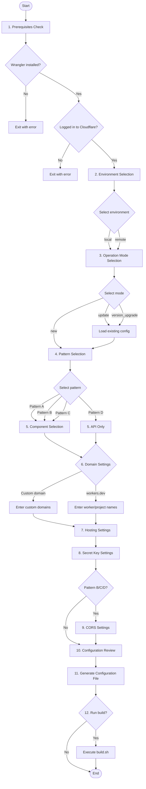
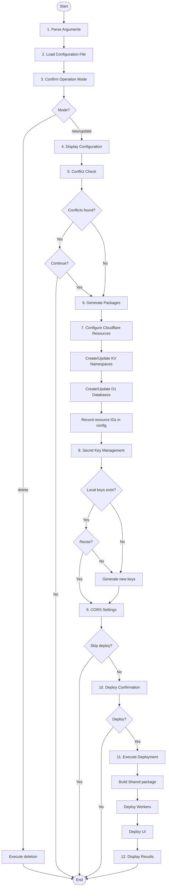

# Authrim Script Improvement Implementation Specification

**Created:** 2025-01-17
**Version:** 1.0.0
**Purpose:** Technical specification for script improvements (to be deleted after implementation is complete)

---

## Table of Contents

1. [Overview](#overview)
2. [Configuration File Schema](#configuration-file-schema)
3. [Configuration File Creation Script Specification](#configuration-file-creation-script-specification)
4. [Build Script Specification](#build-script-specification)
5. [Architecture Pattern Support](#architecture-pattern-support)
6. [Conflict Checking](#conflict-checking)
7. [Error Handling](#error-handling)
8. [Integration with Existing Scripts](#integration-with-existing-scripts)

---

## Overview

### Goals

Consolidate scripts that users execute into **two**:

1. **`setup-config.sh`** - Configuration file creation script
2. **`build.sh`** - Build script

### Implementation Policy

- Support all 4 patterns (A-D) from ARCHITECTURE_PATTERNS.md
- Declarative setup based on configuration files
- Internally integrate or reuse existing script logic
- Interactive user experience
- Version management and gradual upgrade support

---

## Configuration File Schema

### File Format

- **Format:** JSON
- **Filename:** `authrim-config-{version}.json`
- **Location:** Project root (add to `.gitignore`)

### Schema Definition

```json
{
  "$schema": "http://json-schema.org/draft-07/schema#",
  "type": "object",
  "required": ["version", "created_at", "environment", "pattern", "cloudflare"],
  "properties": {
    "version": {
      "type": "string",
      "description": "Configuration file version (e.g., 1.0.0)"
    },
    "created_at": {
      "type": "string",
      "format": "date-time",
      "description": "Configuration file creation date (ISO 8601 format)"
    },
    "updated_at": {
      "type": "string",
      "format": "date-time",
      "description": "Configuration file update date (ISO 8601 format)"
    },
    "environment": {
      "type": "string",
      "enum": ["local", "remote"],
      "description": "Local development environment or remote environment"
    },
    "operation_mode": {
      "type": "string",
      "enum": ["new", "update", "version_upgrade"],
      "description": "New creation, modify existing configuration, or version upgrade"
    },
    "pattern": {
      "type": "string",
      "enum": ["pattern-a", "pattern-b", "pattern-c", "pattern-d"],
      "description": "Deployment pattern"
    },
    "components": {
      "type": "object",
      "description": "Configuration for each component",
      "properties": {
        "api": {
          "type": "object",
          "required": ["enabled"],
          "properties": {
            "enabled": {
              "type": "boolean",
              "description": "Whether to enable API"
            },
            "custom_domain": {
              "type": "boolean",
              "description": "Whether to use custom domain"
            },
            "domain": {
              "type": "string",
              "description": "Domain name (e.g., https://id.example.com)",
              "format": "uri"
            },
            "worker_name": {
              "type": "string",
              "description": "Worker name (when not using custom domain)"
            }
          }
        },
        "login_page": {
          "type": "object",
          "required": ["enabled"],
          "properties": {
            "enabled": {
              "type": "boolean",
              "description": "Whether to enable Login Page"
            },
            "hosting": {
              "type": "string",
              "enum": ["cloudflare-pages", "external"],
              "description": "Hosting method"
            },
            "custom_domain": {
              "type": "boolean",
              "description": "Whether to use custom domain"
            },
            "domain": {
              "type": "string",
              "description": "Domain name (e.g., https://login.example.com)",
              "format": "uri"
            },
            "pages_project_name": {
              "type": "string",
              "description": "Pages project name (when not using custom domain)"
            }
          }
        },
        "admin_page": {
          "type": "object",
          "required": ["enabled"],
          "properties": {
            "enabled": {
              "type": "boolean",
              "description": "Whether to enable Admin Page"
            },
            "hosting": {
              "type": "string",
              "enum": ["cloudflare-pages", "external"],
              "description": "Hosting method"
            },
            "custom_domain": {
              "type": "boolean",
              "description": "Whether to use custom domain"
            },
            "domain": {
              "type": "string",
              "description": "Domain name (e.g., https://admin.example.com)",
              "format": "uri"
            },
            "pages_project_name": {
              "type": "string",
              "description": "Pages project name (when not using custom domain)"
            }
          }
        }
      }
    },
    "cloudflare": {
      "type": "object",
      "required": ["account_name"],
      "properties": {
        "account_name": {
          "type": "string",
          "description": "Cloudflare account name (for workers.dev usage)"
        },
        "account_id": {
          "type": "string",
          "description": "Cloudflare account ID (auto-fetched or manually entered)"
        },
        "use_router": {
          "type": "boolean",
          "description": "Whether to use Router Worker (for test environments)",
          "default": true
        }
      }
    },
    "secrets": {
      "type": "object",
      "properties": {
        "generate_keys": {
          "type": "boolean",
          "description": "Whether to generate secret keys",
          "default": true
        },
        "reuse_existing": {
          "type": "boolean",
          "description": "Whether to reuse existing keys",
          "default": false
        },
        "key_locations": {
          "type": "object",
          "properties": {
            "local": {
              "type": "string",
              "description": "Local key storage path",
              "default": ".keys/"
            },
            "remote_checked": {
              "type": "boolean",
              "description": "Whether remote keys were checked"
            }
          }
        }
      }
    },
    "resources": {
      "type": "object",
      "description": "Cloudflare resource configuration",
      "properties": {
        "kv_namespaces": {
          "type": "array",
          "description": "KV Namespace list",
          "items": {
            "type": "object",
            "properties": {
              "binding": {"type": "string"},
              "id": {"type": "string"},
              "preview_id": {"type": "string"}
            }
          }
        },
        "durable_objects": {
          "type": "array",
          "description": "Durable Objects list",
          "items": {
            "type": "object",
            "properties": {
              "name": {"type": "string"},
              "class_name": {"type": "string"},
              "script_name": {"type": "string"}
            }
          }
        },
        "d1_databases": {
          "type": "array",
          "description": "D1 Database list",
          "items": {
            "type": "object",
            "properties": {
              "binding": {"type": "string"},
              "database_name": {"type": "string"},
              "database_id": {"type": "string"}
            }
          }
        }
      }
    },
    "cors": {
      "type": "object",
      "description": "CORS configuration (for Pattern B, C)",
      "properties": {
        "enabled": {
          "type": "boolean",
          "description": "Whether to enable CORS"
        },
        "allowed_origins": {
          "type": "array",
          "items": {"type": "string"},
          "description": "Allowed origins list"
        },
        "allowed_patterns": {
          "type": "array",
          "items": {"type": "string"},
          "description": "Allowed origin patterns (regex)"
        }
      }
    }
  }
}
```

### Configuration File Examples

#### Pattern A (Unified Domain - Custom Domain)

```json
{
  "version": "1.0.0",
  "created_at": "2025-01-17T10:00:00Z",
  "environment": "remote",
  "operation_mode": "new",
  "pattern": "pattern-a",
  "components": {
    "api": {
      "enabled": true,
      "custom_domain": true,
      "domain": "https://id.example.com"
    },
    "login_page": {
      "enabled": true,
      "hosting": "cloudflare-pages",
      "custom_domain": true,
      "domain": "https://id.example.com"
    },
    "admin_page": {
      "enabled": true,
      "hosting": "cloudflare-pages",
      "custom_domain": true,
      "domain": "https://id.example.com"
    }
  },
  "cloudflare": {
    "account_name": "sgrastar",
    "use_router": true
  },
  "secrets": {
    "generate_keys": true,
    "reuse_existing": false
  },
  "cors": {
    "enabled": false
  }
}
```

#### Pattern A (Unified Domain - workers.dev, Development Environment)

```json
{
  "version": "1.0.0",
  "created_at": "2025-01-17T10:00:00Z",
  "environment": "local",
  "operation_mode": "new",
  "pattern": "pattern-a",
  "components": {
    "api": {
      "enabled": true,
      "custom_domain": false,
      "worker_name": "authrim"
    },
    "login_page": {
      "enabled": true,
      "hosting": "cloudflare-pages",
      "custom_domain": false,
      "pages_project_name": "authrim-login"
    },
    "admin_page": {
      "enabled": true,
      "hosting": "cloudflare-pages",
      "custom_domain": false,
      "pages_project_name": "authrim-admin"
    }
  },
  "cloudflare": {
    "account_name": "sgrastar",
    "use_router": true
  },
  "secrets": {
    "generate_keys": true,
    "reuse_existing": false
  },
  "cors": {
    "enabled": true,
    "allowed_origins": [
      "http://localhost:5173",
      "https://authrim-login.pages.dev",
      "https://authrim-admin.pages.dev"
    ]
  }
}
```

#### Pattern B (Separated Admin UI)

```json
{
  "version": "1.0.0",
  "created_at": "2025-01-17T10:00:00Z",
  "environment": "remote",
  "operation_mode": "new",
  "pattern": "pattern-b",
  "components": {
    "api": {
      "enabled": true,
      "custom_domain": true,
      "domain": "https://id.example.com"
    },
    "login_page": {
      "enabled": true,
      "hosting": "cloudflare-pages",
      "custom_domain": true,
      "domain": "https://id.example.com"
    },
    "admin_page": {
      "enabled": true,
      "hosting": "cloudflare-pages",
      "custom_domain": true,
      "domain": "https://admin.example.com"
    }
  },
  "cloudflare": {
    "account_name": "sgrastar",
    "use_router": true
  },
  "secrets": {
    "generate_keys": true,
    "reuse_existing": false
  },
  "cors": {
    "enabled": true,
    "allowed_origins": [
      "https://admin.example.com",
      "http://localhost:5173"
    ]
  }
}
```

#### Pattern C (Multi-Domain SSO)

```json
{
  "version": "1.0.0",
  "created_at": "2025-01-17T10:00:00Z",
  "environment": "remote",
  "operation_mode": "new",
  "pattern": "pattern-c",
  "components": {
    "api": {
      "enabled": true,
      "custom_domain": true,
      "domain": "https://api.example.com"
    },
    "login_page": {
      "enabled": true,
      "hosting": "cloudflare-pages",
      "custom_domain": true,
      "domain": "https://login.example.com"
    },
    "admin_page": {
      "enabled": true,
      "hosting": "cloudflare-pages",
      "custom_domain": true,
      "domain": "https://admin.example.com"
    }
  },
  "cloudflare": {
    "account_name": "sgrastar",
    "use_router": true
  },
  "secrets": {
    "generate_keys": true,
    "reuse_existing": false
  },
  "cors": {
    "enabled": true,
    "allowed_origins": [
      "https://login.example.com",
      "https://admin.example.com",
      "http://localhost:5173"
    ],
    "allowed_patterns": [
      "^https://.*\\.example\\.com$"
    ]
  }
}
```

#### Pattern D (Headless)

```json
{
  "version": "1.0.0",
  "created_at": "2025-01-17T10:00:00Z",
  "environment": "remote",
  "operation_mode": "new",
  "pattern": "pattern-d",
  "components": {
    "api": {
      "enabled": true,
      "custom_domain": false,
      "worker_name": "authrim"
    },
    "login_page": {
      "enabled": false
    },
    "admin_page": {
      "enabled": false
    }
  },
  "cloudflare": {
    "account_name": "sgrastar",
    "use_router": true
  },
  "secrets": {
    "generate_keys": true,
    "reuse_existing": false
  },
  "cors": {
    "enabled": true,
    "allowed_origins": ["*"]
  }
}
```

---

## Configuration File Creation Script Specification

### Script Name

`scripts/setup-config.sh`

### Process Flow



### Function Details

#### [1] Prerequisites Check

```bash
# Wrangler installation check
if ! command -v wrangler &> /dev/null; then
  echo "Error: Wrangler is not installed"
  echo "Install: npm install -g wrangler"
  exit 1
fi

# Cloudflare login check
if ! wrangler whoami &> /dev/null; then
  echo "Error: Not logged in to Cloudflare"
  echo "Login: wrangler login"
  exit 1
fi
```

#### [2] Environment Selection

```bash
echo "Select environment:"
echo "1) Local development environment (local)"
echo "2) Remote environment (remote)"
read -p "Selection [1-2]: " env_choice

case $env_choice in
  1) ENVIRONMENT="local" ;;
  2) ENVIRONMENT="remote" ;;
  *) echo "Invalid selection"; exit 1 ;;
esac
```

#### [3] Operation Mode Selection

```bash
echo "Select operation mode:"
echo "1) New creation"
echo "2) Modify existing configuration"
echo "3) Version upgrade (preserve existing settings)"
read -p "Selection [1-3]: " mode_choice

case $mode_choice in
  1) OPERATION_MODE="new" ;;
  2) OPERATION_MODE="update" ;;
  3) OPERATION_MODE="version_upgrade" ;;
  *) echo "Invalid selection"; exit 1 ;;
esac

# For modify/upgrade, load existing file
if [[ "$OPERATION_MODE" != "new" ]]; then
  echo "Select existing configuration file:"
  select config_file in authrim-config-*.json; do
    if [[ -f "$config_file" ]]; then
      EXISTING_CONFIG="$config_file"
      break
    else
      echo "File not found"
    fi
  done
fi
```

#### [4] Pattern Selection

```bash
echo "Select deployment pattern:"
echo "1) Pattern A - Unified Domain (recommended, simple)"
echo "2) Pattern B - Separated Admin UI (enhanced security)"
echo "3) Pattern C - Multi-Domain SSO (enterprise)"
echo "4) Pattern D - Headless (API only)"
read -p "Selection [1-4]: " pattern_choice

case $pattern_choice in
  1) PATTERN="pattern-a" ;;
  2) PATTERN="pattern-b" ;;
  3) PATTERN="pattern-c" ;;
  4) PATTERN="pattern-d" ;;
  *) echo "Invalid selection"; exit 1 ;;
esac
```

#### [5] Component Selection

```bash
# For Pattern D, only API is enabled
if [[ "$PATTERN" == "pattern-d" ]]; then
  ENABLE_API=true
  ENABLE_LOGIN_PAGE=false
  ENABLE_ADMIN_PAGE=false
else
  read -p "Enable API? [Y/n]: " enable_api
  ENABLE_API=${enable_api:-Y}

  read -p "Enable Login Page? [Y/n]: " enable_login
  ENABLE_LOGIN_PAGE=${enable_login:-Y}

  read -p "Enable Admin Page? [Y/n]: " enable_admin
  ENABLE_ADMIN_PAGE=${enable_admin:-Y}
fi
```

#### [6] Domain Settings

```bash
if [[ "$ENVIRONMENT" == "remote" ]]; then
  read -p "Use custom domain? [y/N]: " use_custom_domain

  if [[ "$use_custom_domain" =~ ^[Yy]$ ]]; then
    # Custom domain settings for each component
    if [[ "$ENABLE_API" == "Y" ]]; then
      read -p "Enter API custom domain (e.g., https://id.example.com): " api_domain
      API_CUSTOM_DOMAIN=true
      API_DOMAIN="$api_domain"
    fi

    if [[ "$ENABLE_LOGIN_PAGE" == "Y" ]]; then
      read -p "Enter Login Page custom domain (e.g., https://login.example.com): " login_domain
      LOGIN_CUSTOM_DOMAIN=true
      LOGIN_DOMAIN="$login_domain"
    fi

    if [[ "$ENABLE_ADMIN_PAGE" == "Y" ]]; then
      read -p "Enter Admin Page custom domain (e.g., https://admin.example.com): " admin_domain
      ADMIN_CUSTOM_DOMAIN=true
      ADMIN_DOMAIN="$admin_domain"
    fi
  else
    # Use workers.dev / pages.dev
    read -p "Enter Cloudflare account name: " account_name
    ACCOUNT_NAME="$account_name"

    if [[ "$ENABLE_API" == "Y" ]]; then
      read -p "Enter API Worker name [default: authrim]: " worker_name
      WORKER_NAME="${worker_name:-authrim}"
      API_DOMAIN="https://${WORKER_NAME}.${ACCOUNT_NAME}.workers.dev"
    fi

    if [[ "$ENABLE_LOGIN_PAGE" == "Y" ]]; then
      read -p "Enter Login Page project name [default: authrim-${ACCOUNT_NAME}-login]: " login_project
      LOGIN_PROJECT="${login_project:-authrim-${ACCOUNT_NAME}-login}"
      LOGIN_DOMAIN="https://${LOGIN_PROJECT}.pages.dev"
    fi

    if [[ "$ENABLE_ADMIN_PAGE" == "Y" ]]; then
      read -p "Enter Admin Page project name [default: authrim-${ACCOUNT_NAME}-admin]: " admin_project
      ADMIN_PROJECT="${admin_project:-authrim-${ACCOUNT_NAME}-admin}"
      ADMIN_DOMAIN="https://${ADMIN_PROJECT}.pages.dev"
    fi
  fi
fi
```

#### [7] Hosting Settings

```bash
if [[ "$ENABLE_LOGIN_PAGE" == "Y" ]]; then
  echo "Select Login Page hosting method:"
  echo "1) Cloudflare Pages"
  echo "2) External hosting"
  read -p "Selection [1-2]: " login_hosting_choice

  case $login_hosting_choice in
    1) LOGIN_HOSTING="cloudflare-pages" ;;
    2) LOGIN_HOSTING="external" ;;
    *) echo "Invalid selection"; exit 1 ;;
  esac
fi

if [[ "$ENABLE_ADMIN_PAGE" == "Y" ]]; then
  echo "Select Admin Page hosting method:"
  echo "1) Cloudflare Pages"
  echo "2) External hosting"
  read -p "Selection [1-2]: " admin_hosting_choice

  case $admin_hosting_choice in
    1) ADMIN_HOSTING="cloudflare-pages" ;;
    2) ADMIN_HOSTING="external" ;;
    *) echo "Invalid selection"; exit 1 ;;
  esac
fi
```

#### [8] Secret Key Settings

```bash
read -p "Generate secret keys? [Y/n]: " generate_keys
GENERATE_KEYS=${generate_keys:-Y}
```

#### [9] CORS Settings

```bash
# CORS settings required for Pattern B, C, D
if [[ "$PATTERN" == "pattern-b" ]] || [[ "$PATTERN" == "pattern-c" ]] || [[ "$PATTERN" == "pattern-d" ]]; then
  echo "Configuring CORS"
  echo "Enter allowed origins (comma-separated):"
  echo "Example: https://admin.example.com,http://localhost:5173"
  read -p "Origins: " cors_origins

  IFS=',' read -ra CORS_ORIGINS <<< "$cors_origins"

  read -p "Add pattern matching (regex)? [y/N]: " add_cors_patterns
  if [[ "$add_cors_patterns" =~ ^[Yy]$ ]]; then
    echo "Enter regex patterns (comma-separated):"
    echo "Example: ^https://.*\\.example\\.com$"
    read -p "Patterns: " cors_patterns
    IFS=',' read -ra CORS_PATTERNS <<< "$cors_patterns"
  fi
fi
```

#### [10] Configuration Review

```bash
echo "========================================="
echo "Configuration Review"
echo "========================================="
echo "Environment: $ENVIRONMENT"
echo "Operation Mode: $OPERATION_MODE"
echo "Pattern: $PATTERN"
echo ""
echo "Components:"
echo "  API: $ENABLE_API"
[[ "$ENABLE_API" == "Y" ]] && echo "    Domain: $API_DOMAIN"
echo "  Login Page: $ENABLE_LOGIN_PAGE"
[[ "$ENABLE_LOGIN_PAGE" == "Y" ]] && echo "    Domain: $LOGIN_DOMAIN"
echo "  Admin Page: $ENABLE_ADMIN_PAGE"
[[ "$ENABLE_ADMIN_PAGE" == "Y" ]] && echo "    Domain: $ADMIN_DOMAIN"
echo ""
echo "Cloudflare Account Name: $ACCOUNT_NAME"
echo "Generate Secret Keys: $GENERATE_KEYS"
echo "========================================="
read -p "Is this configuration correct? [Y/n]: " confirm
if [[ ! "$confirm" =~ ^[Yy]?$ ]]; then
  echo "Cancelled"
  exit 0
fi
```

#### [11] Generate Configuration File

```bash
# Determine version
VERSION="1.0.0"
if [[ "$OPERATION_MODE" != "new" ]]; then
  # Get version from existing config and increment
  EXISTING_VERSION=$(jq -r '.version' "$EXISTING_CONFIG")
  # Semantic versioning: increment minor version
  VERSION=$(echo "$EXISTING_VERSION" | awk -F. '{$2 = $2 + 1; print $1"."$2"."$3}')
fi

CONFIG_FILE="authrim-config-${VERSION}.json"

# Generate JSON
cat > "$CONFIG_FILE" <<EOF
{
  "version": "$VERSION",
  "created_at": "$(date -u +"%Y-%m-%dT%H:%M:%SZ")",
  "environment": "$ENVIRONMENT",
  "operation_mode": "$OPERATION_MODE",
  "pattern": "$PATTERN",
  "components": {
    "api": {
      "enabled": $([ "$ENABLE_API" == "Y" ] && echo "true" || echo "false"),
      "custom_domain": $([ "$API_CUSTOM_DOMAIN" == "true" ] && echo "true" || echo "false"),
      "domain": "$API_DOMAIN",
      "worker_name": "$WORKER_NAME"
    },
    "login_page": {
      "enabled": $([ "$ENABLE_LOGIN_PAGE" == "Y" ] && echo "true" || echo "false"),
      "hosting": "$LOGIN_HOSTING",
      "custom_domain": $([ "$LOGIN_CUSTOM_DOMAIN" == "true" ] && echo "true" || echo "false"),
      "domain": "$LOGIN_DOMAIN",
      "pages_project_name": "$LOGIN_PROJECT"
    },
    "admin_page": {
      "enabled": $([ "$ENABLE_ADMIN_PAGE" == "Y" ] && echo "true" || echo "false"),
      "hosting": "$ADMIN_HOSTING",
      "custom_domain": $([ "$ADMIN_CUSTOM_DOMAIN" == "true" ] && echo "true" || echo "false"),
      "domain": "$ADMIN_DOMAIN",
      "pages_project_name": "$ADMIN_PROJECT"
    }
  },
  "cloudflare": {
    "account_name": "$ACCOUNT_NAME",
    "use_router": true
  },
  "secrets": {
    "generate_keys": $([ "$GENERATE_KEYS" == "Y" ] && echo "true" || echo "false"),
    "reuse_existing": false
  },
  "cors": {
    "enabled": $([ "$PATTERN" != "pattern-a" ] && echo "true" || echo "false"),
    "allowed_origins": $(printf '%s\n' "${CORS_ORIGINS[@]}" | jq -R . | jq -s .),
    "allowed_patterns": $(printf '%s\n' "${CORS_PATTERNS[@]}" | jq -R . | jq -s .)
  }
}
EOF

# Format with jq
jq . "$CONFIG_FILE" > "$CONFIG_FILE.tmp" && mv "$CONFIG_FILE.tmp" "$CONFIG_FILE"

echo "Generated configuration file: $CONFIG_FILE"

# Add to .gitignore
if ! grep -q "authrim-config-*.json" .gitignore 2>/dev/null; then
  echo "authrim-config-*.json" >> .gitignore
  echo "Added to .gitignore"
fi
```

#### [12] Build Execution Confirmation

```bash
read -p "Run build? [Y/n]: " run_build
if [[ "$run_build" =~ ^[Yy]?$ ]]; then
  ./scripts/build.sh --config "$CONFIG_FILE"
else
  echo "You can run build later: ./scripts/build.sh --config $CONFIG_FILE"
fi
```

---

## Build Script Specification

### Script Name

`scripts/build.sh`

### Process Flow



### Function Details

#### [1] Parse Arguments

```bash
#!/bin/bash

CONFIG_FILE=""
MODE=""
SKIP_DEPLOY=false

while [[ $# -gt 0 ]]; do
  case $1 in
    --config)
      CONFIG_FILE="$2"
      shift 2
      ;;
    --mode)
      MODE="$2"
      shift 2
      ;;
    --skip-deploy)
      SKIP_DEPLOY=true
      shift
      ;;
    *)
      echo "Unknown option: $1"
      exit 1
      ;;
  esac
done
```

#### [2] Load Configuration File

```bash
if [[ -z "$CONFIG_FILE" ]]; then
  echo "Select configuration file:"
  select config_file in authrim-config-*.json; do
    if [[ -f "$config_file" ]]; then
      CONFIG_FILE="$config_file"
      break
    else
      echo "File not found"
    fi
  done
fi

if [[ ! -f "$CONFIG_FILE" ]]; then
  echo "Error: Configuration file not found: $CONFIG_FILE"
  exit 1
fi

echo "Loaded configuration file: $CONFIG_FILE"

# Read configuration values with jq
ENVIRONMENT=$(jq -r '.environment' "$CONFIG_FILE")
PATTERN=$(jq -r '.pattern' "$CONFIG_FILE")
OPERATION_MODE=$(jq -r '.operation_mode' "$CONFIG_FILE")
# ... read all required values
```

#### [3] Confirm Operation Mode

```bash
if [[ -z "$MODE" ]]; then
  echo "Select operation mode:"
  echo "1) New build (add)"
  echo "2) Modify existing configuration"
  echo "3) Delete/initialize data"
  read -p "Selection [1-3]: " mode_choice

  case $mode_choice in
    1) MODE="new" ;;
    2) MODE="update" ;;
    3) MODE="delete" ;;
    *) echo "Invalid selection"; exit 1 ;;
  esac
fi

# Confirmation for delete mode
if [[ "$MODE" == "delete" ]]; then
  echo "Warning: All resources and data will be deleted"
  read -p "Are you sure you want to delete? [yes/no]: " confirm_delete
  if [[ "$confirm_delete" != "yes" ]]; then
    echo "Cancelled"
    exit 0
  fi
fi
```

#### [4] Display Configuration

```bash
echo "========================================="
echo "Configuration"
echo "========================================="
echo "Environment: $ENVIRONMENT"
echo "Pattern: $PATTERN"
echo "Operation Mode: $MODE"
echo ""

jq -r '
  "Components:",
  "  API: \(.components.api.enabled)",
  (if .components.api.enabled then "    Domain: \(.components.api.domain)" else "" end),
  "  Login Page: \(.components.login_page.enabled)",
  (if .components.login_page.enabled then "    Domain: \(.components.login_page.domain)" else "" end),
  "  Admin Page: \(.components.admin_page.enabled)",
  (if .components.admin_page.enabled then "    Domain: \(.components.admin_page.domain)" else "" end),
  "",
  "Cloudflare Account Name: \(.cloudflare.account_name)",
  "Generate Secret Keys: \(.secrets.generate_keys)"
' "$CONFIG_FILE"

echo "========================================="
```

#### [5] Conflict Check

```bash
check_conflicts() {
  echo "Checking remote resources..."

  # Check Workers
  if jq -e '.components.api.enabled' "$CONFIG_FILE" &>/dev/null; then
    WORKER_NAME=$(jq -r '.components.api.worker_name // ""' "$CONFIG_FILE")
    if [[ -n "$WORKER_NAME" ]]; then
      if wrangler deployments list --name="$WORKER_NAME" &>/dev/null; then
        echo "Warning: Worker '$WORKER_NAME' already exists"
        CONFLICTS=true
      fi
    fi
  fi

  # Check KV Namespaces
  EXISTING_KV=$(wrangler kv namespace list --json 2>/dev/null)
  # Compare with KV list
  # ...

  # Check Durable Objects
  # ...

  # Check D1 Databases
  EXISTING_D1=$(wrangler d1 list --json 2>/dev/null)
  # Compare with D1 list
  # ...

  if [[ "$CONFLICTS" == "true" ]]; then
    echo ""
    echo "Warning: Conflicts detected with existing resources"
    read -p "Continue? [y/N]: " continue_confirm
    if [[ ! "$continue_confirm" =~ ^[Yy]$ ]]; then
      echo "Cancelled"
      exit 0
    fi
  else
    echo "No conflicts detected"
  fi
}

if [[ "$MODE" != "delete" ]]; then
  check_conflicts
fi
```

#### [6] Generate Packages

```bash
generate_packages() {
  echo "Generating package configuration..."

  # Generate wrangler.toml for each worker
  # Generate appropriate configuration by pattern

  case "$PATTERN" in
    pattern-a)
      generate_pattern_a_config
      ;;
    pattern-b)
      generate_pattern_b_config
      ;;
    pattern-c)
      generate_pattern_c_config
      ;;
    pattern-d)
      generate_pattern_d_config
      ;;
  esac

  # Generate .dev.vars (local environment)
  if [[ "$ENVIRONMENT" == "local" ]]; then
    generate_dev_vars
  fi
}

generate_pattern_a_config() {
  # Generate wrangler.toml for Pattern A
  # Unified domain configuration

  API_DOMAIN=$(jq -r '.components.api.domain' "$CONFIG_FILE")
  ACCOUNT_NAME=$(jq -r '.cloudflare.account_name' "$CONFIG_FILE")

  # router worker
  cat > packages/router/wrangler.toml <<EOF
name = "authrim-router"
main = "src/index.ts"
compatibility_date = "2025-01-01"

[env.production]
name = "authrim-router"
route = { pattern = "$API_DOMAIN/*", custom_domain = true }
EOF

  # Individual workers
  # ...
}

generate_dev_vars() {
  # Generate .dev.vars
  API_DOMAIN=$(jq -r '.components.api.domain' "$CONFIG_FILE")
  LOGIN_DOMAIN=$(jq -r '.components.login_page.domain' "$CONFIG_FILE")
  ADMIN_DOMAIN=$(jq -r '.components.admin_page.domain' "$CONFIG_FILE")

  cat > .dev.vars <<EOF
ISSUER_URL=$API_DOMAIN
PUBLIC_API_BASE_URL=$API_DOMAIN
ADMIN_UI_ORIGIN=$ADMIN_DOMAIN,$LOGIN_DOMAIN,http://localhost:5173
EOF
}
```

#### [7] Configure Cloudflare Resources

```bash
setup_cloudflare_resources() {
  echo "Configuring Cloudflare resources..."

  # KV Namespace
  setup_kv_namespaces

  # Durable Objects
  # (Defined in wrangler.toml, automatically created during deployment)

  # D1 Database
  setup_d1_databases

  # Record resource IDs in configuration file
  update_config_with_resource_ids
}

setup_kv_namespaces() {
  echo "Setting up KV Namespaces..."

  # Required KV list
  KV_BINDINGS=("AUTH_CODES" "CLIENTS" "REFRESH_TOKENS" "SESSIONS" "SETTINGS_KV")

  for binding in "${KV_BINDINGS[@]}"; do
    # Check existing
    existing_id=$(jq -r --arg binding "$binding" \
      '.resources.kv_namespaces[] | select(.binding == $binding) | .id' \
      "$CONFIG_FILE" 2>/dev/null)

    if [[ -n "$existing_id" && "$existing_id" != "null" ]]; then
      echo "  $binding: Using existing Namespace (ID: $existing_id)"
    else
      # Create new
      result=$(wrangler kv namespace create "$binding" --json 2>/dev/null)
      namespace_id=$(echo "$result" | jq -r '.id')

      echo "  $binding: Created (ID: $namespace_id)"

      # Add to configuration file
      jq --arg binding "$binding" --arg id "$namespace_id" \
        '.resources.kv_namespaces += [{"binding": $binding, "id": $id}]' \
        "$CONFIG_FILE" > "$CONFIG_FILE.tmp" && mv "$CONFIG_FILE.tmp" "$CONFIG_FILE"
    fi
  done
}

setup_d1_databases() {
  echo "Setting up D1 Database..."

  DB_NAME="authrim-users-db"

  existing_id=$(jq -r --arg name "$DB_NAME" \
    '.resources.d1_databases[] | select(.database_name == $name) | .database_id' \
    "$CONFIG_FILE" 2>/dev/null)

  if [[ -n "$existing_id" && "$existing_id" != "null" ]]; then
    echo "  $DB_NAME: Using existing Database (ID: $existing_id)"
  else
    # Create new
    result=$(wrangler d1 create "$DB_NAME" --json 2>/dev/null)
    db_id=$(echo "$result" | jq -r '.database_id')

    echo "  $DB_NAME: Created (ID: $db_id)"

    # Execute migration
    wrangler d1 execute "$DB_NAME" --file=./migrations/0001_initial.sql

    # Add to configuration file
    jq --arg name "$DB_NAME" --arg id "$db_id" \
      '.resources.d1_databases += [{"binding": "USERS_DB", "database_name": $name, "database_id": $id}]' \
      "$CONFIG_FILE" > "$CONFIG_FILE.tmp" && mv "$CONFIG_FILE.tmp" "$CONFIG_FILE"
  fi
}
```

#### [8] Secret Key Management

```bash
setup_secrets() {
  GENERATE_KEYS=$(jq -r '.secrets.generate_keys' "$CONFIG_FILE")

  if [[ "$GENERATE_KEYS" == "true" ]]; then
    echo "Setting up secret keys..."

    # Check for existing local keys
    if [[ -f ".keys/private.pem" && -f ".keys/public.pem" ]]; then
      echo "Existing keys found locally"
      read -p "Use existing keys? [Y/n]: " use_existing
      if [[ ! "$use_existing" =~ ^[Nn]$ ]]; then
        REUSE_LOCAL_KEYS=true
      fi
    fi

    # Check for existing remote keys
    if wrangler secret list --name="authrim-shared" 2>/dev/null | grep -q "RSA_PRIVATE_KEY"; then
      echo "Existing keys found remotely"
      read -p "Use existing remote keys? [Y/n]: " use_remote
      if [[ ! "$use_remote" =~ ^[Nn]$ ]]; then
        REUSE_REMOTE_KEYS=true
      fi
    fi

    # Generate new keys
    if [[ "$REUSE_LOCAL_KEYS" != "true" && "$REUSE_REMOTE_KEYS" != "true" ]]; then
      echo "Generating new keys..."
      mkdir -p .keys

      # Generate RSA keys
      openssl genrsa -out .keys/private.pem 2048
      openssl rsa -in .keys/private.pem -pubout -out .keys/public.pem

      echo "Generated keys: .keys/private.pem, .keys/public.pem"
    fi

    # Upload to remote
    if [[ "$REUSE_REMOTE_KEYS" != "true" ]]; then
      echo "Uploading secret keys to Cloudflare..."
      cat .keys/private.pem | wrangler secret put RSA_PRIVATE_KEY --name="authrim-shared"
      cat .keys/public.pem | wrangler secret put RSA_PUBLIC_KEY --name="authrim-shared"
      echo "Secret keys uploaded"
    fi
  fi
}
```

#### [9] CORS Settings

```bash
setup_cors() {
  CORS_ENABLED=$(jq -r '.cors.enabled' "$CONFIG_FILE")

  if [[ "$CORS_ENABLED" == "true" ]]; then
    echo "Applying CORS settings..."

    # Save to KV
    CORS_SETTINGS=$(jq -c '.cors' "$CONFIG_FILE")

    # Save to SETTINGS_KV
    echo "$CORS_SETTINGS" | wrangler kv key put "cors_settings" \
      --binding=SETTINGS_KV \
      --path=/dev/stdin

    echo "CORS settings saved"
  fi
}
```

#### [10-11] Deploy Confirmation and Execution

```bash
deploy() {
  if [[ "$SKIP_DEPLOY" == "true" ]]; then
    echo "Deployment skipped (--skip-deploy)"
    return
  fi

  read -p "Execute deployment? [Y/n]: " run_deploy
  if [[ ! "$run_deploy" =~ ^[Yy]?$ ]]; then
    echo "Deployment skipped"
    echo "You can run later: pnpm run deploy:with-router"
    return
  fi

  echo "Starting deployment..."

  # Build Shared package
  echo "Building Shared package..."
  pnpm --filter=shared build

  # Deploy each Worker (sequential, with retry)
  deploy_workers

  # Deploy UI
  deploy_ui

  echo "Deployment complete"
  show_deployment_urls
}

deploy_workers() {
  # Integrate existing deploy-with-retry.sh logic
  # Or call directly

  if [[ -f "scripts/deploy-with-retry.sh" ]]; then
    ./scripts/deploy-with-retry.sh
  else
    # Sequential deployment
    WORKERS=("shared" "op-discovery" "op-auth" "op-token" "op-userinfo" "op-management")
    USE_ROUTER=$(jq -r '.cloudflare.use_router' "$CONFIG_FILE")

    if [[ "$USE_ROUTER" == "true" ]]; then
      WORKERS+=("router")
    fi

    for worker in "${WORKERS[@]}"; do
      echo "Deploying: $worker"
      pnpm --filter="$worker" deploy
      sleep 10  # Avoid rate limit
    done
  fi
}

deploy_ui() {
  ENABLE_LOGIN=$(jq -r '.components.login_page.enabled' "$CONFIG_FILE")
  ENABLE_ADMIN=$(jq -r '.components.admin_page.enabled' "$CONFIG_FILE")

  if [[ "$ENABLE_LOGIN" == "true" ]] || [[ "$ENABLE_ADMIN" == "true" ]]; then
    echo "Deploying UI..."
    pnpm run deploy:ui
  fi
}

show_deployment_urls() {
  echo "========================================="
  echo "Deployment Complete!"
  echo "========================================="

  API_DOMAIN=$(jq -r '.components.api.domain' "$CONFIG_FILE")
  LOGIN_DOMAIN=$(jq -r '.components.login_page.domain' "$CONFIG_FILE")
  ADMIN_DOMAIN=$(jq -r '.components.admin_page.domain' "$CONFIG_FILE")

  echo "API: $API_DOMAIN"
  echo "Login Page: $LOGIN_DOMAIN"
  echo "Admin Page: $ADMIN_DOMAIN"
  echo "========================================="
}
```

#### [12] Delete Mode

```bash
delete_all_resources() {
  echo "Deleting all resources..."

  # Call existing delete-all.sh, or integrate
  if [[ -f "scripts/delete-all.sh" ]]; then
    ./scripts/delete-all.sh
  else
    # Delete Workers
    # Delete KV
    # Delete D1
    # Delete DO (automatic)
    # ...
  fi

  echo "All resources deleted"
}
```

---

## Architecture Pattern Support

### Pattern A: Unified Domain

#### Environment Variable Settings

**With Custom Domain:**

```bash
# .dev.vars (local)
ISSUER_URL=https://id.example.com
PUBLIC_API_BASE_URL=https://id.example.com
CORS_ORIGINS=https://id.example.com
```

**With workers.dev:**

```bash
# .dev.vars (local)
ISSUER_URL=https://authrim.sgrastar.workers.dev
PUBLIC_API_BASE_URL=https://authrim.sgrastar.workers.dev
ADMIN_UI_ORIGIN=https://authrim-login.pages.dev,https://authrim-admin.pages.dev,http://localhost:5173
CORS_ORIGINS=https://authrim-login.pages.dev,https://authrim-admin.pages.dev,http://localhost:5173
```

#### wrangler.toml Configuration

```toml
# With custom domain
[env.production]
name = "authrim-router"
route = { pattern = "id.example.com/*", custom_domain = true }

# With workers.dev
name = "authrim"
```

---

### Pattern B: Separated Admin UI

#### Environment Variable Settings

```bash
# API Worker (.dev.vars)
ISSUER_URL=https://id.example.com
PUBLIC_API_BASE_URL=https://id.example.com
ADMIN_UI_ORIGIN=https://admin.example.com,http://localhost:5173

# Admin UI (Cloudflare Pages environment variables)
PUBLIC_API_BASE_URL=https://id.example.com
PUBLIC_OIDC_BASE_URL=https://id.example.com
```

#### CORS Settings (KV)

```json
{
  "admin_origins": [
    "https://admin.example.com",
    "http://localhost:5173"
  ]
}
```

---

### Pattern C: Multi-Domain SSO

#### Environment Variable Settings

```bash
# API Worker (.dev.vars)
ISSUER_URL=https://api.example.com
PUBLIC_API_BASE_URL=https://api.example.com

# Login UI (Cloudflare Pages environment variables)
PUBLIC_API_BASE_URL=https://api.example.com
PUBLIC_OIDC_BASE_URL=https://api.example.com
PUBLIC_REDIRECT_URI=https://service1.com/callback

# Admin UI (Cloudflare Pages environment variables)
PUBLIC_API_BASE_URL=https://api.example.com
PUBLIC_OIDC_BASE_URL=https://api.example.com
```

#### CORS Settings (KV)

```json
{
  "allowed_origins": [
    "https://service1.com",
    "https://service2.net",
    "https://login.example.com",
    "https://admin.example.com",
    "http://localhost:5173"
  ],
  "allowed_patterns": [
    "^https://.*\\.example\\.com$",
    "^https://.*\\.pages\\.dev$"
  ]
}
```

---

### Pattern D: Headless

#### Environment Variable Settings

```bash
# API Worker (.dev.vars)
ISSUER_URL=https://authrim.sgrastar.workers.dev
PUBLIC_API_BASE_URL=https://authrim.sgrastar.workers.dev
CORS_ORIGINS=*
```

#### wrangler.toml Configuration

```toml
name = "authrim"
# UI is not deployed
```

---

## Conflict Checking

### Check Items

1. **Duplicate Worker Names**
   - `wrangler deployments list --name=<worker_name>`
   - Check if name conflicts with existing Workers

2. **Duplicate KV Namespace Names**
   - `wrangler kv namespace list --json`
   - Check if name conflicts with existing Namespaces

3. **Duplicate D1 Database Names**
   - `wrangler d1 list --json`
   - Check if name conflicts with existing Databases

4. **Durable Objects**
   - Durable Objects are automatically managed, no explicit check required
   - Automatically available when Worker is deployed

5. **Custom Domain Conflicts**
   - `wrangler domains list`
   - Check if conflicts with existing domain settings

### Behavior When Conflicts Detected

- **Display Warning**: Notify that there are duplicates with existing resources
- **Ask User**: Choose to continue or cancel
- **update mode**: Continue if updating existing resources
- **new mode**: Treat duplicates as errors

### Conflict Resolution Strategies

1. **Change Resource Name**
   - Have user enter a different name
   - Automatically add suffix (e.g., `authrim-2`)

2. **Reuse Existing Resources**
   - Reuse existing KV, D1
   - Record ID in configuration file

3. **Delete and Recreate**
   - Delete existing resources and create new ones
   - Risk of data loss, confirmation required

---

## Error Handling

### Error Categories

1. **Prerequisites Errors**
   - Wrangler not installed
   - Not logged in to Cloudflare
   - Required packages (jq, openssl, etc.) not installed

2. **Configuration Errors**
   - Invalid configuration file (JSON parse error)
   - Missing required fields
   - Invalid values (e.g., invalid URL)

3. **Resource Errors**
   - KV creation failure
   - D1 creation failure
   - Worker deployment failure

4. **Network Errors**
   - Cloudflare API connection error
   - Rate limit exceeded

### Error Handling Strategy

```bash
# Error trap
set -e  # Exit immediately on error
trap 'error_handler $? $LINENO' ERR

error_handler() {
  local exit_code=$1
  local line_number=$2
  echo "Error occurred (line: $line_number, code: $exit_code)"
  echo "Please check the logs for details"
  exit $exit_code
}

# Retry logic
retry() {
  local max_attempts=3
  local attempt=1
  local delay=5

  while [ $attempt -le $max_attempts ]; do
    if "$@"; then
      return 0
    else
      echo "Failed. Retrying... ($attempt/$max_attempts)"
      sleep $delay
      delay=$((delay * 2))  # Exponential backoff
      attempt=$((attempt + 1))
    fi
  done

  echo "Maximum retry attempts reached"
  return 1
}

# Usage example
retry wrangler kv namespace create AUTH_CODES
```

### Rollback Strategy

Rollback when errors occur during deployment:

```bash
rollback() {
  echo "Error occurred. Executing rollback..."

  # Record created resources
  # Delete on error

  if [[ -n "$CREATED_KV_IDS" ]]; then
    for kv_id in $CREATED_KV_IDS; do
      wrangler kv namespace delete --namespace-id="$kv_id"
    done
  fi

  if [[ -n "$CREATED_D1_IDS" ]]; then
    for d1_id in $CREATED_D1_IDS; do
      wrangler d1 delete "$d1_id"
    done
  fi

  echo "Rollback complete"
}

trap rollback ERR
```

---

## Integration with Existing Scripts

### Integration Policy

**Internally call** or **integrate logic** from existing scripts:

1. **setup-kv.sh** → Integrate into `build.sh` (`setup_kv_namespaces()`)
2. **setup-d1.sh** → Integrate into `build.sh` (`setup_d1_databases()`)
3. **setup-secrets.sh** → Integrate into `build.sh` (`setup_secrets()`)
4. **deploy-with-retry.sh** → Call from `build.sh` (`deploy_workers()`)
5. **delete-all.sh** → Call from `build.sh` (delete mode)

### Preserving Existing Scripts

- **Backward Compatibility**: Keep existing scripts, mark as deprecated
- **Documentation Updates**: Document new workflow in `DEVELOPMENT.md`, `CLAUDE.md`
- **Migration Guide**: Provide migration instructions for existing users

### Deprecation

```bash
# Add to top of setup-kv.sh
echo "Warning: This script is deprecated"
echo "New workflow: Use ./scripts/setup-config.sh"
read -p "Continue? [y/N]: " continue
if [[ ! "$continue" =~ ^[Yy]$ ]]; then
  exit 0
fi
```

---

## Test Plan

### Unit Tests

- Verify each function works correctly
- Test error handling
- Test validation

### Integration Tests

1. **Pattern A (Custom Domain)**
   - Create configuration file
   - Execute build
   - Verify deployment

2. **Pattern A (workers.dev)**
   - Create configuration file
   - Execute build
   - Verify CORS functionality

3. **Pattern B**
   - Create configuration file
   - Execute build
   - Verify Admin UI separation
   - Verify CORS functionality

4. **Pattern C**
   - Create configuration file
   - Execute build
   - Verify multi-domain CORS

5. **Pattern D**
   - Create configuration file
   - Execute build (API only)
   - Verify UI deployment is skipped

### End-to-End Tests

- Verify operation in local environment
- Verify operation in remote environment
- Verify OIDC flow for each pattern

---

## Implementation Checklist

### Phase 1: Basic Functionality

- [ ] Define configuration file schema
- [ ] Implement `setup-config.sh`
  - [ ] Prerequisites check
  - [ ] Environment selection
  - [ ] Operation mode selection
  - [ ] Pattern selection
  - [ ] Component selection
  - [ ] Domain settings
  - [ ] Secret key settings
  - [ ] CORS settings
  - [ ] Configuration file generation
- [ ] Implement `build.sh`
  - [ ] Argument parsing
  - [ ] Configuration file loading
  - [ ] Operation mode confirmation
  - [ ] Configuration display
  - [ ] Conflict check
  - [ ] Package generation
  - [ ] Cloudflare resource setup
  - [ ] Secret key management
  - [ ] CORS settings
  - [ ] Deploy execution

### Phase 2: Pattern Support

- [ ] Pattern A (Custom Domain)
- [ ] Pattern A (workers.dev)
- [ ] Pattern B (Separated Admin UI)
- [ ] Pattern C (Multi-Domain SSO)
- [ ] Pattern D (Headless)

### Phase 3: Error Handling

- [ ] Error trap
- [ ] Retry logic
- [ ] Rollback functionality
- [ ] User-friendly error messages

### Phase 4: Documentation

- [ ] Update `DEVELOPMENT.md`
- [ ] Update `CLAUDE.md`
- [ ] Deprecate existing scripts
- [ ] Create migration guide

### Phase 5: Testing

- [ ] Unit tests
- [ ] Integration tests (each Pattern)
- [ ] End-to-end tests

### Phase 6: Cleanup

- [ ] Delete this document (`IMPLEMENTATION_SPEC.md`)
- [ ] Clean up unnecessary scripts (as needed)

---

## Summary

Based on this specification, implement the following two scripts:

1. **`setup-config.sh`** - Interactive configuration file creation
2. **`build.sh`** - Configuration file-based automated build

This enables a flexible and user-friendly setup environment that supports all four patterns (A-D) from ARCHITECTURE_PATTERNS.md.

---

**Created:** 2025-01-17
**Author:** Claude Code
**Status:** Ready for Implementation
