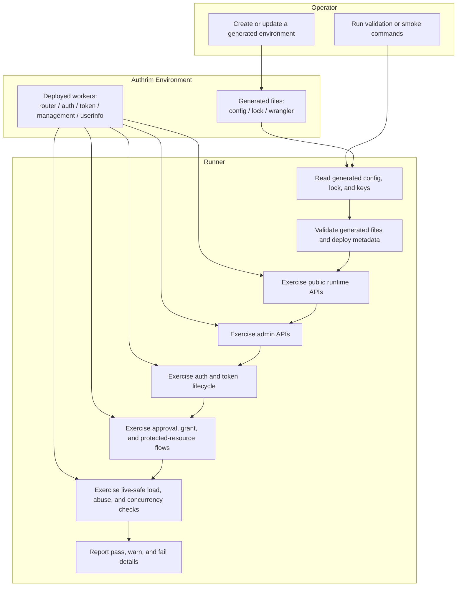
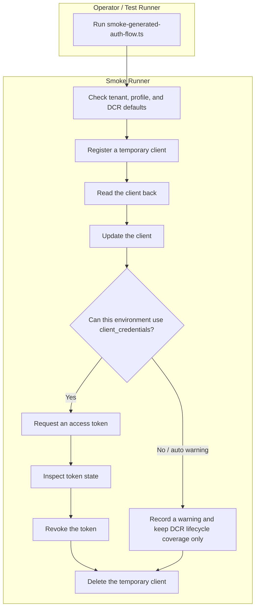
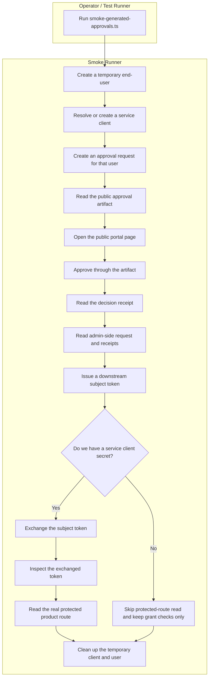
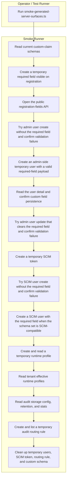
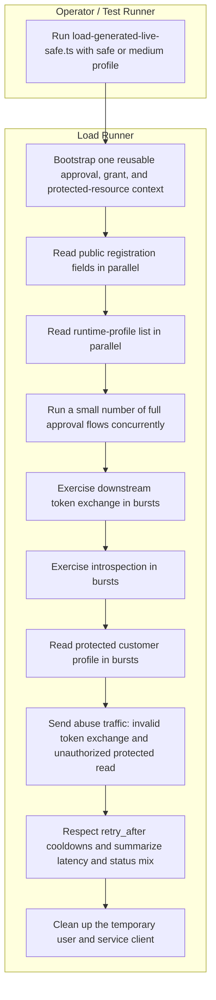

# Generated Environment Validation and Smoke Checks

This directory contains validation and smoke runners for generated Authrim environments such as
`.authrim/{env}`. These checks validate setup output, deployed workers, and real product surfaces
through supported APIs.

The same runners are intended to remain reusable if generated-environment validation later moves to
a shared test environment such as `test.authrim.com`.

Overall flow:



## Validate generated files

`validate-generated-env.ts` checks whether the setup output is internally consistent.

What it verifies:

- `config.json` and `lock.json` can be read
- `DB`, `DB_PII`, and `DB_ADMIN` match the generated lock
- the default profile resolves as a builtin or seeded profile
- the active default profile can execute from generated setup output alone
- generated `wrangler.toml` files match locked resources and active profile vars
- `.authrim/{env}/wrangler` stays in sync with package deploy copies

Usage:

```bash
pnpm exec tsx test/environment-validation/validate-generated-env.ts --env single
pnpm exec tsx test/environment-validation/validate-generated-env.ts --config /path/to/.authrim/single/config.json
pnpm exec tsx test/environment-validation/validate-generated-env.ts --env single --json
```

## Public API smoke

```bash
pnpm exec tsx test/environment-validation/smoke-generated-api.ts --env single
pnpm exec tsx test/environment-validation/smoke-generated-api.ts --config /path/to/.authrim/single/config.json
```

Main checks:

- `GET /api/health`
- `GET /.well-known/openid-configuration`
- `GET /.well-known/jwks.json`
- `GET /api/auth/health`
- `GET /api/auth/login-methods`

## Admin API smoke

```bash
pnpm exec tsx test/environment-validation/smoke-generated-admin-api.ts --env single
pnpm exec tsx test/environment-validation/smoke-generated-admin-api.ts --config /path/to/.authrim/single/config.json
```

Main checks:

- `GET /api/admin/stats`
- `GET /api/admin/runtime-profiles/defaults`
- `POST/GET/DELETE /api/admin/token-claim-rules`
- `POST/check/DELETE /api/admin/resource-permissions`
- `POST/GET/DELETE /api/admin/webhooks`
- `POST/GET/rotate/DELETE /api/admin/check-api-keys`

Notes:

- `ADMIN_API_SECRET` is loaded from generated keys by default
- if no `client_id` is available for `check-api-keys`, the runner creates a temporary DCR client
  and deletes it afterward

## Auth and client lifecycle smoke

```bash
pnpm exec tsx test/environment-validation/smoke-generated-auth-flow.ts --env single
pnpm exec tsx test/environment-validation/smoke-generated-auth-flow.ts --config /path/to/.authrim/single/config.json
```

Flow:



Main checks:

- `POST /register`
- `GET /clients/:client_id`
- `PUT /clients/:client_id`
- `DELETE /clients/:client_id`
- `POST /token` (`client_credentials`, mode=`auto|on|off`)
- `POST /introspect`
- `POST /revoke`

Notes:

- `client_credentials` can be disabled by tenant, profile, or feature configuration
- `--client-credentials auto` treats that case as a warning and still validates DCR lifecycle

## Approval, completion, receipt, grant, and protected-resource smoke

```bash
pnpm exec tsx test/environment-validation/smoke-generated-approvals.ts --env single
pnpm exec tsx test/environment-validation/smoke-generated-approvals.ts --config /path/to/.authrim/single/config.json
```

Flow:



Main checks:

- `POST /api/admin/users`
- `POST /api/admin/approvals`
- `GET /api/approval-artifacts/:artifactId`
- `POST /api/approval-artifacts/:artifactId/complete`
- `GET /api/approval-receipts/:receiptId`
- `GET /api/admin/approvals/:requestId`
- `GET /api/admin/approvals/:requestId/receipts`
- `POST /api/admin/approvals/:requestId/grants/:grantId/subject-token`
- `POST /token`
- `POST /introspect`
- `GET /api/protected/customer-profiles/:userId`
- `DELETE /api/admin/users/:userId`

Notes:

- the runner creates a temporary end-user and validates a simple `portal_confirm` approval path
- if no `--client-id` / `--client-secret` pair is provided, it creates a temporary service client
- if a service client secret is available, it validates token exchange and a real protected
  product route

## Server-side schema, profile, SCIM, and audit smoke

```bash
pnpm exec tsx test/environment-validation/smoke-generated-server-surfaces.ts --env single
pnpm exec tsx test/environment-validation/smoke-generated-server-surfaces.ts --config /path/to/.authrim/single/config.json
```

Flow:



Main checks:

- `GET /api/admin/custom-claims`
- `POST /api/admin/custom-claims`
- `GET /api/v1/registration-fields`
- `POST /api/admin/users`
- `GET /api/admin/users/:id`
- `PUT /api/admin/users/:id`
- `POST /api/admin/scim-tokens`
- `POST /scim/v2/Users`
- `GET /api/admin/runtime-profiles/defaults`
- `PUT/GET /api/admin/runtime-profiles/audit/:id`
- `GET /api/admin/runtime-profiles?kind=audit`
- `GET /api/admin/tenants/:id/runtime-profiles`
- `GET /api/admin/settings/audit-storage`
- `GET /api/admin/settings/audit-storage/retention`
- `POST/GET/DELETE /api/admin/settings/audit-storage/routing-rules`
- `GET /api/admin/settings/audit-storage/stats`

Notes:

- when `PROFILE_REGISTRY_BACKEND=kv`, `GET /api/admin/runtime-profiles?kind=audit` can be affected
  by Cloudflare KV list consistency
- this runner treats that as a runtime consistency note, not an automatic product failure
- successful runs can still include a warning detail for the runtime-profile list stage

Coverage summary:

- registration-field validation
- admin create/update validation
- custom-claims CRUD and persistence
- SCIM token and user provisioning validation
- runtime-profile defaults, CRUD, and effective resolution
- audit storage config, retention, routing, and stats
- generated setup / wrangler / lock consistency through `validate-generated-env.ts`
- token, introspection, revoke, token exchange, and protected-resource checks through the other
  smoke runners

## Live-safe load, abuse, and concurrency check

```bash
pnpm exec tsx test/environment-validation/load-generated-live-safe.ts --env single --profile safe
pnpm exec tsx test/environment-validation/load-generated-live-safe.ts --config /path/to/.authrim/single/config.json --profile medium --json
```

Flow:



Purpose:

- not a replacement for K6 benchmarking
- validates resilience and protective behavior against a real generated or deployed environment
- uses supported APIs only
- checks whether approval, downstream grant, and protected-resource flows keep working under bounded
  concurrent pressure

Main checks:

- `GET /api/v1/registration-fields`
- `GET /api/admin/runtime-profiles?kind=audit`
- `POST /token` (`urn:ietf:params:oauth:grant-type:token-exchange`)
- `POST /introspect`
- `GET /api/protected/customer-profiles/:userId`
- invalid token exchange abuse
- unauthorized protected-resource abuse
- concurrent approval flow (`portal_confirm`)

Observed `single` results on `2026-05-04`:

- `safe`
  - public registration fields: `50/50` success, `avg 79ms`, `p95 139ms`
  - runtime-profile list: `30/30` success, `avg 105ms`
  - approval full flow: `1/1` success, about `6.9s`
  - token exchange: `4/4` success, `avg 181ms`
  - introspection: early `429`, max `retry_after ~45s`
  - protected customer profile: `30/30` success, `avg 137ms`
  - invalid token exchange abuse: protective `429`
  - unauthorized protected read abuse: protective `403`
- `medium`
  - public registration fields: `1000/1000` success, `avg 98ms`
  - runtime-profile list: `300/300` success, `avg 69ms`
  - approval flow: `3/6` success, downstream `/token` `429` on failures
  - token exchange, introspection, and protected route become rate-limited before instability
  - invalid token exchange abuse: `400/429` only
  - unauthorized protected read abuse: `403/429` only
  - no `5xx` observed in the executed abuse paths

Interpretation:

- the dominant limiter in the current `single` environment is rate limiting on
  approval/grant/introspection/protected-resource surfaces
- the executed abuse paths failed protectively rather than through generic worker failure
- this is a resilience signal, not a sizing recommendation for `3000-10000 RPS`

## Explicitly out of scope

- full Admin UI / Login UI screen E2E
- full live coverage for every approval method such as `SMS`, `SMTP`, or `passkey`
